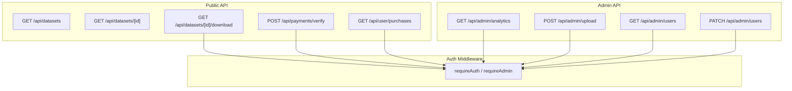
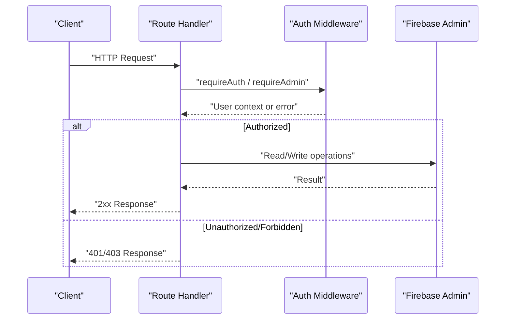
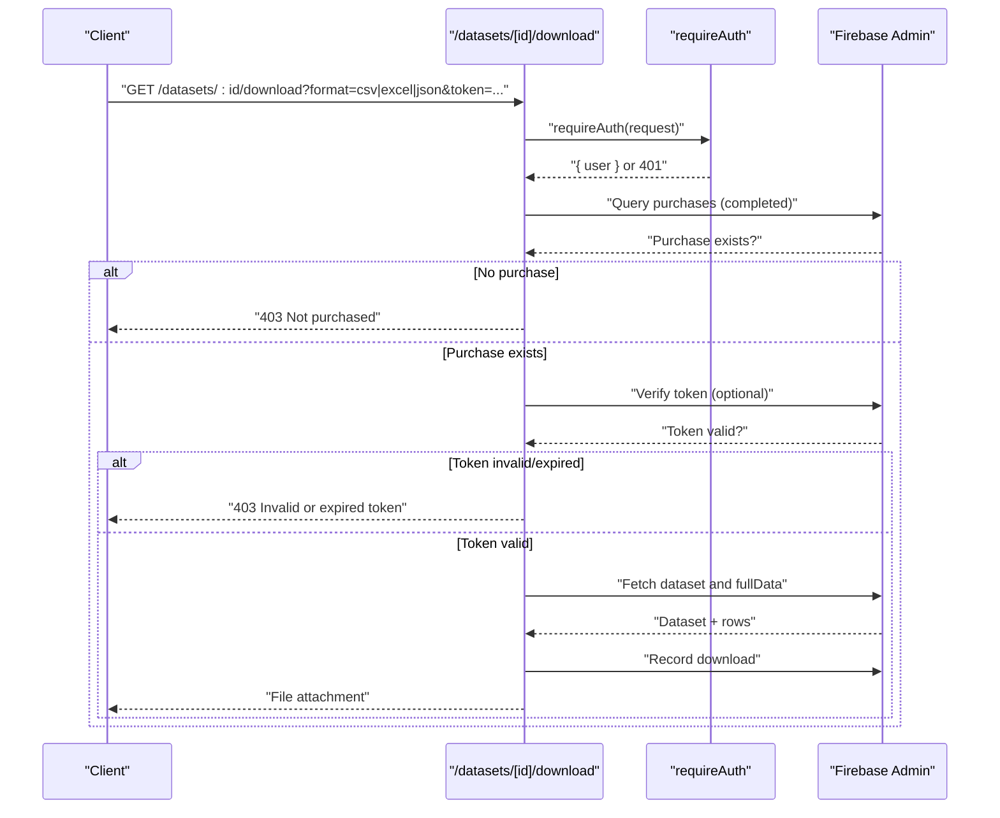
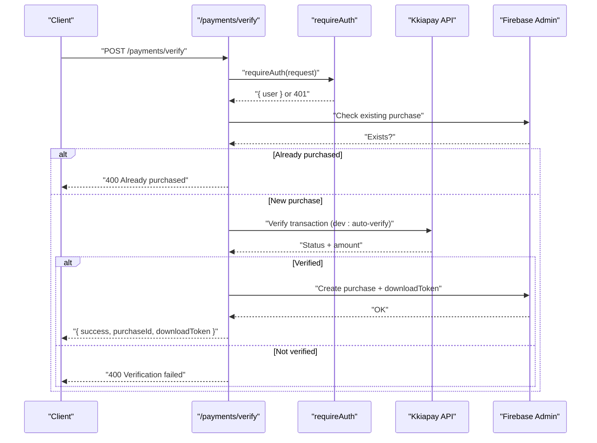
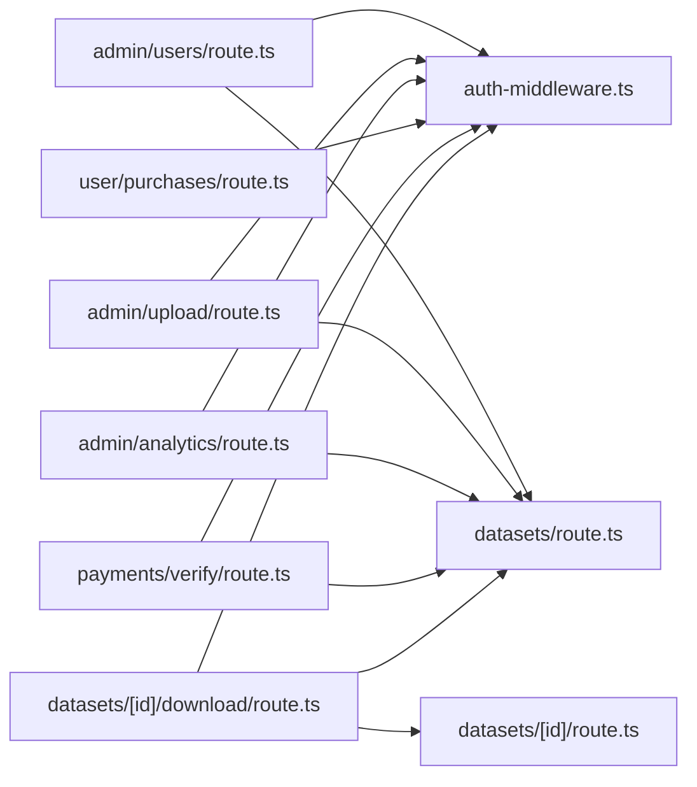
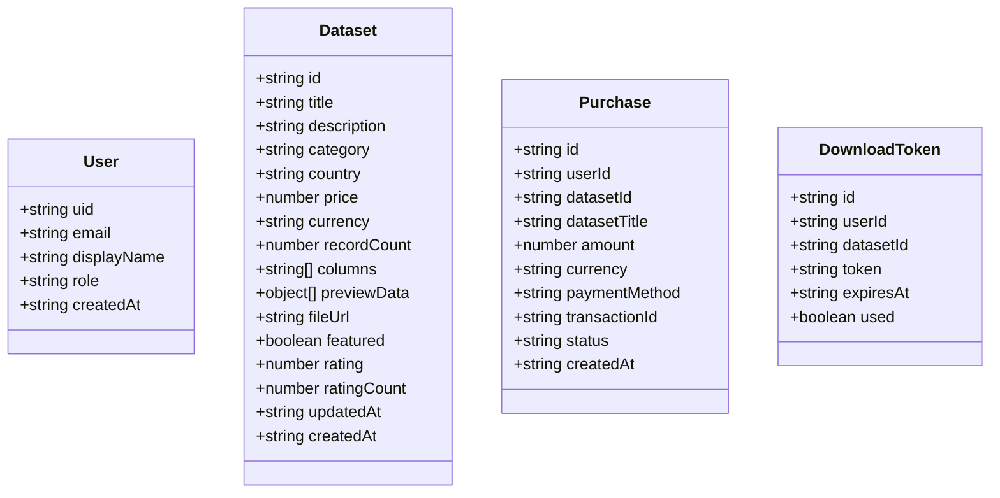

# API Reference

<cite>
**Referenced Files in This Document**
- [src/app/api/datasets/route.ts](file://src/app/api/datasets/route.ts)
- [src/app/api/datasets/[id]/route.ts](file://src/app/api/datasets/[id]/route.ts)
- [src/app/api/datasets/[id]/download/route.ts](file://src/app/api/datasets/[id]/download/route.ts)
- [src/app/api/admin/analytics/route.ts](file://src/app/api/admin/analytics/route.ts)
- [src/app/api/admin/upload/route.ts](file://src/app/api/admin/upload/route.ts)
- [src/app/api/admin/users/route.ts](file://src/app/api/admin/users/route.ts)
- [src/app/api/payments/verify/route.ts](file://src/app/api/payments/verify/route.ts)
- [src/app/api/user/purchases/route.ts](file://src/app/api/user/purchases/route.ts)
- [src/lib/auth-middleware.ts](file://src/lib/auth-middleware.ts)
- [src/types/index.ts](file://src/types/index.ts)
</cite>

## Table of Contents
1. [Introduction](#introduction)
2. [Project Structure](#project-structure)
3. [Core Components](#core-components)
4. [Architecture Overview](#architecture-overview)
5. [Detailed Component Analysis](#detailed-component-analysis)
6. [Dependency Analysis](#dependency-analysis)
7. [Performance Considerations](#performance-considerations)
8. [Troubleshooting Guide](#troubleshooting-guide)
9. [Conclusion](#conclusion)
10. [Appendices](#appendices)

## Introduction
This document provides a comprehensive API reference for Datafrica’s REST endpoints. It covers:
- Authentication APIs for login, registration, and retrieving user information
- Dataset management APIs for listing, filtering, viewing details, and downloading datasets
- Payment verification endpoints for confirming transactions and granting download access
- Admin APIs for analytics, dataset uploads, and user administration
- Request/response schemas, authentication requirements, error codes, and practical usage examples

Where applicable, endpoint URLs, HTTP methods, request parameters, response formats, and security considerations are documented. Rate limiting is not explicitly implemented in the codebase; therefore, it is not enforced at the API level.

## Project Structure
The API is organized under Next.js App Router conventions with route handlers grouped by feature:
- Authentication: user/me, auth/login, auth/register
- Datasets: datasets, datasets/[id], datasets/[id]/download
- Payments: payments/verify
- User: user/purchases
- Admin: admin/analytics, admin/upload, admin/users

**Diagram sources**
- [src/app/api/datasets/route.ts:1-62](file://src/app/api/datasets/route.ts#L1-L62)
- [src/app/api/datasets/[id]/route.ts](file://src/app/api/datasets/[id]/route.ts#L1-L29)
- [src/app/api/datasets/[id]/download/route.ts](file://src/app/api/datasets/[id]/download/route.ts#L1-L148)
- [src/app/api/payments/verify/route.ts:1-135](file://src/app/api/payments/verify/route.ts#L1-L135)
- [src/app/api/user/purchases/route.ts:1-31](file://src/app/api/user/purchases/route.ts#L1-L31)
- [src/app/api/admin/analytics/route.ts:1-78](file://src/app/api/admin/analytics/route.ts#L1-L78)
- [src/app/api/admin/upload/route.ts:1-93](file://src/app/api/admin/upload/route.ts#L1-L93)
- [src/app/api/admin/users/route.ts:1-54](file://src/app/api/admin/users/route.ts#L1-L54)
- [src/lib/auth-middleware.ts:1-48](file://src/lib/auth-middleware.ts#L1-L48)

**Section sources**
- [src/app/api/datasets/route.ts:1-62](file://src/app/api/datasets/route.ts#L1-L62)
- [src/app/api/datasets/[id]/route.ts](file://src/app/api/datasets/[id]/route.ts#L1-L29)
- [src/app/api/datasets/[id]/download/route.ts](file://src/app/api/datasets/[id]/download/route.ts#L1-L148)
- [src/app/api/admin/analytics/route.ts:1-78](file://src/app/api/admin/analytics/route.ts#L1-L78)
- [src/app/api/admin/upload/route.ts:1-93](file://src/app/api/admin/upload/route.ts#L1-L93)
- [src/app/api/admin/users/route.ts:1-54](file://src/app/api/admin/users/route.ts#L1-L54)
- [src/app/api/payments/verify/route.ts:1-135](file://src/app/api/payments/verify/route.ts#L1-L135)
- [src/app/api/user/purchases/route.ts:1-31](file://src/app/api/user/purchases/route.ts#L1-L31)
- [src/lib/auth-middleware.ts:1-48](file://src/lib/auth-middleware.ts#L1-L48)

## Core Components
- Authentication middleware enforces Bearer token-based authentication and admin checks.
- Dataset endpoints handle listing, filtering, and secure downloads gated by purchase verification and optional tokens.
- Payment verification integrates with external payment providers and records purchases.
- Admin endpoints provide analytics, dataset upload, and user administration.

**Section sources**
- [src/lib/auth-middleware.ts:1-48](file://src/lib/auth-middleware.ts#L1-L48)
- [src/types/index.ts:1-90](file://src/types/index.ts#L1-L90)

## Architecture Overview
The API relies on Firebase Admin for database operations and authentication. Requests are validated via middleware before accessing protected resources.

**Diagram sources**
- [src/lib/auth-middleware.ts:1-48](file://src/lib/auth-middleware.ts#L1-L48)
- [src/app/api/datasets/[id]/download/route.ts](file://src/app/api/datasets/[id]/download/route.ts#L1-L148)
- [src/app/api/payments/verify/route.ts:1-135](file://src/app/api/payments/verify/route.ts#L1-L135)
- [src/app/api/admin/analytics/route.ts:1-78](file://src/app/api/admin/analytics/route.ts#L1-L78)

## Detailed Component Analysis

### Authentication APIs
These endpoints are used to manage user sessions and identity. The backend verifies Firebase ID tokens provided in the Authorization header.

- Endpoint: POST /api/auth/login
  - Description: Authenticate user via Firebase ID token.
  - Headers:
    - Authorization: Bearer <id_token>
  - Response: User profile and authentication status.
  - Notes: Implementation details are not present in the provided routes; refer to client-side pages for usage patterns.

- Endpoint: POST /api/auth/register
  - Description: Register a new user and initialize Firestore user document.
  - Headers:
    - Authorization: Bearer <id_token>
  - Body: User metadata (e.g., email, displayName).
  - Response: Registration result and user ID.
  - Notes: Implementation details are not present in the provided routes; refer to client-side pages for usage patterns.

- Endpoint: GET /api/auth/me
  - Description: Retrieve current user profile.
  - Headers:
    - Authorization: Bearer <id_token>
  - Response: User object with uid, email, displayName, role, createdAt.
  - Security: Requires authentication.

Practical example (conceptual):
- curl -H "Authorization: Bearer <id_token>" https://yourdomain.com/api/auth/me

Security considerations:
- Use HTTPS in production.
- Store tokens securely on the client.
- Enforce admin checks for admin-only routes.

**Section sources**
- [src/lib/auth-middleware.ts:1-48](file://src/lib/auth-middleware.ts#L1-L48)

### Dataset Management APIs

#### List and Filter Datasets
- Endpoint: GET /api/datasets
  - Query parameters:
    - category: string
    - country: string
    - search: string
    - minPrice: number
    - maxPrice: number
    - featured: boolean ("true" to filter)
    - limit: number (default 50)
  - Response: { datasets: Dataset[] }
  - Filters:
    - Server-side: category, country, featured
    - Client-side: minPrice, maxPrice, search (title or description)
  - Pagination: limit controls server-side limit.

Example:
- curl "https://yourdomain.com/api/datasets?category=Business&country=Togo&limit=20"

**Section sources**
- [src/app/api/datasets/route.ts:1-62](file://src/app/api/datasets/route.ts#L1-L62)

#### Get Single Dataset Details
- Endpoint: GET /api/datasets/[id]
  - Path parameter:
    - id: string (dataset ID)
  - Response: { dataset: Dataset }
  - Errors: 404 if not found.

Example:
- curl https://yourdomain.com/api/datasets/dataset-id-here

**Section sources**
- [src/app/api/datasets/[id]/route.ts](file://src/app/api/datasets/[id]/route.ts#L1-L29)

#### Download Dataset
- Endpoint: GET /api/datasets/[id]/download
  - Path parameter:
    - id: string (dataset ID)
  - Query parameters:
    - format: csv | excel | json (default: csv)
    - token: string (optional download token)
  - Headers:
    - Authorization: Bearer <id_token>
  - Validation:
    - Must have completed purchase for the dataset.
    - Optional token must exist, not used, and not expired.
  - Response: File attachment (CSV/XLSX/JSON) based on format.
  - Errors: 401 (unauthorized), 403 (not purchased/token invalid/expired), 404 (dataset not found), 500 (server error).

Example:
- curl -H "Authorization: Bearer <id_token>" "https://yourdomain.com/api/datasets/dataset-id-here/download?format=excel"

**Diagram sources**
- [src/app/api/datasets/[id]/download/route.ts](file://src/app/api/datasets/[id]/download/route.ts#L1-L148)
- [src/lib/auth-middleware.ts:1-48](file://src/lib/auth-middleware.ts#L1-L48)

**Section sources**
- [src/app/api/datasets/[id]/download/route.ts](file://src/app/api/datasets/[id]/download/route.ts#L1-L148)

### Payment Verification APIs
- Endpoint: POST /api/payments/verify
  - Headers:
    - Authorization: Bearer <id_token>
  - Body:
    - transactionId: string
    - datasetId: string
    - paymentMethod: "kkiapay" | "stripe"
  - Validation:
    - Ensures the user hasn't already purchased the dataset.
    - Verifies payment via external provider (Kkiapay) or development auto-verification.
  - Response: { success: true, purchaseId: string, downloadToken: string }
  - Errors: 400 (missing fields, already purchased, verification failed), 404 (dataset not found), 500 (server error).

Example:
- curl -X POST https://yourdomain.com/api/payments/verify -H "Authorization: Bearer <id_token>" -H "Content-Type: application/json" -d '{"transactionId":"TXN123","datasetId":"dataset-id","paymentMethod":"kkiapay"}'

**Diagram sources**
- [src/app/api/payments/verify/route.ts:1-135](file://src/app/api/payments/verify/route.ts#L1-L135)
- [src/lib/auth-middleware.ts:1-48](file://src/lib/auth-middleware.ts#L1-L48)

**Section sources**
- [src/app/api/payments/verify/route.ts:1-135](file://src/app/api/payments/verify/route.ts#L1-L135)

### User Purchases API
- Endpoint: GET /api/user/purchases
  - Headers:
    - Authorization: Bearer <id_token>
  - Response: { purchases: Purchase[] }
  - Errors: 401 (unauthorized), 500 (server error).

Example:
- curl -H "Authorization: Bearer <id_token>" https://yourdomain.com/api/user/purchases

**Section sources**
- [src/app/api/user/purchases/route.ts:1-31](file://src/app/api/user/purchases/route.ts#L1-L31)

### Admin APIs

#### Analytics
- Endpoint: GET /api/admin/analytics
  - Headers:
    - Authorization: Bearer <id_token>
  - Validation: Admin-only
  - Response:
    - totalRevenue: number
    - totalSales: number
    - totalUsers: number
    - totalDatasets: number
    - recentSales: Purchase[]
    - topDatasets: array of { id, title, count, revenue }
  - Errors: 401 (unauthorized), 403 (forbidden), 500 (server error).

Example:
- curl -H "Authorization: Bearer <admin-token>" https://yourdomain.com/api/admin/analytics

**Section sources**
- [src/app/api/admin/analytics/route.ts:1-78](file://src/app/api/admin/analytics/route.ts#L1-L78)
- [src/lib/auth-middleware.ts:1-48](file://src/lib/auth-middleware.ts#L1-L48)

#### Upload Dataset (Admin)
- Endpoint: POST /api/admin/upload
  - Headers:
    - Authorization: Bearer <id_token>
    - Content-Type: multipart/form-data
  - Form fields:
    - file: CSV file
    - title: string
    - description: string
    - category: string
    - country: string
    - price: number
    - currency: string (default: XOF)
    - previewRows: number (default: 10)
    - featured: boolean ("true" to mark)
  - Response: { success: true, datasetId: string, recordCount: number, columns: string[] }
  - Errors: 400 (missing fields or CSV parse errors), 500 (server error).

Example:
- curl -X POST https://yourdomain.com/api/admin/upload -H "Authorization: Bearer <admin-token>" -F "file=@dataset.csv" -F "title=Dataset" -F "category=Business" -F "country=Togo" -F "price=1000"

**Section sources**
- [src/app/api/admin/upload/route.ts:1-93](file://src/app/api/admin/upload/route.ts#L1-L93)
- [src/lib/auth-middleware.ts:1-48](file://src/lib/auth-middleware.ts#L1-L48)

#### Manage Users (Admin)
- Endpoint: GET /api/admin/users
  - Headers:
    - Authorization: Bearer <id_token>
  - Response: { users: User[] }
  - Errors: 401 (unauthorized), 403 (forbidden), 500 (server error).

- Endpoint: PATCH /api/admin/users
  - Headers:
    - Authorization: Bearer <id_token>
  - Body:
    - userId: string
    - role: "user" | "admin"
  - Response: { success: true }
  - Errors: 400 (invalid payload), 401 (unauthorized), 403 (forbidden), 500 (server error).

Example:
- curl -X PATCH https://yourdomain.com/api/admin/users -H "Authorization: Bearer <admin-token>" -H "Content-Type: application/json" -d '{"userId":"uid","role":"admin"}'

**Section sources**
- [src/app/api/admin/users/route.ts:1-54](file://src/app/api/admin/users/route.ts#L1-L54)
- [src/lib/auth-middleware.ts:1-48](file://src/lib/auth-middleware.ts#L1-L48)

## Dependency Analysis
Key dependencies and relationships:
- All authenticated endpoints depend on requireAuth.
- Admin endpoints additionally depend on requireAdmin.
- Payment verification depends on external provider APIs and creates purchase records and download tokens.
- Dataset download depends on purchase verification and optional tokens.

**Diagram sources**
- [src/lib/auth-middleware.ts:1-48](file://src/lib/auth-middleware.ts#L1-L48)
- [src/app/api/datasets/route.ts:1-62](file://src/app/api/datasets/route.ts#L1-L62)
- [src/app/api/datasets/[id]/route.ts](file://src/app/api/datasets/[id]/route.ts#L1-L29)
- [src/app/api/datasets/[id]/download/route.ts](file://src/app/api/datasets/[id]/download/route.ts#L1-L148)
- [src/app/api/payments/verify/route.ts:1-135](file://src/app/api/payments/verify/route.ts#L1-L135)
- [src/app/api/user/purchases/route.ts:1-31](file://src/app/api/user/purchases/route.ts#L1-L31)
- [src/app/api/admin/analytics/route.ts:1-78](file://src/app/api/admin/analytics/route.ts#L1-L78)
- [src/app/api/admin/upload/route.ts:1-93](file://src/app/api/admin/upload/route.ts#L1-L93)
- [src/app/api/admin/users/route.ts:1-54](file://src/app/api/admin/users/route.ts#L1-L54)

**Section sources**
- [src/lib/auth-middleware.ts:1-48](file://src/lib/auth-middleware.ts#L1-L48)
- [src/app/api/datasets/route.ts:1-62](file://src/app/api/datasets/route.ts#L1-L62)
- [src/app/api/datasets/[id]/route.ts](file://src/app/api/datasets/[id]/route.ts#L1-L29)
- [src/app/api/datasets/[id]/download/route.ts](file://src/app/api/datasets/[id]/download/route.ts#L1-L148)
- [src/app/api/payments/verify/route.ts:1-135](file://src/app/api/payments/verify/route.ts#L1-L135)
- [src/app/api/user/purchases/route.ts:1-31](file://src/app/api/user/purchases/route.ts#L1-L31)
- [src/app/api/admin/analytics/route.ts:1-78](file://src/app/api/admin/analytics/route.ts#L1-L78)
- [src/app/api/admin/upload/route.ts:1-93](file://src/app/api/admin/upload/route.ts#L1-L93)
- [src/app/api/admin/users/route.ts:1-54](file://src/app/api/admin/users/route.ts#L1-L54)

## Performance Considerations
- Dataset listing applies server-side filters for category, country, featured, and pagination limit. Additional client-side filtering for price and search reduces Firestore query complexity but increases client processing.
- Full dataset data is stored in a subcollection and fetched in order by rowIndex. Batched writes during upload improve write throughput.
- Payment verification may incur network latency when calling external providers; consider caching or idempotency keys if extending the service.

[No sources needed since this section provides general guidance]

## Troubleshooting Guide
Common errors and resolutions:
- 401 Unauthorized
  - Cause: Missing or invalid Bearer token.
  - Resolution: Ensure Authorization header is present and valid.
- 403 Forbidden
  - Cause: Non-admin access to admin endpoints or insufficient permissions.
  - Resolution: Authenticate as admin.
- 403 Not Purchased
  - Cause: Attempting to download without a completed purchase.
  - Resolution: Call payment verification to create a purchase and obtain a download token.
- 403 Invalid or Expired Token
  - Cause: Provided download token is missing, used, or expired.
  - Resolution: Request a new token after a successful payment verification.
- 404 Dataset Not Found
  - Cause: Dataset ID does not exist.
  - Resolution: Verify dataset ID.
- 400 Bad Request
  - Cause: Missing fields, invalid payload, or CSV parsing errors.
  - Resolution: Validate request body and file format.
- 500 Internal Server Error
  - Cause: Unexpected server-side failure.
  - Resolution: Check server logs and retry.

**Section sources**
- [src/app/api/datasets/[id]/download/route.ts](file://src/app/api/datasets/[id]/download/route.ts#L1-L148)
- [src/app/api/payments/verify/route.ts:1-135](file://src/app/api/payments/verify/route.ts#L1-L135)
- [src/app/api/admin/upload/route.ts:1-93](file://src/app/api/admin/upload/route.ts#L1-L93)
- [src/lib/auth-middleware.ts:1-48](file://src/lib/auth-middleware.ts#L1-L48)

## Conclusion
This API reference outlines Datafrica’s dataset marketplace endpoints, including authentication, dataset management, payment verification, and admin capabilities. All authenticated endpoints require a valid Firebase ID token via the Authorization header. Admin-only endpoints enforce role-based access. For production deployments, consider adding rate limiting, input sanitization, and robust error logging.

[No sources needed since this section summarizes without analyzing specific files]

## Appendices

### Data Models
Representative models used by the API:

**Diagram sources**
- [src/types/index.ts:1-90](file://src/types/index.ts#L1-L90)

### Request/Response Schemas

- GET /api/datasets
  - Query: category, country, search, minPrice, maxPrice, featured, limit
  - Response: { datasets: Dataset[] }

- GET /api/datasets/[id]
  - Path: id
  - Response: { dataset: Dataset }

- GET /api/datasets/[id]/download
  - Path: id
  - Query: format, token
  - Response: File attachment (CSV/XLSX/JSON)

- POST /api/payments/verify
  - Body: { transactionId, datasetId, paymentMethod }
  - Response: { success, purchaseId, downloadToken }

- GET /api/user/purchases
  - Response: { purchases: Purchase[] }

- GET /api/admin/analytics
  - Response: { totalRevenue, totalSales, totalUsers, totalDatasets, recentSales[], topDatasets[] }

- POST /api/admin/upload
  - Form: file, title, description, category, country, price, currency, previewRows, featured
  - Response: { success, datasetId, recordCount, columns[] }

- GET /api/admin/users
  - Response: { users: User[] }

- PATCH /api/admin/users
  - Body: { userId, role }
  - Response: { success }

**Section sources**
- [src/app/api/datasets/route.ts:1-62](file://src/app/api/datasets/route.ts#L1-L62)
- [src/app/api/datasets/[id]/route.ts](file://src/app/api/datasets/[id]/route.ts#L1-L29)
- [src/app/api/datasets/[id]/download/route.ts](file://src/app/api/datasets/[id]/download/route.ts#L1-L148)
- [src/app/api/payments/verify/route.ts:1-135](file://src/app/api/payments/verify/route.ts#L1-L135)
- [src/app/api/user/purchases/route.ts:1-31](file://src/app/api/user/purchases/route.ts#L1-L31)
- [src/app/api/admin/analytics/route.ts:1-78](file://src/app/api/admin/analytics/route.ts#L1-L78)
- [src/app/api/admin/upload/route.ts:1-93](file://src/app/api/admin/upload/route.ts#L1-L93)
- [src/app/api/admin/users/route.ts:1-54](file://src/app/api/admin/users/route.ts#L1-L54)
- [src/types/index.ts:1-90](file://src/types/index.ts#L1-L90)