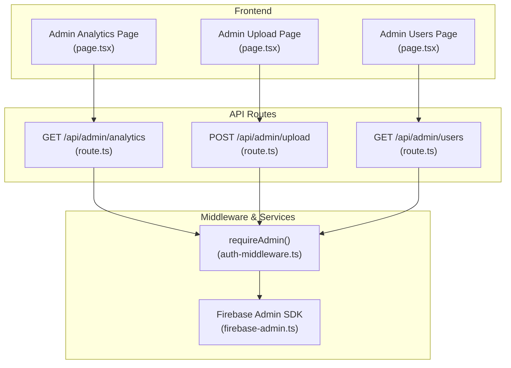
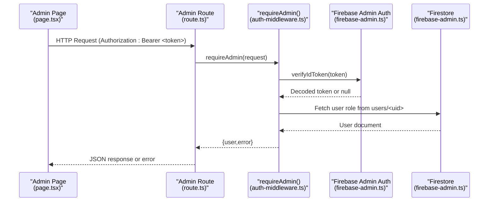
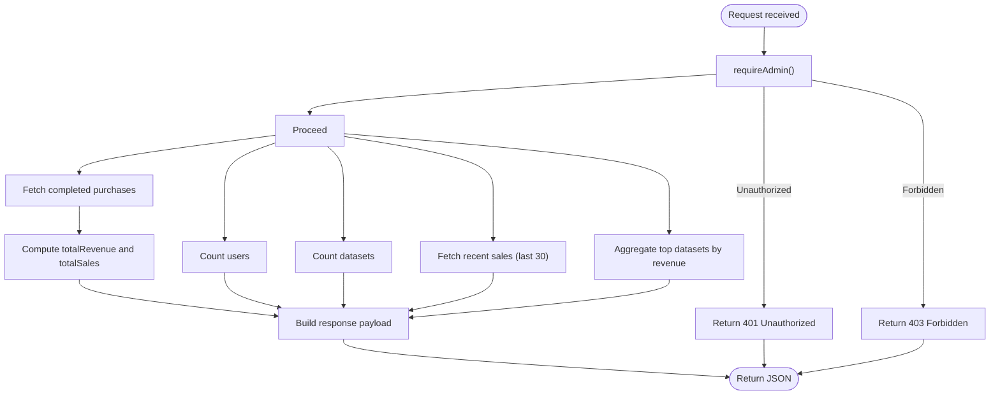
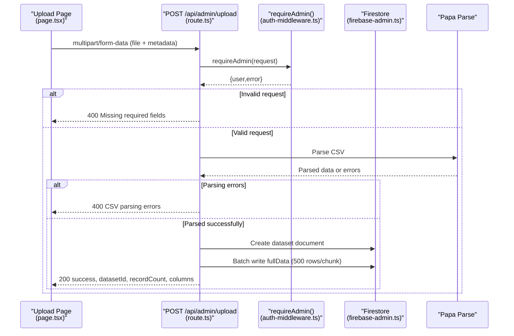
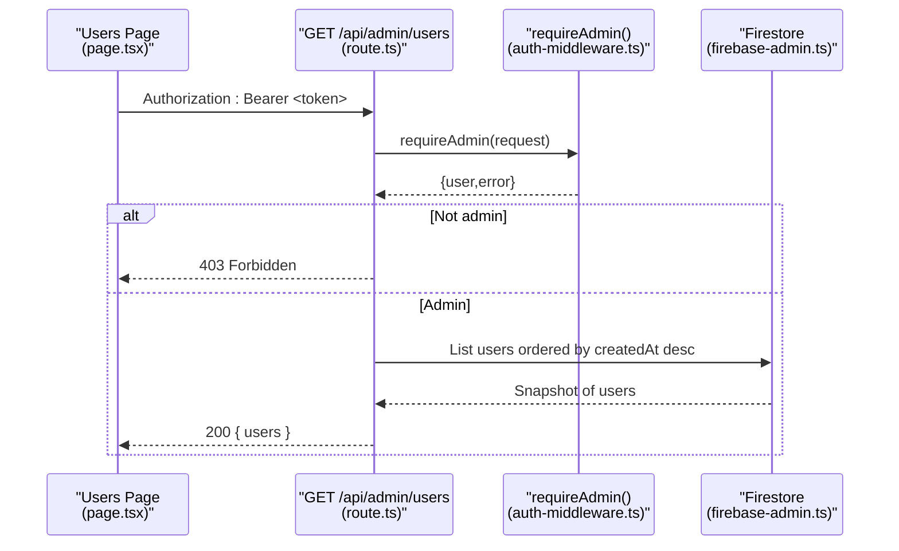
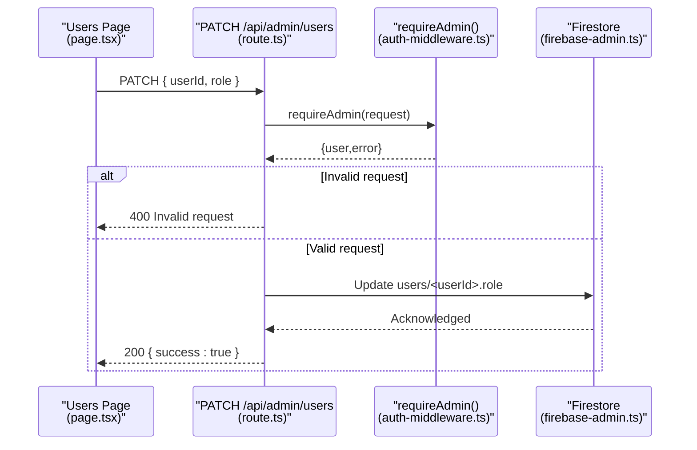
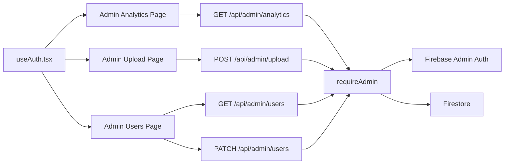

# Admin Operations APIs

<cite>
**Referenced Files in This Document**
- [route.ts](file://src/app/api/admin/analytics/route.ts)
- [route.ts](file://src/app/api/admin/upload/route.ts)
- [route.ts](file://src/app/api/admin/users/route.ts)
- [auth-middleware.ts](file://src/lib/auth-middleware.ts)
- [firebase-admin.ts](file://src/lib/firebase-admin.ts)
- [page.tsx](file://src/app/admin/analytics/page.tsx)
- [page.tsx](file://src/app/admin/upload/page.tsx)
- [page.tsx](file://src/app/admin/users/page.tsx)
- [index.ts](file://src/types/index.ts)
- [use-auth.tsx](file://src/hooks/use-auth.tsx)
- [package.json](file://package.json)
</cite>

## Table of Contents
1. [Introduction](#introduction)
2. [Project Structure](#project-structure)
3. [Core Components](#core-components)
4. [Architecture Overview](#architecture-overview)
5. [Detailed Component Analysis](#detailed-component-analysis)
6. [Dependency Analysis](#dependency-analysis)
7. [Performance Considerations](#performance-considerations)
8. [Troubleshooting Guide](#troubleshooting-guide)
9. [Conclusion](#conclusion)

## Introduction
This document provides comprehensive API documentation for Datafrica’s administrative operation endpoints. It covers:
- GET /api/admin/analytics: Revenue analytics, sales aggregation, user activity metrics, and response format
- POST /api/admin/upload: Dataset upload management, CSV validation, metadata extraction, and storage integration
- GET /api/admin/users: User management operations, user retrieval, and administrative controls

It also documents authentication requirements, role-based access control, request/response schemas, error handling, and security considerations for sensitive data access.

## Project Structure
The admin APIs are implemented as Next.js App Router API routes under src/app/api/admin/. Authentication middleware enforces admin-only access and integrates with Firebase Admin for backend database operations.

**Diagram sources**
- [route.ts:1-78](file://src/app/api/admin/analytics/route.ts#L1-L78)
- [route.ts:1-93](file://src/app/api/admin/upload/route.ts#L1-L93)
- [route.ts:1-54](file://src/app/api/admin/users/route.ts#L1-L54)
- [auth-middleware.ts:1-48](file://src/lib/auth-middleware.ts#L1-L48)
- [firebase-admin.ts:1-50](file://src/lib/firebase-admin.ts#L1-L50)

**Section sources**
- [route.ts:1-78](file://src/app/api/admin/analytics/route.ts#L1-L78)
- [route.ts:1-93](file://src/app/api/admin/upload/route.ts#L1-L93)
- [route.ts:1-54](file://src/app/api/admin/users/route.ts#L1-L54)
- [auth-middleware.ts:1-48](file://src/lib/auth-middleware.ts#L1-L48)
- [firebase-admin.ts:1-50](file://src/lib/firebase-admin.ts#L1-L50)

## Core Components
- Authentication and Authorization Middleware
  - verifyAuth: Validates Bearer token against Firebase Admin Auth
  - requireAuth: Returns Unauthorized if invalid
  - requireAdmin: Ensures user role is admin by checking Firestore users collection
- Firebase Admin Integration
  - Lazy-initialized adminAuth, adminDb, adminStorage for secure server-side operations
- Admin API Routes
  - GET /api/admin/analytics: Aggregates revenue, sales, users, datasets, recent sales, and top datasets
  - POST /api/admin/upload: Parses CSV, validates metadata, stores dataset metadata and full data in batches
  - GET /api/admin/users: Lists all users; PATCH updates user roles

**Section sources**
- [auth-middleware.ts:1-48](file://src/lib/auth-middleware.ts#L1-L48)
- [firebase-admin.ts:1-50](file://src/lib/firebase-admin.ts#L1-L50)
- [route.ts:1-78](file://src/app/api/admin/analytics/route.ts#L1-L78)
- [route.ts:1-93](file://src/app/api/admin/upload/route.ts#L1-L93)
- [route.ts:1-54](file://src/app/api/admin/users/route.ts#L1-L54)

## Architecture Overview
The admin endpoints enforce strict authentication and authorization before accessing Firestore resources. Requests flow from frontend pages to API routes, which delegate to Firebase Admin SDK for database operations.

**Diagram sources**
- [page.tsx:57-62](file://src/app/admin/analytics/page.tsx#L57-L62)
- [route.ts:6-9](file://src/app/api/admin/analytics/route.ts#L6-L9)
- [auth-middleware.ts:30-47](file://src/lib/auth-middleware.ts#L30-L47)
- [firebase-admin.ts:1-50](file://src/lib/firebase-admin.ts#L1-L50)

## Detailed Component Analysis

### GET /api/admin/analytics
- Purpose: Retrieve aggregated analytics including total revenue, total sales, total users, total datasets, recent sales, and top selling datasets.
- Authentication: Requires admin role via Bearer token.
- Processing Logic:
  - Validates admin access
  - Queries completed purchases to compute total revenue and total sales
  - Counts users and datasets
  - Retrieves recent sales (last 30 completed)
  - Aggregates top datasets by revenue
- Response Format:
  - totalRevenue: number
  - totalSales: number
  - totalUsers: number
  - totalDatasets: number
  - recentSales: array of purchase objects with id, datasetTitle, amount, currency, createdAt
  - topDatasets: array of { id, title, count, revenue } sorted by revenue descending

**Diagram sources**
- [route.ts:6-78](file://src/app/api/admin/analytics/route.ts#L6-L78)

**Section sources**
- [route.ts:1-78](file://src/app/api/admin/analytics/route.ts#L1-L78)
- [auth-middleware.ts:30-47](file://src/lib/auth-middleware.ts#L30-L47)

### POST /api/admin/upload
- Purpose: Upload a CSV dataset, parse and validate, extract metadata, and persist dataset metadata and full data in batches.
- Authentication: Requires admin role via Bearer token.
- Request Body (multipart/form-data):
  - file: CSV file (required)
  - title: string (required)
  - description: string (optional)
  - category: string (required)
  - country: string (required)
  - price: number (required)
  - currency: string (optional, default "XOF")
  - previewRows: number (optional, default 10)
  - featured: boolean (optional, default false)
- Processing Logic:
  - Validates presence of required fields
  - Parses CSV with Papa Parse; returns 400 on parsing errors
  - Creates dataset document with metadata (title, description, category, country, price, currency, recordCount, columns, previewData, flags)
  - Stores full data in batches (500 rows per batch) into datasetId/fullData subcollection
- Response Format:
  - success: boolean
  - datasetId: string
  - recordCount: number
  - columns: string[]

**Diagram sources**
- [page.tsx:77-81](file://src/app/admin/upload/page.tsx#L77-L81)
- [route.ts:6-93](file://src/app/api/admin/upload/route.ts#L6-L93)
- [auth-middleware.ts:30-47](file://src/lib/auth-middleware.ts#L30-L47)

**Section sources**
- [route.ts:1-93](file://src/app/api/admin/upload/route.ts#L1-L93)
- [page.tsx:44-98](file://src/app/admin/upload/page.tsx#L44-L98)
- [auth-middleware.ts:30-47](file://src/lib/auth-middleware.ts#L30-L47)

### GET /api/admin/users
- Purpose: List all users ordered by creation date.
- Authentication: Requires admin role via Bearer token.
- Response Format:
  - users: array of user objects with id, email, displayName, role, createdAt

**Diagram sources**
- [page.tsx:49-55](file://src/app/admin/users/page.tsx#L49-L55)
- [route.ts:5-29](file://src/app/api/admin/users/route.ts#L5-L29)
- [auth-middleware.ts:30-47](file://src/lib/auth-middleware.ts#L30-L47)

**Section sources**
- [route.ts:1-54](file://src/app/api/admin/users/route.ts#L1-L54)
- [page.tsx:30-92](file://src/app/admin/users/page.tsx#L30-L92)
- [auth-middleware.ts:30-47](file://src/lib/auth-middleware.ts#L30-L47)

### PATCH /api/admin/users (Role Update)
- Purpose: Toggle user role between "user" and "admin".
- Authentication: Requires admin role via Bearer token.
- Request Body (JSON):
  - userId: string (required)
  - role: "user" | "admin" (required)
- Response Format:
  - success: boolean

**Diagram sources**
- [page.tsx:72-79](file://src/app/admin/users/page.tsx#L72-L79)
- [route.ts:31-53](file://src/app/api/admin/users/route.ts#L31-L53)
- [auth-middleware.ts:30-47](file://src/lib/auth-middleware.ts#L30-L47)

**Section sources**
- [route.ts:31-53](file://src/app/api/admin/users/route.ts#L31-L53)
- [page.tsx:66-92](file://src/app/admin/users/page.tsx#L66-L92)

## Dependency Analysis
- Frontend Pages
  - Admin pages call API routes with Authorization: Bearer <token> obtained from useAuth hook
- Backend Routes
  - All admin routes depend on requireAdmin for authorization
  - requireAdmin depends on Firebase Admin Auth for token verification and Firestore for user role
- External Dependencies
  - Firebase Admin SDK for Auth, Firestore, and Storage
  - Papa Parse for CSV parsing
  - Next.js App Router for API routes

**Diagram sources**
- [use-auth.tsx:94-99](file://src/hooks/use-auth.tsx#L94-L99)
- [page.tsx:57-62](file://src/app/admin/analytics/page.tsx#L57-L62)
- [page.tsx:77-81](file://src/app/admin/upload/page.tsx#L77-L81)
- [page.tsx:49-55](file://src/app/admin/users/page.tsx#L49-L55)
- [route.ts:6-9](file://src/app/api/admin/analytics/route.ts#L6-L9)
- [route.ts:6-10](file://src/app/api/admin/upload/route.ts#L6-L10)
- [route.ts:5-9](file://src/app/api/admin/users/route.ts#L5-L9)
- [auth-middleware.ts:30-47](file://src/lib/auth-middleware.ts#L30-L47)
- [firebase-admin.ts:1-50](file://src/lib/firebase-admin.ts#L1-L50)

**Section sources**
- [use-auth.tsx:94-99](file://src/hooks/use-auth.tsx#L94-L99)
- [page.tsx:57-62](file://src/app/admin/analytics/page.tsx#L57-L62)
- [page.tsx:77-81](file://src/app/admin/upload/page.tsx#L77-L81)
- [page.tsx:49-55](file://src/app/admin/users/page.tsx#L49-L55)
- [route.ts:6-9](file://src/app/api/admin/analytics/route.ts#L6-L9)
- [route.ts:6-10](file://src/app/api/admin/upload/route.ts#L6-L10)
- [route.ts:5-9](file://src/app/api/admin/users/route.ts#L5-L9)
- [auth-middleware.ts:30-47](file://src/lib/auth-middleware.ts#L30-L47)
- [firebase-admin.ts:1-50](file://src/lib/firebase-admin.ts#L1-L50)
- [package.json:24-37](file://package.json#L24-L37)

## Performance Considerations
- CSV Upload Batching: Full dataset rows are written in batches of 500 to Firestore to avoid large single writes and reduce memory pressure during ingestion.
- Firestore Aggregation: Analytics queries use filtered and limited collections to keep computations efficient.
- Token Verification: Firebase Admin Auth verifies tokens server-side to prevent client-side tampering.

[No sources needed since this section provides general guidance]

## Troubleshooting Guide
- Authentication Failures
  - Missing or invalid Authorization header: Returns 401 Unauthorized
  - Invalid or expired token: Returns 401 Unauthorized
  - Non-admin user: Returns 403 Forbidden
- CSV Upload Issues
  - Missing required fields: Returns 400 Missing required fields
  - CSV parsing errors: Returns 400 with details array
  - Internal errors: Returns 500 Failed to upload dataset
- Analytics Errors
  - Internal errors: Returns 500 Failed to fetch analytics
- Users Endpoint Errors
  - Internal errors: Returns 500 Failed to fetch users
  - Role update invalid request: Returns 400 Invalid request

**Section sources**
- [auth-middleware.ts:19-28](file://src/lib/auth-middleware.ts#L19-L28)
- [auth-middleware.ts:30-47](file://src/lib/auth-middleware.ts#L30-L47)
- [route.ts:23-28](file://src/app/api/admin/upload/route.ts#L23-L28)
- [route.ts:34-39](file://src/app/api/admin/upload/route.ts#L34-L39)
- [route.ts:85-91](file://src/app/api/admin/upload/route.ts#L85-L91)
- [route.ts:70-76](file://src/app/api/admin/analytics/route.ts#L70-L76)
- [route.ts:22-28](file://src/app/api/admin/users/route.ts#L22-L28)
- [route.ts:46-52](file://src/app/api/admin/users/route.ts#L46-L52)

## Conclusion
The admin APIs provide secure, role-based access to analytics, dataset uploads, and user management. They rely on Firebase Admin for authentication and Firestore for data operations, with robust error handling and performance-conscious batching for large datasets. Frontend pages integrate seamlessly with these endpoints using Bearer tokens obtained from the useAuth hook.