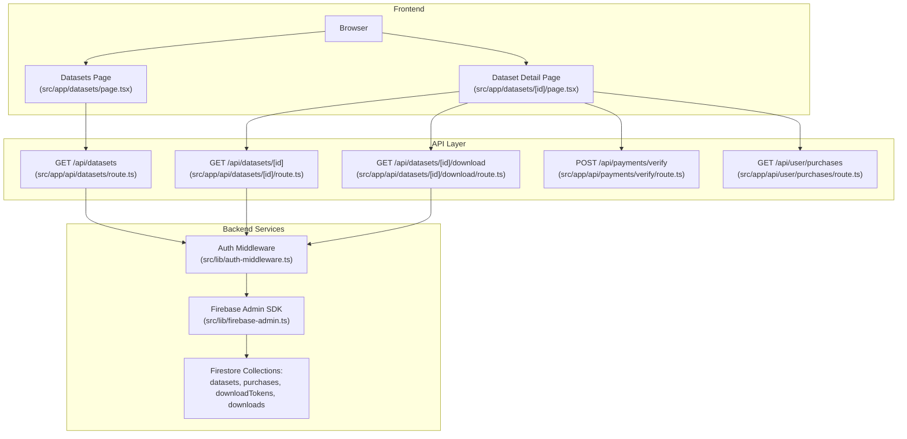
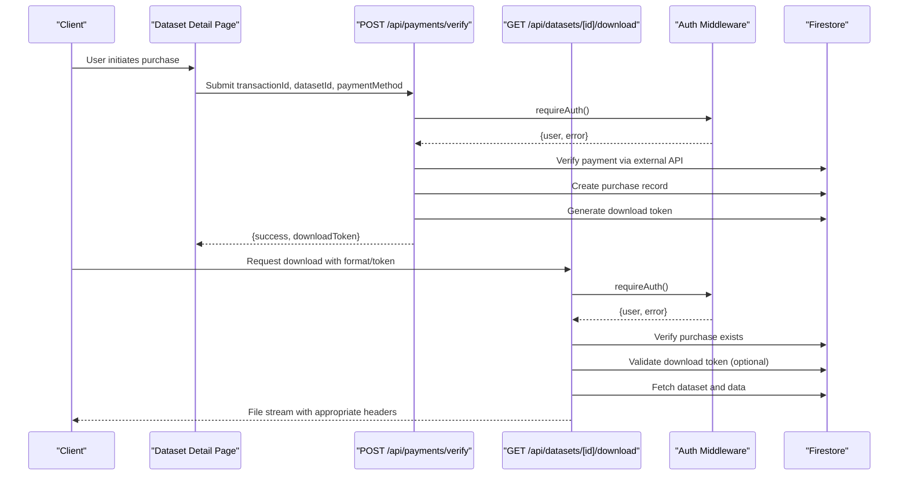
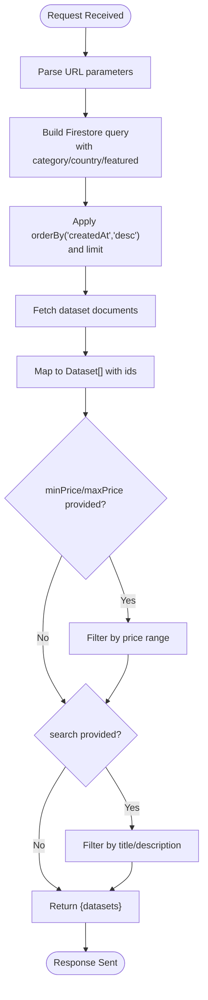
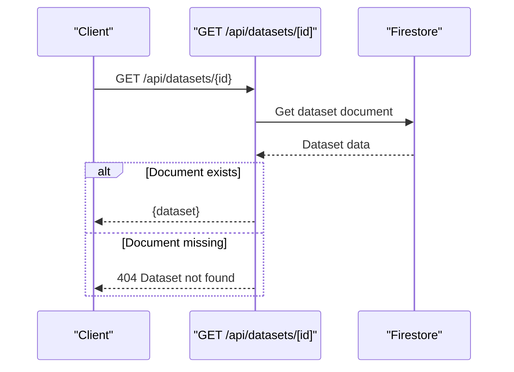
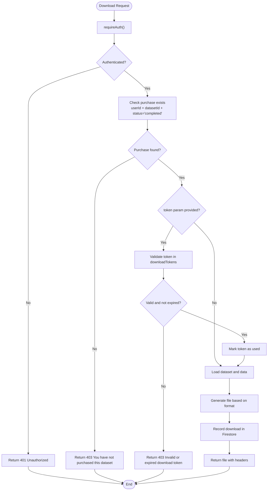
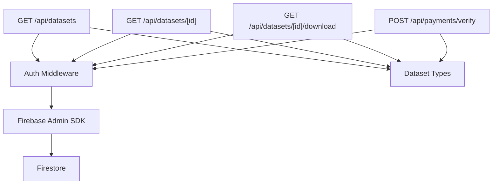

# Dataset Management APIs

<cite>
**Referenced Files in This Document**
- [src/app/api/datasets/route.ts](file://src/app/api/datasets/route.ts)
- [src/app/api/datasets/[id]/route.ts](file://src/app/api/datasets/[id]/route.ts)
- [src/app/api/datasets/[id]/download/route.ts](file://src/app/api/datasets/[id]/download/route.ts)
- [src/types/index.ts](file://src/types/index.ts)
- [src/lib/auth-middleware.ts](file://src/lib/auth-middleware.ts)
- [src/lib/firebase-admin.ts](file://src/lib/firebase-admin.ts)
- [src/app/datasets/page.tsx](file://src/app/datasets/page.tsx)
- [src/app/datasets/[id]/page.tsx](file://src/app/datasets/[id]/page.tsx)
- [src/app/api/payments/verify/route.ts](file://src/app/api/payments/verify/route.ts)
- [src/app/api/user/purchases/route.ts](file://src/app/api/user/purchases/route.ts)
</cite>

## Table of Contents
1. [Introduction](#introduction)
2. [Project Structure](#project-structure)
3. [Core Components](#core-components)
4. [Architecture Overview](#architecture-overview)
5. [Detailed Component Analysis](#detailed-component-analysis)
6. [Dependency Analysis](#dependency-analysis)
7. [Performance Considerations](#performance-considerations)
8. [Troubleshooting Guide](#troubleshooting-guide)
9. [Conclusion](#conclusion)

## Introduction
This document provides comprehensive API documentation for Datafrica's dataset management endpoints. It covers three primary endpoints:
- Listing datasets with filtering and pagination
- Retrieving individual dataset details
- Authorized dataset downloads with token validation and file delivery

The APIs integrate with Firebase Authentication and Firestore for user authentication, dataset storage, purchase tracking, and download token management. The documentation includes request parameters, response schemas, error handling, and practical usage examples.

## Project Structure
The dataset management APIs are implemented as Next.js App Router API routes under `src/app/api/datasets`. Supporting components include:
- Authentication middleware for Bearer token verification
- Firebase Admin SDK for secure server-side Firestore operations
- Frontend pages that consume these APIs for browsing and downloading datasets

**Diagram sources**
- [src/app/api/datasets/route.ts:1-62](file://src/app/api/datasets/route.ts#L1-L62)
- [src/app/api/datasets/[id]/route.ts](file://src/app/api/datasets/[id]/route.ts#L1-L29)
- [src/app/api/datasets/[id]/download/route.ts](file://src/app/api/datasets/[id]/download/route.ts#L1-L148)
- [src/lib/auth-middleware.ts:1-48](file://src/lib/auth-middleware.ts#L1-L48)
- [src/lib/firebase-admin.ts:1-50](file://src/lib/firebase-admin.ts#L1-L50)
- [src/app/datasets/page.tsx:1-195](file://src/app/datasets/page.tsx#L1-L195)
- [src/app/datasets/[id]/page.tsx](file://src/app/datasets/[id]/page.tsx#L1-L382)

**Section sources**
- [src/app/api/datasets/route.ts:1-62](file://src/app/api/datasets/route.ts#L1-L62)
- [src/app/api/datasets/[id]/route.ts](file://src/app/api/datasets/[id]/route.ts#L1-L29)
- [src/app/api/datasets/[id]/download/route.ts](file://src/app/api/datasets/[id]/download/route.ts#L1-L148)
- [src/lib/auth-middleware.ts:1-48](file://src/lib/auth-middleware.ts#L1-L48)
- [src/lib/firebase-admin.ts:1-50](file://src/lib/firebase-admin.ts#L1-L50)
- [src/app/datasets/page.tsx:1-195](file://src/app/datasets/page.tsx#L1-L195)
- [src/app/datasets/[id]/page.tsx](file://src/app/datasets/[id]/page.tsx#L1-L382)

## Core Components
This section documents the three primary dataset management endpoints with their request parameters, response schemas, and error handling.

### GET /api/datasets
Purpose: Retrieve a paginated list of datasets with optional filtering.

Request Parameters
- category: string (optional) - Filter by dataset category
- country: string (optional) - Filter by country
- search: string (optional) - Search across title and description
- minPrice: number (optional) - Minimum price filter
- maxPrice: number (optional) - Maximum price filter
- featured: boolean (optional) - Filter featured datasets ("true" to enable)
- limit: number (default: 50) - Maximum number of results

Response Schema
- datasets: Dataset[] - Array of dataset objects

Dataset Object Fields
- id: string
- title: string
- description: string
- category: DatasetCategory
- country: string
- price: number
- currency: string
- recordCount: number
- columns: string[]
- previewData: Record<string, string | number>[]
- fileUrl: string
- featured: boolean
- rating: number
- ratingCount: number
- updatedAt: string
- createdAt: string

Error Responses
- 500: Failed to fetch datasets

Pagination Behavior
- Backend applies Firestore orderBy and limit
- Additional client-side filtering occurs for price range and search

**Section sources**
- [src/app/api/datasets/route.ts:5-61](file://src/app/api/datasets/route.ts#L5-L61)
- [src/types/index.ts:11-28](file://src/types/index.ts#L11-L28)

### GET /api/datasets/[id]
Purpose: Retrieve a single dataset by ID.

Request Parameters
- Path parameter: id (required) - Dataset identifier

Response Schema
- dataset: Dataset - Single dataset object

Error Responses
- 404: Dataset not found
- 500: Failed to fetch dataset

Availability Status
- The endpoint returns the dataset regardless of purchase status; availability checks occur at download time.

**Section sources**
- [src/app/api/datasets/[id]/route.ts](file://src/app/api/datasets/[id]/route.ts#L5-L28)
- [src/types/index.ts:11-28](file://src/types/index.ts#L11-L28)

### GET /api/datasets/[id]/download
Purpose: Deliver dataset files to authorized users with optional download tokens.

Authentication Requirements
- Authorization header: Bearer <Firebase ID Token>
- User must be authenticated

Authorization Checks
- Validates Bearer token against Firebase Authentication
- Confirms user has a completed purchase for the dataset
- Optional download token validation if provided

Request Parameters
- Path parameter: id (required) - Dataset identifier
- Query parameters:
  - format: "csv" | "excel" | "json" (default: "csv")
  - token: string (optional) - Download token for authorized access

Response Formats
- CSV: text/csv with filename dataset-title.csv
- Excel: application/vnd.openxmlformats-officedocument.spreadsheetml.sheet with filename dataset-title.xlsx
- JSON: application/json with filename dataset-title.json

File Data Sources
- Primary: dataset.fullData subcollection ordered by rowIndex
- Fallback: dataset.previewData if fullData is empty

Download Recording
- Records download event in Firestore downloads collection with userId, datasetId, format, and timestamp

Error Responses
- 401: Unauthorized
- 403: You have not purchased this dataset / Invalid or expired download token
- 404: Dataset not found
- 500: Failed to generate download

**Section sources**
- [src/app/api/datasets/[id]/download/route.ts](file://src/app/api/datasets/[id]/download/route.ts#L7-L147)
- [src/lib/auth-middleware.ts:19-28](file://src/lib/auth-middleware.ts#L19-L28)
- [src/types/index.ts:43-50](file://src/types/index.ts#L43-L50)

## Architecture Overview
The dataset management system integrates frontend pages with backend API routes through Firebase Authentication and Firestore. Payment verification generates download tokens that enable authorized downloads.

**Diagram sources**
- [src/app/datasets/[id]/page.tsx](file://src/app/datasets/[id]/page.tsx#L84-L120)
- [src/app/api/payments/verify/route.ts:6-134](file://src/app/api/payments/verify/route.ts#L6-L134)
- [src/app/api/datasets/[id]/download/route.ts](file://src/app/api/datasets/[id]/download/route.ts#L7-L147)
- [src/lib/auth-middleware.ts:19-28](file://src/lib/auth-middleware.ts#L19-L28)

## Detailed Component Analysis

### Dataset Listing Endpoint
The listing endpoint performs server-side filtering for category, country, and featured datasets, then applies client-side filtering for price range and search terms.

**Diagram sources**
- [src/app/api/datasets/route.ts:5-61](file://src/app/api/datasets/route.ts#L5-L61)

**Section sources**
- [src/app/api/datasets/route.ts:5-61](file://src/app/api/datasets/route.ts#L5-L61)

### Individual Dataset Retrieval
The detail endpoint retrieves a single dataset by ID and returns its metadata without enforcing purchase checks.

**Diagram sources**
- [src/app/api/datasets/[id]/route.ts](file://src/app/api/datasets/[id]/route.ts#L5-L28)

**Section sources**
- [src/app/api/datasets/[id]/route.ts](file://src/app/api/datasets/[id]/route.ts#L5-L28)

### Download Endpoint Authorization Flow
The download endpoint enforces multiple layers of authorization and validation.

**Diagram sources**
- [src/app/api/datasets/[id]/download/route.ts](file://src/app/api/datasets/[id]/download/route.ts#L7-L147)
- [src/lib/auth-middleware.ts:19-28](file://src/lib/auth-middleware.ts#L19-L28)

**Section sources**
- [src/app/api/datasets/[id]/download/route.ts](file://src/app/api/datasets/[id]/download/route.ts#L7-L147)
- [src/lib/auth-middleware.ts:19-28](file://src/lib/auth-middleware.ts#L19-L28)

## Dependency Analysis
The dataset management APIs depend on shared authentication and database utilities.

**Diagram sources**
- [src/app/api/datasets/route.ts:1-62](file://src/app/api/datasets/route.ts#L1-L62)
- [src/app/api/datasets/[id]/route.ts](file://src/app/api/datasets/[id]/route.ts#L1-L29)
- [src/app/api/datasets/[id]/download/route.ts](file://src/app/api/datasets/[id]/download/route.ts#L1-L148)
- [src/lib/auth-middleware.ts:1-48](file://src/lib/auth-middleware.ts#L1-L48)
- [src/lib/firebase-admin.ts:1-50](file://src/lib/firebase-admin.ts#L1-L50)
- [src/types/index.ts:1-90](file://src/types/index.ts#L1-L90)

**Section sources**
- [src/app/api/datasets/route.ts:1-62](file://src/app/api/datasets/route.ts#L1-L62)
- [src/app/api/datasets/[id]/route.ts](file://src/app/api/datasets/[id]/route.ts#L1-L29)
- [src/app/api/datasets/[id]/download/route.ts](file://src/app/api/datasets/[id]/download/route.ts#L1-L148)
- [src/lib/auth-middleware.ts:1-48](file://src/lib/auth-middleware.ts#L1-L48)
- [src/lib/firebase-admin.ts:1-50](file://src/lib/firebase-admin.ts#L1-L50)
- [src/types/index.ts:1-90](file://src/types/index.ts#L1-L90)

## Performance Considerations
- Pagination: The listing endpoint applies Firestore orderBy and limit to reduce query cost. Additional client-side filtering for price range and search may impact performance with large result sets.
- Data retrieval: The download endpoint loads all rows from the dataset's data subcollection. For large datasets, consider implementing server-side pagination or streaming responses.
- Token validation: Download token checks involve Firestore queries. Ensure proper indexing on downloadTokens collection for optimal performance.
- Caching: Consider implementing CDN caching for static assets and rate limiting for high-volume endpoints.

## Troubleshooting Guide
Common Issues and Resolutions

Authentication Failures
- Symptom: 401 Unauthorized on any dataset endpoint
- Cause: Missing or invalid Bearer token
- Resolution: Ensure Authorization header contains a valid Firebase ID token

Purchase Validation
- Symptom: 403 You have not purchased this dataset
- Cause: No completed purchase record found
- Resolution: Complete payment via the payment verification endpoint before downloading

Expired Download Tokens
- Symptom: 403 Invalid or expired download token
- Cause: Token expired or already used
- Resolution: Generate a new download token via payment verification

Dataset Not Found
- Symptom: 404 Dataset not found
- Cause: Invalid dataset ID or dataset removal
- Resolution: Verify dataset ID and ensure dataset exists in Firestore

Development Mode Behavior
- Note: In development mode, payment verification may succeed automatically for testing purposes. Production requires actual payment processing.

**Section sources**
- [src/app/api/datasets/[id]/download/route.ts](file://src/app/api/datasets/[id]/download/route.ts#L31-L67)
- [src/app/api/datasets/[id]/route.ts](file://src/app/api/datasets/[id]/route.ts#L15-L17)
- [src/app/api/payments/verify/route.ts:86-89](file://src/app/api/payments/verify/route.ts#L86-L89)

## Conclusion
Datafrica's dataset management APIs provide a robust foundation for browsing, purchasing, and downloading datasets. The APIs leverage Firebase Authentication and Firestore for secure, scalable operations. The design separates concerns between listing, detail retrieval, and download authorization, enabling efficient client-side consumption while maintaining strong security controls around paid content access.

Key strengths include:
- Flexible filtering and pagination for dataset discovery
- Comprehensive dataset metadata with preview capabilities
- Multi-format download support with token-based authorization
- Clear error handling and authentication enforcement

Future enhancements could include:
- Server-side pagination for large dataset listings
- Enhanced search indexing for improved performance
- Download token expiration policies and cleanup jobs
- Streaming file delivery for large datasets