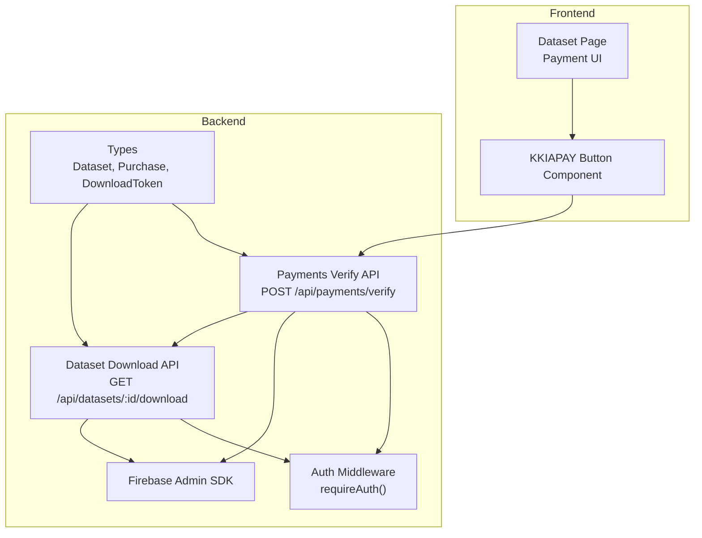
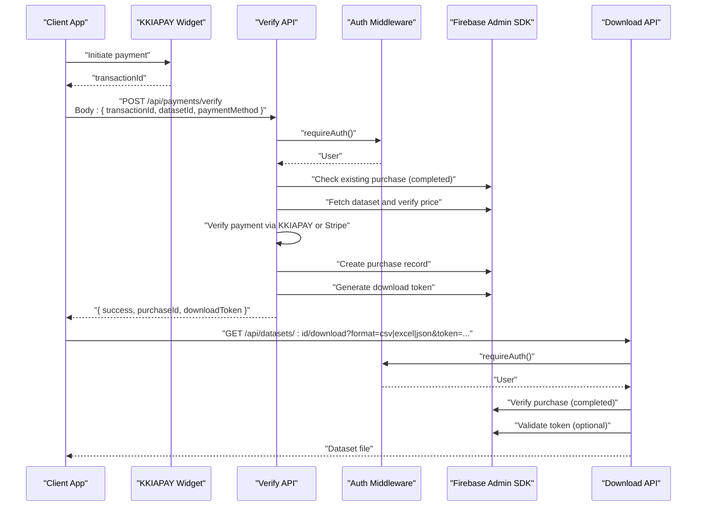
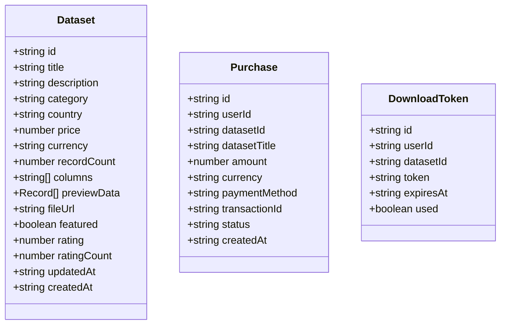
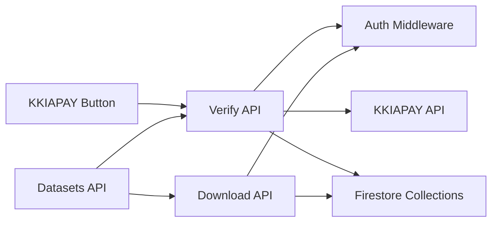

# Payment Verification APIs

<cite>
**Referenced Files in This Document**
- [route.ts](file://src/app/api/payments/verify/route.ts)
- [route.ts](file://src/app/api/datasets/[id]/download/route.ts)
- [kkiapay-button.tsx](file://src/components/payment/kkiapay-button.tsx)
- [auth-middleware.ts](file://src/lib/auth-middleware.ts)
- [firebase-admin.ts](file://src/lib/firebase-admin.ts)
- [index.ts](file://src/types/index.ts)
- [route.ts](file://src/app/api/datasets/route.ts)
- [route.ts](file://src/app/api/datasets/[id]/route.ts)
</cite>

## Table of Contents
1. [Introduction](#introduction)
2. [Project Structure](#project-structure)
3. [Core Components](#core-components)
4. [Architecture Overview](#architecture-overview)
5. [Detailed Component Analysis](#detailed-component-analysis)
6. [Dependency Analysis](#dependency-analysis)
7. [Performance Considerations](#performance-considerations)
8. [Troubleshooting Guide](#troubleshooting-guide)
9. [Conclusion](#conclusion)
10. [Appendices](#appendices)

## Introduction
This document provides comprehensive API documentation for Datafrica’s payment verification endpoint. It covers the POST /api/payments/verify endpoint, including the payment confirmation workflow, request body schema, response format, and automatic download token generation upon successful verification. It also documents error handling for failed payments, invalid transaction IDs, duplicate verification attempts, and system errors. Practical examples demonstrate the complete payment-to-download flow, integration patterns with KKIAPAY, webhook considerations, and security measures for payment data protection. Common payment scenarios, timeout handling, and retry mechanisms are addressed.

## Project Structure
The payment verification flow spans several components:
- Frontend payment initiation via the KKIAPAY button component
- Backend payment verification endpoint
- Authentication middleware for secure access
- Firebase Admin SDK for database operations
- Dataset download endpoint secured by purchase verification and optional download tokens

**Diagram sources**
- [route.ts:1-135](file://src/app/api/payments/verify/route.ts#L1-L135)
- [route.ts:1-148](file://src/app/api/datasets/[id]/download/route.ts#L1-L148)
- [kkiapay-button.tsx:1-110](file://src/components/payment/kkiapay-button.tsx#L1-L110)
- [auth-middleware.ts:1-48](file://src/lib/auth-middleware.ts#L1-L48)
- [firebase-admin.ts:1-50](file://src/lib/firebase-admin.ts#L1-L50)
- [index.ts:1-90](file://src/types/index.ts#L1-L90)

**Section sources**
- [route.ts:1-135](file://src/app/api/payments/verify/route.ts#L1-L135)
- [route.ts:1-148](file://src/app/api/datasets/[id]/download/route.ts#L1-L148)
- [kkiapay-button.tsx:1-110](file://src/components/payment/kkiapay-button.tsx#L1-L110)
- [auth-middleware.ts:1-48](file://src/lib/auth-middleware.ts#L1-L48)
- [firebase-admin.ts:1-50](file://src/lib/firebase-admin.ts#L1-L50)
- [index.ts:1-90](file://src/types/index.ts#L1-L90)

## Core Components
- Payments Verify Endpoint: Validates payment via KKIAPAY or Stripe, checks dataset existence and pricing, prevents duplicate purchases, records purchase, and generates a download token.
- Dataset Download Endpoint: Secures dataset downloads by verifying purchase and optional download token expiration and usage.
- KKIAPAY Button Component: Integrates with the KKIAPAY widget to collect payment and return a transaction ID.
- Authentication Middleware: Enforces Bearer token authentication for protected endpoints.
- Firebase Admin SDK: Provides server-side access to Firestore for purchases, datasets, and download tokens.
- Types: Defines Dataset, Purchase, and DownloadToken structures used across endpoints.

**Section sources**
- [route.ts:1-135](file://src/app/api/payments/verify/route.ts#L1-L135)
- [route.ts:1-148](file://src/app/api/datasets/[id]/download/route.ts#L1-L148)
- [kkiapay-button.tsx:1-110](file://src/components/payment/kkiapay-button.tsx#L1-L110)
- [auth-middleware.ts:1-48](file://src/lib/auth-middleware.ts#L1-L48)
- [firebase-admin.ts:1-50](file://src/lib/firebase-admin.ts#L1-L50)
- [index.ts:1-90](file://src/types/index.ts#L1-L90)

## Architecture Overview
The payment verification architecture ensures secure, reliable payment confirmation and subsequent dataset access. The flow integrates frontend payment initiation, backend verification against external payment providers, internal purchase recording, and controlled dataset delivery.

**Diagram sources**
- [route.ts:1-135](file://src/app/api/payments/verify/route.ts#L1-L135)
- [route.ts:1-148](file://src/app/api/datasets/[id]/download/route.ts#L1-L148)
- [kkiapay-button.tsx:1-110](file://src/components/payment/kkiapay-button.tsx#L1-L110)
- [auth-middleware.ts:1-48](file://src/lib/auth-middleware.ts#L1-L48)
- [firebase-admin.ts:1-50](file://src/lib/firebase-admin.ts#L1-L50)

## Detailed Component Analysis

### Payments Verify Endpoint
- Endpoint: POST /api/payments/verify
- Purpose: Confirm payment via KKIAPAY or Stripe, prevent duplicate purchases, record purchase, and generate a download token.
- Authentication: Requires Bearer token via Authorization header.
- Request Body Schema:
  - transactionId: string (required)
  - datasetId: string (required)
  - paymentMethod: "kkiapay" | "stripe" (required)
- Response Format:
  - On success: { success: true, purchaseId: string, downloadToken: string }
  - On failure: { error: string } with appropriate HTTP status

Processing Logic
- Authentication: Uses requireAuth to validate Bearer token and extract user.
- Validation: Ensures transactionId, datasetId, and paymentMethod are present.
- Duplicate Prevention: Checks Firestore for an existing completed purchase by the same user for the same dataset.
- Dataset Verification: Fetches dataset by datasetId and compares transaction amount with dataset price.
- Payment Verification:
  - KKIAPAY: Calls external API with private, secret, and API keys to confirm transaction status and amount.
  - Stripe: Placeholder for future implementation; in development mode, marks as verified for testing.
  - Development Mode: Always verifies payments for local testing.
- Purchase Recording: Creates a purchase document with user, dataset, amount, currency, payment method, transactionId, status, and timestamps.
- Download Token Generation: Adds a download token document with userId, datasetId, token, expiration (24 hours), and used flag.

Error Handling
- Missing Fields: 400 Bad Request with error message.
- Unauthorized Access: 401 Unauthorized via requireAuth.
- Already Purchased: 400 Bad Request with alreadyPurchased flag.
- Dataset Not Found: 404 Not Found.
- Payment Verification Failure: 400 Bad Request.
- Internal Server Error: 500 with generic error message.

Security Measures
- Bearer token authentication enforced by requireAuth.
- Environment variables for KKIAPAY credentials and API keys.
- Development mode bypass for local testing only.

Practical Example: Payment-to-Download Flow
- User initiates payment via KKIAPAY button, receives transactionId.
- Client calls POST /api/payments/verify with transactionId, datasetId, and paymentMethod.
- Server verifies payment, creates purchase, and returns downloadToken.
- Client requests dataset download with token to GET /api/datasets/:id/download.

Common Scenarios and Retry Mechanisms
- Timeout Handling: External KKIAPAY verification may fail; in development mode, verification is auto-passed. Production requires robust retry logic around external API calls.
- Duplicate Attempts: Prevented by checking existing completed purchases.
- Amount Mismatch: Verified against dataset price; insufficient amounts are rejected.

**Section sources**
- [route.ts:1-135](file://src/app/api/payments/verify/route.ts#L1-L135)
- [auth-middleware.ts:1-48](file://src/lib/auth-middleware.ts#L1-L48)
- [firebase-admin.ts:1-50](file://src/lib/firebase-admin.ts#L1-L50)
- [index.ts:30-50](file://src/types/index.ts#L30-L50)

#### Class Diagram: Data Models

**Diagram sources**
- [index.ts:11-50](file://src/types/index.ts#L11-L50)

### Dataset Download Endpoint
- Endpoint: GET /api/datasets/:id/download
- Purpose: Serve dataset files (CSV, Excel, JSON) after purchase verification and optional token validation.
- Query Parameters:
  - format: "csv" | "excel" | "json" (default: "csv")
  - token: string (optional)
- Authentication: Requires Bearer token via Authorization header.
- Security Checks:
  - Purchase Verification: Confirms a completed purchase by the authenticated user for the requested dataset.
  - Token Validation: If provided, validates token ownership, non-used status, and expiration.
  - Token Usage Tracking: Marks token as used after successful download.

Response Format
- On success: Binary stream of the requested file format with appropriate Content-Type and Content-Disposition headers.
- On failure: { error: string } with appropriate HTTP status (401, 403, 404, 500).

**Section sources**
- [route.ts:1-148](file://src/app/api/datasets/[id]/download/route.ts#L1-L148)
- [auth-middleware.ts:1-48](file://src/lib/auth-middleware.ts#L1-L48)
- [firebase-admin.ts:1-50](file://src/lib/firebase-admin.ts#L1-L50)

### KKIAPAY Button Component
- Purpose: Integrates the KKIAPAY widget for initiating payments.
- Behavior:
  - Loads KKIAPAY SDK dynamically.
  - Opens widget with amount, currency, user details, and dataset metadata.
  - Emits transactionId on success.
- Integration Pattern:
  - Frontend collects transactionId after successful payment.
  - Frontend calls POST /api/payments/verify with transactionId, datasetId, and paymentMethod.

**Section sources**
- [kkiapay-button.tsx:1-110](file://src/components/payment/kkiapay-button.tsx#L1-L110)

### Authentication Middleware
- Purpose: Enforce Bearer token authentication for protected endpoints.
- Implementation:
  - Extracts Authorization header and verifies JWT using Firebase Admin SDK.
  - Returns decoded token or null on failure.
  - requireAuth returns error response for unauthorized access.

**Section sources**
- [auth-middleware.ts:1-48](file://src/lib/auth-middleware.ts#L1-L48)

### Firebase Admin SDK
- Purpose: Provide server-side access to Firestore, Auth, and Storage.
- Initialization: Lazy initialization with service account credentials from environment variables.
- Usage: Used by payment verification and download endpoints to query purchases, datasets, and download tokens.

**Section sources**
- [firebase-admin.ts:1-50](file://src/lib/firebase-admin.ts#L1-L50)

## Dependency Analysis
The payment verification flow depends on:
- Authentication middleware for user validation
- KKIAPAY SDK for payment initiation
- External KKIAPAY API for payment verification
- Firestore collections for purchases, datasets, and download tokens
- Dataset routes for listing and retrieving dataset details

**Diagram sources**
- [route.ts:1-135](file://src/app/api/payments/verify/route.ts#L1-L135)
- [route.ts:1-148](file://src/app/api/datasets/[id]/download/route.ts#L1-L148)
- [kkiapay-button.tsx:1-110](file://src/components/payment/kkiapay-button.tsx#L1-L110)
- [auth-middleware.ts:1-48](file://src/lib/auth-middleware.ts#L1-L48)
- [route.ts:1-62](file://src/app/api/datasets/route.ts#L1-L62)
- [route.ts:1-29](file://src/app/api/datasets/[id]/route.ts#L1-L29)

**Section sources**
- [route.ts:1-135](file://src/app/api/payments/verify/route.ts#L1-L135)
- [route.ts:1-148](file://src/app/api/datasets/[id]/download/route.ts#L1-L148)
- [kkiapay-button.tsx:1-110](file://src/components/payment/kkiapay-button.tsx#L1-L110)
- [auth-middleware.ts:1-48](file://src/lib/auth-middleware.ts#L1-L48)
- [route.ts:1-62](file://src/app/api/datasets/route.ts#L1-L62)
- [route.ts:1-29](file://src/app/api/datasets/[id]/route.ts#L1-L29)

## Performance Considerations
- External API Latency: KKIAPAY verification introduces network latency; consider caching dataset prices and recent transactions to reduce repeated lookups.
- Database Queries: Use Firestore indexes on userId, datasetId, and status for efficient purchase checks.
- Token Expiration: Ensure download tokens expire after 24 hours to prevent long-term access to paid content.
- Retry Logic: Implement exponential backoff for external API calls to handle transient failures during payment verification.

## Troubleshooting Guide
Common Issues and Resolutions
- Unauthorized Access: Ensure Authorization header contains a valid Bearer token.
- Missing Required Fields: Verify transactionId, datasetId, and paymentMethod are included in the request body.
- Already Purchased: Prevent duplicate purchases by checking for existing completed purchases.
- Dataset Not Found: Confirm datasetId exists in Firestore.
- Payment Verification Failure: Check KKIAPAY credentials and ensure transactionId is valid; in development mode, verification is auto-passed.
- Invalid or Expired Download Token: Ensure token is unexpired and matches the requesting user and dataset.
- Internal Server Error: Review server logs for underlying exceptions.

**Section sources**
- [route.ts:1-135](file://src/app/api/payments/verify/route.ts#L1-L135)
- [route.ts:1-148](file://src/app/api/datasets/[id]/download/route.ts#L1-L148)
- [auth-middleware.ts:1-48](file://src/lib/auth-middleware.ts#L1-L48)

## Conclusion
The payment verification endpoint provides a secure and reliable mechanism for confirming payments, preventing duplicates, and enabling dataset downloads. By integrating KKIAPAY, enforcing authentication, and leveraging Firestore for purchase and token management, the system supports a smooth payment-to-download workflow. Proper error handling, security measures, and performance considerations ensure a robust user experience.

## Appendices

### API Definitions

- POST /api/payments/verify
  - Headers: Authorization: Bearer <token>
  - Request Body:
    - transactionId: string
    - datasetId: string
    - paymentMethod: "kkiapay" | "stripe"
  - Responses:
    - 200 OK: { success: true, purchaseId: string, downloadToken: string }
    - 400 Bad Request: { error: string } (missing fields, already purchased, verification failed)
    - 401 Unauthorized: { error: string }
    - 403 Forbidden: { error: string }
    - 404 Not Found: { error: string }
    - 500 Internal Server Error: { error: string }

- GET /api/datasets/:id/download
  - Headers: Authorization: Bearer <token>
  - Query Parameters:
    - format: "csv" | "excel" | "json" (default: "csv")
    - token: string (optional)
  - Responses:
    - 200 OK: Binary file stream with appropriate Content-Type and Content-Disposition
    - 400 Bad Request: { error: string }
    - 401 Unauthorized: { error: string }
    - 403 Forbidden: { error: string }
    - 404 Not Found: { error: string }
    - 500 Internal Server Error: { error: string }

### Webhook Considerations
- Current Implementation: Payment verification relies on manual confirmation via POST /api/payments/verify after the user completes payment.
- Recommended Enhancement: Integrate KKIAPAY webhooks to receive real-time payment notifications. Upon receiving a webhook event, verify the transaction against the external API, update purchase status, and generate download tokens accordingly.

### Security Measures
- Authentication: Bearer token-based authentication for all protected endpoints.
- Environment Variables: Store KKIAPAY private, secret, and API keys in environment variables.
- Token Management: Use UUID-based tokens with 24-hour expiration and single-use semantics.
- CORS and HTTPS: Ensure API endpoints are served over HTTPS and restrict origins appropriately.