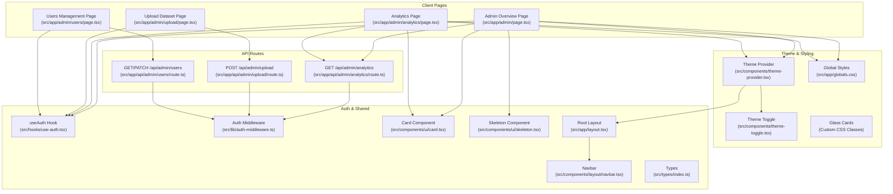
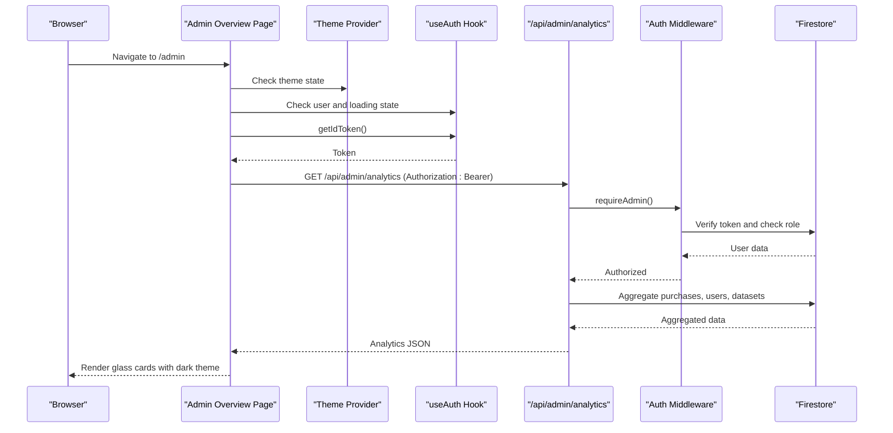
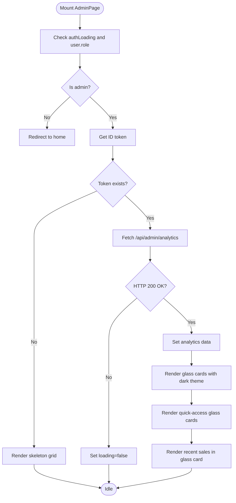
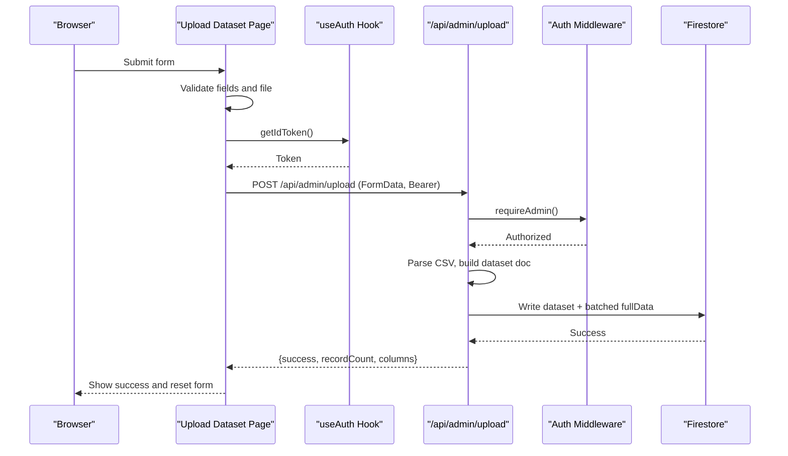
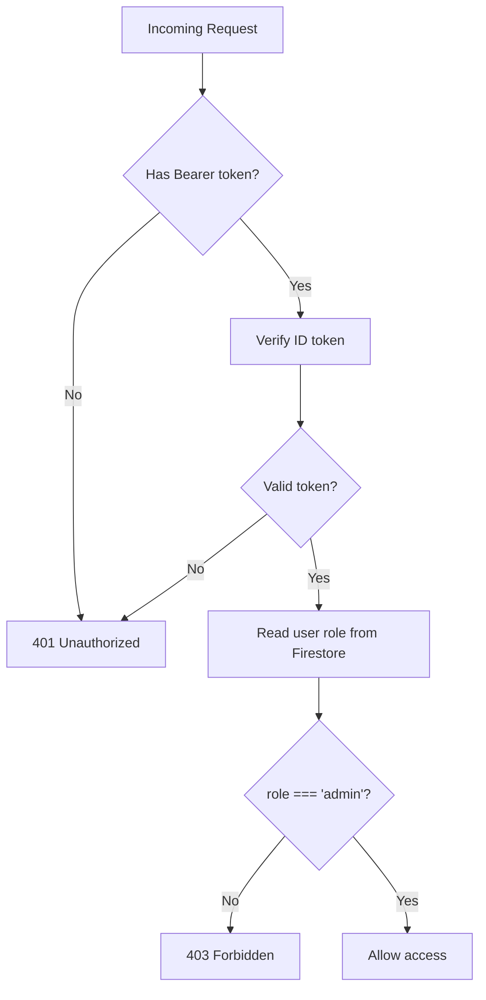
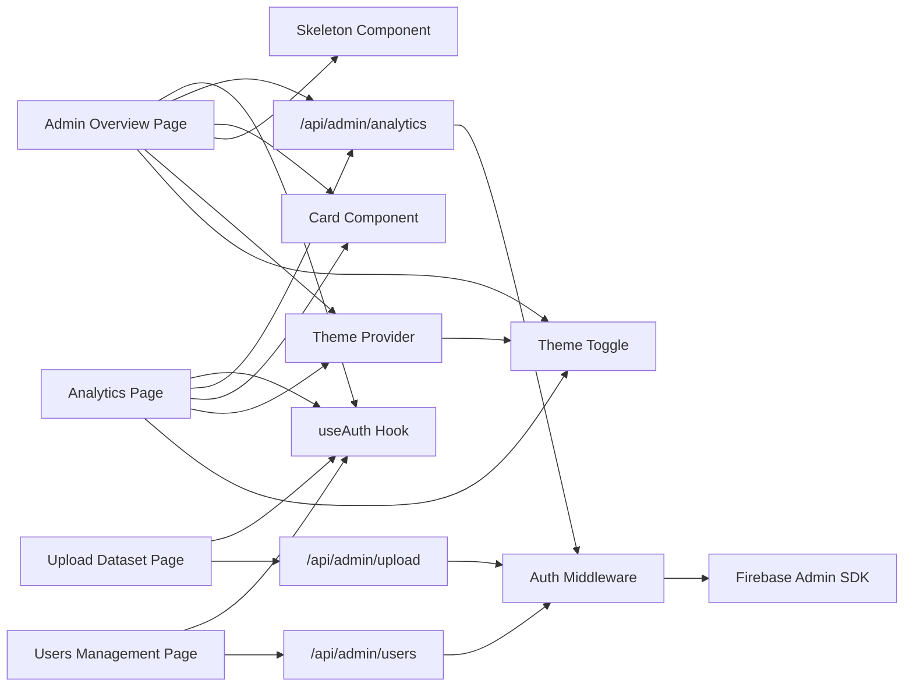

# Admin Dashboard Overview

<cite>
**Referenced Files in This Document**
- [src/app/admin/page.tsx](file://src/app/admin/page.tsx)
- [src/app/admin/analytics/page.tsx](file://src/app/admin/analytics/page.tsx)
- [src/app/admin/upload/page.tsx](file://src/app/admin/upload/page.tsx)
- [src/app/admin/users/page.tsx](file://src/app/admin/users/page.tsx)
- [src/app/api/admin/analytics/route.ts](file://src/app/api/admin/analytics/route.ts)
- [src/app/api/admin/upload/route.ts](file://src/app/api/admin/upload/route.ts)
- [src/app/api/admin/users/route.ts](file://src/app/api/admin/users/route.ts)
- [src/lib/auth-middleware.ts](file://src/lib/auth-middleware.ts)
- [src/hooks/use-auth.tsx](file://src/hooks/use-auth.tsx)
- [src/components/ui/card.tsx](file://src/components/ui/card.tsx)
- [src/components/ui/skeleton.tsx](file://src/components/ui/skeleton.tsx)
- [src/components/layout/navbar.tsx](file://src/components/layout/navbar.tsx)
- [src/app/layout.tsx](file://src/app/layout.tsx)
- [src/lib/firebase-admin.ts](file://src/lib/firebase-admin.ts)
- [src/types/index.ts](file://src/types/index.ts)
- [src/app/globals.css](file://src/app/globals.css)
- [src/components/theme-provider.tsx](file://src/components/theme-provider.tsx)
- [src/components/theme-toggle.tsx](file://src/components/theme-toggle.tsx)
</cite>

## Update Summary
**Changes Made**
- Added comprehensive documentation for the new dark theme implementation
- Documented glass-morphism card design system with backdrop blur effects
- Updated color scheme documentation with bright blue accents and dark navy backgrounds
- Enhanced analytics visualization section with glass card styling
- Added theme provider and toggle component documentation
- Updated UI component styling with glass-card classes and gradient effects

## Table of Contents
1. [Introduction](#introduction)
2. [Project Structure](#project-structure)
3. [Core Components](#core-components)
4. [Architecture Overview](#architecture-overview)
5. [Dark Theme Implementation](#dark-theme-implementation)
6. [Glass-Morphism Card System](#glass-morphism-card-system)
7. [Enhanced Analytics Visualization](#enhanced-analytics-visualization)
8. [Detailed Component Analysis](#detailed-component-analysis)
9. [Dependency Analysis](#dependency-analysis)
10. [Performance Considerations](#performance-considerations)
11. [Troubleshooting Guide](#troubleshooting-guide)
12. [Conclusion](#conclusion)

## Introduction
This document describes the Datafrica admin dashboard overview page, focusing on the main admin interface layout, navigation structure, quick access links, analytics summary cards, recent sales display, responsive grid layout system, card-based navigation components, authentication flow, upload dataset functionality, link navigation patterns, loading states with skeleton components, and error handling strategies. The dashboard now features a sophisticated dark theme with glass-morphism cards, enhanced color schemes, and improved analytics visualization.

## Project Structure
The admin dashboard is implemented as a Next.js app with a client-side admin page that orchestrates analytics retrieval, displays summary cards, and renders quick-access navigation. Supporting pages include analytics, upload, and users management. Authentication is enforced via middleware and client-side hooks. UI primitives are provided by shared components with enhanced dark theme styling.

**Diagram sources**
- [src/app/admin/page.tsx:38-241](file://src/app/admin/page.tsx#L38-L241)
- [src/app/admin/analytics/page.tsx:38-227](file://src/app/admin/analytics/page.tsx#L38-L227)
- [src/app/admin/upload/page.tsx:22-294](file://src/app/admin/upload/page.tsx#L22-L294)
- [src/app/admin/users/page.tsx:30-177](file://src/app/admin/users/page.tsx#L30-L177)
- [src/components/theme-provider.tsx:1-13](file://src/components/theme-provider.tsx#L1-L13)
- [src/components/theme-toggle.tsx:1-27](file://src/components/theme-toggle.tsx#L1-L27)
- [src/app/globals.css:128-182](file://src/app/globals.css#L128-L182)
- [src/app/api/admin/analytics/route.ts:1-77](file://src/app/api/admin/analytics/route.ts#L1-L77)
- [src/app/api/admin/upload/route.ts:1-92](file://src/app/api/admin/upload/route.ts#L1-L92)
- [src/app/api/admin/users/route.ts:1-53](file://src/app/api/admin/users/route.ts#L1-L53)
- [src/lib/auth-middleware.ts:1-47](file://src/lib/auth-middleware.ts#L1-L47)
- [src/hooks/use-auth.tsx:1-117](file://src/hooks/use-auth.tsx#L1-L117)
- [src/components/ui/card.tsx:1-104](file://src/components/ui/card.tsx#L1-L104)
- [src/components/ui/skeleton.tsx:1-14](file://src/components/ui/skeleton.tsx#L1-L14)
- [src/app/layout.tsx:26-49](file://src/app/layout.tsx#L26-L49)
- [src/components/layout/navbar.tsx:18-166](file://src/components/layout/navbar.tsx#L18-L166)

**Section sources**
- [src/app/admin/page.tsx:1-242](file://src/app/admin/page.tsx#L1-L242)
- [src/app/admin/analytics/page.tsx:1-228](file://src/app/admin/analytics/page.tsx#L1-L228)
- [src/app/admin/upload/page.tsx:1-295](file://src/app/admin/upload/page.tsx#L1-L295)
- [src/app/admin/users/page.tsx:1-178](file://src/app/admin/users/page.tsx#L1-L178)
- [src/app/globals.css:1-196](file://src/app/globals.css#L1-L196)
- [src/components/theme-provider.tsx:1-13](file://src/components/theme-provider.tsx#L1-L13)
- [src/components/theme-toggle.tsx:1-27](file://src/components/theme-toggle.tsx#L1-L27)

## Core Components
- Admin Overview Page: Orchestrates analytics retrieval, renders quick-access cards, summary stats, and recent sales with glass-morphism styling. Implements client-side auth checks and skeleton loaders.
- Analytics Page: Dedicated analytics view with enhanced glass cards, mirroring overview stats plus top-selling datasets and recent sales.
- Upload Dataset Page: Handles CSV upload, form validation, and submission to the backend with progress and success states.
- Users Management Page: Lists users and toggles roles with client-side updates and server-side persistence.
- Theme Provider: Manages dark theme state and system preference detection.
- Theme Toggle: Allows manual switching between light and dark themes.
- Auth Middleware: Enforces admin-only access for protected API routes.
- useAuth Hook: Provides user state, token acquisition, and session lifecycle.
- UI Components: Card and Skeleton primitives used across pages for consistent layout and loading states with enhanced dark theme support.

**Section sources**
- [src/app/admin/page.tsx:38-241](file://src/app/admin/page.tsx#L38-L241)
- [src/app/admin/analytics/page.tsx:38-227](file://src/app/admin/analytics/page.tsx#L38-L227)
- [src/app/admin/upload/page.tsx:22-294](file://src/app/admin/upload/page.tsx#L22-L294)
- [src/app/admin/users/page.tsx:30-177](file://src/app/admin/users/page.tsx#L30-L177)
- [src/components/theme-provider.tsx:1-13](file://src/components/theme-provider.tsx#L1-L13)
- [src/components/theme-toggle.tsx:1-27](file://src/components/theme-toggle.tsx#L1-L27)
- [src/lib/auth-middleware.ts:19-47](file://src/lib/auth-middleware.ts#L19-L47)
- [src/hooks/use-auth.tsx:34-117](file://src/hooks/use-auth.tsx#L34-L117)
- [src/components/ui/card.tsx:1-104](file://src/components/ui/card.tsx#L1-L104)
- [src/components/ui/skeleton.tsx:1-14](file://src/components/ui/skeleton.tsx#L1-L14)

## Architecture Overview
The admin dashboard follows a client-server architecture with enhanced dark theme support:
- Client pages use the useAuth hook to guard routes and fetch ID tokens.
- Protected API routes validate admin permissions via auth middleware.
- Firestore is accessed server-side for analytics computations and data mutations.
- UI components provide reusable layouts and loading states with glass-morphism styling.
- Theme provider manages dark theme state and system preferences.

**Diagram sources**
- [src/app/admin/page.tsx:44-72](file://src/app/admin/page.tsx#L44-L72)
- [src/components/theme-provider.tsx:6-12](file://src/components/theme-provider.tsx#L6-L12)
- [src/hooks/use-auth.tsx:94-99](file://src/hooks/use-auth.tsx#L94-L99)
- [src/app/api/admin/analytics/route.ts:6-69](file://src/app/api/admin/analytics/route.ts#L6-L69)
- [src/lib/auth-middleware.ts:19-47](file://src/lib/auth-middleware.ts#L19-L47)
- [src/lib/firebase-admin.ts:30-42](file://src/lib/firebase-admin.ts#L30-L42)

## Dark Theme Implementation
The dashboard implements a sophisticated dark theme system designed specifically for data visualization:

### Theme Configuration
- **Always Dark**: The application enforces a dark theme by default with `.dark` class on HTML element
- **Bright Navy Color Scheme**: Deep blue (#0a1628) background with bright blue (#3d7eff) accents
- **Glass Morphism**: Cards feature translucent backgrounds with backdrop blur effects
- **Color Variables**: Custom CSS variables define consistent color palette across components

### Key Color Variables
- Background: `#0a1628` (deep navy)
- Foreground: `#e8ecf4` (light gray-blue)
- Primary: `#3d7eff` (bright blue)
- Secondary: `#1a2a42` (medium navy)
- Accent: `#1a2a42` (medium navy)
- Muted: `#152238` (dark navy)
- Card: `#111d32` (slightly lighter than background)

**Section sources**
- [src/app/globals.css:46-115](file://src/app/globals.css#L46-L115)
- [src/app/layout.tsx:32-36](file://src/app/layout.tsx#L32-L36)
- [src/components/theme-provider.tsx:6-12](file://src/components/theme-provider.tsx#L6-L12)

## Glass-Morphism Card System
The dashboard employs a sophisticated glass-morphism design system that enhances the dark theme experience:

### Glass Card Properties
- **Translucent Background**: `rgba(17, 29, 50, 0.6)` for subtle opacity
- **Ultra-Thin Border**: `1px solid rgba(255, 255, 255, 0.06)` for subtle definition
- **Backdrop Blur**: `blur(12px)` for frosted glass effect
- **Hover Effects**: Increased border opacity to `rgba(255, 255, 255, 0.12)` on interaction
- **Gradient Borders**: Optional gradient borders on hover for interactive elements

### Card Variants
- **Stat Cards**: Rounded-xl with padding-5, featuring subtle glow effects
- **Navigation Cards**: Hover animations with slight elevation (`-translate-y-0.5`)
- **Analytics Cards**: Full-width cards with border support for enhanced visibility
- **Quick Access Cards**: Compact cards with icon containers and hover effects

### Visual Enhancements
- **Stat Glow**: Subtle blue glow (`box-shadow: 0 0 40px rgba(61, 126, 255, 0.05)`) for key metrics
- **Gradient Text**: Multi-color gradient for visual interest
- **Hero Background**: Radial gradients for hero sections
- **Border Gradients**: Animated gradient borders for interactive elements

**Section sources**
- [src/app/globals.css:128-182](file://src/app/globals.css#L128-L182)
- [src/app/admin/page.tsx:106-133](file://src/app/admin/page.tsx#L106-L133)
- [src/app/admin/page.tsx:149-159](file://src/app/admin/page.tsx#L149-L159)
- [src/app/admin/analytics/page.tsx:104-150](file://src/app/admin/analytics/page.tsx#L104-L150)

## Enhanced Analytics Visualization
The analytics system has been significantly enhanced with glass-morphism styling and improved visual hierarchy:

### Overview Statistics
- **Four-Column Grid**: Responsive layout with equal-width cards
- **Icon Containers**: Circular containers with colored backgrounds for icons
- **Color-Coded Metrics**: Emerald for revenue, Blue for sales, Amber for users, Purple for datasets
- **Hover Animations**: Slight elevation and border enhancement on interaction

### Detailed Analytics
- **Top Selling Datasets**: Ranked list with position indicators and revenue display
- **Recent Sales**: Timeline view with timestamps and monetary values
- **Consistent Styling**: All analytics cards use the glass-morphism design system
- **Responsive Design**: Adapts to different screen sizes while maintaining visual consistency

### Visual Improvements
- **Green Revenue Indicators**: Emphasize positive financial metrics
- **Blue Primary Accents**: Consistent brand color throughout analytics
- **Subtle Borders**: White/10 opacity borders for depth perception
- **Enhanced Typography**: Clear hierarchy with bold metrics and descriptive labels

**Section sources**
- [src/app/admin/page.tsx:143-162](file://src/app/admin/page.tsx#L143-L162)
- [src/app/admin/analytics/page.tsx:103-150](file://src/app/admin/analytics/page.tsx#L103-L150)
- [src/app/admin/analytics/page.tsx:153-216](file://src/app/admin/analytics/page.tsx#L153-L216)

## Detailed Component Analysis

### Admin Overview Page
Responsibilities:
- Enforce admin-only access using client-side checks and redirect on failure.
- Fetch analytics via a bearer token and render skeleton loaders while loading.
- Display quick-access cards linking to upload, users, and analytics with glass-morphism styling.
- Present four summary cards with enhanced visual design: total revenue, total sales, total users, and datasets.
- Show recent sales with dataset titles, amounts, and timestamps in glass cards.

Key behaviors:
- Authentication guard runs on mount and navigation changes.
- Analytics fetched once authenticated and token acquired.
- Skeleton placeholders used for initial load and per-card loading.
- Responsive grid layout using CSS grid classes for cards and quick links.
- Glass cards provide modern, translucent appearance with hover effects.

**Diagram sources**
- [src/app/admin/page.tsx:44-85](file://src/app/admin/page.tsx#L44-L85)
- [src/app/admin/page.tsx:50-72](file://src/app/admin/page.tsx#L50-L72)
- [src/app/admin/page.tsx:148-238](file://src/app/admin/page.tsx#L148-L238)

**Section sources**
- [src/app/admin/page.tsx:38-241](file://src/app/admin/page.tsx#L38-L241)
- [src/components/ui/card.tsx:1-104](file://src/components/ui/card.tsx#L1-L104)
- [src/components/ui/skeleton.tsx:1-14](file://src/components/ui/skeleton.tsx#L1-L14)
- [src/app/globals.css:128-182](file://src/app/globals.css#L128-L182)

### Analytics Page
Responsibilities:
- Mirror overview analytics with enhanced glass card styling and dedicated page layout.
- Display top-selling datasets with ranking, sales count, and revenue in glass cards.
- Show recent sales with timestamps and amounts in glass cards.
- Provide navigation back to the admin overview page.

Key behaviors:
- Uses the same auth guard and token-fetching pattern.
- Renders skeleton grid during initial load with glass card styling.
- Displays top datasets and recent sales in separate glass cards with consistent design.
- Maintains dark theme throughout the analytics interface.

**Section sources**
- [src/app/admin/analytics/page.tsx:38-227](file://src/app/admin/analytics/page.tsx#L38-L227)
- [src/app/globals.css:128-182](file://src/app/globals.css#L128-L182)

### Upload Dataset Page
Responsibilities:
- Provide a form to upload CSV datasets with metadata.
- Validate required fields and enforce CSV parsing.
- Submit to the backend with multipart/form-data and show success/error feedback.

Key behaviors:
- Enforces admin-only access and redirects otherwise.
- Builds FormData and sends POST to /api/admin/upload with Authorization header.
- Shows uploading state and success screen with dataset metrics.
- Uses toast notifications for user feedback.

**Diagram sources**
- [src/app/admin/upload/page.tsx:44-98](file://src/app/admin/upload/page.tsx#L44-L98)
- [src/app/api/admin/upload/route.ts:6-92](file://src/app/api/admin/upload/route.ts#L6-L92)
- [src/lib/auth-middleware.ts:19-28](file://src/lib/auth-middleware.ts#L19-L28)

**Section sources**
- [src/app/admin/upload/page.tsx:22-294](file://src/app/admin/upload/page.tsx#L22-L294)
- [src/app/api/admin/upload/route.ts:1-93](file://src/app/api/admin/upload/route.ts#L1-L93)

### Users Management Page
Responsibilities:
- List all users with role badges and join dates.
- Toggle user roles via PATCH to the backend.
- Handle loading states and error notifications.

Key behaviors:
- Enforces admin-only access.
- Fetches users on mount and updates UI reactively after role changes.
- Uses toast notifications for success/error feedback.

**Section sources**
- [src/app/admin/users/page.tsx:30-177](file://src/app/admin/users/page.tsx#L30-L177)
- [src/app/api/admin/users/route.ts:5-53](file://src/app/api/admin/users/route.ts#L5-L53)

### Authentication Flow
Responsibilities:
- Verify bearer token on protected routes.
- Confirm admin role by checking Firestore user document.
- Return unauthorized or forbidden responses when validation fails.

**Diagram sources**
- [src/lib/auth-middleware.ts:4-47](file://src/lib/auth-middleware.ts#L4-L47)
- [src/lib/firebase-admin.ts:30-42](file://src/lib/firebase-admin.ts#L30-L42)

**Section sources**
- [src/lib/auth-middleware.ts:1-48](file://src/lib/auth-middleware.ts#L1-L48)
- [src/hooks/use-auth.tsx:34-117](file://src/hooks/use-auth.tsx#L34-L117)

### Navigation and Layout
Responsibilities:
- Provide global navigation with admin link visibility based on role.
- Wrap app with theme provider and auth provider.
- Offer mobile-responsive navigation and user dropdown with dark theme styling.
- Implement glass-morphism effects in navigation elements.

Key behaviors:
- Navbar conditionally renders Admin link for admin users.
- Root layout composes providers and global styles with dark theme enforcement.
- Navigation uses glass cards for menu items and dropdowns.
- Theme toggle allows manual switching between light and dark modes.

**Section sources**
- [src/components/layout/navbar.tsx:18-166](file://src/components/layout/navbar.tsx#L18-L166)
- [src/app/layout.tsx:26-49](file://src/app/layout.tsx#L26-L49)
- [src/components/theme-toggle.tsx:1-27](file://src/components/theme-toggle.tsx#L1-L27)

### Data Models and Types
Responsibilities:
- Define User, Dataset, Purchase, and DownloadToken interfaces.
- Provide categories and countries enums for forms.

Key behaviors:
- Used across pages for type safety and autocomplete.
- Categories and countries lists power selects in upload form.

**Section sources**
- [src/types/index.ts:3-89](file://src/types/index.ts#L3-L89)

## Dependency Analysis
High-level dependencies:
- Admin overview depends on useAuth for user state and token, and on API analytics for data.
- Admin overview also depends on theme provider for dark theme management.
- API analytics depends on auth middleware and Firestore for aggregation.
- Upload page depends on useAuth and API upload route.
- Users page depends on useAuth and API users route.
- UI components (Card, Skeleton) are reused across pages with enhanced dark theme support.

**Diagram sources**
- [src/app/admin/page.tsx:3-16](file://src/app/admin/page.tsx#L3-L16)
- [src/app/admin/analytics/page.tsx:3-16](file://src/app/admin/analytics/page.tsx#L3-L16)
- [src/app/admin/upload/page.tsx:3-20](file://src/app/admin/upload/page.tsx#L3-L20)
- [src/app/admin/users/page.tsx:3-20](file://src/app/admin/users/page.tsx#L3-L20)
- [src/components/theme-provider.tsx:1-13](file://src/components/theme-provider.tsx#L1-L13)
- [src/components/theme-toggle.tsx:1-27](file://src/components/theme-toggle.tsx#L1-L27)
- [src/app/api/admin/analytics/route.ts:1-3](file://src/app/api/admin/analytics/route.ts#L1-L3)
- [src/app/api/admin/upload/route.ts:1-4](file://src/app/api/admin/upload/route.ts#L1-L4)
- [src/app/api/admin/users/route.ts:1-3](file://src/app/api/admin/users/route.ts#L1-L3)
- [src/lib/auth-middleware.ts:1-3](file://src/lib/auth-middleware.ts#L1-L3)
- [src/lib/firebase-admin.ts:1-50](file://src/lib/firebase-admin.ts#L1-L50)

**Section sources**
- [src/app/admin/page.tsx:1-242](file://src/app/admin/page.tsx#L1-L242)
- [src/app/admin/analytics/page.tsx:1-228](file://src/app/admin/analytics/page.tsx#L1-L228)
- [src/app/admin/upload/page.tsx:1-295](file://src/app/admin/upload/page.tsx#L1-L295)
- [src/app/admin/users/page.tsx:1-178](file://src/app/admin/users/page.tsx#L1-L178)
- [src/app/api/admin/analytics/route.ts:1-78](file://src/app/api/admin/analytics/route.ts#L1-L78)
- [src/app/api/admin/upload/route.ts:1-93](file://src/app/api/admin/upload/route.ts#L1-L93)
- [src/app/api/admin/users/route.ts:1-54](file://src/app/api/admin/users/route.ts#L1-L54)
- [src/lib/auth-middleware.ts:1-48](file://src/lib/auth-middleware.ts#L1-L48)
- [src/lib/firebase-admin.ts:1-50](file://src/lib/firebase-admin.ts#L1-L50)
- [src/components/theme-provider.tsx:1-13](file://src/components/theme-provider.tsx#L1-L13)
- [src/components/theme-toggle.tsx:1-27](file://src/components/theme-toggle.tsx#L1-L27)

## Performance Considerations
- Client-side caching: Consider memoizing analytics data to avoid redundant fetches during navigation.
- Skeleton usage: Keep skeleton durations minimal to reduce perceived latency.
- Glass card performance: Backdrop blur effects are GPU-accelerated and performant on modern devices.
- Theme switching: Theme toggle uses CSS variables for instant switching without re-rendering.
- Batched writes: Upload page already batches Firestore writes for large datasets.
- Lazy initialization: Firebase Admin SDK uses lazy initialization to minimize startup overhead.
- Grid responsiveness: CSS grid classes ensure efficient rendering across breakpoints.

## Troubleshooting Guide
Common issues and resolutions:
- Unauthorized access to admin pages:
  - Ensure the user is signed in and has an admin role. The client-side guard redirects non-admins to the home page.
  - Verify the bearer token is present and valid; the API requires Authorization: Bearer <token>.
- Analytics not loading:
  - Confirm the user role is admin and the token is retrievable via useAuth getIdToken.
  - Check network tab for 401/403 responses from the analytics endpoint.
- Glass card styling issues:
  - Verify that the glass-card CSS class is properly applied to container elements.
  - Ensure backdrop-filter is supported by the user's browser.
  - Check that the dark theme is active (HTML element has .dark class).
- Theme switching problems:
  - Confirm next-themes is properly configured in the theme provider.
  - Verify that localStorage is not blocking theme preference storage.
  - Check for CSS conflicts with custom glass card styles.
- Upload failures:
  - Validate CSV parsing errors and required fields.
  - Inspect the response payload for error messages and adjust accordingly.
- Users management errors:
  - Role toggle requests require a valid user ID and role value; ensure the request payload matches expected shape.

**Section sources**
- [src/app/admin/page.tsx:44-48](file://src/app/admin/page.tsx#L44-L48)
- [src/app/admin/analytics/page.tsx:44-48](file://src/app/admin/analytics/page.tsx#L44-L48)
- [src/app/admin/upload/page.tsx:44-98](file://src/app/admin/upload/page.tsx#L44-L98)
- [src/app/admin/users/page.tsx:36-92](file://src/app/admin/users/page.tsx#L36-L92)
- [src/app/api/admin/analytics/route.ts:6-10](file://src/app/api/admin/analytics/route.ts#L6-L10)
- [src/app/api/admin/upload/route.ts:8-28](file://src/app/api/admin/upload/route.ts#L8-L28)
- [src/app/api/admin/users/route.ts:32-45](file://src/app/api/admin/users/route.ts#L32-L45)
- [src/lib/auth-middleware.ts:19-47](file://src/lib/auth-middleware.ts#L19-L47)
- [src/app/globals.css:128-182](file://src/app/globals.css#L128-L182)

## Conclusion
The admin dashboard overview page integrates client-side authentication, analytics retrieval, and responsive UI components to deliver a concise administrative overview with a sophisticated dark theme implementation. The glass-morphism card system provides a modern, translucent appearance that enhances the dark theme experience while maintaining excellent readability and visual hierarchy. 

The dashboard leverages a robust auth middleware for server-side protection, consistent UI primitives for loading states, and structured navigation to guide admins to upload, users, and analytics functions. The enhanced analytics visualization with glass cards improves data presentation and user engagement. The upload flow and users management complement the overview with practical admin capabilities, while error handling and skeleton components improve resilience and UX.

The implementation demonstrates advanced design patterns including custom CSS variables for theming, glass-morphism effects with backdrop blur, and responsive design principles that adapt to various screen sizes while maintaining visual consistency across the entire admin interface.