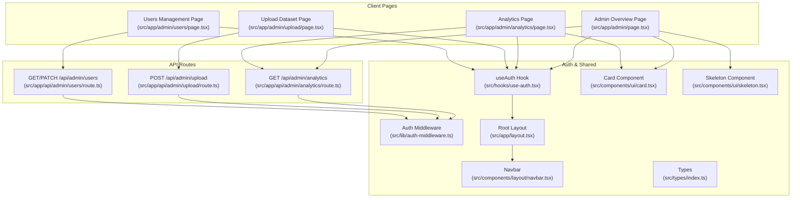
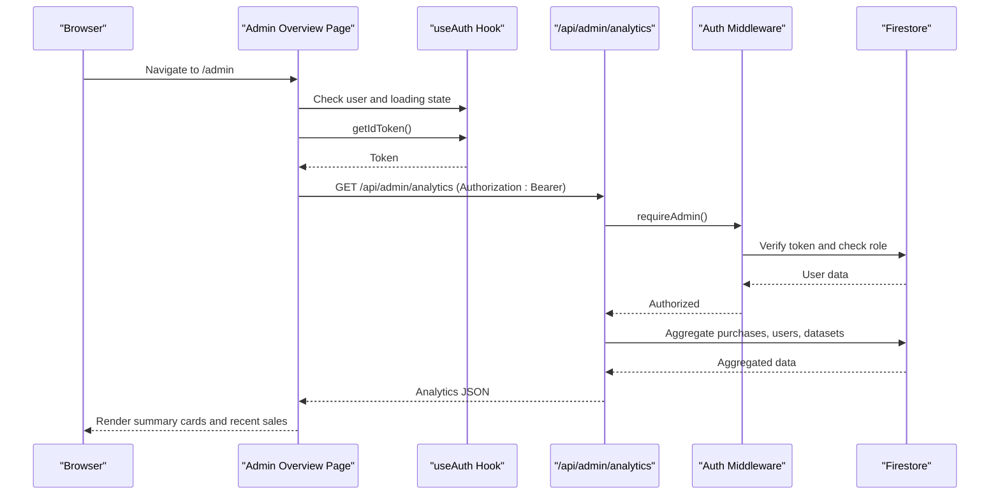
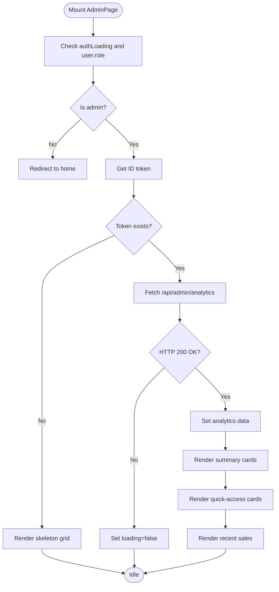
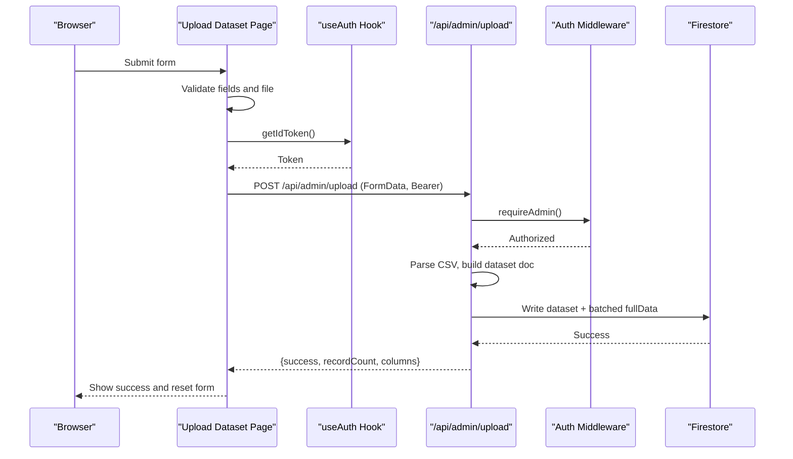
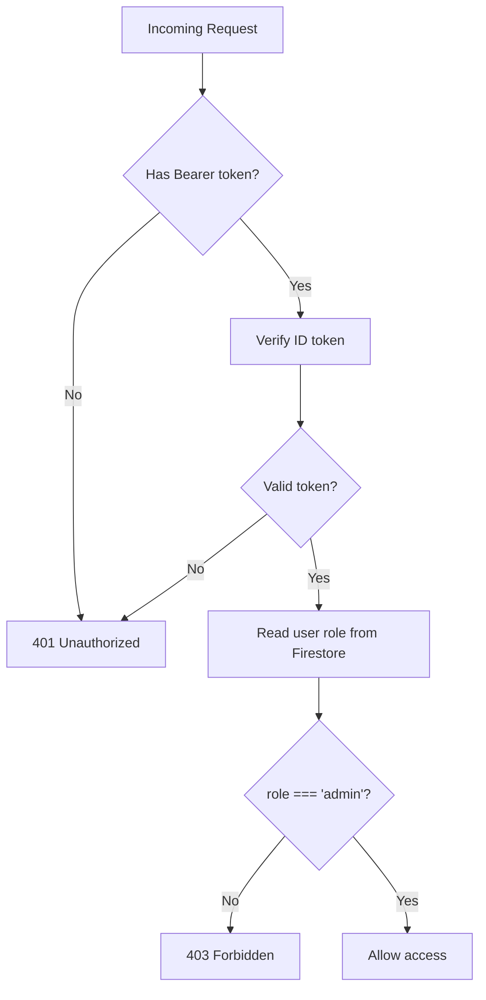
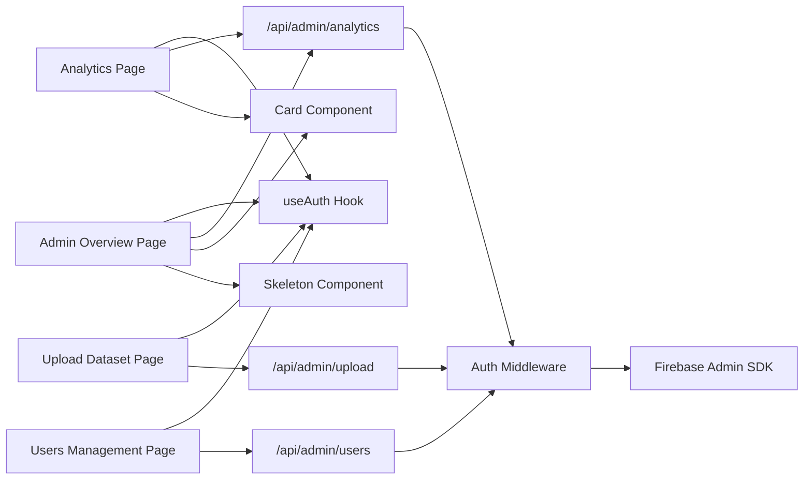

# Admin Dashboard Overview

<cite>
**Referenced Files in This Document**
- [src/app/admin/page.tsx](file://src/app/admin/page.tsx)
- [src/app/admin/analytics/page.tsx](file://src/app/admin/analytics/page.tsx)
- [src/app/admin/upload/page.tsx](file://src/app/admin/upload/page.tsx)
- [src/app/admin/users/page.tsx](file://src/app/admin/users/page.tsx)
- [src/app/api/admin/analytics/route.ts](file://src/app/api/admin/analytics/route.ts)
- [src/app/api/admin/upload/route.ts](file://src/app/api/admin/upload/route.ts)
- [src/app/api/admin/users/route.ts](file://src/app/api/admin/users/route.ts)
- [src/lib/auth-middleware.ts](file://src/lib/auth-middleware.ts)
- [src/hooks/use-auth.tsx](file://src/hooks/use-auth.tsx)
- [src/components/ui/card.tsx](file://src/components/ui/card.tsx)
- [src/components/ui/skeleton.tsx](file://src/components/ui/skeleton.tsx)
- [src/components/layout/navbar.tsx](file://src/components/layout/navbar.tsx)
- [src/app/layout.tsx](file://src/app/layout.tsx)
- [src/lib/firebase-admin.ts](file://src/lib/firebase-admin.ts)
- [src/types/index.ts](file://src/types/index.ts)
</cite>

## Table of Contents
1. [Introduction](#introduction)
2. [Project Structure](#project-structure)
3. [Core Components](#core-components)
4. [Architecture Overview](#architecture-overview)
5. [Detailed Component Analysis](#detailed-component-analysis)
6. [Dependency Analysis](#dependency-analysis)
7. [Performance Considerations](#performance-considerations)
8. [Troubleshooting Guide](#troubleshooting-guide)
9. [Conclusion](#conclusion)

## Introduction
This document describes the Datafrica admin dashboard overview page, focusing on the main admin interface layout, navigation structure, quick access links, analytics summary cards, recent sales display, responsive grid layout system, card-based navigation components, authentication flow, upload dataset functionality, link navigation patterns, loading states with skeleton components, and error handling strategies.

## Project Structure
The admin dashboard is implemented as a Next.js app with a client-side admin page that orchestrates analytics retrieval, displays summary cards, and renders quick-access navigation. Supporting pages include analytics, upload, and users management. Authentication is enforced via middleware and client-side hooks. UI primitives are provided by shared components.

**Diagram sources**
- [src/app/admin/page.tsx:38-241](file://src/app/admin/page.tsx#L38-L241)
- [src/app/admin/analytics/page.tsx:38-227](file://src/app/admin/analytics/page.tsx#L38-L227)
- [src/app/admin/upload/page.tsx:22-294](file://src/app/admin/upload/page.tsx#L22-L294)
- [src/app/admin/users/page.tsx:30-177](file://src/app/admin/users/page.tsx#L30-L177)
- [src/app/api/admin/analytics/route.ts:1-77](file://src/app/api/admin/analytics/route.ts#L1-L77)
- [src/app/api/admin/upload/route.ts:1-92](file://src/app/api/admin/upload/route.ts#L1-L92)
- [src/app/api/admin/users/route.ts:1-53](file://src/app/api/admin/users/route.ts#L1-L53)
- [src/lib/auth-middleware.ts:1-47](file://src/lib/auth-middleware.ts#L1-L47)
- [src/hooks/use-auth.tsx:1-117](file://src/hooks/use-auth.tsx#L1-L117)
- [src/components/ui/card.tsx:1-104](file://src/components/ui/card.tsx#L1-L104)
- [src/components/ui/skeleton.tsx:1-14](file://src/components/ui/skeleton.tsx#L1-L14)
- [src/app/layout.tsx:26-49](file://src/app/layout.tsx#L26-L49)
- [src/components/layout/navbar.tsx:18-166](file://src/components/layout/navbar.tsx#L18-L166)

**Section sources**
- [src/app/admin/page.tsx:1-242](file://src/app/admin/page.tsx#L1-L242)
- [src/app/admin/analytics/page.tsx:1-228](file://src/app/admin/analytics/page.tsx#L1-L228)
- [src/app/admin/upload/page.tsx:1-295](file://src/app/admin/upload/page.tsx#L1-L295)
- [src/app/admin/users/page.tsx:1-178](file://src/app/admin/users/page.tsx#L1-L178)
- [src/app/api/admin/analytics/route.ts:1-78](file://src/app/api/admin/analytics/route.ts#L1-L78)
- [src/app/api/admin/upload/route.ts:1-93](file://src/app/api/admin/upload/route.ts#L1-L93)
- [src/app/api/admin/users/route.ts:1-54](file://src/app/api/admin/users/route.ts#L1-L54)
- [src/lib/auth-middleware.ts:1-48](file://src/lib/auth-middleware.ts#L1-L48)
- [src/hooks/use-auth.tsx:1-117](file://src/hooks/use-auth.tsx#L1-L117)
- [src/components/ui/card.tsx:1-104](file://src/components/ui/card.tsx#L1-L104)
- [src/components/ui/skeleton.tsx:1-14](file://src/components/ui/skeleton.tsx#L1-L14)
- [src/app/layout.tsx:1-50](file://src/app/layout.tsx#L1-L50)
- [src/components/layout/navbar.tsx:1-167](file://src/components/layout/navbar.tsx#L1-L167)

## Core Components
- Admin Overview Page: Orchestrates analytics retrieval, renders quick-access cards, summary stats, and recent sales. Implements client-side auth checks and skeleton loaders.
- Analytics Page: Dedicated analytics view mirroring overview stats plus top-selling datasets and recent sales.
- Upload Dataset Page: Handles CSV upload, form validation, and submission to the backend with progress and success states.
- Users Management Page: Lists users and toggles roles with client-side updates and server-side persistence.
- Auth Middleware: Enforces admin-only access for protected API routes.
- useAuth Hook: Provides user state, token acquisition, and session lifecycle.
- UI Components: Card and Skeleton primitives used across pages for consistent layout and loading states.

**Section sources**
- [src/app/admin/page.tsx:38-241](file://src/app/admin/page.tsx#L38-L241)
- [src/app/admin/analytics/page.tsx:38-227](file://src/app/admin/analytics/page.tsx#L38-L227)
- [src/app/admin/upload/page.tsx:22-294](file://src/app/admin/upload/page.tsx#L22-L294)
- [src/app/admin/users/page.tsx:30-177](file://src/app/admin/users/page.tsx#L30-L177)
- [src/lib/auth-middleware.ts:19-47](file://src/lib/auth-middleware.ts#L19-L47)
- [src/hooks/use-auth.tsx:34-117](file://src/hooks/use-auth.tsx#L34-L117)
- [src/components/ui/card.tsx:1-104](file://src/components/ui/card.tsx#L1-L104)
- [src/components/ui/skeleton.tsx:1-14](file://src/components/ui/skeleton.tsx#L1-L14)

## Architecture Overview
The admin dashboard follows a client-server architecture:
- Client pages use the useAuth hook to guard routes and fetch ID tokens.
- Protected API routes validate admin permissions via auth middleware.
- Firestore is accessed server-side for analytics computations and data mutations.
- UI components provide reusable layouts and loading states.

**Diagram sources**
- [src/app/admin/page.tsx:44-72](file://src/app/admin/page.tsx#L44-L72)
- [src/hooks/use-auth.tsx:94-99](file://src/hooks/use-auth.tsx#L94-L99)
- [src/app/api/admin/analytics/route.ts:6-69](file://src/app/api/admin/analytics/route.ts#L6-L69)
- [src/lib/auth-middleware.ts:19-47](file://src/lib/auth-middleware.ts#L19-L47)
- [src/lib/firebase-admin.ts:30-42](file://src/lib/firebase-admin.ts#L30-L42)

## Detailed Component Analysis

### Admin Overview Page
Responsibilities:
- Enforce admin-only access using client-side checks and redirect on failure.
- Fetch analytics via a bearer token and render skeleton loaders while loading.
- Display quick-access cards linking to upload, users, and analytics.
- Present four summary cards: total revenue, total sales, total users, and datasets.
- Show recent sales with dataset titles, amounts, and timestamps.

Key behaviors:
- Authentication guard runs on mount and navigation changes.
- Analytics fetched once authenticated and token acquired.
- Skeleton placeholders used for initial load and per-card loading.
- Responsive grid layout using CSS grid classes for cards and quick links.

**Diagram sources**
- [src/app/admin/page.tsx:44-85](file://src/app/admin/page.tsx#L44-L85)
- [src/app/admin/page.tsx:50-72](file://src/app/admin/page.tsx#L50-L72)
- [src/app/admin/page.tsx:148-238](file://src/app/admin/page.tsx#L148-L238)

**Section sources**
- [src/app/admin/page.tsx:38-241](file://src/app/admin/page.tsx#L38-L241)
- [src/components/ui/card.tsx:1-104](file://src/components/ui/card.tsx#L1-L104)
- [src/components/ui/skeleton.tsx:1-14](file://src/components/ui/skeleton.tsx#L1-L14)

### Analytics Page
Responsibilities:
- Mirror overview analytics with a dedicated page.
- Display top-selling datasets with ranking, sales count, and revenue.
- Show recent sales with timestamps and amounts.

Key behaviors:
- Uses the same auth guard and token-fetching pattern.
- Renders skeleton grid during initial load.
- Displays top datasets and recent sales in separate cards.

**Section sources**
- [src/app/admin/analytics/page.tsx:38-227](file://src/app/admin/analytics/page.tsx#L38-L227)

### Upload Dataset Page
Responsibilities:
- Provide a form to upload CSV datasets with metadata.
- Validate required fields and enforce CSV parsing.
- Submit to the backend with multipart/form-data and show success/error feedback.

Key behaviors:
- Enforces admin-only access and redirects otherwise.
- Builds FormData and sends POST to /api/admin/upload with Authorization header.
- Shows uploading state and success screen with dataset metrics.
- Uses toast notifications for user feedback.

**Diagram sources**
- [src/app/admin/upload/page.tsx:44-98](file://src/app/admin/upload/page.tsx#L44-L98)
- [src/app/api/admin/upload/route.ts:6-92](file://src/app/api/admin/upload/route.ts#L6-L92)
- [src/lib/auth-middleware.ts:19-28](file://src/lib/auth-middleware.ts#L19-L28)

**Section sources**
- [src/app/admin/upload/page.tsx:22-294](file://src/app/admin/upload/page.tsx#L22-L294)
- [src/app/api/admin/upload/route.ts:1-93](file://src/app/api/admin/upload/route.ts#L1-L93)

### Users Management Page
Responsibilities:
- List all users with role badges and join dates.
- Toggle user roles via PATCH to the backend.
- Handle loading states and error notifications.

Key behaviors:
- Enforces admin-only access.
- Fetches users on mount and updates UI reactively after role changes.
- Uses toast notifications for success/error feedback.

**Section sources**
- [src/app/admin/users/page.tsx:30-177](file://src/app/admin/users/page.tsx#L30-L177)
- [src/app/api/admin/users/route.ts:5-53](file://src/app/api/admin/users/route.ts#L5-L53)

### Authentication Flow
Responsibilities:
- Verify bearer token on protected routes.
- Confirm admin role by checking Firestore user document.
- Return unauthorized or forbidden responses when validation fails.

**Diagram sources**
- [src/lib/auth-middleware.ts:4-47](file://src/lib/auth-middleware.ts#L4-L47)
- [src/lib/firebase-admin.ts:30-42](file://src/lib/firebase-admin.ts#L30-L42)

**Section sources**
- [src/lib/auth-middleware.ts:1-48](file://src/lib/auth-middleware.ts#L1-L48)
- [src/hooks/use-auth.tsx:34-117](file://src/hooks/use-auth.tsx#L34-L117)

### Navigation and Layout
Responsibilities:
- Provide global navigation with admin link visibility based on role.
- Wrap app with theme provider and auth provider.
- Offer mobile-responsive navigation and user dropdown.

Key behaviors:
- Navbar conditionally renders Admin link for admin users.
- Root layout composes providers and global styles.

**Section sources**
- [src/components/layout/navbar.tsx:18-166](file://src/components/layout/navbar.tsx#L18-L166)
- [src/app/layout.tsx:26-49](file://src/app/layout.tsx#L26-L49)

### Data Models and Types
Responsibilities:
- Define User, Dataset, Purchase, and DownloadToken interfaces.
- Provide categories and countries enums for forms.

Key behaviors:
- Used across pages for type safety and autocomplete.
- Categories and countries lists power selects in upload form.

**Section sources**
- [src/types/index.ts:3-89](file://src/types/index.ts#L3-L89)

## Dependency Analysis
High-level dependencies:
- Admin overview depends on useAuth for user state and token, and on API analytics for data.
- API analytics depends on auth middleware and Firestore for aggregation.
- Upload page depends on useAuth and API upload route.
- Users page depends on useAuth and API users route.
- UI components (Card, Skeleton) are reused across pages.

**Diagram sources**
- [src/app/admin/page.tsx:3-16](file://src/app/admin/page.tsx#L3-L16)
- [src/app/admin/analytics/page.tsx:3-16](file://src/app/admin/analytics/page.tsx#L3-L16)
- [src/app/admin/upload/page.tsx:3-20](file://src/app/admin/upload/page.tsx#L3-L20)
- [src/app/admin/users/page.tsx:3-20](file://src/app/admin/users/page.tsx#L3-L20)
- [src/app/api/admin/analytics/route.ts:1-3](file://src/app/api/admin/analytics/route.ts#L1-L3)
- [src/app/api/admin/upload/route.ts:1-4](file://src/app/api/admin/upload/route.ts#L1-L4)
- [src/app/api/admin/users/route.ts:1-3](file://src/app/api/admin/users/route.ts#L1-L3)
- [src/lib/auth-middleware.ts:1-3](file://src/lib/auth-middleware.ts#L1-L3)
- [src/lib/firebase-admin.ts:1-50](file://src/lib/firebase-admin.ts#L1-L50)

**Section sources**
- [src/app/admin/page.tsx:1-242](file://src/app/admin/page.tsx#L1-L242)
- [src/app/admin/analytics/page.tsx:1-228](file://src/app/admin/analytics/page.tsx#L1-L228)
- [src/app/admin/upload/page.tsx:1-295](file://src/app/admin/upload/page.tsx#L1-L295)
- [src/app/admin/users/page.tsx:1-178](file://src/app/admin/users/page.tsx#L1-L178)
- [src/app/api/admin/analytics/route.ts:1-78](file://src/app/api/admin/analytics/route.ts#L1-L78)
- [src/app/api/admin/upload/route.ts:1-93](file://src/app/api/admin/upload/route.ts#L1-L93)
- [src/app/api/admin/users/route.ts:1-54](file://src/app/api/admin/users/route.ts#L1-L54)
- [src/lib/auth-middleware.ts:1-48](file://src/lib/auth-middleware.ts#L1-L48)
- [src/lib/firebase-admin.ts:1-50](file://src/lib/firebase-admin.ts#L1-L50)

## Performance Considerations
- Client-side caching: Consider memoizing analytics data to avoid redundant fetches during navigation.
- Skeleton usage: Keep skeleton durations minimal to reduce perceived latency.
- Batched writes: Upload page already batches Firestore writes for large datasets.
- Lazy initialization: Firebase Admin SDK uses lazy initialization to minimize startup overhead.
- Grid responsiveness: CSS grid classes ensure efficient rendering across breakpoints.

[No sources needed since this section provides general guidance]

## Troubleshooting Guide
Common issues and resolutions:
- Unauthorized access to admin pages:
  - Ensure the user is signed in and has an admin role. The client-side guard redirects non-admins to the home page.
  - Verify the bearer token is present and valid; the API requires Authorization: Bearer <token>.
- Analytics not loading:
  - Confirm the user role is admin and the token is retrievable via useAuth getIdToken.
  - Check network tab for 401/403 responses from the analytics endpoint.
- Upload failures:
  - Validate CSV parsing errors and required fields.
  - Inspect the response payload for error messages and adjust accordingly.
- Users management errors:
  - Role toggle requests require a valid user ID and role value; ensure the request payload matches expected shape.

**Section sources**
- [src/app/admin/page.tsx:44-48](file://src/app/admin/page.tsx#L44-L48)
- [src/app/admin/analytics/page.tsx:44-48](file://src/app/admin/analytics/page.tsx#L44-L48)
- [src/app/admin/upload/page.tsx:44-98](file://src/app/admin/upload/page.tsx#L44-L98)
- [src/app/admin/users/page.tsx:36-92](file://src/app/admin/users/page.tsx#L36-L92)
- [src/app/api/admin/analytics/route.ts:6-10](file://src/app/api/admin/analytics/route.ts#L6-L10)
- [src/app/api/admin/upload/route.ts:8-28](file://src/app/api/admin/upload/route.ts#L8-L28)
- [src/app/api/admin/users/route.ts:32-45](file://src/app/api/admin/users/route.ts#L32-L45)
- [src/lib/auth-middleware.ts:19-47](file://src/lib/auth-middleware.ts#L19-L47)

## Conclusion
The admin dashboard overview page integrates client-side authentication, analytics retrieval, and responsive UI components to deliver a concise administrative overview. It leverages a robust auth middleware for server-side protection, consistent UI primitives for loading states, and structured navigation to guide admins to upload, users, and analytics functions. The upload flow and users management complement the overview with practical admin capabilities, while error handling and skeleton components improve resilience and UX.