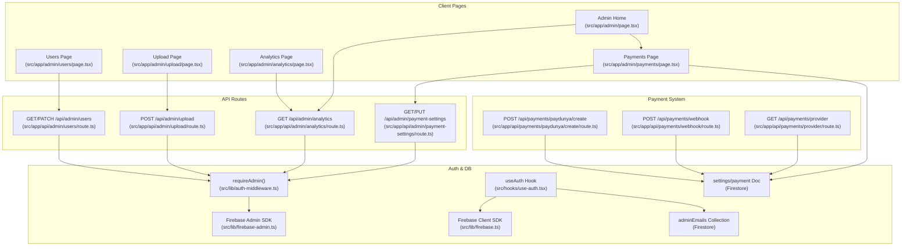
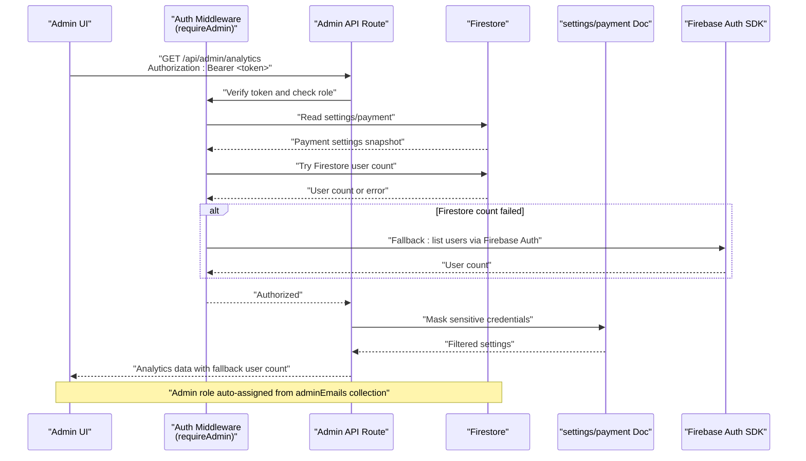
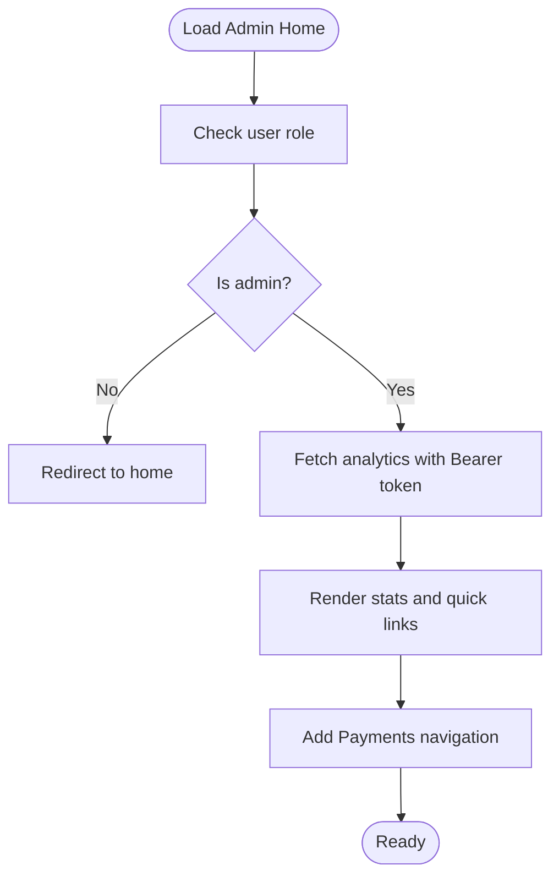
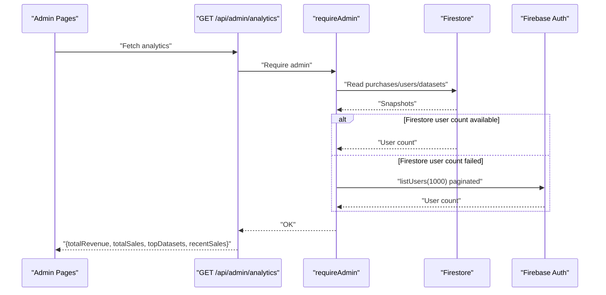
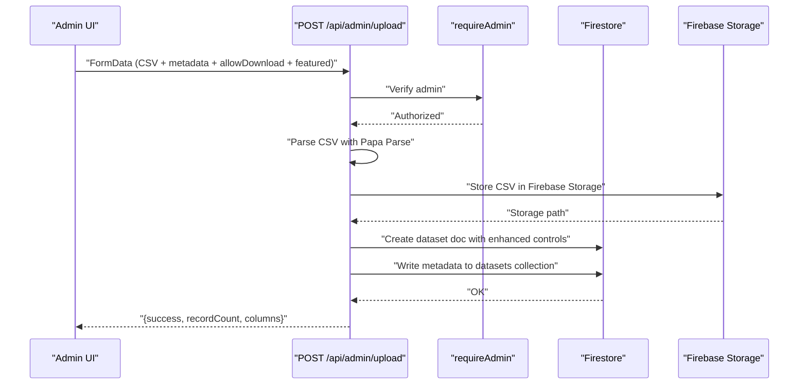
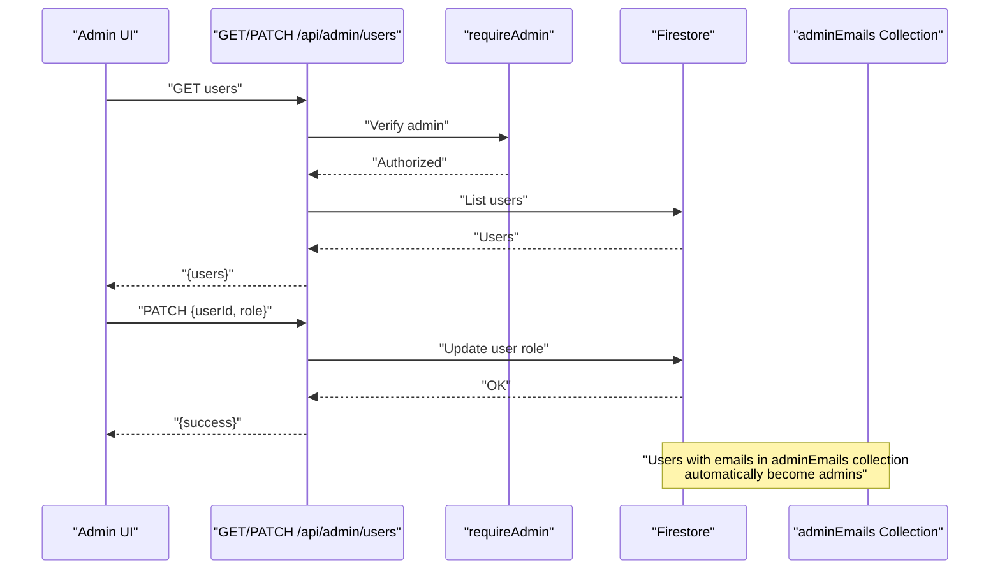
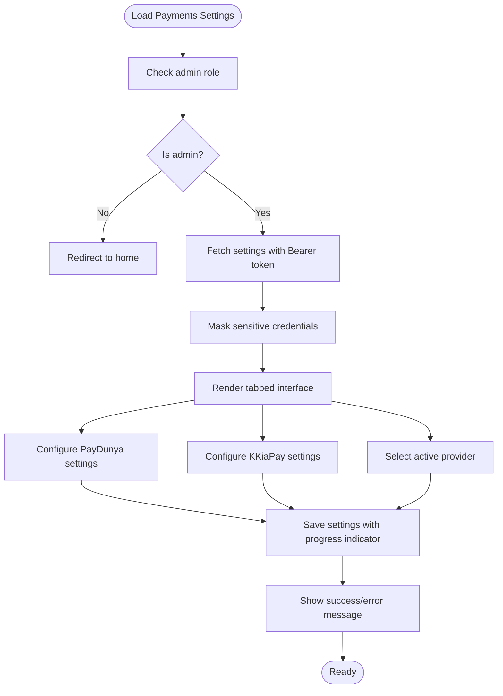
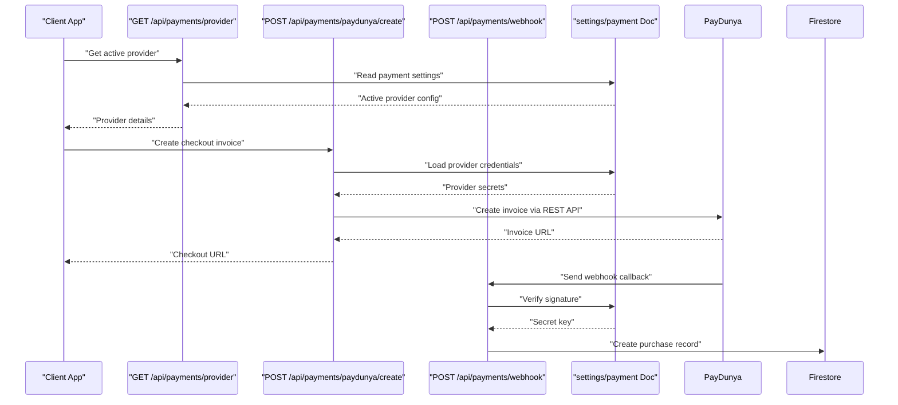
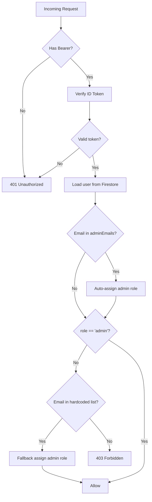
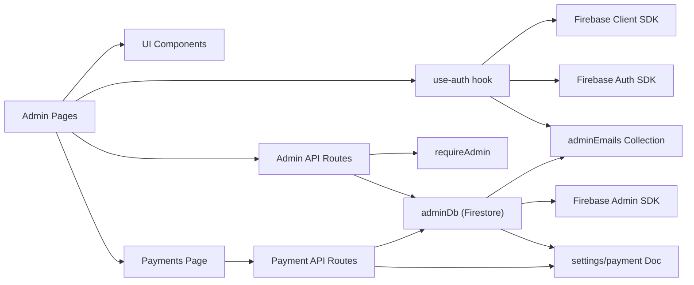

# Admin Panel

<cite>
**Referenced Files in This Document**
- [src/app/admin/page.tsx](file://src/app/admin/page.tsx)
- [src/app/admin/analytics/page.tsx](file://src/app/admin/analytics/page.tsx)
- [src/app/admin/upload/page.tsx](file://src/app/admin/upload/page.tsx)
- [src/app/admin/users/page.tsx](file://src/app/admin/users/page.tsx)
- [src/app/admin/payments/page.tsx](file://src/app/admin/payments/page.tsx)
- [src/app/api/admin/analytics/route.ts](file://src/app/api/admin/analytics/route.ts)
- [src/app/api/admin/payment-settings/route.ts](file://src/app/api/admin/payment-settings/route.ts)
- [src/app/api/admin/upload/route.ts](file://src/app/api/admin/upload/route.ts)
- [src/app/api/admin/users/route.ts](file://src/app/api/admin/users/route.ts)
- [src/app/api/payments/provider/route.ts](file://src/app/api/payments/provider/route.ts)
- [src/app/api/payments/webhook/route.ts](file://src/app/api/payments/webhook/route.ts)
- [src/app/api/payments/paydunya/create/route.ts](file://src/app/api/payments/paydunya/create/route.ts)
- [src/lib/auth-middleware.ts](file://src/lib/auth-middleware.ts)
- [src/lib/firebase-admin.ts](file://src/lib/firebase-admin.ts)
- [src/lib/firebase.ts](file://src/lib/firebase.ts)
- [src/hooks/use-auth.tsx](file://src/hooks/use-auth.tsx)
- [src/types/index.ts](file://src/types/index.ts)
- [src/app/layout.tsx](file://src/app/layout.tsx)
- [src/components/layout/navbar.tsx](file://src/components/layout/navbar.tsx)
- [package.json](file://package.json)
</cite>

## Update Summary
**Changes Made**
- Enhanced analytics data fetching with Firebase Authentication fallback for user count aggregation
- Improved error handling across admin interfaces with better user feedback and graceful degradation
- Enhanced payment provider management with progress indicators and improved UI states
- Strengthened admin upload functionality with better form validation and success states
- Enhanced user management capabilities with improved role toggle functionality

## Table of Contents
1. [Introduction](#introduction)
2. [Project Structure](#project-structure)
3. [Core Components](#core-components)
4. [Architecture Overview](#architecture-overview)
5. [Detailed Component Analysis](#detailed-component-analysis)
6. [Dependency Analysis](#dependency-analysis)
7. [Performance Considerations](#performance-considerations)
8. [Security Considerations](#security-considerations)
9. [Troubleshooting Guide](#troubleshooting-guide)
10. [Conclusion](#conclusion)

## Introduction
This document describes the Datafrica admin panel, covering the dashboard overview, analytics reporting, dataset management, user administration, dataset upload pipeline, payment settings administration, analytics API endpoints, and operational best practices. The admin panel now includes enhanced dataset controls with allowDownload toggles and featured dataset functionality, automated admin role assignment, comprehensive payment provider configuration, improved analytics data fetching with Firebase Authentication fallback, better error handling across admin interfaces, and enhanced admin upload functionality with progress indicators.

## Project Structure
The admin functionality is organized under the Next.js app directory with dedicated pages and API routes:
- Admin pages: dashboard overview, analytics, upload, users, and payments
- Admin API routes: analytics, payment-settings, upload, and users
- Payment system: provider configuration, webhook handling, and checkout integration
- Authentication and authorization middleware with automated admin assignment
- Firebase client and admin SDK integrations
- Shared types and UI components

**Diagram sources**
- [src/app/admin/page.tsx:134-142](file://src/app/admin/page.tsx#L134-L142)
- [src/app/admin/payments/page.tsx:37-442](file://src/app/admin/payments/page.tsx#L37-L442)
- [src/app/api/admin/analytics/route.ts:1-103](file://src/app/api/admin/analytics/route.ts#L1-L103)
- [src/app/api/admin/payment-settings/route.ts:1-120](file://src/app/api/admin/payment-settings/route.ts#L1-L120)
- [src/app/api/admin/upload/route.ts:1-98](file://src/app/api/admin/upload/route.ts#L1-L98)
- [src/app/api/admin/users/route.ts:1-54](file://src/app/api/admin/users/route.ts#L1-L54)
- [src/app/api/payments/provider/route.ts:1-26](file://src/app/api/payments/provider/route.ts#L1-L26)
- [src/app/api/payments/webhook/route.ts:1-82](file://src/app/api/payments/webhook/route.ts#L1-L82)
- [src/app/api/payments/paydunya/create/route.ts:1-129](file://src/app/api/payments/paydunya/create/route.ts#L1-L129)
- [src/lib/auth-middleware.ts:1-62](file://src/lib/auth-middleware.ts#L1-L62)
- [src/lib/firebase-admin.ts:1-58](file://src/lib/firebase-admin.ts#L1-L58)
- [src/lib/firebase.ts:1-22](file://src/lib/firebase.ts#L1-L22)
- [src/hooks/use-auth.tsx:1-185](file://src/hooks/use-auth.tsx#L1-L185)

**Section sources**
- [src/app/admin/page.tsx:1-218](file://src/app/admin/page.tsx#L1-L218)
- [src/app/admin/analytics/page.tsx:1-232](file://src/app/admin/analytics/page.tsx#L1-L232)
- [src/app/admin/upload/page.tsx:1-338](file://src/app/admin/upload/page.tsx#L1-L338)
- [src/app/admin/users/page.tsx:1-193](file://src/app/admin/users/page.tsx#L1-L193)
- [src/app/admin/payments/page.tsx:1-444](file://src/app/admin/payments/page.tsx#L1-L444)
- [src/app/api/admin/analytics/route.ts:1-103](file://src/app/api/admin/analytics/route.ts#L1-L103)
- [src/app/api/admin/payment-settings/route.ts:1-120](file://src/app/api/admin/payment-settings/route.ts#L1-L120)
- [src/app/api/admin/upload/route.ts:1-98](file://src/app/api/admin/upload/route.ts#L1-L98)
- [src/app/api/admin/users/route.ts:1-54](file://src/app/api/admin/users/route.ts#L1-L54)
- [src/app/api/payments/provider/route.ts:1-26](file://src/app/api/payments/provider/route.ts#L1-L26)
- [src/app/api/payments/webhook/route.ts:1-82](file://src/app/api/payments/webhook/route.ts#L1-L82)
- [src/app/api/payments/paydunya/create/route.ts:1-129](file://src/app/api/payments/paydunya/create/route.ts#L1-L129)
- [src/lib/auth-middleware.ts:1-62](file://src/lib/auth-middleware.ts#L1-L62)
- [src/lib/firebase-admin.ts:1-58](file://src/lib/firebase-admin.ts#L1-L58)
- [src/lib/firebase.ts:1-22](file://src/lib/firebase.ts#L1-L22)
- [src/hooks/use-auth.tsx:1-185](file://src/hooks/use-auth.tsx#L1-L185)

## Core Components
- Admin dashboard overview: renders quick links, stats cards, and recent sales.
- Analytics reporting: revenue, sales counts, user and dataset totals, top selling datasets, and recent sales with Firebase Authentication fallback for user counting.
- Enhanced dataset upload: CSV validation, metadata extraction, preview generation, allowDownload and featured toggles, batched persistence, and progress indicators.
- User administration: listing users and toggling roles via API with automated admin assignment and improved error handling.
- Payment settings administration: comprehensive configuration interface for PayDunya and KKiaPay with secure credential management and progress indicators.
- Payment provider integration: dynamic provider selection and webhook handling.
- Authentication and authorization: Bearer token verification, admin role checks, and automatic admin privilege assignment from Firestore.
- Firebase integrations: client SDK for UI and admin SDK for server routes.

**Section sources**
- [src/app/admin/page.tsx:18-218](file://src/app/admin/page.tsx#L18-L218)
- [src/app/admin/analytics/page.tsx:18-232](file://src/app/admin/analytics/page.tsx#L18-L232)
- [src/app/admin/upload/page.tsx:22-338](file://src/app/admin/upload/page.tsx#L22-L338)
- [src/app/admin/users/page.tsx:22-193](file://src/app/admin/users/page.tsx#L22-L193)
- [src/app/admin/payments/page.tsx:20-444](file://src/app/admin/payments/page.tsx#L20-L444)
- [src/lib/auth-middleware.ts:19-61](file://src/lib/auth-middleware.ts#L19-L61)
- [src/lib/firebase-admin.ts:12-58](file://src/lib/firebase-admin.ts#L12-L58)
- [src/lib/firebase.ts:16-22](file://src/lib/firebase.ts#L16-L22)

## Architecture Overview
The admin panel enforces admin-only access using a Bearer token verified by Firebase Admin. Client pages fetch analytics and manage users/datasets via protected API routes. The admin routes compute aggregates from Firestore collections and persist dataset data in batches. The payment settings system provides secure configuration management with masked credentials and environment switching. The authentication system now includes automated admin role assignment from a Firestore collection with Firebase Authentication fallback for user counting.

**Diagram sources**
- [src/app/admin/analytics/route.ts:21-48](file://src/app/api/admin/analytics/route.ts#L21-L48)
- [src/app/admin/payments/page.tsx:52-74](file://src/app/admin/payments/page.tsx#L52-L74)
- [src/app/api/admin/payment-settings/route.ts:5-59](file://src/app/api/admin/payment-settings/route.ts#L5-L59)
- [src/lib/auth-middleware.ts:35-61](file://src/lib/auth-middleware.ts#L35-L61)
- [src/lib/firebase-admin.ts:37-42](file://src/lib/firebase-admin.ts#L37-L42)
- [src/hooks/use-auth.tsx:39-48](file://src/hooks/use-auth.tsx#L39-L48)

## Detailed Component Analysis

### Admin Dashboard Overview
- Purpose: Provide a summary of key metrics and quick actions for admins.
- Key features:
  - Role-gated rendering (non-admins are redirected).
  - Fetches analytics via bearer token.
  - Displays stats cards and recent sales list.
  - Navigation includes dedicated payments link.
- Navigation: Links to upload, users, payments, and analytics pages.

**Diagram sources**
- [src/app/admin/page.tsx:134-142](file://src/app/admin/page.tsx#L134-L142)
- [src/app/admin/page.tsx:50-72](file://src/app/admin/page.tsx#L50-L72)

**Section sources**
- [src/app/admin/page.tsx:38-218](file://src/app/admin/page.tsx#L38-L218)

### Enhanced Analytics Reporting System
- Endpoint: GET /api/admin/analytics
- Responsibilities:
  - Compute total revenue from completed purchases.
  - Count total users with Firestore count as primary source and Firebase Authentication as fallback.
  - Retrieve recent sales (last 30).
  - Aggregate top datasets by revenue.
- **Updated**: Enhanced user counting with Firebase Authentication fallback:
  - Primary: Firestore users collection count
  - Fallback: Firebase Authentication listUsers pagination
  - Verification: If Firestore count is 0, verify with Firebase Auth
- Frontend pages:
  - Admin overview and dedicated analytics page both call the same endpoint and render statistics.

**Updated** Enhanced analytics data fetching with Firebase Authentication fallback for user count aggregation

**Diagram sources**
- [src/app/api/admin/analytics/route.ts:21-48](file://src/app/api/admin/analytics/route.ts#L21-L48)
- [src/app/admin/analytics/page.tsx:52-74](file://src/app/admin/analytics/page.tsx#L52-L74)
- [src/app/admin/page.tsx:50-72](file://src/app/admin/page.tsx#L50-L72)

**Section sources**
- [src/app/api/admin/analytics/route.ts:5-103](file://src/app/api/admin/analytics/route.ts#L5-L103)
- [src/app/admin/analytics/page.tsx:18-232](file://src/app/admin/analytics/page.tsx#L18-L232)

### Enhanced Dataset Management Interface
- Upload page with new controls:
  - Validates presence of CSV and required metadata.
  - Parses CSV with Papa Parse, extracts columns and preview rows.
  - **New**: allowDownload toggle controls file download permissions.
  - **New**: featured toggle promotes datasets on homepage.
  - **New**: Progress indicators and success states with improved user feedback.
  - Creates dataset document with enhanced metadata and persists full data in batches to a subcollection.
  - Returns success with record count and column metadata.
- Permissions: Admin-only via bearer token.
- **New**: Enhanced form validation and error handling with better user experience.

**Updated** Enhanced dataset upload functionality with progress indicators and improved success states

**Diagram sources**
- [src/app/admin/upload/page.tsx:44-98](file://src/app/admin/upload/page.tsx#L44-L98)
- [src/app/api/admin/upload/route.ts:6-98](file://src/app/api/admin/upload/route.ts#L6-L98)

**Section sources**
- [src/app/admin/upload/page.tsx:22-338](file://src/app/admin/upload/page.tsx#L22-L338)
- [src/app/api/admin/upload/route.ts:6-98](file://src/app/api/admin/upload/route.ts#L6-L98)

### Enhanced User Administration System
- Listing users:
  - GET /api/admin/users returns user list ordered by creation date.
- Role management:
  - PATCH /api/admin/users toggles role between "user" and "admin".
  - UI disables self-role change.
- **New**: Automated admin assignment:
  - Users with emails in Firestore `adminEmails` collection automatically gain admin privileges.
  - Real-time role assignment during authentication with fallback to hardcoded admin emails.
- **New**: Improved error handling and user feedback with toast notifications.
- Frontend:
  - Displays users in a table with role badges and action buttons.

**Updated** Enhanced user management with improved error handling and progress indicators

**Diagram sources**
- [src/app/admin/users/page.tsx:30-92](file://src/app/admin/users/page.tsx#L30-L92)
- [src/app/api/admin/users/route.ts:5-54](file://src/app/api/admin/users/route.ts#L5-L54)
- [src/hooks/use-auth.tsx:39-48](file://src/hooks/use-auth.tsx#L39-L48)

**Section sources**
- [src/app/admin/users/page.tsx:22-193](file://src/app/admin/users/page.tsx#L22-L193)
- [src/app/api/admin/users/route.ts:1-54](file://src/app/api/admin/users/route.ts#L1-L54)
- [src/hooks/use-auth.tsx:39-48](file://src/hooks/use-auth.tsx#L39-L48)

### Comprehensive Payment Settings Administration
- Purpose: Manage payment provider configurations securely with environment switching.
- Key features:
  - Tabbed interface for PayDunya and KKiaPay configuration.
  - Secure credential management with masking for sensitive data.
  - Environment switching between test/live modes.
  - Dynamic provider selection and webhook URL management.
  - Admin-only access via bearer token.
  - **New**: Progress indicators and improved save states.
- Configuration options:
  - PayDunya: masterKey, privateKey, publicKey, token, mode (test/live).
  - KKiaPay: publicKey, privateKey, secret, sandbox mode.
  - Active provider selection for system-wide payment routing.

**Updated** Enhanced payment settings administration with progress indicators and improved UI states

**Diagram sources**
- [src/app/admin/payments/page.tsx:37-444](file://src/app/admin/payments/page.tsx#L37-L444)
- [src/app/api/admin/payment-settings/route.ts:5-120](file://src/app/api/admin/payment-settings/route.ts#L5-L120)

**Section sources**
- [src/app/admin/payments/page.tsx:20-444](file://src/app/admin/payments/page.tsx#L20-L444)
- [src/app/api/admin/payment-settings/route.ts:1-120](file://src/app/api/admin/payment-settings/route.ts#L1-L120)

### Payment Provider Integration System
- Dynamic provider selection:
  - GET /api/payments/provider returns active provider configuration.
  - Supports PayDunya and KKiaPay with appropriate public keys.
- Webhook handling:
  - POST /api/payments/webhook processes KKiaPay callbacks.
  - Validates signatures using secret keys.
  - Creates purchase records upon successful transactions.
- Checkout integration:
  - POST /api/payments/paydunya/create generates PayDunya invoices.
  - Handles authentication and dataset validation.
  - Manages webhook URLs and custom data passing.

**Section sources**
- [src/app/api/payments/provider/route.ts:1-26](file://src/app/api/payments/provider/route.ts#L1-L26)
- [src/app/api/payments/webhook/route.ts:1-82](file://src/app/api/payments/webhook/route.ts#L1-L82)
- [src/app/api/payments/paydunya/create/route.ts:1-129](file://src/app/api/payments/paydunya/create/route.ts#L1-L129)

### Enhanced Analytics API Endpoints
- GET /api/admin/analytics
  - Computes revenue, sales, user, and dataset counts.
  - Aggregates top datasets by revenue.
  - Returns recent sales snapshots.
  - **New**: Implements Firebase Authentication fallback for user counting when Firestore count is unavailable.

**Updated** Enhanced analytics API with improved user counting fallback mechanism

**Section sources**
- [src/app/api/admin/analytics/route.ts:5-103](file://src/app/api/admin/analytics/route.ts#L5-L103)

### Enhanced Dataset Upload Pipeline
- Validation and parsing:
  - Ensures required fields and numeric price.
  - Uses Papa Parse to validate CSV and extract headers and preview rows.
- **New**: Enhanced metadata processing:
  - Processes allowDownload boolean flag for download permissions.
  - Processes featured boolean flag for homepage promotion.
- **New**: Improved persistence with Firebase Storage for CSV files and Firestore for metadata.
- **New**: Enhanced success states and user feedback with progress indicators.

**Updated** Enhanced dataset upload with improved form validation, progress indicators, and better success states

**Section sources**
- [src/app/api/admin/upload/route.ts:23-98](file://src/app/api/admin/upload/route.ts#L23-L98)

### Enhanced Payment Settings API Endpoints
- GET /api/admin/payment-settings
  - Retrieves payment provider configurations from Firestore.
  - Masks sensitive credentials for frontend display.
  - Returns default values from environment variables when settings don't exist.
- PUT /api/admin/payment-settings
  - Updates payment provider configurations securely.
  - Preserves masked field values to prevent accidental overwrites.
  - Validates provider selection and merges updates with existing settings.
  - Maintains audit trail with timestamps.

**Section sources**
- [src/app/api/admin/payment-settings/route.ts:5-120](file://src/app/api/admin/payment-settings/route.ts#L5-L120)

### Enhanced Authentication and Authorization
- Bearer token verification:
  - Extracts Authorization header and verifies ID token.
- Admin enforcement:
  - Confirms user role stored in Firestore "users" collection equals "admin".
- **New**: Automated admin assignment:
  - Checks Firestore `adminEmails` collection for user email during authentication.
  - Automatically upgrades eligible users to admin role.
  - **New**: Fallback to hardcoded admin emails when Firestore is unavailable.
- Client token acquisition:
  - React hook provides getIdToken() for protected requests.
- **New**: Enhanced error handling with graceful degradation when services are unavailable.

**Updated** Enhanced authentication with Firebase Authentication fallback and improved error handling

**Diagram sources**
- [src/lib/auth-middleware.ts:35-61](file://src/lib/auth-middleware.ts#L35-L61)
- [src/hooks/use-auth.tsx:49-106](file://src/hooks/use-auth.tsx#L49-L106)
- [src/hooks/use-auth.tsx:39-48](file://src/hooks/use-auth.tsx#L39-L48)

**Section sources**
- [src/lib/auth-middleware.ts:19-61](file://src/lib/auth-middleware.ts#L19-L61)
- [src/hooks/use-auth.tsx:49-106](file://src/hooks/use-auth.tsx#L49-L106)
- [src/hooks/use-auth.tsx:39-48](file://src/hooks/use-auth.tsx#L39-L48)

## Dependency Analysis
- Client pages depend on:
  - use-auth hook for user state, getIdToken(), and automated admin assignment.
  - UI components from shared libraries.
- API routes depend on:
  - requireAdmin middleware for authorization.
  - adminDb for Firestore operations.
- Payment system depends on:
  - Payment settings stored in Firestore "settings/payment" document.
  - Environment variables for fallback configurations.
  - Third-party payment provider APIs.
- Firebase:
  - Client SDK for UI interactions.
  - Admin SDK for server-side reads/writes.
  - **New**: Firebase Authentication SDK for user counting fallback.
- **New**: Firestore collections:
  - `adminEmails` collection for automated admin role assignment.
  - `settings/payment` document for payment provider configurations.

**Updated** Enhanced dependency graph with Firebase Authentication fallback and improved error handling

**Diagram sources**
- [src/app/admin/page.tsx:134-142](file://src/app/admin/page.tsx#L134-L142)
- [src/app/admin/analytics/page.tsx:52-74](file://src/app/admin/analytics/page.tsx#L52-L74)
- [src/app/admin/upload/page.tsx:44-98](file://src/app/admin/upload/page.tsx#L44-L98)
- [src/app/admin/users/page.tsx:30-92](file://src/app/admin/users/page.tsx#L30-L92)
- [src/app/admin/payments/page.tsx:37-444](file://src/app/admin/payments/page.tsx#L37-L444)
- [src/app/api/admin/analytics/route.ts:21-48](file://src/app/api/admin/analytics/route.ts#L21-L48)
- [src/app/api/admin/payment-settings/route.ts:2-3](file://src/app/api/admin/payment-settings/route.ts#L2-L3)
- [src/app/api/admin/upload/route.ts:9-10](file://src/app/api/admin/upload/route.ts#L9-L10)
- [src/app/api/admin/users/route.ts:8-9](file://src/app/api/admin/users/route.ts#L8-L9)
- [src/lib/firebase-admin.ts:37-42](file://src/lib/firebase-admin.ts#L37-L42)
- [src/lib/firebase.ts:18-20](file://src/lib/firebase.ts#L18-L20)
- [src/hooks/use-auth.tsx:39-48](file://src/hooks/use-auth.tsx#L39-L48)

**Section sources**
- [src/app/layout.tsx:31-45](file://src/app/layout.tsx#L31-L45)
- [src/components/layout/navbar.tsx:38-82](file://src/components/layout/navbar.tsx#L38-L82)
- [package.json:11-38](file://package.json#L11-L38)

## Performance Considerations
- Batched writes during dataset upload:
  - Full data is written in chunks to avoid large single transactions and improve reliability.
- Pagination and limits:
  - Analytics endpoint limits recent sales to a fixed number to keep responses small.
- Client-side caching:
  - Consider memoizing analytics results per session to reduce redundant network calls.
- Bulk operations:
  - Role toggling is per-user; for future bulk role changes, implement a dedicated endpoint to minimize round trips.
- CSV parsing:
  - Validate file size and limit preview rows to prevent memory pressure.
- **New**: Payment settings caching:
  - Payment configurations are cached in Firestore for efficient retrieval.
  - Credential masking reduces payload size and improves response times.
- **New**: Automated admin assignment:
  - Querying adminEmails collection is lightweight and cached by Firestore SDK.
  - Admin privilege assignment happens during authentication, reducing runtime overhead.
- **New**: Firebase Authentication fallback:
  - Paginated user listing with 1000-user batches to handle large user bases efficiently.
  - Graceful degradation when Firestore is unavailable.

**Updated** Enhanced performance considerations with Firebase Authentication fallback and improved error handling

## Security Considerations
- Admin access control:
  - All admin endpoints enforce bearer token verification and admin role checks.
- Token handling:
  - Tokens are requested via getIdToken() and attached to Authorization headers.
- Audit logging:
  - Add request logging (timestamp, admin UID, endpoint, IP) at the API gateway or middleware level for compliance.
- Data exposure:
  - Ensure analytics responses exclude sensitive fields and apply rate limiting to prevent abuse.
- CORS and transport:
  - Enforce HTTPS and restrict origins at the web server level.
- **New**: Payment settings security:
  - Sensitive credentials are masked before transmission to frontend.
  - PUT requests preserve masked values to prevent accidental overwrites.
  - Environment variables serve as fallback configurations with proper validation.
- **New**: AdminEmails collection security:
  - Ensure adminEmails collection has appropriate security rules to prevent unauthorized access.
  - Consider restricting access to only admin users for managing the adminEmails collection.
- **New**: Payment provider API security:
  - Webhook signatures are validated using secret keys.
  - Payment provider credentials are stored in Firestore with proper access controls.
- **New**: Firebase Authentication fallback security:
  - Hardcoded admin email list serves as secondary fallback mechanism.
  - Graceful degradation prevents authentication failures from blocking legitimate admin access.

**Updated** Enhanced security considerations with Firebase Authentication fallback and improved error handling

**Section sources**
- [src/lib/auth-middleware.ts:35-61](file://src/lib/auth-middleware.ts#L35-L61)
- [src/hooks/use-auth.tsx:49-106](file://src/hooks/use-auth.tsx#L49-L106)
- [src/app/api/admin/payment-settings/route.ts:35-54](file://src/app/api/admin/payment-settings/route.ts#L35-L54)
- [src/app/api/payments/webhook/route.ts:11-24](file://src/app/api/payments/webhook/route.ts#L11-L24)

## Troubleshooting Guide
- Admin page redirects to home:
  - Occurs when user is missing or role is not "admin". Verify user role in Firestore and token validity.
  - **New**: Check if user's email exists in adminEmails Firestore collection if they should have admin privileges.
  - **New**: Verify Firebase Authentication fallback is working if Firestore adminEmails collection is unavailable.
- Analytics fetch fails:
  - Check bearer token presence and admin role. Inspect server logs for analytics route errors.
  - **New**: Verify Firebase Authentication fallback is functioning if Firestore user count returns 0.
- Upload fails:
  - Ensure CSV is valid and required fields are present. Confirm price is numeric and preview rows are within bounds.
  - **New**: Verify allowDownload and featured values are properly formatted in FormData.
  - **New**: Check Firebase Storage permissions for CSV file uploads.
- User role toggle disabled:
  - Self-role changes are intentionally disabled in the UI. Use another admin account to revoke your own admin privileges.
- Authentication errors:
  - Confirm getIdToken() resolves to a non-null value. Check Firebase credentials and service account configuration.
  - **New**: Verify Firebase Authentication fallback is working if Firestore is unavailable.
- **New**: Admin privileges not assigned:
  - Verify user's email exists in adminEmails Firestore collection.
  - Check that adminEmails collection has proper Firestore rules allowing admin assignment.
  - **New**: Check hardcoded admin emails list as fallback mechanism.
- **New**: Payment settings not loading:
  - Verify admin role and bearer token for /api/admin/payment-settings.
  - Check Firestore permissions for accessing settings/payment document.
  - Ensure environment variables are properly configured as fallback values.
- **New**: Payment provider not working:
  - Verify credentials are properly configured in payment settings.
  - Check webhook URLs match the configured environment (test/live).
  - Validate signature verification for webhook endpoints.
- **New**: Payment checkout failures:
  - Confirm dataset exists and is accessible.
  - Verify payment provider is properly configured and active.
  - Check PayDunya API connectivity and credentials.
- **New**: Firebase Authentication fallback issues:
  - Verify Firebase Admin SDK credentials are properly configured.
  - Check pagination limits and network connectivity for listUsers API calls.

**Updated** Enhanced troubleshooting guide with Firebase Authentication fallback and improved error handling scenarios

**Section sources**
- [src/app/admin/page.tsx:44-48](file://src/app/admin/page.tsx#L44-L48)
- [src/app/admin/analytics/page.tsx:52-74](file://src/app/admin/analytics/page.tsx#L52-L74)
- [src/app/admin/upload/page.tsx:44-98](file://src/app/admin/upload/page.tsx#L44-L98)
- [src/app/admin/users/page.tsx:66-92](file://src/app/admin/users/page.tsx#L66-L92)
- [src/app/admin/payments/page.tsx:52-74](file://src/app/admin/payments/page.tsx#L52-L74)
- [src/lib/auth-middleware.ts:35-61](file://src/lib/auth-middleware.ts#L35-L61)
- [src/hooks/use-auth.tsx:49-106](file://src/hooks/use-auth.tsx#L49-L106)

## Conclusion
The Datafrica admin panel provides a comprehensive set of capabilities for revenue tracking, dataset management, user administration, and payment provider configuration, secured by robust bearer token verification and admin role enforcement. The enhanced dataset management interface now includes allowDownload and featured dataset controls, while the automated admin assignment system streamlines user privilege management. The new payment settings administration interface offers secure configuration management for both PayDunya and KKiaPay with environment switching and webhook URL management. The analytics API consolidates key metrics with improved user counting through Firebase Authentication fallback, while the upload pipeline ensures reliable ingestion of datasets with enhanced metadata controls and progress indicators. The payment system integrates seamlessly with the admin interface for comprehensive payment management. The enhanced authentication system provides graceful fallback mechanisms and improved error handling. For production hardening, consider audit logging, rate limiting, secure management of the adminEmails collection, proper credential rotation for payment providers, and monitoring of Firebase Authentication fallback mechanisms.