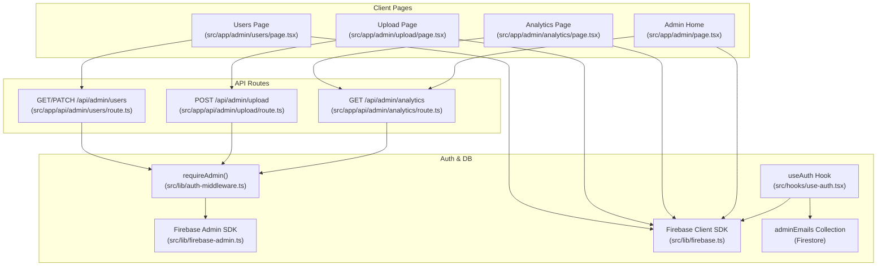
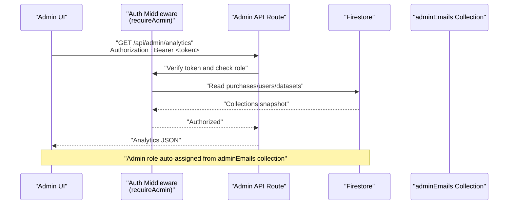
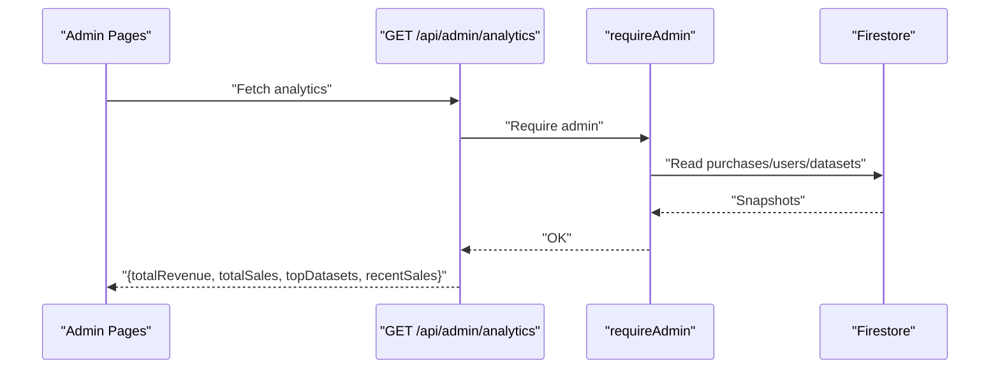
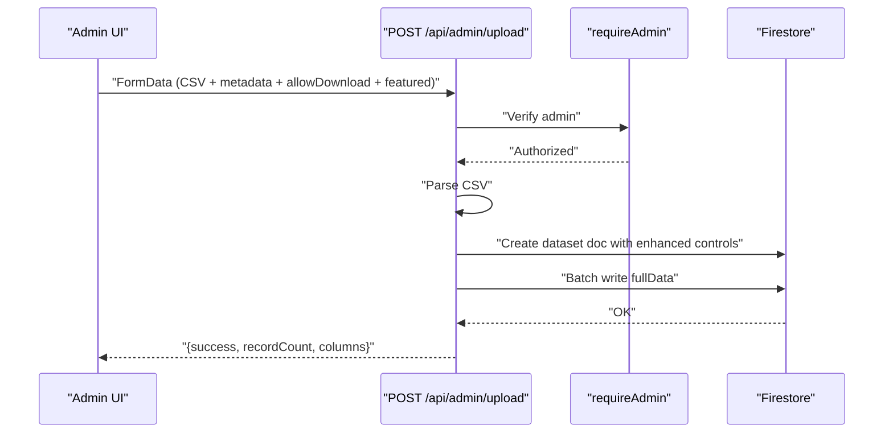
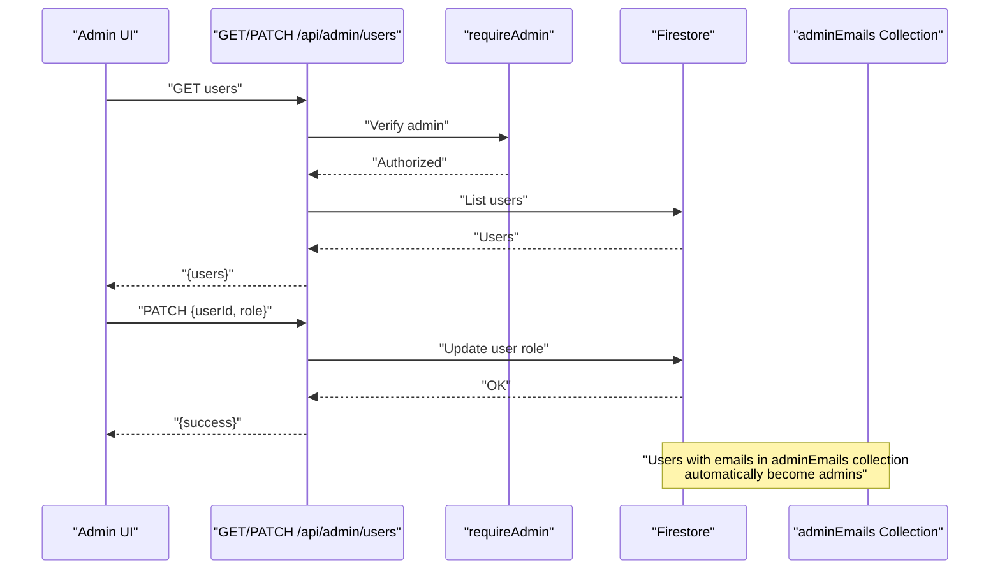
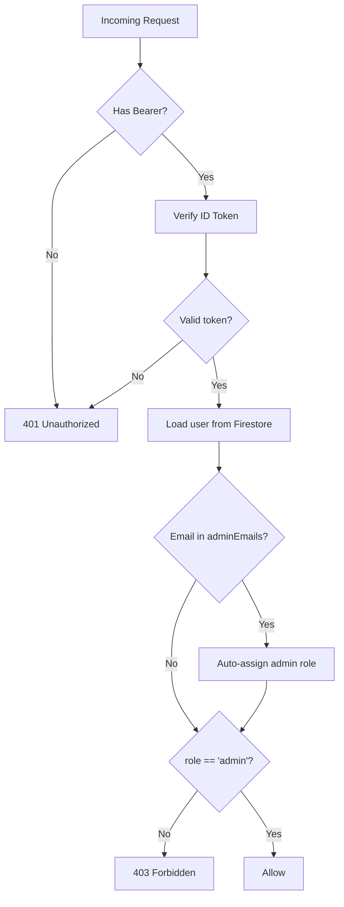
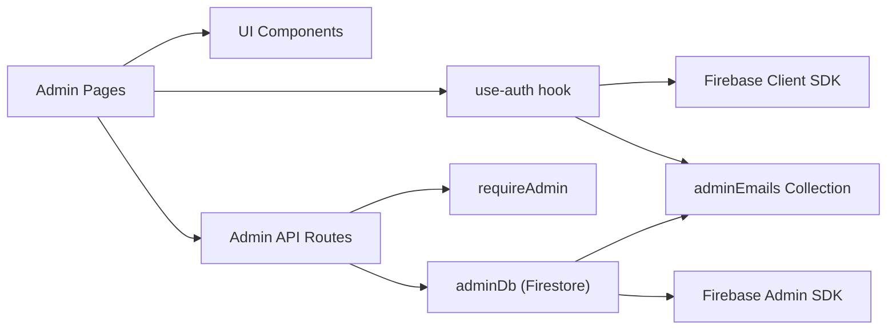

# Admin Panel

<cite>
**Referenced Files in This Document**
- [src/app/admin/page.tsx](file://src/app/admin/page.tsx)
- [src/app/admin/analytics/page.tsx](file://src/app/admin/analytics/page.tsx)
- [src/app/admin/upload/page.tsx](file://src/app/admin/upload/page.tsx)
- [src/app/admin/users/page.tsx](file://src/app/admin/users/page.tsx)
- [src/app/api/admin/analytics/route.ts](file://src/app/api/admin/analytics/route.ts)
- [src/app/api/admin/upload/route.ts](file://src/app/api/admin/upload/route.ts)
- [src/app/api/admin/users/route.ts](file://src/app/api/admin/users/route.ts)
- [src/lib/auth-middleware.ts](file://src/lib/auth-middleware.ts)
- [src/lib/firebase-admin.ts](file://src/lib/firebase-admin.ts)
- [src/lib/firebase.ts](file://src/lib/firebase.ts)
- [src/hooks/use-auth.tsx](file://src/hooks/use-auth.tsx)
- [src/types/index.ts](file://src/types/index.ts)
- [src/app/layout.tsx](file://src/app/layout.tsx)
- [src/components/layout/navbar.tsx](file://src/components/layout/navbar.tsx)
- [package.json](file://package.json)
</cite>

## Update Summary
**Changes Made**
- Enhanced dataset upload interface with new `allowDownload` and `featured` controls
- Implemented automated admin role assignment from Firestore `adminEmails` collection
- Improved dataset management capabilities with enhanced controls
- Updated authentication flow to support automatic admin privilege assignment

## Table of Contents
1. [Introduction](#introduction)
2. [Project Structure](#project-structure)
3. [Core Components](#core-components)
4. [Architecture Overview](#architecture-overview)
5. [Detailed Component Analysis](#detailed-component-analysis)
6. [Dependency Analysis](#dependency-analysis)
7. [Performance Considerations](#performance-considerations)
8. [Security Considerations](#security-considerations)
9. [Troubleshooting Guide](#troubleshooting-guide)
10. [Conclusion](#conclusion)

## Introduction
This document describes the Datafrica admin panel, covering the dashboard overview, analytics reporting, dataset management, user administration, dataset upload pipeline, analytics API endpoints, and operational best practices. The admin panel now includes enhanced dataset controls with allowDownload toggles and featured dataset functionality, automated admin role assignment, and improved dataset management interfaces.

## Project Structure
The admin functionality is organized under the Next.js app directory with dedicated pages and API routes:
- Admin pages: dashboard overview, analytics, upload, and users
- Admin API routes: analytics, upload, and users
- Authentication and authorization middleware with automated admin assignment
- Firebase client and admin SDK integrations
- Shared types and UI components

**Diagram sources**
- [src/app/admin/page.tsx:1-192](file://src/app/admin/page.tsx#L1-L192)
- [src/app/admin/analytics/page.tsx:1-230](file://src/app/admin/analytics/page.tsx#L1-L230)
- [src/app/admin/upload/page.tsx:1-338](file://src/app/admin/upload/page.tsx#L1-L338)
- [src/app/admin/users/page.tsx:1-191](file://src/app/admin/users/page.tsx#L1-L191)
- [src/app/api/admin/analytics/route.ts:1-78](file://src/app/api/admin/analytics/route.ts#L1-L78)
- [src/app/api/admin/upload/route.ts:1-96](file://src/app/api/admin/upload/route.ts#L1-L96)
- [src/app/api/admin/users/route.ts:1-54](file://src/app/api/admin/users/route.ts#L1-L54)
- [src/lib/auth-middleware.ts:1-48](file://src/lib/auth-middleware.ts#L1-L48)
- [src/lib/firebase-admin.ts:1-58](file://src/lib/firebase-admin.ts#L1-L58)
- [src/lib/firebase.ts:1-22](file://src/lib/firebase.ts#L1-L22)
- [src/hooks/use-auth.tsx:1-137](file://src/hooks/use-auth.tsx#L1-L137)

**Section sources**
- [src/app/admin/page.tsx:1-192](file://src/app/admin/page.tsx#L1-L192)
- [src/app/admin/analytics/page.tsx:1-230](file://src/app/admin/analytics/page.tsx#L1-L230)
- [src/app/admin/upload/page.tsx:1-338](file://src/app/admin/upload/page.tsx#L1-L338)
- [src/app/admin/users/page.tsx:1-191](file://src/app/admin/users/page.tsx#L1-L191)
- [src/app/api/admin/analytics/route.ts:1-78](file://src/app/api/admin/analytics/route.ts#L1-L78)
- [src/app/api/admin/upload/route.ts:1-96](file://src/app/api/admin/upload/route.ts#L1-L96)
- [src/app/api/admin/users/route.ts:1-54](file://src/app/api/admin/users/route.ts#L1-L54)
- [src/lib/auth-middleware.ts:1-48](file://src/lib/auth-middleware.ts#L1-L48)
- [src/lib/firebase-admin.ts:1-58](file://src/lib/firebase-admin.ts#L1-L58)
- [src/lib/firebase.ts:1-22](file://src/lib/firebase.ts#L1-L22)
- [src/hooks/use-auth.tsx:1-137](file://src/hooks/use-auth.tsx#L1-L137)

## Core Components
- Admin dashboard overview: renders quick links, stats cards, and recent sales.
- Analytics reporting: revenue, sales counts, user and dataset totals, top selling datasets, and recent sales.
- Enhanced dataset upload: CSV validation, metadata extraction, preview generation, allowDownload and featured toggles, and batched persistence.
- User administration: listing users and toggling roles via API with automated admin assignment.
- Authentication and authorization: Bearer token verification, admin role checks, and automatic admin privilege assignment from Firestore.
- Firebase integrations: client SDK for UI and admin SDK for server routes.

**Section sources**
- [src/app/admin/page.tsx:18-192](file://src/app/admin/page.tsx#L18-L192)
- [src/app/admin/analytics/page.tsx:18-230](file://src/app/admin/analytics/page.tsx#L18-L230)
- [src/app/admin/upload/page.tsx:22-338](file://src/app/admin/upload/page.tsx#L22-L338)
- [src/app/admin/users/page.tsx:22-191](file://src/app/admin/users/page.tsx#L22-L191)
- [src/lib/auth-middleware.ts:19-47](file://src/lib/auth-middleware.ts#L19-L47)
- [src/lib/firebase-admin.ts:12-58](file://src/lib/firebase-admin.ts#L12-L58)
- [src/lib/firebase.ts:16-22](file://src/lib/firebase.ts#L16-L22)

## Architecture Overview
The admin panel enforces admin-only access using a Bearer token verified by Firebase Admin. Client pages fetch analytics and manage users/datasets via protected API routes. The admin routes compute aggregates from Firestore collections and persist dataset data in batches. The authentication system now includes automated admin role assignment from a Firestore collection.

**Diagram sources**
- [src/app/api/admin/analytics/route.ts:5-78](file://src/app/api/admin/analytics/route.ts#L5-L78)
- [src/lib/auth-middleware.ts:30-47](file://src/lib/auth-middleware.ts#L30-L47)
- [src/lib/firebase-admin.ts:37-42](file://src/lib/firebase-admin.ts#L37-L42)
- [src/hooks/use-auth.tsx:39-48](file://src/hooks/use-auth.tsx#L39-L48)

## Detailed Component Analysis

### Admin Dashboard Overview
- Purpose: Provide a summary of key metrics and quick actions for admins.
- Key features:
  - Role-gated rendering (non-admins are redirected).
  - Fetches analytics via bearer token.
  - Displays stats cards and recent sales list.
- Navigation: Links to upload, users, and analytics pages.

**Diagram sources**
- [src/app/admin/page.tsx:38-102](file://src/app/admin/page.tsx#L38-L102)
- [src/app/admin/page.tsx:50-72](file://src/app/admin/page.tsx#L50-L72)

**Section sources**
- [src/app/admin/page.tsx:38-192](file://src/app/admin/page.tsx#L38-L192)

### Analytics Reporting System
- Endpoint: GET /api/admin/analytics
- Responsibilities:
  - Compute total revenue from completed purchases.
  - Count total users and datasets.
  - Retrieve recent sales (last 30).
  - Aggregate top datasets by revenue.
- Frontend pages:
  - Admin overview and dedicated analytics page both call the same endpoint and render statistics.

**Diagram sources**
- [src/app/api/admin/analytics/route.ts:5-78](file://src/app/api/admin/analytics/route.ts#L5-L78)
- [src/app/admin/analytics/page.tsx:38-72](file://src/app/admin/analytics/page.tsx#L38-L72)
- [src/app/admin/page.tsx:50-72](file://src/app/admin/page.tsx#L50-L72)

**Section sources**
- [src/app/api/admin/analytics/route.ts:5-78](file://src/app/api/admin/analytics/route.ts#L5-L78)
- [src/app/admin/analytics/page.tsx:18-230](file://src/app/admin/analytics/page.tsx#L18-L230)

### Enhanced Dataset Management Interface
- Upload page with new controls:
  - Validates presence of CSV and required metadata.
  - Parses CSV with Papa Parse, extracts columns and preview rows.
  - **New**: allowDownload toggle controls file download permissions.
  - **New**: featured toggle promotes datasets on homepage.
  - Creates dataset document with enhanced metadata and persists full data in batches to a subcollection.
  - Returns success with record count and column metadata.
- Permissions: Admin-only via bearer token.

**Updated** Added allowDownload and featured dataset controls to the upload interface

**Diagram sources**
- [src/app/admin/upload/page.tsx:44-98](file://src/app/admin/upload/page.tsx#L44-L98)
- [src/app/api/admin/upload/route.ts:6-96](file://src/app/api/admin/upload/route.ts#L6-L96)

**Section sources**
- [src/app/admin/upload/page.tsx:22-338](file://src/app/admin/upload/page.tsx#L22-L338)
- [src/app/api/admin/upload/route.ts:6-96](file://src/app/api/admin/upload/route.ts#L6-L96)

### User Administration System
- Listing users:
  - GET /api/admin/users returns user list ordered by creation date.
- Role management:
  - PATCH /api/admin/users toggles role between "user" and "admin".
  - UI disables self-role change.
- **New**: Automated admin assignment:
  - Users with emails in Firestore `adminEmails` collection automatically gain admin privileges.
  - Real-time role assignment during authentication.
- Frontend:
  - Displays users in a table with role badges and action buttons.

**Updated** Added automated admin role assignment from adminEmails collection

**Diagram sources**
- [src/app/admin/users/page.tsx:30-92](file://src/app/admin/users/page.tsx#L30-L92)
- [src/app/api/admin/users/route.ts:5-54](file://src/app/api/admin/users/route.ts#L5-L54)
- [src/hooks/use-auth.tsx:39-48](file://src/hooks/use-auth.tsx#L39-L48)

**Section sources**
- [src/app/admin/users/page.tsx:22-191](file://src/app/admin/users/page.tsx#L22-L191)
- [src/app/api/admin/users/route.ts:1-54](file://src/app/api/admin/users/route.ts#L1-L54)
- [src/hooks/use-auth.tsx:39-48](file://src/hooks/use-auth.tsx#L39-L48)

### Analytics API Endpoints
- GET /api/admin/analytics
  - Computes revenue, sales, user, and dataset counts.
  - Aggregates top datasets by revenue.
  - Returns recent sales snapshots.

**Section sources**
- [src/app/api/admin/analytics/route.ts:5-78](file://src/app/api/admin/analytics/route.ts#L5-L78)

### Enhanced Dataset Upload Pipeline
- Validation and parsing:
  - Ensures required fields and numeric price.
  - Uses Papa Parse to validate CSV and extract headers and preview rows.
- **New**: Enhanced metadata processing:
  - Processes allowDownload boolean flag for download permissions.
  - Processes featured boolean flag for homepage promotion.
- Persistence:
  - Writes dataset metadata to "datasets" collection with enhanced controls.
  - Writes full data in batches to a "fullData" subcollection for scalability.

**Updated** Added support for allowDownload and featured dataset controls

**Section sources**
- [src/app/api/admin/upload/route.ts:23-77](file://src/app/api/admin/upload/route.ts#L23-L77)

### Authentication and Authorization
- Bearer token verification:
  - Extracts Authorization header and verifies ID token.
- Admin enforcement:
  - Confirms user role stored in Firestore "users" collection equals "admin".
- **New**: Automated admin assignment:
  - Checks Firestore `adminEmails` collection for user email during authentication.
  - Automatically upgrades eligible users to admin role.
- Client token acquisition:
  - React hook provides getIdToken() for protected requests.

**Updated** Added automated admin role assignment from adminEmails collection

**Diagram sources**
- [src/lib/auth-middleware.ts:4-47](file://src/lib/auth-middleware.ts#L4-L47)
- [src/hooks/use-auth.tsx:94-99](file://src/hooks/use-auth.tsx#L94-L99)
- [src/hooks/use-auth.tsx:39-48](file://src/hooks/use-auth.tsx#L39-L48)

**Section sources**
- [src/lib/auth-middleware.ts:19-47](file://src/lib/auth-middleware.ts#L19-L47)
- [src/hooks/use-auth.tsx:94-99](file://src/hooks/use-auth.tsx#L94-L99)
- [src/hooks/use-auth.tsx:39-48](file://src/hooks/use-auth.tsx#L39-L48)

## Dependency Analysis
- Client pages depend on:
  - use-auth hook for user state, getIdToken(), and automated admin assignment.
  - UI components from shared libraries.
- API routes depend on:
  - requireAdmin middleware for authorization.
  - adminDb for Firestore operations.
- Firebase:
  - Client SDK for UI interactions.
  - Admin SDK for server-side reads/writes.
- **New**: Firestore collections:
  - `adminEmails` collection for automated admin role assignment.

**Updated** Added adminEmails collection dependency

**Diagram sources**
- [src/app/admin/page.tsx:38-72](file://src/app/admin/page.tsx#L38-L72)
- [src/app/admin/analytics/page.tsx:38-72](file://src/app/admin/analytics/page.tsx#L38-L72)
- [src/app/admin/upload/page.tsx:24-98](file://src/app/admin/upload/page.tsx#L24-L98)
- [src/app/admin/users/page.tsx:32-92](file://src/app/admin/users/page.tsx#L32-L92)
- [src/app/api/admin/analytics/route.ts:8-9](file://src/app/api/admin/analytics/route.ts#L8-L9)
- [src/app/api/admin/upload/route.ts:9-10](file://src/app/api/admin/upload/route.ts#L9-L10)
- [src/app/api/admin/users/route.ts:8-9](file://src/app/api/admin/users/route.ts#L8-L9)
- [src/lib/firebase-admin.ts:37-42](file://src/lib/firebase-admin.ts#L37-L42)
- [src/lib/firebase.ts:18-20](file://src/lib/firebase.ts#L18-L20)
- [src/hooks/use-auth.tsx:39-48](file://src/hooks/use-auth.tsx#L39-L48)

**Section sources**
- [src/app/layout.tsx:31-45](file://src/app/layout.tsx#L31-L45)
- [src/components/layout/navbar.tsx:38-82](file://src/components/layout/navbar.tsx#L38-L82)
- [package.json:11-38](file://package.json#L11-L38)

## Performance Considerations
- Batched writes during dataset upload:
  - Full data is written in chunks to avoid large single transactions and improve reliability.
- Pagination and limits:
  - Analytics endpoint limits recent sales to a fixed number to keep responses small.
- Client-side caching:
  - Consider memoizing analytics results per session to reduce redundant network calls.
- Bulk operations:
  - Role toggling is per-user; for future bulk role changes, implement a dedicated endpoint to minimize round trips.
- CSV parsing:
  - Validate file size and limit preview rows to prevent memory pressure.
- **New**: Automated admin assignment:
  - Querying adminEmails collection is lightweight and cached by Firestore SDK.
  - Admin privilege assignment happens during authentication, reducing runtime overhead.

**Updated** Added considerations for automated admin assignment performance

## Security Considerations
- Admin access control:
  - All admin endpoints enforce bearer token verification and admin role checks.
- Token handling:
  - Tokens are requested via getIdToken() and attached to Authorization headers.
- Audit logging:
  - Add request logging (timestamp, admin UID, endpoint, IP) at the API gateway or middleware level for compliance.
- Data exposure:
  - Ensure analytics responses exclude sensitive fields and apply rate limiting to prevent abuse.
- CORS and transport:
  - Enforce HTTPS and restrict origins at the web server level.
- **New**: AdminEmails collection security:
  - Ensure adminEmails collection has appropriate security rules to prevent unauthorized access.
  - Consider restricting access to only admin users for managing the adminEmails collection.

**Updated** Added security considerations for adminEmails collection

**Section sources**
- [src/lib/auth-middleware.ts:30-47](file://src/lib/auth-middleware.ts#L30-L47)
- [src/hooks/use-auth.tsx:94-99](file://src/hooks/use-auth.tsx#L94-L99)

## Troubleshooting Guide
- Admin page redirects to home:
  - Occurs when user is missing or role is not "admin". Verify user role in Firestore and token validity.
  - **New**: Check if user's email exists in adminEmails collection if they should have admin privileges.
- Analytics fetch fails:
  - Check bearer token presence and admin role. Inspect server logs for analytics route errors.
- Upload fails:
  - Ensure CSV is valid and required fields are present. Confirm price is numeric and preview rows are within bounds.
  - **New**: Verify allowDownload and featured values are properly formatted in FormData.
- User role toggle disabled:
  - Self-role changes are intentionally disabled in the UI. Use another admin account to revoke your own admin privileges.
- Authentication errors:
  - Confirm getIdToken() resolves to a non-null value. Check Firebase credentials and service account configuration.
- **New**: Admin privileges not assigned:
  - Verify user's email exists in adminEmails Firestore collection.
  - Check that adminEmails collection has proper Firestore rules allowing admin assignment.

**Updated** Added troubleshooting for automated admin assignment issues

**Section sources**
- [src/app/admin/page.tsx:44-48](file://src/app/admin/page.tsx#L44-L48)
- [src/app/admin/analytics/page.tsx:50-72](file://src/app/admin/analytics/page.tsx#L50-L72)
- [src/app/admin/upload/page.tsx:44-98](file://src/app/admin/upload/page.tsx#L44-L98)
- [src/app/admin/users/page.tsx:66-92](file://src/app/admin/users/page.tsx#L66-L92)
- [src/lib/auth-middleware.ts:30-47](file://src/lib/auth-middleware.ts#L30-L47)
- [src/hooks/use-auth.tsx:39-48](file://src/hooks/use-auth.tsx#L39-L48)

## Conclusion
The Datafrica admin panel provides a focused set of capabilities for revenue tracking, dataset management, and user administration, secured by robust bearer token verification and admin role enforcement. The enhanced dataset management interface now includes allowDownload and featured dataset controls, while the automated admin assignment system streamlines user privilege management. The analytics API consolidates key metrics, while the upload pipeline ensures reliable ingestion of datasets with enhanced metadata controls. For production hardening, consider audit logging, rate limiting, and secure management of the adminEmails collection.