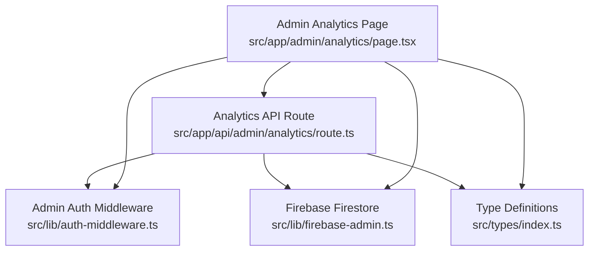
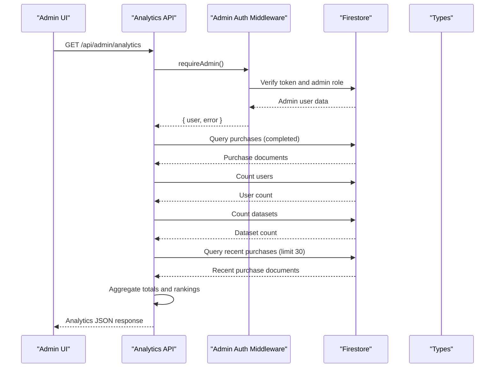
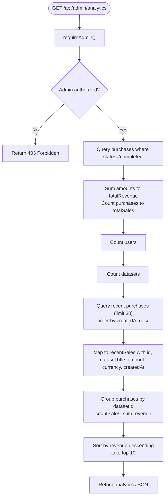
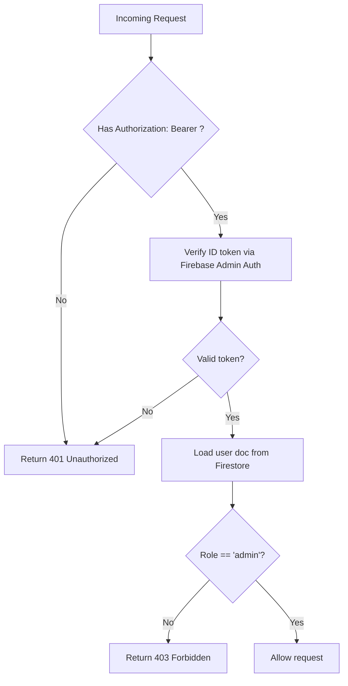
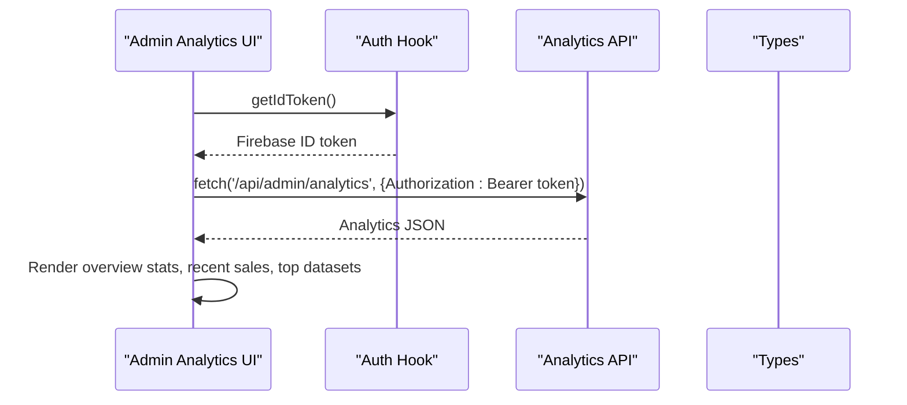
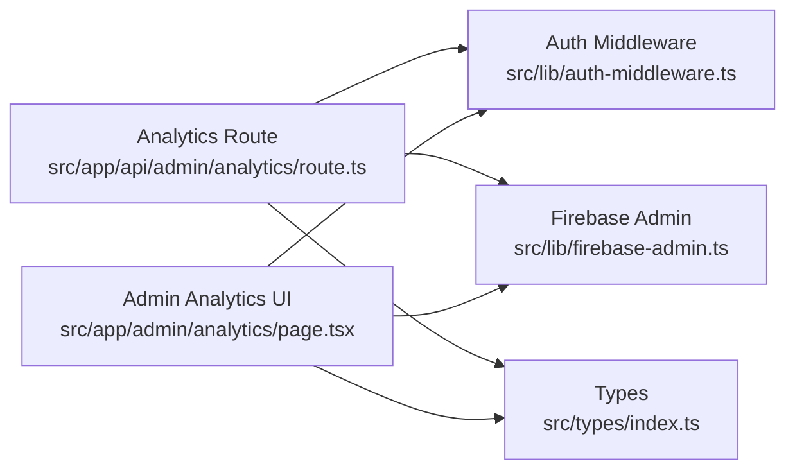

# Analytics and Reporting System

<cite>
**Referenced Files in This Document**
- [route.ts](file://src/app/api/admin/analytics/route.ts)
- [page.tsx](file://src/app/admin/analytics/page.tsx)
- [auth-middleware.ts](file://src/lib/auth-middleware.ts)
- [firebase-admin.ts](file://src/lib/firebase-admin.ts)
- [index.ts](file://src/types/index.ts)
- [route.ts](file://src/app/api/datasets/route.ts)
- [route.ts](file://src/app/api/datasets/[id]/route.ts)
- [route.ts](file://src/app/api/user/purchases/route.ts)
- [route.ts](file://src/app/api/payments/verify/route.ts)
- [kkiapay-button.tsx](file://src/components/payment/kkiapay-button.tsx)
</cite>

## Table of Contents
1. [Introduction](#introduction)
2. [Project Structure](#project-structure)
3. [Core Components](#core-components)
4. [Architecture Overview](#architecture-overview)
5. [Detailed Component Analysis](#detailed-component-analysis)
6. [Dependency Analysis](#dependency-analysis)
7. [Performance Considerations](#performance-considerations)
8. [Troubleshooting Guide](#troubleshooting-guide)
9. [Conclusion](#conclusion)

## Introduction
This document describes the Datafrica analytics and reporting system, focusing on the administrative analytics API endpoint that aggregates revenue, sales metrics, user activity, and dataset performance data. It explains the data aggregation queries for calculating total revenue in CFA currency, total sales counts, user registration statistics, and dataset inventory metrics. It also documents the recent sales timeline showing transaction history with dataset titles, amounts, currencies, and timestamps, and covers the top-performing datasets ranking system based on sales volume and revenue generated. The API response structure, pagination, and filtering options are documented, along with performance optimization techniques for large dataset queries and caching strategies. Finally, it addresses data visualization patterns and reporting capabilities.

## Project Structure
The analytics system is implemented as a Next.js API route protected by admin authentication middleware and backed by Firebase Firestore. The frontend admin analytics page consumes the API and renders key metrics and charts.

**Diagram sources**
- [page.tsx:1-228](file://src/app/admin/analytics/page.tsx#L1-L228)
- [route.ts:1-78](file://src/app/api/admin/analytics/route.ts#L1-L78)
- [auth-middleware.ts:1-48](file://src/lib/auth-middleware.ts#L1-L48)
- [firebase-admin.ts:1-50](file://src/lib/firebase-admin.ts#L1-L50)
- [index.ts:1-90](file://src/types/index.ts#L1-L90)

**Section sources**
- [page.tsx:1-228](file://src/app/admin/analytics/page.tsx#L1-L228)
- [route.ts:1-78](file://src/app/api/admin/analytics/route.ts#L1-L78)
- [auth-middleware.ts:1-48](file://src/lib/auth-middleware.ts#L1-L48)
- [firebase-admin.ts:1-50](file://src/lib/firebase-admin.ts#L1-L50)
- [index.ts:1-90](file://src/types/index.ts#L1-L90)

## Core Components
- Analytics API endpoint: Aggregates total revenue, total sales, total users, total datasets, recent sales transactions, and top-performing datasets.
- Admin authentication middleware: Ensures only admins can access analytics.
- Firebase Firestore integration: Provides data access for purchases, users, and datasets collections.
- Frontend analytics dashboard: Renders aggregated metrics and recent sales/top datasets.

Key data models used in analytics:
- Purchase: Transaction record with amount, currency, datasetId, datasetTitle, status, and createdAt.
- Dataset: Metadata including price, currency, recordCount, columns, and other attributes.
- User: Basic user profile with role for admin checks.

**Section sources**
- [route.ts:1-78](file://src/app/api/admin/analytics/route.ts#L1-L78)
- [index.ts:30-41](file://src/types/index.ts#L30-L41)
- [index.ts:11-28](file://src/types/index.ts#L11-L28)
- [index.ts:3-9](file://src/types/index.ts#L3-L9)

## Architecture Overview
The analytics pipeline follows a serverless pattern:
- Client requests the admin analytics endpoint.
- Authentication middleware verifies the admin token and role.
- The API queries Firestore for purchases, users, and datasets.
- Aggregation logic computes totals, recent sales, and top datasets.
- The response is returned to the admin UI for rendering.

**Diagram sources**
- [route.ts:6-78](file://src/app/api/admin/analytics/route.ts#L6-L78)
- [auth-middleware.ts:30-47](file://src/lib/auth-middleware.ts#L30-L47)
- [firebase-admin.ts:37-42](file://src/lib/firebase-admin.ts#L37-L42)
- [index.ts:30-41](file://src/types/index.ts#L30-L41)

## Detailed Component Analysis

### Analytics API Endpoint
The endpoint performs:
- Admin authentication and authorization.
- Revenue aggregation: Sums completed purchase amounts.
- Sales count: Counts completed purchases.
- User registration statistics: Counts users.
- Dataset inventory metrics: Counts datasets.
- Recent sales timeline: Retrieves latest 30 completed purchases with dataset titles, amounts, currencies, and timestamps.
- Top-performing datasets: Groups by datasetId, counts sales, sums revenue, sorts by revenue descending, and returns top 10.

Response structure:
- totalRevenue: Number (sum of completed purchase amounts).
- totalSales: Number (count of completed purchases).
- totalUsers: Number (user count).
- totalDatasets: Number (dataset count).
- recentSales: Array of purchase-like objects with id, datasetTitle, amount, currency, createdAt.
- topDatasets: Array of { id, title, count, revenue } sorted by revenue descending.

**Diagram sources**
- [route.ts:6-78](file://src/app/api/admin/analytics/route.ts#L6-L78)

**Section sources**
- [route.ts:6-78](file://src/app/api/admin/analytics/route.ts#L6-L78)

### Admin Authentication Middleware
Ensures only admins can access analytics:
- Verifies Authorization header bearer token.
- Verifies token with Firebase Admin Auth.
- Loads user document from Firestore to confirm role is admin.

**Diagram sources**
- [auth-middleware.ts:4-47](file://src/lib/auth-middleware.ts#L4-L47)

**Section sources**
- [auth-middleware.ts:4-47](file://src/lib/auth-middleware.ts#L4-L47)

### Frontend Analytics Dashboard
The admin analytics page:
- Fetches analytics data from the API using a Bearer token.
- Renders overview cards for total revenue, total sales, total users, and total datasets.
- Displays recent sales timeline with dataset titles and timestamps.
- Shows top-selling datasets with rank, title, sales count, and revenue in CFA.

**Diagram sources**
- [page.tsx:50-72](file://src/app/admin/analytics/page.tsx#L50-L72)
- [page.tsx:98-218](file://src/app/admin/analytics/page.tsx#L98-L218)

**Section sources**
- [page.tsx:1-228](file://src/app/admin/analytics/page.tsx#L1-L228)

### Supporting APIs and Data Models
- Datasets API: Lists datasets with category, country, search, price range, featured flag, and limit. Useful for dataset inventory insights.
- Single dataset API: Retrieves dataset details for context.
- User purchases API: Lists current user's purchases for personal analytics.
- Payment verification API: Verifies KKiaPay/Stripe transactions and creates purchase records.

These APIs complement analytics by providing dataset metadata, purchase history, and payment verification.

**Section sources**
- [route.ts:1-62](file://src/app/api/datasets/route.ts#L1-L62)
- [route.ts:1-29](file://src/app/api/datasets/[id]/route.ts#L1-L29)
- [route.ts:1-31](file://src/app/api/user/purchases/route.ts#L1-L31)
- [route.ts:1-84](file://src/app/api/payments/verify/route.ts#L1-L84)
- [index.ts:11-28](file://src/types/index.ts#L11-L28)
- [index.ts:30-41](file://src/types/index.ts#L30-L41)

## Dependency Analysis
The analytics system depends on:
- Firebase Admin SDK for secure server-side Firestore access.
- Next.js API routes for serverless endpoints.
- React components for rendering analytics UI.
- TypeScript types for data contracts.

**Diagram sources**
- [route.ts:1-78](file://src/app/api/admin/analytics/route.ts#L1-L78)
- [auth-middleware.ts:1-48](file://src/lib/auth-middleware.ts#L1-L48)
- [firebase-admin.ts:1-50](file://src/lib/firebase-admin.ts#L1-L50)
- [index.ts:1-90](file://src/types/index.ts#L1-L90)
- [page.tsx:1-228](file://src/app/admin/analytics/page.tsx#L1-L228)

**Section sources**
- [route.ts:1-78](file://src/app/api/admin/analytics/route.ts#L1-L78)
- [auth-middleware.ts:1-48](file://src/lib/auth-middleware.ts#L1-L48)
- [firebase-admin.ts:1-50](file://src/lib/firebase-admin.ts#L1-L50)
- [index.ts:1-90](file://src/types/index.ts#L1-L90)
- [page.tsx:1-228](file://src/app/admin/analytics/page.tsx#L1-L228)

## Performance Considerations
Current implementation characteristics:
- Firestore queries are executed synchronously in a single request handler.
- Revenue aggregation iterates over purchase documents in memory.
- Sorting and slicing top datasets occurs in memory after grouping.
- Recent sales are limited to 30 entries.

Optimization opportunities:
- Pagination and filtering for recent sales and top datasets:
  - Add pagination parameters (page, limit) to the analytics endpoint.
  - Add date range filters (startDate, endDate) for revenue and recent sales.
  - Add datasetId filters for targeted analytics.
- Indexing recommendations:
  - Create composite indexes for purchases by status and createdAt for efficient recent sales queries.
  - Create indexes for purchases by datasetId for top-performing dataset aggregation.
- Caching strategies:
  - Cache analytics results for short TTL (e.g., 5 minutes) to reduce repeated Firestore reads.
  - Invalidate cache on purchase completion or significant inventory changes.
- Batch processing:
  - For very large datasets, consider pre-aggregating metrics in background jobs and storing summarized documents.
- Client-side pagination:
  - Implement virtualized lists for recent sales and top datasets to improve UI responsiveness.

[No sources needed since this section provides general guidance]

## Troubleshooting Guide
Common issues and resolutions:
- Unauthorized or forbidden access:
  - Ensure Authorization header contains a valid Firebase ID token.
  - Confirm the user role is admin in Firestore.
- Analytics endpoint errors:
  - Check Firestore connectivity and indexes.
  - Verify purchase documents have required fields (amount, status, datasetId, datasetTitle).
- Revenue discrepancies:
  - Confirm all completed purchases contribute to totalRevenue.
  - Validate currency conversion if applicable (current implementation uses raw amounts).
- Recent sales missing:
  - Ensure purchases have status "completed".
  - Verify createdAt timestamps are recent and correctly formatted.
- Top datasets empty:
  - Confirm purchases exist for the queried period.
  - Check datasetId and datasetTitle fields in purchase documents.

**Section sources**
- [auth-middleware.ts:30-47](file://src/lib/auth-middleware.ts#L30-L47)
- [route.ts:6-78](file://src/app/api/admin/analytics/route.ts#L6-L78)

## Conclusion
The Datafrica analytics and reporting system provides a focused, admin-only analytics API that aggregates revenue, sales metrics, user activity, and dataset performance. The implementation leverages Firebase Firestore for data storage and Next.js API routes for serverless computation. While the current design is straightforward and functional, performance improvements such as pagination, filtering, indexing, and caching can significantly enhance scalability and user experience. The frontend dashboard effectively visualizes key metrics and recent sales, enabling administrators to monitor platform performance and dataset popularity.