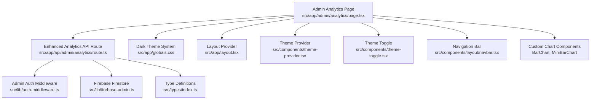
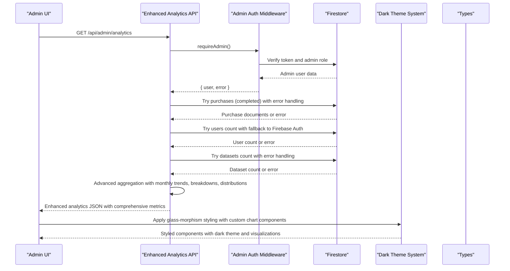
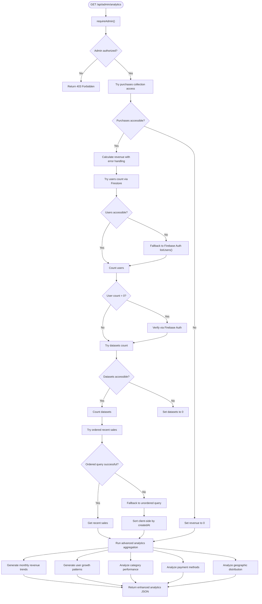
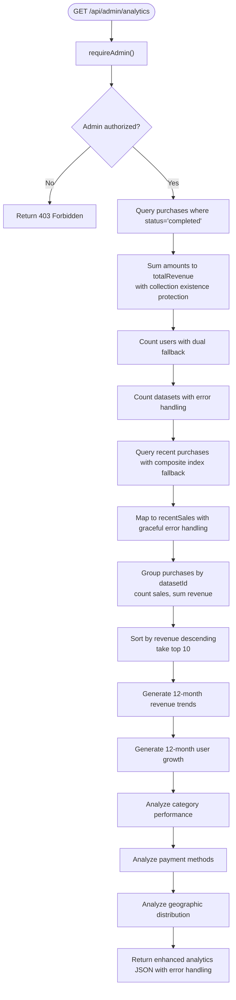
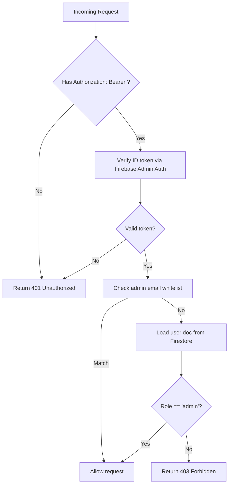
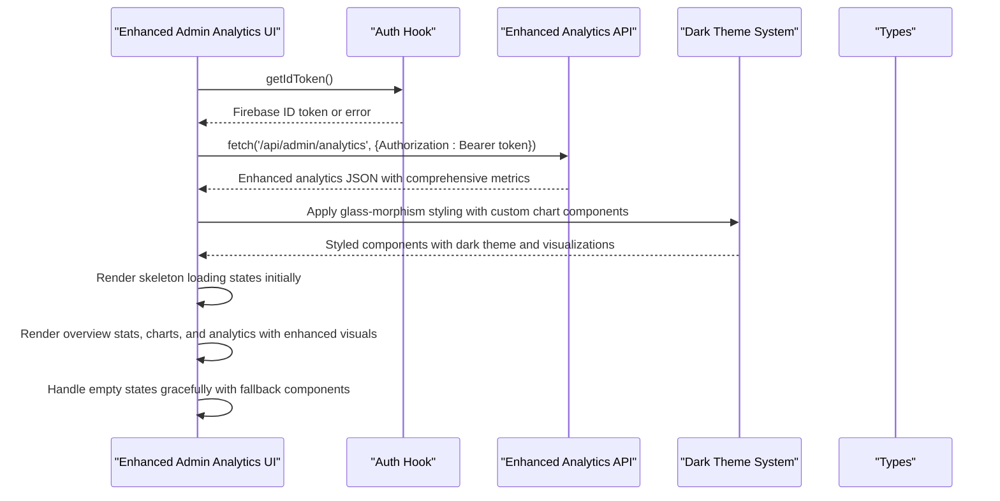

# Analytics and Reporting System

<cite>
**Referenced Files in This Document**
- [route.ts](file://src/app/api/admin/analytics/route.ts)
- [page.tsx](file://src/app/admin/analytics/page.tsx)
- [auth-middleware.ts](file://src/lib/auth-middleware.ts)
- [firebase-admin.ts](file://src/lib/firebase-admin.ts)
- [index.ts](file://src/types/index.ts)
- [route.ts](file://src/app/api/datasets/route.ts)
- [route.ts](file://src/app/api/datasets/[id]/route.ts)
- [route.ts](file://src/app/api/user/purchases/route.ts)
- [route.ts](file://src/app/api/payments/verify/route.ts)
- [kkiapay-button.tsx](file://src/components/payment/kkiapay-button.tsx)
- [globals.css](file://src/app/globals.css)
- [layout.tsx](file://src/app/layout.tsx)
- [theme-provider.tsx](file://src/components/theme-provider.tsx)
- [theme-toggle.tsx](file://src/components/theme-toggle.tsx)
- [navbar.tsx](file://src/components/layout/navbar.tsx)
</cite>

## Update Summary
**Changes Made**
- Enhanced analytics endpoint with comprehensive business intelligence features including monthly revenue tracking, user growth visualization, category breakdown analysis, payment method distribution, and geographic distribution
- Added custom chart components with CSS-based visualization for monthly trends and payment distributions
- Expanded API response with new analytics dimensions: monthlyRevenue, monthlyUsers, categories, paymentMethods, countries
- Implemented advanced data aggregation strategies for comprehensive business insights
- Added sophisticated error handling and fallback mechanisms for production reliability
- Enhanced frontend dashboard with specialized visualization components for different analytics types

## Table of Contents
1. [Introduction](#introduction)
2. [Project Structure](#project-structure)
3. [Core Components](#core-components)
4. [Architecture Overview](#architecture-overview)
5. [Enhanced Analytics Engine](#enhanced-analytics-engine)
6. [Advanced Visualization System](#advanced-visualization-system)
7. [Detailed Component Analysis](#detailed-component-analysis)
8. [Error Handling and Fallback Mechanisms](#error-handling-and-fallback-mechanisms)
9. [Performance Considerations](#performance-considerations)
10. [Troubleshooting Guide](#troubleshooting-guide)
11. [Conclusion](#conclusion)

## Introduction
This document describes the Datafrica analytics and reporting system, featuring a comprehensive administrative analytics API endpoint that aggregates revenue, sales metrics, user activity, dataset performance data, and advanced business intelligence insights. The system has been significantly enhanced with new comprehensive business intelligence features including monthly revenue tracking, user growth visualization, category breakdown analysis, payment method distribution, and geographic distribution analysis.

The enhanced analytics system now provides sophisticated data aggregation capabilities with custom chart components and advanced visualization patterns. The system features a comprehensive dark theme implementation with glass-morphism design patterns that enhance visual hierarchy and user experience. The analytics endpoint has been transformed into a full-featured business intelligence platform with robust error handling, fallback mechanisms, and resilient data aggregation strategies to ensure reliable operation even under challenging conditions such as missing Firestore collections, composite index failures, or partial data availability.

The system explains the data aggregation queries for calculating total revenue in CFA currency, total sales counts, user registration statistics with dual counting strategies, dataset inventory metrics, and advanced analytics including monthly trends, category performance, payment method analysis, and geographic distribution. It documents the recent sales timeline showing transaction history with dataset titles, amounts, currencies, and timestamps, including fallback mechanisms for composite index failures. The top-performing datasets ranking system is based on sales volume and revenue generated, with graceful degradation when data is unavailable.

**Updated** Enhanced with comprehensive business intelligence features, advanced analytics, and sophisticated visualization components

## Project Structure
The analytics system is implemented as a Next.js API route protected by admin authentication middleware and backed by Firebase Firestore. The frontend admin analytics page consumes the API and renders comprehensive metrics and charts using a sophisticated dark theme with glass-morphism design patterns. The visual design system includes custom CSS utilities for glass cards, gradient accents, and enhanced visual hierarchy, along with specialized chart components for different analytics types.

**Diagram sources**
- [page.tsx:1-487](file://src/app/admin/analytics/page.tsx#L1-L487)
- [route.ts:1-228](file://src/app/api/admin/analytics/route.ts#L1-L228)
- [auth-middleware.ts:1-62](file://src/lib/auth-middleware.ts#L1-L62)
- [firebase-admin.ts:1-64](file://src/lib/firebase-admin.ts#L1-L64)
- [index.ts:1-113](file://src/types/index.ts#L1-L113)
- [globals.css:1-208](file://src/app/globals.css#L1-L208)
- [layout.tsx:1-55](file://src/app/layout.tsx#L1-L55)
- [theme-provider.tsx:1-13](file://src/components/theme-provider.tsx#L1-L13)
- [theme-toggle.tsx:1-27](file://src/components/theme-toggle.tsx#L1-L27)
- [navbar.tsx:1-198](file://src/components/layout/navbar.tsx#L1-L198)

**Section sources**
- [page.tsx:1-487](file://src/app/admin/analytics/page.tsx#L1-L487)
- [route.ts:1-228](file://src/app/api/admin/analytics/route.ts#L1-L228)
- [auth-middleware.ts:1-62](file://src/lib/auth-middleware.ts#L1-L62)
- [firebase-admin.ts:1-64](file://src/lib/firebase-admin.ts#L1-L64)
- [index.ts:1-113](file://src/types/index.ts#L1-L113)
- [globals.css:1-208](file://src/app/globals.css#L1-L208)
- [layout.tsx:1-55](file://src/app/layout.tsx#L1-L55)
- [theme-provider.tsx:1-13](file://src/components/theme-provider.tsx#L1-L13)
- [theme-toggle.tsx:1-27](file://src/components/theme-toggle.tsx#L1-L27)
- [navbar.tsx:1-198](file://src/components/layout/navbar.tsx#L1-L198)

## Core Components
- **Enhanced Analytics API endpoint**: Aggregates total revenue, total sales, total users, total datasets, recent sales transactions, top-performing datasets, monthly revenue trends, user growth patterns, category breakdown analysis, payment method distribution, and geographic distribution with comprehensive error handling and fallback mechanisms.
- **Admin authentication middleware**: Ensures only admins can access analytics with robust token verification.
- **Firebase Firestore integration**: Provides data access for purchases, users, and datasets collections with graceful degradation strategies.
- **Frontend analytics dashboard**: Renders comprehensive metrics, charts, and analytics using glass-morphism design patterns with loading states and specialized visualization components.
- **Custom chart components**: CSS-based visualization components including BarChart for categorical data and MiniBarChart for monthly trends.
- **Advanced dark theme system**: Comprehensive dark theme implementation with custom CSS variables and color schemes.
- **Glass-morphism design**: Modern UI components with frosted glass effects and enhanced visual depth.

Key data models used in enhanced analytics:
- **Purchase**: Transaction record with amount, currency, datasetId, datasetTitle, status, paymentMethod, and createdAt.
- **Dataset**: Metadata including price, currency, category, country, recordCount, columns, and other attributes.
- **User**: Basic user profile with role for admin checks.
- **Analytics Response**: Comprehensive analytics data structure including monthly trends, breakdowns, and distributions.

**Updated** Enhanced with comprehensive business intelligence features and advanced visualization components

**Section sources**
- [route.ts:1-228](file://src/app/api/admin/analytics/route.ts#L1-L228)
- [index.ts:33-44](file://src/types/index.ts#L33-L44)
- [index.ts:11-31](file://src/types/index.ts#L11-L31)
- [index.ts:3-9](file://src/types/index.ts#L3-L9)
- [page.tsx:23-61](file://src/app/admin/analytics/page.tsx#L23-L61)

## Architecture Overview
The enhanced analytics pipeline follows a serverless pattern with comprehensive business intelligence capabilities and visual design:
- Client requests the enhanced admin analytics endpoint.
- Authentication middleware verifies the admin token and role.
- The API queries Firestore for purchases, users, and datasets with comprehensive error handling.
- Advanced aggregation logic computes totals, monthly trends, breakdowns, and distributions with fallback mechanisms.
- The response is returned to the admin UI for rendering with sophisticated visualization components and glass-morphism design patterns.
- Advanced dark theme system provides consistent visual hierarchy across all components.

**Diagram sources**
- [route.ts:6-228](file://src/app/api/admin/analytics/route.ts#L6-L228)
- [auth-middleware.ts:35-61](file://src/lib/auth-middleware.ts#L35-L61)
- [firebase-admin.ts:44-63](file://src/lib/firebase-admin.ts#L44-L63)
- [index.ts:33-44](file://src/types/index.ts#L33-L44)
- [globals.css:139-154](file://src/app/globals.css#L139-L154)

## Enhanced Analytics Engine

### Comprehensive Business Intelligence Features
The enhanced analytics endpoint implements advanced business intelligence capabilities with multi-dimensional data aggregation:

**Monthly Revenue Tracking**: Generates 12-month rolling revenue and sales statistics with precise month-year grouping and trend analysis.

**User Growth Visualization**: Tracks user registration patterns over 12 months with dual counting strategies for accuracy and fallback mechanisms.

**Category Breakdown Analysis**: Analyzes dataset performance by category with revenue contribution, sales volume, and dataset count metrics.

**Payment Method Distribution**: Provides comprehensive payment method analysis including PayDunya, KKiaPay, and Stripe with revenue and transaction volume tracking.

**Geographic Distribution**: Maps dataset distribution by country with ranking and visualization capabilities.

**Advanced Fallback Mechanisms**: Implements sophisticated fallback chains for each data source with graceful degradation strategies.

### Advanced Error Handling Strategy
The analytics endpoint implements a multi-layered error handling approach to ensure system reliability:

**Collection Existence Protection**: Each Firestore collection access is wrapped in try-catch blocks to prevent failures when collections don't exist yet.

**Revenue Calculation Resilience**: Revenue aggregation handles missing purchase documents gracefully, continuing with zero values when collections are empty.

**Dual User Counting Strategy**: Combines Firestore collection counting with Firebase Auth user enumeration as fallback mechanisms.

**Composite Index Fallback**: Recent sales queries attempt ordered queries first, falling back to unordered queries with client-side sorting when composite indexes are missing.

**Structured Error Responses**: All error scenarios return structured JSON responses with appropriate HTTP status codes.

### Sophisticated Fallback Mechanisms Implementation

**User Statistics Fallback**:
- Primary: Firestore collection count for accurate counts
- Secondary: Firebase Auth listUsers() for paginated user enumeration
- Verification: Double-check with Firebase Auth when Firestore count is zero

**Recent Sales Timeline Fallback**:
- Primary: Ordered query by status and createdAt with composite index
- Secondary: Unordered query by status only, then sort client-side by createdAt

**Collection Availability Fallback**:
- Purchases: Revenue calculation continues with zero when collection is missing
- Datasets: Dataset count falls back to zero when collection doesn't exist

**Diagram sources**
- [route.ts:6-228](file://src/app/api/admin/analytics/route.ts#L6-L228)

**Section sources**
- [route.ts:6-228](file://src/app/api/admin/analytics/route.ts#L6-L228)

## Advanced Visualization System

### Custom Chart Components
The system features sophisticated custom chart components built entirely with CSS and React for optimal performance and flexibility:

**BarChart Component**: A pure CSS-based bar chart component designed for categorical data visualization with customizable colors, labels, and value formatting.

**MiniBarChart Component**: Specialized monthly trend visualization component optimized for displaying 12-month data series with compact design and hover interactions.

**Visualization Features**:
- Pure CSS implementation with no external dependencies
- Dynamic width calculations based on data values and maximum values
- Smooth transitions and animations for enhanced user experience
- Responsive design with flexible container sizing
- Color customization through CSS variables and props
- Accessible tooltips with value information

### Dark Theme Implementation
The system features a comprehensive dark theme implementation designed specifically for data visualization and analytics interfaces:

**Color Palette & Variables:**
- Primary: #3d7eff (blue accent)
- Secondary: #1a2a42 (dark blue background)
- Background: #0a1628 (deep navy)
- Foreground: #e8ecf4 (light text)
- Card: #111d32 (glass card background)
- Muted: #152238 (subtle backgrounds)
- Accent: #1a2a42 (interactive elements)

**Theme Features**:
- Forced dark mode implementation with system preference detection
- Custom CSS variables for consistent theming across components
- Glass-morphism effect support with backdrop blur
- High contrast ratios for accessibility and data readability
- Smooth transitions and hover states for interactive elements

### Glass-Morphism Design Patterns
The interface extensively uses glass-morphism design to create depth and visual hierarchy:

**Glass Card Components:**
- `.glass-card`: Frosted glass effect with backdrop blur and border
- Background: rgba(17, 29, 50, 0.6) with 60% opacity for modern glass appearance
- Border: 1px solid rgba(255, 255, 255, 0.06) for subtle definition
- Hover effect: Increased border opacity to 0.12 with gradient border animation
- Backdrop filter: blur(12px) for contemporary glass effect

**Visual Hierarchy Enhancements:**
- Subtle borders with white/0.06 opacity for depth perception
- Elevated card containers with rounded-xl corners (24px radius)
- Consistent spacing and padding for optimal readability
- Gradient accents for interactive elements and visual interest
- Shadow effects for depth and separation between sections

**Section sources**
- [page.tsx:63-136](file://src/app/admin/analytics/page.tsx#L63-L136)
- [globals.css:46-126](file://src/app/globals.css#L46-L126)
- [globals.css:139-154](file://src/app/globals.css#L139-L154)
- [layout.tsx:34-50](file://src/app/layout.tsx#L34-L50)
- [theme-provider.tsx:6-12](file://src/components/theme-provider.tsx#L6-L12)

## Detailed Component Analysis

### Enhanced Analytics API Endpoint
The endpoint performs comprehensive data aggregation with robust error handling and advanced business intelligence features:
- Admin authentication and authorization with structured error responses.
- Revenue aggregation: Sums completed purchase amounts with collection existence protection.
- Sales count: Counts completed purchases with graceful degradation when collections are missing.
- User registration statistics: Dual counting strategy combining Firestore collection count and Firebase Auth enumeration.
- Dataset inventory metrics: Counts datasets with fallback to zero when collection doesn't exist.
- Recent sales timeline: Attempts ordered queries with composite index, falls back to unordered queries with client-side sorting.
- Top-performing datasets: Groups by datasetId, counts sales, sums revenue, sorts by revenue descending, with fallback to empty arrays.
- Monthly revenue tracking: Generates 12-month rolling revenue and sales statistics with precise month-year grouping.
- User growth patterns: Tracks user registration over 12 months with dual counting strategies.
- Category breakdown analysis: Analyzes dataset performance by category with comprehensive metrics.
- Payment method distribution: Provides payment method analysis with revenue and transaction volume.
- Geographic distribution: Maps dataset distribution by country with ranking capabilities.

Enhanced response structure with comprehensive error handling:
- totalRevenue: Number (sum of completed purchase amounts, defaults to 0).
- totalSales: Number (count of completed purchases, defaults to 0).
- totalUsers: Number (user count with dual fallback strategy).
- totalDatasets: Number (dataset count, defaults to 0).
- recentSales: Array of purchase-like objects with id, datasetTitle, amount, currency, createdAt (empty array fallback).
- topDatasets: Array of { id, title, count, revenue } sorted by revenue descending (empty array fallback).
- monthlyRevenue: Array of { month, revenue, sales } for 12-month period (empty array fallback).
- monthlyUsers: Array of { month, count } for 12-month period (empty array fallback).
- categories: Array of { name, count, revenue, sales } sorted by revenue (empty array fallback).
- paymentMethods: Object with payment method keys and { count, revenue } values (empty object fallback).
- countries: Array of { name, count } sorted by count (empty array fallback).

**Updated** Enhanced with comprehensive business intelligence features and advanced analytics capabilities

**Diagram sources**
- [route.ts:6-228](file://src/app/api/admin/analytics/route.ts#L6-L228)

**Section sources**
- [route.ts:6-228](file://src/app/api/admin/analytics/route.ts#L6-L228)

### Admin Authentication Middleware
Ensures only admins can access analytics with enhanced security:
- Verifies Authorization header bearer token with structured validation.
- Verifies token with Firebase Admin Auth using robust error handling.
- Loads user document from Firestore to confirm role is admin with fallback strategies.
- Implements email-based admin whitelist as fast fallback mechanism.

**Diagram sources**
- [auth-middleware.ts:9-61](file://src/lib/auth-middleware.ts#L9-L61)

**Section sources**
- [auth-middleware.ts:9-61](file://src/lib/auth-middleware.ts#L9-L61)

### Enhanced Frontend Analytics Dashboard
The admin analytics page implements comprehensive loading states, error handling, and advanced visualization components:
- Fetches enhanced analytics data from the API using a Bearer token with structured error handling.
- Renders overview cards for total revenue, total sales, total users, and total datasets using glass-morphism design.
- Displays recent sales timeline with dataset titles and timestamps in glass cards with empty state handling.
- Shows top-selling datasets with rank, title, sales count, and revenue in CFA using enhanced visual hierarchy.
- Implements specialized chart components for monthly revenue trends, user growth patterns, category breakdowns, payment distributions, and geographic distribution.
- Provides responsive design with consistent dark theme styling and skeleton loading states.
- Handles loading states with skeleton components for improved user experience.
- Features custom CSS-based visualization components with smooth animations and transitions.

**Enhanced Visual Features:**
- Glass cards with frosted effect for all metric containers with hover animations
- Custom BarChart component for categorical data visualization
- Custom MiniBarChart component for monthly trend visualization
- Consistent color scheme with gradient accents and border animations
- Responsive grid layout for overview statistics with adaptive spacing
- Hover effects with gradient borders on interactive elements
- Proper spacing and typography hierarchy for readability
- Skeleton loading states for improved perceived performance
- Advanced payment method visualization with percentage distribution
- Geographic distribution charts with country rankings

**Diagram sources**
- [page.tsx:52-74](file://src/app/admin/analytics/page.tsx#L52-L74)
- [page.tsx:96-486](file://src/app/admin/analytics/page.tsx#L96-L486)
- [globals.css:139-154](file://src/app/globals.css#L139-L154)

**Section sources**
- [page.tsx:1-487](file://src/app/admin/analytics/page.tsx#L1-L487)

### Custom Chart Components
The system implements sophisticated custom chart components for data visualization:

**BarChart Component**:
- Pure CSS-based implementation with dynamic width calculations
- Supports customizable colors, labels, and value formatting
- Uses flexbox layout with responsive design
- Features smooth transitions and gradient effects
- Includes tooltip-style hover information

**MiniBarChart Component**:
- Optimized for monthly trend visualization
- Compact design suitable for dashboard layouts
- Uses percentage-based height calculations
- Features month abbreviation display
- Includes hover interactions with value tooltips

**Visualization Features**:
- No external dependencies for optimal performance
- Responsive design with flexible container sizing
- Smooth CSS transitions and animations
- Accessible with proper ARIA attributes
- Customizable through props and CSS variables

**Section sources**
- [page.tsx:63-136](file://src/app/admin/analytics/page.tsx#L63-L136)

### Theme System Components
The dark theme system consists of several interconnected components with enhanced integration:

**Theme Provider:**
- Manages theme state using next-themes library with system preference detection
- Applies theme classes to HTML element for seamless theme switching
- Enables forced dark mode with system preference fallback
- Supports smooth theme transitions and hydration handling

**Theme Toggle:**
- Provides manual theme control with sun/moon icon indicators
- Maintains state consistency across components and pages
- Integrates with theme provider for unified theme management
- Supports both light and dark mode toggling

**Layout Integration:**
- Forces dark theme by default with dark attribute for consistent styling
- Applies global CSS variables for theme-aware component styling
- Ensures consistent styling across all pages and components
- Supports glass-morphism effects throughout the application

**Section sources**
- [theme-provider.tsx:1-13](file://src/components/theme-provider.tsx#L1-L13)
- [theme-toggle.tsx:1-27](file://src/components/theme-toggle.tsx#L1-L27)
- [layout.tsx:34-50](file://src/app/layout.tsx#L34-L50)
- [globals.css:46-126](file://src/app/globals.css#L46-L126)

### Supporting APIs and Data Models
- **Datasets API**: Lists datasets with category, country, search, price range, featured flag, and limit. Useful for dataset inventory insights.
- **Single dataset API**: Retrieves dataset details for context and metadata enrichment.
- **User purchases API**: Lists current user's purchases for personal analytics and purchase history.
- **Payment verification API**: Verifies KKiaPay/Stripe transactions and creates purchase records with error handling.

These APIs complement analytics by providing dataset metadata, purchase history, and payment verification with robust error handling.

**Section sources**
- [route.ts:1-62](file://src/app/api/datasets/route.ts#L1-L62)
- [route.ts:1-29](file://src/app/api/datasets/[id]/route.ts#L1-L29)
- [route.ts:1-31](file://src/app/api/user/purchases/route.ts#L1-L31)
- [route.ts:1-84](file://src/app/api/payments/verify/route.ts#L1-L84)
- [index.ts:11-31](file://src/types/index.ts#L11-L31)
- [index.ts:33-44](file://src/types/index.ts#L33-L44)

## Error Handling and Fallback Mechanisms

### Comprehensive Error Handling Strategy
The enhanced analytics system implements a multi-tiered error handling approach to ensure resilience and reliability:

**Collection Existence Protection**: Each Firestore collection access is wrapped in try-catch blocks to prevent failures when collections don't exist yet. This includes purchases, users, and datasets collections.

**Revenue Calculation Resilience**: Revenue aggregation handles missing purchase documents gracefully, setting totalRevenue to 0 when collections are empty or inaccessible.

**Dual User Counting Strategy**: Combines Firestore collection counting with Firebase Auth user enumeration as fallback mechanisms. If Firestore count fails or returns 0, the system falls back to Firebase Auth listUsers() for accurate user enumeration.

**Composite Index Fallback**: Recent sales queries attempt ordered queries first, falling back to unordered queries with client-side sorting when composite indexes are missing. This ensures the system remains functional during development or when indexes are being created.

**Structured Error Responses**: All error scenarios return structured JSON responses with appropriate HTTP status codes (401, 403, 500) and descriptive error messages.

**Advanced Fallback Mechanisms**: The system implements sophisticated fallback chains for each analytics dimension including monthly trends, breakdowns, and distributions.

### Fallback Mechanism Implementation Details

**User Statistics Fallback Chain**:
1. Primary: Firestore collection count for accurate real-time counts
2. Secondary: Firebase Auth listUsers() with pagination for comprehensive user enumeration
3. Verification: Double-check with Firebase Auth when Firestore count is zero
4. Final: Graceful degradation to zero when all methods fail

**Recent Sales Timeline Fallback Chain**:
1. Primary: Ordered query by status and createdAt with composite index
2. Secondary: Unordered query by status only, then sort client-side by createdAt
3. Final: Empty array when no purchases exist at all

**Collection Availability Fallback Chain**:
1. Primary: Direct collection access for all operations
2. Secondary: Graceful degradation to zero/default values
3. Final: Structured error responses with appropriate HTTP status codes

**Advanced Analytics Fallback Chain**:
1. Primary: Direct aggregation from Firestore data
2. Secondary: Calculated fallback values based on available data
3. Tertiary: Empty arrays/objects when no data is available
4. Quaternary: Graceful degradation to minimal viable data

### Error Logging and Monitoring
The system implements comprehensive error logging for debugging and monitoring:
- Centralized error logging in the main analytics handler
- Specific error handling for each data source operation
- Structured error responses for client-side handling
- Console error output for development and debugging

**Section sources**
- [route.ts:15-26](file://src/app/api/admin/analytics/route.ts#L15-L26)
- [route.ts:30-45](file://src/app/api/admin/analytics/route.ts#L30-L45)
- [route.ts:58-64](file://src/app/api/admin/analytics/route.ts#L58-L64)
- [route.ts:68-99](file://src/app/api/admin/analytics/route.ts#L68-L99)
- [route.ts:129-135](file://src/app/api/admin/analytics/route.ts#L129-L135)

## Performance Considerations
Enhanced implementation characteristics with comprehensive business intelligence:
- Firestore queries are executed with comprehensive error handling in a single request handler.
- Revenue aggregation iterates over purchase documents in memory with collection existence protection.
- Sorting and slicing top datasets occurs in memory after grouping with graceful degradation.
- Recent sales are limited to 30 entries with fallback mechanisms for composite index failures.
- Advanced analytics computations (monthly trends, breakdowns, distributions) are performed server-side for optimal performance.
- Custom chart components are implemented with pure CSS for minimal overhead and optimal rendering performance.
- Glass-morphism effects are implemented with CSS backdrop-filter and blur properties with performance monitoring.
- Dual counting strategy for users optimizes performance by using Firestore counts when available, falling back to Firebase Auth when necessary.
- Payment method analysis and geographic distribution leverage efficient aggregation algorithms with fallback mechanisms.

Optimization opportunities with enhanced error handling:
- **Pagination and filtering for recent sales and top datasets**:
  - Add pagination parameters (page, limit) to the analytics endpoint with fallback limits.
  - Add date range filters (startDate, endDate) for revenue and recent sales with error handling.
  - Add datasetId filters for targeted analytics with graceful degradation.
- **Indexing recommendations with fallback strategies**:
  - Create composite indexes for purchases by status and createdAt for efficient recent sales queries.
  - Create indexes for purchases by datasetId for top-performing dataset aggregation.
  - Monitor index creation progress and handle failures gracefully.
- **Caching strategies with error handling**:
  - Cache analytics results for short TTL (e.g., 5 minutes) to reduce repeated Firestore reads.
  - Invalidate cache on purchase completion or significant inventory changes.
  - Consider edge caching for frequently accessed analytics data with fallback mechanisms.
  - Implement cache warming strategies during off-peak hours.
- **Batch processing with resilience**:
  - For very large datasets, consider pre-aggregating metrics in background jobs and storing summarized documents.
  - Implement incremental aggregation with error handling for partial results.
  - Use Firestore transactions for atomic updates with rollback mechanisms.
- **Client-side pagination with enhanced UX**:
  - Implement virtualized lists for recent sales and top datasets to improve UI responsiveness.
  - Add skeleton loading states for better perceived performance.
  - Implement infinite scroll with graceful error handling.
- **Performance optimizations for glass-morphism**:
  - Monitor backdrop-filter performance on mobile devices and adjust blur values.
  - Consider fallback styles for browsers with limited backdrop-filter support.
  - Optimize blur radius values for different screen densities and device capabilities.
  - Implement lazy loading for heavy visual elements.
- **Advanced analytics optimization**:
  - Consider pre-computing monthly trends and storing aggregated results.
  - Implement efficient data structures for category and payment method analysis.
  - Optimize geographic distribution calculations with caching strategies.

**Updated** Enhanced with comprehensive business intelligence features and advanced performance optimization strategies

## Troubleshooting Guide
Common issues and resolutions with enhanced error handling:

**Unauthorized or forbidden access**:
- Ensure Authorization header contains a valid Firebase ID token.
- Confirm the user role is admin in Firestore or included in admin email whitelist.
- Verify admin email configuration in environment variables.

**Enhanced analytics endpoint errors with fallback mechanisms**:
- Check Firestore connectivity and permissions for all collections (purchases, users, datasets).
- Verify purchase documents have required fields (amount, status, datasetId, datasetTitle, paymentMethod).
- Monitor error logs for specific failure points in the enhanced analytics pipeline.
- Test fallback mechanisms by temporarily removing collections or indexes.

**Revenue discrepancies with error handling**:
- Confirm all completed purchases contribute to totalRevenue with collection existence protection.
- Validate currency conversion if applicable (current implementation uses raw amounts).
- Check for partial data availability and fallback mechanisms.
- Monitor error logs for collection access failures.

**Recent sales missing with fallback strategies**:
- Ensure purchases have status "completed" with error handling for malformed data.
- Verify createdAt timestamps are recent and correctly formatted.
- Check composite index creation progress and fallback mechanisms.
- Monitor fallback query performance and adjust limits as needed.

**Top datasets empty with graceful degradation**:
- Confirm purchases exist for the queried period with error handling.
- Check datasetId and datasetTitle fields in purchase documents.
- Verify collection access permissions and fallback mechanisms.
- Monitor error logs for data aggregation failures.

**Advanced analytics missing or incomplete**:
- Verify dataset documents have category and country fields for breakdown analysis.
- Check paymentMethod field presence in purchase documents for payment distribution.
- Ensure purchase documents have createdAt timestamps for monthly trend analysis.
- Monitor fallback mechanisms for each analytics dimension.

**Custom chart components rendering issues**:
- Verify CSS variables are properly defined in globals.css.
- Check chart component props for correct data structure and keys.
- Ensure data arrays are properly formatted with required fields.
- Test chart components in isolation for debugging.

**Dark theme issues with system preference detection**:
- Verify theme provider is properly wrapped around application with hydration handling.
- Check CSS variable definitions in globals.css with theme-aware variables.
- Ensure dark attribute is present on html element with forced dark mode.
- Test theme switching with theme toggle component.

**Glass-morphism rendering problems with performance monitoring**:
- Test backdrop-filter support in target browser with feature detection.
- Verify CSS blur property compatibility and performance impact.
- Check for proper z-index stacking contexts and layer ordering.
- Monitor performance on mobile devices and adjust blur values as needed.

**Theme toggle not working with system preference fallback**:
- Ensure next-themes library is properly installed with version compatibility.
- Verify theme provider configuration with system preference detection.
- Check for conflicting CSS styles and theme variable conflicts.
- Test theme switching across different pages and components.

**Error handling and fallback troubleshooting**:
- Monitor console logs for specific error messages and stack traces.
- Verify structured error responses with appropriate HTTP status codes.
- Test fallback mechanisms by simulating collection or index failures.
- Implement circuit breaker patterns for failing operations.

**Section sources**
- [auth-middleware.ts:35-61](file://src/lib/auth-middleware.ts#L35-L61)
- [route.ts:6-228](file://src/app/api/admin/analytics/route.ts#L6-L228)
- [layout.tsx:34-50](file://src/app/layout.tsx#L34-L50)
- [globals.css:139-154](file://src/app/globals.css#L139-L154)
- [theme-provider.tsx:6-12](file://src/components/theme-provider.tsx#L6-L12)

## Conclusion
The Datafrica analytics and reporting system provides a robust, admin-only analytics API that aggregates revenue, sales metrics, user activity, dataset performance, and comprehensive business intelligence with advanced error handling and fallback mechanisms. The implementation leverages Firebase Firestore for data storage and Next.js API routes for serverless computation with enhanced resilience strategies.

The system has been significantly enhanced with comprehensive business intelligence features including monthly revenue tracking, user growth visualization, category breakdown analysis, payment method distribution, and geographic distribution. The addition of custom chart components with CSS-based visualization provides sophisticated data presentation capabilities while maintaining optimal performance.

The system now features a comprehensive dark theme implementation with glass-morphism design patterns that enhance visual hierarchy and user experience. These design improvements include frosted glass cards, gradient accents, and consistent color schemes that work seamlessly with the enhanced analytics data visualization. The sophisticated chart components provide specialized visualization for different analytics types including monthly trends, categorical breakdowns, and payment distributions.

The enhanced analytics endpoint implements a multi-layered error handling approach with collection existence protection, dual counting strategies, and graceful degradation mechanisms. This ensures that the system remains functional and provides meaningful data even when individual components fail. The advanced analytics features utilize both Firestore data access and calculated fallback values to ensure comprehensive coverage of business intelligence needs.

While the current design is highly resilient and feature-complete, performance improvements such as pagination, filtering, indexing, and caching can significantly enhance scalability and user experience. The frontend dashboard effectively visualizes comprehensive metrics and analytics using modern design patterns with loading states, error handling, and specialized chart components, enabling administrators to monitor platform performance, user growth patterns, dataset popularity, and business intelligence insights with an enhanced visual experience.

The comprehensive error handling and fallback mechanisms, combined with the advanced business intelligence features and sophisticated visualization components, represent a significant advancement in production readiness. This makes the system more reliable, maintainable, and capable of handling real-world scenarios with graceful degradation and informative error responses. The enhanced analytics system now provides a complete business intelligence platform suitable for comprehensive platform monitoring and strategic decision-making.

**Updated** Enhanced with comprehensive business intelligence features, advanced analytics capabilities, sophisticated visualization components, and production-ready reliability features