# Dataset Management Interface

<cite>
**Referenced Files in This Document**
- [src/app/admin/upload/page.tsx](file://src/app/admin/upload/page.tsx)
- [src/app/api/admin/upload/route.ts](file://src/app/api/admin/upload/route.ts)
- [src/components/dataset/data-preview-table.tsx](file://src/components/dataset/data-preview-table.tsx)
- [src/lib/firebase-admin.ts](file://src/lib/firebase-admin.ts)
- [src/lib/auth-middleware.ts](file://src/lib/auth-middleware.ts)
- [src/types/index.ts](file://src/types/index.ts)
- [src/app/api/datasets/[id]/download/route.ts](file://src/app/api/datasets/[id]/download/route.ts)
- [src/app/datasets/[id]/page.tsx](file://src/app/datasets/[id]/page.tsx)
- [src/app/datasets/page.tsx](file://src/app/datasets/page.tsx)
- [src/components/dataset/dataset-card.tsx](file://src/components/dataset/dataset-card.tsx)
- [src/app/api/datasets/[id]/route.ts](file://src/app/api/datasets/[id]/route.ts)
- [src/app/api/datasets/route.ts](file://src/app/api/datasets/route.ts)
- [src/hooks/use-auth.tsx](file://src/hooks/use-auth.tsx)
- [src/lib/firebase.ts](file://src/lib/firebase.ts)
</cite>

## Table of Contents
1. [Introduction](#introduction)
2. [Project Structure](#project-structure)
3. [Core Components](#core-components)
4. [Architecture Overview](#architecture-overview)
5. [Detailed Component Analysis](#detailed-component-analysis)
6. [Dependency Analysis](#dependency-analysis)
7. [Performance Considerations](#performance-considerations)
8. [Troubleshooting Guide](#troubleshooting-guide)
9. [Conclusion](#conclusion)

## Introduction
This document describes the Datafrica dataset management interface and upload system. It covers the dataset upload form, validation rules, metadata extraction, supported formats, quality checks, preview functionality, dataset creation workflow, admin-only access controls, error handling, and integration with Firebase Cloud Storage and Firestore. It also documents bulk dataset operations and batch processing capabilities.

## Project Structure
The system is organized as a Next.js application with:
- Client-side pages under src/app for admin and public dataset browsing
- API routes under src/app/api for backend operations
- Shared UI components under src/components
- Authentication and Firebase utilities under src/lib
- Types and constants under src/types
- Client-side authentication hook under src/hooks

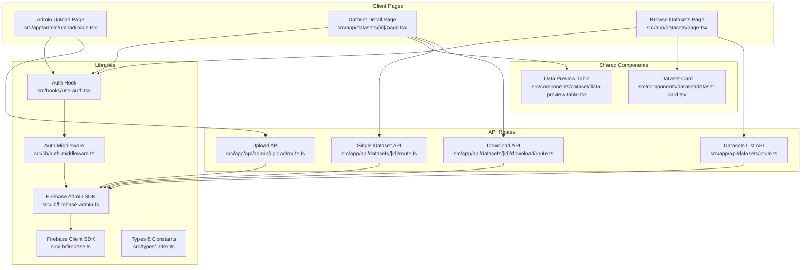

**Diagram sources**
- [src/app/admin/upload/page.tsx:1-295](file://src/app/admin/upload/page.tsx#L1-L295)
- [src/app/api/admin/upload/route.ts:1-93](file://src/app/api/admin/upload/route.ts#L1-L93)
- [src/components/dataset/data-preview-table.tsx:1-76](file://src/components/dataset/data-preview-table.tsx#L1-L76)
- [src/app/datasets/[id]/page.tsx](file://src/app/datasets/[id]/page.tsx#L1-L382)
- [src/app/datasets/page.tsx:1-195](file://src/app/datasets/page.tsx#L1-L195)
- [src/components/dataset/dataset-card.tsx:1-81](file://src/components/dataset/dataset-card.tsx#L1-L81)
- [src/app/api/datasets/[id]/download/route.ts](file://src/app/api/datasets/[id]/download/route.ts#L1-L148)
- [src/app/api/datasets/[id]/route.ts](file://src/app/api/datasets/[id]/route.ts#L1-L29)
- [src/app/api/datasets/route.ts:1-62](file://src/app/api/datasets/route.ts#L1-L62)
- [src/hooks/use-auth.tsx:1-117](file://src/hooks/use-auth.tsx#L1-L117)
- [src/lib/auth-middleware.ts:1-48](file://src/lib/auth-middleware.ts#L1-L48)
- [src/lib/firebase-admin.ts:1-50](file://src/lib/firebase-admin.ts#L1-L50)
- [src/lib/firebase.ts:1-22](file://src/lib/firebase.ts#L1-L22)
- [src/types/index.ts:1-90](file://src/types/index.ts#L1-L90)

**Section sources**
- [src/app/admin/upload/page.tsx:1-295](file://src/app/admin/upload/page.tsx#L1-L295)
- [src/app/api/admin/upload/route.ts:1-93](file://src/app/api/admin/upload/route.ts#L1-L93)
- [src/lib/firebase-admin.ts:1-50](file://src/lib/firebase-admin.ts#L1-L50)
- [src/lib/auth-middleware.ts:1-48](file://src/lib/auth-middleware.ts#L1-L48)
- [src/types/index.ts:1-90](file://src/types/index.ts#L1-L90)

## Core Components
- Admin Upload Form: Handles CSV file selection, metadata collection, and submission to the upload API.
- Upload API: Validates inputs, parses CSV, extracts metadata, stores dataset document, and batches full data.
- Data Preview Table: Renders a preview of uploaded data with column headers and sample values.
- Dataset Detail Page: Displays dataset metadata, preview, and download options after purchase.
- Authentication Hook and Middleware: Manage user state, ID tokens, and admin-only access.
- Firebase Integration: Uses Firestore for metadata and batched data, and Cloud Storage for file hosting.

**Section sources**
- [src/app/admin/upload/page.tsx:22-295](file://src/app/admin/upload/page.tsx#L22-L295)
- [src/app/api/admin/upload/route.ts:6-93](file://src/app/api/admin/upload/route.ts#L6-L93)
- [src/components/dataset/data-preview-table.tsx:12-76](file://src/components/dataset/data-preview-table.tsx#L12-L76)
- [src/app/datasets/[id]/page.tsx](file://src/app/datasets/[id]/page.tsx#L29-L382)
- [src/hooks/use-auth.tsx:22-117](file://src/hooks/use-auth.tsx#L22-L117)
- [src/lib/auth-middleware.ts:19-48](file://src/lib/auth-middleware.ts#L19-L48)
- [src/lib/firebase-admin.ts:1-50](file://src/lib/firebase-admin.ts#L1-L50)

## Architecture Overview
The upload pipeline integrates client-side validation, server-side parsing, and Firebase backend services.

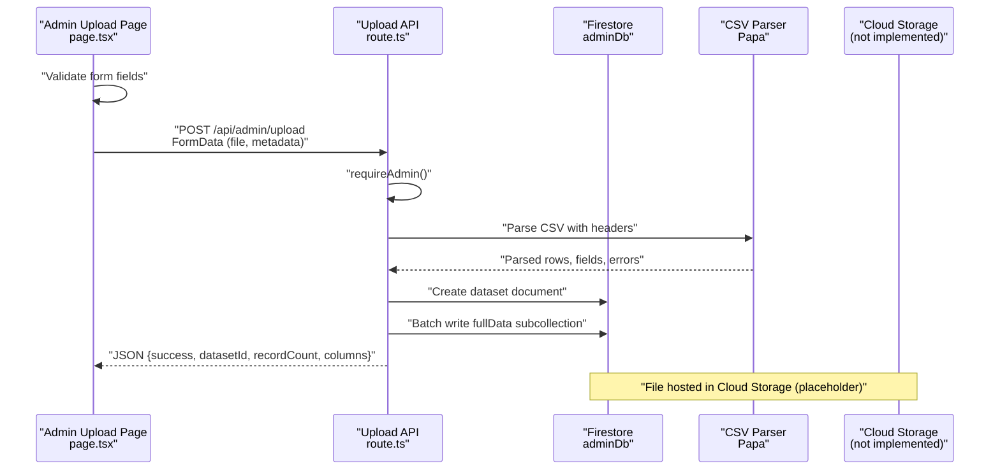

**Diagram sources**
- [src/app/admin/upload/page.tsx:44-98](file://src/app/admin/upload/page.tsx#L44-L98)
- [src/app/api/admin/upload/route.ts:6-93](file://src/app/api/admin/upload/route.ts#L6-L93)
- [src/lib/firebase-admin.ts:37-42](file://src/lib/firebase-admin.ts#L37-L42)

**Section sources**
- [src/app/admin/upload/page.tsx:44-98](file://src/app/admin/upload/page.tsx#L44-L98)
- [src/app/api/admin/upload/route.ts:6-93](file://src/app/api/admin/upload/route.ts#L6-L93)

## Detailed Component Analysis

### Upload Form and Validation
- Supported file format: CSV (.csv).
- Required fields: CSV file, title, category, country, price.
- Optional fields: description, currency (default XOF), previewRows (1–50, default 10), featured flag.
- Client-side validation prevents submission without required fields and enforces file presence.
- On submit, the form collects metadata and attaches the CSV file to a FormData payload.
- Authentication: Requires a valid Firebase ID token obtained via the auth hook.

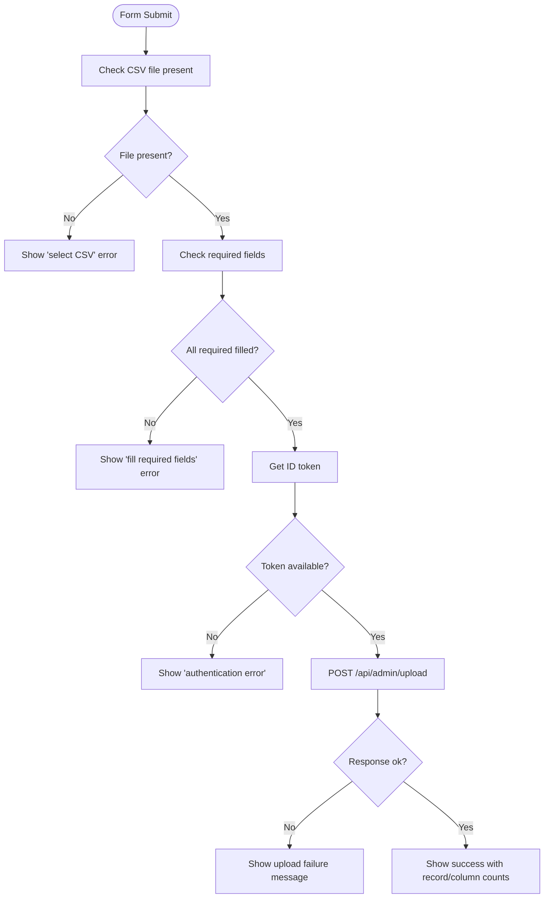

**Diagram sources**
- [src/app/admin/upload/page.tsx:44-98](file://src/app/admin/upload/page.tsx#L44-L98)

**Section sources**
- [src/app/admin/upload/page.tsx:141-295](file://src/app/admin/upload/page.tsx#L141-L295)

### Upload API: Parsing, Metadata Extraction, and Batch Storage
- Authentication: requireAdmin verifies Bearer token and checks Firestore user role.
- Input extraction: Reads file, title, description, category, country, price, currency, previewRows, featured.
- CSV parsing: Uses Papa.parse with header:true and skipEmptyLines:true; returns errors if any.
- Metadata: Stores title, description, category, country, price, currency, recordCount, columns, previewData, featured, timestamps.
- Full data storage: Writes rows to a subcollection "fullData" in batches of 500 using Firestore batch writes.
- Response: Returns success flag, datasetId, recordCount, and columns.

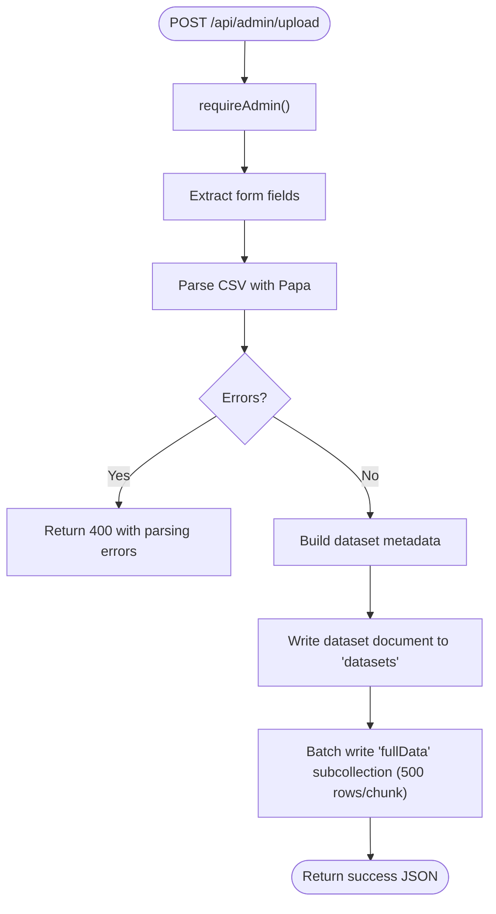

**Diagram sources**
- [src/app/api/admin/upload/route.ts:6-93](file://src/app/api/admin/upload/route.ts#L6-L93)

**Section sources**
- [src/app/api/admin/upload/route.ts:6-93](file://src/app/api/admin/upload/route.ts#L6-L93)

### Dataset Preview Functionality
- Preview rendering: The DataPreviewTable component displays the first N rows (default 10) and up to 8 columns for readability.
- Behavior: Shows a message when no preview data is available; indicates total rows vs. shown rows; truncates long values.
- Integration: Used on the dataset detail page to show preview data returned by the dataset API.

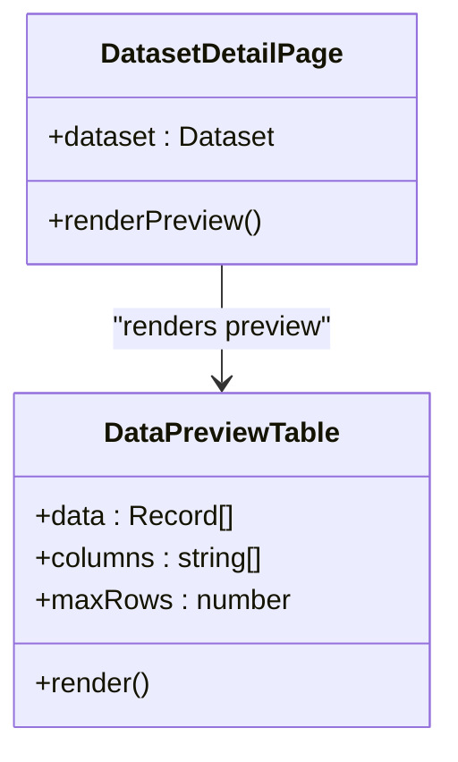

**Diagram sources**
- [src/components/dataset/data-preview-table.tsx:12-76](file://src/components/dataset/data-preview-table.tsx#L12-L76)
- [src/app/datasets/[id]/page.tsx](file://src/app/datasets/[id]/page.tsx#L263-L277)

**Section sources**
- [src/components/dataset/data-preview-table.tsx:12-76](file://src/components/dataset/data-preview-table.tsx#L12-L76)
- [src/app/datasets/[id]/page.tsx](file://src/app/datasets/[id]/page.tsx#L263-L277)

### Dataset Creation Workflow
- Title and description: Captured from the form; description is optional.
- Category and country: Selected from predefined lists (types define categories and countries).
- Pricing configuration: Price is numeric with minimum 0 and step 100; currency defaults to XOF but can be changed.
- Availability settings: previewRows controls free preview size (1–50); featured flag marks prominence.
- Metadata extraction: Columns and record count derived from parsed CSV; previewData is a slice of rows.
- Storage: Dataset document stored in Firestore "datasets" collection; full data stored in "datasets/{id}/fullData" subcollection in batches.

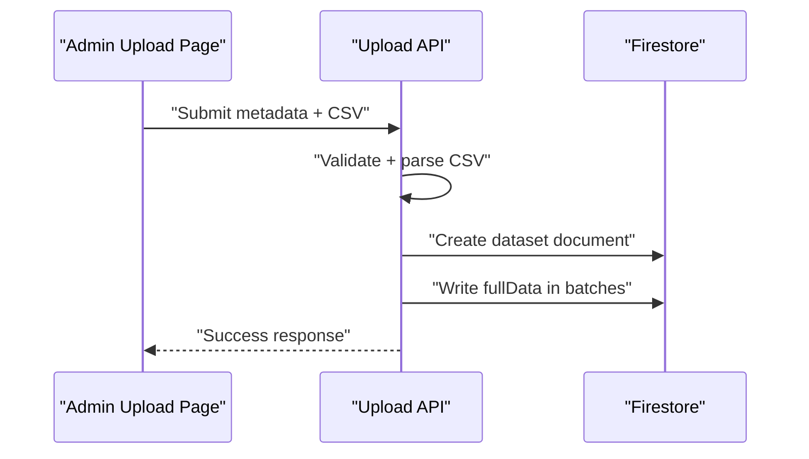

**Diagram sources**
- [src/app/admin/upload/page.tsx:22-98](file://src/app/admin/upload/page.tsx#L22-L98)
- [src/app/api/admin/upload/route.ts:45-77](file://src/app/api/admin/upload/route.ts#L45-L77)

**Section sources**
- [src/app/admin/upload/page.tsx:22-98](file://src/app/admin/upload/page.tsx#L22-L98)
- [src/app/api/admin/upload/route.ts:45-77](file://src/app/api/admin/upload/route.ts#L45-L77)
- [src/types/index.ts:52-89](file://src/types/index.ts#L52-L89)

### Admin-Only Access Controls and Authentication
- Authentication middleware: requireAdmin verifies Bearer token and checks Firestore user role equals "admin".
- Client-side guard: Admin upload page redirects non-admin users to home.
- Token acquisition: The auth hook provides getIdToken for protected requests.

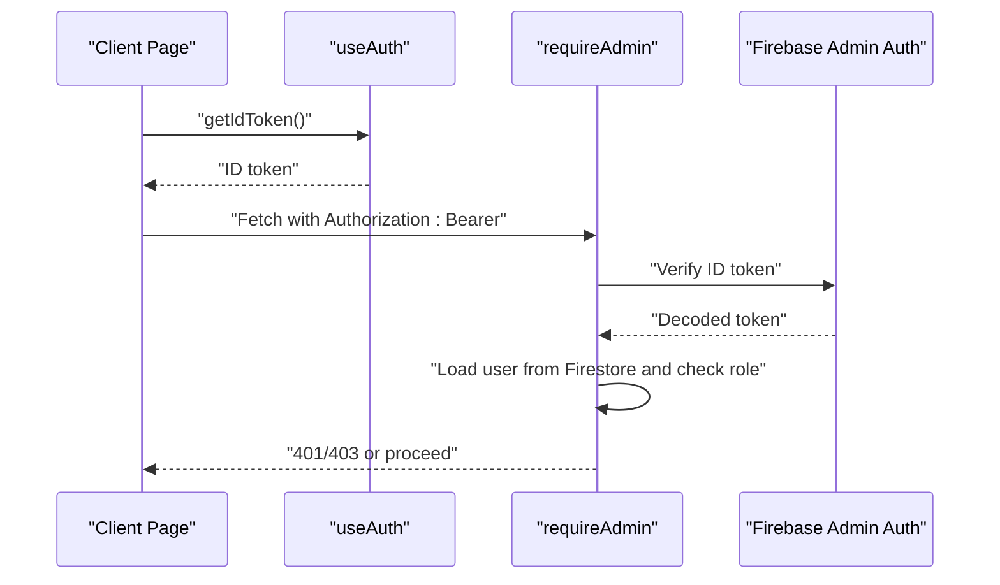

**Diagram sources**
- [src/hooks/use-auth.tsx:94-99](file://src/hooks/use-auth.tsx#L94-L99)
- [src/lib/auth-middleware.ts:19-47](file://src/lib/auth-middleware.ts#L19-L47)
- [src/app/admin/upload/page.tsx:38-42](file://src/app/admin/upload/page.tsx#L38-L42)

**Section sources**
- [src/lib/auth-middleware.ts:19-47](file://src/lib/auth-middleware.ts#L19-L47)
- [src/hooks/use-auth.tsx:94-99](file://src/hooks/use-auth.tsx#L94-L99)
- [src/app/admin/upload/page.tsx:38-42](file://src/app/admin/upload/page.tsx#L38-L42)

### Download and Post-Purchase Experience
- Purchase verification: The dataset detail page checks purchase status via HEAD request to the download endpoint.
- Payment flow: Uses a payment provider component to complete purchase; on success, obtains a download token.
- Download formats: CSV, Excel (XLSX), JSON; generated server-side from the dataset's full data subcollection.
- Security: Requires authenticated user and optionally validates a one-time download token.

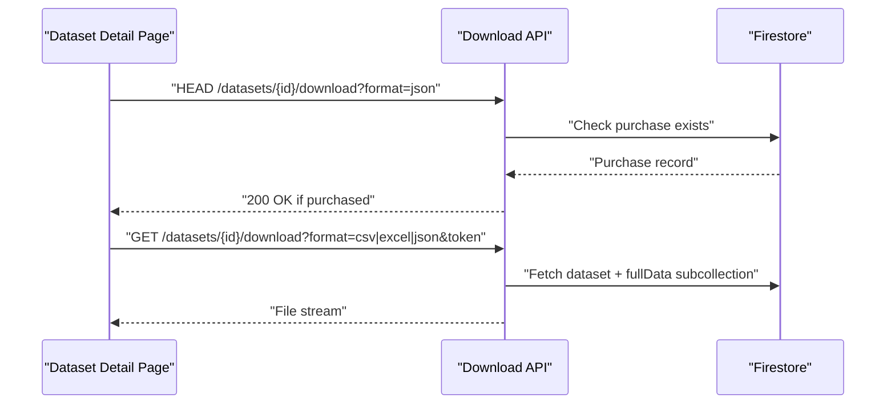

**Diagram sources**
- [src/app/datasets/[id]/page.tsx](file://src/app/datasets/[id]/page.tsx#L61-L121)
- [src/app/api/datasets/[id]/download/route.ts](file://src/app/api/datasets/[id]/download/route.ts#L8-L148)

**Section sources**
- [src/app/datasets/[id]/page.tsx](file://src/app/datasets/[id]/page.tsx#L61-L162)
- [src/app/api/datasets/[id]/download/route.ts](file://src/app/api/datasets/[id]/download/route.ts#L8-L148)

### Bulk Operations and Batch Processing
- Batch writing: Full dataset rows are written in chunks of 500 to the "fullData" subcollection using Firestore batch commits.
- Scalability: Enables handling large CSV files by avoiding single-write limits and reducing memory pressure.
- Preview generation: The API computes previewData as a slice of the first N rows for immediate display.

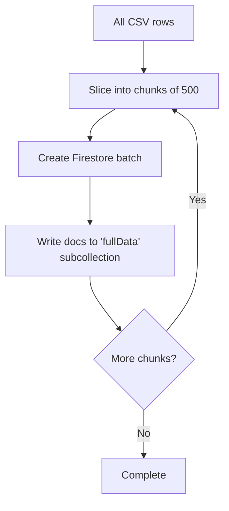

**Diagram sources**
- [src/app/api/admin/upload/route.ts:65-77](file://src/app/api/admin/upload/route.ts#L65-L77)

**Section sources**
- [src/app/api/admin/upload/route.ts:65-77](file://src/app/api/admin/upload/route.ts#L65-L77)

### Integration with Firebase
- Firestore: Stores dataset metadata in "datasets" and full data in "datasets/{id}/fullData". Also used for users, purchases, and analytics.
- Cloud Storage: File hosting is currently a placeholder; the upload API creates dataset metadata and stores data in Firestore. Cloud storage integration would be added to host the original CSV and generated downloads.
- Admin SDK: Lazily initialized with service account credentials for server-side operations.

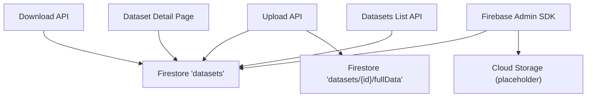

**Diagram sources**
- [src/app/api/admin/upload/route.ts:45-77](file://src/app/api/admin/upload/route.ts#L45-L77)
- [src/app/api/datasets/[id]/download/route.ts](file://src/app/api/datasets/[id]/download/route.ts#L70-L97)
- [src/lib/firebase-admin.ts:1-50](file://src/lib/firebase-admin.ts#L1-L50)

**Section sources**
- [src/lib/firebase-admin.ts:1-50](file://src/lib/firebase-admin.ts#L1-L50)
- [src/app/api/admin/upload/route.ts:45-77](file://src/app/api/admin/upload/route.ts#L45-L77)
- [src/app/api/datasets/[id]/download/route.ts](file://src/app/api/datasets/[id]/download/route.ts#L70-L97)

## Dependency Analysis
Key dependencies and relationships:
- Admin upload page depends on the auth hook and uploads to the upload API.
- Upload API depends on the auth middleware and Firebase Admin SDK.
- Dataset detail page depends on the dataset APIs and renders the preview table.
- Browse datasets page depends on the datasets list API and dataset cards.

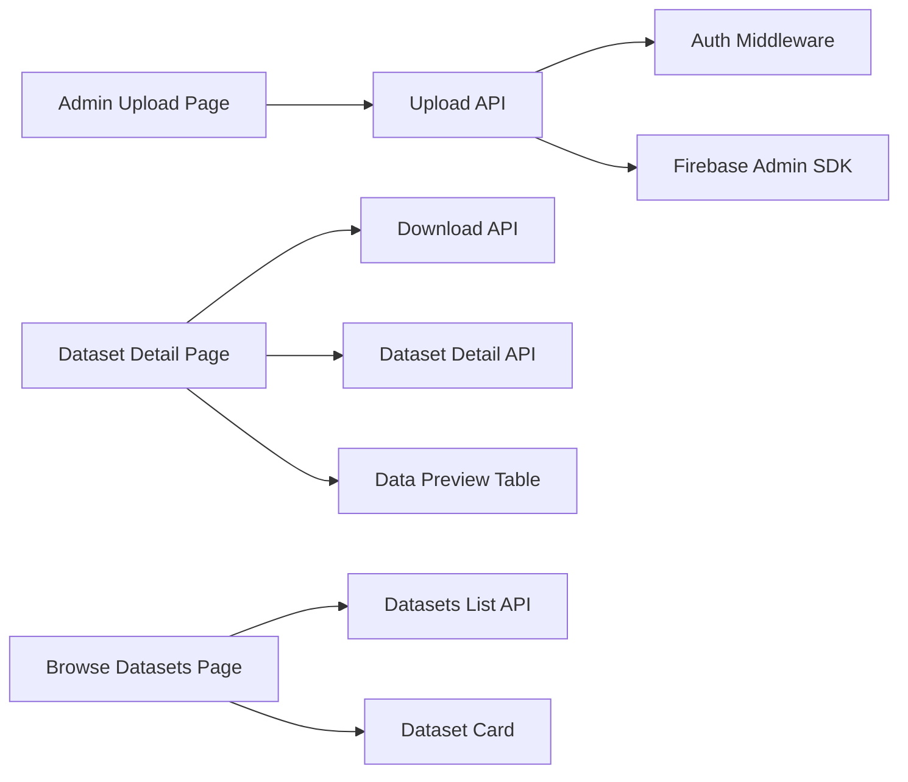

**Diagram sources**
- [src/app/admin/upload/page.tsx:22-98](file://src/app/admin/upload/page.tsx#L22-L98)
- [src/app/api/admin/upload/route.ts:6-93](file://src/app/api/admin/upload/route.ts#L6-L93)
- [src/lib/auth-middleware.ts:19-47](file://src/lib/auth-middleware.ts#L19-L47)
- [src/lib/firebase-admin.ts:1-50](file://src/lib/firebase-admin.ts#L1-L50)
- [src/app/datasets/[id]/page.tsx](file://src/app/datasets/[id]/page.tsx#L29-L382)
- [src/app/api/datasets/[id]/download/route.ts](file://src/app/api/datasets/[id]/download/route.ts#L8-L148)
- [src/app/api/datasets/[id]/route.ts](file://src/app/api/datasets/[id]/route.ts#L5-L28)
- [src/app/datasets/page.tsx:20-195](file://src/app/datasets/page.tsx#L20-L195)
- [src/app/api/datasets/route.ts:5-62](file://src/app/api/datasets/route.ts#L5-L62)
- [src/components/dataset/data-preview-table.tsx:12-76](file://src/components/dataset/data-preview-table.tsx#L12-L76)
- [src/components/dataset/dataset-card.tsx:10-81](file://src/components/dataset/dataset-card.tsx#L10-L81)

**Section sources**
- [src/app/admin/upload/page.tsx:22-98](file://src/app/admin/upload/page.tsx#L22-L98)
- [src/app/api/admin/upload/route.ts:6-93](file://src/app/api/admin/upload/route.ts#L6-L93)
- [src/app/datasets/[id]/page.tsx](file://src/app/datasets/[id]/page.tsx#L29-L382)
- [src/app/datasets/page.tsx:20-195](file://src/app/datasets/page.tsx#L20-L195)

## Performance Considerations
- Batch writes: Using Firestore batch commits reduces write latency and avoids single-request size limits when storing large datasets.
- Preview optimization: Limiting columns and rows in the preview improves rendering performance and reduces bandwidth.
- CSV parsing: Papa.parse with header:true and skipEmptyLines:true ensures clean metadata and minimal downstream processing.
- Client-side pagination: The browse page supports filtering and limits to reduce initial payload sizes.

[No sources needed since this section provides general guidance]

## Troubleshooting Guide
Common issues and resolutions:
- Authentication errors: Ensure the user is signed in and has a valid ID token; admin role is required for upload operations.
- CSV parsing errors: Validate CSV syntax and headers; the API returns parsing errors if present.
- Missing required fields: The upload form requires a CSV file, title, category, country, and price; missing fields trigger client-side and server-side validation errors.
- Purchase verification failures: The download endpoint checks purchase existence and optional token validity; unauthorized or expired tokens cause 403 responses.
- System failures: The APIs return 500 on internal errors; check server logs for detailed error messages.

**Section sources**
- [src/app/admin/upload/page.tsx:47-98](file://src/app/admin/upload/page.tsx#L47-L98)
- [src/app/api/admin/upload/route.ts:23-39](file://src/app/api/admin/upload/route.ts#L23-L39)
- [src/app/api/datasets/[id]/download/route.ts](file://src/app/api/datasets/[id]/download/route.ts#L31-L68)

## Conclusion
The Datafrica dataset management interface provides a robust upload pipeline with strong admin-only access controls, comprehensive CSV validation, efficient batch storage, and a preview mechanism. Integration with Firebase enables scalable metadata and data storage, while the download system secures access and supports multiple export formats. Future enhancements could include Cloud Storage integration for file hosting and expanded format support.