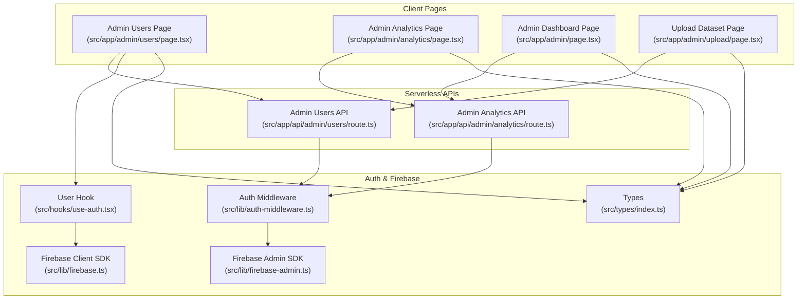
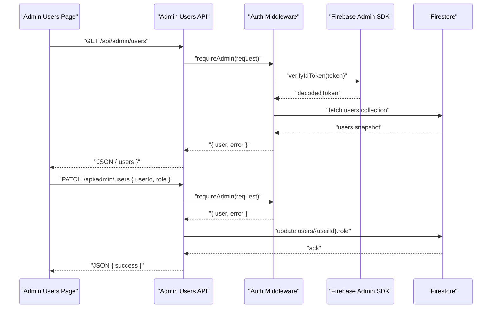
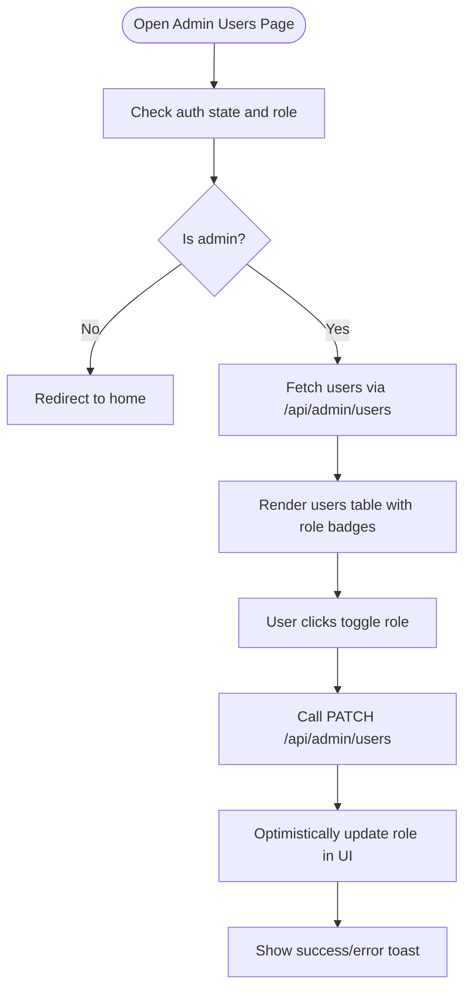
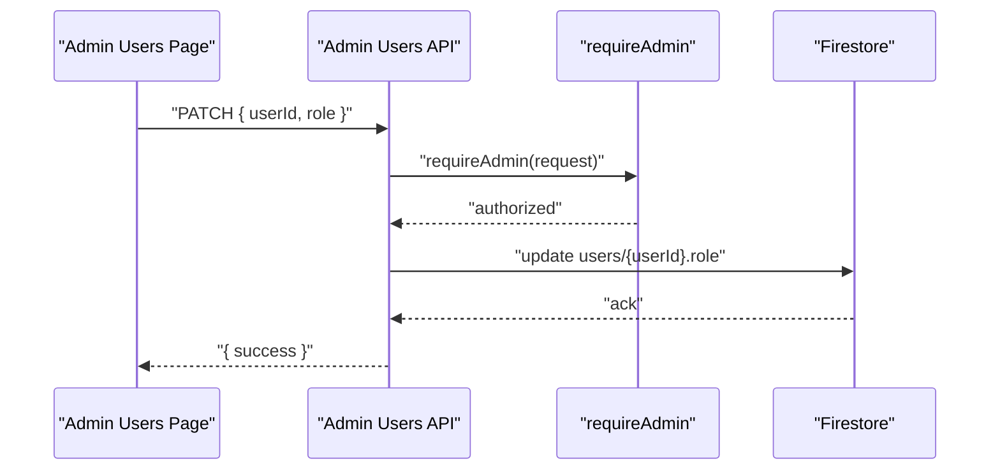
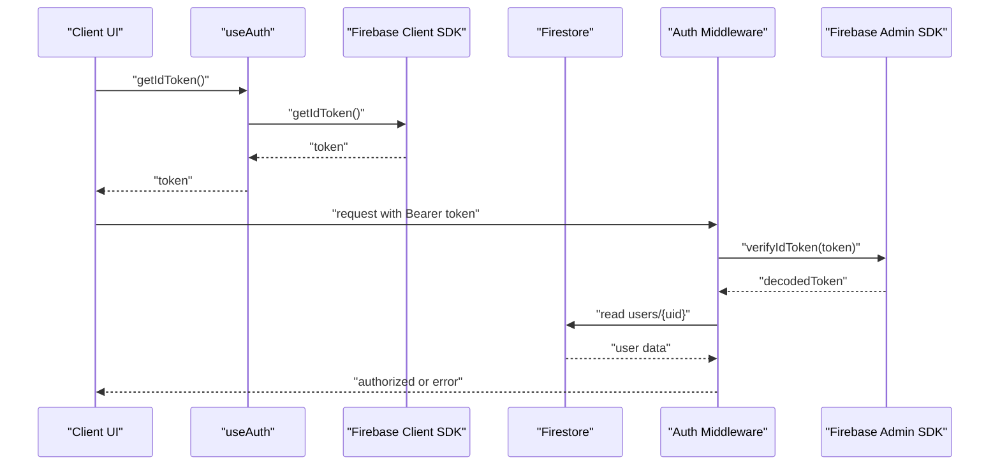
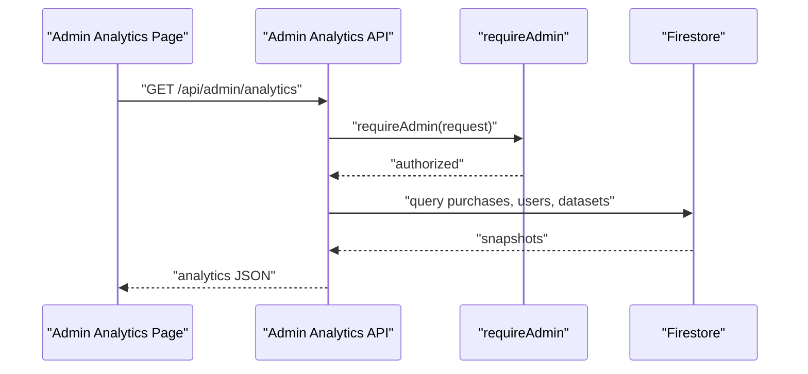
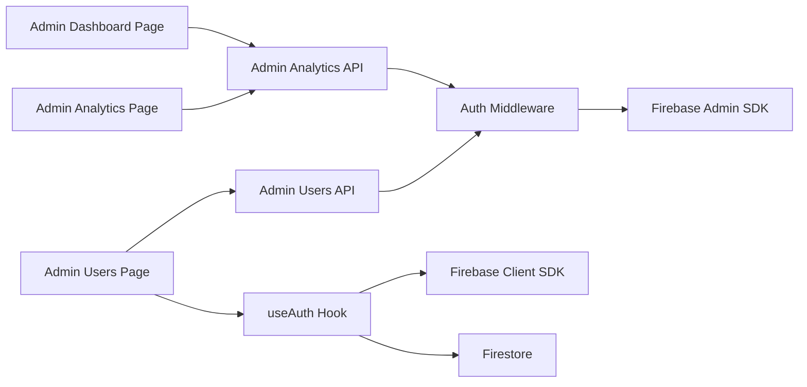

# User Administration System

<cite>
**Referenced Files in This Document**
- [src/app/admin/users/page.tsx](file://src/app/admin/users/page.tsx)
- [src/app/api/admin/users/route.ts](file://src/app/api/admin/users/route.ts)
- [src/lib/auth-middleware.ts](file://src/lib/auth-middleware.ts)
- [src/lib/firebase-admin.ts](file://src/lib/firebase-admin.ts)
- [src/lib/firebase.ts](file://src/lib/firebase.ts)
- [src/hooks/use-auth.tsx](file://src/hooks/use-auth.tsx)
- [src/types/index.ts](file://src/types/index.ts)
- [src/app/admin/analytics/page.tsx](file://src/app/admin/analytics/page.tsx)
- [src/app/api/admin/analytics/route.ts](file://src/app/api/admin/analytics/route.ts)
- [src/app/admin/page.tsx](file://src/app/admin/page.tsx)
- [src/app/admin/upload/page.tsx](file://src/app/admin/upload/page.tsx)
- [src/app/api/user/purchases/route.ts](file://src/app/api/user/purchases/route.ts)
</cite>

## Table of Contents
1. [Introduction](#introduction)
2. [Project Structure](#project-structure)
3. [Core Components](#core-components)
4. [Architecture Overview](#architecture-overview)
5. [Detailed Component Analysis](#detailed-component-analysis)
6. [Dependency Analysis](#dependency-analysis)
7. [Performance Considerations](#performance-considerations)
8. [Troubleshooting Guide](#troubleshooting-guide)
9. [Conclusion](#conclusion)
10. [Appendices](#appendices)

## Introduction
This document describes the Datafrica user administration system with a focus on user management, roles, and administrative capabilities. It explains how administrators can view, search, and filter user accounts, manage user roles, monitor user activity, and integrate with Firebase Authentication and Firestore. It also outlines current limitations and provides guidance for extending the system to support advanced search and bulk operations while maintaining compliance with data protection principles.

## Project Structure
The user administration system spans client-side pages, serverless API routes, shared authentication middleware, and Firebase integrations:
- Client pages under src/app/admin handle user listing, analytics, uploads, and admin dashboard navigation.
- Serverless API routes under src/app/api/admin implement admin-only endpoints for users and analytics.
- Shared authentication middleware enforces admin privileges and validates Firebase ID tokens.
- Firebase integrations provide client and server access to Firestore and Authentication.

**Diagram sources**
- [src/app/admin/users/page.tsx:1-178](file://src/app/admin/users/page.tsx#L1-L178)
- [src/app/api/admin/users/route.ts:1-54](file://src/app/api/admin/users/route.ts#L1-L54)
- [src/app/admin/analytics/page.tsx:1-228](file://src/app/admin/analytics/page.tsx#L1-L228)
- [src/app/api/admin/analytics/route.ts:1-78](file://src/app/api/admin/analytics/route.ts#L1-L78)
- [src/app/admin/page.tsx:1-242](file://src/app/admin/page.tsx#L1-L242)
- [src/app/admin/upload/page.tsx:1-295](file://src/app/admin/upload/page.tsx#L1-L295)
- [src/lib/auth-middleware.ts:1-48](file://src/lib/auth-middleware.ts#L1-L48)
- [src/lib/firebase-admin.ts:1-50](file://src/lib/firebase-admin.ts#L1-L50)
- [src/lib/firebase.ts:1-22](file://src/lib/firebase.ts#L1-L22)
- [src/hooks/use-auth.tsx:1-117](file://src/hooks/use-auth.tsx#L1-L117)
- [src/types/index.ts:1-90](file://src/types/index.ts#L1-L90)

**Section sources**
- [src/app/admin/users/page.tsx:1-178](file://src/app/admin/users/page.tsx#L1-L178)
- [src/app/api/admin/users/route.ts:1-54](file://src/app/api/admin/users/route.ts#L1-L54)
- [src/lib/auth-middleware.ts:1-48](file://src/lib/auth-middleware.ts#L1-L48)
- [src/lib/firebase-admin.ts:1-50](file://src/lib/firebase-admin.ts#L1-L50)
- [src/lib/firebase.ts:1-22](file://src/lib/firebase.ts#L1-L22)
- [src/hooks/use-auth.tsx:1-117](file://src/hooks/use-auth.tsx#L1-L117)
- [src/types/index.ts:1-90](file://src/types/index.ts#L1-L90)

## Core Components
- Admin Users Management Page: Lists users, displays role badges, and toggles admin privileges via a single action button per row.
- Admin Users API: Provides listing and role update endpoints guarded by admin middleware.
- Authentication and Authorization: Client hook manages Firebase Auth state and Firestore user profiles; server middleware verifies ID tokens and checks admin role stored in Firestore.
- Analytics Dashboard: Presents aggregated metrics and top datasets for admin review.
- Types: Defines the User interface and other domain types used across the system.

Key capabilities documented:
- View and filter users by role (admin vs user) in the UI.
- Toggle a user’s role between admin and user.
- Access analytics and recent sales data for admin oversight.
- Integration with Firebase Authentication and Firestore for credentials and user profiles.

Limitations:
- No server-side search/filter by email, registration date, or account status.
- No bulk user operations for mass updates or account management.
- No explicit user account deactivation or deletion endpoints in the analyzed code.

**Section sources**
- [src/app/admin/users/page.tsx:30-178](file://src/app/admin/users/page.tsx#L30-L178)
- [src/app/api/admin/users/route.ts:5-54](file://src/app/api/admin/users/route.ts#L5-L54)
- [src/lib/auth-middleware.ts:19-47](file://src/lib/auth-middleware.ts#L19-L47)
- [src/lib/firebase-admin.ts:30-49](file://src/lib/firebase-admin.ts#L30-L49)
- [src/lib/firebase.ts:1-22](file://src/lib/firebase.ts#L1-L22)
- [src/hooks/use-auth.tsx:34-108](file://src/hooks/use-auth.tsx#L34-L108)
- [src/types/index.ts:3-9](file://src/types/index.ts#L3-L9)
- [src/app/admin/analytics/page.tsx:38-228](file://src/app/admin/analytics/page.tsx#L38-L228)
- [src/app/api/admin/analytics/route.ts:5-78](file://src/app/api/admin/analytics/route.ts#L5-L78)

## Architecture Overview
The system follows a client-server pattern:
- Client pages use a Firebase client SDK to manage authentication state and a custom hook to hydrate user profiles from Firestore.
- Admin actions call serverless API routes protected by middleware that verifies the caller’s Firebase ID token and checks the admin role in Firestore.
- The serverless routes interact with Firestore using the Firebase Admin SDK to read/write user data and analytics.

**Diagram sources**
- [src/app/admin/users/page.tsx:42-92](file://src/app/admin/users/page.tsx#L42-L92)
- [src/app/api/admin/users/route.ts:5-54](file://src/app/api/admin/users/route.ts#L5-L54)
- [src/lib/auth-middleware.ts:19-47](file://src/lib/auth-middleware.ts#L19-L47)
- [src/lib/firebase-admin.ts:30-49](file://src/lib/firebase-admin.ts#L30-L49)

## Detailed Component Analysis

### Admin Users Management Page
Responsibilities:
- Enforce admin-only access by redirecting unauthorized users.
- Fetch users from the serverless API and render a table with role badges.
- Toggle a user’s role with a single click and prevent self-degradation.

Implementation highlights:
- Uses a custom hook to obtain the current user and ID token.
- Calls the admin users API with an Authorization header containing a Firebase ID token.
- Updates the UI optimistically after a successful role change.

**Diagram sources**
- [src/app/admin/users/page.tsx:30-92](file://src/app/admin/users/page.tsx#L30-L92)

**Section sources**
- [src/app/admin/users/page.tsx:30-178](file://src/app/admin/users/page.tsx#L30-L178)

### Admin Users API
Endpoints:
- GET /api/admin/users: Returns the list of users ordered by creation date.
- PATCH /api/admin/users: Updates a user’s role to admin or user.

Validation and security:
- Requires admin middleware to verify ID token and admin role.
- Validates payload for role updates and restricts accepted roles.

**Diagram sources**
- [src/app/api/admin/users/route.ts:31-53](file://src/app/api/admin/users/route.ts#L31-L53)
- [src/lib/auth-middleware.ts:30-47](file://src/lib/auth-middleware.ts#L30-L47)

**Section sources**
- [src/app/api/admin/users/route.ts:5-54](file://src/app/api/admin/users/route.ts#L5-L54)

### Authentication and Authorization
- Client hook:
  - Subscribes to Firebase Auth state.
  - Loads or creates a Firestore user profile with role and timestamps.
  - Exposes getIdToken for protected API calls.
- Server middleware:
  - Verifies Authorization: Bearer tokens.
  - Confirms admin role by reading the user document from Firestore.

**Diagram sources**
- [src/hooks/use-auth.tsx:34-108](file://src/hooks/use-auth.tsx#L34-L108)
- [src/lib/firebase.ts:1-22](file://src/lib/firebase.ts#L1-L22)
- [src/lib/auth-middleware.ts:4-47](file://src/lib/auth-middleware.ts#L4-L47)
- [src/lib/firebase-admin.ts:30-49](file://src/lib/firebase-admin.ts#L30-L49)

**Section sources**
- [src/hooks/use-auth.tsx:1-117](file://src/hooks/use-auth.tsx#L1-L117)
- [src/lib/auth-middleware.ts:1-48](file://src/lib/auth-middleware.ts#L1-L48)
- [src/lib/firebase-admin.ts:1-50](file://src/lib/firebase-admin.ts#L1-L50)
- [src/lib/firebase.ts:1-22](file://src/lib/firebase.ts#L1-L22)

### Analytics Dashboard and Related API
- Admin Analytics Page: Displays total revenue, total sales, total users, total datasets, recent sales, and top datasets.
- Admin Analytics API: Aggregates data from Firestore collections and returns computed metrics.

**Diagram sources**
- [src/app/admin/analytics/page.tsx:50-72](file://src/app/admin/analytics/page.tsx#L50-L72)
- [src/app/api/admin/analytics/route.ts:5-78](file://src/app/api/admin/analytics/route.ts#L5-L78)
- [src/lib/auth-middleware.ts:30-47](file://src/lib/auth-middleware.ts#L30-L47)

**Section sources**
- [src/app/admin/analytics/page.tsx:1-228](file://src/app/admin/analytics/page.tsx#L1-L228)
- [src/app/api/admin/analytics/route.ts:1-78](file://src/app/api/admin/analytics/route.ts#L1-L78)

### Admin Dashboard Overview
- Provides quick links to upload datasets, manage users, and view analytics.
- Pre-renders skeletons during initial load and fetches analytics for summary cards.

**Section sources**
- [src/app/admin/page.tsx:38-242](file://src/app/admin/page.tsx#L38-L242)

### Upload Dataset Page
- Admin-only form to upload datasets with metadata and CSV file.
- Submits to a serverless upload endpoint secured by admin middleware.

**Section sources**
- [src/app/admin/upload/page.tsx:22-295](file://src/app/admin/upload/page.tsx#L22-L295)

### User Purchases API (for reference)
- Current user’s purchase history retrieval endpoint for personal use.

**Section sources**
- [src/app/api/user/purchases/route.ts:5-31](file://src/app/api/user/purchases/route.ts#L5-L31)

## Dependency Analysis
- Client-to-Server:
  - Admin Users Page depends on Admin Users API.
  - Admin Analytics Page depends on Admin Analytics API.
  - Admin Dashboard Page depends on Admin Analytics API for summary cards.
- Server-to-Auth/Firestore:
  - Admin APIs depend on Auth Middleware for admin verification.
  - Auth Middleware depends on Firebase Admin SDK for token verification and Firestore reads.
- Client-to-Firestore:
  - useAuth hook depends on Firebase Client SDK and Firestore to hydrate user profiles.

**Diagram sources**
- [src/app/admin/users/page.tsx:30-92](file://src/app/admin/users/page.tsx#L30-L92)
- [src/app/api/admin/users/route.ts:5-54](file://src/app/api/admin/users/route.ts#L5-L54)
- [src/app/admin/analytics/page.tsx:50-72](file://src/app/admin/analytics/page.tsx#L50-L72)
- [src/app/api/admin/analytics/route.ts:5-78](file://src/app/api/admin/analytics/route.ts#L5-L78)
- [src/app/admin/page.tsx:50-72](file://src/app/admin/page.tsx#L50-L72)
- [src/lib/auth-middleware.ts:19-47](file://src/lib/auth-middleware.ts#L19-L47)
- [src/lib/firebase-admin.ts:30-49](file://src/lib/firebase-admin.ts#L30-L49)
- [src/hooks/use-auth.tsx:34-108](file://src/hooks/use-auth.tsx#L34-L108)
- [src/lib/firebase.ts:1-22](file://src/lib/firebase.ts#L1-L22)

**Section sources**
- [src/app/admin/users/page.tsx:30-92](file://src/app/admin/users/page.tsx#L30-L92)
- [src/app/api/admin/users/route.ts:5-54](file://src/app/api/admin/users/route.ts#L5-L54)
- [src/app/admin/analytics/page.tsx:50-72](file://src/app/admin/analytics/page.tsx#L50-L72)
- [src/app/api/admin/analytics/route.ts:5-78](file://src/app/api/admin/analytics/route.ts#L5-L78)
- [src/app/admin/page.tsx:50-72](file://src/app/admin/page.tsx#L50-L72)
- [src/lib/auth-middleware.ts:1-48](file://src/lib/auth-middleware.ts#L1-L48)
- [src/lib/firebase-admin.ts:1-50](file://src/lib/firebase-admin.ts#L1-L50)
- [src/hooks/use-auth.tsx:1-117](file://src/hooks/use-auth.tsx#L1-L117)
- [src/lib/firebase.ts:1-22](file://src/lib/firebase.ts#L1-L22)

## Performance Considerations
- Client-side rendering: The users page renders a skeleton loader while fetching data, improving perceived performance.
- Firestore queries: The users listing orders by creation date; consider adding pagination or indexing for large datasets.
- Token verification: Serverless functions verify ID tokens on each request; caching tokens client-side reduces redundant calls.
- Analytics aggregation: Aggregation queries run on the server; ensure Firestore indexes exist for filtered fields to avoid expensive scans.

[No sources needed since this section provides general guidance]

## Troubleshooting Guide
Common issues and resolutions:
- Unauthorized access attempts:
  - Symptom: Requests return 401 or 403.
  - Cause: Missing or invalid Authorization header or non-admin role.
  - Resolution: Ensure the client obtains a valid ID token and the user role is stored as admin in Firestore.
- Role toggle failures:
  - Symptom: UI shows an error toast after clicking toggle.
  - Cause: Network errors or server-side validation failure.
  - Resolution: Verify the payload includes a valid userId and role, and the server logs indicate the error cause.
- Analytics not loading:
  - Symptom: Empty cards or skeleton loaders remain indefinitely.
  - Cause: Missing or empty Firestore data for purchases, users, or datasets.
  - Resolution: Confirm Firestore documents exist and the serverless function executes without exceptions.

**Section sources**
- [src/app/admin/users/page.tsx:48-92](file://src/app/admin/users/page.tsx#L48-L92)
- [src/app/api/admin/users/route.ts:32-53](file://src/app/api/admin/users/route.ts#L32-L53)
- [src/lib/auth-middleware.ts:19-47](file://src/lib/auth-middleware.ts#L19-L47)
- [src/app/admin/analytics/page.tsx:56-72](file://src/app/admin/analytics/page.tsx#L56-L72)

## Conclusion
The Datafrica user administration system provides a solid foundation for viewing and managing users, enforcing admin-only access, and integrating with Firebase Authentication and Firestore. Administrators can list users, toggle roles, and monitor sales analytics. To meet advanced requirements such as robust search and filtering, bulk operations, and enhanced user activity insights, consider extending the serverless APIs with indexed queries, batch mutation endpoints, and expanded analytics computations.

[No sources needed since this section summarizes without analyzing specific files]

## Appendices

### User Roles and Access Levels
- Role classification:
  - user: Standard user with basic access.
  - admin: Administrator with elevated permissions to manage users and view analytics.
- Access enforcement:
  - Admin-only pages redirect unauthorized users.
  - Admin APIs require a verified admin role stored in Firestore.

**Section sources**
- [src/types/index.ts:3-9](file://src/types/index.ts#L3-L9)
- [src/app/admin/users/page.tsx:36-40](file://src/app/admin/users/page.tsx#L36-L40)
- [src/lib/auth-middleware.ts:30-47](file://src/lib/auth-middleware.ts#L30-L47)

### User Activity Monitoring
- Current capabilities:
  - Admins can view sales analytics and recent purchases via dedicated pages and APIs.
- Future enhancements:
  - Add purchase history and dataset download access logs to the admin UI.
  - Introduce engagement metrics such as dataset views or downloads per user.

**Section sources**
- [src/app/admin/analytics/page.tsx:38-228](file://src/app/admin/analytics/page.tsx#L38-L228)
- [src/app/api/admin/analytics/route.ts:5-78](file://src/app/api/admin/analytics/route.ts#L5-L78)
- [src/app/api/user/purchases/route.ts:5-31](file://src/app/api/user/purchases/route.ts#L5-L31)

### Search and Filtering Criteria
- Supported criteria in the current implementation:
  - Role-based visibility in the UI (admin vs user).
- Missing criteria:
  - Email search, registration date range, and account status filters are not implemented in the analyzed code.

**Section sources**
- [src/app/admin/users/page.tsx:118-170](file://src/app/admin/users/page.tsx#L118-L170)
- [src/app/api/admin/users/route.ts:11-19](file://src/app/api/admin/users/route.ts#L11-L19)

### Bulk Operations
- Current state:
  - No bulk user update or deletion endpoints are present in the analyzed code.
- Recommended extensions:
  - Add batch mutation endpoints for role updates, status changes, and deletions.
  - Implement server-side validation and audit logging for bulk actions.

**Section sources**
- [src/app/api/admin/users/route.ts:31-53](file://src/app/api/admin/users/route.ts#L31-L53)

### Data Privacy and Compliance Considerations
- Data minimization:
  - Only collect and store necessary user attributes (e.g., uid, email, role, createdAt).
- Access controls:
  - Enforce admin-only access to user management and analytics.
- Consent and transparency:
  - Provide clear privacy notices and user rights disclosures.
- Data retention and deletion:
  - Implement lawful data retention periods and user-requested deletion mechanisms.
- Security:
  - Use HTTPS, secure token handling, and least-privilege access to Firestore.

[No sources needed since this section provides general guidance]