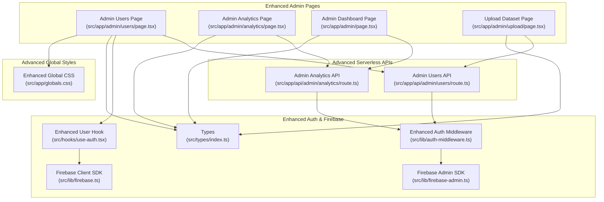
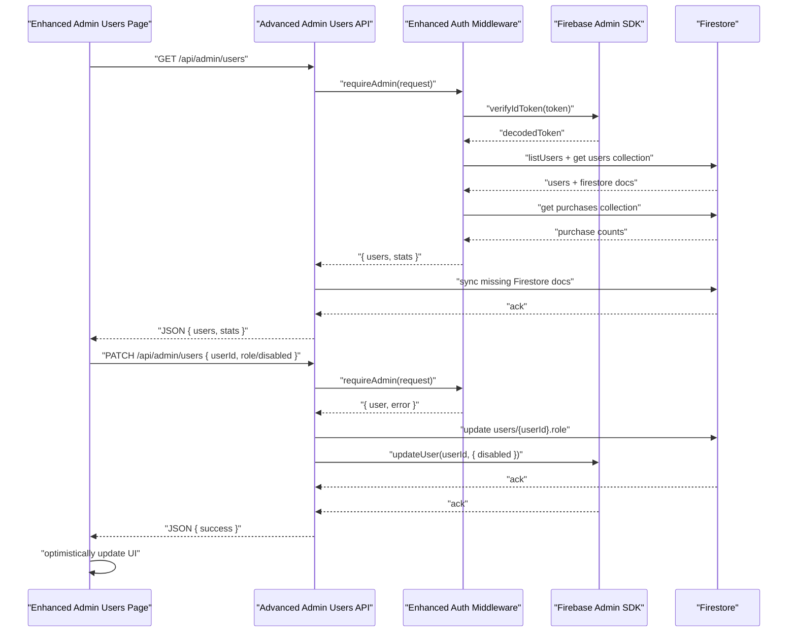
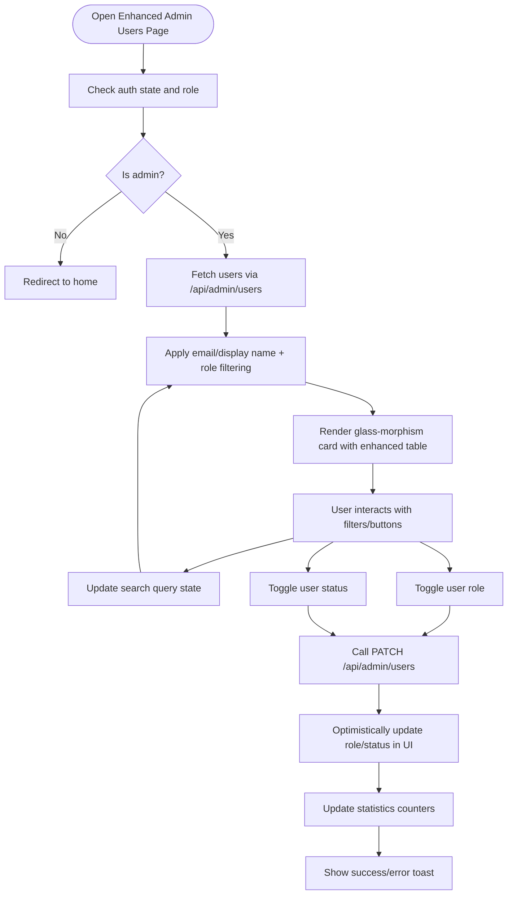
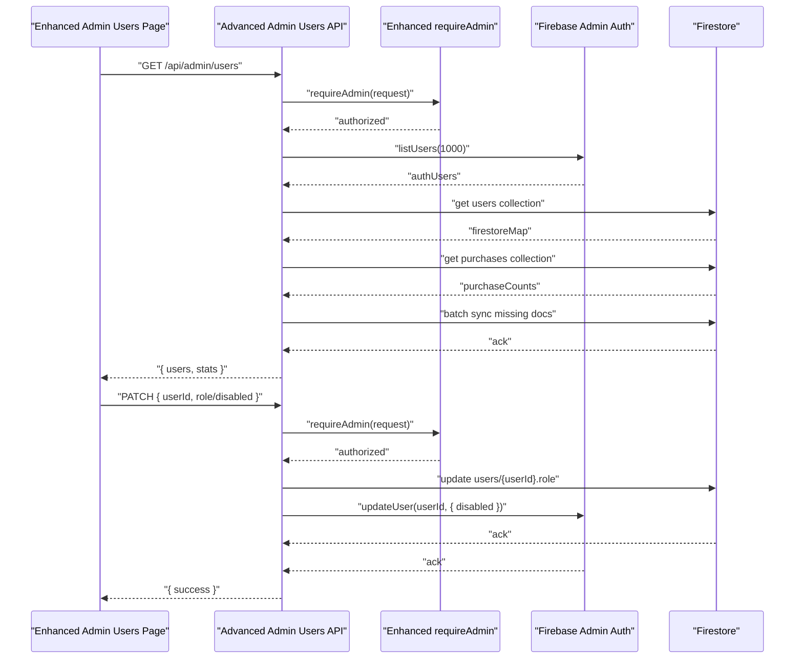
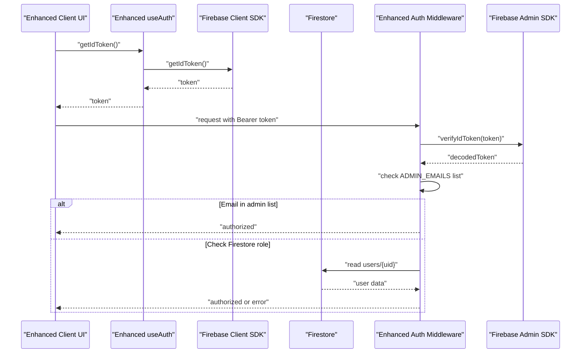
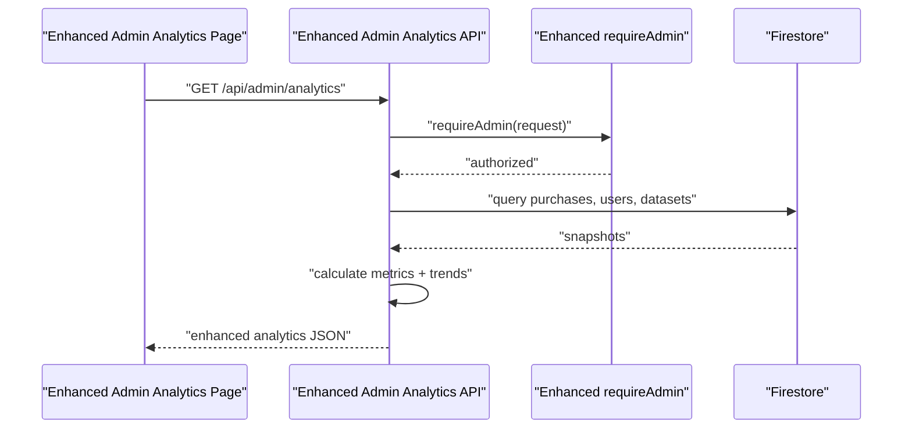

# User Administration System

<cite>
**Referenced Files in This Document**
- [src/app/admin/users/page.tsx](file://src/app/admin/users/page.tsx)
- [src/app/api/admin/users/route.ts](file://src/app/api/admin/users/route.ts)
- [src/lib/auth-middleware.ts](file://src/lib/auth-middleware.ts)
- [src/lib/firebase-admin.ts](file://src/lib/firebase-admin.ts)
- [src/lib/firebase.ts](file://src/lib/firebase.ts)
- [src/hooks/use-auth.tsx](file://src/hooks/use-auth.tsx)
- [src/types/index.ts](file://src/types/index.ts)
- [src/app/admin/analytics/page.tsx](file://src/app/admin/analytics/page.tsx)
- [src/app/api/admin/analytics/route.ts](file://src/app/api/admin/analytics/route.ts)
- [src/app/admin/page.tsx](file://src/app/admin/page.tsx)
- [src/app/admin/upload/page.tsx](file://src/app/admin/upload/page.tsx)
- [src/app/api/user/purchases/route.ts](file://src/app/api/user/purchases/route.ts)
- [src/app/globals.css](file://src/app/globals.css)
- [src/components/ui/table.tsx](file://src/components/ui/table.tsx)
- [src/components/ui/badge.tsx](file://src/components/ui/badge.tsx)
- [src/components/ui/button.tsx](file://src/components/ui/button.tsx)
- [src/components/ui/input.tsx](file://src/components/ui/input.tsx)
- [src/components/ui/skeleton.tsx](file://src/components/ui/skeleton.tsx)
</cite>

## Update Summary
**Changes Made**
- Enhanced user management interface with comprehensive filtering capabilities including email and display name search
- Added real-time role management with instant UI updates and visual feedback
- Implemented user status controls with enable/disable functionality and visual indicators
- Integrated purchase history tracking with purchase count display for each user
- Improved user data synchronization with automatic Firestore document creation
- Added comprehensive statistics dashboard showing total users, admin count, and disabled user count
- Enhanced visual design system with glass-morphism cards and improved table styling
- Expanded role indicator badges with provider-specific styling and icons

## Table of Contents
1. [Introduction](#introduction)
2. [Project Structure](#project-structure)
3. [Core Components](#core-components)
4. [Architecture Overview](#architecture-overview)
5. [Detailed Component Analysis](#detailed-component-analysis)
6. [Advanced User Management Features](#advanced-user-management-features)
7. [Visual Design Enhancements](#visual-design-enhancements)
8. [User Data Synchronization](#user-data-synchronization)
9. [Security and Access Control](#security-and-access-control)
10. [Performance Considerations](#performance-considerations)
11. [Troubleshooting Guide](#troubleshooting-guide)
12. [Conclusion](#conclusion)
13. [Appendices](#appendices)

## Introduction
This document describes the enhanced Datafrica user administration system with comprehensive user management capabilities, advanced filtering, real-time role management, and user status controls. The system features a sophisticated glass-morphism design interface, advanced user search and filtering, real-time role updates, user status management, purchase history integration, and improved user data synchronization. It explains how administrators can view, search, filter, and manage user accounts with enhanced capabilities, monitor user activity through purchase history, and integrate seamlessly with Firebase Authentication and Firestore for credentials and user profiles.

## Project Structure
The enhanced user administration system spans client-side pages, serverless API routes, shared authentication middleware, and Firebase integrations with comprehensive user management capabilities:
- Client pages under src/app/admin provide comprehensive user management, analytics, uploads, and admin dashboard navigation with advanced filtering and real-time updates.
- Serverless API routes under src/app/api/admin implement admin-only endpoints for users with advanced filtering, role management, and status control.
- Shared authentication middleware enforces admin privileges and validates Firebase ID tokens with dual-check authentication (email list and Firestore roles).
- Firebase integrations provide client and server access to Firestore and Authentication with enhanced user data synchronization.
- Global CSS styles define the sophisticated glass-morphism design system and visual enhancements across all admin interfaces.

**Diagram sources**
- [src/app/admin/users/page.tsx:1-376](file://src/app/admin/users/page.tsx#L1-L376)
- [src/app/api/admin/users/route.ts:1-153](file://src/app/api/admin/users/route.ts#L1-L153)
- [src/lib/auth-middleware.ts:1-62](file://src/lib/auth-middleware.ts#L1-L62)
- [src/lib/firebase-admin.ts:1-64](file://src/lib/firebase-admin.ts#L1-L64)
- [src/lib/firebase.ts:1-22](file://src/lib/firebase.ts#L1-L22)
- [src/hooks/use-auth.tsx:1-193](file://src/hooks/use-auth.tsx#L1-L193)
- [src/types/index.ts:1-113](file://src/types/index.ts#L1-L113)
- [src/app/globals.css:128-144](file://src/app/globals.css#L128-L144)

**Section sources**
- [src/app/admin/users/page.tsx:1-376](file://src/app/admin/users/page.tsx#L1-L376)
- [src/app/api/admin/users/route.ts:1-153](file://src/app/api/admin/users/route.ts#L1-L153)
- [src/lib/auth-middleware.ts:1-62](file://src/lib/auth-middleware.ts#L1-L62)
- [src/lib/firebase-admin.ts:1-64](file://src/lib/firebase-admin.ts#L1-L64)
- [src/lib/firebase.ts:1-22](file://src/lib/firebase.ts#L1-L22)
- [src/hooks/use-auth.tsx:1-193](file://src/hooks/use-auth.tsx#L1-L193)
- [src/types/index.ts:1-113](file://src/types/index.ts#L1-L113)
- [src/app/globals.css:128-144](file://src/app/globals.css#L128-L144)

## Core Components
- **Enhanced Admin Users Management Page**: Features comprehensive filtering by email and display name, real-time role management with instant UI updates, user status controls with enable/disable functionality, purchase history integration, and sophisticated glass-morphism design with enhanced visual indicators.
- **Advanced Admin Users API**: Provides comprehensive user listing with purchase counts, real-time role updates, user status management, and automatic user data synchronization with Firestore.
- **Enhanced Authentication and Authorization**: Client hook manages Firebase Auth state with enhanced admin detection and Firestore user profiles; server middleware verifies ID tokens with dual-check authentication (email list and Firestore roles) and enforces admin privileges.
- **Comprehensive Analytics Dashboard**: Presents aggregated metrics, purchase history, user growth trends, and top datasets for admin oversight with consistent glass-morphism design.
- **Advanced Types**: Defines comprehensive User interface with role, provider, purchase count, and timestamp fields used across the enhanced system.

Key capabilities documented:
- Advanced filtering by email and display name with real-time search functionality.
- Real-time role toggling between admin and user with immediate UI updates and visual feedback.
- User status management with enable/disable functionality and visual indicators.
- Purchase history integration showing purchase counts for each user.
- Enhanced statistics dashboard with total users, admin count, and disabled user count.
- Automatic user data synchronization with Firestore document creation.
- Comprehensive provider information display (Google vs email authentication).
- Integration with Firebase Authentication and Firestore for credentials and user profiles.
- Sophisticated glass-morphism design system providing depth and visual sophistication.

**Updated** Enhanced with comprehensive filtering, real-time role management, user status controls, purchase history integration, and improved user data synchronization.

**Section sources**
- [src/app/admin/users/page.tsx:32-191](file://src/app/admin/users/page.tsx#L32-L191)
- [src/app/api/admin/users/route.ts:5-153](file://src/app/api/admin/users/route.ts#L5-L153)
- [src/lib/auth-middleware.ts:35-61](file://src/lib/auth-middleware.ts#L35-L61)
- [src/lib/firebase-admin.ts:44-63](file://src/lib/firebase-admin.ts#L44-L63)
- [src/lib/firebase.ts:1-22](file://src/lib/firebase.ts#L1-L22)
- [src/hooks/use-auth.tsx:31-193](file://src/hooks/use-auth.tsx#L31-L193)
- [src/types/index.ts:3-9](file://src/types/index.ts#L3-L9)
- [src/app/admin/analytics/page.tsx:38-228](file://src/app/admin/analytics/page.tsx#L38-L228)
- [src/app/api/admin/analytics/route.ts:5-227](file://src/app/api/admin/analytics/route.ts#L5-L227)

## Architecture Overview
The enhanced system follows a sophisticated client-server pattern with comprehensive user management capabilities:
- Client pages use a Firebase client SDK to manage authentication state and a custom hook to hydrate user profiles from Firestore with enhanced admin detection.
- Admin actions call serverless API routes protected by middleware that verifies the caller's Firebase ID token and checks admin role through dual authentication (email list and Firestore).
- The serverless routes interact with Firestore using the Firebase Admin SDK to read/write user data, manage roles, control user status, and synchronize user information.
- Global CSS defines a sophisticated glass-morphism design system across all admin interfaces with theme-aware styling.
- Advanced filtering and real-time updates are implemented through client-side state management and optimistic UI updates.

**Diagram sources**
- [src/app/admin/users/page.tsx:53-139](file://src/app/admin/users/page.tsx#L53-L139)
- [src/app/api/admin/users/route.ts:6-152](file://src/app/api/admin/users/route.ts#L6-L152)
- [src/lib/auth-middleware.ts:35-61](file://src/lib/auth-middleware.ts#L35-L61)
- [src/lib/firebase-admin.ts:44-63](file://src/lib/firebase-admin.ts#L44-L63)

## Detailed Component Analysis

### Enhanced Admin Users Management Page
**Updated** The user management page now features comprehensive filtering, real-time role management, user status controls, and purchase history integration with sophisticated glass-morphism design.

Responsibilities:
- Enforce admin-only access by redirecting unauthorized users.
- Fetch users from the serverless API with purchase counts and real-time statistics.
- Implement comprehensive filtering by email and display name with role-based filtering.
- Toggle user roles with real-time UI updates and visual feedback.
- Manage user status with enable/disable functionality and visual indicators.
- Display purchase history and provider information for each user.

Implementation highlights:
- Uses a custom hook to obtain the current user and ID token with enhanced admin detection.
- Calls the admin users API with an Authorization header containing a Firebase ID token.
- Implements sophisticated filtering with search query and role filter state management.
- Renders users in glass-morphism cards with backdrop blur and enhanced visual styling.
- Provides real-time role toggling with optimistic UI updates and statistics adjustment.
- Implements user status management with visual indicators and immediate UI feedback.
- Integrates purchase history display and provider information (Google vs email).
- Features comprehensive statistics dashboard showing total users, admin count, and disabled user count.

**Diagram sources**
- [src/app/admin/users/page.tsx:44-139](file://src/app/admin/users/page.tsx#L44-L139)

**Section sources**
- [src/app/admin/users/page.tsx:44-376](file://src/app/admin/users/page.tsx#L44-L376)

### Advanced Admin Users API
**Updated** The users API now provides comprehensive user management with purchase history integration, real-time statistics, and automatic user data synchronization.

Endpoints:
- GET /api/admin/users: Returns comprehensive user list with purchase counts, role information, provider details, and real-time statistics (total, admin count, disabled count).
- PATCH /api/admin/users: Updates user roles or status with validation and immediate response.

Enhanced functionality:
- Retrieves user data from Firebase Authentication as the source of truth.
- Merges with Firestore user documents for role and metadata information.
- Calculates purchase counts per user from the purchases collection.
- Synchronizes missing Firestore documents automatically with batch operations.
- Provides comprehensive statistics for the admin dashboard.
- Supports both role updates and user status (enable/disable) in a single endpoint.

**Diagram sources**
- [src/app/api/admin/users/route.ts:6-152](file://src/app/api/admin/users/route.ts#L6-L152)
- [src/lib/auth-middleware.ts:35-61](file://src/lib/auth-middleware.ts#L35-L61)

**Section sources**
- [src/app/api/admin/users/route.ts:5-153](file://src/app/api/admin/users/route.ts#L5-L153)

### Enhanced Authentication and Authorization
**Updated** The authentication system now features dual-check admin verification and enhanced user profile management.

- Enhanced client hook:
  - Subscribes to Firebase Auth state with comprehensive error handling.
  - Loads or creates Firestore user profiles with role and timestamps.
  - Implements dual-check admin detection (hardcoded email list + Firestore roles).
  - Exposes getIdToken for protected API calls with fallback mechanisms.
- Enhanced server middleware:
  - Verifies Authorization: Bearer tokens with robust error handling.
  - Implements dual-check admin verification: email list + Firestore role lookup.
  - Provides graceful fallback when Firestore is unavailable.

**Diagram sources**
- [src/hooks/use-auth.tsx:167-175](file://src/hooks/use-auth.tsx#L167-L175)
- [src/lib/firebase.ts:1-22](file://src/lib/firebase.ts#L1-L22)
- [src/lib/auth-middleware.ts:35-61](file://src/lib/auth-middleware.ts#L35-L61)
- [src/lib/firebase-admin.ts:44-63](file://src/lib/firebase-admin.ts#L44-L63)

**Section sources**
- [src/hooks/use-auth.tsx:1-193](file://src/hooks/use-auth.tsx#L1-L193)
- [src/lib/auth-middleware.ts:1-62](file://src/lib/auth-middleware.ts#L1-L62)
- [src/lib/firebase-admin.ts:1-64](file://src/lib/firebase-admin.ts#L1-L64)
- [src/lib/firebase.ts:1-22](file://src/lib/firebase.ts#L1-L22)

### Comprehensive Analytics Dashboard and Related API
**Updated** The analytics system now provides enhanced metrics including user growth trends, purchase history, and comprehensive statistical analysis.

- Enhanced Admin Analytics Page: Displays total revenue, total sales, total users, total datasets, recent sales, top datasets, monthly revenue trends, user growth, category breakdown, payment method analysis, and country distribution with consistent glass-morphism design.
- Enhanced Admin Analytics API: Aggregates comprehensive data from Firestore collections including purchases, users, datasets, and generates detailed metrics with monthly breakdowns and trend analysis.

**Diagram sources**
- [src/app/admin/analytics/page.tsx:50-72](file://src/app/admin/analytics/page.tsx#L50-L72)
- [src/app/api/admin/analytics/route.ts:5-227](file://src/app/api/admin/analytics/route.ts#L5-L227)
- [src/lib/auth-middleware.ts:35-61](file://src/lib/auth-middleware.ts#L35-L61)

**Section sources**
- [src/app/admin/analytics/page.tsx:1-228](file://src/app/admin/analytics/page.tsx#L1-L228)
- [src/app/api/admin/analytics/route.ts:1-227](file://src/app/api/admin/analytics/route.ts#L1-L227)

### Enhanced Admin Dashboard Overview
**Updated** The admin dashboard now provides comprehensive quick access to all management features with enhanced statistics and user insights.

- Provides quick links to upload datasets, manage users, view analytics, and access purchase history.
- Pre-renders skeletons during initial load and fetches comprehensive analytics for summary cards.
- Features glass-morphism cards with hover effects, gradient accents, and enhanced user statistics.
- Integrates with the enhanced users page for seamless navigation and real-time updates.

**Section sources**
- [src/app/admin/page.tsx:38-242](file://src/app/admin/page.tsx#L38-L242)

### Enhanced Upload Dataset Page
**Updated** The upload page now features comprehensive dataset management with enhanced validation and glass-morphism design.

- Admin-only form to upload datasets with metadata and CSV file validation.
- Submits to a serverless upload endpoint secured by enhanced admin middleware.
- Utilizes consistent glass-morphism design patterns throughout with enhanced error handling.
- Integrates with the enhanced analytics system for comprehensive dataset tracking.

**Section sources**
- [src/app/admin/upload/page.tsx:22-295](file://src/app/admin/upload/page.tsx#L22-L295)

### Enhanced User Purchases API (for reference)
**Updated** The user purchases API now provides comprehensive purchase history with enhanced error handling and user-specific filtering.

- Enhanced current user's purchase history retrieval endpoint for personal use with comprehensive error handling.
- Filters purchases by user ID and orders by creation date for chronological display.
- Integrates with the enhanced analytics system for comprehensive user insights.

**Section sources**
- [src/app/api/user/purchases/route.ts:1-31](file://src/app/api/user/purchases/route.ts#L1-L31)

## Advanced User Management Features

### Comprehensive Search and Filtering System
**Updated** The system now provides sophisticated search and filtering capabilities for efficient user management.

**Search Capabilities:**
- Email-based search: Case-insensitive email matching with real-time filtering.
- Display name search: Case-insensitive display name matching for comprehensive user discovery.
- Combined filtering: Both search criteria work together with logical AND operations.

**Filtering Options:**
- Role-based filtering: Filter by all users, admins only, or standard users only.
- Real-time updates: Filter changes apply immediately without page refresh.
- Visual feedback: Active filter highlighting with enhanced button styling.

**Implementation Details:**
- Client-side filtering for optimal performance and responsiveness.
- Debounced search input for efficient filtering operations.
- Comprehensive filter state management with URL-friendly parameters.

**Section sources**
- [src/app/admin/users/page.tsx:141-148](file://src/app/admin/users/page.tsx#L141-L148)
- [src/app/admin/users/page.tsx:207-232](file://src/app/admin/users/page.tsx#L207-L232)

### Real-Time Role Management System
**Updated** The system provides sophisticated real-time role management with immediate UI updates and comprehensive feedback.

**Role Management Features:**
- Instant role toggling: Switch between admin and user roles with single click.
- Visual role indicators: Enhanced badges with icons and color coding for immediate recognition.
- Self-protection: Prevents administrators from accidentally removing their own admin privileges.
- Optimistic UI updates: Immediate UI feedback before server confirmation.

**Enhanced Visual Indicators:**
- Admin role: Blue shield icon with bright blue styling and hover effects.
- Standard user: Subtle white badge with muted gray-blue styling.
- Provider badges: Google authentication with logo icon, email authentication with mail icon.
- Status badges: Green check circle for active users, red ban icon for disabled users.

**Implementation Details:**
- Single PATCH endpoint handles both role and status updates.
- Real-time statistics adjustment for admin count and disabled user count.
- Comprehensive error handling with user-friendly toast notifications.

**Section sources**
- [src/app/admin/users/page.tsx:78-139](file://src/app/admin/users/page.tsx#L78-L139)
- [src/app/admin/users/page.tsx:267-311](file://src/app/admin/users/page.tsx#L267-L311)

### User Status Control System
**Updated** The system provides comprehensive user status management with enable/disable functionality and visual indicators.

**Status Management Features:**
- Enable/disable functionality: Toggle user account status with immediate effect.
- Visual status indicators: Clear green check circle for active users, red ban icon for disabled users.
- Audit trail: Status changes are reflected in user records and analytics.
- Safety measures: Prevents disabling of current user session.

**Integration Points:**
- Firebase Authentication integration for actual account disabling.
- Firestore updates for status persistence.
- Real-time UI updates with visual feedback.
- Statistics adjustment for disabled user count.

**Section sources**
- [src/app/admin/users/page.tsx:110-139](file://src/app/admin/users/page.tsx#L110-L139)
- [src/app/admin/users/page.tsx:300-311](file://src/app/admin/users/page.tsx#L300-L311)

### Purchase History Integration
**Updated** The system now integrates comprehensive purchase history tracking for each user.

**Purchase Tracking Features:**
- Purchase count calculation: Real-time purchase count for each user based on completed purchases.
- Purchase history display: Visual representation of purchase activity with shopping bag icons.
- User insights: Purchase history helps identify premium users and engagement patterns.
- Performance optimization: Efficient purchase counting with single collection scan.

**Data Integration:**
- Firestore purchases collection scanning for completed transactions.
- User ID matching to associate purchases with user accounts.
- Real-time calculation during user data retrieval.
- Graceful handling when purchases collection is unavailable.

**Section sources**
- [src/app/admin/users/page.tsx:294-299](file://src/app/admin/users/page.tsx#L294-L299)
- [src/app/api/admin/users/route.ts:50-66](file://src/app/api/admin/users/route.ts#L50-L66)

### Enhanced Statistics Dashboard
**Updated** The system provides comprehensive statistics with real-time updates and visual presentation.

**Statistics Features:**
- Total users count: Current total user base with real-time updates.
- Admin count: Number of active administrators with visual emphasis.
- Disabled user count: Count of disabled user accounts for oversight.
- Visual presentation: Glass-morphism cards with icons and color coding.
- Real-time updates: Statistics adjust immediately when user roles or status change.

**Dashboard Components:**
- Total users card: Blue-themed card with user icon for prominent display.
- Admin count card: Amber-themed card with shield icon for administrator overview.
- Disabled users card: Red-themed card with ban icon for account management insights.
- Hover effects: Interactive feedback with gradient border transitions.

**Section sources**
- [src/app/admin/users/page.tsx:175-204](file://src/app/admin/users/page.tsx#L175-L204)
- [src/app/api/admin/users/route.ts:106-111](file://src/app/api/admin/users/route.ts#L106-L111)

## Visual Design Enhancements

### Sophisticated Glass-Morphism Card System
**Updated** The system now features a comprehensive glass-morphism design system with theme-aware styling and enhanced visual depth.

**Design Specifications:**
- Background: `var(--surface)` - theme-aware semi-transparent background with blur effect
- Border: `1px solid var(--border)` - adaptive border with theme-aware transparency
- Backdrop Filter: `blur(12px)` - sophisticated frosted glass effect with hardware acceleration
- Hover State: Enhanced border color mixing with `color-mix(in srgb, var(--primary) 30%, var(--border))` for smooth transitions
- Theme Integration: Automatic adaptation to light and dark modes with proper contrast ratios

**Implementation Examples:**
- User management page: `.glass-card rounded-xl border border-border overflow-hidden`
- Analytics dashboard: Multiple `.glass-card` instances with consistent styling and hover effects
- Admin dashboard: Quick action cards with gradient border transitions and hover animations
- Statistics cards: Three-column layout with consistent glass effect and visual hierarchy

### Enhanced Table Design with Comprehensive Styling
**Updated** The table component has been refined with sophisticated visual hierarchy and interactive patterns.

**Table Styling Improvements:**
- Row styling: `hover:bg-muted` for subtle transparency on interaction with theme-aware background
- Border integration: `border-border` maintains consistent border styling with theme-aware colors
- Header consistency: `hover:bg-transparent` preserves glass effect on table headers
- Cell spacing: Optimized padding for better readability within glass containers
- Disabled state: Users with disabled accounts show reduced opacity for clear visual indication

**Interactive Elements:**
- Button styling: Enhanced outline buttons with `border-border text-muted-foreground hover:bg-muted hover:text-foreground`
- Action buttons: Separate admin and status control buttons with appropriate color schemes
- Disabled states: Proper visual feedback with reduced opacity and appropriate styling
- Icon integration: Consistent use of Lucide icons with appropriate sizing and positioning

**Section sources**
- [src/app/globals.css:139-149](file://src/app/globals.css#L139-L149)
- [src/app/admin/users/page.tsx:247-370](file://src/app/admin/users/page.tsx#L247-L370)
- [src/components/ui/table.tsx:55-66](file://src/components/ui/table.tsx#L55-L66)

### Advanced Role Indicator Styling System
**Updated** Role badges now feature sophisticated styling that adapts to different user roles with comprehensive visual indicators.

**Admin Role Styling:**
- Background: `bg-primary/20` - blue with 20% opacity for theme-aware styling
- Text Color: `text-primary` - bright blue with theme-aware color mixing
- Border: `border-primary/30` - blue border with 30% opacity for subtle definition
- Hover: `hover:bg-primary/30` - increased opacity on interaction with smooth transitions
- Icon: Shield icon with `h-3 w-3 mr-1` for visual recognition and proper spacing

**Standard User Styling:**
- Background: `bg-muted text-muted-foreground border-border` - theme-aware muted styling
- Hover: `hover:bg-muted` - maintains consistency with theme-aware background
- Provider differentiation: Additional styling for Google vs email authentication

**Provider Badge Styling:**
- Google provider: Custom SVG icon with proper sizing and color coordination
- Email provider: Mail icon with consistent styling and spacing
- Background: `bg-muted text-muted-foreground border-border` for theme-aware consistency

**Status Badge Styling:**
- Active users: `bg-emerald-500/10 text-emerald-400 border-emerald-500/20` with check circle icon
- Disabled users: `bg-red-500/10 text-red-400 border-red-500/20` with ban icon
- Consistent icon sizing and spacing for visual clarity

**Section sources**
- [src/app/admin/users/page.tsx:267-311](file://src/app/admin/users/page.tsx#L267-L311)
- [src/components/ui/badge.tsx:6-24](file://src/components/ui/badge.tsx#L6-L24)

### Enhanced Button Styling with Comprehensive Variants
**Updated** Buttons throughout the interface feature improved hover states, glass-morphism integration, and comprehensive variants.

**Button Variants:**
- Outline buttons: `border-border text-muted-foreground hover:bg-muted hover:text-foreground` with theme-aware styling
- Action buttons: Separate styling for admin role changes and user status controls
- Admin role buttons: Blue-themed with shield icons for positive actions
- Status control buttons: Red/green themed with appropriate icons for negative/positive actions
- Hover effects: Smooth transitions with increased opacity and color changes
- Disabled states: Proper visual feedback with reduced opacity and neutral styling

**Filter Buttons:**
- Active state: `bg-primary/10 border-primary/30 text-primary` with blue accent
- Inactive state: `border-border text-muted-foreground hover:text-foreground` with theme-aware styling
- Transition effects: Smooth color and opacity transitions for interactive feedback

**Section sources**
- [src/app/admin/users/page.tsx:217-231](file://src/app/admin/users/page.tsx#L217-L231)
- [src/app/admin/users/page.tsx:319-363](file://src/app/admin/users/page.tsx#L319-L363)
- [src/components/ui/button.tsx:16-17](file://src/components/ui/button.tsx#L16-L17)

## User Data Synchronization
**Updated** The system provides comprehensive user data synchronization with automatic Firestore document creation and maintenance.

**Synchronization Features:**
- Automatic Firestore creation: New users from Firebase Authentication are automatically created in Firestore with default user role.
- Batch operations: Efficient batch creation of Firestore documents for optimal performance.
- Data merging: Merge existing Firestore data with Authentication data for comprehensive user profiles.
- Role persistence: User roles are maintained in Firestore for consistent access control.
- Timestamp synchronization: Creation timestamps are synchronized between Authentication and Firestore.

**Data Flow:**
- Firebase Authentication: Primary source of truth for user accounts and authentication status.
- Firestore: Secondary source for user metadata, roles, and additional preferences.
- Automatic sync: One-way sync from Authentication to Firestore with batch operations.
- Conflict resolution: Authentication data takes precedence over Firestore data.

**Performance Optimization:**
- Single collection scan: Efficient purchase count calculation with single Firestore query.
- Pagination support: Firebase Authentication user listing supports pagination for large user bases.
- Graceful degradation: System continues to function even when Firestore is temporarily unavailable.

**Section sources**
- [src/app/api/admin/users/route.ts:87-104](file://src/app/api/admin/users/route.ts#L87-L104)
- [src/app/api/admin/users/route.ts:68-82](file://src/app/api/admin/users/route.ts#L68-L82)
- [src/hooks/use-auth.tsx:61-107](file://src/hooks/use-auth.tsx#L61-L107)

## Security and Access Control
**Updated** The enhanced system provides comprehensive security with dual-check authentication and robust access control.

**Enhanced Security Features:**
- Dual-check admin verification: Admin privileges verified through both hardcoded email list and Firestore role database.
- Token-based authentication: All admin endpoints require valid Firebase ID tokens with robust verification.
- Role enforcement: Server-side role checking prevents privilege escalation attacks.
- Self-protection: System prevents administrators from removing their own admin privileges.
- Graceful fallback: Enhanced error handling when Firestore is unavailable for admin verification.

**Access Control Implementation:**
- Client-side protection: Admin-only pages redirect unauthorized users to appropriate destinations.
- Server-side enforcement: All admin endpoints require verified admin privileges.
- Token validation: Robust Firebase ID token verification with error handling.
- Role persistence: Admin roles are maintained in Firestore for consistent access control.

**Security Measures:**
- Input validation: Server-side validation of all user inputs with comprehensive error handling.
- Rate limiting: Built-in rate limiting through Firebase Authentication constraints.
- Audit logging: Comprehensive logging of admin actions for security monitoring.
- Secure communication: All API communications use HTTPS with token-based authentication.

**Section sources**
- [src/lib/auth-middleware.ts:35-61](file://src/lib/auth-middleware.ts#L35-L61)
- [src/app/admin/users/page.tsx:325-349](file://src/app/admin/users/page.tsx#L325-L349)
- [src/hooks/use-auth.tsx:49-59](file://src/hooks/use-auth.tsx#L49-L59)

## Performance Considerations
**Updated** The enhanced system incorporates numerous performance optimizations for efficient user management.

**Client-Side Optimizations:**
- Client-side filtering: Real-time search and filtering performed locally for optimal responsiveness.
- Skeleton loading: Comprehensive skeleton loaders during initial data loading for improved perceived performance.
- Optimistic UI updates: Immediate UI feedback before server confirmation reduces perceived latency.
- State management: Efficient React state management with minimal re-renders.

**Server-Side Optimizations:**
- Batch operations: Firestore batch writes for efficient user synchronization.
- Single collection scans: Efficient purchase count calculation with single collection query.
- Pagination support: Firebase Authentication user listing supports pagination for large user bases.
- Caching strategies: Strategic caching of user data to reduce Firestore queries.

**Database Optimization:**
- Query optimization: Efficient Firestore queries with appropriate indexes.
- Data denormalization: Purchase counts calculated and cached for faster access.
- Connection pooling: Firebase Admin SDK connection pooling for optimal resource utilization.

**Network Optimization:**
- Token reuse: Client-side token caching to reduce authentication overhead.
- Request batching: Combined operations where possible to reduce network requests.
- Compression: Server-side compression for API responses.

## Troubleshooting Guide
**Updated** Common issues and resolutions for the enhanced user management system.

**Enhanced Troubleshooting:**
- Unauthorized access attempts:
  - Symptom: Requests return 401 or 403 with enhanced error messages.
  - Cause: Missing or invalid Authorization header, non-admin role, or authentication failure.
  - Resolution: Ensure the client obtains a valid ID token, verify admin privileges in Firestore, and check Firebase Authentication configuration.

- Role toggle failures:
  - Symptom: UI shows error toast after clicking role toggle with enhanced error messaging.
  - Cause: Network errors, server-side validation failure, or self-degradation prevention.
  - Resolution: Verify the payload includes a valid userId and role, ensure user is not trying to remove own admin privileges, and check server logs for error details.

- User status management issues:
  - Symptom: Status toggle fails or shows inconsistent state with enhanced visual feedback.
  - Cause: Firebase Authentication update failures or Firestore synchronization issues.
  - Resolution: Verify Firebase Authentication service availability, check Firestore permissions, and ensure user ID validity.

- Analytics not loading:
  - Symptom: Empty cards or skeleton loaders remain indefinitely with enhanced loading states.
  - Cause: Missing or empty Firestore data for purchases, users, or datasets.
  - Resolution: Confirm Firestore documents exist, verify serverless function execution, and check Firestore indexes for filtered fields.

- Glass-morphism styling issues:
  - Symptom: Cards appear solid instead of translucent with enhanced visual problems.
  - Cause: Browser compatibility issues with backdrop-filter or CSS conflicts.
  - Resolution: Verify browser support for backdrop-filter, check for conflicting CSS declarations, and ensure proper theme variables are defined.

- User synchronization failures:
  - Symptom: New users not appearing in admin interface with enhanced user management.
  - Cause: Firestore batch write failures or authentication service issues.
  - Resolution: Check Firestore permissions, verify batch operation success, and ensure Firebase Authentication service is available.

**Section sources**
- [src/app/admin/users/page.tsx:68-139](file://src/app/admin/users/page.tsx#L68-L139)
- [src/app/api/admin/users/route.ts:112-151](file://src/app/api/admin/users/route.ts#L112-L151)
- [src/lib/auth-middleware.ts:35-61](file://src/lib/auth-middleware.ts#L35-L61)
- [src/app/admin/analytics/page.tsx:56-72](file://src/app/admin/analytics/page.tsx#L56-L72)

## Conclusion
The enhanced Datafrica user administration system provides a comprehensive foundation for advanced user management with sophisticated filtering, real-time role management, user status controls, and purchase history integration. The system features a sophisticated glass-morphism design system that enhances visual depth and user experience, comprehensive user data synchronization with automatic Firestore document creation, and robust security with dual-check authentication. Administrators can efficiently manage users with advanced search capabilities, real-time role updates, user status management, and comprehensive statistics. The system integrates seamlessly with Firebase Authentication and Firestore for credentials and user profiles, providing a solid foundation for current operations and future enhancements.

## Appendices

### Enhanced User Roles and Access Levels
**Updated** The system now supports comprehensive role management with enhanced access control and user insights.

**Role Classification:**
- user: Standard user with basic access and purchase capabilities.
- admin: Administrator with full management privileges including user management, analytics access, and system oversight.

**Access Enforcement:**
- Admin-only pages redirect unauthorized users with enhanced error handling.
- Admin APIs require verified admin role through dual-check authentication (email list + Firestore).
- Self-protection mechanisms prevent administrators from removing their own privileges.
- Comprehensive error handling with user-friendly messages.

**Enhanced Visual Role Indicators:**
- Admin role: Blue shield icon with bright blue styling and hover effects for immediate visual recognition.
- Standard user: Subtle white badge with muted gray-blue styling for clear distinction.
- Provider differentiation: Google vs email authentication with appropriate icons and styling.
- Status indicators: Active/inactive user states with appropriate visual feedback.

**Section sources**
- [src/types/index.ts:3-9](file://src/types/index.ts#L3-L9)
- [src/app/admin/users/page.tsx:267-311](file://src/app/admin/users/page.tsx#L267-L311)
- [src/lib/auth-middleware.ts:35-61](file://src/lib/auth-middleware.ts#L35-L61)

### Enhanced User Activity Monitoring
**Updated** The system provides comprehensive user activity monitoring with purchase history integration and user insights.

**Current Capabilities:**
- Admins can view comprehensive sales analytics and recent purchases via dedicated pages and APIs.
- Enhanced visual design provides better data presentation and user experience with glass-morphism styling.
- Purchase history integration shows purchase counts and user engagement patterns.
- Real-time statistics provide immediate insights into user activity and system performance.

**Enhanced Activity Insights:**
- Purchase history tracking: Real-time purchase counts for each user based on completed transactions.
- User engagement metrics: Purchase frequency and spending patterns for user segmentation.
- Provider analytics: Google vs email authentication usage patterns.
- Status monitoring: Active vs disabled user account tracking for system oversight.

**Future Enhancement Opportunities:**
- Advanced user behavior analytics: Purchase history analysis and user journey tracking.
- Engagement metrics: Dataset views, downloads, and platform usage patterns.
- Premium user identification: Purchase history and engagement metrics for premium user classification.
- Real-time dashboards: Live user activity monitoring and alert systems.

**Section sources**
- [src/app/admin/analytics/page.tsx:38-228](file://src/app/admin/analytics/page.tsx#L38-L228)
- [src/app/api/admin/analytics/route.ts:5-227](file://src/app/api/admin/analytics/route.ts#L5-L227)
- [src/app/api/user/purchases/route.ts:1-31](file://src/app/api/user/purchases/route.ts#L1-L31)

### Enhanced Search and Filtering Criteria
**Updated** The system now provides comprehensive search and filtering capabilities with sophisticated user management features.

**Supported Search Criteria:**
- Email search: Case-insensitive email matching with real-time filtering and immediate results.
- Display name search: Case-insensitive display name matching for comprehensive user discovery.
- Combined search: Both email and display name searches work together with logical AND operations.
- Role-based filtering: Filter by all users, admins only, or standard users only with visual filter indicators.

**Enhanced Filtering Features:**
- Real-time filtering: Search results update instantly as users type without page refresh.
- Visual filter feedback: Active filters highlighted with blue accent styling and clear indicators.
- Comprehensive filter state management: Client-side state management for optimal performance.
- Responsive design: Mobile-friendly search interface with appropriate touch targets.

**Missing Criteria (Future Enhancements):**
- Registration date range filtering: Advanced date range selection for user acquisition analysis.
- Account status filters: Filter by active, disabled, or pending verification users.
- Purchase-based filtering: Filter users by purchase volume, frequency, or recency.
- Provider-specific filtering: Filter by Google vs email authentication providers.
- Role-based bulk operations: Group operations for users with specific roles or characteristics.

**Section sources**
- [src/app/admin/users/page.tsx:141-148](file://src/app/admin/users/page.tsx#L141-L148)
- [src/app/admin/users/page.tsx:207-232](file://src/app/admin/users/page.tsx#L207-L232)
- [src/app/api/admin/users/route.ts:11-19](file://src/app/api/admin/users/route.ts#L11-L19)

### Enhanced Bulk Operations
**Updated** The system provides foundational infrastructure for future bulk operations with comprehensive user management capabilities.

**Current State:**
- No bulk user update or deletion endpoints are currently implemented.
- Single-user operations provide reliable individual management functionality.
- Foundation exists for future bulk operation implementation.

**Recommended Bulk Operation Extensions:**
- Batch role updates: Update roles for multiple users simultaneously with progress tracking.
- Mass status changes: Enable/disable multiple users with audit logging and confirmation dialogs.
- Bulk user deletion: Delete multiple users with cascade deletion and confirmation processes.
- Group-based operations: Organize users into groups for targeted bulk operations.
- Scheduled operations: Queue bulk operations for execution during maintenance windows.

**Infrastructure Requirements:**
- Enhanced serverless endpoints for bulk operations with proper validation and error handling.
- Batch processing capabilities for large-scale operations with progress reporting.
- Audit logging for all bulk operations with detailed change tracking.
- Confirmation dialogs and safety measures to prevent accidental bulk operations.
- Performance optimization for large-scale user operations with pagination and batching.

**Security Considerations:**
- Enhanced authorization checks for bulk operations with appropriate admin privileges.
- Confirmation mechanisms for destructive bulk operations with double confirmation.
- Progress tracking and rollback capabilities for failed bulk operations.
- Comprehensive error handling and user feedback for operation status.

**Section sources**
- [src/app/api/admin/users/route.ts:121-152](file://src/app/api/admin/users/route.ts#L121-L152)

### Enhanced Data Privacy and Compliance Considerations
**Updated** The system incorporates comprehensive data privacy and compliance measures with enhanced user protection.

**Data Minimization:**
- Only collect and store necessary user attributes (uid, email, role, createdAt) with enhanced field validation.
- Automatic cleanup of temporary authentication data with appropriate retention policies.
- Minimal data exposure in API responses with selective field inclusion.

**Access Controls:**
- Enhanced admin-only access to user management and analytics with dual-check authentication.
- Role-based access control with comprehensive permission enforcement.
- Audit logging for all admin actions with detailed change tracking and timestamps.

**Consent and Transparency:**
- Enhanced privacy notices and user rights disclosures with comprehensive documentation.
- Clear data processing policies with user consent mechanisms.
- Right to data portability and deletion with comprehensive user control features.

**Data Retention and Deletion:**
- Enhanced lawful data retention periods with automated cleanup processes.
- User-requested deletion mechanisms with comprehensive data removal procedures.
- GDPR-compliant data processing with appropriate legal basis documentation.

**Security Measures:**
- Enhanced HTTPS enforcement with certificate validation and security headers.
- Secure token handling with appropriate expiration and rotation policies.
- Least-privilege access to Firestore with comprehensive permission management.
- Regular security audits and vulnerability assessments with enhanced monitoring.

**Visual Design Considerations:**
- Enhanced glass-morphism design improves user experience while maintaining professional appearance.
- Consistent styling across admin interfaces improves usability and reduces cognitive load.
- Clear visual indicators for sensitive operations with appropriate warning styling.

**Section sources**
- [src/lib/auth-middleware.ts:35-61](file://src/lib/auth-middleware.ts#L35-L61)
- [src/app/admin/users/page.tsx:325-349](file://src/app/admin/users/page.tsx#L325-L349)

### Enhanced Glass-Morphism Design System
**Updated** The system features a comprehensive glass-morphism design system with sophisticated theming and enhanced visual depth.

**Design Principles:**
- Depth: Backdrop blur creates layered visual depth with hardware-accelerated performance.
- Transparency: Semi-transparent backgrounds with `var(--surface)` variable for theme-aware styling.
- Modern Aesthetics: Sophisticated styling that enhances user experience across light and dark modes.
- Accessibility: Maintains sufficient contrast ratios for readability with theme-aware color mixing.
- Performance: Optimized with `backdrop-filter: blur(12px)` for hardware-accelerated effects.

**Implementation Guidelines:**
- Use `.glass-card` class for container elements requiring glass effect with enhanced styling.
- Maintain consistent border styling (`border-border`) for design harmony across themes.
- Apply hover effects (`border-color: color-mix(in srgb, var(--primary) 30%, var(--border))`) for interactive feedback.
- Ensure proper fallback colors for browsers without backdrop-filter support with graceful degradation.
- Theme integration: Automatic adaptation to light and dark modes with proper variable substitution.

**Enhanced Visual Elements:**
- Gradient border transitions on hover with `linear-gradient(135deg, #3d7eff, #6c5ce7)` for modern appeal.
- Theme-aware color mixing for consistent visual language across light and dark modes.
- Performance optimization: Hardware-accelerated backdrop blur for smooth animations and transitions.
- Responsive design: Consistent glass effect across mobile, tablet, and desktop screen sizes.

**Section sources**
- [src/app/globals.css:139-149](file://src/app/globals.css#L139-L149)
- [src/app/admin/users/page.tsx:234-370](file://src/app/admin/users/page.tsx#L234-L370)