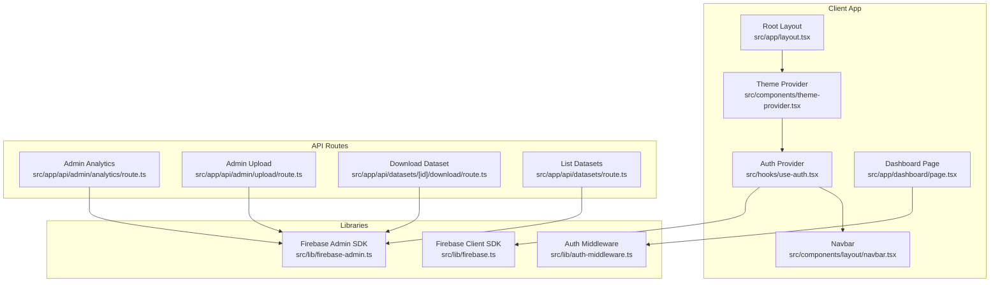
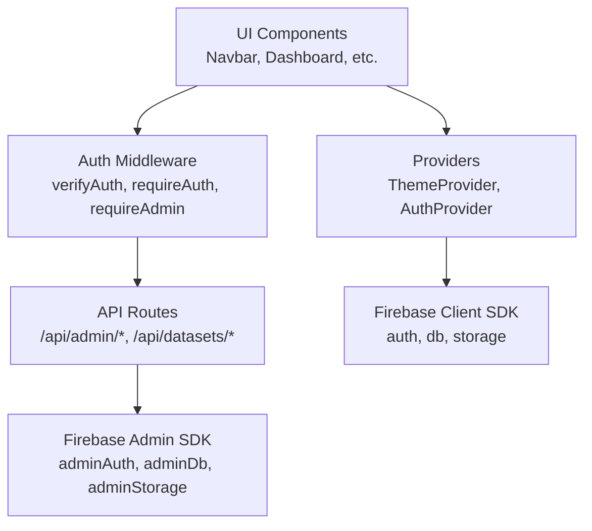
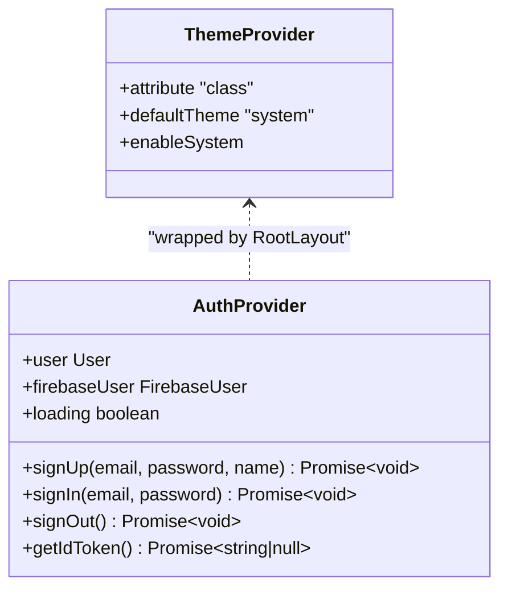
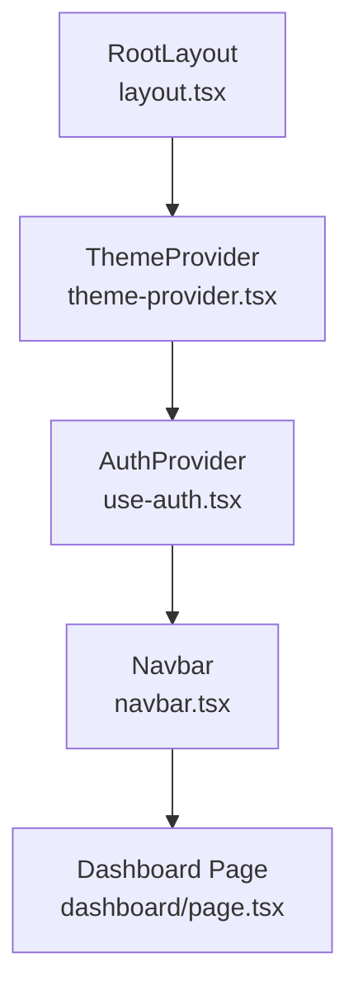
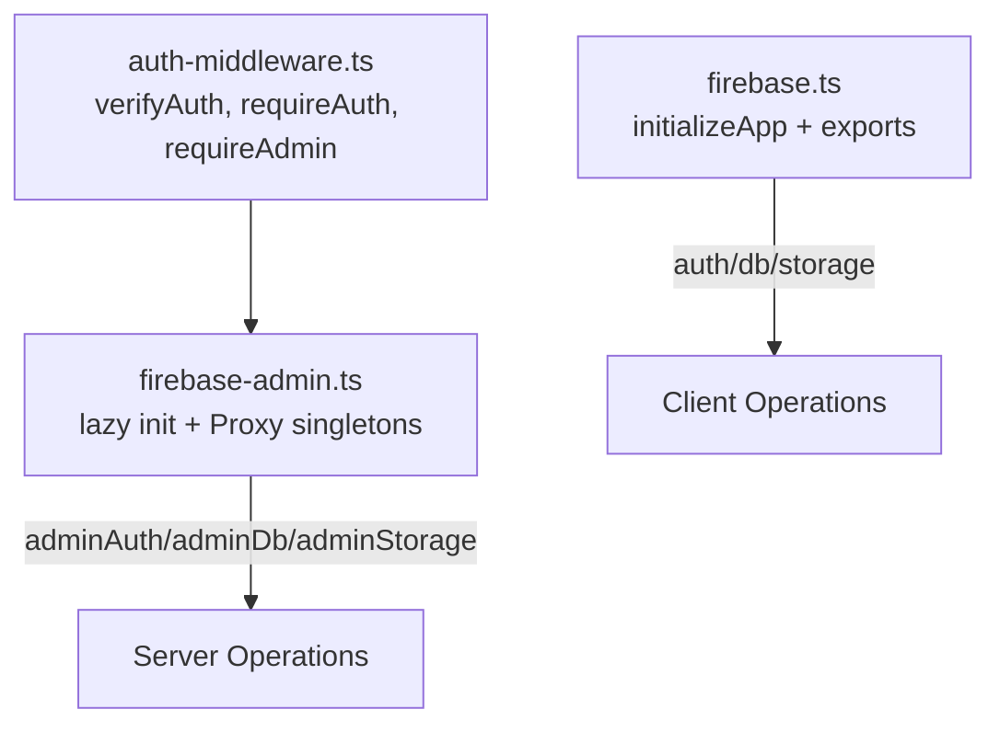
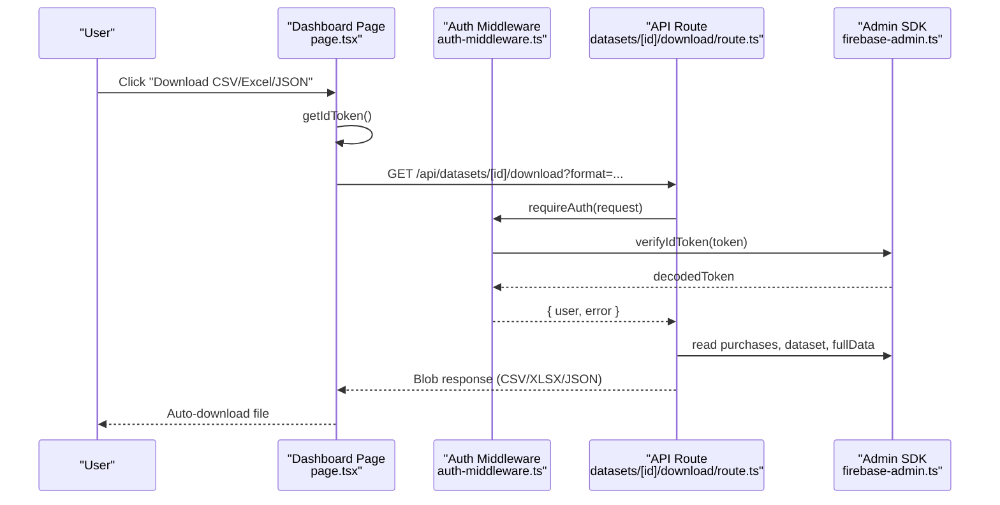
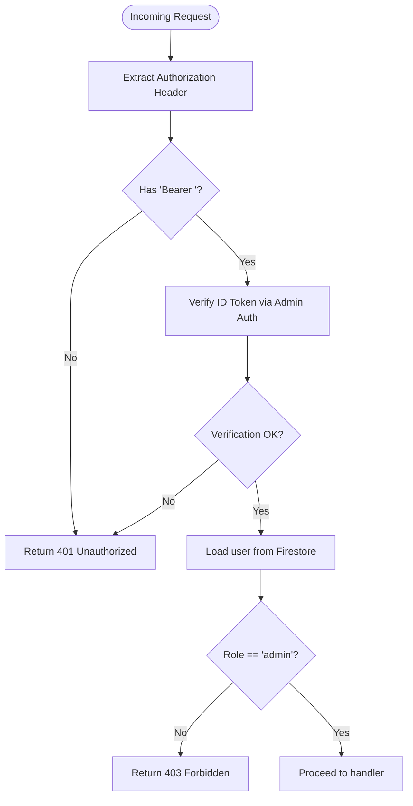
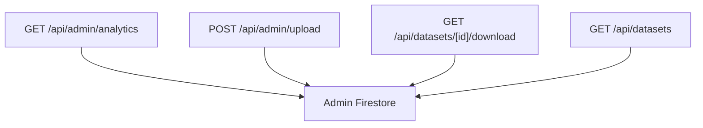
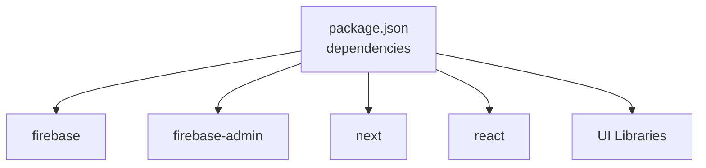

# Architecture Overview

<cite>
**Referenced Files in This Document**
- [layout.tsx](file://src/app/layout.tsx)
- [theme-provider.tsx](file://src/components/theme-provider.tsx)
- [use-auth.tsx](file://src/hooks/use-auth.tsx)
- [navbar.tsx](file://src/components/layout/navbar.tsx)
- [firebase.ts](file://src/lib/firebase.ts)
- [firebase-admin.ts](file://src/lib/firebase-admin.ts)
- [auth-middleware.ts](file://src/lib/auth-middleware.ts)
- [page.tsx](file://src/app/dashboard/page.tsx)
- [route.ts](file://src/app/api/admin/analytics/route.ts)
- [route.ts](file://src/app/api/admin/upload/route.ts)
- [route.ts](file://src/app/api/datasets/[id]/download/route.ts)
- [route.ts](file://src/app/api/datasets/route.ts)
- [index.ts](file://src/types/index.ts)
- [package.json](file://package.json)
</cite>

## Table of Contents
1. [Introduction](#introduction)
2. [Project Structure](#project-structure)
3. [Core Components](#core-components)
4. [Architecture Overview](#architecture-overview)
5. [Detailed Component Analysis](#detailed-component-analysis)
6. [Dependency Analysis](#dependency-analysis)
7. [Performance Considerations](#performance-considerations)
8. [Troubleshooting Guide](#troubleshooting-guide)
9. [Conclusion](#conclusion)

## Introduction
This document presents the architecture and component relationships for Datafrica’s Next.js application. It covers the file-based routing model, the provider pattern for centralized state management (authentication, theme), the component hierarchy from the root layout down to UI components, and the Firebase integration for authentication, Firestore, and Cloud Storage. It also documents data flows from user interactions through API routes to backend services, the authentication middleware and role-based access control, and cross-cutting concerns such as error handling, loading states, and performance optimization strategies.

## Project Structure
Datafrica follows Next.js App Router conventions with file-based routing under src/app. Authentication and theme providers wrap the application in the root layout. API routes under src/app/api implement server-side logic protected by middleware. UI components are organized under src/components, with reusable primitives under ui and layout-specific components under layout. Shared types live under src/types. Firebase client and admin SDKs are initialized under src/lib.

**Diagram sources**
- [layout.tsx:26-49](file://src/app/layout.tsx#L26-L49)
- [theme-provider.tsx:6-12](file://src/components/theme-provider.tsx#L6-L12)
- [use-auth.tsx:34-108](file://src/hooks/use-auth.tsx#L34-L108)
- [navbar.tsx:18-167](file://src/components/layout/navbar.tsx#L18-L167)
- [page.tsx:32-313](file://src/app/dashboard/page.tsx#L32-L313)
- [firebase.ts:16-22](file://src/lib/firebase.ts#L16-L22)
- [firebase-admin.ts:12-49](file://src/lib/firebase-admin.ts#L12-L49)
- [auth-middleware.ts:4-47](file://src/lib/auth-middleware.ts#L4-L47)
- [route.ts:1-78](file://src/app/api/admin/analytics/route.ts#L1-L78)
- [route.ts:1-93](file://src/app/api/admin/upload/route.ts#L1-L93)
- [route.ts:1-148](file://src/app/api/datasets/[id]/download/route.ts#L1-L148)
- [route.ts:1-62](file://src/app/api/datasets/route.ts#L1-L62)

**Section sources**
- [layout.tsx:26-49](file://src/app/layout.tsx#L26-L49)
- [package.json:11-38](file://package.json#L11-L38)

## Core Components
- Root layout composes providers and renders child pages. Providers include ThemeProvider and AuthProvider, with Navbar and Footer integrated at the edges.
- ThemeProvider wraps the app with next-themes for theme management.
- AuthProvider manages Firebase authentication state, synchronizes user profiles in Firestore, and exposes sign-in/sign-out and token retrieval utilities.
- Navbar reads user state from AuthProvider to render navigation and user actions.
- Dashboard page consumes AuthProvider to guard access and fetch purchases via API routes.

**Section sources**
- [layout.tsx:37-45](file://src/app/layout.tsx#L37-L45)
- [theme-provider.tsx:6-12](file://src/components/theme-provider.tsx#L6-L12)
- [use-auth.tsx:34-108](file://src/hooks/use-auth.tsx#L34-L108)
- [navbar.tsx:18-167](file://src/components/layout/navbar.tsx#L18-L167)
- [page.tsx:32-66](file://src/app/dashboard/page.tsx#L32-L66)

## Architecture Overview
The system is a client-server hybrid:
- Client-side rendering with Next.js App Router file-based routing.
- Centralized state via React Context providers (theme and auth).
- Firebase Client SDK for browser auth and Firestore reads/writes.
- Firebase Admin SDK for secure server-side operations (analytics, uploads, downloads).
- Authentication middleware verifies Bearer tokens and enforces role-based access control.

**Diagram sources**
- [layout.tsx:37-45](file://src/app/layout.tsx#L37-L45)
- [use-auth.tsx:34-108](file://src/hooks/use-auth.tsx#L34-L108)
- [auth-middleware.ts:4-47](file://src/lib/auth-middleware.ts#L4-L47)
- [route.ts:1-78](file://src/app/api/admin/analytics/route.ts#L1-L78)
- [route.ts:1-93](file://src/app/api/admin/upload/route.ts#L1-L93)
- [route.ts:1-148](file://src/app/api/datasets/[id]/download/route.ts#L1-L148)
- [firebase.ts:16-22](file://src/lib/firebase.ts#L16-L22)
- [firebase-admin.ts:12-49](file://src/lib/firebase-admin.ts#L12-L49)

## Detailed Component Analysis

### Provider Pattern: Theme and Authentication
- ThemeProvider configures next-themes to manage light/dark/system themes.
- AuthProvider initializes Firebase auth listeners, hydrates user profile from Firestore, and exposes sign-up, sign-in, sign-out, and ID token retrieval.

**Diagram sources**
- [theme-provider.tsx:6-12](file://src/components/theme-provider.tsx#L6-L12)
- [use-auth.tsx:34-108](file://src/hooks/use-auth.tsx#L34-L108)

**Section sources**
- [theme-provider.tsx:6-12](file://src/components/theme-provider.tsx#L6-L12)
- [use-auth.tsx:34-108](file://src/hooks/use-auth.tsx#L34-L108)

### Component Hierarchy: Root to UI
- RootLayout composes ThemeProvider -> AuthProvider -> Navbar -> main -> Footer -> Toaster.
- Navbar conditionally renders admin links and user menu based on AuthProvider state.
- Dashboard page fetches purchases and triggers dataset downloads via API routes.

**Diagram sources**
- [layout.tsx:37-45](file://src/app/layout.tsx#L37-L45)
- [navbar.tsx:18-167](file://src/components/layout/navbar.tsx#L18-L167)
- [page.tsx:32-313](file://src/app/dashboard/page.tsx#L32-L313)

**Section sources**
- [layout.tsx:37-45](file://src/app/layout.tsx#L37-L45)
- [navbar.tsx:18-167](file://src/components/layout/navbar.tsx#L18-L167)
- [page.tsx:32-66](file://src/app/dashboard/page.tsx#L32-L66)

### Firebase Integration Architecture
- Client SDK initialization exports auth, db, and storage instances for browser operations.
- Admin SDK uses lazy initialization with Proxy-wrapped singletons for auth, Firestore, and storage to avoid repeated initialization and enable safe SSR usage.
- Authentication middleware verifies Bearer tokens using Admin Auth and checks roles against Firestore.

**Diagram sources**
- [firebase.ts:16-22](file://src/lib/firebase.ts#L16-L22)
- [firebase-admin.ts:12-49](file://src/lib/firebase-admin.ts#L12-L49)
- [auth-middleware.ts:4-47](file://src/lib/auth-middleware.ts#L4-L47)

**Section sources**
- [firebase.ts:16-22](file://src/lib/firebase.ts#L16-L22)
- [firebase-admin.ts:12-49](file://src/lib/firebase-admin.ts#L12-L49)
- [auth-middleware.ts:4-47](file://src/lib/auth-middleware.ts#L4-L47)

### Data Flow: User Interactions to Backend Services
- Dashboard triggers dataset downloads by calling /api/datasets/[id]/download with an Authorization header containing a Firebase ID token.
- Admin analytics and uploads are protected by requireAdmin middleware, which validates the token and checks the user’s role in Firestore.

**Diagram sources**
- [page.tsx:68-103](file://src/app/dashboard/page.tsx#L68-L103)
- [auth-middleware.ts:19-28](file://src/lib/auth-middleware.ts#L19-L28)
- [route.ts:1-148](file://src/app/api/datasets/[id]/download/route.ts#L1-L148)
- [firebase-admin.ts:12-49](file://src/lib/firebase-admin.ts#L12-L49)

**Section sources**
- [page.tsx:68-103](file://src/app/dashboard/page.tsx#L68-L103)
- [route.ts:1-148](file://src/app/api/datasets/[id]/download/route.ts#L1-L148)
- [auth-middleware.ts:19-28](file://src/lib/auth-middleware.ts#L19-L28)

### Authentication Middleware and Role-Based Access Control
- verifyAuth extracts a Bearer token and decodes it using Admin Auth.
- requireAuth returns unauthorized if verification fails.
- requireAdmin additionally queries Firestore for the user’s role and rejects non-admins.

**Diagram sources**
- [auth-middleware.ts:4-47](file://src/lib/auth-middleware.ts#L4-L47)
- [route.ts:1-78](file://src/app/api/admin/analytics/route.ts#L1-L78)
- [route.ts:1-93](file://src/app/api/admin/upload/route.ts#L1-L93)

**Section sources**
- [auth-middleware.ts:4-47](file://src/lib/auth-middleware.ts#L4-L47)

### API Route Examples and Responsibilities
- Admin Analytics: Aggregates revenue, sales, users, datasets, recent sales, and top datasets using Firestore queries.
- Admin Upload: Accepts CSV via multipart form, parses with Papa, writes dataset metadata and full data in batches to Firestore subcollections.
- Dataset Download: Verifies purchase and optional download token, records download, and streams CSV/XLSX/JSON.
- List Datasets: Applies filters and pagination, with additional client-side filtering for price and search.

**Diagram sources**
- [route.ts:1-78](file://src/app/api/admin/analytics/route.ts#L1-L78)
- [route.ts:1-93](file://src/app/api/admin/upload/route.ts#L1-L93)
- [route.ts:1-148](file://src/app/api/datasets/[id]/download/route.ts#L1-L148)
- [route.ts:1-62](file://src/app/api/datasets/route.ts#L1-L62)
- [firebase-admin.ts:12-49](file://src/lib/firebase-admin.ts#L12-L49)

**Section sources**
- [route.ts:1-78](file://src/app/api/admin/analytics/route.ts#L1-L78)
- [route.ts:1-93](file://src/app/api/admin/upload/route.ts#L1-L93)
- [route.ts:1-148](file://src/app/api/datasets/[id]/download/route.ts#L1-L148)
- [route.ts:1-62](file://src/app/api/datasets/route.ts#L1-L62)

## Dependency Analysis
- Client app depends on React, Next.js, and UI libraries. Firebase and Firebase Admin SDKs are used for client and server operations respectively.
- Providers depend on Firebase client SDK for auth and Firestore synchronization.
- API routes depend on Firebase Admin SDK and auth middleware for security.

**Diagram sources**
- [package.json:11-38](file://package.json#L11-L38)

**Section sources**
- [package.json:11-38](file://package.json#L11-L38)

## Performance Considerations
- Batched writes for large datasets during upload reduce Firestore write costs and improve throughput.
- Client-side skeleton loaders and conditional rendering minimize perceived latency while data loads.
- Lazy initialization of Admin SDK singletons avoids redundant initialization and improves cold-start performance.
- Pagination and server-side ordering limit payload sizes for dataset listings.

[No sources needed since this section provides general guidance]

## Troubleshooting Guide
- Authentication failures: Verify Authorization header format and token validity; check middleware error responses for 401/403.
- Admin access denied: Confirm user role stored in Firestore and that requireAdmin runs after token verification.
- Download errors: Inspect purchase existence, token validity/expiry, and dataset presence; review API error responses.
- Upload errors: Validate CSV parsing results and required fields; confirm batch commit success.

**Section sources**
- [auth-middleware.ts:19-28](file://src/lib/auth-middleware.ts#L19-L28)
- [route.ts:31-68](file://src/app/api/datasets/[id]/download/route.ts#L31-L68)
- [route.ts:23-39](file://src/app/api/admin/upload/route.ts#L23-L39)

## Conclusion
Datafrica’s architecture leverages Next.js App Router for scalable file-based routing, a provider pattern for centralized state management, and Firebase for authentication and data persistence. The auth middleware and RBAC ensure secure access to admin features, while API routes encapsulate server-side logic with Admin SDKs. UI components remain lean and reactive, relying on providers and typed models for predictable behavior.