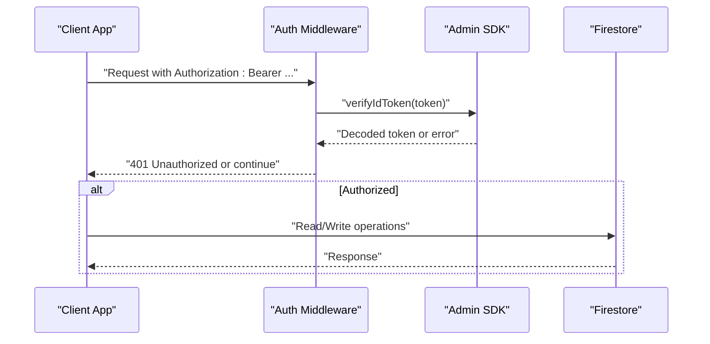
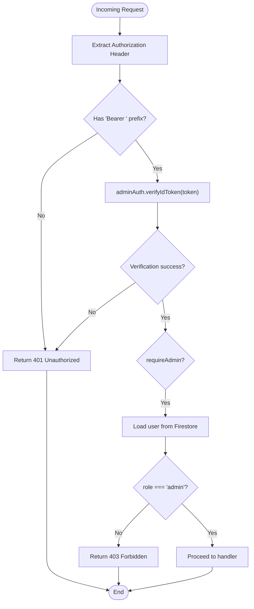
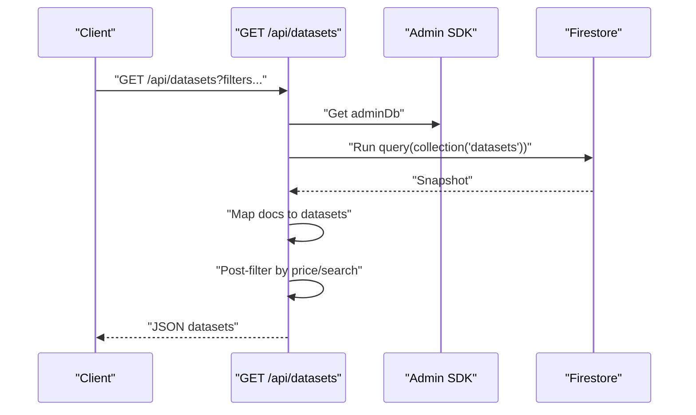
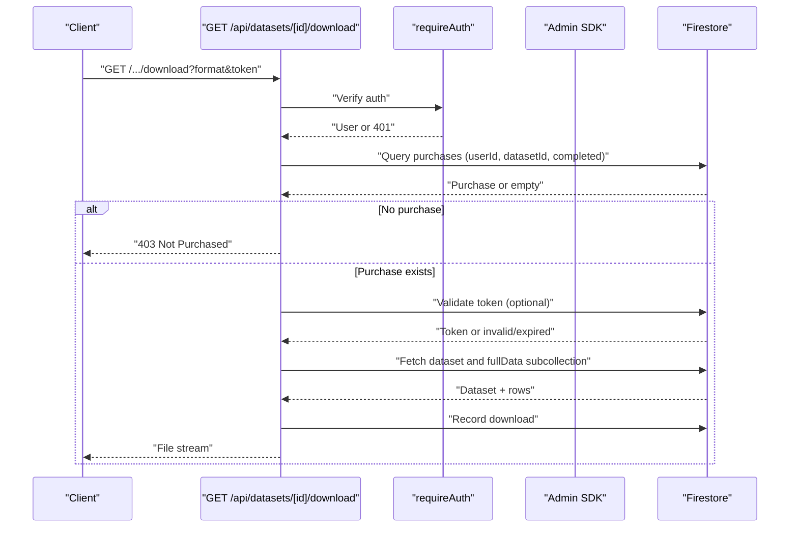
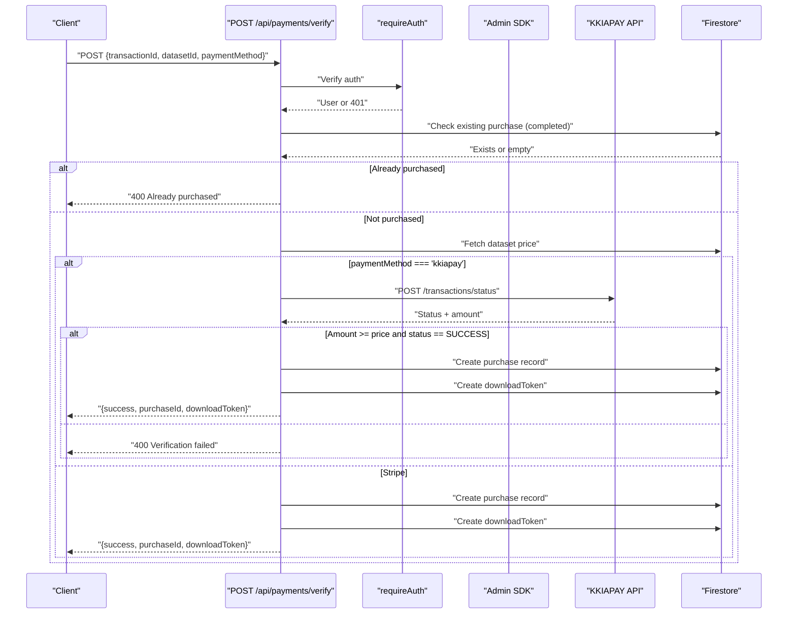
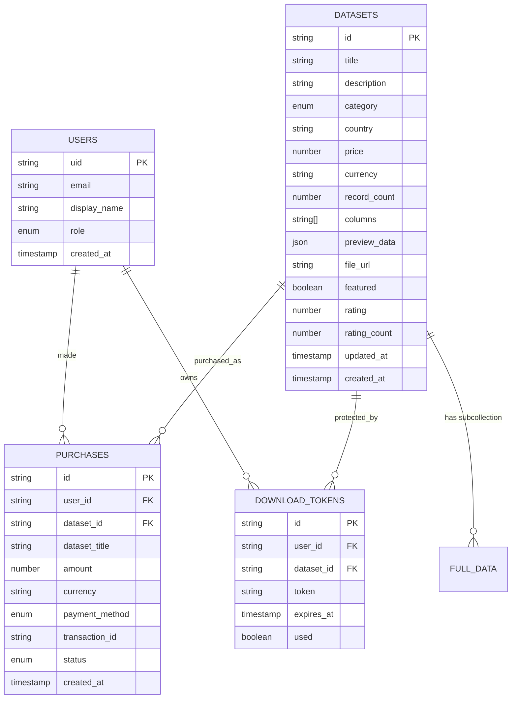
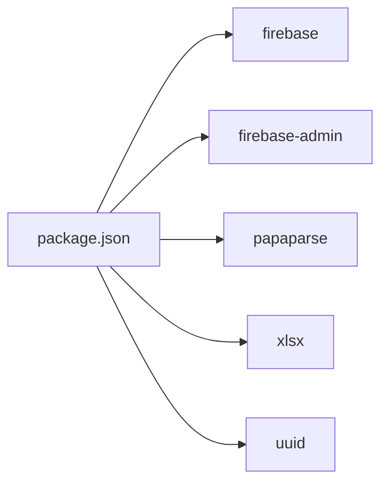

# Backend Services

<cite>
**Referenced Files in This Document**
- [src/lib/firebase.ts](file://src/lib/firebase.ts)
- [src/lib/firebase-admin.ts](file://src/lib/firebase-admin.ts)
- [src/lib/auth-middleware.ts](file://src/lib/auth-middleware.ts)
- [src/app/api/datasets/route.ts](file://src/app/api/datasets/route.ts)
- [src/app/api/datasets/[id]/route.ts](file://src/app/api/datasets/[id]/route.ts)
- [src/app/api/datasets/[id]/download/route.ts](file://src/app/api/datasets/[id]/download/route.ts)
- [src/app/api/admin/analytics/route.ts](file://src/app/api/admin/analytics/route.ts)
- [src/app/api/admin/upload/route.ts](file://src/app/api/admin/upload/route.ts)
- [src/app/api/admin/users/route.ts](file://src/app/api/admin/users/route.ts)
- [src/app/api/payments/verify/route.ts](file://src/app/api/payments/verify/route.ts)
- [src/app/api/user/purchases/route.ts](file://src/app/api/user/purchases/route.ts)
- [src/types/index.ts](file://src/types/index.ts)
- [package.json](file://package.json)
</cite>

## Table of Contents
1. [Introduction](#introduction)
2. [Project Structure](#project-structure)
3. [Core Components](#core-components)
4. [Architecture Overview](#architecture-overview)
5. [Detailed Component Analysis](#detailed-component-analysis)
6. [Dependency Analysis](#dependency-analysis)
7. [Performance Considerations](#performance-considerations)
8. [Troubleshooting Guide](#troubleshooting-guide)
9. [Conclusion](#conclusion)

## Introduction
This document describes the backend services powering Datafrica’s Firebase-enabled Next.js application. It covers Firebase client SDK configuration, server-side Admin SDK usage, authentication and authorization middleware, Next.js App Router API routes, Firestore operations, Cloud Storage integration, payment processing with KKIAPAY, and error handling/logging patterns. The goal is to provide a clear, actionable guide for developers maintaining or extending the backend.

## Project Structure
The backend is organized around Next.js App Router conventions under src/app/api. Shared backend services live in src/lib, while domain-specific APIs are grouped by feature (datasets, admin, payments, user). Type definitions are centralized in src/types.

```mermaid
graph TB
subgraph "Client SDK"
FBClient["Firebase Client SDK<br/>src/lib/firebase.ts"]
end
subgraph "Server SDK"
FBAdmin["Firebase Admin SDK<br/>src/lib/firebase-admin.ts"]
end
subgraph "Middleware"
AuthMW["Auth Middleware<br/>src/lib/auth-middleware.ts"]
end
subgraph "API Routes"
DatasetsList["GET /api/datasets<br/>src/app/api/datasets/route.ts"]
DatasetDetail["GET /api/datasets/[id]<br/>src/app/api/datasets/[id]/route.ts"]
DatasetDownload["GET /api/datasets/[id]/download<br/>src/app/api/datasets/[id]/download/route.ts"]
AdminAnalytics["GET /api/admin/analytics<br/>src/app/api/admin/analytics/route.ts"]
AdminUpload["POST /api/admin/upload<br/>src/app/api/admin/upload/route.ts"]
AdminUsers["GET/PATCH /api/admin/users<br/>src/app/api/admin/users/route.ts"]
PaymentsVerify["POST /api/payments/verify<br/>src/app/api/payments/verify/route.ts"]
UserPurchases["GET /api/user/purchases<br/>src/app/api/user/purchases/route.ts"]
end
Types["Types<br/>src/types/index.ts"]
FBClient --> DatasetsList
FBClient --> DatasetDetail
FBClient --> DatasetDownload
FBClient --> PaymentsVerify
FBClient --> UserPurchases
FBAdmin --> DatasetsList
FBAdmin --> DatasetDetail
FBAdmin --> DatasetDownload
FBAdmin --> AdminAnalytics
FBAdmin --> AdminUpload
FBAdmin --> AdminUsers
FBAdmin --> PaymentsVerify
FBAdmin --> UserPurchases
AuthMW --> AdminAnalytics
AuthMW --> AdminUpload
AuthMW --> AdminUsers
AuthMW --> DatasetDownload
Types --> DatasetsList
Types --> DatasetDetail
Types --> DatasetDownload
Types --> PaymentsVerify
Types --> UserPurchases
```

**Diagram sources**
- [src/lib/firebase.ts:1-22](file://src/lib/firebase.ts#L1-L22)
- [src/lib/firebase-admin.ts:1-50](file://src/lib/firebase-admin.ts#L1-L50)
- [src/lib/auth-middleware.ts:1-48](file://src/lib/auth-middleware.ts#L1-L48)
- [src/app/api/datasets/route.ts:1-62](file://src/app/api/datasets/route.ts#L1-L62)
- [src/app/api/datasets/[id]/route.ts:1-29](file://src/app/api/datasets/[id]/route.ts#L1-L29)
- [src/app/api/datasets/[id]/download/route.ts:1-148](file://src/app/api/datasets/[id]/download/route.ts#L1-L148)
- [src/app/api/admin/analytics/route.ts:1-78](file://src/app/api/admin/analytics/route.ts#L1-L78)
- [src/app/api/admin/upload/route.ts:1-93](file://src/app/api/admin/upload/route.ts#L1-L93)
- [src/app/api/admin/users/route.ts:1-54](file://src/app/api/admin/users/route.ts#L1-L54)
- [src/app/api/payments/verify/route.ts:1-135](file://src/app/api/payments/verify/route.ts#L1-L135)
- [src/app/api/user/purchases/route.ts:1-31](file://src/app/api/user/purchases/route.ts#L1-L31)
- [src/types/index.ts:1-90](file://src/types/index.ts#L1-L90)

**Section sources**
- [src/app/api/datasets/route.ts:1-62](file://src/app/api/datasets/route.ts#L1-L62)
- [src/app/api/admin/analytics/route.ts:1-78](file://src/app/api/admin/analytics/route.ts#L1-L78)
- [src/app/api/admin/upload/route.ts:1-93](file://src/app/api/admin/upload/route.ts#L1-L93)
- [src/app/api/admin/users/route.ts:1-54](file://src/app/api/admin/users/route.ts#L1-L54)
- [src/app/api/datasets/[id]/route.ts:1-29](file://src/app/api/datasets/[id]/route.ts#L1-L29)
- [src/app/api/datasets/[id]/download/route.ts:1-148](file://src/app/api/datasets/[id]/download/route.ts#L1-L148)
- [src/app/api/payments/verify/route.ts:1-135](file://src/app/api/payments/verify/route.ts#L1-L135)
- [src/app/api/user/purchases/route.ts:1-31](file://src/app/api/user/purchases/route.ts#L1-L31)
- [src/lib/firebase.ts:1-22](file://src/lib/firebase.ts#L1-L22)
- [src/lib/firebase-admin.ts:1-50](file://src/lib/firebase-admin.ts#L1-L50)
- [src/lib/auth-middleware.ts:1-48](file://src/lib/auth-middleware.ts#L1-L48)
- [src/types/index.ts:1-90](file://src/types/index.ts#L1-L90)

## Core Components
- Firebase Client SDK: Initializes and exports Firebase app, auth, Firestore, and Storage clients for client-side usage.
- Firebase Admin SDK: Lazily initializes Admin App and exposes Auth, Firestore, and Storage singletons behind proxies to avoid repeated initialization.
- Authentication Middleware: Verifies Authorization Bearer tokens, enforces authentication, and checks admin roles against Firestore.
- API Routes: Implement Next.js App Router endpoints for datasets, admin analytics, uploads, user management, downloads, payments, and purchases.

Key responsibilities:
- src/lib/firebase.ts: Client SDK configuration and exports.
- src/lib/firebase-admin.ts: Admin SDK initialization and lazy singletons.
- src/lib/auth-middleware.ts: Token verification, auth enforcement, admin checks.
- src/app/api/*: Feature-specific backend endpoints.

**Section sources**
- [src/lib/firebase.ts:1-22](file://src/lib/firebase.ts#L1-L22)
- [src/lib/firebase-admin.ts:1-50](file://src/lib/firebase-admin.ts#L1-L50)
- [src/lib/auth-middleware.ts:1-48](file://src/lib/auth-middleware.ts#L1-L48)

## Architecture Overview
The backend follows a clean separation of concerns:
- Client SDK is used for UI interactions (e.g., login, purchases).
- Server-side Admin SDK performs privileged operations (queries, writes, admin tasks).
- Middleware secures routes and enforces role-based access control.
- API routes encapsulate business logic and orchestrate reads/writes to Firestore and external services.

**Diagram sources**
- [src/lib/auth-middleware.ts:1-48](file://src/lib/auth-middleware.ts#L1-L48)
- [src/lib/firebase-admin.ts:1-50](file://src/lib/firebase-admin.ts#L1-L50)

## Detailed Component Analysis

### Firebase Client SDK Initialization
- Loads environment variables for client-side Firebase config.
- Ensures a single Firebase app instance is initialized per runtime.
- Exports auth, Firestore, and Storage instances for client-side usage.

Implementation highlights:
- Environment-driven configuration.
- Singleton app guard to prevent duplicate initialization.

**Section sources**
- [src/lib/firebase.ts:1-22](file://src/lib/firebase.ts#L1-L22)

### Firebase Admin SDK Initialization and Singletons
- Lazy initialization of Admin App using service account credentials from environment variables.
- Proxies expose adminAuth, adminDb, and adminStorage singletons, initializing on first access.
- Reuses existing app when present to avoid conflicts.

Implementation highlights:
- Service account private key handling with newline normalization.
- Proxy pattern for deferred initialization.

**Section sources**
- [src/lib/firebase-admin.ts:1-50](file://src/lib/firebase-admin.ts#L1-L50)

### Authentication Middleware
- verifyAuth: Extracts Bearer token from Authorization header and verifies with Admin SDK.
- requireAuth: Enforces authentication and returns 401 on failure.
- requireAdmin: Enforces admin role by checking Firestore users collection for role field.

**Diagram sources**
- [src/lib/auth-middleware.ts:1-48](file://src/lib/auth-middleware.ts#L1-L48)

**Section sources**
- [src/lib/auth-middleware.ts:1-48](file://src/lib/auth-middleware.ts#L1-L48)

### API Route: Datasets Listing
- Endpoint: GET /api/datasets
- Filters: category, country, featured, search, minPrice, maxPrice, limit
- Firestore query: collection(datasets) with optional where clauses and ordering by creation date
- Post-filtering: price range and free-text search performed client-side after fetching

**Diagram sources**
- [src/app/api/datasets/route.ts:1-62](file://src/app/api/datasets/route.ts#L1-L62)

**Section sources**
- [src/app/api/datasets/route.ts:1-62](file://src/app/api/datasets/route.ts#L1-L62)

### API Route: Single Dataset Details
- Endpoint: GET /api/datasets/[id]
- Fetches dataset by ID and returns 404 if not found

**Section sources**
- [src/app/api/datasets/[id]/route.ts:1-29](file://src/app/api/datasets/[id]/route.ts#L1-L29)

### API Route: Dataset Download
- Endpoint: GET /api/datasets/[id]/download?format=csv|excel|json&token=...
- Authentication enforced via requireAuth
- Validates purchase existence and completion for the user and dataset
- Optional download token validation with expiry and usage tracking
- Streams generated file (CSV, Excel, or JSON) with appropriate headers
- Records download event in Firestore

**Diagram sources**
- [src/app/api/datasets/[id]/download/route.ts:1-148](file://src/app/api/datasets/[id]/download/route.ts#L1-L148)
- [src/lib/auth-middleware.ts:1-48](file://src/lib/auth-middleware.ts#L1-L48)

**Section sources**
- [src/app/api/datasets/[id]/download/route.ts:1-148](file://src/app/api/datasets/[id]/download/route.ts#L1-L148)

### API Route: Admin Analytics
- Endpoint: GET /api/admin/analytics
- Requires admin role via requireAdmin
- Computes total revenue, sales count, user and dataset counts
- Retrieves recent sales and top datasets by revenue

**Section sources**
- [src/app/api/admin/analytics/route.ts:1-78](file://src/app/api/admin/analytics/route.ts#L1-L78)

### API Route: Admin Upload
- Endpoint: POST /api/admin/upload
- Requires admin role via requireAdmin
- Parses CSV payload, validates fields, and stores metadata to Firestore dataset document
- Stores full data in a subcollection using batched writes for scalability
- Returns dataset summary and record count

**Section sources**
- [src/app/api/admin/upload/route.ts:1-93](file://src/app/api/admin/upload/route.ts#L1-L93)

### API Route: Admin Users Management
- Endpoint: GET /api/admin/users
  - Lists users ordered by creation date
- Endpoint: PATCH /api/admin/users
  - Updates user role with validation

**Section sources**
- [src/app/api/admin/users/route.ts:1-54](file://src/app/api/admin/users/route.ts#L1-L54)

### API Route: Payment Verification (KKIAPAY and Stripe)
- Endpoint: POST /api/payments/verify
- Requires authentication via requireAuth
- Prevents duplicate purchases for the same dataset and user
- Verifies payment via KKIAPAY transaction API; in development, auto-verifies for testing
- Creates a purchase record upon successful verification
- Generates a time-bound download token for authorized access

**Diagram sources**
- [src/app/api/payments/verify/route.ts:1-135](file://src/app/api/payments/verify/route.ts#L1-L135)
- [src/lib/auth-middleware.ts:1-48](file://src/lib/auth-middleware.ts#L1-L48)

**Section sources**
- [src/app/api/payments/verify/route.ts:1-135](file://src/app/api/payments/verify/route.ts#L1-L135)

### API Route: User Purchases
- Endpoint: GET /api/user/purchases
- Returns the authenticated user’s purchase history ordered by creation date

**Section sources**
- [src/app/api/user/purchases/route.ts:1-31](file://src/app/api/user/purchases/route.ts#L1-L31)

### Data Models
Core domain types define Firestore entities and their fields.

**Diagram sources**
- [src/types/index.ts:1-90](file://src/types/index.ts#L1-L90)

**Section sources**
- [src/types/index.ts:1-90](file://src/types/index.ts#L1-L90)

## Dependency Analysis
External libraries and their roles:
- firebase: Client SDK for auth, Firestore, and Storage.
- firebase-admin: Admin SDK for server-side operations.
- papaparse: CSV parsing for dataset uploads.
- xlsx: Excel export for dataset downloads.
- uuid: Download token generation.
- next: App Router endpoints and runtime.

**Diagram sources**
- [package.json:1-51](file://package.json#L1-L51)

**Section sources**
- [package.json:1-51](file://package.json#L1-L51)

## Performance Considerations
- Batched writes for large dataset uploads to reduce write costs and improve throughput.
- Client-side post-filtering for complex queries (e.g., free-text search) to minimize server-side workload.
- Lazy Admin SDK initialization to avoid unnecessary overhead.
- Streaming file generation for downloads to reduce memory usage.
- Indexing recommendations (conceptual):
  - Compound indexes for frequent queries (e.g., purchases by userId+status, datasets by category+country+featured).
  - Consider adding array-contains indexes if filters on arrays become common.

[No sources needed since this section provides general guidance]

## Troubleshooting Guide
Common issues and resolutions:
- Authentication failures:
  - Ensure Authorization header is present and formatted as Bearer <token>.
  - Confirm token validity and expiration.
- Admin access denied:
  - Verify user role is set to admin in Firestore users collection.
- Payment verification failures:
  - Check KKIAPAY API keys and environment variables.
  - In development, auto-verification may mask real-world issues; test production-like scenarios.
- Download access denied:
  - Confirm purchase exists and is completed.
  - Validate download token if used, ensuring it is unexpired and unused.
- Upload errors:
  - Validate CSV parsing; inspect returned errors.
  - Ensure required fields are present and numeric fields are valid.

Logging patterns:
- Centralized error logging via console.error in handlers.
- Suggested improvements:
  - Integrate structured logging (e.g., Winston) with request correlation IDs.
  - Add metrics for endpoint latency and error rates.

**Section sources**
- [src/lib/auth-middleware.ts:1-48](file://src/lib/auth-middleware.ts#L1-L48)
- [src/app/api/admin/upload/route.ts:1-93](file://src/app/api/admin/upload/route.ts#L1-L93)
- [src/app/api/datasets/[id]/download/route.ts:1-148](file://src/app/api/datasets/[id]/download/route.ts#L1-L148)
- [src/app/api/payments/verify/route.ts:1-135](file://src/app/api/payments/verify/route.ts#L1-L135)

## Conclusion
Datafrica’s backend leverages Firebase client and Admin SDKs to deliver secure, scalable functionality. The authentication middleware enforces both authentication and admin-only access, while App Router endpoints encapsulate dataset browsing, admin operations, payments, and downloads. Robust error handling and performance-conscious patterns (batched writes, streaming, lazy initialization) support reliable operation. Extending the system involves adding new routes, enforcing appropriate middleware, and aligning Firestore schemas with the provided types.