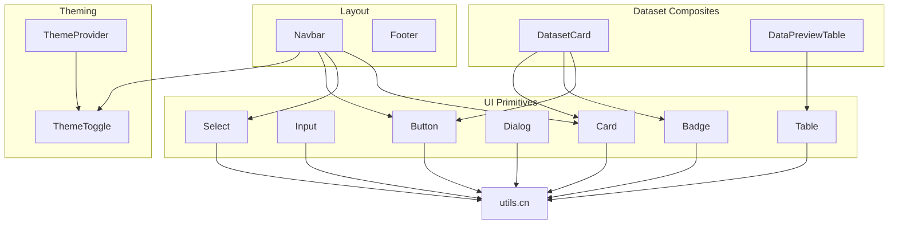
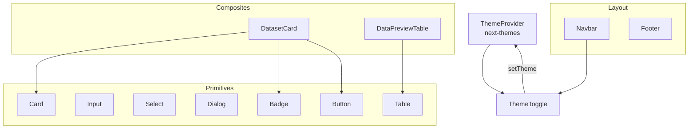
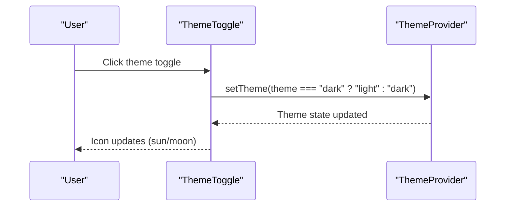
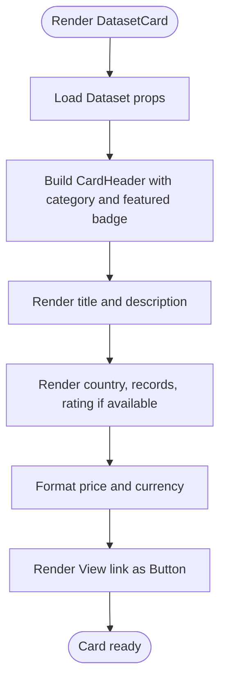
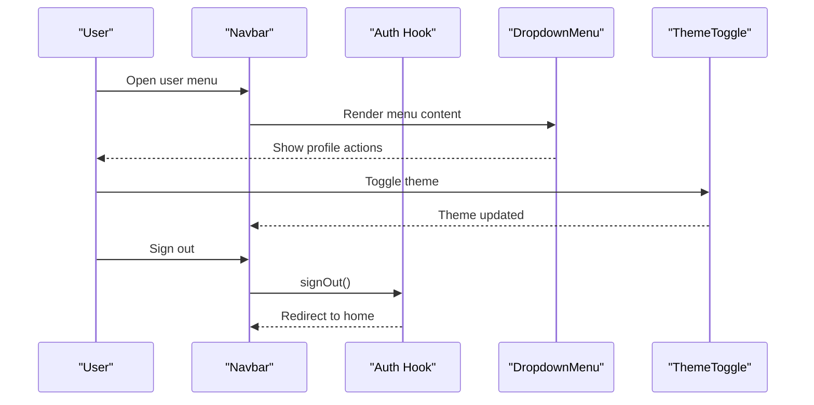
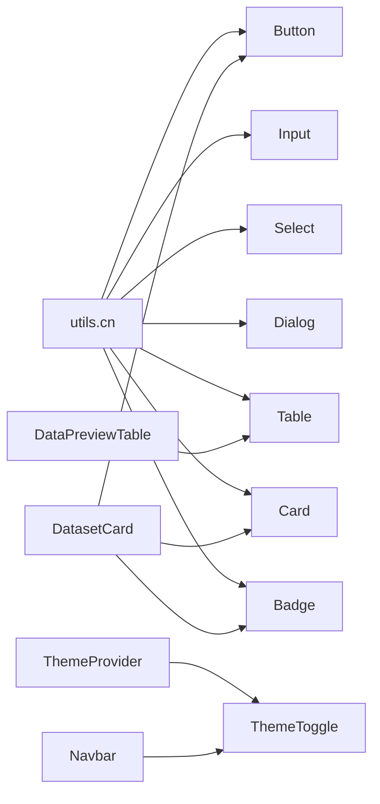

# Component System

<cite>
**Referenced Files in This Document**
- [button.tsx](file://src/components/ui/button.tsx)
- [card.tsx](file://src/components/ui/card.tsx)
- [table.tsx](file://src/components/ui/table.tsx)
- [input.tsx](file://src/components/ui/input.tsx)
- [dialog.tsx](file://src/components/ui/dialog.tsx)
- [select.tsx](file://src/components/ui/select.tsx)
- [badge.tsx](file://src/components/ui/badge.tsx)
- [theme-provider.tsx](file://src/components/theme-provider.tsx)
- [theme-toggle.tsx](file://src/components/theme-toggle.tsx)
- [dataset-card.tsx](file://src/components/dataset/dataset-card.tsx)
- [data-preview-table.tsx](file://src/components/dataset/data-preview-table.tsx)
- [navbar.tsx](file://src/components/layout/navbar.tsx)
- [footer.tsx](file://src/components/layout/footer.tsx)
- [utils.ts](file://src/lib/utils.ts)
- [components.json](file://components.json)
</cite>

## Table of Contents
1. [Introduction](#introduction)
2. [Project Structure](#project-structure)
3. [Core Components](#core-components)
4. [Architecture Overview](#architecture-overview)
5. [Detailed Component Analysis](#detailed-component-analysis)
6. [Dependency Analysis](#dependency-analysis)
7. [Performance Considerations](#performance-considerations)
8. [Troubleshooting Guide](#troubleshooting-guide)
9. [Conclusion](#conclusion)
10. [Appendices](#appendices)

## Introduction
This document describes Datafrica’s modular UI component system built on shadcn/ui primitives and Radix UI, with a cohesive theming model supporting light and dark modes. It explains the component hierarchy from low-level primitives to dataset-specific composites, documents prop interfaces and event handling patterns, and outlines accessibility and styling conventions. It also provides guidelines for creating new components, integrating them into the design system, and testing and documenting components effectively.

## Project Structure
The UI system is organized into:
- Primitive UI components under src/components/ui
- Composite components under src/components/dataset
- Layout scaffolding under src/components/layout
- Theming under src/components/theme-provider and src/components/theme-toggle
- Utility helpers under src/lib/utils
- shadcn/ui configuration under components.json



**Diagram sources**
- [button.tsx:1-58](file://src/components/ui/button.tsx#L1-L58)
- [input.tsx:1-20](file://src/components/ui/input.tsx#L1-L20)
- [select.tsx:1-158](file://src/components/ui/select.tsx#L1-L158)
- [dialog.tsx:1-120](file://src/components/ui/dialog.tsx#L1-L120)
- [table.tsx:1-117](file://src/components/ui/table.tsx#L1-L117)
- [card.tsx:1-104](file://src/components/ui/card.tsx#L1-L104)
- [badge.tsx:1-37](file://src/components/ui/badge.tsx#L1-L37)
- [dataset-card.tsx:1-81](file://src/components/dataset/dataset-card.tsx#L1-L81)
- [data-preview-table.tsx:1-76](file://src/components/dataset/data-preview-table.tsx#L1-L76)
- [navbar.tsx:1-167](file://src/components/layout/navbar.tsx#L1-L167)
- [footer.tsx:1-75](file://src/components/layout/footer.tsx#L1-L75)
- [theme-provider.tsx:1-13](file://src/components/theme-provider.tsx#L1-L13)
- [theme-toggle.tsx:1-27](file://src/components/theme-toggle.tsx#L1-L27)
- [utils.ts:1-7](file://src/lib/utils.ts#L1-L7)

**Section sources**
- [components.json:1-26](file://components.json#L1-L26)

## Core Components
This section documents the primitive UI building blocks and their customization patterns.

- Button
  - Purpose: Base interactive element with variant and size scales.
  - Variants: default, destructive, outline, secondary, ghost, link.
  - Sizes: default, sm, lg, icon.
  - Props: Inherits native button attributes plus variant, size, and asChild.
  - Accessibility: Supports focus-visible outline and keyboard navigation via radix slot pattern.
  - Notes: Uses class variance authority for variant tokens and cn for merging Tailwind classes.

- Input
  - Purpose: Text input with consistent styling and focus states.
  - Props: Inherits native input attributes plus data-slot for styling hooks.
  - Accessibility: Focus ring, disabled states, placeholder color.

- Select
  - Purpose: Accessible dropdown/select with scroll areas and item indicators.
  - Composition: Root, Group, Value, Trigger, Content, Label, Item, Separator, Scroll buttons.
  - Props: Positioning, viewport sizing, disabled states.
  - Accessibility: Keyboard navigation, ARIA roles, focus management.

- Dialog
  - Purpose: Modal overlay with close controls and portal rendering.
  - Composition: Root, Portal, Overlay, Close, Trigger, Content, Header/Footer, Title/Description.
  - Props: Animation states, focus trapping, portal target.
  - Accessibility: Focus lock, Escape key handling, ARIA modal semantics.

- Table
  - Purpose: Scrollable tabular data container with semantic slots.
  - Composition: Table, TableHeader, TableBody, TableFooter, TableRow, TableHead, TableCell, TableCaption.
  - Props: Container wrapper for horizontal scrolling, cell alignment and spacing.
  - Accessibility: Row selection, hover states, caption for context.

- Card
  - Purpose: Flexible content container with header/title/description/action/content/footer slots.
  - Props: size scale (default/sm), data-slot attributes for styling hooks.
  - Composition: Card, CardHeader, CardTitle, CardDescription, CardAction, CardContent, CardFooter.
  - Accessibility: Semantic grouping via data-slot attributes.

- Badge
  - Purpose: Small status or category indicator with variant tokens.
  - Variants: default, secondary, destructive, outline.
  - Props: Inherits HTML div attributes plus variant.

**Section sources**
- [button.tsx:1-58](file://src/components/ui/button.tsx#L1-L58)
- [input.tsx:1-20](file://src/components/ui/input.tsx#L1-L20)
- [select.tsx:1-158](file://src/components/ui/select.tsx#L1-L158)
- [dialog.tsx:1-120](file://src/components/ui/dialog.tsx#L1-L120)
- [table.tsx:1-117](file://src/components/ui/table.tsx#L1-L117)
- [card.tsx:1-104](file://src/components/ui/card.tsx#L1-L104)
- [badge.tsx:1-37](file://src/components/ui/badge.tsx#L1-L37)

## Architecture Overview
The component system follows a layered architecture:
- Primitives: Low-level, unstyled or minimally styled components with data-slot hooks.
- Composites: Higher-level components composed from primitives (e.g., DatasetCard).
- Layout: Navigation and page scaffolding that integrates theming and auth.
- Theming: Centralized provider and toggle that propagate mode changes.



**Diagram sources**
- [theme-provider.tsx:1-13](file://src/components/theme-provider.tsx#L1-L13)
- [theme-toggle.tsx:1-27](file://src/components/theme-toggle.tsx#L1-L27)
- [button.tsx:1-58](file://src/components/ui/button.tsx#L1-L58)
- [input.tsx:1-20](file://src/components/ui/input.tsx#L1-L20)
- [select.tsx:1-158](file://src/components/ui/select.tsx#L1-L158)
- [dialog.tsx:1-120](file://src/components/ui/dialog.tsx#L1-L120)
- [table.tsx:1-117](file://src/components/ui/table.tsx#L1-L117)
- [card.tsx:1-104](file://src/components/ui/card.tsx#L1-L104)
- [badge.tsx:1-37](file://src/components/ui/badge.tsx#L1-L37)
- [dataset-card.tsx:1-81](file://src/components/dataset/dataset-card.tsx#L1-L81)
- [data-preview-table.tsx:1-76](file://src/components/dataset/data-preview-table.tsx#L1-L76)
- [navbar.tsx:1-167](file://src/components/layout/navbar.tsx#L1-L167)
- [footer.tsx:1-75](file://src/components/layout/footer.tsx#L1-L75)

## Detailed Component Analysis

### Theme System
- Provider: Wraps the app to manage theme state and system preference.
- Toggle: Switches between light and dark modes with icons and controlled mount behavior.



**Diagram sources**
- [theme-provider.tsx:1-13](file://src/components/theme-provider.tsx#L1-L13)
- [theme-toggle.tsx:1-27](file://src/components/theme-toggle.tsx#L1-L27)

**Section sources**
- [theme-provider.tsx:1-13](file://src/components/theme-provider.tsx#L1-L13)
- [theme-toggle.tsx:1-27](file://src/components/theme-toggle.tsx#L1-L27)

### Dataset Components
- DatasetCard
  - Purpose: Presents dataset metadata, pricing, and quick action.
  - Props: dataset (typed via Dataset).
  - Composition: Uses Card, Badge, Button, and Lucide icons.
  - Interactions: Hover effects, link navigation, conditional badges.
  - Accessibility: Uses semantic heading and link elements; ensure focus styles from Button/Link.

- DataPreviewTable
  - Purpose: Renders a preview of tabular data with column/row limits.
  - Props: data (array of records), columns (array of keys), maxRows (optional).
  - Behavior: Truncates columns beyond a readable limit and shows a message when rows exceed preview size.
  - Accessibility: Uses semantic table elements; ensure screen reader announcements for truncated content.



**Diagram sources**
- [dataset-card.tsx:1-81](file://src/components/dataset/dataset-card.tsx#L1-L81)

**Section sources**
- [dataset-card.tsx:1-81](file://src/components/dataset/dataset-card.tsx#L1-L81)
- [data-preview-table.tsx:1-76](file://src/components/dataset/data-preview-table.tsx#L1-L76)

### Layout Components
- Navbar
  - Purpose: Top navigation with branding, links, theme toggle, and user menu.
  - Composition: Uses Button, DropdownMenu, Avatar, and ThemeToggle.
  - Responsiveness: Desktop and mobile menus with state-driven visibility.
  - Accessibility: Dropdown menu keyboard navigation, proper ARIA roles, focus management.

- Footer
  - Purpose: Site information, links, and legal notices.
  - Composition: Grid layout with sections for branding, marketplace, company, and developers.



**Diagram sources**
- [navbar.tsx:1-167](file://src/components/layout/navbar.tsx#L1-L167)
- [theme-toggle.tsx:1-27](file://src/components/theme-toggle.tsx#L1-L27)

**Section sources**
- [navbar.tsx:1-167](file://src/components/layout/navbar.tsx#L1-L167)
- [footer.tsx:1-75](file://src/components/layout/footer.tsx#L1-L75)

### Primitive Component Patterns
- Variants and sizes: Defined via class variance authority; applied through cn.
- Slot-based styling: data-slot attributes on containers and cells enable targeted styling.
- Forward refs and radix slots: Ensures composability and consistent DOM structure.
- Controlled mounting: ThemeToggle avoids hydration mismatches by deferring render until mounted.

```mermaid
classDiagram
class Button {
+variant : "default|destructive|outline|secondary|ghost|link"
+size : "default|sm|lg|icon"
+asChild : boolean
}
class Input {
+type : string
}
class Select {
+position : "popper"
}
class Dialog {
+open : boolean
}
class Table {
+container : boolean
}
class Card {
+size : "default|sm"
}
class Badge {
+variant : "default|secondary|destructive|outline"
}
Button --> Utils["cn"]
Input --> Utils
Select --> Utils
Dialog --> Utils
Table --> Utils
Card --> Utils
Badge --> Utils
```

**Diagram sources**
- [button.tsx:1-58](file://src/components/ui/button.tsx#L1-L58)
- [input.tsx:1-20](file://src/components/ui/input.tsx#L1-L20)
- [select.tsx:1-158](file://src/components/ui/select.tsx#L1-L158)
- [dialog.tsx:1-120](file://src/components/ui/dialog.tsx#L1-L120)
- [table.tsx:1-117](file://src/components/ui/table.tsx#L1-L117)
- [card.tsx:1-104](file://src/components/ui/card.tsx#L1-L104)
- [badge.tsx:1-37](file://src/components/ui/badge.tsx#L1-L37)
- [utils.ts:1-7](file://src/lib/utils.ts#L1-L7)

**Section sources**
- [button.tsx:1-58](file://src/components/ui/button.tsx#L1-L58)
- [input.tsx:1-20](file://src/components/ui/input.tsx#L1-L20)
- [select.tsx:1-158](file://src/components/ui/select.tsx#L1-L158)
- [dialog.tsx:1-120](file://src/components/ui/dialog.tsx#L1-L120)
- [table.tsx:1-117](file://src/components/ui/table.tsx#L1-L117)
- [card.tsx:1-104](file://src/components/ui/card.tsx#L1-L104)
- [badge.tsx:1-37](file://src/components/ui/badge.tsx#L1-L37)
- [utils.ts:1-7](file://src/lib/utils.ts#L1-L7)

## Dependency Analysis
- Utilities: All primitives depend on cn for class merging.
- Theming: ThemeProvider wraps the app; ThemeToggle reads and writes theme state.
- Composition: Dataset components compose primitives; layout components orchestrate theming and auth.
- Aliases: components.json configures aliases for components, utils, ui, lib, and hooks.



**Diagram sources**
- [utils.ts:1-7](file://src/lib/utils.ts#L1-L7)
- [button.tsx:1-58](file://src/components/ui/button.tsx#L1-L58)
- [input.tsx:1-20](file://src/components/ui/input.tsx#L1-L20)
- [select.tsx:1-158](file://src/components/ui/select.tsx#L1-L158)
- [dialog.tsx:1-120](file://src/components/ui/dialog.tsx#L1-L120)
- [table.tsx:1-117](file://src/components/ui/table.tsx#L1-L117)
- [card.tsx:1-104](file://src/components/ui/card.tsx#L1-L104)
- [badge.tsx:1-37](file://src/components/ui/badge.tsx#L1-L37)
- [theme-provider.tsx:1-13](file://src/components/theme-provider.tsx#L1-L13)
- [theme-toggle.tsx:1-27](file://src/components/theme-toggle.tsx#L1-L27)
- [dataset-card.tsx:1-81](file://src/components/dataset/dataset-card.tsx#L1-L81)
- [data-preview-table.tsx:1-76](file://src/components/dataset/data-preview-table.tsx#L1-L76)
- [navbar.tsx:1-167](file://src/components/layout/navbar.tsx#L1-L167)

**Section sources**
- [components.json:1-26](file://components.json#L1-L26)

## Performance Considerations
- Prefer variant props over dynamic class concatenation to leverage class variance authority caching.
- Use data-slot attributes to minimize CSS specificity and improve maintainability.
- Avoid unnecessary re-renders by keeping component props minimal and memoizing derived values (e.g., formatted prices).
- Limit preview sizes for large datasets to reduce DOM nodes and improve initial load performance.
- Defer non-critical UI updates until after mount to prevent hydration mismatches (as seen in ThemeToggle).

## Troubleshooting Guide
- Hydration mismatch on theme toggle: Ensure the component does not render until mounted, as implemented in ThemeToggle.
- Missing focus styles: Verify that interactive elements use Button or similar primitives that apply focus-visible outlines.
- Incorrect table truncation: Confirm that column and row limits are enforced consistently in DataPreviewTable.
- Dropdown/menu accessibility: Ensure DropdownMenu triggers and items are properly labeled and keyboard navigable.
- Styling conflicts: Use data-slot attributes and cn to avoid unintended overrides.

**Section sources**
- [theme-toggle.tsx:1-27](file://src/components/theme-toggle.tsx#L1-L27)
- [data-preview-table.tsx:1-76](file://src/components/dataset/data-preview-table.tsx#L1-L76)
- [select.tsx:1-158](file://src/components/ui/select.tsx#L1-L158)
- [dialog.tsx:1-120](file://src/components/ui/dialog.tsx#L1-L120)

## Conclusion
Datafrica’s component system blends shadcn/ui primitives with Radix UI for robust, accessible UI while maintaining a consistent theming model. The dataset-specific components demonstrate strong composition patterns, and the layout components integrate auth and theming seamlessly. Following the outlined conventions ensures predictable styling, accessibility, and maintainability across the application.

## Appendices

### Component Prop Interfaces and Event Handling
- Button
  - Props: variant, size, asChild, plus native button attributes.
  - Events: click handled via native button events.
- Input
  - Props: type, plus native input attributes.
  - Events: onChange, onFocus, onBlur via native input events.
- Select
  - Props: position, value, onValueChange, disabled.
  - Events: onValueChange, keyboard navigation.
- Dialog
  - Props: open, onOpenChange, defaultOpen.
  - Events: onOpenChange, Escape key handling, focus lock.
- Table
  - Props: container wrapper props; child components accept standard table attributes.
- Card
  - Props: size, plus standard div attributes.
- Badge
  - Props: variant, plus standard div attributes.
- DatasetCard
  - Props: dataset (Dataset).
  - Events: internal navigation via Link; hover/focus via Button/Card.
- DataPreviewTable
  - Props: data, columns, maxRows.
  - Events: none; renders preview only.

**Section sources**
- [button.tsx:37-41](file://src/components/ui/button.tsx#L37-L41)
- [input.tsx:5-17](file://src/components/ui/input.tsx#L5-L17)
- [select.tsx:9-157](file://src/components/ui/select.tsx#L9-L157)
- [dialog.tsx:9-119](file://src/components/ui/dialog.tsx#L9-L119)
- [table.tsx:7-116](file://src/components/ui/table.tsx#L7-L116)
- [card.tsx:5-103](file://src/components/ui/card.tsx#L5-L103)
- [badge.tsx:26-36](file://src/components/ui/badge.tsx#L26-L36)
- [dataset-card.tsx:10-12](file://src/components/dataset/dataset-card.tsx#L10-L12)
- [data-preview-table.tsx:12-16](file://src/components/dataset/data-preview-table.tsx#L12-L16)

### Accessibility Considerations
- Use semantic elements (button, dialog, table) and aria roles where applicable.
- Ensure focus management in dialogs and dropdowns.
- Provide visible focus indicators and keyboard navigation support.
- Use descriptive labels and captions for tables and forms.
- Respect system preferences via ThemeProvider defaultTheme="system".

**Section sources**
- [dialog.tsx:1-120](file://src/components/ui/dialog.tsx#L1-L120)
- [select.tsx:1-158](file://src/components/ui/select.tsx#L1-L158)
- [table.tsx:1-117](file://src/components/ui/table.tsx#L1-L117)
- [theme-provider.tsx:1-13](file://src/components/theme-provider.tsx#L1-L13)

### Styling Conventions and Design System Integration
- Use Tailwind classes with cn for safe merging.
- Adopt data-slot attributes for targeted styling hooks.
- Leverage class variance authority for variant tokens.
- Align with shadcn/ui base-nova style and neutral base color.
- Reference components.json for aliases and registry configuration.

**Section sources**
- [utils.ts:1-7](file://src/lib/utils.ts#L1-L7)
- [components.json:1-26](file://components.json#L1-L26)

### Creating New Components
- Choose the appropriate layer: primitive, composite, or layout.
- Use existing primitives to build composites; pass variant/size props where applicable.
- Apply data-slot attributes for styling hooks.
- Integrate with theming and accessibility best practices.
- Add TypeScript interfaces for props and export default component.

**Section sources**
- [button.tsx:1-58](file://src/components/ui/button.tsx#L1-L58)
- [card.tsx:1-104](file://src/components/ui/card.tsx#L1-L104)
- [table.tsx:1-117](file://src/components/ui/table.tsx#L1-L117)
- [components.json:1-26](file://components.json#L1-L26)

### Testing Strategies and Documentation Requirements
- Unit tests: Verify rendering with different variants/sizes, prop combinations, and empty states.
- Integration tests: Ensure composition patterns work (e.g., DatasetCard with Card/Badge/Button).
- Accessibility tests: Use automated tools to check focus order, ARIA roles, and keyboard navigation.
- Theming tests: Validate light/dark mode transitions and icon updates.
- Documentation: Include component usage, props reference, and accessibility notes per component.

[No sources needed since this section provides general guidance]