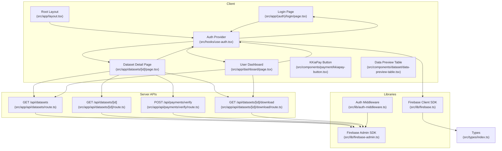
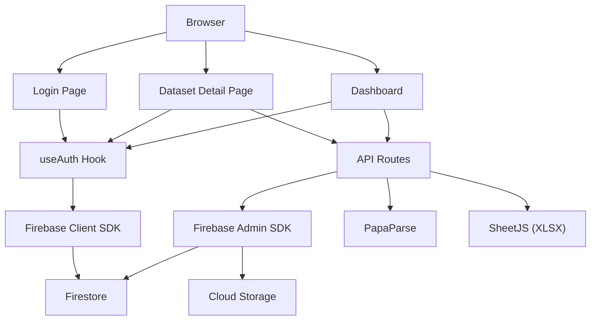
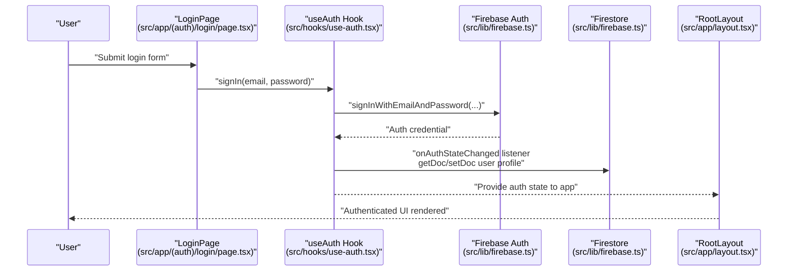
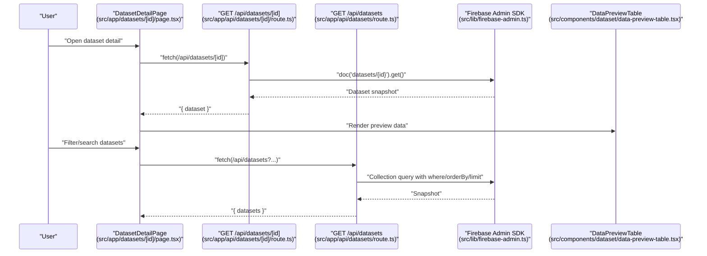
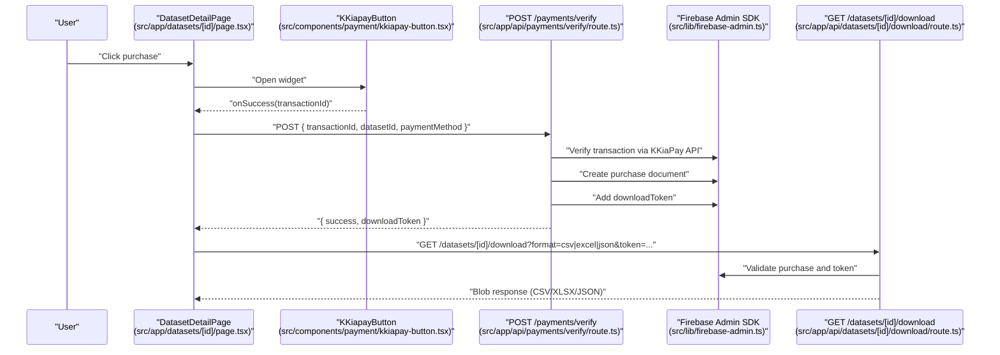
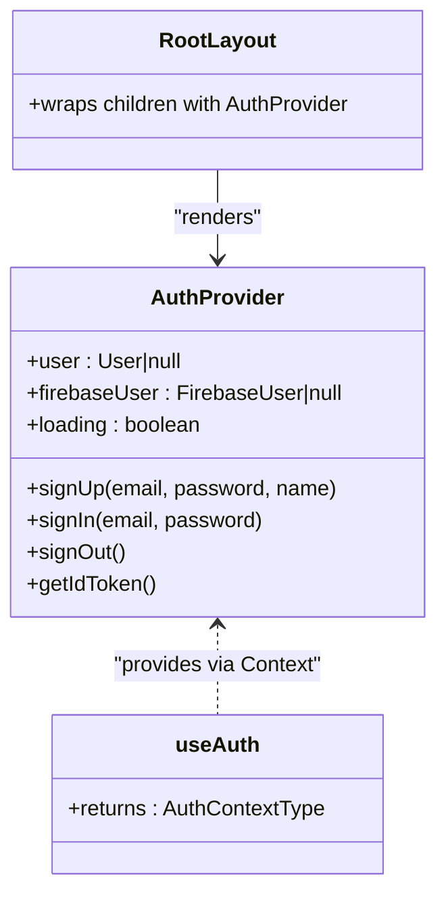
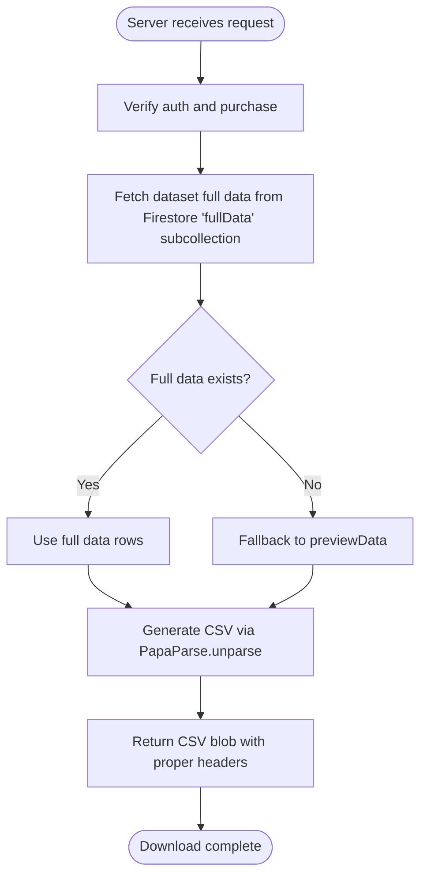
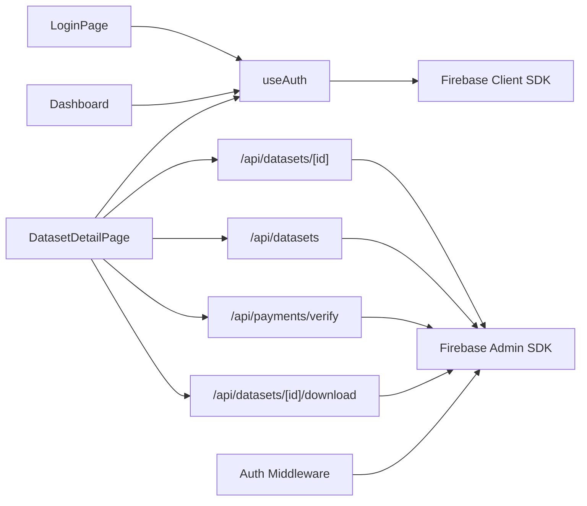

# Data Flow Patterns

<cite>
**Referenced Files in This Document**
- [src/lib/firebase.ts](file://src/lib/firebase.ts)
- [src/lib/firebase-admin.ts](file://src/lib/firebase-admin.ts)
- [src/lib/auth-middleware.ts](file://src/lib/auth-middleware.ts)
- [src/hooks/use-auth.tsx](file://src/hooks/use-auth.tsx)
- [src/app/layout.tsx](file://src/app/layout.tsx)
- [src/app/(auth)/login/page.tsx](file://src/app/(auth)/login/page.tsx)
- [src/app/datasets/[id]/page.tsx](file://src/app/datasets/[id]/page.tsx)
- [src/app/dashboard/page.tsx](file://src/app/dashboard/page.tsx)
- [src/app/api/datasets/route.ts](file://src/app/api/datasets/route.ts)
- [src/app/api/datasets/[id]/route.ts](file://src/app/api/datasets/[id]/route.ts)
- [src/app/api/datasets/[id]/download/route.ts](file://src/app/api/datasets/[id]/download/route.ts)
- [src/app/api/payments/verify/route.ts](file://src/app/api/payments/verify/route.ts)
- [src/components/payment/kkiapay-button.tsx](file://src/components/payment/kkiapay-button.tsx)
- [src/components/dataset/data-preview-table.tsx](file://src/components/dataset/data-preview-table.tsx)
- [src/types/index.ts](file://src/types/index.ts)
</cite>

## Table of Contents
1. [Introduction](#introduction)
2. [Project Structure](#project-structure)
3. [Core Components](#core-components)
4. [Architecture Overview](#architecture-overview)
5. [Detailed Component Analysis](#detailed-component-analysis)
6. [Dependency Analysis](#dependency-analysis)
7. [Performance Considerations](#performance-considerations)
8. [Troubleshooting Guide](#troubleshooting-guide)
9. [Conclusion](#conclusion)

## Introduction
This document explains the end-to-end data flow patterns across Datafrica’s application. It covers:
- Authentication from user login to local state and Firebase Auth
- Dataset retrieval from API routes to Firestore and client rendering
- Payment processing via KKiaPay to purchase verification and download token generation
- State management using React Context and custom hooks
- Data transformation from raw CSV to interactive previews
- Caching, loading states, and error propagation
- Performance optimizations for large datasets and efficient fetching

## Project Structure
The application follows a Next.js app directory structure with a clear separation between client pages, server API routes, shared libraries, and UI components. Authentication state is globally provided via a React Context, while API routes handle server-side Firestore operations and secure downloads.

**Diagram sources**
- [src/app/layout.tsx:32-45](file://src/app/layout.tsx#L32-L45)
- [src/hooks/use-auth.tsx:34-108](file://src/hooks/use-auth.tsx#L34-L108)
- [src/app/(auth)/login/page.tsx:14-98](file://src/app/(auth)/login/page.tsx#L14-L98)
- [src/app/datasets/[id]/page.tsx:29-382](file://src/app/datasets/[id]/page.tsx#L29-L382)
- [src/app/dashboard/page.tsx:32-313](file://src/app/dashboard/page.tsx#L32-L313)
- [src/app/api/datasets/route.ts:1-62](file://src/app/api/datasets/route.ts#L1-L62)
- [src/app/api/datasets/[id]/route.ts:1-29](file://src/app/api/datasets/[id]/route.ts#L1-L29)
- [src/app/api/payments/verify/route.ts:1-135](file://src/app/api/payments/verify/route.ts#L1-L135)
- [src/app/api/datasets/[id]/download/route.ts:1-148](file://src/app/api/datasets/[id]/download/route.ts#L1-L148)
- [src/lib/firebase.ts:1-22](file://src/lib/firebase.ts#L1-L22)
- [src/lib/firebase-admin.ts:1-50](file://src/lib/firebase-admin.ts#L1-L50)
- [src/lib/auth-middleware.ts:1-48](file://src/lib/auth-middleware.ts#L1-L48)
- [src/types/index.ts:1-90](file://src/types/index.ts#L1-L90)

**Section sources**
- [src/app/layout.tsx:32-45](file://src/app/layout.tsx#L32-L45)
- [src/lib/firebase.ts:1-22](file://src/lib/firebase.ts#L1-L22)
- [src/lib/firebase-admin.ts:1-50](file://src/lib/firebase-admin.ts#L1-L50)
- [src/lib/auth-middleware.ts:1-48](file://src/lib/auth-middleware.ts#L1-L48)
- [src/types/index.ts:1-90](file://src/types/index.ts#L1-L90)

## Core Components
- Authentication provider and hooks: Centralized state for Firebase user, Firestore profile, and actions (sign up, sign in, sign out, ID token retrieval).
- API routes: Server endpoints for listing datasets, fetching a single dataset, verifying payments, and generating downloads.
- Payment widget: KKiaPay integration with client-side SDK loading and success callback handling.
- Data preview component: Renders a limited preview of dataset rows and columns.
- Types: Strongly typed models for User, Dataset, Purchase, and DownloadToken.

Key implementation patterns:
- React Context with custom hook for global auth state and actions
- Firebase Client SDK for client auth and Firestore reads/writes
- Firebase Admin SDK for server-side Firestore operations and secure checks
- Auth middleware to verify Firebase ID tokens on protected routes
- Client-side data transformation using PapaParse for CSV generation

**Section sources**
- [src/hooks/use-auth.tsx:22-117](file://src/hooks/use-auth.tsx#L22-L117)
- [src/lib/firebase.ts:1-22](file://src/lib/firebase.ts#L1-L22)
- [src/lib/firebase-admin.ts:1-50](file://src/lib/firebase-admin.ts#L1-L50)
- [src/lib/auth-middleware.ts:1-48](file://src/lib/auth-middleware.ts#L1-L48)
- [src/components/payment/kkiapay-button.tsx:1-110](file://src/components/payment/kkiapay-button.tsx#L1-L110)
- [src/components/dataset/data-preview-table.tsx:1-76](file://src/components/dataset/data-preview-table.tsx#L1-L76)
- [src/types/index.ts:1-90](file://src/types/index.ts#L1-L90)

## Architecture Overview
The system separates concerns between client and server:
- Client handles UI, user interactions, and state via React Context
- Server APIs manage secure operations, Firestore queries, and file generation
- Firebase Auth secures client interactions; Firebase Admin SDK secures server operations

**Diagram sources**
- [src/app/(auth)/login/page.tsx:14-98](file://src/app/(auth)/login/page.tsx#L14-L98)
- [src/app/datasets/[id]/page.tsx:29-382](file://src/app/datasets/[id]/page.tsx#L29-L382)
- [src/app/dashboard/page.tsx:32-313](file://src/app/dashboard/page.tsx#L32-L313)
- [src/hooks/use-auth.tsx:34-108](file://src/hooks/use-auth.tsx#L34-L108)
- [src/lib/firebase.ts:1-22](file://src/lib/firebase.ts#L1-L22)
- [src/app/api/datasets/[id]/download/route.ts:1-148](file://src/app/api/datasets/[id]/download/route.ts#L1-L148)
- [src/lib/firebase-admin.ts:1-50](file://src/lib/firebase-admin.ts#L1-L50)
- [src/lib/firebase.ts:1-22](file://src/lib/firebase.ts#L1-L22)

## Detailed Component Analysis

### Authentication Data Flow
End-to-end flow from login to local state:
- User submits credentials on the login page
- The page calls the sign-in action from the auth hook
- The hook uses Firebase Auth to authenticate
- An auth state listener updates local state and synchronizes Firestore user profile
- The layout wraps the app with the auth provider so all pages share the state

**Diagram sources**
- [src/app/(auth)/login/page.tsx:14-98](file://src/app/(auth)/login/page.tsx#L14-L98)
- [src/hooks/use-auth.tsx:39-67](file://src/hooks/use-auth.tsx#L39-L67)
- [src/hooks/use-auth.tsx:84-86](file://src/hooks/use-auth.tsx#L84-L86)
- [src/lib/firebase.ts:18-20](file://src/lib/firebase.ts#L18-L20)
- [src/app/layout.tsx:38-44](file://src/app/layout.tsx#L38-L44)

**Section sources**
- [src/app/(auth)/login/page.tsx:14-98](file://src/app/(auth)/login/page.tsx#L14-L98)
- [src/hooks/use-auth.tsx:34-108](file://src/hooks/use-auth.tsx#L34-L108)
- [src/lib/firebase.ts:1-22](file://src/lib/firebase.ts#L1-L22)
- [src/app/layout.tsx:32-45](file://src/app/layout.tsx#L32-L45)

### Dataset Retrieval Flow
Client requests datasets and renders previews:
- The dataset detail page fetches dataset metadata from the single dataset API
- It optionally checks purchase eligibility by HEAD-checking the download endpoint
- The preview table component renders a subset of rows and columns for visibility

**Diagram sources**
- [src/app/datasets/[id]/page.tsx:43-59](file://src/app/datasets/[id]/page.tsx#L43-L59)
- [src/app/api/datasets/[id]/route.ts:6-28](file://src/app/api/datasets/[id]/route.ts#L6-L28)
- [src/app/api/datasets/route.ts:6-61](file://src/app/api/datasets/route.ts#L6-L61)
- [src/lib/firebase-admin.ts:37-42](file://src/lib/firebase-admin.ts#L37-L42)
- [src/components/dataset/data-preview-table.tsx:18-75](file://src/components/dataset/data-preview-table.tsx#L18-L75)

**Section sources**
- [src/app/datasets/[id]/page.tsx:43-59](file://src/app/datasets/[id]/page.tsx#L43-L59)
- [src/app/api/datasets/[id]/route.ts:1-29](file://src/app/api/datasets/[id]/route.ts#L1-L29)
- [src/app/api/datasets/route.ts:1-62](file://src/app/api/datasets/route.ts#L1-L62)
- [src/components/dataset/data-preview-table.tsx:1-76](file://src/components/dataset/data-preview-table.tsx#L1-L76)

### Payment Processing Flow (KKiaPay)
From initiation to download token:
- The user clicks the payment button; the widget loads and opens
- On success, the widget emits a transaction ID
- The page posts to the verification endpoint with the transaction ID and dataset ID
- The server verifies the payment via KKiaPay API (or dev auto-verification), records a purchase, and generates a download token
- The client receives the token and can download in any supported format

**Diagram sources**
- [src/app/datasets/[id]/page.tsx:84-120](file://src/app/datasets/[id]/page.tsx#L84-L120)
- [src/components/payment/kkiapay-button.tsx:38-80](file://src/components/payment/kkiapay-button.tsx#L38-L80)
- [src/app/api/payments/verify/route.ts:7-135](file://src/app/api/payments/verify/route.ts#L7-L135)
- [src/lib/firebase-admin.ts:30-49](file://src/lib/firebase-admin.ts#L30-L49)
- [src/app/api/datasets/[id]/download/route.ts:8-148](file://src/app/api/datasets/[id]/download/route.ts#L8-L148)

**Section sources**
- [src/app/datasets/[id]/page.tsx:84-120](file://src/app/datasets/[id]/page.tsx#L84-L120)
- [src/components/payment/kkiapay-button.tsx:1-110](file://src/components/payment/kkiapay-button.tsx#L1-L110)
- [src/app/api/payments/verify/route.ts:1-135](file://src/app/api/payments/verify/route.ts#L1-L135)
- [src/app/api/datasets/[id]/download/route.ts:1-148](file://src/app/api/datasets/[id]/download/route.ts#L1-L148)

### State Management Patterns (React Context + Custom Hooks)
- Global auth state: user, firebaseUser, loading, and actions are provided via a Context
- Components consume the hook to access state and trigger actions
- The layout ensures the provider wraps the entire app

**Diagram sources**
- [src/hooks/use-auth.tsx:34-108](file://src/hooks/use-auth.tsx#L34-L108)
- [src/app/layout.tsx:38-44](file://src/app/layout.tsx#L38-L44)

**Section sources**
- [src/hooks/use-auth.tsx:22-117](file://src/hooks/use-auth.tsx#L22-L117)
- [src/app/layout.tsx:32-45](file://src/app/layout.tsx#L32-L45)

### Data Transformation Pipeline (CSV to Interactive Preview)
- Server-side generation: The download route builds CSV using PapaParse.unparse
- Client-side preview: The preview table component slices rows/columns for readability and truncates long values

**Diagram sources**
- [src/app/api/datasets/[id]/download/route.ts:70-139](file://src/app/api/datasets/[id]/download/route.ts#L70-L139)
- [src/components/dataset/data-preview-table.tsx:18-75](file://src/components/dataset/data-preview-table.tsx#L18-L75)

**Section sources**
- [src/app/api/datasets/[id]/download/route.ts:1-148](file://src/app/api/datasets/[id]/download/route.ts#L1-L148)
- [src/components/dataset/data-preview-table.tsx:1-76](file://src/components/dataset/data-preview-table.tsx#L1-L76)

## Dependency Analysis
- Client depends on Firebase Client SDK for auth and Firestore
- Server depends on Firebase Admin SDK for secure operations and Firestore
- Auth middleware enforces token verification on protected routes
- Pages depend on API routes for dataset and purchase data
- Payment flow depends on external KKiaPay API in production and dev fallback logic

**Diagram sources**
- [src/app/(auth)/login/page.tsx:14-98](file://src/app/(auth)/login/page.tsx#L14-L98)
- [src/app/datasets/[id]/page.tsx:29-382](file://src/app/datasets/[id]/page.tsx#L29-L382)
- [src/app/dashboard/page.tsx:32-313](file://src/app/dashboard/page.tsx#L32-L313)
- [src/hooks/use-auth.tsx:34-108](file://src/hooks/use-auth.tsx#L34-L108)
- [src/lib/firebase.ts:1-22](file://src/lib/firebase.ts#L1-L22)
- [src/lib/firebase-admin.ts:1-50](file://src/lib/firebase-admin.ts#L1-L50)
- [src/lib/auth-middleware.ts:1-48](file://src/lib/auth-middleware.ts#L1-L48)
- [src/app/api/datasets/[id]/route.ts:1-29](file://src/app/api/datasets/[id]/route.ts#L1-L29)
- [src/app/api/datasets/route.ts:1-62](file://src/app/api/datasets/route.ts#L1-L62)
- [src/app/api/payments/verify/route.ts:1-135](file://src/app/api/payments/verify/route.ts#L1-L135)
- [src/app/api/datasets/[id]/download/route.ts:1-148](file://src/app/api/datasets/[id]/download/route.ts#L1-L148)

**Section sources**
- [src/lib/firebase.ts:1-22](file://src/lib/firebase.ts#L1-L22)
- [src/lib/firebase-admin.ts:1-50](file://src/lib/firebase-admin.ts#L1-L50)
- [src/lib/auth-middleware.ts:1-48](file://src/lib/auth-middleware.ts#L1-L48)
- [src/app/api/datasets/route.ts:1-62](file://src/app/api/datasets/route.ts#L1-L62)
- [src/app/api/datasets/[id]/route.ts:1-29](file://src/app/api/datasets/[id]/route.ts#L1-L29)
- [src/app/api/payments/verify/route.ts:1-135](file://src/app/api/payments/verify/route.ts#L1-L135)
- [src/app/api/datasets/[id]/download/route.ts:1-148](file://src/app/api/datasets/[id]/download/route.ts#L1-L148)

## Performance Considerations
- Efficient dataset listing:
  - Server-side filtering and ordering reduce payload size
  - Additional client-side filtering (price range and free text) is applied after initial query
- Preview optimization:
  - Preview table limits rows and columns to keep UI responsive
- Token-based downloads:
  - One-time-use tokens prevent abuse and enable short-lived access
- CSV generation:
  - PapaParse unparse is used server-side for fast conversion
- Loading states:
  - Skeleton loaders improve perceived performance during data fetches
- Caching:
  - Client-side memoization of purchase checks and token usage reduces redundant requests
- Large dataset handling:
  - Prefer pagination or virtualization for very large datasets
  - Serve previews first; defer full data until requested

[No sources needed since this section provides general guidance]

## Troubleshooting Guide
Common issues and their propagation:
- Authentication errors:
  - Login page displays toast messages for invalid credentials
  - Auth hook manages loading and error states during sign-in
- Purchase verification failures:
  - Verification endpoint returns structured errors for missing fields, duplicates, or payment mismatch
  - Dev mode allows auto-verification for testing
- Download failures:
  - Token validation and expiration checks prevent unauthorized access
  - HEAD check determines purchase state before enabling download
- Network and server errors:
  - API routes return 4xx/5xx with error messages
  - Client pages show toasts and gracefully handle failures

**Section sources**
- [src/app/(auth)/login/page.tsx:21-36](file://src/app/(auth)/login/page.tsx#L21-L36)
- [src/hooks/use-auth.tsx:39-67](file://src/hooks/use-auth.tsx#L39-L67)
- [src/app/api/payments/verify/route.ts:15-96](file://src/app/api/payments/verify/route.ts#L15-L96)
- [src/app/api/datasets/[id]/download/route.ts:38-68](file://src/app/api/datasets/[id]/download/route.ts#L38-L68)
- [src/app/datasets/[id]/page.tsx:134-142](file://src/app/datasets/[id]/page.tsx#L134-L142)

## Conclusion
Datafrica’s architecture cleanly separates client-side UX and state management from secure server-side operations. Authentication flows through Firebase Auth with a robust Context-based state model. Dataset retrieval leverages server-side Firestore queries and client-side previews. Payments integrate with KKiaPay and produce download tokens for secure delivery. Strong typing, middleware-based auth enforcement, and thoughtful UI feedback ensure reliability and usability across large datasets and complex workflows.