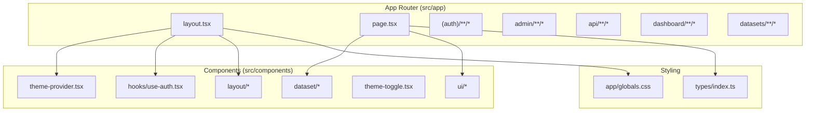
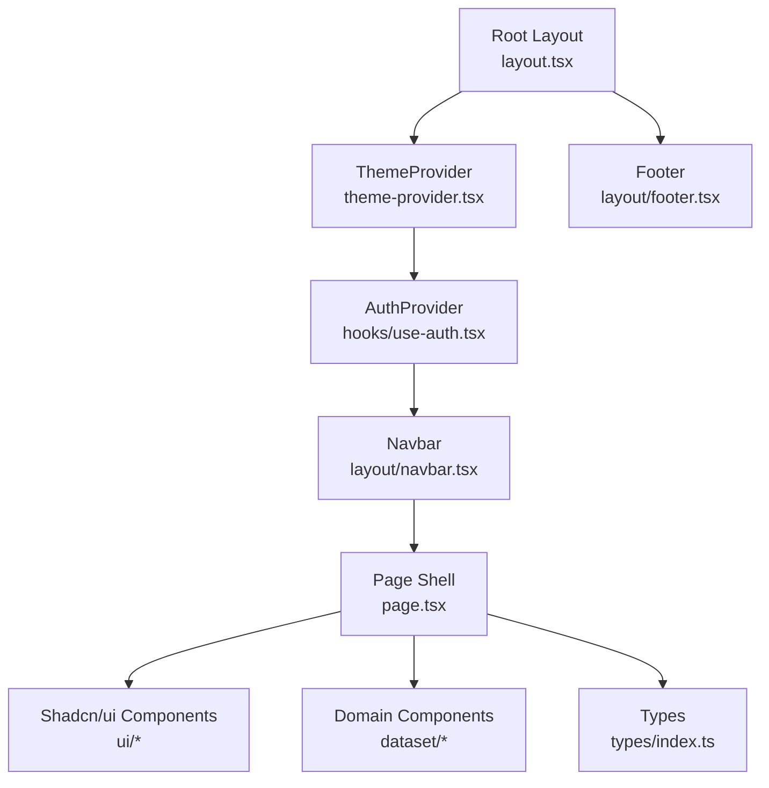
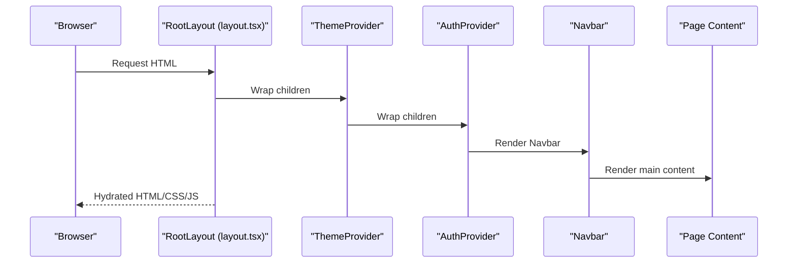
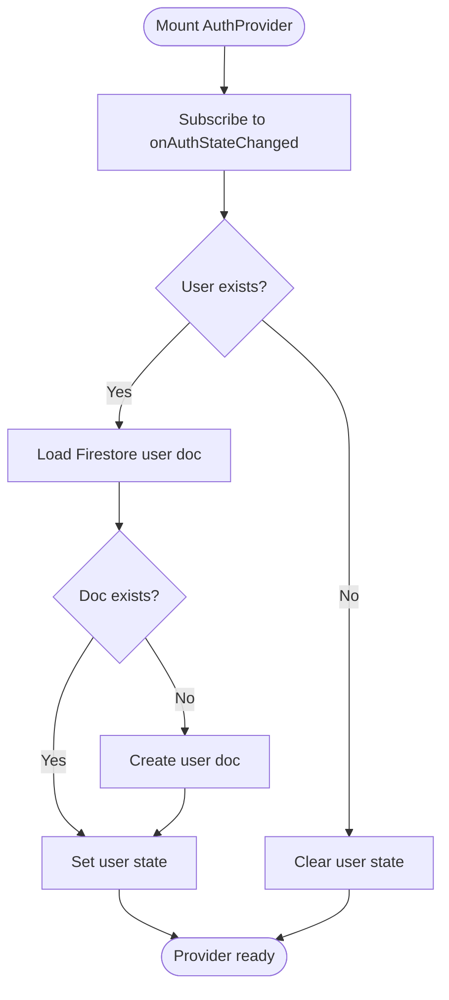
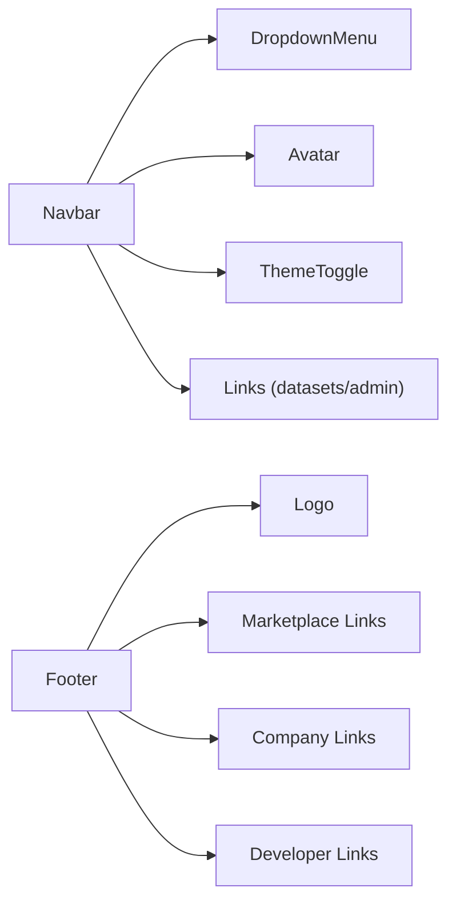
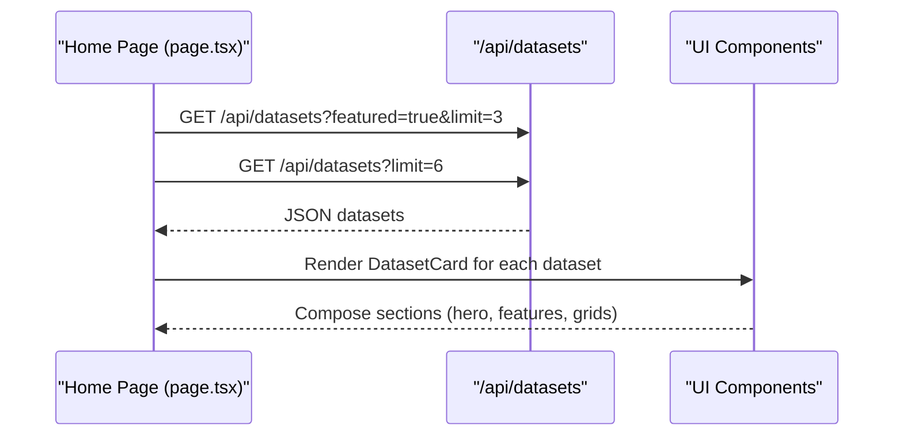
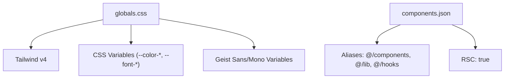
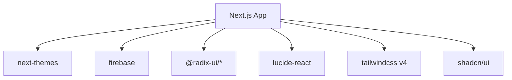

# Frontend Architecture

<cite>
**Referenced Files in This Document**
- [layout.tsx](file://src/app/layout.tsx)
- [page.tsx](file://src/app/page.tsx)
- [globals.css](file://src/app/globals.css)
- [theme-provider.tsx](file://src/components/theme-provider.tsx)
- [theme-toggle.tsx](file://src/components/theme-toggle.tsx)
- [navbar.tsx](file://src/components/layout/navbar.tsx)
- [footer.tsx](file://src/components/layout/footer.tsx)
- [use-auth.tsx](file://src/hooks/use-auth.tsx)
- [button.tsx](file://src/components/ui/button.tsx)
- [dropdown-menu.tsx](file://src/components/ui/dropdown-menu.tsx)
- [dataset-card.tsx](file://src/components/dataset/dataset-card.tsx)
- [index.ts](file://src/types/index.ts)
- [package.json](file://package.json)
- [next.config.ts](file://next.config.ts)
- [components.json](file://components.json)
</cite>

## Table of Contents
1. [Introduction](#introduction)
2. [Project Structure](#project-structure)
3. [Core Components](#core-components)
4. [Architecture Overview](#architecture-overview)
5. [Detailed Component Analysis](#detailed-component-analysis)
6. [Dependency Analysis](#dependency-analysis)
7. [Performance Considerations](#performance-considerations)
8. [Troubleshooting Guide](#troubleshooting-guide)
9. [Conclusion](#conclusion)
10. [Appendices](#appendices)

## Introduction
This document describes the frontend architecture of Datafrica’s Next.js application. It focuses on the App Router file-based routing model under src/app, the provider pattern for theme and authentication, the component hierarchy from the root layout to reusable UI components, the responsive design system using Tailwind CSS and shadcn/ui, navigation structure with Navbar and Footer, the font system using Geist and Geist Mono, client-side rendering and hydration considerations, and the global CSS architecture and styling conventions.

## Project Structure
The application follows Next.js App Router conventions with a strict file-based routing structure under src/app. The root layout composes providers and shared UI, while pages and API routes are organized by feature and route segment. Reusable UI components live under src/components, grouped by domain (e.g., dataset, layout, ui) and shared utilities under src/lib.

**Diagram sources**
- [layout.tsx:1-50](file://src/app/layout.tsx#L1-L50)
- [page.tsx:1-199](file://src/app/page.tsx#L1-L199)
- [theme-provider.tsx:1-13](file://src/components/theme-provider.tsx#L1-L13)
- [theme-toggle.tsx:1-27](file://src/components/theme-toggle.tsx#L1-L27)
- [navbar.tsx:1-167](file://src/components/layout/navbar.tsx#L1-L167)
- [footer.tsx:1-75](file://src/components/layout/footer.tsx#L1-L75)
- [use-auth.tsx:1-117](file://src/hooks/use-auth.tsx#L1-L117)
- [globals.css:1-120](file://src/app/globals.css#L1-L120)
- [dataset-card.tsx:1-81](file://src/components/dataset/dataset-card.tsx#L1-L81)
- [index.ts:1-90](file://src/types/index.ts#L1-L90)

**Section sources**
- [layout.tsx:1-50](file://src/app/layout.tsx#L1-L50)
- [page.tsx:1-199](file://src/app/page.tsx#L1-L199)

## Core Components
- Root layout: Defines metadata, fonts, providers, and the page shell with Navbar, main content area, Footer, and toast notifications.
- Providers: ThemeProvider wraps the app with next-themes, and AuthProvider manages authentication state and exposes user context.
- Navigation: Navbar handles desktop/mobile layouts, user menu, and theme toggle; Footer organizes links and branding.
- UI primitives: Shadcn/ui components (button, dropdown-menu) provide consistent, accessible building blocks.
- Domain components: DatasetCard renders dataset previews with category badges, pricing, and CTAs.
- Types: Strongly typed User, Dataset, Purchase, and DownloadToken models support type-safe development.

**Section sources**
- [layout.tsx:1-50](file://src/app/layout.tsx#L1-L50)
- [theme-provider.tsx:1-13](file://src/components/theme-provider.tsx#L1-L13)
- [use-auth.tsx:1-117](file://src/hooks/use-auth.tsx#L1-L117)
- [navbar.tsx:1-167](file://src/components/layout/navbar.tsx#L1-L167)
- [footer.tsx:1-75](file://src/components/layout/footer.tsx#L1-L75)
- [button.tsx:1-58](file://src/components/ui/button.tsx#L1-L58)
- [dropdown-menu.tsx:1-196](file://src/components/ui/dropdown-menu.tsx#L1-L196)
- [dataset-card.tsx:1-81](file://src/components/dataset/dataset-card.tsx#L1-L81)
- [index.ts:1-90](file://src/types/index.ts#L1-L90)

## Architecture Overview
The application uses a layered architecture:
- Routing layer: App Router segments map to pages and nested layouts.
- Provider layer: ThemeProvider and AuthProvider wrap the entire application to share state and theme preferences.
- UI layer: Shared components (buttons, dropdowns, cards) built with shadcn/ui and styled via Tailwind.
- Domain layer: Feature-specific components (e.g., DatasetCard) encapsulate presentation logic.
- Data layer: Authentication state and user context are managed via Firebase and exposed through a React context.

**Diagram sources**
- [layout.tsx:26-49](file://src/app/layout.tsx#L26-L49)
- [theme-provider.tsx:6-12](file://src/components/theme-provider.tsx#L6-L12)
- [use-auth.tsx:34-108](file://src/hooks/use-auth.tsx#L34-L108)
- [navbar.tsx:18-167](file://src/components/layout/navbar.tsx#L18-L167)
- [footer.tsx:4-75](file://src/components/layout/footer.tsx#L4-L75)
- [page.tsx:18-199](file://src/app/page.tsx#L18-L199)
- [button.tsx:1-58](file://src/components/ui/button.tsx#L1-L58)
- [dropdown-menu.tsx:1-196](file://src/components/ui/dropdown-menu.tsx#L1-L196)
- [dataset-card.tsx:14-81](file://src/components/dataset/dataset-card.tsx#L14-L81)
- [index.ts:3-28](file://src/types/index.ts#L3-L28)

## Detailed Component Analysis

### Root Layout and Providers
The root layout composes:
- Fonts: Geist (sans-serif) and Geist Mono (mono) injected via next/font/google and applied as CSS variables.
- Providers: ThemeProvider sets up light/dark/system themes; AuthProvider initializes Firebase auth state and user profile sync.
- Shell: Navbar, main content area, Footer, and Toaster for notifications.
- Hydration: suppressHydrationWarning is used to avoid mismatches during initial render.

**Diagram sources**
- [layout.tsx:26-49](file://src/app/layout.tsx#L26-L49)
- [theme-provider.tsx:6-12](file://src/components/theme-provider.tsx#L6-L12)
- [use-auth.tsx:34-108](file://src/hooks/use-auth.tsx#L34-L108)
- [navbar.tsx:18-167](file://src/components/layout/navbar.tsx#L18-L167)

**Section sources**
- [layout.tsx:1-50](file://src/app/layout.tsx#L1-L50)
- [theme-provider.tsx:1-13](file://src/components/theme-provider.tsx#L1-L13)
- [use-auth.tsx:1-117](file://src/hooks/use-auth.tsx#L1-L117)

### Authentication Provider Pattern
The AuthProvider:
- Subscribes to Firebase onAuthStateChanged to track login state.
- Loads or creates user profiles in Firestore, exposing a normalized User type.
- Provides sign-up, sign-in, sign-out, and ID token retrieval utilities.
- Ensures safe consumption via a custom hook useAuth with runtime validation.

**Diagram sources**
- [use-auth.tsx:39-67](file://src/hooks/use-auth.tsx#L39-L67)
- [use-auth.tsx:44-58](file://src/hooks/use-auth.tsx#L44-L58)

**Section sources**
- [use-auth.tsx:1-117](file://src/hooks/use-auth.tsx#L1-L117)

### Navigation Bar and Footer
- Navbar:
  - Displays logo and links to datasets and admin (conditional on role).
  - Desktop nav and mobile drawer with theme toggle and user actions.
  - Uses DropdownMenu, Avatar, and Button primitives.
- Footer:
  - Multi-column layout with links to marketplace, company, and developer resources.
  - Responsive grid and copyright information.

**Diagram sources**
- [navbar.tsx:18-167](file://src/components/layout/navbar.tsx#L18-L167)
- [dropdown-menu.tsx:1-196](file://src/components/ui/dropdown-menu.tsx#L1-L196)
- [theme-toggle.tsx:8-26](file://src/components/theme-toggle.tsx#L8-L26)
- [footer.tsx:4-75](file://src/components/layout/footer.tsx#L4-L75)

**Section sources**
- [navbar.tsx:1-167](file://src/components/layout/navbar.tsx#L1-L167)
- [footer.tsx:1-75](file://src/components/layout/footer.tsx#L1-L75)

### Home Page and Dataset Presentation
The home page:
- Fetches featured and recent datasets concurrently via /api/datasets.
- Renders hero, features, and dataset grids using DatasetCard.
- Handles loading and empty states gracefully.

**Diagram sources**
- [page.tsx:23-47](file://src/app/page.tsx#L23-L47)
- [dataset-card.tsx:14-81](file://src/components/dataset/dataset-card.tsx#L14-L81)

**Section sources**
- [page.tsx:1-199](file://src/app/page.tsx#L1-L199)
- [dataset-card.tsx:1-81](file://src/components/dataset/dataset-card.tsx#L1-L81)

### Global CSS and Design System
- Tailwind v4 with CSS variables for theme tokens.
- Shadcn/ui configured with RSC support and aliasing for components, utils, and hooks.
- Design tokens mapped to oklch color spaces and radius variables.
- Font variables applied at the root html element for consistent typography.

**Diagram sources**
- [globals.css:1-120](file://src/app/globals.css#L1-L120)
- [components.json:1-26](file://components.json#L1-L26)
- [layout.tsx:10-18](file://src/app/layout.tsx#L10-L18)

**Section sources**
- [globals.css:1-120](file://src/app/globals.css#L1-L120)
- [components.json:1-26](file://components.json#L1-L26)
- [layout.tsx:1-50](file://src/app/layout.tsx#L1-L50)

## Dependency Analysis
External dependencies relevant to frontend architecture:
- Next.js App Router and server/client directives.
- next-themes for theme switching and persistence.
- Firebase and Firebase Admin for authentication and user storage.
- Radix UI primitives (Avatar, Dropdown Menu, Select, etc.) for accessible UI.
- lucide-react for icons.
- Tailwind CSS v4 and shadcn/ui for styling and component primitives.

**Diagram sources**
- [package.json:11-38](file://package.json#L11-L38)
- [components.json:1-26](file://components.json#L1-L26)

**Section sources**
- [package.json:1-51](file://package.json#L1-L51)
- [components.json:1-26](file://components.json#L1-L26)

## Performance Considerations
- Client-side rendering: Pages and components use "use client" where state or effects are needed (e.g., Navbar, Home Page, ThemeToggle).
- Hydration: Root layout uses suppressHydrationWarning to prevent mismatches during initial render; ensure no conflicting server-rendered content in providers.
- Concurrent data fetching: Home page fetches featured and recent datasets concurrently to reduce load time.
- CSS variables: Tailwind CSS variables minimize repaints and improve theme transitions.
- Component reuse: Shadcn/ui primitives and domain components reduce bundle size and improve maintainability.

[No sources needed since this section provides general guidance]

## Troubleshooting Guide
- Hydration warnings: Verify that only client components render dynamic content and that providers are wrapped around the entire app.
- Authentication state: Ensure onAuthStateChanged subscription is initialized and user documents are created in Firestore.
- Theme switching: Confirm next-themes is configured and ThemeToggle updates the theme correctly.
- Routing: Validate that route segments match the intended pages and nested layouts.

**Section sources**
- [layout.tsx:35-35](file://src/app/layout.tsx#L35-L35)
- [use-auth.tsx:39-67](file://src/hooks/use-auth.tsx#L39-L67)
- [theme-toggle.tsx:8-26](file://src/components/theme-toggle.tsx#L8-L26)

## Conclusion
Datafrica’s frontend leverages Next.js App Router for structured routing, a robust provider pattern for theme and authentication, and a cohesive design system using Tailwind CSS and shadcn/ui. The root layout composes providers and shared UI, while pages and domain components encapsulate presentation logic. The font system, responsive design, and global CSS architecture deliver a consistent, accessible experience across devices.

[No sources needed since this section summarizes without analyzing specific files]

## Appendices

### Routing Model and File-Based Structure
- App Router segments define pages and nested layouts.
- Feature-based grouping under src/app enables scalable organization.
- API routes under src/app/api handle backend interactions.

**Section sources**
- [layout.tsx:1-50](file://src/app/layout.tsx#L1-L50)
- [page.tsx:1-199](file://src/app/page.tsx#L1-L199)

### Client-Side Rendering and SSR Considerations
- "use client" directive marks components that require client state or effects.
- Root layout suppresses hydration warnings for seamless transitions.
- Providers initialize on the client to manage theme and auth state.

**Section sources**
- [layout.tsx:1-50](file://src/app/layout.tsx#L1-L50)
- [theme-provider.tsx:1-13](file://src/components/theme-provider.tsx#L1-L13)
- [use-auth.tsx:1-117](file://src/hooks/use-auth.tsx#L1-L117)

### Font System and Typography
- Geist and Geist Mono fonts are imported and applied as CSS variables.
- Typography tokens are consistently referenced across components.

**Section sources**
- [layout.tsx:10-18](file://src/app/layout.tsx#L10-L18)
- [globals.css:5-44](file://src/app/globals.css#L5-L44)

### Global CSS Architecture
- Tailwind v4 with CSS variables for theme tokens.
- Design tokens mapped to oklch color spaces and radius variables.
- Aliases configured for components, utils, and hooks.

**Section sources**
- [globals.css:1-120](file://src/app/globals.css#L1-L120)
- [components.json:6-21](file://components.json#L6-L21)