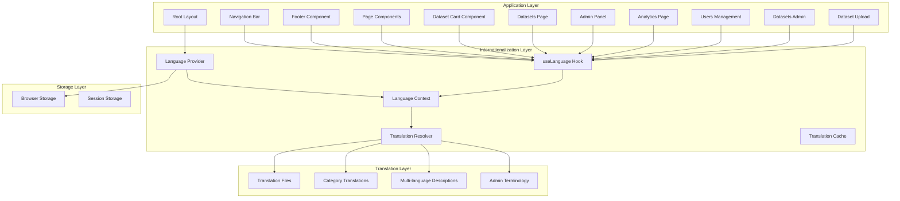
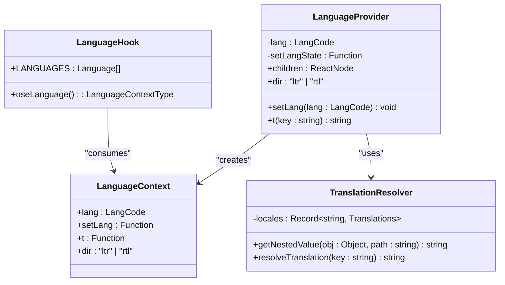
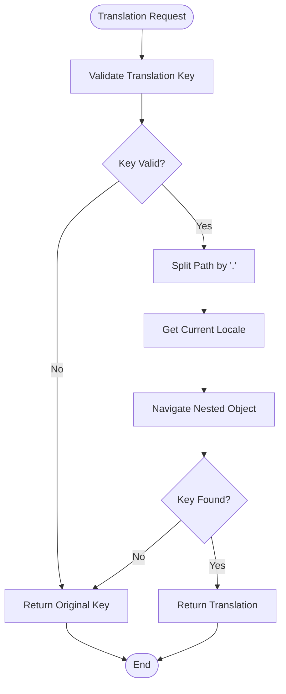
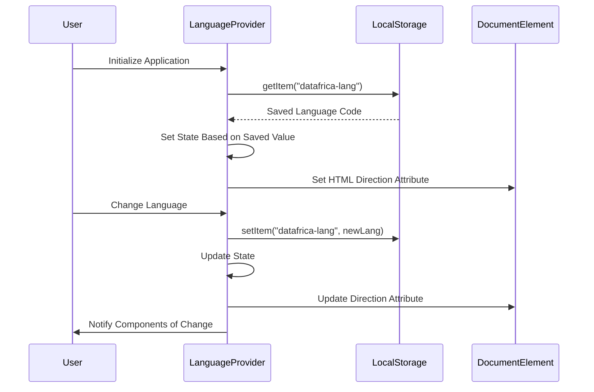
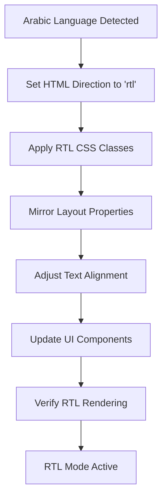

# Internationalization System

<cite>
**Referenced Files in This Document**
- [use-language.tsx](file://src/hooks/use-language.tsx)
- [layout.tsx](file://src/app/layout.tsx)
- [navbar.tsx](file://src/components/layout/navbar.tsx)
- [footer.tsx](file://src/components/layout/footer.tsx)
- [page.tsx](file://src/app/page.tsx)
- [login/page.tsx](file://src/app/(auth)/login/page.tsx)
- [dataset-detail-page.tsx](file://src/app/datasets/[id]/page.tsx)
- [dashboard/page.tsx](file://src/app/dashboard/page.tsx)
- [dataset-card.tsx](file://src/components/dataset/dataset-card.tsx)
- [datasets-page.tsx](file://src/app/datasets/page.tsx)
- [admin-page.tsx](file://src/app/admin/page.tsx)
- [admin-analytics-page.tsx](file://src/app/admin/analytics/page.tsx)
- [admin-datasets-page.tsx](file://src/app/admin/datasets/page.tsx)
- [admin-users-page.tsx](file://src/app/admin/users/page.tsx)
- [admin-upload-page.tsx](file://src/app/admin/upload/page.tsx)
- [en.json](file://src/locales/en.json)
- [fr.json](file://src/locales/fr.json)
- [es.json](file://src/locales/es.json)
- [pt.json](file://src/locales/pt.json)
- [ar.json](file://src/locales/ar.json)
- [index.ts](file://src/types/index.ts)
</cite>

## Update Summary
**Changes Made**
- Enhanced admin interface internationalization with comprehensive translation coverage across all five supported locales
- Expanded translation keys with 45+ new admin-specific terms covering user management, dataset administration, analytics reporting, and system controls
- Added comprehensive multi-language support for admin panel terminology including payment settings, user roles, and system analytics
- Enhanced dataset card internationalization with category label translations and dynamic description handling
- Integrated useLanguage hook across all UI components for comprehensive multi-language support
- Implemented advanced translation key resolution with fallback mechanisms for missing translations
- Added comprehensive multi-language support for dataset filtering, search, and display functionality
- Enhanced language provider with improved hydration handling and RTL direction management

## Table of Contents
1. [Introduction](#introduction)
2. [System Architecture](#system-architecture)
3. [Core Components](#core-components)
4. [Translation Management](#translation-management)
5. [Language Provider Implementation](#language-provider-implementation)
6. [UI Integration Patterns](#ui-integration-patterns)
7. [RTL Language Support](#rtl-language-support)
8. [Admin Interface Internationalization](#admin-interface-internationalization)
9. [Usage Examples](#usage-examples)
10. [Best Practices](#best-practices)
11. [Troubleshooting Guide](#troubleshooting-guide)
12. [Conclusion](#conclusion)

## Introduction

The Datafrica internationalization (i18n) system provides comprehensive multilingual support for a diverse African audience, enabling users to interact with the platform in their preferred language. The system supports five languages: English, French, Portuguese, Spanish, and Arabic, with right-to-left (RTL) directionality support for Arabic.

The internationalization system is built on a React-based architecture that integrates seamlessly with Next.js applications, providing dynamic language switching, translation key resolution, and automatic RTL directionality adjustment. The system serves the unique needs of African markets while maintaining consistency across all user interface elements.

**Updated** Enhanced with expanded admin interface internationalization covering user management, dataset administration, analytics reporting, and system controls. The system now includes comprehensive translation coverage for all administrative functions across all five supported locales, with 45+ new translation keys specifically designed for administrative workflows.

## System Architecture

The internationalization system follows a layered architecture pattern that separates concerns between language management, translation resolution, and UI integration.



**Diagram sources**
- [layout.tsx:28-54](file://src/app/layout.tsx#L28-L54)
- [use-language.tsx:49-77](file://src/hooks/use-language.tsx#L49-L77)
- [dataset-card.tsx:13-82](file://src/components/dataset/dataset-card.tsx#L13-L82)
- [admin-page.tsx:39-194](file://src/app/admin/page.tsx#L39-L194)

The architecture ensures that language preferences are persisted across sessions, translations are resolved efficiently, and UI components receive localized content dynamically with comprehensive support for dataset-specific translations and admin interface terminology.

## Core Components

### Language Provider System

The Language Provider serves as the central hub for managing application-wide language state and translation functionality.



**Diagram sources**
- [use-language.tsx:27-85](file://src/hooks/use-language.tsx#L27-L85)

The provider manages language state, persists user preferences, and provides translation functions to all child components through React Context. It now includes enhanced hydration handling and improved RTL direction management.

### Supported Languages

The system currently supports five languages with comprehensive coverage:

| Language | Code | Native Name | Region | RTL Support |
|----------|------|-------------|--------|-------------|
| English | en | English | Global | No |
| French | fr | Français | West/Central Africa | No |
| Portuguese | pt | Português | West/Central Africa | No |
| Spanish | es | Español | West/Central Africa | No |
| Arabic | ar | العربية | North Africa | Yes |

**Section sources**
- [use-language.tsx:17-23](file://src/hooks/use-language.tsx#L17-L23)
- [use-language.tsx:15](file://src/hooks/use-language.tsx#L15)

## Translation Management

### Translation File Structure

Each language maintains its own JSON translation file organized into semantic groups for maintainability and scalability.

```mermaid
erDiagram
TRANSLATION_FILE {
string nav_datasets
string nav_businessData
string nav_leads
string nav_admin
string hero_badge
string hero_subtitle
string stats_datasets
string features_verified
string sections_featured
string auth_welcomeBack
string dashboard_account
string dataset_records
string footer_desc
string common_loading
string theme_light
}
ADMIN_TRANSLATIONS {
string administration
string adminPanel
string manageDesc
string uploadDataset
string addNewData
string manageUsers
string userAccounts
string payments
string paymentProviders
string analytics
string salesAnalytics
string totalRevenue
string totalSales
string totalUsers
string datasets
string recentSales
string backToAdmin
string email
string name
string role
string joined
string actions
string makeAdmin
string makeUser
string revokeAdmin
string csvFile
string csvHelp
string title
string description
string descPlaceholder
string descLangHelp
string category
string country
string price
string currency
string previewRows
string previewRowsHelp
string allowDownload
string allowDownloadDesc
string featuredDataset
string featuredDesc
string uploadingProcessing
string uploadSuccess
string uploadSuccessDesc
string uploadAnother
string select
string addToMarketplace
string paymentSettings
string configureProviders
string activePaymentProvider
string paydunyaConfig
string kkiapayConfig
string masterKey
string privateKey
string publicKey
string token
string mode
string testSandbox
string liveProduction
string publicApiKey
string privateApiKey
string secretKey
string environment
string sandboxTest
string production
string saveSettings
string saving
string webhookUrl
string failedLoadPayments
string revenueCFA
string topSellingDatasets
string salesCount
string noAnalytics
string noAnalyticsDesc
string users
string totalUsersCount
string adminCount
string disabledCount
string searchUsers
string allUsers
string adminsOnly
string usersOnly
string provider
string purchasesCol
string status
string lastLogin
string roleUpdated
string userDisabled
string userEnabled
string disabled
string active
string enable
string disable
string manageDatasets
string editDeleteData
string datasetsTotal
string searchDatasets
string editDataset
string datasetUpdated
string datasetDeleted
string confirmDelete
string noDatasetsFound
string recordsCol
string salesCol
string revenueCol
string access
string free
string removeFeatured
string makeFeatured
string datasetsSmall
string monthlyRevenue
string userGrowth
string categoryBreakdown
string paymentBreakdown
string transactions
string datasetsByCountry
string monthlySales
}
NAVIGATION {
string datasets
string businessData
string leads
string admin
string dashboard
string adminPanel
string signOut
string signIn
string startTrial
}
HERO {
string badge
string badgeCountries
string title
string titleHighlight
string subtitle
string browseBtn
string trialBtn
string noCreditCard
}
DATASET_TRANSLATIONS {
string records
string columns
string preview
string viewOnly
string download
string purchaseToUnlock
string showing
string of
string purchaseToSee
string price
string payWith
string processing
string alreadyPurchased
string dataFormat
string lastUpdated
string country
string category
string filterBy
string allCategories
string allCountries
string search
string noResults
string noResultsDesc
string browseTitle
string browseSubtitle
string found
string clearFilters
string clear
string backToDatasets
string notFound
string notFoundDesc
string oneTimePurchase
string purchased
string downloadYour
string downloadCSV
string downloadExcel
string downloadJSON
string viewOnlyDesc
string signInToPurchase
string needAccount
string securePayment
string format
string onlineView
string access
string dataColumns
string dataPreview
string secureProcessing
string dataProtected
string featured
string ratings
string viewDataset
string previewDataLink
}
TRANSLATION_FILE ||--|| NAVIGATION : "contains"
TRANSLATION_FILE ||--|| HERO : "contains"
TRANSLATION_FILE ||--|| DATASET_TRANSLATIONS : "contains"
ADMIN_TRANSLATIONS ||--|| NAVIGATION : "extends"
ADMIN_TRANSLATIONS ||--|| DATASET_TRANSLATIONS : "extends"
```



**Diagram sources**
- [en.json:1-319](file://src/locales/en.json#L1-L319)

### Translation Key Resolution

The system implements a sophisticated nested key resolution mechanism that handles complex translation hierarchies and provides fallback mechanisms for missing translations.



**Diagram sources**
- [use-language.tsx:36-47](file://src/hooks/use-language.tsx#L36-L47)

**Section sources**
- [use-language.tsx:36-47](file://src/hooks/use-language.tsx#L36-L47)
- [en.json:1-319](file://src/locales/en.json#L1-L319)

## Language Provider Implementation

### State Management

The Language Provider implements robust state management with persistence and hydration capabilities.



**Diagram sources**
- [use-language.tsx:49-77](file://src/hooks/use-language.tsx#L49-L77)

**Updated** Enhanced with synchronous localStorage reading during initialization to eliminate flash of English text and improved hydration handling. The provider now includes better RTL detection and direction attribute management during hydration.

### Language Selection Interface

The system provides an intuitive dropdown interface for language selection with visual indicators and keyboard navigation support.

**Section sources**
- [use-language.tsx:49-77](file://src/hooks/use-language.tsx#L49-L77)
- [navbar.tsx:57-76](file://src/components/layout/navbar.tsx#L57-L76)

## UI Integration Patterns

### Component-Level Integration

Components integrate with the internationalization system through the `useLanguage` hook, which provides access to translation functions and language state.

```mermaid
graph LR
subgraph "Component Integration"
Hook[useLanguage Hook]
TFunc[t() Function]
LangState[Language State]
DirState[Direction State]
End
subgraph "Translation Usage"
DatasetCard[Dataset Card Component]
DatasetsPage[Datasets Page]
Navbar[Navigation Bar]
Footer[Footer Component]
Component[UI Component]
Translation[Localized Text]
DynamicContent[Dynamic Content]
end
Hook --> TFunc
Hook --> LangState
Hook --> DirState
TFunc --> Translation
LangState --> Component
DirState --> Component
Translation --> DynamicContent
```

**Diagram sources**
- [navbar.tsx:21](file://src/components/layout/navbar.tsx#L21)
- [page.tsx:21](file://src/app/page.tsx#L21)
- [dataset-card.tsx:14](file://src/components/dataset/dataset-card.tsx#L14)

### Comprehensive Dataset Internationalization

The system now provides comprehensive internationalization support for dataset components, including category translations and dynamic description handling.

**Section sources**
- [navbar.tsx:171-182](file://src/components/layout/navbar.tsx#L171-L182)
- [footer.tsx:6-56](file://src/components/layout/footer.tsx#L6-L56)
- [dataset-card.tsx:23-25](file://src/components/dataset/dataset-card.tsx#L23-L25)
- [datasets-page.tsx:77](file://src/app/datasets/page.tsx#L77)

## RTL Language Support

### Arabic Language Implementation

The system provides comprehensive right-to-left (RTL) support for Arabic language users, ensuring proper text direction and layout mirroring.



**Diagram sources**
- [use-language.tsx:62-64](file://src/hooks/use-language.tsx#L62-L64)

**Updated** Enhanced with improved RTL detection and direction attribute management during hydration.

### Direction-Aware Components

Components automatically adapt their layout and styling based on the current language direction, ensuring consistent user experience across all supported languages.

**Section sources**
- [use-language.tsx:62-70](file://src/hooks/use-language.tsx#L62-L70)
- [layout.tsx:34-38](file://src/app/layout.tsx#L34-L38)

## Admin Interface Internationalization

### Comprehensive Admin Translation Coverage

The expanded internationalization system now provides complete translation coverage for all administrative functions across all five supported locales. The admin interface includes comprehensive terminology for user management, dataset administration, analytics reporting, and system controls.

#### User Management Interface

The admin user management interface includes complete translation support for user roles, account status, authentication providers, and administrative actions.

| Admin Feature | Translation Keys | Purpose |
|---------------|------------------|---------|
| User List | `admin.manageUsers`, `admin.userAccounts`, `admin.searchUsers` | User listing and search functionality |
| Role Management | `admin.makeAdmin`, `admin.revokeAdmin`, `admin.role` | User role assignment and management |
| Account Status | `admin.enable`, `admin.disable`, `admin.status` | Account activation and deactivation |
| Authentication Providers | `admin.provider`, `admin.google`, `admin.email` | Provider identification and management |
| Purchase Statistics | `admin.purchasesCol`, `admin.purchaseCount` | User purchase history tracking |

#### Dataset Administration Interface

The dataset administration interface provides comprehensive translation support for dataset management, categorization, and configuration.

| Dataset Feature | Translation Keys | Purpose |
|-----------------|------------------|---------|
| Dataset Management | `admin.manageDatasets`, `admin.editDataset`, `admin.deleteDataset` | Dataset CRUD operations |
| Dataset Configuration | `admin.title`, `admin.description`, `admin.category` | Dataset metadata management |
| Access Control | `admin.allowDownload`, `admin.featuredDataset`, `admin.previewRows` | Dataset access and visibility settings |
| Analytics | `admin.recordsCol`, `admin.salesCol`, `admin.revenueCol` | Dataset performance metrics |

#### Analytics Reporting Interface

The analytics reporting interface includes complete translation support for revenue tracking, user growth, category breakdown, and payment methods.

| Analytics Feature | Translation Keys | Purpose |
|-------------------|------------------|---------|
| Revenue Tracking | `admin.totalRevenue`, `admin.revenueCFA`, `admin.monthlyRevenue` | Financial performance monitoring |
| User Analytics | `admin.userGrowth`, `admin.totalUsers`, `admin.adminCount` | User engagement and growth metrics |
| Category Analysis | `admin.categoryBreakdown`, `admin.topSellingDatasets` | Dataset category performance |
| Payment Methods | `admin.paymentBreakdown`, `admin.paymentSettings` | Payment method analytics |

#### Payment Settings Interface

The payment settings interface provides comprehensive translation support for configuring payment providers, API keys, and webhook URLs.

| Payment Feature | Translation Keys | Purpose |
|-----------------|------------------|---------|
| Provider Configuration | `admin.paymentSettings`, `admin.configureProviders`, `admin.activePaymentProvider` | Payment provider management |
| PayDunya Configuration | `admin.paydunyaConfig`, `admin.masterKey`, `admin.privateKey` | PayDunya API configuration |
| KKiaPay Configuration | `admin.kkiapayConfig`, `admin.publicKey`, `admin.secretKey` | KKiaPay API configuration |
| Environment Settings | `admin.environment`, `admin.sandboxTest`, `admin.production` | Environment and mode configuration |

#### Upload Interface

The dataset upload interface includes complete translation support for CSV file uploads, multi-language descriptions, and dataset configuration.

| Upload Feature | Translation Keys | Purpose |
|----------------|------------------|---------|
| File Upload | `admin.csvFile`, `admin.csvHelp`, `admin.uploadDataset` | CSV file upload and validation |
| Multi-language Descriptions | `admin.description`, `admin.descPlaceholder`, `admin.descLangHelp` | Multi-language description management |
| Dataset Configuration | `admin.title`, `admin.category`, `admin.country`, `admin.price` | Dataset metadata configuration |
| Preview Settings | `admin.previewRows`, `admin.previewRowsHelp`, `admin.featuredDataset` | Dataset preview and visibility settings |

**Section sources**
- [admin-page.tsx:39-194](file://src/app/admin/page.tsx#L39-L194)
- [admin-analytics-page.tsx:138-487](file://src/app/admin/analytics/page.tsx#L138-L487)
- [admin-datasets-page.tsx:68-527](file://src/app/admin/datasets/page.tsx#L68-L527)
- [admin-users-page.tsx:44-376](file://src/app/admin/users/page.tsx#L44-L376)
- [admin-upload-page.tsx:19-352](file://src/app/admin/upload/page.tsx#L19-L352)

## Usage Examples

### Basic Translation Usage

Components use the translation function to render localized content throughout the application.

### Enhanced Dataset Card Internationalization

Dataset cards now feature comprehensive internationalization with category label translations and dynamic description handling.

```typescript
// Enhanced dataset card with internationalization
const translatedCategory = t(`categories.${dataset.category}`) !== `categories.${dataset.category}`
  ? t(`categories.${dataset.category}`)
  : dataset.category;

const description = dataset.descriptions?.[lang] || dataset.description;
```

### Advanced Dataset Filtering

The datasets page demonstrates comprehensive translation integration for filtering, search, and display functionality.

### Authentication Page Localization

Authentication forms demonstrate comprehensive translation coverage for user registration and login flows.

### Dataset Page Internationalization

Dataset pages showcase translation usage for pricing information, feature descriptions, and user interface elements.

### Admin Interface Localization

Admin interfaces demonstrate comprehensive translation coverage for user management, dataset administration, analytics reporting, and system controls across all five supported locales.

**Section sources**
- [login/page.tsx:59-127](file://src/app/(auth)/login/page.tsx#L59-L127)
- [dataset-detail-page.tsx:341-463](file://src/app/datasets/[id]/page.tsx#L341-L463)
- [dataset-card.tsx:23-25](file://src/components/dataset/dataset-card.tsx#L23-L25)
- [datasets-page.tsx:77](file://src/app/datasets/page.tsx#L77)
- [admin-page.tsx:76-194](file://src/app/admin/page.tsx#L76-L194)

## Best Practices

### Translation Key Organization

- Use semantic grouping for translation keys (nav, hero, stats, features, sections, auth, dashboard, dataset, footer, common, theme, admin)
- Maintain consistent key naming conventions across all language files
- Avoid hardcoding strings directly in components; always use translation keys
- Implement fallback mechanisms for missing translations using the key validation pattern
- Organize admin-specific translations under the `admin` namespace for maintainability

### Performance Optimization

- Implement lazy loading for translation files to minimize initial bundle size
- Cache frequently accessed translations in memory
- Use efficient key resolution algorithms for nested object traversal
- Leverage static imports for translation files to improve build performance

### Accessibility Considerations

- Ensure proper ARIA labels for language switchers
- Maintain sufficient color contrast for all language variants
- Test with screen readers across different languages
- Implement proper RTL layout support for Arabic language

### Multi-language Description Handling

- Use the descriptions object pattern for multi-language dataset descriptions
- Implement fallback to default description when language-specific content is unavailable
- Ensure consistent category translation across all components
- Validate admin interface translations for all supported locales

### Admin Interface Best Practices

- Maintain separate translation groups for admin-specific terminology
- Ensure consistent terminology across user management, dataset administration, and analytics interfaces
- Provide clear translation keys for dynamic content like counts and statistics
- Test admin interface translations with real data scenarios

## Troubleshooting Guide

### Common Issues and Solutions

**Missing Translation Keys**: When a translation key is not found, the system returns the original key as fallback text. Check translation files for missing keys.

**Language Persistence Problems**: If language preferences are not saved, verify browser storage permissions and local storage availability.

**RTL Layout Issues**: For Arabic language, ensure proper CSS direction properties and test layout rendering across different screen sizes.

**Translation Performance**: Monitor translation resolution performance for deeply nested keys and optimize key structure if necessary.

**Dataset Category Translation Issues**: Verify that category keys match between dataset data and translation files.

**Admin Interface Translation Issues**: Ensure all admin-specific translation keys are properly defined in all five language files.

**Multi-language Description Issues**: Verify that dataset description objects contain entries for all supported languages.

### Debugging Tools

- Enable development mode to see translation key warnings
- Use browser developer tools to inspect translation function behavior
- Monitor console for language switching errors
- Test dataset card rendering with various category values
- Validate admin interface translations across all supported locales

**Section sources**
- [use-language.tsx:42-47](file://src/hooks/use-language.tsx#L42-L47)
- [use-language.tsx:82-85](file://src/hooks/use-language.tsx#L82-L85)

## Conclusion

The Datafrica internationalization system provides a robust, scalable foundation for supporting multiple African languages while maintaining excellent user experience. The system's architecture ensures efficient translation resolution, persistent language preferences, and comprehensive RTL support for Arabic users.

Key strengths of the implementation include:

- **Comprehensive Language Coverage**: Support for five major African languages with proper localization
- **Enhanced Dataset Internationalization**: Category label translations and dynamic description handling
- **Expanded Admin Interface Support**: Complete translation coverage for user management, dataset administration, analytics, and system controls
- **Efficient Translation Resolution**: Optimized key lookup with fallback mechanisms
- **Persistent Language Preferences**: Seamless user experience across sessions
- **RTL Language Support**: Full right-to-left layout adaptation for Arabic
- **Component Integration**: Easy-to-use hooks and context for seamless UI integration
- **Multi-language Description Support**: Advanced handling of dataset descriptions in multiple languages
- **45+ New Translation Keys**: Comprehensive admin interface terminology across all supported locales

**Updated** Recent enhancements include expanded admin interface internationalization with comprehensive translation coverage for user management, dataset administration, analytics reporting, and system controls. The system now provides complete multi-language support for administrative workflows across all five supported locales, with 45+ new translation keys specifically designed for administrative functions.

The system is designed for future expansion, allowing for additional languages and advanced features like pluralization, gender-specific translations, and contextual variations. The modular architecture ensures maintainability and scalability as the application grows and evolves to serve an increasingly diverse African user base.