# Authentication Middleware

<cite>
**Referenced Files in This Document**
- [auth-middleware.ts](file://src/lib/auth-middleware.ts)
- [firebase-admin.ts](file://src/lib/firebase-admin.ts)
- [firebase.ts](file://src/lib/firebase.ts)
- [use-auth.tsx](file://src/hooks/use-auth.tsx)
- [layout.tsx](file://src/app/layout.tsx)
- [route.ts](file://src/app/api/admin/analytics/route.ts)
- [route.ts](file://src/app/api/admin/upload/route.ts)
- [route.ts](file://src/app/api/admin/users/route.ts)
- [route.ts](file://src/app/api/datasets/[id]/download/route.ts)
- [route.ts](file://src/app/api/datasets/[id]/route.ts)
- [route.ts](file://src/app/api/datasets/route.ts)
- [route.ts](file://src/app/api/payments/verify/route.ts)
- [route.ts](file://src/app/api/user/purchases/route.ts)
- [index.ts](file://src/types/index.ts)
</cite>

## Table of Contents
1. [Introduction](#introduction)
2. [Project Structure](#project-structure)
3. [Core Components](#core-components)
4. [Architecture Overview](#architecture-overview)
5. [Detailed Component Analysis](#detailed-component-analysis)
6. [Dependency Analysis](#dependency-analysis)
7. [Performance Considerations](#performance-considerations)
8. [Troubleshooting Guide](#troubleshooting-guide)
9. [Security Considerations](#security-considerations)
10. [Conclusion](#conclusion)
11. [Appendices](#appendices)

## Introduction
This document explains the authentication middleware and access control mechanisms used to protect routes and enforce role-based access in the application. It covers how authentication state is checked, how unauthorized requests are handled, and how role-based permissions are enforced. It also documents integration with the Next.js API route handlers, server-side authentication checks, and practical examples for protecting different route groups. Finally, it outlines security considerations and recommended mitigations.

## Project Structure
The authentication and access control logic is implemented in a small set of focused modules:
- A reusable authentication middleware library that verifies tokens and enforces roles
- Next.js API route handlers that wrap endpoints with authentication and authorization checks
- A client-side authentication provider that manages user state and ID tokens
- Shared types that define user roles and domain entities

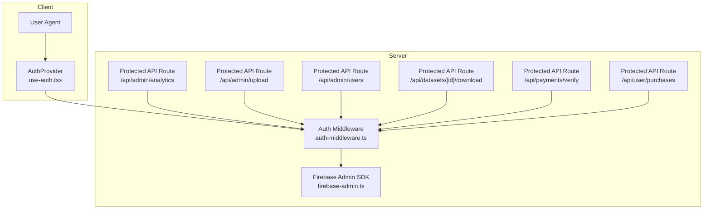

**Diagram sources**
- [auth-middleware.ts:1-48](file://src/lib/auth-middleware.ts#L1-L48)
- [firebase-admin.ts:1-50](file://src/lib/firebase-admin.ts#L1-L50)
- [use-auth.tsx:1-117](file://src/hooks/use-auth.tsx#L1-L117)
- [route.ts:1-78](file://src/app/api/admin/analytics/route.ts#L1-L78)
- [route.ts:1-93](file://src/app/api/admin/upload/route.ts#L1-L93)
- [route.ts:1-54](file://src/app/api/admin/users/route.ts#L1-L54)
- [route.ts:1-148](file://src/app/api/datasets/[id]/download/route.ts#L1-L148)
- [route.ts:1-135](file://src/app/api/payments/verify/route.ts#L1-L135)
- [route.ts:1-31](file://src/app/api/user/purchases/route.ts#L1-L31)

**Section sources**
- [auth-middleware.ts:1-48](file://src/lib/auth-middleware.ts#L1-L48)
- [firebase-admin.ts:1-50](file://src/lib/firebase-admin.ts#L1-L50)
- [use-auth.tsx:1-117](file://src/hooks/use-auth.tsx#L1-L117)
- [layout.tsx:1-50](file://src/app/layout.tsx#L1-L50)

## Core Components
- Authentication middleware
  - Token extraction and verification from Authorization headers
  - Authentication guard returning either a user object or an error response
  - Role-based guard for admin-only endpoints
- Client-side authentication provider
  - React context managing Firebase user and Firestore profile
  - Helpers to sign in, sign up, sign out, and obtain ID tokens
- Next.js API route handlers
  - Endpoints that wrap business logic with authentication and authorization checks
  - Examples include admin analytics, dataset uploads, user listings, dataset downloads, payment verification, and user purchases

Key responsibilities:
- Enforce bearer token authentication on protected endpoints
- Enforce role-based access control for administrative features
- Validate user permissions per-request for sensitive operations
- Provide consistent error responses for unauthorized and forbidden access

**Section sources**
- [auth-middleware.ts:1-48](file://src/lib/auth-middleware.ts#L1-L48)
- [use-auth.tsx:1-117](file://src/hooks/use-auth.tsx#L1-L117)
- [route.ts:1-78](file://src/app/api/admin/analytics/route.ts#L1-L78)
- [route.ts:1-93](file://src/app/api/admin/upload/route.ts#L1-L93)
- [route.ts:1-54](file://src/app/api/admin/users/route.ts#L1-L54)
- [route.ts:1-148](file://src/app/api/datasets/[id]/download/route.ts#L1-L148)
- [route.ts:1-135](file://src/app/api/payments/verify/route.ts#L1-L135)
- [route.ts:1-31](file://src/app/api/user/purchases/route.ts#L1-L31)

## Architecture Overview
The authentication middleware integrates with Next.js API routes to enforce authentication and authorization. The flow is:
- Incoming request arrives at a Next.js route handler
- The route handler calls the authentication middleware
- The middleware verifies the Authorization header and decodes the token via Firebase Admin
- If required, the middleware checks the user’s role against Firestore
- On success, the route handler proceeds with business logic
- On failure, the middleware returns an appropriate error response (401 Unauthorized or 403 Forbidden)

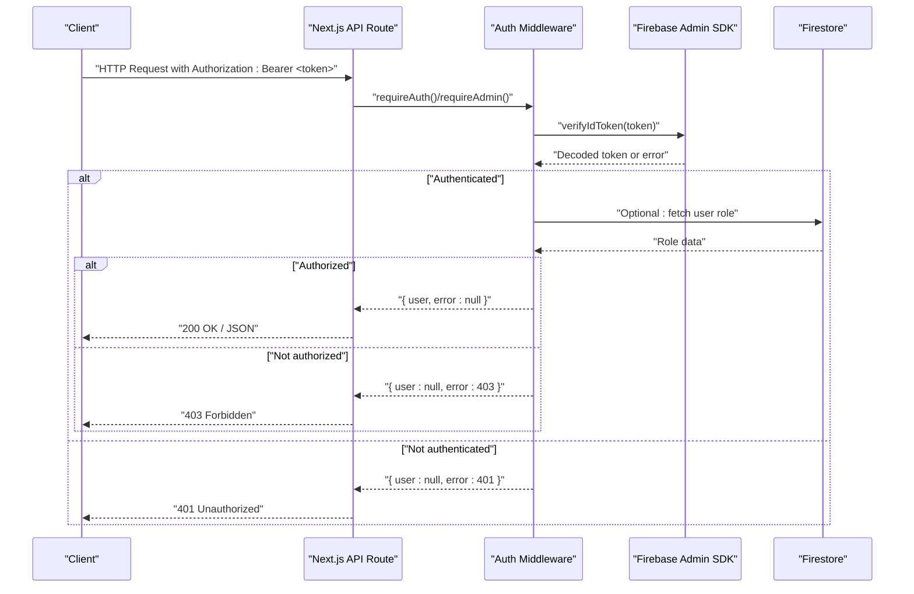

**Diagram sources**
- [auth-middleware.ts:19-47](file://src/lib/auth-middleware.ts#L19-L47)
- [firebase-admin.ts:30-49](file://src/lib/firebase-admin.ts#L30-L49)
- [route.ts:6-10](file://src/app/api/admin/analytics/route.ts#L6-L10)
- [route.ts:7-11](file://src/app/api/admin/upload/route.ts#L7-L11)
- [route.ts:5-9](file://src/app/api/admin/users/route.ts#L5-L9)
- [route.ts:18-21](file://src/app/api/datasets/[id]/download/route.ts#L18-L21)
- [route.ts:7-11](file://src/app/api/payments/verify/route.ts#L7-L11)
- [route.ts:5-9](file://src/app/api/user/purchases/route.ts#L5-L9)

## Detailed Component Analysis

### Authentication Middleware Library
The middleware provides three primary functions:
- Token verification from the Authorization header
- Authentication guard returning either a user object or an error response
- Admin-only guard that additionally validates the user’s role in Firestore

Implementation highlights:
- Extracts the Bearer token from the Authorization header
- Uses Firebase Admin to verify the ID token
- Returns null on invalid or missing tokens
- For admin checks, fetches the user document and ensures the role equals admin
- Returns structured error responses with appropriate HTTP status codes

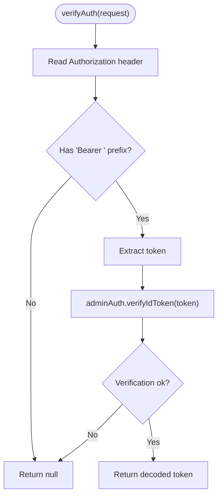

**Diagram sources**
- [auth-middleware.ts:4-17](file://src/lib/auth-middleware.ts#L4-L17)
- [firebase-admin.ts:30-35](file://src/lib/firebase-admin.ts#L30-L35)

**Section sources**
- [auth-middleware.ts:1-48](file://src/lib/auth-middleware.ts#L1-L48)
- [firebase-admin.ts:1-50](file://src/lib/firebase-admin.ts#L1-L50)

### Protected API Routes: Admin Analytics
- Endpoint: GET /api/admin/analytics
- Protection: requireAdmin
- Behavior: Aggregates analytics data from Firestore collections and returns summary metrics

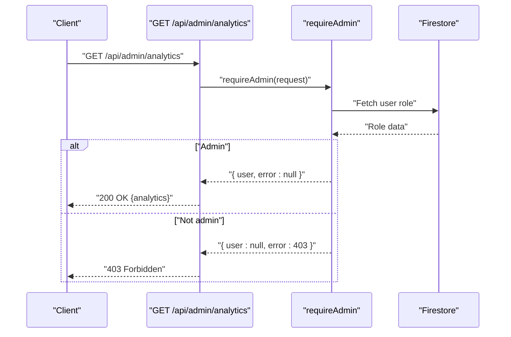

**Diagram sources**
- [route.ts:6-10](file://src/app/api/admin/analytics/route.ts#L6-L10)
- [auth-middleware.ts:30-47](file://src/lib/auth-middleware.ts#L30-L47)

**Section sources**
- [route.ts:1-78](file://src/app/api/admin/analytics/route.ts#L1-L78)
- [auth-middleware.ts:30-47](file://src/lib/auth-middleware.ts#L30-L47)

### Protected API Routes: Admin Upload
- Endpoint: POST /api/admin/upload
- Protection: requireAdmin
- Behavior: Accepts form data, parses CSV, stores dataset metadata and paginated rows in Firestore

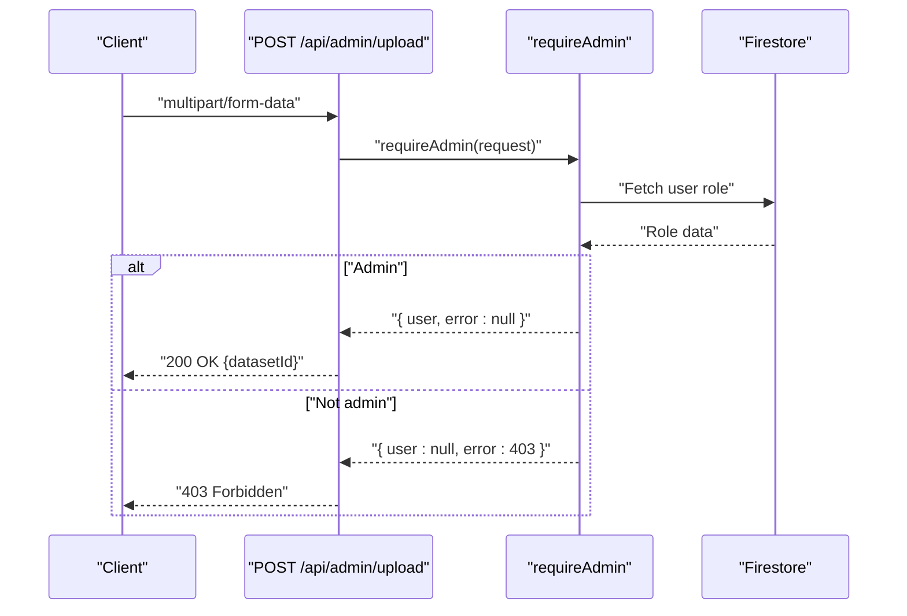

**Diagram sources**
- [route.ts:7-11](file://src/app/api/admin/upload/route.ts#L7-L11)
- [auth-middleware.ts:30-47](file://src/lib/auth-middleware.ts#L30-L47)

**Section sources**
- [route.ts:1-93](file://src/app/api/admin/upload/route.ts#L1-L93)
- [auth-middleware.ts:30-47](file://src/lib/auth-middleware.ts#L30-L47)

### Protected API Routes: Admin Users
- Endpoint: GET /api/admin/users
- Protection: requireAdmin
- Behavior: Lists all users ordered by creation date

- Endpoint: PATCH /api/admin/users
- Protection: requireAdmin
- Behavior: Updates a user’s role after validating payload

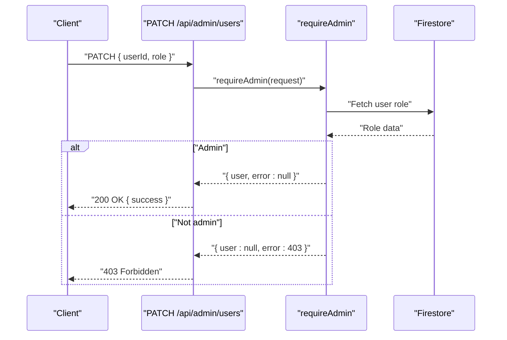

**Diagram sources**
- [route.ts:32-43](file://src/app/api/admin/users/route.ts#L32-L43)
- [auth-middleware.ts:30-47](file://src/lib/auth-middleware.ts#L30-L47)

**Section sources**
- [route.ts:1-54](file://src/app/api/admin/users/route.ts#L1-L54)
- [auth-middleware.ts:30-47](file://src/lib/auth-middleware.ts#L30-L47)

### Protected API Routes: Dataset Download
- Endpoint: GET /api/datasets/[id]/download
- Protection: requireAuth
- Additional checks:
  - Confirms the user purchased the dataset
  - Validates optional download token if provided
  - Records the download event
  - Streams generated file (CSV, Excel, or JSON)

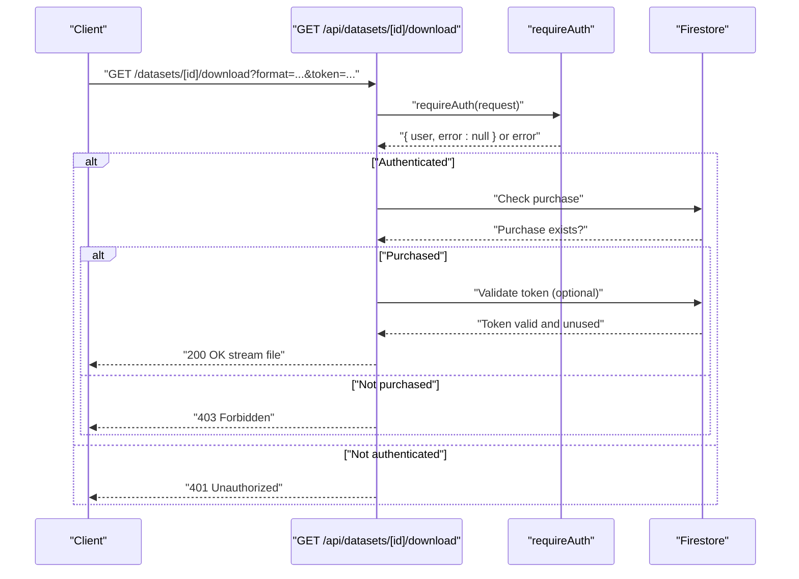

**Diagram sources**
- [route.ts:18-21](file://src/app/api/datasets/[id]/download/route.ts#L18-L21)
- [auth-middleware.ts:19-28](file://src/lib/auth-middleware.ts#L19-L28)

**Section sources**
- [route.ts:1-148](file://src/app/api/datasets/[id]/download/route.ts#L1-L148)
- [auth-middleware.ts:19-28](file://src/lib/auth-middleware.ts#L19-L28)

### Protected API Routes: Payment Verification
- Endpoint: POST /api/payments/verify
- Protection: requireAuth
- Behavior: Verifies payment via external APIs or dev-mode auto-approval, records purchase, and issues a temporary download token

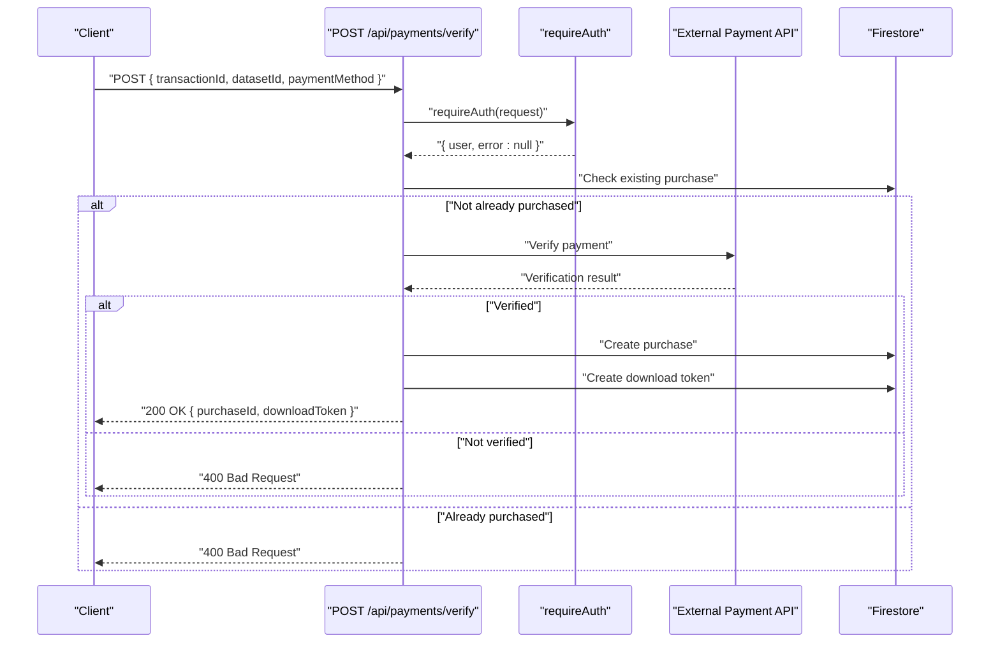

**Diagram sources**
- [route.ts:7-11](file://src/app/api/payments/verify/route.ts#L7-L11)
- [auth-middleware.ts:19-28](file://src/lib/auth-middleware.ts#L19-L28)

**Section sources**
- [route.ts:1-135](file://src/app/api/payments/verify/route.ts#L1-L135)
- [auth-middleware.ts:19-28](file://src/lib/auth-middleware.ts#L19-L28)

### Protected API Routes: User Purchases
- Endpoint: GET /api/user/purchases
- Protection: requireAuth
- Behavior: Returns the current user’s purchase history

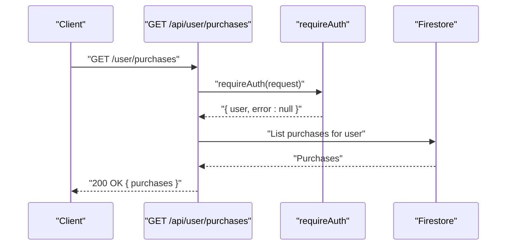

**Diagram sources**
- [route.ts:5-9](file://src/app/api/user/purchases/route.ts#L5-L9)
- [auth-middleware.ts:19-28](file://src/lib/auth-middleware.ts#L19-L28)

**Section sources**
- [route.ts:1-31](file://src/app/api/user/purchases/route.ts#L1-L31)
- [auth-middleware.ts:19-28](file://src/lib/auth-middleware.ts#L19-L28)

### Client-Side Authentication Provider
- Provides a React context with user state, loading, and actions
- Subscribes to Firebase Auth state changes
- Loads or creates user profile in Firestore
- Exposes getIdToken for attaching Authorization headers to outgoing requests

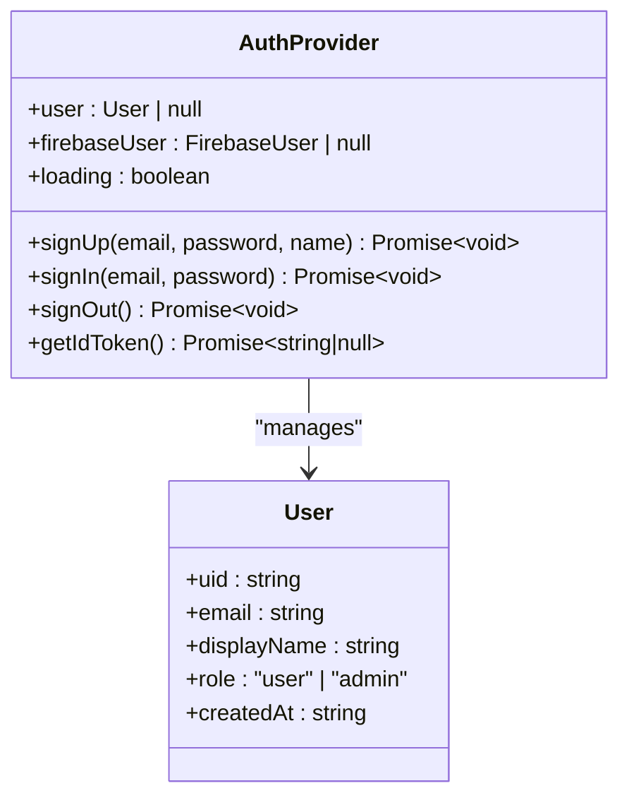

**Diagram sources**
- [use-auth.tsx:34-108](file://src/hooks/use-auth.tsx#L34-L108)
- [index.ts:3-9](file://src/types/index.ts#L3-L9)

**Section sources**
- [use-auth.tsx:1-117](file://src/hooks/use-auth.tsx#L1-L117)
- [layout.tsx:34-44](file://src/app/layout.tsx#L34-L44)
- [index.ts:3-9](file://src/types/index.ts#L3-L9)

## Dependency Analysis
- Middleware depends on Firebase Admin SDK for token verification and Firestore for role checks
- API routes depend on the middleware for access control
- Client provider depends on Firebase Client SDK for Auth state and Firestore for user profiles
- Types define shared contracts for user roles and entities

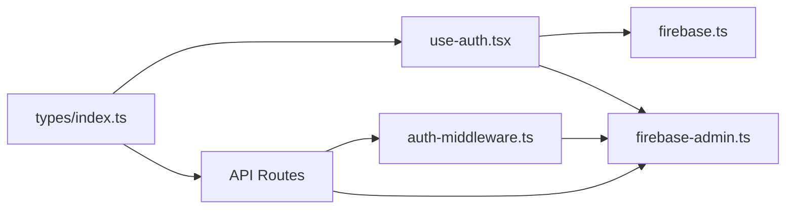

**Diagram sources**
- [auth-middleware.ts:1-1](file://src/lib/auth-middleware.ts#L1)
- [firebase-admin.ts:1-1](file://src/lib/firebase-admin.ts#L1)
- [firebase.ts:1-1](file://src/lib/firebase.ts#L1)
- [use-auth.tsx:1-1](file://src/hooks/use-auth.tsx#L1)
- [index.ts:1-1](file://src/types/index.ts#L1)

**Section sources**
- [auth-middleware.ts:1-48](file://src/lib/auth-middleware.ts#L1-L48)
- [firebase-admin.ts:1-50](file://src/lib/firebase-admin.ts#L1-L50)
- [firebase.ts:1-22](file://src/lib/firebase.ts#L1-L22)
- [use-auth.tsx:1-117](file://src/hooks/use-auth.tsx#L1-L117)
- [index.ts:1-90](file://src/types/index.ts#L1-L90)

## Performance Considerations
- Token verification occurs synchronously on every protected request; keep Authorization header minimal and avoid unnecessary retries
- Admin role checks involve a Firestore read per request; consider caching roles at the edge or in a short-lived cache if traffic demands
- CSV parsing and large dataset uploads can be memory-intensive; streaming and batching are already used for storing dataset rows
- Avoid redundant database reads by reusing the verified user object across multiple checks within a single request

## Troubleshooting Guide
Common issues and resolutions:
- 401 Unauthorized
  - Cause: Missing or malformed Authorization header
  - Resolution: Ensure requests include Authorization: Bearer <valid-id-token>
- 403 Forbidden
  - Cause: Non-admin user attempting admin endpoint
  - Resolution: Confirm user role in Firestore is admin
- 403 Forbidden on dataset download
  - Cause: User has not purchased the dataset or invalid/expired token
  - Resolution: Verify purchase record and token validity; regenerate token if needed
- 400 Bad Request on payment verification
  - Cause: Missing fields or payment not verified
  - Resolution: Provide required fields and ensure payment method is supported
- 500 Internal Server Error
  - Cause: Unexpected exceptions during database operations or external API calls
  - Resolution: Inspect server logs and validate environment variables

**Section sources**
- [auth-middleware.ts:19-47](file://src/lib/auth-middleware.ts#L19-L47)
- [route.ts:31-36](file://src/app/api/datasets/[id]/download/route.ts#L31-L36)
- [route.ts:15-20](file://src/app/api/payments/verify/route.ts#L15-L20)
- [route.ts:70-76](file://src/app/api/admin/analytics/route.ts#L70-L76)

## Security Considerations
- Token exposure
  - Always transmit Authorization headers over HTTPS/TLS
  - Avoid logging tokens or including them in URLs
- Token validation
  - Verify ID tokens server-side using Firebase Admin SDK
  - Reject tokens without proper Bearer prefix
- Role enforcement
  - Enforce role checks in all admin endpoints
  - Do not trust client-provided role claims
- Access control granularity
  - For dataset downloads, enforce both purchase ownership and optional token validation
  - Limit file generation formats and sizes to mitigate abuse
- Error handling
  - Do not leak sensitive error details to clients
  - Return generic messages while logging specifics server-side
- Environment configuration
  - Keep private keys and secrets in environment variables
  - Restrict access to service account credentials
- Rate limiting and monitoring
  - Apply rate limits to sensitive endpoints
  - Monitor for unusual spikes in 401/403 responses

## Conclusion
The authentication middleware provides a concise, reusable mechanism to enforce bearer token authentication and role-based access control across Next.js API routes. Combined with the client-side authentication provider and Firestore-backed user profiles, it delivers a robust foundation for protecting both public and administrative features. By following the security recommendations and leveraging the provided guards consistently, the system maintains strong access controls while remaining maintainable and extensible.

## Appendices

### Example: Protecting Different Route Groups
- Admin-only routes
  - Apply requireAdmin at the start of each handler in admin route groups
- Authenticated-user routes
  - Apply requireAuth for endpoints that require login but not admin privileges
- Dataset download
  - Apply requireAuth and add purchase ownership and token validation checks
- Payment verification
  - Apply requireAuth and validate payment externally or in development mode

### Example: Attaching Authorization Headers from Client
- Use the client provider’s getIdToken to obtain a fresh ID token
- Attach Authorization: Bearer <token> to outgoing requests to protected endpoints

**Section sources**
- [use-auth.tsx:94-99](file://src/hooks/use-auth.tsx#L94-L99)
- [route.ts:18-21](file://src/app/api/datasets/[id]/download/route.ts#L18-L21)
- [route.ts:7-11](file://src/app/api/payments/verify/route.ts#L7-L11)