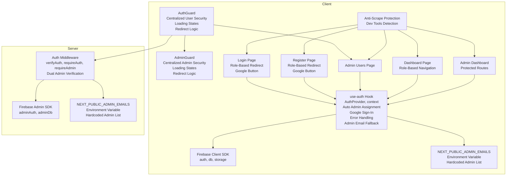
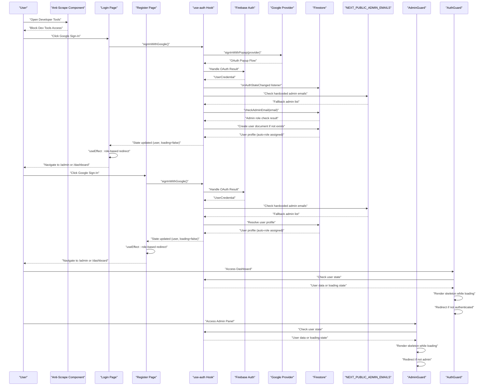
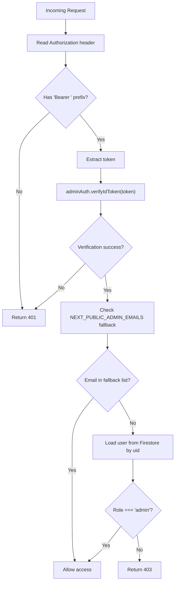
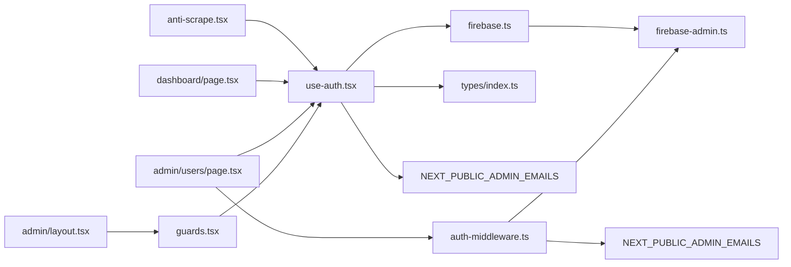

# Authentication System

<cite>
**Referenced Files in This Document**
- [src/lib/firebase.ts](file://src/lib/firebase.ts)
- [src/lib/firebase-admin.ts](file://src/lib/firebase-admin.ts)
- [src/hooks/use-auth.tsx](file://src/hooks/use-auth.tsx)
- [src/lib/auth-middleware.ts](file://src/lib/auth-middleware.ts)
- [src/components/auth/guards.tsx](file://src/components/auth/guards.tsx)
- [src/app/(auth)/login/page.tsx](file://src/app/(auth)/login/page.tsx)
- [src/app/(auth)/register/page.tsx](file://src/app/(auth)/register/page.tsx)
- [src/app/admin/users/page.tsx](file://src/app/admin/users/page.tsx)
- [src/app/admin/layout.tsx](file://src/app/admin/layout.tsx)
- [src/app/dashboard/page.tsx](file://src/app/dashboard/page.tsx)
- [src/types/index.ts](file://src/types/index.ts)
- [src/components/anti-scrape.tsx](file://src/components/anti-scrape.tsx)
- [src/app/layout.tsx](file://src/app/layout.tsx)
- [apphosting.yaml](file://apphosting.yaml)
</cite>

## Update Summary
**Changes Made**
- **Centralized Authentication Guards**: Replaced per-page authentication implementation with centralized AdminGuard and AuthGuard components for unified security enforcement
- **Race Condition Fixes**: Enhanced getIdToken() method with improved user state synchronization to prevent race conditions between authentication state changes and token retrieval
- **Enhanced Admin Email Fallback System**: Improved admin email validation with dual verification layers (Firestore collection + environment variable fallback)
- **Streamlined Authentication Flow**: Simplified authentication logic by moving guard responsibilities from individual pages to centralized components
- **Improved Error Handling**: Enhanced fallback mechanisms for Firestore connectivity issues and admin role assignment failures

## Table of Contents
1. [Introduction](#introduction)
2. [Project Structure](#project-structure)
3. [Core Components](#core-components)
4. [Architecture Overview](#architecture-overview)
5. [Detailed Component Analysis](#detailed-component-analysis)
6. [Dependency Analysis](#dependency-analysis)
7. [Performance Considerations](#performance-considerations)
8. [Security Considerations](#security-considerations)
9. [Troubleshooting Guide](#troubleshooting-guide)
10. [Conclusion](#conclusion)

## Introduction
This document describes Datafrica's enhanced Firebase-based authentication system with centralized authentication guards. The system features Firebase Authentication integration for email/password registration and login, Google Sign-In integration using OAuth popup flows, centralized authentication state management via a custom React hook with automatic admin role assignment, **centralized authentication guards** (AdminGuard and AuthGuard) for unified security enforcement, **race condition fixes** in getIdToken() for improved reliability, enhanced admin email fallback system using NEXT_PUBLIC_ADMIN_EMAILS environment variable, authentication middleware for protecting routes and enforcing role-based access control, user session persistence and automatic sign-in flow, logout functionality, comprehensive anti-scraping protection integration, and security considerations for password handling, token management, and session validation. The centralized guard system provides a more maintainable and consistent approach to authentication enforcement across the application.

## Project Structure
Authentication-related code is organized across client-side hooks, centralized authentication guards, Firebase configuration, server-side middleware, anti-scraping protection, and UI pages:
- Client SDK configuration and initialization
- Admin SDK for server-side token verification and Firestore reads
- Centralized authentication state via a React provider and hook with automatic role assignment, Google Sign-In support, and admin email fallback system
- **Centralized authentication guards** (AdminGuard and AuthGuard) for unified security enforcement
- Anti-scraping protection component for comprehensive security
- Authentication UI pages for login and registration with Google Sign-In buttons and role-based redirects
- Admin UI page that consumes the auth hook and calls protected APIs
- Shared TypeScript types for user profiles
- Environment variable configuration for admin email fallback using NEXT_PUBLIC_ADMIN_EMAILS

**Diagram sources**
- [src/lib/firebase.ts:1-57](file://src/lib/firebase.ts#L1-L57)
- [src/hooks/use-auth.tsx:1-193](file://src/hooks/use-auth.tsx#L1-L193)
- [src/components/auth/guards.tsx:1-68](file://src/components/auth/guards.tsx#L1-L68)
- [src/lib/auth-middleware.ts:1-62](file://src/lib/auth-middleware.ts#L1-L62)
- [src/lib/firebase-admin.ts:1-58](file://src/lib/firebase-admin.ts#L1-L58)
- [src/app/(auth)/login/page.tsx:1-152](file://src/app/(auth)/login/page.tsx#L1-L152)
- [src/app/(auth)/register/page.tsx:1-151](file://src/app/(auth)/register/page.tsx#L1-L151)
- [src/app/admin/users/page.tsx:1-376](file://src/app/admin/users/page.tsx#L1-L376)
- [src/app/admin/layout.tsx:1-8](file://src/app/admin/layout.tsx#L1-L8)
- [src/app/dashboard/page.tsx:1-237](file://src/app/dashboard/page.tsx#L1-L237)
- [src/components/anti-scrape.tsx:1-169](file://src/components/anti-scrape.tsx#L1-L169)
- [apphosting.yaml:45-49](file://apphosting.yaml#L45-L49)

**Section sources**
- [src/lib/firebase.ts:1-57](file://src/lib/firebase.ts#L1-L57)
- [src/lib/firebase-admin.ts:1-58](file://src/lib/firebase-admin.ts#L1-L58)
- [src/hooks/use-auth.tsx:1-193](file://src/hooks/use-auth.tsx#L1-L193)
- [src/components/auth/guards.tsx:1-68](file://src/components/auth/guards.tsx#L1-L68)
- [src/lib/auth-middleware.ts:1-62](file://src/lib/auth-middleware.ts#L1-L62)
- [src/app/(auth)/login/page.tsx:1-152](file://src/app/(auth)/login/page.tsx#L1-L152)
- [src/app/(auth)/register/page.tsx:1-151](file://src/app/(auth)/register/page.tsx#L1-L151)
- [src/app/admin/users/page.tsx:1-376](file://src/app/admin/users/page.tsx#L1-L376)
- [src/app/admin/layout.tsx:1-8](file://src/app/admin/layout.tsx#L1-L8)
- [src/app/dashboard/page.tsx:1-237](file://src/app/dashboard/page.tsx#L1-L237)
- [src/types/index.ts:3-9](file://src/types/index.ts#L3-L9)
- [src/components/anti-scrape.tsx:1-169](file://src/components/anti-scrape.tsx#L1-L169)
- [apphosting.yaml:45-49](file://apphosting.yaml#L45-L49)

## Core Components
- Firebase Client SDK initialization and exports for auth, Firestore, and storage.
- Firebase Admin SDK lazy initialization and proxied services for secure server-side operations.
- Centralized authentication state via a React context provider that listens to Firebase Auth state changes, synchronizes user profiles in Firestore, automatically assigns admin roles based on email collections, exposes sign-up, sign-in, Google Sign-In, sign-out, and **enhanced getIdToken** with race condition fixes, and implements admin email fallback system.
- **Centralized authentication guards** that provide unified security enforcement:
  - AdminGuard: Protects admin-only routes with loading states and skeleton UI
  - AuthGuard: Protects user routes with loading states and skeleton UI
- Anti-scraping protection component that detects and blocks developer tools usage with comprehensive keyboard and mouse event blocking.
- Authentication middleware that validates Authorization headers, verifies Firebase ID tokens, and enforces admin-only access with dual verification layers.
- Login and registration pages that integrate with the auth hook and navigate on success using role-based redirects, featuring Google Sign-In buttons.
- Admin users page that fetches protected data using bearer tokens obtained from the auth hook.
- Dashboard page that implements role-based navigation with conditional redirects to admin or user dashboards.
- Environment variable system for configuring admin email fallback using NEXT_PUBLIC_ADMIN_EMAILS.

**Section sources**
- [src/lib/firebase.ts:1-57](file://src/lib/firebase.ts#L1-L57)
- [src/lib/firebase-admin.ts:1-58](file://src/lib/firebase-admin.ts#L1-L58)
- [src/hooks/use-auth.tsx:1-193](file://src/hooks/use-auth.tsx#L1-L193)
- [src/components/auth/guards.tsx:1-68](file://src/components/auth/guards.tsx#L1-L68)
- [src/components/anti-scrape.tsx:1-169](file://src/components/anti-scrape.tsx#L1-L169)
- [src/lib/auth-middleware.ts:1-62](file://src/lib/auth-middleware.ts#L1-L62)
- [src/app/(auth)/login/page.tsx:1-152](file://src/app/(auth)/login/page.tsx#L1-L152)
- [src/app/(auth)/register/page.tsx:1-151](file://src/app/(auth)/register/page.tsx#L1-L151)
- [src/app/admin/users/page.tsx:1-376](file://src/app/admin/users/page.tsx#L1-L376)
- [src/app/admin/layout.tsx:1-8](file://src/app/admin/layout.tsx#L1-L8)
- [src/app/dashboard/page.tsx:1-237](file://src/app/dashboard/page.tsx#L1-L237)
- [src/types/index.ts:3-9](file://src/types/index.ts#L3-L9)

## Architecture Overview
The authentication system integrates client-side Firebase Authentication with server-side Firebase Admin for secure API access. The React auth provider manages local state, automatically assigns admin roles based on Firestore collections, and persists user metadata in Firestore. **The centralized guard system** provides unified security enforcement across the application, replacing per-page authentication logic with reusable components. Google Sign-In integration uses OAuth popup flows for seamless authentication. The enhanced admin email fallback system provides redundancy by checking both Firestore admin email collections and a hardcoded NEXT_PUBLIC_ADMIN_EMAILS environment variable. Role-based redirect system replaces hardcoded dashboard navigation with dynamic routing based on user roles. Anti-scraping protection provides comprehensive security against developer tools usage. Protected routes and admin endpoints rely on middleware that validates ID tokens and checks roles using dual verification layers for improved reliability.

**Diagram sources**
- [src/components/anti-scrape.tsx:83-118](file://src/components/anti-scrape.tsx#L83-L118)
- [src/app/(auth)/login/page.tsx:20-25](file://src/app/(auth)/login/page.tsx#L20-L25)
- [src/app/(auth)/register/page.tsx:21-26](file://src/app/(auth)/register/page.tsx#L21-L26)
- [src/hooks/use-auth.tsx:167-175](file://src/hooks/use-auth.tsx#L167-L175)
- [src/lib/auth-middleware.ts:35-61](file://src/lib/auth-middleware.ts#L35-L61)
- [src/app/admin/users/page.tsx:37-41](file://src/app/admin/users/page.tsx#L37-L41)
- [src/app/dashboard/page.tsx:31-38](file://src/app/dashboard/page.tsx#L31-L38)
- [src/components/auth/guards.tsx:12-36](file://src/components/auth/guards.tsx#L12-L36)
- [src/components/auth/guards.tsx:42-67](file://src/components/auth/guards.tsx#L42-L67)

## Detailed Component Analysis

### Firebase Client SDK Initialization
- Initializes Firebase app once and exports auth, Firestore, and storage instances.
- Reads environment variables for client-side configuration.

**Section sources**
- [src/lib/firebase.ts:21-57](file://src/lib/firebase.ts#L21-L57)

### Firebase Admin SDK Initialization
- Lazily initializes Admin SDK with service account credentials from environment variables.
- Uses proxies to defer binding of adminAuth, adminDb, and adminStorage until first use.
- Supports Application Default Credentials for Firebase App Hosting environments.

**Section sources**
- [src/lib/firebase-admin.ts:12-36](file://src/lib/firebase-admin.ts#L12-L36)
- [src/lib/firebase-admin.ts:38-58](file://src/lib/firebase-admin.ts#L38-L58)

### Centralized Authentication State (use-auth Hook)
- Provides a context with:
  - user: normalized profile from Firestore
  - firebaseUser: raw Firebase user
  - loading: initialization state
  - signUp, signIn, signInWithGoogle, signOut, **getIdToken with race condition fixes**
- Subscribes to onAuthStateChanged to:
  - Set firebaseUser and load user profile from Firestore
  - Check adminEmails collection for automatic admin role assignment
  - Create a default user profile if none exists (with comprehensive error handling)
  - Clear state on sign-out
- **Enhanced getIdToken** method with improved user state synchronization:
  - Uses firebaseUser state first, then falls back to auth.currentUser
  - Prevents race conditions between authentication state changes and token retrieval
  - Ensures token availability during the brief period after signIn before onAuthStateChanged fires
- Exposes getIdToken to obtain a fresh ID token for protected API calls.
- Implements automatic admin role assignment based on email collection membership.
- **Enhanced** with Google Sign-In integration using signInWithPopup and GoogleAuthProvider.
- **Enhanced** with admin email fallback system using NEXT_PUBLIC_ADMIN_EMAILS environment variable for redundancy.

**Diagram sources**
- [src/hooks/use-auth.tsx:109-128](file://src/hooks/use-auth.tsx#L109-L128)
- [src/hooks/use-auth.tsx:49-59](file://src/hooks/use-auth.tsx#L49-L59)
- [src/hooks/use-auth.tsx:61-107](file://src/hooks/use-auth.tsx#L61-L107)
- [src/hooks/use-auth.tsx:130-144](file://src/hooks/use-auth.tsx#L130-L144)
- [src/hooks/use-auth.tsx:167-175](file://src/hooks/use-auth.tsx#L167-L175)

**Section sources**
- [src/hooks/use-auth.tsx:22-40](file://src/hooks/use-auth.tsx#L22-L40)
- [src/hooks/use-auth.tsx:44-193](file://src/hooks/use-auth.tsx#L44-L193)
- [src/types/index.ts:3-9](file://src/types/index.ts#L3-L9)

### Centralized Authentication Guards
**AdminGuard Component:**
- Wraps admin pages and protects them from unauthorized access
- Redirects to home page (/) if user is not authenticated or not an admin
- Shows loading skeleton UI while authentication state resolves
- Uses useEffect to monitor user state and enforce security rules
- Provides visual feedback during authentication resolution

**AuthGuard Component:**
- Wraps user pages (dashboard) and protects them from unauthorized access
- Redirects to login page (/login) if user is not authenticated
- Redirects admins to admin dashboard (/admin) if they try to access user routes
- Shows loading skeleton UI while authentication state resolves
- Uses useEffect to monitor user state and enforce security rules
- Provides visual feedback during authentication resolution

**Enhanced Guard Implementation:**
- Both guards use loading states to prevent flash-of-unstyled-content
- Implement skeleton UI components for better user experience during authentication
- Provide immediate redirects for security violations
- Handle edge cases like admin users accessing user routes
- Maintain consistent loading states across the application

**Section sources**
- [src/components/auth/guards.tsx:8-36](file://src/components/auth/guards.tsx#L8-L36)
- [src/components/auth/guards.tsx:38-67](file://src/components/auth/guards.tsx#L38-L67)

### Enhanced Admin Email Fallback System
The authentication system now includes a robust admin email fallback system:

**Admin Email Fallback Implementation:**
- NEXT_PUBLIC_ADMIN_EMAILS environment variable containing comma-separated admin email addresses
- Hardcoded admin email list processed and cached at module initialization
- Dual-layer admin verification: Firestore collection check + hardcoded email list fallback
- Automatic admin role assignment with fallback mechanism during authentication failures
- Graceful degradation when Firestore is unavailable or adminEmails collection is inaccessible

**Enhanced Error Handling and User Document Management:**
- Try-catch blocks around Firestore operations to prevent authentication failures
- Fallback user creation with basic information when Firestore operations fail
- Graceful degradation to ensure users can continue using the application even if Firestore is unavailable
- Admin role determination using fallback system when Firestore verification fails

**Automatic User Document Creation:**
- Creates user documents automatically on first sign-in or sign-up via Google
- Determines admin role based on email collection membership or hardcoded fallback list
- Persists user metadata including uid, email, displayName, role, and createdAt timestamp

**Enhanced Firestore Connectivity Management:**
- Robust error recovery for authentication state changes
- Automatic role assignment with fallback mechanisms
- Improved user experience during network connectivity issues

**Section sources**
- [src/hooks/use-auth.tsx:26-29](file://src/hooks/use-auth.tsx#L26-L29)
- [src/hooks/use-auth.tsx:49-59](file://src/hooks/use-auth.tsx#L49-L59)
- [src/hooks/use-auth.tsx:86-107](file://src/hooks/use-auth.tsx#L86-L107)
- [src/hooks/use-auth.tsx:130-144](file://src/hooks/use-auth.tsx#L130-L144)

### Enhanced Google Sign-In Integration
The auth hook now includes comprehensive Google Sign-In functionality:

**Google Sign-In Implementation:**
- GoogleAuthProvider instance created for OAuth authentication
- signInWithGoogle function uses signInWithPopup for OAuth flow
- Seamless integration with existing user profile resolution logic
- Automatic user document creation and admin role assignment for Google users using fallback system

**Enhanced Error Handling and User Document Management:**
- Try-catch blocks around Firestore operations to prevent authentication failures
- Fallback user creation with basic information when Firestore operations fail
- Graceful degradation to ensure users can continue using the application even if Firestore is unavailable

**Automatic User Document Creation:**
- Creates user documents automatically on first sign-in or sign-up via Google
- Determines admin role based on email collection membership or hardcoded fallback list
- Persists user metadata including uid, email, displayName, role, and createdAt timestamp

**Enhanced Firestore Connectivity Management:**
- Robust error recovery for authentication state changes
- Automatic role assignment with fallback mechanisms
- Improved user experience during network connectivity issues

**Section sources**
- [src/hooks/use-auth.tsx:24](file://src/hooks/use-auth.tsx#L24)
- [src/hooks/use-auth.tsx:154-159](file://src/hooks/use-auth.tsx#L154-L159)
- [src/hooks/use-auth.tsx:61-107](file://src/hooks/use-auth.tsx#L61-L107)
- [src/hooks/use-auth.tsx:130-144](file://src/hooks/use-auth.tsx#L130-L144)

### Race Condition Fixes in getIdToken()
**Enhanced getIdToken Method:**
- Uses firebaseUser state as primary source for current user
- Falls back to auth.currentUser if firebaseUser is not yet available
- Prevents race conditions between authentication state changes and token retrieval
- Ensures token availability during the brief period after signIn before onAuthStateChanged fires
- Improves reliability of protected API calls

**Race Condition Prevention:**
- Addresses timing issues where getIdToken was called immediately after signIn
- Ensures proper user state synchronization
- Reduces authentication-related errors in protected routes
- Improves overall user experience during authentication flows

**Section sources**
- [src/hooks/use-auth.tsx:167-175](file://src/hooks/use-auth.tsx#L167-L175)

### Role-Based Redirect System
The authentication system now implements dynamic role-based redirects:

**Role-Based Redirect Implementation:**
- Login page uses `router.push(user.role === "admin" ? "/admin" : "/dashboard")` for dynamic navigation
- Registration page uses the same role-based redirect logic
- Dashboard page includes bidirectional role-based navigation: redirects non-admin users to dashboard and admin users to admin panel
- Admin users page enforces admin-only access with role-based guards

**Enhanced Navigation Logic:**
- useEffect hooks monitor user state and authLoading to determine appropriate redirects
- Prevents hardcoded navigation by dynamically checking user role
- Ensures proper routing based on authentication state and user permissions
- Provides seamless user experience with automatic role-aware navigation

**Section sources**
- [src/app/(auth)/login/page.tsx:20-25](file://src/app/(auth)/login/page.tsx#L20-L25)
- [src/app/(auth)/register/page.tsx:21-26](file://src/app/(auth)/register/page.tsx#L21-L26)
- [src/app/dashboard/page.tsx:31-38](file://src/app/dashboard/page.tsx#L31-L38)
- [src/app/admin/users/page.tsx:37-41](file://src/app/admin/users/page.tsx#L37-L41)

### Anti-Scraping Protection Component
- Comprehensive developer tools detection using multiple techniques:
  - Real-time dev tools detection via window dimension analysis
  - Console method override detection
  - Print screen blocking with clipboard manipulation
- Blocks critical keyboard shortcuts and mouse events:
  - Right-click context menu prevention
  - Developer tools shortcuts (F12, Ctrl+Shift+I/J/C)
  - View source and save page shortcuts
  - Copy and select-all operations outside inputs/textareas
- Provides user-friendly overlay with close/reload functionality
- Integrates seamlessly into application layout

**Section sources**
- [src/components/anti-scrape.tsx:5-169](file://src/components/anti-scrape.tsx#L5-L169)

### Authentication Middleware (Server-Side)
- verifyAuth: Extracts Bearer token from Authorization header and verifies it via adminAuth.
- requireAuth: Returns unauthorized if token is missing or invalid.
- requireAdmin: Enforces admin-only access by checking Firestore user role with dual verification layers.

**Diagram sources**
- [src/lib/auth-middleware.ts:9-22](file://src/lib/auth-middleware.ts#L9-L22)
- [src/lib/auth-middleware.ts:24-33](file://src/lib/auth-middleware.ts#L24-L33)
- [src/lib/auth-middleware.ts:35-61](file://src/lib/auth-middleware.ts#L35-L61)

**Section sources**
- [src/lib/auth-middleware.ts:1-62](file://src/lib/auth-middleware.ts#L1-L62)

### Login Page with Google Sign-In
- Captures email and password, calls signIn from use-auth, navigates on success, shows toast feedback, and handles errors.
- **Enhanced** with Google Sign-In button using signInWithGoogle function.
- Google button includes branded SVG icon and internationalized text.
- **Enhanced** with role-based redirect system using useEffect for dynamic navigation.

**Section sources**
- [src/app/(auth)/login/page.tsx:27-59](file://src/app/(auth)/login/page.tsx#L27-L59)
- [src/app/(auth)/login/page.tsx:61-70](file://src/app/(auth)/login/page.tsx#L61-L70)
- [src/app/(auth)/login/page.tsx:20-25](file://src/app/(auth)/login/page.tsx#L20-L25)

### Registration Page with Google Sign-In
- Validates password length, calls signUp from use-auth, navigates on success, shows toast feedback, and automatically assigns admin role if email exists in adminEmails collection or NEXT_PUBLIC_ADMIN_EMAILS fallback list.
- **Enhanced** with Google Sign-In button using signInWithGoogle function.
- Google button includes branded SVG icon and internationalized text.
- **Enhanced** with role-based redirect system using useEffect for dynamic navigation.

**Section sources**
- [src/app/(auth)/register/page.tsx:28-45](file://src/app/(auth)/register/page.tsx#L28-L45)
- [src/app/(auth)/register/page.tsx:47-55](file://src/app/(auth)/register/page.tsx#L47-L55)
- [src/app/(auth)/register/page.tsx:21-26](file://src/app/(auth)/register/page.tsx#L21-L26)

### Admin Users Page
- Uses use-auth to guard access and fetch users via a protected API endpoint using a Bearer token obtained from getIdToken.
- **Enhanced** with role-based guard that redirects non-admin users to home page.

**Section sources**
- [src/app/admin/users/page.tsx:30-65](file://src/app/admin/users/page.tsx#L30-L65)
- [src/app/admin/users/page.tsx:37-41](file://src/app/admin/users/page.tsx#L37-L41)

### Dashboard Page
- Implements role-based navigation with conditional redirects to admin or user dashboards.
- **Enhanced** with bidirectional role-based navigation: redirects non-admin users to dashboard and admin users to admin panel.

**Section sources**
- [src/app/dashboard/page.tsx:24-60](file://src/app/dashboard/page.tsx#L24-L60)
- [src/app/dashboard/page.tsx:31-38](file://src/app/dashboard/page.tsx#L31-L38)

## Dependency Analysis
- Client-side:
  - use-auth depends on Firebase Client SDK (auth, db) and the User type.
  - **Centralized authentication guards** depend on use-auth and Next.js router.
  - Anti-scraping component depends on React and browser APIs.
  - Login and Register pages depend on use-auth and implement role-based redirects.
  - Admin Users page depends on use-auth and calls protected APIs.
  - Dashboard page depends on use-auth and implements role-based navigation.
  - use-auth depends on NEXT_PUBLIC_ADMIN_EMAILS environment variable for admin fallback.
- Server-side:
  - Auth middleware depends on Firebase Admin SDK (adminAuth) and adminDb.
  - Auth middleware depends on NEXT_PUBLIC_ADMIN_EMAILS environment variable for admin fallback.
  - Admin Users page triggers a fetch to a protected route that uses requireAdmin.

**Diagram sources**
- [src/hooks/use-auth.tsx:22-23](file://src/hooks/use-auth.tsx#L22-L23)
- [src/types/index.ts:3-9](file://src/types/index.ts#L3-L9)
- [src/components/anti-scrape.tsx:1](file://src/components/anti-scrape.tsx#L1)
- [src/app/(auth)/login/page.tsx:7](file://src/app/(auth)/login/page.tsx#L7)
- [src/app/(auth)/register/page.tsx:7](file://src/app/(auth)/register/page.tsx#L7)
- [src/app/admin/users/page.tsx:17](file://src/app/admin/users/page.tsx#L17)
- [src/app/dashboard/page.tsx:10](file://src/app/dashboard/page.tsx#L10)
- [src/lib/auth-middleware.ts:2](file://src/lib/auth-middleware.ts#L2)
- [src/lib/firebase-admin.ts:2](file://src/lib/firebase-admin.ts#L2)
- [src/lib/firebase.ts:3-4](file://src/lib/firebase.ts#L3-L4)
- [src/lib/auth-middleware.ts:4](file://src/lib/auth-middleware.ts#L4)

**Section sources**
- [src/hooks/use-auth.tsx:22-23](file://src/hooks/use-auth.tsx#L22-L23)
- [src/lib/firebase.ts:3-4](file://src/lib/firebase.ts#L3-L4)
- [src/lib/firebase-admin.ts:2](file://src/lib/firebase-admin.ts#L2)
- [src/lib/auth-middleware.ts:2](file://src/lib/auth-middleware.ts#L2)
- [src/types/index.ts:3-9](file://src/types/index.ts#L3-L9)

## Performance Considerations
- Lazy initialization of Admin SDK avoids unnecessary overhead on cold starts.
- Proxies delay binding of admin services until first use, reducing startup cost.
- onAuthStateChanged listener runs once per client session; avoid redundant subscriptions.
- **Enhanced getIdToken** method with race condition fixes reduces authentication-related errors and improves reliability.
- **Centralized authentication guards** eliminate redundant authentication logic across multiple pages.
- Firestore reads for user profiles occur on auth state changes and on sign-up; ensure minimal writes and consider caching at the component level if appropriate.
- Anti-scraping component uses efficient interval-based detection and cleans up event listeners properly.
- **Enhanced** Google Sign-In uses popup-based OAuth flow which is optimized for user experience and security.
- **Enhanced** error handling reduces re-renders and improves user experience during network issues.
- **Enhanced** admin email fallback system uses cached email lists to minimize repeated processing overhead.
- **Enhanced** role-based redirect system uses useEffect hooks for efficient state-driven navigation.
- **Centralized guard system** reduces code duplication and improves maintainability.

## Security Considerations
- Password handling:
  - Client-side validation occurs in registration and login forms; ensure HTTPS and secure cookies if applicable.
  - Firebase Authentication manages password hashing and salt generation server-side.
- Token management:
  - ID tokens are short-lived; use getIdToken before each protected API call to ensure freshness.
  - **Enhanced getIdToken** method prevents race conditions and ensures proper token availability.
  - Authorization headers must be sent as "Bearer <token>".
- Session validation:
  - requireAuth rejects requests without a valid token; verifyAuth throws on invalid/expired tokens.
  - requireAdmin additionally checks Firestore for admin role with dual verification layers.
- Automatic admin role assignment:
  - Admin privileges are granted based on email collection membership in Firestore or NEXT_PUBLIC_ADMIN_EMAILS fallback list.
  - Role assignment occurs automatically during authentication and user creation.
- **Centralized authentication guards** provide unified security enforcement across the application.
- **Enhanced** race condition fixes in getIdToken reduce security vulnerabilities related to timing attacks.
- Google Sign-In security:
  - OAuth popup flow provides secure authentication without exposing credentials.
  - Google provider configuration ensures proper OAuth handling.
  - User consent and privacy controls are managed by Google's OAuth system.
- Anti-scraping protection:
  - Comprehensive developer tools detection prevents reverse engineering and content scraping.
  - Multiple detection techniques ensure robust protection against various attack vectors.
  - User-friendly blocking mechanism with clear instructions.
- Environment variables:
  - Client SDK keys are exposed via NEXT_PUBLIC_*; keep them scoped and rotate as needed.
  - Admin SDK private key and project credentials are loaded from environment variables; restrict access to deployment systems.
  - NEXT_PUBLIC_ADMIN_EMAILS contains sensitive admin email addresses; ensure proper environment variable management.
- **Enhanced** error handling ensures graceful degradation and prevents sensitive information exposure during Firestore connectivity issues.
- **Enhanced** admin email fallback system provides redundancy while maintaining security through environment variable configuration.
- **Enhanced** role-based redirect system prevents bypass attempts by ensuring proper authentication state validation before navigation.

**Section sources**
- [src/lib/auth-middleware.ts:9-22](file://src/lib/auth-middleware.ts#L9-L22)
- [src/lib/auth-middleware.ts:35-61](file://src/lib/auth-middleware.ts#L35-L61)
- [src/hooks/use-auth.tsx:167-175](file://src/hooks/use-auth.tsx#L167-L175)
- [src/lib/firebase.ts:23-26](file://src/lib/firebase.ts#L23-L26)
- [src/lib/firebase-admin.ts:24-34](file://src/lib/firebase-admin.ts#L24-L34)
- [src/components/anti-scrape.tsx:83-118](file://src/components/anti-scrape.tsx#L83-L118)
- [src/components/auth/guards.tsx:12-36](file://src/components/auth/guards.tsx#L12-L36)
- [src/components/auth/guards.tsx:42-67](file://src/components/auth/guards.tsx#L42-L67)

## Troubleshooting Guide
- Invalid email or password during login:
  - The login page displays a toast with a user-friendly message and prevents navigation until resolved.
  - Ensure the user exists and credentials are correct.
- Account creation fails:
  - Registration enforces a minimum password length and shows a toast on failure.
  - Confirm environment variables and network connectivity to Firestore.
- Unauthorized access to protected routes:
  - requireAuth returns 401 when Authorization header is missing or invalid.
  - Ensure the client obtains a token via getIdToken and attaches it to the Authorization header.
- Forbidden access to admin routes:
  - requireAdmin returns 403 if the user role is not "admin".
  - Verify the user's role in Firestore and that the token belongs to the intended user.
  - Check NEXT_PUBLIC_ADMIN_EMAILS environment variable for fallback admin email configuration.
- Auth state not persisting:
  - onAuthStateChanged listener sets user state and creates a Firestore profile if missing.
  - Confirm Firestore rules allow read/write for the user's uid and that the listener is active.
- Logout not clearing state:
  - signOut clears both user and firebaseUser; confirm the provider is still mounted after navigation.
- Anti-scraping protection blocking legitimate users:
  - The anti-scrape component uses multiple detection techniques; ensure users understand the blocking mechanism.
  - Provide clear instructions for users to close developer tools and reload the page.
- Automatic admin role assignment not working:
  - Verify that the user's email exists in the adminEmails Firestore collection or NEXT_PUBLIC_ADMIN_EMAILS fallback list.
  - Check Firestore security rules allow read access to the adminEmails collection.
  - Ensure the user is authenticated before role assignment can occur.
  - Verify NEXT_PUBLIC_ADMIN_EMAILS environment variable is properly configured with comma-separated email addresses.
- **Enhanced** Google Sign-In issues:
  - Ensure Google OAuth is properly configured in Firebase Console.
  - Check that the Google provider is correctly initialized in the auth hook.
  - Verify that popup blockers are not preventing the OAuth flow.
  - Confirm that the user's email exists in the adminEmails collection or NEXT_PUBLIC_ADMIN_EMAILS fallback list for admin role assignment.
- **Enhanced** error handling issues:
  - If Firestore operations fail, the system falls back to basic user creation with minimal information using NEXT_PUBLIC_ADMIN_EMAILS fallback.
  - Check Firestore connectivity and security rules if user documents are not being created.
  - Monitor console logs for specific error messages during authentication state changes.
  - Verify NEXT_PUBLIC_ADMIN_EMAILS environment variable contains properly formatted comma-separated email addresses.
- **Enhanced** admin email fallback system issues:
  - Ensure NEXT_PUBLIC_ADMIN_EMAILS environment variable is accessible to the client-side application.
  - Verify email addresses are properly formatted and separated by commas.
  - Check that email addresses are stored in lowercase format for comparison.
  - Confirm the fallback system is functioning when Firestore adminEmails collection is unavailable.
- **Enhanced** race condition fixes in getIdToken():
  - If getIdToken returns null unexpectedly, check that the user is authenticated before calling.
  - Ensure proper timing between signIn and getIdToken calls.
  - Verify that firebaseUser state is properly synchronized with auth.currentUser.
- **Enhanced** centralized authentication guards issues:
  - If AdminGuard or AuthGuard are not working, check that they are properly wrapped around protected components.
  - Verify that the AuthProvider is correctly mounted in the application layout.
  - Ensure that the guards are imported and used in the correct components.
  - Check that loading states are properly handled during authentication resolution.
- **Enhanced** role-based redirect system issues:
  - Verify that useEffect hooks are properly monitoring user state and authLoading.
  - Check that router.push is receiving the correct redirect paths ("/admin" or "/dashboard").
  - Ensure that role-based conditions are properly evaluated before navigation.
  - Confirm that authentication state is fully resolved before attempting redirects.
- **Enhanced** environment variable configuration:
  - Verify NEXT_PUBLIC_ADMIN_EMAILS is properly configured in apphosting.yaml.
  - Ensure email addresses are comma-separated and properly formatted.
  - Check that environment variables are accessible in both client and server contexts.

**Section sources**
- [src/app/(auth)/login/page.tsx:36-59](file://src/app/(auth)/login/page.tsx#L36-L59)
- [src/app/(auth)/register/page.tsx:35-45](file://src/app/(auth)/register/page.tsx#L35-L45)
- [src/lib/auth-middleware.ts:24-33](file://src/lib/auth-middleware.ts#L24-L33)
- [src/lib/auth-middleware.ts:35-61](file://src/lib/auth-middleware.ts#L35-L61)
- [src/hooks/use-auth.tsx:109-128](file://src/hooks/use-auth.tsx#L109-L128)
- [src/app/(auth)/login/page.tsx:20-25](file://src/app/(auth)/login/page.tsx#L20-L25)
- [src/app/(auth)/register/page.tsx:21-26](file://src/app/(auth)/register/page.tsx#L21-L26)
- [src/app/dashboard/page.tsx:31-38](file://src/app/dashboard/page.tsx#L31-L38)
- [src/components/auth/guards.tsx:12-36](file://src/components/auth/guards.tsx#L12-L36)
- [src/components/auth/guards.tsx:42-67](file://src/components/auth/guards.tsx#L42-L67)
- [apphosting.yaml:45-49](file://apphosting.yaml#L45-L49)

## Conclusion
Datafrica's enhanced authentication system leverages Firebase Authentication for client-side identity, including Google Sign-In integration via OAuth popup flows, Firebase Admin for secure server-side validation, **centralized authentication guards** for unified security enforcement, **race condition fixes** in getIdToken() for improved reliability, comprehensive anti-scraping protection for content security, and role-based redirect system replacing hardcoded navigation. The use-auth hook centralizes state synchronization with Firestore and provides automatic admin role assignment based on email collections, while the **centralized guard system** provides consistent security enforcement across the application. The auth middleware enforces token-based authentication and role-based access control. The enhanced admin email fallback system using NEXT_PUBLIC_ADMIN_EMAILS provides redundancy when Firestore admin email verification fails, improving system reliability. The enhanced Google Sign-In functionality provides seamless OAuth authentication with popup-based flows. The enhanced role-based redirect system ensures proper navigation based on user roles with dynamic routing logic. The enhanced error handling and automatic user document creation ensure robust operation even during network connectivity issues. The **centralized authentication guards** provide a more maintainable and consistent approach to authentication enforcement. The anti-scraping component provides robust protection against developer tools usage and content scraping. Together, these components provide a comprehensive, maintainable foundation for user management, session persistence, protected routing, content security, modern authentication flows including Google Sign-In, reliable admin role management with fallback systems, intelligent role-based navigation, and centralized security enforcement.