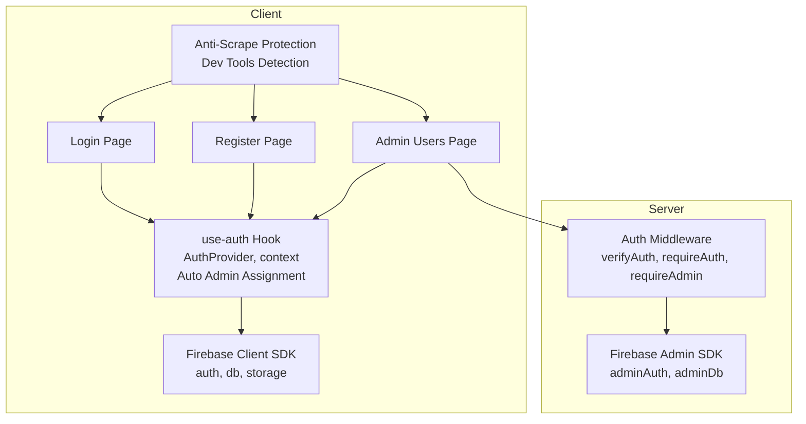
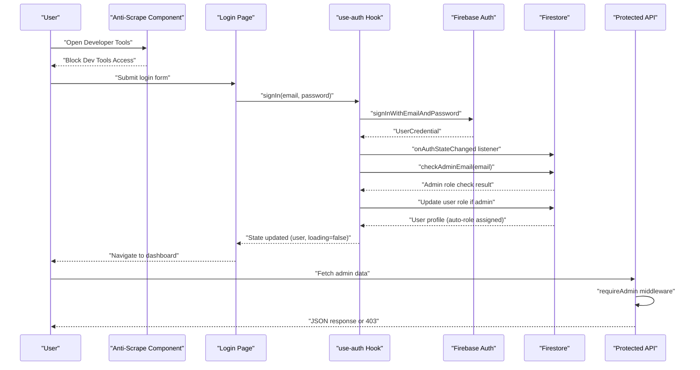
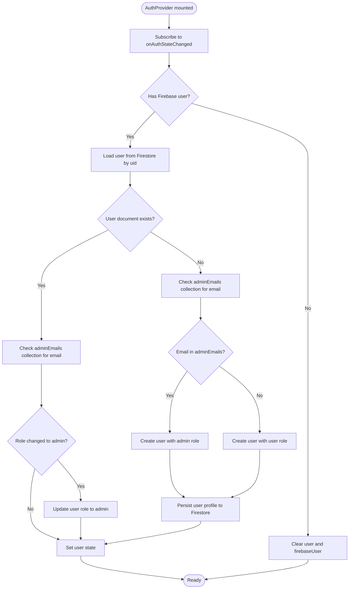
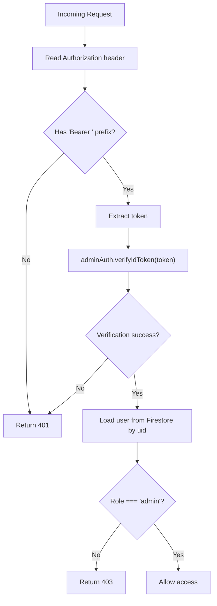
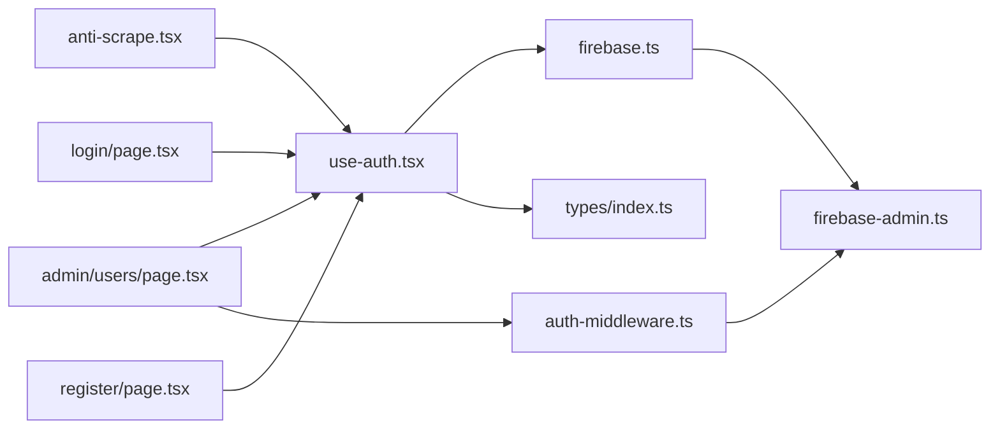

# Authentication System

<cite>
**Referenced Files in This Document**
- [src/lib/firebase.ts](file://src/lib/firebase.ts)
- [src/lib/firebase-admin.ts](file://src/lib/firebase-admin.ts)
- [src/hooks/use-auth.tsx](file://src/hooks/use-auth.tsx)
- [src/lib/auth-middleware.ts](file://src/lib/auth-middleware.ts)
- [src/app/(auth)/login/page.tsx](file://src/app/(auth)/login/page.tsx)
- [src/app/(auth)/register/page.tsx](file://src/app/(auth)/register/page.tsx)
- [src/app/admin/users/page.tsx](file://src/app/admin/users/page.tsx)
- [src/types/index.ts](file://src/types/index.ts)
- [src/components/anti-scrape.tsx](file://src/components/anti-scrape.tsx)
- [src/app/layout.tsx](file://src/app/layout.tsx)
</cite>

## Update Summary
**Changes Made**
- Enhanced authentication system with automatic admin role assignment based on Firestore collections
- Added comprehensive anti-scraping protection integration
- Improved security measures for developer tools detection and blocking
- Updated authentication state flow to include automatic role assignment

## Table of Contents
1. [Introduction](#introduction)
2. [Project Structure](#project-structure)
3. [Core Components](#core-components)
4. [Architecture Overview](#architecture-overview)
5. [Detailed Component Analysis](#detailed-component-analysis)
6. [Dependency Analysis](#dependency-analysis)
7. [Performance Considerations](#performance-considerations)
8. [Security Considerations](#security-considerations)
9. [Troubleshooting Guide](#troubleshooting-guide)
10. [Conclusion](#conclusion)

## Introduction
This document describes Datafrica's enhanced Firebase-based authentication system. It covers Firebase Authentication integration for email/password registration and login, centralized authentication state management via a custom React hook with automatic admin role assignment, authentication middleware for protecting routes and enforcing role-based access control, user session persistence and automatic sign-in flow, logout functionality, comprehensive anti-scraping protection integration, and security considerations for password handling, token management, and session validation. It also documents the authentication state flow from UI interactions through Firebase services to component updates and provides troubleshooting guidance for common authentication issues.

## Project Structure
Authentication-related code is organized across client-side hooks, Firebase configuration, server-side middleware, anti-scraping protection, and UI pages:
- Client SDK configuration and initialization
- Admin SDK for server-side token verification and Firestore reads
- Centralized authentication state via a React provider and hook with automatic role assignment
- Anti-scraping protection component for comprehensive security
- Authentication UI pages for login and registration
- Admin UI page that consumes the auth hook and calls protected APIs
- Shared TypeScript types for user profiles

**Diagram sources**
- [src/lib/firebase.ts:1-57](file://src/lib/firebase.ts#L1-L57)
- [src/hooks/use-auth.tsx:1-137](file://src/hooks/use-auth.tsx#L1-L137)
- [src/lib/auth-middleware.ts:1-48](file://src/lib/auth-middleware.ts#L1-L48)
- [src/lib/firebase-admin.ts:1-58](file://src/lib/firebase-admin.ts#L1-L58)
- [src/app/(auth)/login/page.tsx:1-99](file://src/app/(auth)/login/page.tsx#L1-L99)
- [src/app/(auth)/register/page.tsx:1-118](file://src/app/(auth)/register/page.tsx#L1-L118)
- [src/app/admin/users/page.tsx:1-190](file://src/app/admin/users/page.tsx#L1-L190)
- [src/components/anti-scrape.tsx:1-169](file://src/components/anti-scrape.tsx#L1-L169)

**Section sources**
- [src/lib/firebase.ts:1-57](file://src/lib/firebase.ts#L1-L57)
- [src/lib/firebase-admin.ts:1-58](file://src/lib/firebase-admin.ts#L1-L58)
- [src/hooks/use-auth.tsx:1-137](file://src/hooks/use-auth.tsx#L1-L137)
- [src/lib/auth-middleware.ts:1-48](file://src/lib/auth-middleware.ts#L1-L48)
- [src/app/(auth)/login/page.tsx:1-99](file://src/app/(auth)/login/page.tsx#L1-L99)
- [src/app/(auth)/register/page.tsx:1-118](file://src/app/(auth)/register/page.tsx#L1-L118)
- [src/app/admin/users/page.tsx:1-190](file://src/app/admin/users/page.tsx#L1-L190)
- [src/types/index.ts:3-9](file://src/types/index.ts#L3-L9)
- [src/components/anti-scrape.tsx:1-169](file://src/components/anti-scrape.tsx#L1-L169)
- [src/app/layout.tsx:37-44](file://src/app/layout.tsx#L37-L44)

## Core Components
- Firebase Client SDK initialization and exports for auth, Firestore, and storage.
- Firebase Admin SDK lazy initialization and proxied services for secure server-side operations.
- Centralized authentication state via a React context provider that listens to Firebase Auth state changes, synchronizes user profiles in Firestore, automatically assigns admin roles based on email collections, and exposes sign-up, sign-in, sign-out, and ID token retrieval.
- Anti-scraping protection component that detects and blocks developer tools usage with comprehensive keyboard and mouse event blocking.
- Authentication middleware that validates Authorization headers, verifies Firebase ID tokens, and enforces admin-only access.
- Login and registration pages that integrate with the auth hook and navigate on success.
- Admin users page that fetches protected data using bearer tokens obtained from the auth hook.

**Section sources**
- [src/lib/firebase.ts:1-57](file://src/lib/firebase.ts#L1-L57)
- [src/lib/firebase-admin.ts:1-58](file://src/lib/firebase-admin.ts#L1-L58)
- [src/hooks/use-auth.tsx:1-137](file://src/hooks/use-auth.tsx#L1-L137)
- [src/components/anti-scrape.tsx:1-169](file://src/components/anti-scrape.tsx#L1-L169)
- [src/lib/auth-middleware.ts:1-48](file://src/lib/auth-middleware.ts#L1-L48)
- [src/app/(auth)/login/page.tsx:1-99](file://src/app/(auth)/login/page.tsx#L1-L99)
- [src/app/(auth)/register/page.tsx:1-118](file://src/app/(auth)/register/page.tsx#L1-L118)
- [src/app/admin/users/page.tsx:1-190](file://src/app/admin/users/page.tsx#L1-L190)
- [src/types/index.ts:3-9](file://src/types/index.ts#L3-L9)

## Architecture Overview
The authentication system integrates client-side Firebase Authentication with server-side Firebase Admin for secure API access. The React auth provider manages local state, automatically assigns admin roles based on Firestore collections, and persists user metadata in Firestore. Anti-scraping protection provides comprehensive security against developer tools usage. Protected routes and admin endpoints rely on middleware that validates ID tokens and checks roles stored in Firestore.

**Diagram sources**
- [src/components/anti-scrape.tsx:83-118](file://src/components/anti-scrape.tsx#L83-L118)
- [src/app/(auth)/login/page.tsx:18-33](file://src/app/(auth)/login/page.tsx#L18-L33)
- [src/hooks/use-auth.tsx:50-86](file://src/hooks/use-auth.tsx#L50-L86)
- [src/hooks/use-auth.tsx:39-48](file://src/hooks/use-auth.tsx#L39-L48)
- [src/lib/auth-middleware.ts:19-47](file://src/lib/auth-middleware.ts#L19-L47)
- [src/app/admin/users/page.tsx:41-49](file://src/app/admin/users/page.tsx#L41-L49)

## Detailed Component Analysis

### Firebase Client SDK Initialization
- Initializes Firebase app once and exports auth, Firestore, and storage instances.
- Reads environment variables for client-side configuration.

**Section sources**
- [src/lib/firebase.ts:21-57](file://src/lib/firebase.ts#L21-L57)

### Firebase Admin SDK Initialization
- Lazily initializes Admin SDK with service account credentials from environment variables.
- Uses proxies to defer binding of adminAuth, adminDb, and adminStorage until first use.
- Supports Application Default Credentials for Firebase App Hosting environments.

**Section sources**
- [src/lib/firebase-admin.ts:12-36](file://src/lib/firebase-admin.ts#L12-L36)
- [src/lib/firebase-admin.ts:38-58](file://src/lib/firebase-admin.ts#L38-L58)

### Centralized Authentication State (use-auth Hook)
- Provides a context with:
  - user: normalized profile from Firestore
  - firebaseUser: raw Firebase user
  - loading: initialization state
  - signUp, signIn, signOut, getIdToken
- Subscribes to onAuthStateChanged to:
  - Set firebaseUser and load user profile from Firestore
  - Check adminEmails collection for automatic admin role assignment
  - Create a default user profile if none exists
  - Clear state on sign-out
- Exposes getIdToken to obtain a fresh ID token for protected API calls.
- Implements automatic admin role assignment based on email collection membership.

**Diagram sources**
- [src/hooks/use-auth.tsx:50-86](file://src/hooks/use-auth.tsx#L50-L86)
- [src/hooks/use-auth.tsx:39-48](file://src/hooks/use-auth.tsx#L39-L48)
- [src/hooks/use-auth.tsx:67-76](file://src/hooks/use-auth.tsx#L67-L76)
- [src/hooks/use-auth.tsx:57-64](file://src/hooks/use-auth.tsx#L57-L64)

**Section sources**
- [src/hooks/use-auth.tsx:22-30](file://src/hooks/use-auth.tsx#L22-L30)
- [src/hooks/use-auth.tsx:34-137](file://src/hooks/use-auth.tsx#L34-L137)
- [src/types/index.ts:3-9](file://src/types/index.ts#L3-L9)

### Anti-Scraping Protection Component
- Comprehensive developer tools detection using multiple techniques:
  - Real-time dev tools detection via window dimension analysis
  - Console method override detection
  - Print screen blocking with clipboard manipulation
- Blocks critical keyboard shortcuts and mouse events:
  - Right-click context menu prevention
  - Developer tools shortcuts (F12, Ctrl+Shift+I/J/C)
  - View source and save page shortcuts
  - Copy and select-all operations outside inputs/textareas
- Provides user-friendly overlay with close/reload functionality
- Integrates seamlessly into application layout

**Section sources**
- [src/components/anti-scrape.tsx:5-169](file://src/components/anti-scrape.tsx#L5-L169)

### Authentication Middleware (Server-Side)
- verifyAuth: Extracts Bearer token from Authorization header and verifies it via adminAuth.
- requireAuth: Returns unauthorized if token is missing or invalid.
- requireAdmin: Enforces admin-only access by checking Firestore user role.

**Diagram sources**
- [src/lib/auth-middleware.ts:4-17](file://src/lib/auth-middleware.ts#L4-L17)
- [src/lib/auth-middleware.ts:19-28](file://src/lib/auth-middleware.ts#L19-L28)
- [src/lib/auth-middleware.ts:30-47](file://src/lib/auth-middleware.ts#L30-L47)

**Section sources**
- [src/lib/auth-middleware.ts:1-48](file://src/lib/auth-middleware.ts#L1-L48)

### Login Page
- Captures email and password, calls signIn from use-auth, navigates on success, shows toast feedback, and handles errors.

**Section sources**
- [src/app/(auth)/login/page.tsx:18-33](file://src/app/(auth)/login/page.tsx#L18-L33)

### Registration Page
- Validates password length, calls signUp from use-auth, navigates on success, shows toast feedback, and automatically assigns admin role if email exists in adminEmails collection.

**Section sources**
- [src/app/(auth)/register/page.tsx:19-40](file://src/app/(auth)/register/page.tsx#L19-L40)

### Admin Users Page
- Uses use-auth to guard access and fetch users via a protected API endpoint using a Bearer token obtained from getIdToken.

**Section sources**
- [src/app/admin/users/page.tsx:35-49](file://src/app/admin/users/page.tsx#L35-L49)

## Dependency Analysis
- Client-side:
  - use-auth depends on Firebase Client SDK (auth, db) and the User type.
  - Anti-scraping component depends on React and browser APIs.
  - Login and Register pages depend on use-auth.
  - Admin Users page depends on use-auth and calls protected APIs.
- Server-side:
  - Auth middleware depends on Firebase Admin SDK (adminAuth) and adminDb.
  - Admin Users page triggers a fetch to a protected route that uses requireAdmin.

**Diagram sources**
- [src/hooks/use-auth.tsx:19-20](file://src/hooks/use-auth.tsx#L19-L20)
- [src/types/index.ts:3-9](file://src/types/index.ts#L3-L9)
- [src/components/anti-scrape.tsx:1](file://src/components/anti-scrape.tsx#L1)
- [src/app/(auth)/login/page.tsx:7](file://src/app/(auth)/login/page.tsx#L7)
- [src/app/(auth)/register/page.tsx:7](file://src/app/(auth)/register/page.tsx#L7)
- [src/app/admin/users/page.tsx:17](file://src/app/admin/users/page.tsx#L17)
- [src/lib/auth-middleware.ts:2](file://src/lib/auth-middleware.ts#L2)
- [src/lib/firebase-admin.ts:2](file://src/lib/firebase-admin.ts#L2)
- [src/lib/firebase.ts:3-4](file://src/lib/firebase.ts#L3-L4)

**Section sources**
- [src/hooks/use-auth.tsx:19-20](file://src/hooks/use-auth.tsx#L19-L20)
- [src/lib/firebase.ts:3-4](file://src/lib/firebase.ts#L3-L4)
- [src/lib/firebase-admin.ts:2](file://src/lib/firebase-admin.ts#L2)
- [src/lib/auth-middleware.ts:2](file://src/lib/auth-middleware.ts#L2)
- [src/types/index.ts:3-9](file://src/types/index.ts#L3-L9)

## Performance Considerations
- Lazy initialization of Admin SDK avoids unnecessary overhead on cold starts.
- Proxies delay binding of admin services until first use, reducing startup cost.
- onAuthStateChanged listener runs once per client session; avoid redundant subscriptions.
- getIdToken is called only when needed (e.g., before protected API calls) to minimize token refresh frequency.
- Firestore reads for user profiles occur on auth state changes and on sign-up; ensure minimal writes and consider caching at the component level if appropriate.
- Anti-scraping component uses efficient interval-based detection and cleans up event listeners properly.

## Security Considerations
- Password handling:
  - Client-side validation occurs in registration and login forms; ensure HTTPS and secure cookies if applicable.
  - Firebase Authentication manages password hashing and salt generation server-side.
- Token management:
  - ID tokens are short-lived; use getIdToken before each protected API call to ensure freshness.
  - Authorization headers must be sent as "Bearer <token>".
- Session validation:
  - requireAuth rejects requests without a valid token; verifyAuth throws on invalid/expired tokens.
  - requireAdmin additionally checks Firestore for admin role.
- Automatic admin role assignment:
  - Admin privileges are granted based on email collection membership in Firestore.
  - Role assignment occurs automatically during authentication and user creation.
- Anti-scraping protection:
  - Comprehensive developer tools detection prevents reverse engineering and content scraping.
  - Multiple detection techniques ensure robust protection against various attack vectors.
  - User-friendly blocking mechanism with clear instructions.
- Environment variables:
  - Client SDK keys are exposed via NEXT_PUBLIC_*; keep them scoped and rotate as needed.
  - Admin SDK private key and project credentials are loaded from environment variables; restrict access to deployment systems.

**Section sources**
- [src/lib/auth-middleware.ts:4-17](file://src/lib/auth-middleware.ts#L4-L17)
- [src/lib/auth-middleware.ts:19-47](file://src/lib/auth-middleware.ts#L19-L47)
- [src/hooks/use-auth.tsx:114-119](file://src/hooks/use-auth.tsx#L114-L119)
- [src/lib/firebase.ts:23-26](file://src/lib/firebase.ts#L23-L26)
- [src/lib/firebase-admin.ts:24-34](file://src/lib/firebase-admin.ts#L24-L34)
- [src/components/anti-scrape.tsx:83-118](file://src/components/anti-scrape.tsx#L83-L118)

## Troubleshooting Guide
- Invalid email or password during login:
  - The login page displays a toast with a user-friendly message and prevents navigation until resolved.
  - Ensure the user exists and credentials are correct.
- Account creation fails:
  - Registration enforces a minimum password length and shows a toast on failure.
  - Confirm environment variables and network connectivity to Firestore.
- Unauthorized access to protected routes:
  - requireAuth returns 401 when Authorization header is missing or invalid.
  - Ensure the client obtains a token via getIdToken and attaches it to the Authorization header.
- Forbidden access to admin routes:
  - requireAdmin returns 403 if the user role is not "admin".
  - Verify the user's role in Firestore and that the token belongs to the intended user.
- Auth state not persisting:
  - onAuthStateChanged listener sets user state and creates a Firestore profile if missing.
  - Confirm Firestore rules allow read/write for the user's uid and that the listener is active.
- Logout not clearing state:
  - signOut clears both user and firebaseUser; confirm the provider is still mounted after navigation.
- Anti-scraping protection blocking legitimate users:
  - The anti-scrape component uses multiple detection techniques; ensure users understand the blocking mechanism.
  - Provide clear instructions for users to close developer tools and reload the page.
- Automatic admin role assignment not working:
  - Verify that the user's email exists in the adminEmails Firestore collection.
  - Check Firestore security rules allow read access to the adminEmails collection.
  - Ensure the user is authenticated before role assignment can occur.

**Section sources**
- [src/app/(auth)/login/page.tsx:26-33](file://src/app/(auth)/login/page.tsx#L26-L33)
- [src/app/(auth)/register/page.tsx:29-40](file://src/app/(auth)/register/page.tsx#L29-L40)
- [src/lib/auth-middleware.ts:19-28](file://src/lib/auth-middleware.ts#L19-L28)
- [src/lib/auth-middleware.ts:30-47](file://src/lib/auth-middleware.ts#L30-L47)
- [src/hooks/use-auth.tsx:50-86](file://src/hooks/use-auth.tsx#L50-L86)
- [src/hooks/use-auth.tsx:108-112](file://src/hooks/use-auth.tsx#L108-L112)
- [src/components/anti-scrape.tsx:137-140](file://src/components/anti-scrape.tsx#L137-L140)

## Conclusion
Datafrica's enhanced authentication system leverages Firebase Authentication for client-side identity, Firebase Admin for secure server-side validation, and comprehensive anti-scraping protection for content security. The use-auth hook centralizes state synchronization with Firestore and provides automatic admin role assignment based on email collections, while the auth middleware enforces token-based authentication and role-based access control. The anti-scraping component provides robust protection against developer tools usage and content scraping. Together, these components provide a comprehensive, maintainable foundation for user management, session persistence, protected routing, and content security.