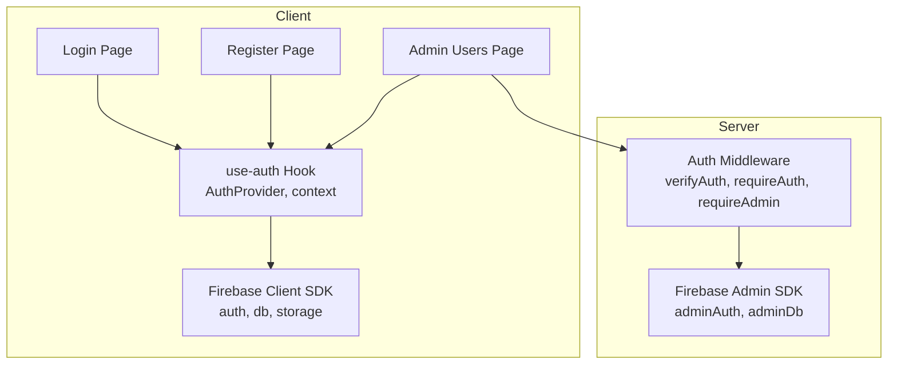
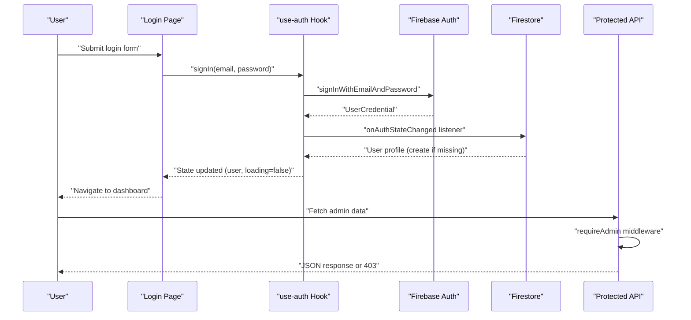
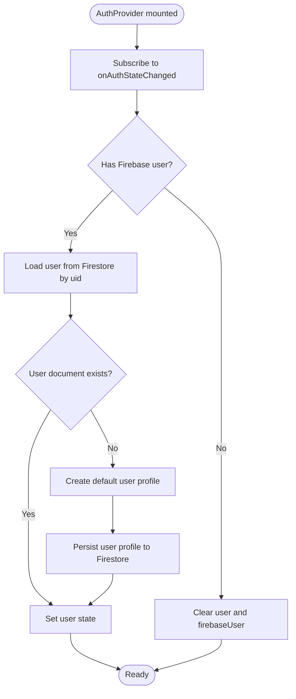
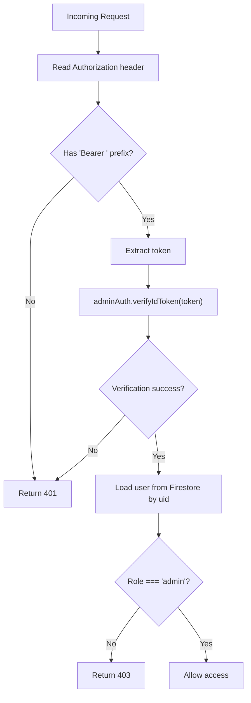
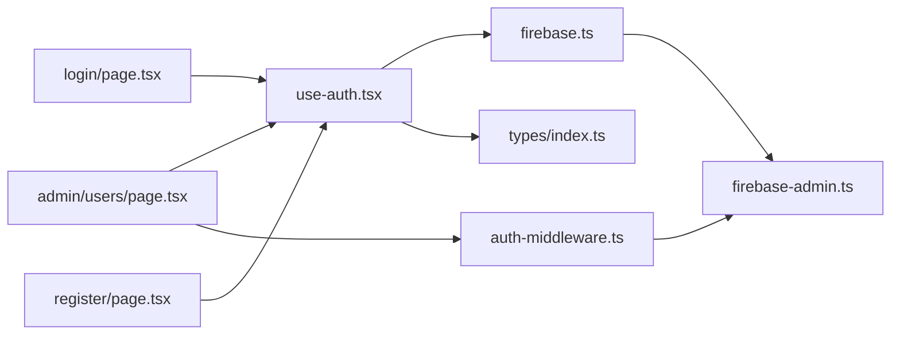

# Authentication System

<cite>
**Referenced Files in This Document**
- [src/lib/firebase.ts](file://src/lib/firebase.ts)
- [src/lib/firebase-admin.ts](file://src/lib/firebase-admin.ts)
- [src/hooks/use-auth.tsx](file://src/hooks/use-auth.tsx)
- [src/lib/auth-middleware.ts](file://src/lib/auth-middleware.ts)
- [src/app/(auth)/login/page.tsx](file://src/app/(auth)/login/page.tsx)
- [src/app/(auth)/register/page.tsx](file://src/app/(auth)/register/page.tsx)
- [src/app/admin/users/page.tsx](file://src/app/admin/users/page.tsx)
- [src/types/index.ts](file://src/types/index.ts)
</cite>

## Table of Contents
1. [Introduction](#introduction)
2. [Project Structure](#project-structure)
3. [Core Components](#core-components)
4. [Architecture Overview](#architecture-overview)
5. [Detailed Component Analysis](#detailed-component-analysis)
6. [Dependency Analysis](#dependency-analysis)
7. [Performance Considerations](#performance-considerations)
8. [Security Considerations](#security-considerations)
9. [Troubleshooting Guide](#troubleshooting-guide)
10. [Conclusion](#conclusion)

## Introduction
This document describes Datafrica’s Firebase-based authentication system. It covers Firebase Authentication integration for email/password registration and login, centralized authentication state management via a custom React hook, authentication middleware for protecting routes and enforcing role-based access control, user session persistence and automatic sign-in flow, logout functionality, and security considerations for password handling, token management, and session validation. It also documents the authentication state flow from UI interactions through Firebase services to component updates and provides troubleshooting guidance for common authentication issues.

## Project Structure
Authentication-related code is organized across client-side hooks, Firebase configuration, server-side middleware, and UI pages:
- Client SDK configuration and initialization
- Admin SDK for server-side token verification and Firestore reads
- Centralized authentication state via a React provider and hook
- Authentication UI pages for login and registration
- Admin UI page that consumes the auth hook and calls protected APIs
- Shared TypeScript types for user profiles

**Diagram sources**
- [src/lib/firebase.ts:1-22](file://src/lib/firebase.ts#L1-L22)
- [src/hooks/use-auth.tsx:1-117](file://src/hooks/use-auth.tsx#L1-L117)
- [src/lib/auth-middleware.ts:1-48](file://src/lib/auth-middleware.ts#L1-L48)
- [src/lib/firebase-admin.ts:1-50](file://src/lib/firebase-admin.ts#L1-L50)
- [src/app/(auth)/login/page.tsx:1-98](file://src/app/(auth)/login/page.tsx#L1-L98)
- [src/app/(auth)/register/page.tsx:1-117](file://src/app/(auth)/register/page.tsx#L1-L117)
- [src/app/admin/users/page.tsx:1-178](file://src/app/admin/users/page.tsx#L1-L178)

**Section sources**
- [src/lib/firebase.ts:1-22](file://src/lib/firebase.ts#L1-L22)
- [src/lib/firebase-admin.ts:1-50](file://src/lib/firebase-admin.ts#L1-L50)
- [src/hooks/use-auth.tsx:1-117](file://src/hooks/use-auth.tsx#L1-L117)
- [src/lib/auth-middleware.ts:1-48](file://src/lib/auth-middleware.ts#L1-L48)
- [src/app/(auth)/login/page.tsx:1-98](file://src/app/(auth)/login/page.tsx#L1-L98)
- [src/app/(auth)/register/page.tsx:1-117](file://src/app/(auth)/register/page.tsx#L1-L117)
- [src/app/admin/users/page.tsx:1-178](file://src/app/admin/users/page.tsx#L1-L178)
- [src/types/index.ts:3-9](file://src/types/index.ts#L3-L9)

## Core Components
- Firebase Client SDK initialization and exports for auth, Firestore, and storage.
- Firebase Admin SDK lazy initialization and proxied services for secure server-side operations.
- Centralized authentication state via a React context provider that listens to Firebase Auth state changes, synchronizes user profiles in Firestore, and exposes sign-up, sign-in, sign-out, and ID token retrieval.
- Authentication middleware that validates Authorization headers, verifies Firebase ID tokens, and enforces admin-only access.
- Login and registration pages that integrate with the auth hook and navigate on success.
- Admin users page that fetches protected data using bearer tokens obtained from the auth hook.

**Section sources**
- [src/lib/firebase.ts:1-22](file://src/lib/firebase.ts#L1-L22)
- [src/lib/firebase-admin.ts:1-50](file://src/lib/firebase-admin.ts#L1-L50)
- [src/hooks/use-auth.tsx:1-117](file://src/hooks/use-auth.tsx#L1-L117)
- [src/lib/auth-middleware.ts:1-48](file://src/lib/auth-middleware.ts#L1-L48)
- [src/app/(auth)/login/page.tsx:1-98](file://src/app/(auth)/login/page.tsx#L1-L98)
- [src/app/(auth)/register/page.tsx:1-117](file://src/app/(auth)/register/page.tsx#L1-L117)
- [src/app/admin/users/page.tsx:1-178](file://src/app/admin/users/page.tsx#L1-L178)
- [src/types/index.ts:3-9](file://src/types/index.ts#L3-L9)

## Architecture Overview
The authentication system integrates client-side Firebase Authentication with server-side Firebase Admin for secure API access. The React auth provider manages local state and persists user metadata in Firestore. Protected routes and admin endpoints rely on middleware that validates ID tokens and checks roles stored in Firestore.

**Diagram sources**
- [src/app/(auth)/login/page.tsx:14-36](file://src/app/(auth)/login/page.tsx#L14-L36)
- [src/hooks/use-auth.tsx:84-86](file://src/hooks/use-auth.tsx#L84-L86)
- [src/lib/auth-middleware.ts:19-28](file://src/lib/auth-middleware.ts#L19-L28)
- [src/app/admin/users/page.tsx:42-64](file://src/app/admin/users/page.tsx#L42-L64)

## Detailed Component Analysis

### Firebase Client SDK Initialization
- Initializes Firebase app once and exports auth, Firestore, and storage instances.
- Reads environment variables for client-side configuration.

**Section sources**
- [src/lib/firebase.ts:7-22](file://src/lib/firebase.ts#L7-L22)

### Firebase Admin SDK Initialization
- Lazily initializes Admin SDK with service account credentials from environment variables.
- Uses proxies to defer binding of adminAuth, adminDb, and adminStorage until first use.

**Section sources**
- [src/lib/firebase-admin.ts:12-28](file://src/lib/firebase-admin.ts#L12-L28)
- [src/lib/firebase-admin.ts:30-49](file://src/lib/firebase-admin.ts#L30-L49)

### Centralized Authentication State (use-auth Hook)
- Provides a context with:
  - user: normalized profile from Firestore
  - firebaseUser: raw Firebase user
  - loading: initialization state
  - signUp, signIn, signOut, getIdToken
- Subscribes to onAuthStateChanged to:
  - Set firebaseUser and load user profile from Firestore
  - Create a default user profile if none exists
  - Clear state on sign-out
- Exposes getIdToken to obtain a fresh ID token for protected API calls.

**Diagram sources**
- [src/hooks/use-auth.tsx:34-67](file://src/hooks/use-auth.tsx#L34-L67)
- [src/hooks/use-auth.tsx:44-58](file://src/hooks/use-auth.tsx#L44-L58)

**Section sources**
- [src/hooks/use-auth.tsx:22-30](file://src/hooks/use-auth.tsx#L22-L30)
- [src/hooks/use-auth.tsx:34-108](file://src/hooks/use-auth.tsx#L34-L108)
- [src/types/index.ts:3-9](file://src/types/index.ts#L3-L9)

### Authentication Middleware (Server-Side)
- verifyAuth: Extracts Bearer token from Authorization header and verifies it via adminAuth.
- requireAuth: Returns unauthorized if token is missing or invalid.
- requireAdmin: Enforces admin-only access by checking Firestore user role.

**Diagram sources**
- [src/lib/auth-middleware.ts:4-17](file://src/lib/auth-middleware.ts#L4-L17)
- [src/lib/auth-middleware.ts:19-28](file://src/lib/auth-middleware.ts#L19-L28)
- [src/lib/auth-middleware.ts:30-47](file://src/lib/auth-middleware.ts#L30-L47)

**Section sources**
- [src/lib/auth-middleware.ts:1-48](file://src/lib/auth-middleware.ts#L1-L48)

### Login Page
- Captures email and password, calls signIn from use-auth, navigates on success, shows toast feedback, and handles errors.

**Section sources**
- [src/app/(auth)/login/page.tsx:14-36](file://src/app/(auth)/login/page.tsx#L14-L36)

### Registration Page
- Validates password length, calls signUp from use-auth, navigates on success, and shows toast feedback.

**Section sources**
- [src/app/(auth)/register/page.tsx:22-43](file://src/app/(auth)/register/page.tsx#L22-L43)

### Admin Users Page
- Uses use-auth to guard access and fetch users via a protected API endpoint using a Bearer token obtained from getIdToken.

**Section sources**
- [src/app/admin/users/page.tsx:30-64](file://src/app/admin/users/page.tsx#L30-L64)

## Dependency Analysis
- Client-side:
  - use-auth depends on Firebase Client SDK (auth, db) and the User type.
  - Login and Register pages depend on use-auth.
  - Admin Users page depends on use-auth and calls protected APIs.
- Server-side:
  - Auth middleware depends on Firebase Admin SDK (adminAuth) and adminDb.
  - Admin Users page triggers a fetch to a protected route that uses requireAdmin.

**Diagram sources**
- [src/hooks/use-auth.tsx:19-20](file://src/hooks/use-auth.tsx#L19-L20)
- [src/types/index.ts:3-9](file://src/types/index.ts#L3-L9)
- [src/app/(auth)/login/page.tsx:10](file://src/app/(auth)/login/page.tsx#L10)
- [src/app/(auth)/register/page.tsx:10](file://src/app/(auth)/register/page.tsx#L10)
- [src/app/admin/users/page.tsx:18](file://src/app/admin/users/page.tsx#L18)
- [src/lib/auth-middleware.ts:2](file://src/lib/auth-middleware.ts#L2)
- [src/lib/firebase-admin.ts:2](file://src/lib/firebase-admin.ts#L2)
- [src/lib/firebase.ts:3-4](file://src/lib/firebase.ts#L3-L4)

**Section sources**
- [src/hooks/use-auth.tsx:19-20](file://src/hooks/use-auth.tsx#L19-L20)
- [src/lib/firebase.ts:3-4](file://src/lib/firebase.ts#L3-L4)
- [src/lib/firebase-admin.ts:2](file://src/lib/firebase-admin.ts#L2)
- [src/lib/auth-middleware.ts:2](file://src/lib/auth-middleware.ts#L2)
- [src/types/index.ts:3-9](file://src/types/index.ts#L3-L9)

## Performance Considerations
- Lazy initialization of Admin SDK avoids unnecessary overhead on cold starts.
- Proxies delay binding of admin services until first use, reducing startup cost.
- onAuthStateChanged listener runs once per client session; avoid redundant subscriptions.
- getIdToken is called only when needed (e.g., before protected API calls) to minimize token refresh frequency.
- Firestore reads for user profiles occur on auth state changes and on sign-up; ensure minimal writes and consider caching at the component level if appropriate.

[No sources needed since this section provides general guidance]

## Security Considerations
- Password handling:
  - Client-side validation occurs in registration and login forms; ensure HTTPS and secure cookies if applicable.
  - Firebase Authentication manages password hashing and salt generation server-side.
- Token management:
  - ID tokens are short-lived; use getIdToken before each protected API call to ensure freshness.
  - Authorization headers must be sent as “Bearer <token>”.
- Session validation:
  - requireAuth rejects requests without a valid token; verifyAuth throws on invalid/expired tokens.
  - requireAdmin additionally checks Firestore for admin role.
- Environment variables:
  - Client SDK keys are exposed via NEXT_PUBLIC_*; keep them scoped and rotate as needed.
  - Admin SDK private key and project credentials are loaded from environment variables; restrict access to deployment systems.

**Section sources**
- [src/lib/auth-middleware.ts:4-17](file://src/lib/auth-middleware.ts#L4-L17)
- [src/lib/auth-middleware.ts:19-47](file://src/lib/auth-middleware.ts#L19-L47)
- [src/hooks/use-auth.tsx:94-99](file://src/hooks/use-auth.tsx#L94-L99)
- [src/lib/firebase.ts:7-14](file://src/lib/firebase.ts#L7-L14)
- [src/lib/firebase-admin.ts:20-24](file://src/lib/firebase-admin.ts#L20-L24)

## Troubleshooting Guide
- Invalid email or password during login:
  - The login page displays a toast with a user-friendly message and prevents navigation until resolved.
  - Ensure the user exists and credentials are correct.
- Account creation fails:
  - Registration enforces a minimum password length and shows a toast on failure.
  - Confirm environment variables and network connectivity to Firestore.
- Unauthorized access to protected routes:
  - requireAuth returns 401 when Authorization header is missing or invalid.
  - Ensure the client obtains a token via getIdToken and attaches it to the Authorization header.
- Forbidden access to admin routes:
  - requireAdmin returns 403 if the user role is not “admin”.
  - Verify the user’s role in Firestore and that the token belongs to the intended user.
- Auth state not persisting:
  - onAuthStateChanged listener sets user state and creates a Firestore profile if missing.
  - Confirm Firestore rules allow read/write for the user’s uid and that the listener is active.
- Logout not clearing state:
  - signOut clears both user and firebaseUser; confirm the provider is still mounted after navigation.

**Section sources**
- [src/app/(auth)/login/page.tsx:25-35](file://src/app/(auth)/login/page.tsx#L25-L35)
- [src/app/(auth)/register/page.tsx:25-42](file://src/app/(auth)/register/page.tsx#L25-L42)
- [src/lib/auth-middleware.ts:19-28](file://src/lib/auth-middleware.ts#L19-L28)
- [src/lib/auth-middleware.ts:30-47](file://src/lib/auth-middleware.ts#L30-L47)
- [src/hooks/use-auth.tsx:39-67](file://src/hooks/use-auth.tsx#L39-L67)
- [src/hooks/use-auth.tsx:88-92](file://src/hooks/use-auth.tsx#L88-L92)

## Conclusion
Datafrica’s authentication system leverages Firebase Authentication for client-side identity and Firebase Admin for secure server-side validation. The use-auth hook centralizes state synchronization with Firestore, while the auth middleware enforces token-based authentication and role-based access control. Together, these components provide a robust, maintainable foundation for user management, session persistence, and protected routing.