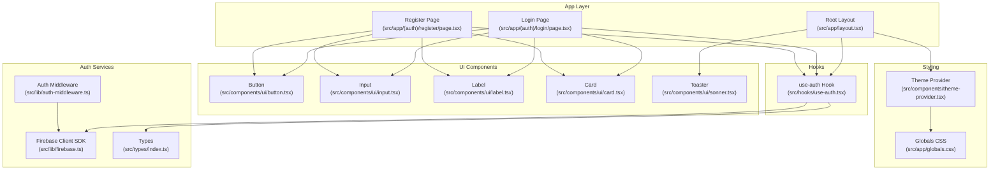
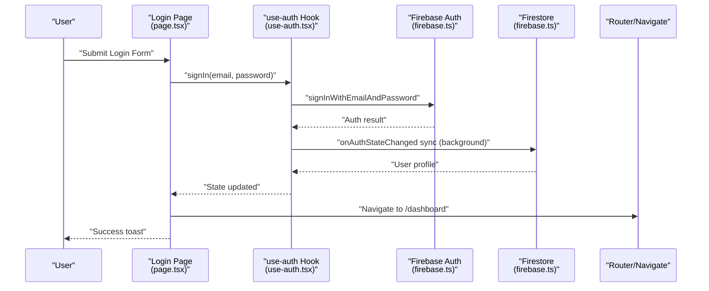
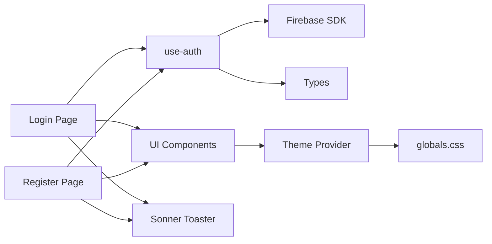
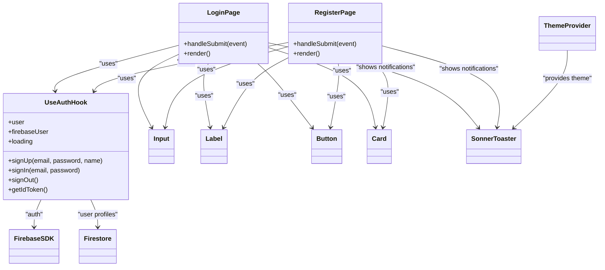

# Authentication UI Components

<cite>
**Referenced Files in This Document**
- [src/app/(auth)/login/page.tsx](file://src/app/(auth)/login/page.tsx)
- [src/app/(auth)/register/page.tsx](file://src/app/(auth)/register/page.tsx)
- [src/hooks/use-auth.tsx](file://src/hooks/use-auth.tsx)
- [src/lib/auth-middleware.ts](file://src/lib/auth-middleware.ts)
- [src/lib/firebase.ts](file://src/lib/firebase.ts)
- [src/app/layout.tsx](file://src/app/layout.tsx)
- [src/components/theme-provider.tsx](file://src/components/theme-provider.tsx)
- [src/components/ui/sonner.tsx](file://src/components/ui/sonner.tsx)
- [src/components/ui/input.tsx](file://src/components/ui/input.tsx)
- [src/components/ui/button.tsx](file://src/components/ui/button.tsx)
- [src/components/ui/label.tsx](file://src/components/ui/label.tsx)
- [src/components/ui/card.tsx](file://src/components/ui/card.tsx)
- [src/app/globals.css](file://src/app/globals.css)
- [src/types/index.ts](file://src/types/index.ts)
</cite>

## Table of Contents
1. [Introduction](#introduction)
2. [Project Structure](#project-structure)
3. [Core Components](#core-components)
4. [Architecture Overview](#architecture-overview)
5. [Detailed Component Analysis](#detailed-component-analysis)
6. [Dependency Analysis](#dependency-analysis)
7. [Performance Considerations](#performance-considerations)
8. [Troubleshooting Guide](#troubleshooting-guide)
9. [Conclusion](#conclusion)
10. [Appendices](#appendices)

## Introduction
This document provides comprehensive documentation for the authentication UI components in the application, focusing on the login and registration pages. It explains form validation, user input handling, error messaging, integration with the use-auth hook for authentication actions and state management, and the end-to-end user experience flow from form submission to successful login or registration. It also covers responsive design, accessibility, mobile optimization, styling with Tailwind CSS and the application theme, and troubleshooting guidance for common issues.

## Project Structure
The authentication UI is organized under the app routing segments for login and registration, with shared UI components and a centralized authentication hook. The global layout initializes the theme provider and authentication provider so all pages inherit consistent theming and authentication state. The Firebase client SDK is configured centrally and consumed by the authentication hook.

**Diagram sources**
- [src/app/layout.tsx:26-49](file://src/app/layout.tsx#L26-L49)
- [src/app/(auth)/login/page.tsx:14-98](file://src/app/(auth)/login/page.tsx#L14-L98)
- [src/app/(auth)/register/page.tsx:14-117](file://src/app/(auth)/register/page.tsx#L14-L117)
- [src/hooks/use-auth.tsx:34-108](file://src/hooks/use-auth.tsx#L34-L108)
- [src/lib/firebase.ts:1-22](file://src/lib/firebase.ts#L1-L22)
- [src/lib/auth-middleware.ts:1-48](file://src/lib/auth-middleware.ts#L1-L48)
- [src/components/ui/button.tsx:1-58](file://src/components/ui/button.tsx#L1-L58)
- [src/components/ui/input.tsx:1-20](file://src/components/ui/input.tsx#L1-L20)
- [src/components/ui/label.tsx:1-21](file://src/components/ui/label.tsx#L1-L21)
- [src/components/ui/card.tsx:1-104](file://src/components/ui/card.tsx#L1-L104)
- [src/components/ui/sonner.tsx:1-50](file://src/components/ui/sonner.tsx#L1-L50)
- [src/components/theme-provider.tsx:1-13](file://src/components/theme-provider.tsx#L1-L13)
- [src/app/globals.css:1-120](file://src/app/globals.css#L1-L120)
- [src/types/index.ts:1-90](file://src/types/index.ts#L1-L90)

**Section sources**
- [src/app/layout.tsx:26-49](file://src/app/layout.tsx#L26-L49)
- [src/app/(auth)/login/page.tsx:14-98](file://src/app/(auth)/login/page.tsx#L14-L98)
- [src/app/(auth)/register/page.tsx:14-117](file://src/app/(auth)/register/page.tsx#L14-L117)
- [src/hooks/use-auth.tsx:34-108](file://src/hooks/use-auth.tsx#L34-L108)
- [src/lib/firebase.ts:1-22](file://src/lib/firebase.ts#L1-L22)
- [src/lib/auth-middleware.ts:1-48](file://src/lib/auth-middleware.ts#L1-L48)
- [src/components/ui/button.tsx:1-58](file://src/components/ui/button.tsx#L1-L58)
- [src/components/ui/input.tsx:1-20](file://src/components/ui/input.tsx#L1-L20)
- [src/components/ui/label.tsx:1-21](file://src/components/ui/label.tsx#L1-L21)
- [src/components/ui/card.tsx:1-104](file://src/components/ui/card.tsx#L1-L104)
- [src/components/ui/sonner.tsx:1-50](file://src/components/ui/sonner.tsx#L1-L50)
- [src/components/theme-provider.tsx:1-13](file://src/components/theme-provider.tsx#L1-L13)
- [src/app/globals.css:1-120](file://src/app/globals.css#L1-L120)
- [src/types/index.ts:1-90](file://src/types/index.ts#L1-L90)

## Core Components
- Login Page: Implements a form with email and password fields, handles submission via the use-auth hook, displays loading states, and navigates on success. It uses shared UI components for input, label, button, and card.
- Registration Page: Implements a form with name, email, and password fields, enforces client-side password length validation, and manages asynchronous registration flow with feedback and navigation.
- use-auth Hook: Provides authentication actions (signUp, signIn, signOut), maintains user and Firebase user state, synchronizes with Firebase Auth state, and persists user profiles in Firestore.
- UI Components: Shared primitives (Button, Input, Label, Card) and a Toaster for notifications integrate with the theme system and Tailwind-based design tokens.
- Theme and Styling: ThemeProvider enables light/dark mode; globals.css defines CSS variables and Tailwind-based theme tokens; sonner integrates with the theme for toast styling.

Key responsibilities and interactions:
- Form pages manage local state for inputs and loading flags, delegate authentication actions to use-auth, and handle navigation after success.
- use-auth orchestrates Firebase operations, updates internal state, and exposes methods for consuming components.
- UI components encapsulate styling and accessibility attributes; they rely on Tailwind utilities and theme variables.
- ThemeProvider and globals.css ensure consistent appearance across devices and themes.

**Section sources**
- [src/app/(auth)/login/page.tsx:14-98](file://src/app/(auth)/login/page.tsx#L14-L98)
- [src/app/(auth)/register/page.tsx:14-117](file://src/app/(auth)/register/page.tsx#L14-L117)
- [src/hooks/use-auth.tsx:34-108](file://src/hooks/use-auth.tsx#L34-L108)
- [src/components/ui/button.tsx:1-58](file://src/components/ui/button.tsx#L1-L58)
- [src/components/ui/input.tsx:1-20](file://src/components/ui/input.tsx#L1-L20)
- [src/components/ui/label.tsx:1-21](file://src/components/ui/label.tsx#L1-L21)
- [src/components/ui/card.tsx:1-104](file://src/components/ui/card.tsx#L1-L104)
- [src/components/ui/sonner.tsx:1-50](file://src/components/ui/sonner.tsx#L1-L50)
- [src/components/theme-provider.tsx:1-13](file://src/components/theme-provider.tsx#L1-L13)
- [src/app/globals.css:1-120](file://src/app/globals.css#L1-L120)

## Architecture Overview
The authentication UI follows a unidirectional data flow:
- UI pages capture user input and trigger actions via use-auth.
- use-auth performs Firebase operations and updates internal state.
- UI pages react to loading states and navigate upon success.
- Notifications are shown via the Toaster integrated with the theme system.

**Diagram sources**
- [src/app/(auth)/login/page.tsx:14-36](file://src/app/(auth)/login/page.tsx#L14-L36)
- [src/hooks/use-auth.tsx:84-86](file://src/hooks/use-auth.tsx#L84-L86)
- [src/lib/firebase.ts:18-19](file://src/lib/firebase.ts#L18-L19)

**Section sources**
- [src/app/(auth)/login/page.tsx:14-36](file://src/app/(auth)/login/page.tsx#L14-L36)
- [src/hooks/use-auth.tsx:84-86](file://src/hooks/use-auth.tsx#L84-L86)
- [src/lib/firebase.ts:18-19](file://src/lib/firebase.ts#L18-L19)

## Detailed Component Analysis

### Login Page
Responsibilities:
- Render a centered card with email and password fields.
- Capture user input and prevent default form submission.
- Call use-auth.signIn with loading state management.
- Display success and error notifications via toast.
- Navigate to the dashboard on success.

Validation and error handling:
- Uses required attributes on inputs for basic HTML constraints.
- Displays user-friendly messages derived from thrown errors.
- Disables submit button during loading to prevent duplicate submissions.

User experience flow:
- On submit, show spinner on button and disable interactions.
- On success, show a success toast and redirect to dashboard.
- On failure, show an error toast with a fallback message.

Accessibility and responsive design:
- Uses semantic Label and Input components with proper htmlFor/id pairing.
- Responsive container ensures centering and padding on small screens.
- Button remains accessible with disabled state and aria semantics.

**Section sources**
- [src/app/(auth)/login/page.tsx:14-98](file://src/app/(auth)/login/page.tsx#L14-L98)
- [src/components/ui/input.tsx:1-20](file://src/components/ui/input.tsx#L1-L20)
- [src/components/ui/label.tsx:1-21](file://src/components/ui/label.tsx#L1-L21)
- [src/components/ui/button.tsx:1-58](file://src/components/ui/button.tsx#L1-L58)
- [src/components/ui/card.tsx:1-104](file://src/components/ui/card.tsx#L1-L104)
- [src/components/ui/sonner.tsx:1-50](file://src/components/ui/sonner.tsx#L1-L50)

### Registration Page
Responsibilities:
- Render a centered card with name, email, and password fields.
- Enforce client-side validation for minimum password length.
- Call use-auth.signUp with loading state management.
- Display success and error notifications via toast.
- Navigate to the dashboard on success.

Validation and error handling:
- Validates password length before initiating registration.
- Displays user-friendly messages derived from thrown errors.
- Disables submit button during loading to prevent duplicate submissions.

User experience flow:
- On submit, show spinner on button and disable interactions.
- On success, show a success toast and redirect to dashboard.
- On failure, show an error toast with a fallback message.

Accessibility and responsive design:
- Uses semantic Label and Input components with proper htmlFor/id pairing.
- Responsive container ensures centering and padding on small screens.
- Button remains accessible with disabled state and aria semantics.

**Section sources**
- [src/app/(auth)/register/page.tsx:14-117](file://src/app/(auth)/register/page.tsx#L14-L117)
- [src/components/ui/input.tsx:1-20](file://src/components/ui/input.tsx#L1-L20)
- [src/components/ui/label.tsx:1-21](file://src/components/ui/label.tsx#L1-L21)
- [src/components/ui/button.tsx:1-58](file://src/components/ui/button.tsx#L1-L58)
- [src/components/ui/card.tsx:1-104](file://src/components/ui/card.tsx#L1-L104)
- [src/components/ui/sonner.tsx:1-50](file://src/components/ui/sonner.tsx#L1-L50)

### use-auth Hook
Responsibilities:
- Provide authentication actions: signUp, signIn, signOut, getIdToken.
- Manage user and Firebase user state with onAuthStateChanged listener.
- Persist user profiles in Firestore and create missing profiles automatically.
- Expose loading state for initialization.

Processing logic:
- onAuthStateChanged updates Firebase user and fetches/creates Firestore user profile.
- signUp creates credentials, sets display name, writes user document, and updates state.
- signIn delegates to Firebase authentication.
- signOut clears state and signs out from Firebase.

Integration points:
- Consumed by login and registration pages.
- Used by middleware for server-side authentication checks.

**Section sources**
- [src/hooks/use-auth.tsx:34-108](file://src/hooks/use-auth.tsx#L34-L108)
- [src/lib/firebase.ts:18-19](file://src/lib/firebase.ts#L18-L19)
- [src/types/index.ts:3-9](file://src/types/index.ts#L3-L9)

### UI Components and Styling
- Input: Provides consistent sizing, focus styles, and theme-aware colors via Tailwind utilities and theme variables.
- Button: Variants and sizes are defined via class variance authority; integrates with theme tokens.
- Label: Ensures proper association with inputs and consistent typography.
- Card: Provides structured layout for forms with header/title/content/footer slots.
- Sonner Toaster: Integrates with the theme system and uses theme variables for toast styling.

Styling approach:
- Tailwind CSS utilities are applied directly to components for consistent spacing, colors, and responsiveness.
- Theme variables defined in globals.css propagate to components via CSS custom properties.
- ThemeProvider switches between light/dark modes seamlessly.

**Section sources**
- [src/components/ui/input.tsx:1-20](file://src/components/ui/input.tsx#L1-L20)
- [src/components/ui/button.tsx:1-58](file://src/components/ui/button.tsx#L1-L58)
- [src/components/ui/label.tsx:1-21](file://src/components/ui/label.tsx#L1-L21)
- [src/components/ui/card.tsx:1-104](file://src/components/ui/card.tsx#L1-L104)
- [src/components/ui/sonner.tsx:1-50](file://src/components/ui/sonner.tsx#L1-L50)
- [src/app/globals.css:1-120](file://src/app/globals.css#L1-L120)
- [src/components/theme-provider.tsx:1-13](file://src/components/theme-provider.tsx#L1-L13)

### Auth Middleware (Server-side)
Responsibilities:
- Verify Authorization header Bearer tokens.
- Require authentication for protected routes.
- Enforce admin roles by checking Firestore user documents.

Integration:
- Used by API routes to validate requests and enforce permissions.

**Section sources**
- [src/lib/auth-middleware.ts:1-48](file://src/lib/auth-middleware.ts#L1-L48)

## Dependency Analysis
The authentication UI components depend on:
- use-auth hook for authentication actions and state.
- Firebase client SDK for authentication and Firestore operations.
- UI components for consistent styling and accessibility.
- Theme provider and globals.css for theming.
- Sonner for toast notifications.

**Diagram sources**
- [src/app/(auth)/login/page.tsx:14-98](file://src/app/(auth)/login/page.tsx#L14-L98)
- [src/app/(auth)/register/page.tsx:14-117](file://src/app/(auth)/register/page.tsx#L14-L117)
- [src/hooks/use-auth.tsx:34-108](file://src/hooks/use-auth.tsx#L34-L108)
- [src/lib/firebase.ts:1-22](file://src/lib/firebase.ts#L1-L22)
- [src/components/ui/button.tsx:1-58](file://src/components/ui/button.tsx#L1-L58)
- [src/components/ui/input.tsx:1-20](file://src/components/ui/input.tsx#L1-L20)
- [src/components/ui/label.tsx:1-21](file://src/components/ui/label.tsx#L1-L21)
- [src/components/ui/card.tsx:1-104](file://src/components/ui/card.tsx#L1-L104)
- [src/components/ui/sonner.tsx:1-50](file://src/components/ui/sonner.tsx#L1-L50)
- [src/components/theme-provider.tsx:1-13](file://src/components/theme-provider.tsx#L1-L13)
- [src/app/globals.css:1-120](file://src/app/globals.css#L1-L120)

**Section sources**
- [src/app/(auth)/login/page.tsx:14-98](file://src/app/(auth)/login/page.tsx#L14-L98)
- [src/app/(auth)/register/page.tsx:14-117](file://src/app/(auth)/register/page.tsx#L14-L117)
- [src/hooks/use-auth.tsx:34-108](file://src/hooks/use-auth.tsx#L34-L108)
- [src/lib/firebase.ts:1-22](file://src/lib/firebase.ts#L1-L22)
- [src/components/ui/button.tsx:1-58](file://src/components/ui/button.tsx#L1-L58)
- [src/components/ui/input.tsx:1-20](file://src/components/ui/input.tsx#L1-L20)
- [src/components/ui/label.tsx:1-21](file://src/components/ui/label.tsx#L1-L21)
- [src/components/ui/card.tsx:1-104](file://src/components/ui/card.tsx#L1-L104)
- [src/components/ui/sonner.tsx:1-50](file://src/components/ui/sonner.tsx#L1-L50)
- [src/components/theme-provider.tsx:1-13](file://src/components/theme-provider.tsx#L1-L13)
- [src/app/globals.css:1-120](file://src/app/globals.css#L1-L120)

## Performance Considerations
- Minimize re-renders by keeping form state local to the pages and avoiding unnecessary prop drilling.
- Debounce or throttle network requests if extended validation is added later.
- Use lazy loading for heavy assets if additional media is introduced.
- Keep theme switching efficient by relying on CSS variables and avoiding runtime theme recalculations.

## Troubleshooting Guide
Common form validation errors:
- Password too short (registration): The registration page validates password length and shows an error toast if less than the required length. Ensure the minimum length matches backend expectations.

Authentication failures:
- Invalid credentials (login): The login page catches errors and displays a user-friendly message via toast. Confirm credentials and network connectivity.
- Account creation errors (registration): The registration page catches errors and displays a user-friendly message via toast. Check for duplicate emails or invalid inputs.

Navigation and state:
- Post-login navigation: After successful sign-in, the login page navigates to the dashboard. Ensure the navigation target exists and that authentication state is properly initialized.
- Post-registration navigation: After successful sign-up, the registration page navigates to the dashboard. Confirm that the user profile is created in Firestore.

Theme and styling:
- Theme not applying: Verify ThemeProvider wraps the application and that globals.css defines theme variables. Check browser dev tools for CSS custom property resolution.
- Toast styling inconsistencies: Ensure Sonner Toaster is rendered and that theme variables are correctly mapped.

Accessibility:
- Labels and inputs: Ensure each input has a corresponding label with a matching htmlFor/id to support screen readers.
- Focus states: Inputs and buttons should remain keyboard accessible with visible focus indicators.

Responsive design:
- Mobile optimization: Forms should remain usable on small screens with adequate spacing and touch targets. Test on various viewport sizes.

**Section sources**
- [src/app/(auth)/login/page.tsx:21-36](file://src/app/(auth)/login/page.tsx#L21-L36)
- [src/app/(auth)/register/page.tsx:22-43](file://src/app/(auth)/register/page.tsx#L22-L43)
- [src/components/ui/sonner.tsx:1-50](file://src/components/ui/sonner.tsx#L1-L50)
- [src/app/globals.css:1-120](file://src/app/globals.css#L1-L120)

## Conclusion
The authentication UI components provide a cohesive, accessible, and responsive experience for login and registration. They leverage a centralized use-auth hook for authentication actions and state, integrate with Firebase for identity and data persistence, and apply a consistent theme and styling system. The design emphasizes user feedback through toasts, clear navigation, and robust error handling, while maintaining accessibility and mobile usability.

## Appendices

### Class Diagram: Authentication UI Components

**Diagram sources**
- [src/app/(auth)/login/page.tsx:14-98](file://src/app/(auth)/login/page.tsx#L14-L98)
- [src/app/(auth)/register/page.tsx:14-117](file://src/app/(auth)/register/page.tsx#L14-L117)
- [src/hooks/use-auth.tsx:34-108](file://src/hooks/use-auth.tsx#L34-L108)
- [src/components/ui/input.tsx:1-20](file://src/components/ui/input.tsx#L1-L20)
- [src/components/ui/label.tsx:1-21](file://src/components/ui/label.tsx#L1-L21)
- [src/components/ui/button.tsx:1-58](file://src/components/ui/button.tsx#L1-L58)
- [src/components/ui/card.tsx:1-104](file://src/components/ui/card.tsx#L1-L104)
- [src/components/ui/sonner.tsx:1-50](file://src/components/ui/sonner.tsx#L1-L50)
- [src/components/theme-provider.tsx:1-13](file://src/components/theme-provider.tsx#L1-L13)
- [src/lib/firebase.ts:1-22](file://src/lib/firebase.ts#L1-L22)