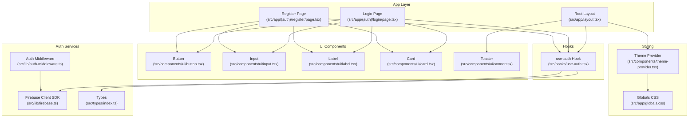
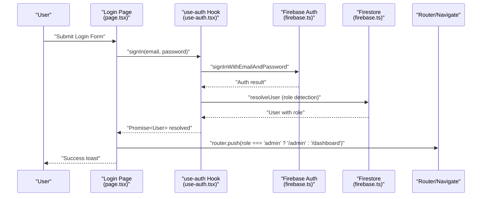
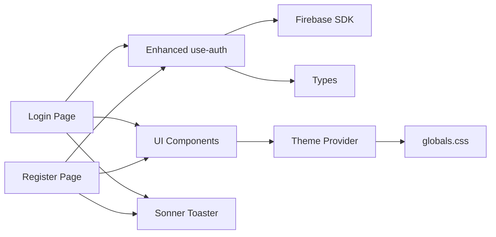
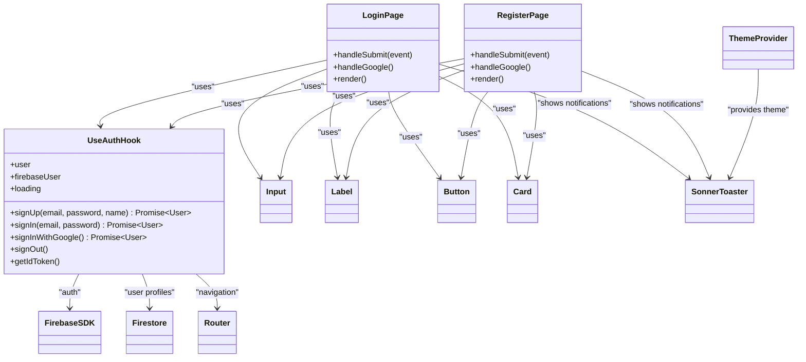

# Authentication UI Components

<cite>
**Referenced Files in This Document**
- [src/app/(auth)/login/page.tsx](file://src/app/(auth)/login/page.tsx)
- [src/app/(auth)/register/page.tsx](file://src/app/(auth)/register/page.tsx)
- [src/hooks/use-auth.tsx](file://src/hooks/use-auth.tsx)
- [src/lib/auth-middleware.ts](file://src/lib/auth-middleware.ts)
- [src/lib/firebase.ts](file://src/lib/firebase.ts)
- [src/app/layout.tsx](file://src/app/layout.tsx)
- [src/components/theme-provider.tsx](file://src/components/theme-provider.tsx)
- [src/components/ui/sonner.tsx](file://src/components/ui/sonner.tsx)
- [src/components/ui/input.tsx](file://src/components/ui/input.tsx)
- [src/components/ui/button.tsx](file://src/components/ui/button.tsx)
- [src/components/ui/label.tsx](file://src/components/ui/label.tsx)
- [src/components/ui/card.tsx](file://src/components/ui/card.tsx)
- [src/app/globals.css](file://src/app/globals.css)
- [src/types/index.ts](file://src/types/index.ts)
</cite>

## Update Summary
**Changes Made**
- Updated authentication flow documentation to reflect immediate user redirection using resolved user data
- Enhanced login and registration page documentation to show direct role-based routing with router.push
- Updated use-auth hook documentation to highlight the new Promise-based authentication functions that return resolved user data
- Revised troubleshooting guide to address the new immediate redirection mechanism
- Updated architecture diagrams to reflect the enhanced authentication flow

## Table of Contents
1. [Introduction](#introduction)
2. [Project Structure](#project-structure)
3. [Core Components](#core-components)
4. [Architecture Overview](#architecture-overview)
5. [Detailed Component Analysis](#detailed-component-analysis)
6. [Dependency Analysis](#dependency-analysis)
7. [Performance Considerations](#performance-considerations)
8. [Troubleshooting Guide](#troubleshooting-guide)
9. [Conclusion](#conclusion)
10. [Appendices](#appendices)

## Introduction
This document provides comprehensive documentation for the authentication UI components in the application, focusing on the enhanced login and registration pages with immediate user redirection. The system now captures resolved user data from authentication functions and performs direct role-based routing using Next.js router.push, eliminating timing issues associated with previous useEffect-based redirect logic. It explains form validation, user input handling, error messaging, integration with the use-auth hook for authentication actions and state management, and the end-to-end user experience flow from form submission to successful login or registration with immediate navigation.

## Project Structure
The authentication UI is organized under the app routing segments for login and registration, with shared UI components and a centralized authentication hook. The global layout initializes the theme provider, authentication provider, and language provider so all pages inherit consistent theming, authentication state, and internationalization. The Firebase client SDK is configured centrally and consumed by the authentication hook.

**Diagram sources**
- [src/app/layout.tsx:28-54](file://src/app/layout.tsx#L28-L54)
- [src/app/(auth)/login/page.tsx:12-152](file://src/app/(auth)/login/page.tsx#L12-L152)
- [src/app/(auth)/register/page.tsx:12-151](file://src/app/(auth)/register/page.tsx#L12-L151)
- [src/hooks/use-auth.tsx:44-190](file://src/hooks/use-auth.tsx#L44-L190)
- [src/lib/firebase.ts:1-22](file://src/lib/firebase.ts#L1-L22)
- [src/lib/auth-middleware.ts:1-48](file://src/lib/auth-middleware.ts#L1-L48)
- [src/components/ui/button.tsx:1-58](file://src/components/ui/button.tsx#L1-L58)
- [src/components/ui/input.tsx:1-20](file://src/components/ui/input.tsx#L1-L20)
- [src/components/ui/label.tsx:1-21](file://src/components/ui/label.tsx#L1-L21)
- [src/components/ui/card.tsx:1-104](file://src/components/ui/card.tsx#L1-L104)
- [src/components/ui/sonner.tsx:1-50](file://src/components/ui/sonner.tsx#L1-L50)
- [src/components/theme-provider.tsx:1-13](file://src/components/theme-provider.tsx#L1-L13)
- [src/app/globals.css:1-120](file://src/app/globals.css#L1-L120)
- [src/types/index.ts:3-9](file://src/types/index.ts#L3-L9)

**Section sources**
- [src/app/layout.tsx:28-54](file://src/app/layout.tsx#L28-L54)
- [src/app/(auth)/login/page.tsx:12-152](file://src/app/(auth)/login/page.tsx#L12-L152)
- [src/app/(auth)/register/page.tsx:12-151](file://src/app/(auth)/register/page.tsx#L12-L151)
- [src/hooks/use-auth.tsx:44-190](file://src/hooks/use-auth.tsx#L44-L190)
- [src/lib/firebase.ts:1-22](file://src/lib/firebase.ts#L1-L22)
- [src/lib/auth-middleware.ts:1-48](file://src/lib/auth-middleware.ts#L1-L48)
- [src/components/ui/button.tsx:1-58](file://src/components/ui/button.tsx#L1-L58)
- [src/components/ui/input.tsx:1-20](file://src/components/ui/input.tsx#L1-L20)
- [src/components/ui/label.tsx:1-21](file://src/components/ui/label.tsx#L1-L21)
- [src/components/ui/card.tsx:1-104](file://src/components/ui/card.tsx#L1-L104)
- [src/components/ui/sonner.tsx:1-50](file://src/components/ui/sonner.tsx#L1-L50)
- [src/components/theme-provider.tsx:1-13](file://src/components/theme-provider.tsx#L1-L13)
- [src/app/globals.css:1-120](file://src/app/globals.css#L1-L120)
- [src/types/index.ts:3-9](file://src/types/index.ts#L3-L9)

## Core Components
- **Enhanced Login Page**: Implements a form with email and password fields, captures resolved user data from authentication functions, performs immediate role-based routing using router.push, displays loading states, and navigates on success. It uses shared UI components for input, label, button, and card.
- **Enhanced Registration Page**: Implements a form with name, email, and password fields, enforces client-side password length validation, captures resolved user data from authentication functions, performs immediate role-based routing using router.push, and manages asynchronous registration flow with feedback and navigation.
- **use-auth Hook**: Provides authentication actions (signUp, signIn, signInWithGoogle, signOut, getIdToken) that return Promise<User>, maintains user and Firebase user state, synchronizes with Firebase Auth state, persists user profiles in Firestore, and exposes loading state for initialization.
- **UI Components**: Shared primitives (Button, Input, Label, Card) and a Toaster for notifications integrate with the theme system and Tailwind-based design tokens.
- **Theme and Styling**: ThemeProvider enables light/dark mode; globals.css defines CSS variables and Tailwind-based theme tokens; sonner integrates with the theme for toast styling.

Key responsibilities and interactions:
- Form pages capture user input and trigger actions via use-auth, immediately capturing resolved user data and performing router.push navigation.
- use-auth orchestrates Firebase operations, resolves user data with role information, updates internal state, and exposes methods for consuming components.
- UI components encapsulate styling and accessibility attributes; they rely on Tailwind utilities and theme variables.
- ThemeProvider and globals.css ensure consistent appearance across devices and themes.

**Section sources**
- [src/app/(auth)/login/page.tsx:12-152](file://src/app/(auth)/login/page.tsx#L12-L152)
- [src/app/(auth)/register/page.tsx:12-151](file://src/app/(auth)/register/page.tsx#L12-L151)
- [src/hooks/use-auth.tsx:31-190](file://src/hooks/use-auth.tsx#L31-L190)
- [src/components/ui/button.tsx:1-58](file://src/components/ui/button.tsx#L1-L58)
- [src/components/ui/input.tsx:1-20](file://src/components/ui/input.tsx#L1-L20)
- [src/components/ui/label.tsx:1-21](file://src/components/ui/label.tsx#L1-L21)
- [src/components/ui/card.tsx:1-104](file://src/components/ui/card.tsx#L1-L104)
- [src/components/ui/sonner.tsx:1-50](file://src/components/ui/sonner.tsx#L1-L50)
- [src/components/theme-provider.tsx:1-13](file://src/components/theme-provider.tsx#L1-L13)
- [src/app/globals.css:1-120](file://src/app/globals.css#L1-L120)

## Architecture Overview
The authentication UI follows an enhanced unidirectional data flow with immediate redirection:
- UI pages capture user input and trigger actions via use-auth, immediately capturing resolved user data.
- use-auth performs Firebase operations, resolves user with role information, and returns Promise<User>.
- UI pages perform immediate router.push navigation based on resolved user role.
- Notifications are shown via the Toaster integrated with the theme system.

**Diagram sources**
- [src/app/(auth)/login/page.tsx:27-58](file://src/app/(auth)/login/page.tsx#L27-L58)
- [src/hooks/use-auth.tsx:147-152](file://src/hooks/use-auth.tsx#L147-L152)
- [src/lib/firebase.ts:18-19](file://src/lib/firebase.ts#L18-L19)

**Section sources**
- [src/app/(auth)/login/page.tsx:27-58](file://src/app/(auth)/login/page.tsx#L27-L58)
- [src/hooks/use-auth.tsx:147-152](file://src/hooks/use-auth.tsx#L147-L152)
- [src/lib/firebase.ts:18-19](file://src/lib/firebase.ts#L18-L19)

## Detailed Component Analysis

### Enhanced Login Page
**Updated** The login page now captures resolved user data from authentication functions and performs immediate role-based routing using router.push.

Responsibilities:
- Render a centered card with email and password fields and Google sign-in option.
- Capture user input and prevent default form submission.
- Call use-auth.signIn with loading state management and capture resolved user data.
- Display success and error notifications via toast.
- Perform immediate role-based routing using router.push with resolved user data.

Enhanced validation and error handling:
- Uses required attributes on inputs for basic HTML constraints.
- Displays user-friendly messages derived from thrown errors.
- Disables submit button during loading to prevent duplicate submissions.
- Handles Google account linked error scenarios with specific toast messages.

Enhanced user experience flow:
- On submit, show spinner on button and disable interactions.
- On success, capture resolved user data and immediately redirect based on role.
- On failure, show an error toast with a fallback message and specific handling for invalid credentials.

Immediate redirection mechanism:
- Captures resolvedUser from signIn promise and uses router.push for navigation.
- Performs role-based routing: admin users go to /admin, regular users to /dashboard.
- Eliminates useEffect-based redirect logic that caused timing issues.

Accessibility and responsive design:
- Uses semantic Label and Input components with proper htmlFor/id pairing.
- Responsive container ensures centering and padding on small screens.
- Button remains accessible with disabled state and aria semantics.
- Google sign-in button provides alternative authentication method.

**Section sources**
- [src/app/(auth)/login/page.tsx:12-152](file://src/app/(auth)/login/page.tsx#L12-L152)
- [src/components/ui/input.tsx:1-20](file://src/components/ui/input.tsx#L1-L20)
- [src/components/ui/label.tsx:1-21](file://src/components/ui/label.tsx#L1-L21)
- [src/components/ui/button.tsx:1-58](file://src/components/ui/button.tsx#L1-L58)
- [src/components/ui/card.tsx:1-104](file://src/components/ui/card.tsx#L1-L104)
- [src/components/ui/sonner.tsx:1-50](file://src/components/ui/sonner.tsx#L1-L50)

### Enhanced Registration Page
**Updated** The registration page now captures resolved user data from authentication functions and performs immediate role-based routing using router.push.

Responsibilities:
- Render a centered card with name, email, and password fields and Google sign-in option.
- Enforce client-side validation for minimum password length.
- Call use-auth.signUp with loading state management and capture resolved user data.
- Display success and error notifications via toast.
- Perform immediate role-based routing using router.push with resolved user data.

Enhanced validation and error handling:
- Validates password length before initiating registration.
- Displays user-friendly messages derived from thrown errors.
- Disables submit button during loading to prevent duplicate submissions.
- Handles Google sign-in errors gracefully.

Enhanced user experience flow:
- On submit, show spinner on button and disable interactions.
- On success, capture resolved user data and immediately redirect based on role.
- On failure, show an error toast with a fallback message.

Immediate redirection mechanism:
- Captures resolvedUser from signUp promise and uses router.push for navigation.
- Performs role-based routing: admin users go to /admin, regular users to /dashboard.
- Eliminates useEffect-based redirect logic that caused timing issues.

Accessibility and responsive design:
- Uses semantic Label and Input components with proper htmlFor/id pairing.
- Responsive container ensures centering and padding on small screens.
- Button remains accessible with disabled state and aria semantics.
- Google sign-in button provides alternative authentication method.

**Section sources**
- [src/app/(auth)/register/page.tsx:12-151](file://src/app/(auth)/register/page.tsx#L12-L151)
- [src/components/ui/input.tsx:1-20](file://src/components/ui/input.tsx#L1-L20)
- [src/components/ui/label.tsx:1-21](file://src/components/ui/label.tsx#L1-L21)
- [src/components/ui/button.tsx:1-58](file://src/components/ui/button.tsx#L1-L58)
- [src/components/ui/card.tsx:1-104](file://src/components/ui/card.tsx#L1-L104)
- [src/components/ui/sonner.tsx:1-50](file://src/components/ui/sonner.tsx#L1-L50)

### Enhanced use-auth Hook
**Updated** The use-auth hook now returns Promise<User> from authentication functions, enabling immediate user redirection.

Responsibilities:
- Provide authentication actions: signUp, signIn, signInWithGoogle, signOut, getIdToken that return Promise<User>.
- Manage user and Firebase user state with onAuthStateChanged listener.
- Resolve user data with role information and persist user profiles in Firestore.
- Expose loading state for initialization.

Enhanced processing logic:
- onAuthStateChanged updates Firebase user and fetches/creates Firestore user profile with role detection.
- signUp creates credentials, sets display name, writes user document, resolves user with role, and updates state.
- signIn delegates to Firebase authentication and resolves user with role detection.
- signInWithGoogle handles Google authentication and resolves user with role detection.
- signOut clears state and signs out from Firebase.
- resolveUser function detects admin roles based on email and Firestore data.

Enhanced integration points:
- Consumed by login and registration pages for immediate user redirection.
- Used by middleware for server-side authentication checks.
- Provides Promise<User> for direct navigation capabilities.

**Section sources**
- [src/hooks/use-auth.tsx:31-190](file://src/hooks/use-auth.tsx#L31-L190)
- [src/lib/firebase.ts:18-19](file://src/lib/firebase.ts#L18-L19)
- [src/types/index.ts:3-9](file://src/types/index.ts#L3-L9)

### UI Components and Styling
- **Input**: Provides consistent sizing, focus styles, and theme-aware colors via Tailwind utilities and theme variables.
- **Button**: Variants and sizes are defined via class variance authority; integrates with theme tokens.
- **Label**: Ensures proper association with inputs and consistent typography.
- **Card**: Provides structured layout for forms with header/title/content/footer slots.
- **Sonner Toaster**: Integrates with the theme system and uses theme variables for toast styling.

Styling approach:
- Tailwind CSS utilities are applied directly to components for consistent spacing, colors, and responsiveness.
- Theme variables defined in globals.css propagate to components via CSS custom properties.
- ThemeProvider switches between light/dark modes seamlessly.

**Section sources**
- [src/components/ui/input.tsx:1-20](file://src/components/ui/input.tsx#L1-L20)
- [src/components/ui/button.tsx:1-58](file://src/components/ui/button.tsx#L1-L58)
- [src/components/ui/label.tsx:1-21](file://src/components/ui/label.tsx#L1-L21)
- [src/components/ui/card.tsx:1-104](file://src/components/ui/card.tsx#L1-L104)
- [src/components/ui/sonner.tsx:1-50](file://src/components/ui/sonner.tsx#L1-L50)
- [src/app/globals.css:1-120](file://src/app/globals.css#L1-L120)
- [src/components/theme-provider.tsx:1-13](file://src/components/theme-provider.tsx#L1-L13)

### Auth Middleware (Server-side)
Responsibilities:
- Verify Authorization header Bearer tokens.
- Require authentication for protected routes.
- Enforce admin roles by checking Firestore user documents.

Integration:
- Used by API routes to validate requests and enforce permissions.

**Section sources**
- [src/lib/auth-middleware.ts:1-48](file://src/lib/auth-middleware.ts#L1-L48)

## Dependency Analysis
The authentication UI components depend on:
- Enhanced use-auth hook for authentication actions that return Promise<User>.
- Firebase client SDK for authentication and Firestore operations.
- UI components for consistent styling and accessibility.
- Theme provider and globals.css for theming.
- Sonner for toast notifications.

**Diagram sources**
- [src/app/(auth)/login/page.tsx:12-152](file://src/app/(auth)/login/page.tsx#L12-L152)
- [src/app/(auth)/register/page.tsx:12-151](file://src/app/(auth)/register/page.tsx#L12-L151)
- [src/hooks/use-auth.tsx:31-190](file://src/hooks/use-auth.tsx#L31-L190)
- [src/lib/firebase.ts:1-22](file://src/lib/firebase.ts#L1-L22)
- [src/components/ui/button.tsx:1-58](file://src/components/ui/button.tsx#L1-L58)
- [src/components/ui/input.tsx:1-20](file://src/components/ui/input.tsx#L1-L20)
- [src/components/ui/label.tsx:1-21](file://src/components/ui/label.tsx#L1-L21)
- [src/components/ui/card.tsx:1-104](file://src/components/ui/card.tsx#L1-L104)
- [src/components/ui/sonner.tsx:1-50](file://src/components/ui/sonner.tsx#L1-L50)
- [src/components/theme-provider.tsx:1-13](file://src/components/theme-provider.tsx#L1-L13)
- [src/app/globals.css:1-120](file://src/app/globals.css#L1-L120)

**Section sources**
- [src/app/(auth)/login/page.tsx:12-152](file://src/app/(auth)/login/page.tsx#L12-L152)
- [src/app/(auth)/register/page.tsx:12-151](file://src/app/(auth)/register/page.tsx#L12-L151)
- [src/hooks/use-auth.tsx:31-190](file://src/hooks/use-auth.tsx#L31-L190)
- [src/lib/firebase.ts:1-22](file://src/lib/firebase.ts#L1-L22)
- [src/components/ui/button.tsx:1-58](file://src/components/ui/button.tsx#L1-L58)
- [src/components/ui/input.tsx:1-20](file://src/components/ui/input.tsx#L1-L20)
- [src/components/ui/label.tsx:1-21](file://src/components/ui/label.tsx#L1-L21)
- [src/components/ui/card.tsx:1-104](file://src/components/ui/card.tsx#L1-L104)
- [src/components/ui/sonner.tsx:1-50](file://src/components/ui/sonner.tsx#L1-L50)
- [src/components/theme-provider.tsx:1-13](file://src/components/theme-provider.tsx#L1-L13)
- [src/app/globals.css:1-120](file://src/app/globals.css#L1-L120)

## Performance Considerations
- **Immediate Redirection**: The new Promise-based authentication flow eliminates useEffect-based redirect logic, reducing unnecessary re-renders and improving navigation performance.
- **Minimize re-renders**: Keep form state local to the pages and avoid unnecessary prop drilling.
- **Debounce or throttle**: Network requests if extended validation is added later.
- **Lazy loading**: For heavy assets if additional media is introduced.
- **Theme switching**: Efficient by relying on CSS variables and avoiding runtime theme recalculations.

## Troubleshooting Guide
**Updated** Common issues with the enhanced authentication flow:

### Form validation errors:
- **Password too short (registration)**: The registration page validates password length and shows an error toast if less than the required length. Ensure the minimum length matches backend expectations.

### Authentication failures:
- **Invalid credentials (login)**: The login page catches errors and displays a user-friendly message via toast. Confirm credentials and network connectivity. The enhanced flow now immediately captures resolved user data for better error handling.
- **Account creation errors (registration)**: The registration page catches errors and displays a user-friendly message via toast. Check for duplicate emails or invalid inputs. The enhanced flow now immediately captures resolved user data for better navigation.

### Navigation and state:
- **Post-login navigation**: After successful sign-in, the login page captures resolved user data and immediately redirects to the appropriate route based on user role. Ensure the navigation target exists and that authentication state is properly initialized.
- **Post-registration navigation**: After successful sign-up, the registration page captures resolved user data and immediately redirects to the appropriate route based on user role. Confirm that the user profile is created in Firestore.
- **Role-based routing**: Both pages now use router.push with resolved user.role for immediate navigation, eliminating timing issues with useEffect-based redirects.

### Immediate redirection issues:
- **Timing problems**: The enhanced flow eliminates useEffect-based redirect logic that caused timing issues. If navigation fails, check that the authentication functions return Promise<User> with proper role resolution.
- **User data availability**: Ensure the use-auth hook properly resolves user data with role information before attempting navigation.

### Theme and styling:
- **Theme not applying**: Verify ThemeProvider wraps the application and that globals.css defines theme variables. Check browser dev tools for CSS custom property resolution.
- **Toast styling inconsistencies**: Ensure Sonner Toaster is rendered and that theme variables are correctly mapped.

### Accessibility:
- **Labels and inputs**: Ensure each input has a corresponding label with a matching htmlFor/id to support screen readers.
- **Focus states**: Inputs and buttons should remain keyboard accessible with visible focus indicators.

### Responsive design:
- **Mobile optimization**: Forms should remain usable on small screens with adequate spacing and touch targets. Test on various viewport sizes.

**Section sources**
- [src/app/(auth)/login/page.tsx:27-58](file://src/app/(auth)/login/page.tsx#L27-L58)
- [src/app/(auth)/register/page.tsx:28-45](file://src/app/(auth)/register/page.tsx#L28-L45)
- [src/hooks/use-auth.tsx:147-159](file://src/hooks/use-auth.tsx#L147-L159)
- [src/components/ui/sonner.tsx:1-50](file://src/components/ui/sonner.tsx#L1-L50)
- [src/app/globals.css:1-120](file://src/app/globals.css#L1-L120)

## Conclusion
The enhanced authentication UI components provide a cohesive, accessible, responsive, and performant experience for login and registration. They leverage an improved use-auth hook that returns Promise<User> for immediate user redirection, eliminate timing issues with useEffect-based redirects, integrate with Firebase for identity and data persistence, and apply a consistent theme and styling system. The design emphasizes user feedback through toasts, clear immediate navigation based on user roles, and robust error handling, while maintaining accessibility and mobile usability.

## Appendices

### Class Diagram: Enhanced Authentication UI Components

**Diagram sources**
- [src/app/(auth)/login/page.tsx:12-152](file://src/app/(auth)/login/page.tsx#L12-L152)
- [src/app/(auth)/register/page.tsx:12-151](file://src/app/(auth)/register/page.tsx#L12-L151)
- [src/hooks/use-auth.tsx:31-190](file://src/hooks/use-auth.tsx#L31-L190)
- [src/components/ui/input.tsx:1-20](file://src/components/ui/input.tsx#L1-L20)
- [src/components/ui/label.tsx:1-21](file://src/components/ui/label.tsx#L1-L21)
- [src/components/ui/button.tsx:1-58](file://src/components/ui/button.tsx#L1-L58)
- [src/components/ui/card.tsx:1-104](file://src/components/ui/card.tsx#L1-L104)
- [src/components/ui/sonner.tsx:1-50](file://src/components/ui/sonner.tsx#L1-L50)
- [src/components/theme-provider.tsx:1-13](file://src/components/theme-provider.tsx#L1-L13)
- [src/lib/firebase.ts:1-22](file://src/lib/firebase.ts#L1-L22)
- [src/types/index.ts:3-9](file://src/types/index.ts#L3-L9)