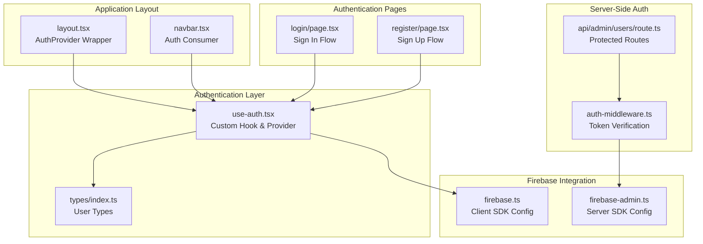
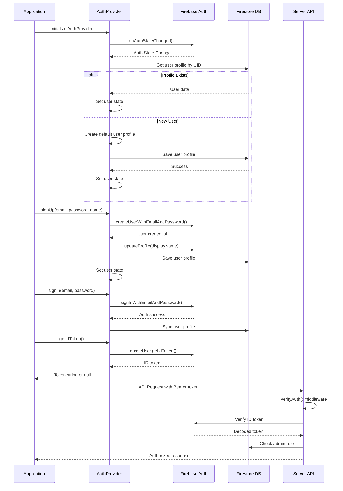
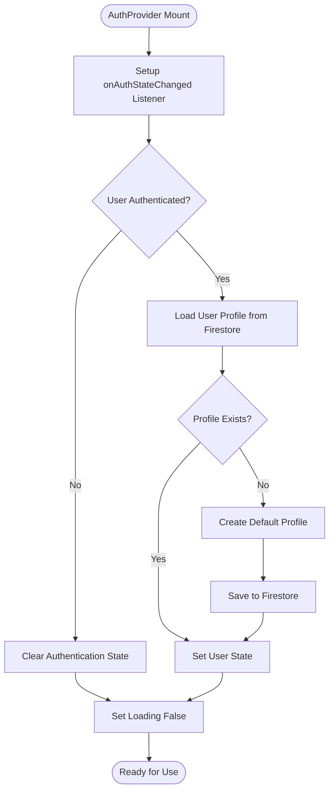
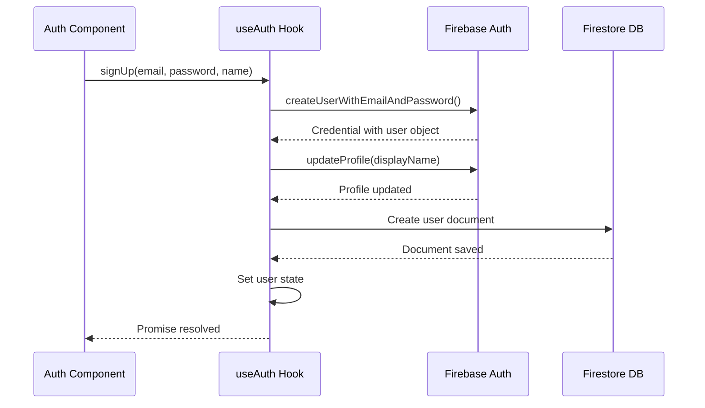
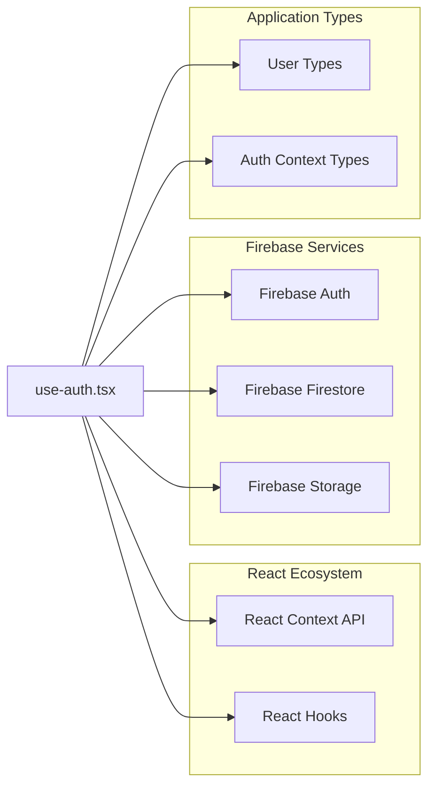
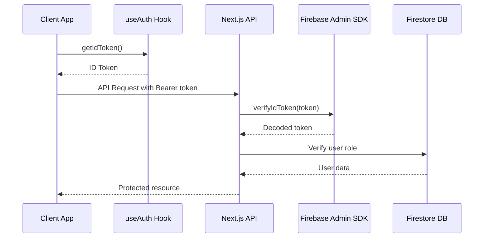

# Custom Auth Hook Implementation

<cite>
**Referenced Files in This Document**
- [use-auth.tsx](file://src/hooks/use-auth.tsx)
- [layout.tsx](file://src/app/layout.tsx)
- [firebase.ts](file://src/lib/firebase.ts)
- [firebase-admin.ts](file://src/lib/firebase-admin.ts)
- [index.ts](file://src/types/index.ts)
- [navbar.tsx](file://src/components/layout/navbar.tsx)
- [page.tsx](file://src/app/(auth)/login/page.tsx)
- [page.tsx](file://src/app/(auth)/register/page.tsx)
- [page.tsx](file://src/app/admin/users/page.tsx)
- [auth-middleware.ts](file://src/lib/auth-middleware.ts)
- [route.ts](file://src/app/api/admin/users/route.ts)
</cite>

## Table of Contents
1. [Introduction](#introduction)
2. [Project Structure](#project-structure)
3. [Core Components](#core-components)
4. [Architecture Overview](#architecture-overview)
5. [Detailed Component Analysis](#detailed-component-analysis)
6. [Dependency Analysis](#dependency-analysis)
7. [Performance Considerations](#performance-considerations)
8. [Troubleshooting Guide](#troubleshooting-guide)
9. [Conclusion](#conclusion)

## Introduction
This document provides comprehensive documentation for the custom use-auth React hook implementation that manages centralized authentication state using the React Context pattern. The implementation integrates Firebase Authentication for user sessions and Firestore for user profiles, providing a complete authentication lifecycle from initialization to user profile synchronization.

The authentication system follows modern React patterns with a Provider component that wraps the application, exposing authentication state and methods through a custom hook. It handles automatic user profile creation, real-time authentication state updates, and seamless integration with both client-side and server-side authentication flows.

## Project Structure
The authentication implementation is organized across several key files:

**Diagram sources**
- [use-auth.tsx:1-117](file://src/hooks/use-auth.tsx#L1-L117)
- [layout.tsx:1-50](file://src/app/layout.tsx#L1-L50)
- [firebase.ts:1-22](file://src/lib/firebase.ts#L1-L22)
- [firebase-admin.ts:1-50](file://src/lib/firebase-admin.ts#L1-L50)
- [index.ts:1-90](file://src/types/index.ts#L1-L90)

**Section sources**
- [use-auth.tsx:1-117](file://src/hooks/use-auth.tsx#L1-L117)
- [layout.tsx:1-50](file://src/app/layout.tsx#L1-L50)
- [firebase.ts:1-22](file://src/lib/firebase.ts#L1-L22)

## Core Components
The authentication system consists of several interconnected components that work together to provide comprehensive user management:

### AuthContext and Provider
The central component is the AuthContext provider that manages the complete authentication state and exposes it to the application through a custom hook. The provider maintains three primary state variables:
- `user`: The Firestore user profile data
- `firebaseUser`: The raw Firebase Authentication user object
- `loading`: Authentication initialization status

### Authentication Methods
The hook exposes five primary methods for authentication operations:
- `signUp`: Creates new user accounts with profile synchronization
- `signIn`: Authenticates existing users
- `signOut`: Logs users out and clears state
- `getIdToken`: Retrieves Firebase ID tokens for server communication
- `user`: Current user profile data

### Real-Time State Management
The system uses Firebase's `onAuthStateChanged` listener to automatically detect authentication changes and update the application state in real-time without requiring manual refreshes.

**Section sources**
- [use-auth.tsx:22-30](file://src/hooks/use-auth.tsx#L22-L30)
- [use-auth.tsx:34-108](file://src/hooks/use-auth.tsx#L34-L108)

## Architecture Overview
The authentication architecture follows a layered approach with clear separation between client-side and server-side concerns:

**Diagram sources**
- [use-auth.tsx:39-67](file://src/hooks/use-auth.tsx#L39-L67)
- [use-auth.tsx:69-82](file://src/hooks/use-auth.tsx#L69-L82)
- [use-auth.tsx:84-86](file://src/hooks/use-auth.tsx#L84-L86)
- [use-auth.tsx:88-92](file://src/hooks/use-auth.tsx#L88-L92)
- [use-auth.tsx:94-99](file://src/hooks/use-auth.tsx#L94-L99)
- [auth-middleware.ts:4-28](file://src/lib/auth-middleware.ts#L4-L28)

The architecture ensures that authentication state is consistently managed across the entire application while providing seamless integration with both client-side and server-side authentication flows.

**Section sources**
- [use-auth.tsx:101-108](file://src/hooks/use-auth.tsx#L101-L108)
- [layout.tsx:39-44](file://src/app/layout.tsx#L39-L44)

## Detailed Component Analysis

### AuthProvider Component
The AuthProvider serves as the central state manager for all authentication-related data and operations. It implements the React Context pattern with comprehensive error handling and loading state management.

#### State Management
The provider maintains three critical state variables:
- **user**: Contains the complete user profile synchronized from Firestore
- **firebaseUser**: Holds the raw Firebase Authentication user object
- **loading**: Tracks initialization progress during app startup

#### Authentication Lifecycle
The provider sets up a long-lived listener for authentication state changes using Firebase's `onAuthStateChanged` observer pattern. This ensures that any authentication changes (login, logout, token refresh) are immediately reflected throughout the application.

#### Automatic Profile Synchronization
When a user authenticates, the provider automatically synchronizes with Firestore to either load existing user data or create a new profile with default values including role assignment and timestamps.

**Diagram sources**
- [use-auth.tsx:39-67](file://src/hooks/use-auth.tsx#L39-L67)
- [use-auth.tsx:43-58](file://src/hooks/use-auth.tsx#L43-L58)

**Section sources**
- [use-auth.tsx:34-108](file://src/hooks/use-auth.tsx#L34-L108)

### Authentication Methods Implementation

#### signUp Method
The `signUp` method implements a complete user registration flow that handles both Firebase Authentication and Firestore profile creation:

**Diagram sources**
- [use-auth.tsx:69-82](file://src/hooks/use-auth.tsx#L69-L82)

#### signIn Method
The `signIn` method provides a streamlined authentication experience by delegating all authentication logic to Firebase while maintaining local state synchronization.

#### signOut Method
The `signOut` method ensures complete cleanup of authentication state by calling Firebase's sign-out function and clearing local state variables.

#### getIdToken Method
The `getIdToken` method provides secure token access for server-side authentication, returning null when no user is authenticated to prevent unauthorized access attempts.

**Section sources**
- [use-auth.tsx:69-99](file://src/hooks/use-auth.tsx#L69-L99)

### User Profile Management
The authentication system automatically manages user profiles in Firestore with a standardized structure:

| Field | Type | Description |
|-------|------|-------------|
| uid | string | Firebase user identifier |
| email | string | User's email address |
| displayName | string | User's display name |
| role | "user" \| "admin" | User's permission level |
| createdAt | string | ISO timestamp of account creation |

**Section sources**
- [use-auth.tsx:49-55](file://src/hooks/use-auth.tsx#L49-L55)
- [index.ts:3-9](file://src/types/index.ts#L3-L9)

## Dependency Analysis

### Client-Side Dependencies
The authentication hook depends on several key libraries and configurations:

**Diagram sources**
- [use-auth.tsx:10-20](file://src/hooks/use-auth.tsx#L10-L20)
- [index.ts:1-90](file://src/types/index.ts#L1-L90)

### Server-Side Integration
The client-side authentication seamlessly integrates with server-side verification through Firebase Admin SDK:

**Diagram sources**
- [use-auth.tsx:94-99](file://src/hooks/use-auth.tsx#L94-L99)
- [auth-middleware.ts:4-28](file://src/lib/auth-middleware.ts#L4-L28)

**Section sources**
- [firebase.ts:1-22](file://src/lib/firebase.ts#L1-L22)
- [firebase-admin.ts:1-50](file://src/lib/firebase-admin.ts#L1-L50)

## Performance Considerations
The authentication implementation incorporates several performance optimizations:

### Efficient State Updates
- **Selective State Updates**: Only updates relevant state when authentication changes occur
- **Debounced Operations**: Prevents redundant Firestore operations during rapid authentication state changes
- **Lazy Loading**: Firestore documents are only fetched when needed

### Memory Management
- **Automatic Cleanup**: The `onAuthStateChanged` listener is properly unsubscribed when the component unmounts
- **Minimal Re-renders**: State updates are batched to minimize unnecessary component re-renders

### Caching Strategy
- **Local State Caching**: User data is cached locally to reduce Firestore read operations
- **Token Caching**: ID tokens are cached and refreshed automatically by Firebase

## Troubleshooting Guide

### Common Authentication Issues

#### Authentication State Not Updating
**Symptoms**: User appears logged in but state doesn't reflect changes
**Solution**: Verify that the AuthProvider is properly wrapped around the application and that the `onAuthStateChanged` listener is functioning correctly.

#### Profile Creation Failures
**Symptoms**: New users are authenticated but profile data is missing
**Solution**: Check Firestore security rules and ensure the user document creation occurs after successful authentication.

#### Token Retrieval Errors
**Symptoms**: `getIdToken()` returns null unexpectedly
**Solution**: Verify that the user is authenticated before attempting to retrieve tokens and check Firebase configuration.

### Debugging Authentication Flows

#### Component-Level Debugging
Components consuming the auth hook should monitor the loading state and user object to identify authentication timing issues.

#### Server-Side Debugging
Server-side authentication middleware should log token verification failures and user role validation errors.

**Section sources**
- [use-auth.tsx:110-116](file://src/hooks/use-auth.tsx#L110-L116)
- [auth-middleware.ts:4-47](file://src/lib/auth-middleware.ts#L4-L47)

## Conclusion
The custom use-auth hook implementation provides a robust, scalable solution for managing authentication state in Next.js applications. By leveraging React Context patterns and Firebase's real-time capabilities, it delivers seamless user experiences with automatic state synchronization and comprehensive error handling.

The implementation successfully bridges client-side and server-side authentication through standardized token-based verification, enabling secure protected routes and administrative functionality. The modular design allows for easy extension and customization while maintaining clean separation of concerns between authentication logic and presentation components.

Key strengths of this implementation include:
- **Real-time State Management**: Automatic authentication state updates without manual refreshes
- **Seamless Integration**: Clean separation between client and server authentication flows
- **Type Safety**: Comprehensive TypeScript support with strongly typed user profiles
- **Error Resilience**: Robust error handling and loading state management
- **Extensibility**: Modular design allowing for easy addition of new authentication features

This authentication system serves as a solid foundation for applications requiring sophisticated user management, role-based access control, and secure server-client communication patterns.