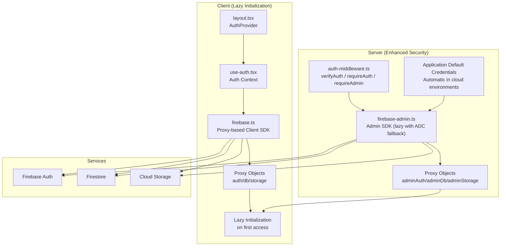
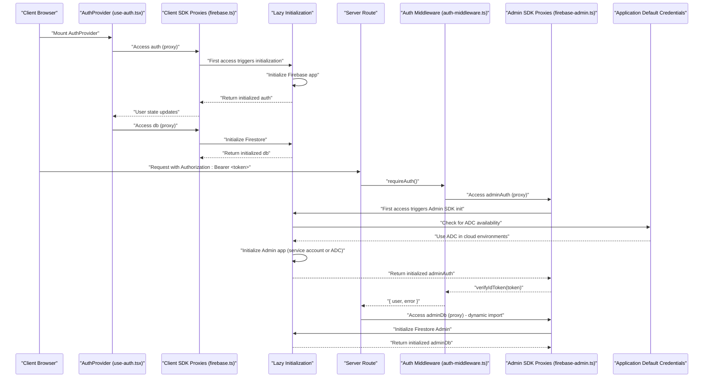
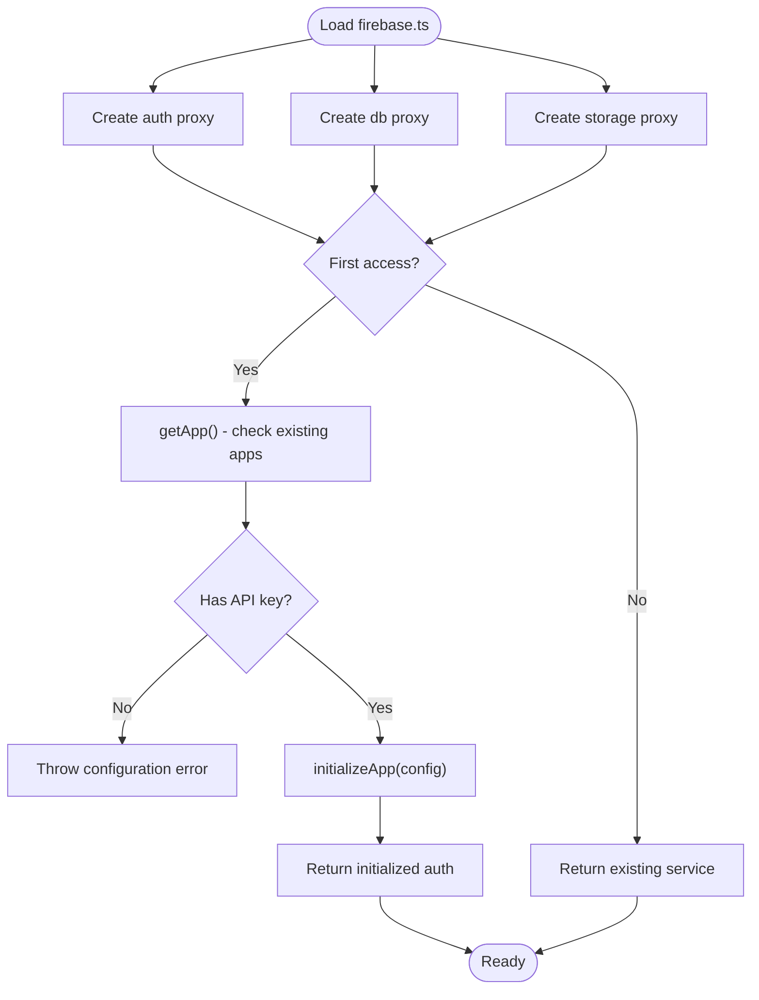
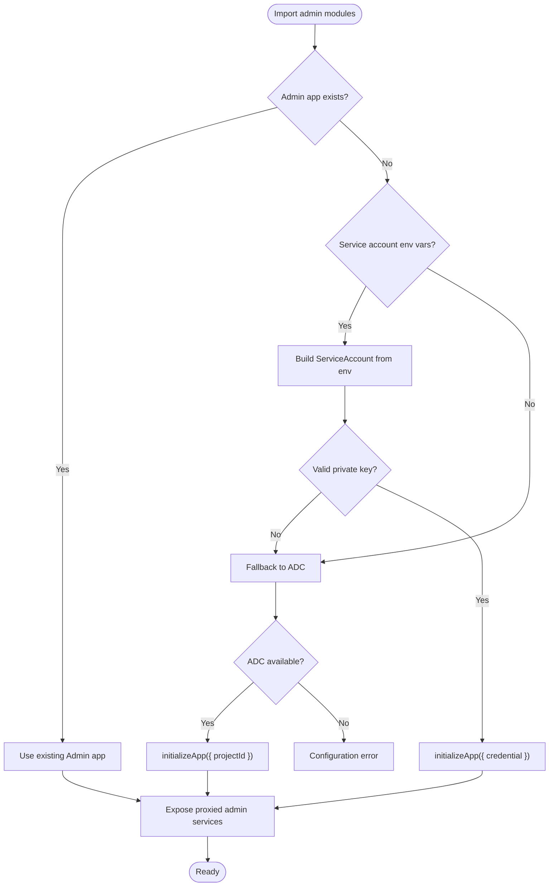
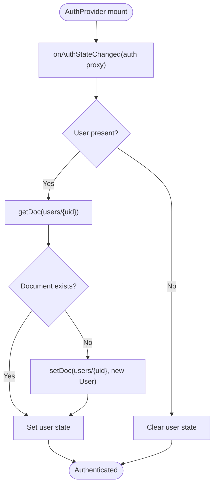
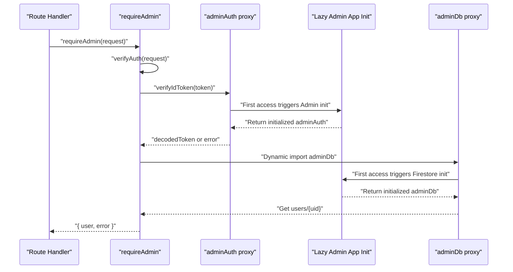
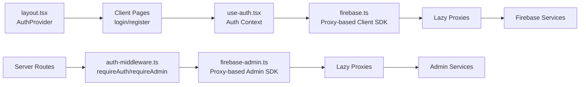
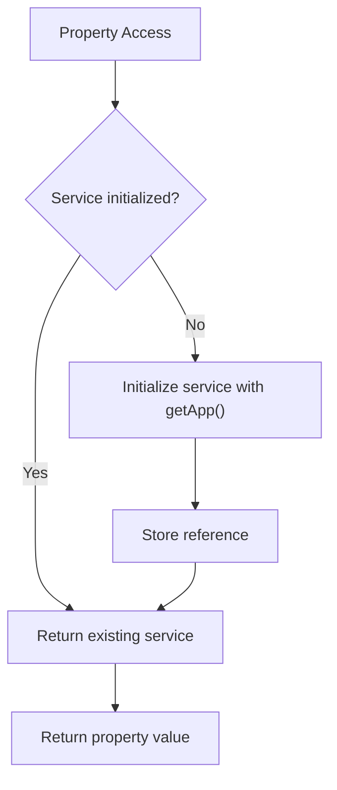
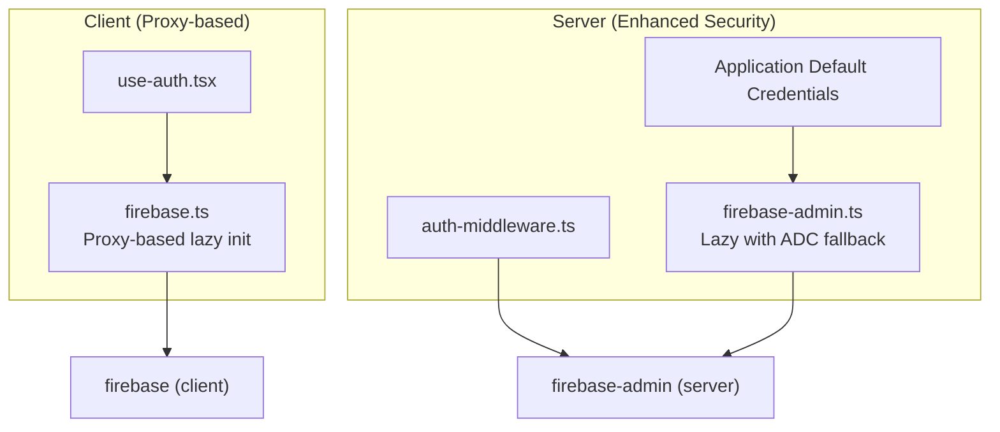
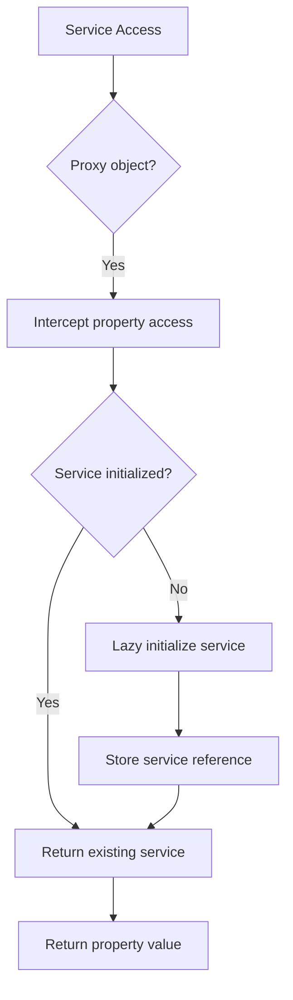

# Firebase Integration

<cite>
**Referenced Files in This Document**
- [firebase.ts](file://src/lib/firebase.ts)
- [firebase-admin.ts](file://src/lib/firebase-admin.ts)
- [use-auth.tsx](file://src/hooks/use-auth.tsx)
- [auth-middleware.ts](file://src/lib/auth-middleware.ts)
- [layout.tsx](file://src/app/layout.tsx)
- [login/page.tsx](file://src/app/(auth)/login/page.tsx)
- [register/page.tsx](file://src/app/(auth)/register/page.tsx)
- [package.json](file://package.json)
- [index.ts](file://src/types/index.ts)
</cite>

## Update Summary
**Changes Made**
- Updated Admin SDK Initialization section to reflect Application Default Credentials (ADC) fallback mechanism
- Enhanced Security Practices section to document elimination of sensitive credential storage in deployment configuration
- Updated Troubleshooting Guide to address ADC-related configuration issues
- Revised Best Practices to emphasize cloud-native credential management
- Updated Environment Variables Reference to clarify ADC usage scenarios

## Table of Contents
1. [Introduction](#introduction)
2. [Project Structure](#project-structure)
3. [Core Components](#core-components)
4. [Architecture Overview](#architecture-overview)
5. [Detailed Component Analysis](#detailed-component-analysis)
6. [Proxy-Based Initialization System](#proxy-based-initialization-system)
7. [Security Practices and Credential Management](#security-practices-and-credential-management)
8. [Dependency Analysis](#dependency-analysis)
9. [Performance Considerations](#performance-considerations)
10. [Troubleshooting Guide](#troubleshooting-guide)
11. [Conclusion](#conclusion)
12. [Appendices](#appendices)

## Introduction
This document explains how Datafrica integrates Firebase into its Next.js application using a sophisticated proxy-based lazy initialization system with enhanced security practices. The integration prevents build-time crashes while improving SSR compatibility by deferring Firebase SDK initialization until services are actually accessed. It covers client SDK initialization for Authentication, Firestore, and Cloud Storage using lazy proxies; server-side Admin SDK setup with Application Default Credentials (ADC) fallback and explicit service account management; the connection between Firebase services and Next.js server-side rendering; security rule implications for accessing authentication data; troubleshooting guidance for common configuration and authentication issues; and best practices for resource management and performance optimization.

**Updated** Enhanced with Application Default Credentials (ADC) fallback mechanism for improved cloud deployment security and reduced credential management overhead.

## Project Structure
The Firebase integration spans three primary areas with sophisticated lazy initialization and enhanced security:
- Client SDK initialization using proxy-based lazy accessors for Authentication, Firestore, and Storage
- Server-side Admin SDK initialization with lazy initialization, explicit service account credentials, and Application Default Credentials fallback for cloud environments
- Application-wide authentication state management via a React context provider
- Middleware for verifying ID tokens and enforcing authorization on protected API routes

**Diagram sources**
- [layout.tsx:38-45](file://src/app/layout.tsx#L38-L45)
- [use-auth.tsx:34-108](file://src/hooks/use-auth.tsx#L34-L108)
- [firebase.ts:30-56](file://src/lib/firebase.ts#L30-L56)
- [auth-middleware.ts:4-47](file://src/lib/auth-middleware.ts#L4-L47)
- [firebase-admin.ts:12-57](file://src/lib/firebase-admin.ts#L12-L57)

**Section sources**
- [layout.tsx:38-45](file://src/app/layout.tsx#L38-L45)
- [use-auth.tsx:34-108](file://src/hooks/use-auth.tsx#L34-L108)
- [firebase.ts:30-56](file://src/lib/firebase.ts#L30-L56)
- [auth-middleware.ts:4-47](file://src/lib/auth-middleware.ts#L4-L47)
- [firebase-admin.ts:12-57](file://src/lib/firebase-admin.ts#L12-L57)

## Core Components
- **Client SDK Proxy System**: Creates proxy objects that lazily initialize Firebase services only when accessed, preventing build-time crashes and improving SSR compatibility.
- **Admin SDK Enhanced Lazy Initialization**: Lazily initializes Admin SDK with explicit service account credentials and intelligent fallback to Application Default Credentials for cloud environments like Firebase App Hosting and Cloud Run.
- **Authentication Context**: Manages user state, syncs with Firebase Auth, and persists user profiles in Firestore using the proxy-based client SDK.
- **Auth Middleware**: Verifies Bearer tokens on API routes using the proxy-based Admin SDK and enforces admin-only access where required.

**Updated** Enhanced Admin SDK initialization now includes Application Default Credentials (ADC) fallback for improved cloud deployment security.

**Section sources**
- [firebase.ts:30-56](file://src/lib/firebase.ts#L30-L56)
- [firebase-admin.ts:12-57](file://src/lib/firebase-admin.ts#L12-L57)
- [use-auth.tsx:34-108](file://src/hooks/use-auth.tsx#L34-L108)
- [auth-middleware.ts:4-47](file://src/lib/auth-middleware.ts#L4-L47)

## Architecture Overview
The application uses sophisticated proxy-based lazy initialization for both client and server Firebase services with enhanced security practices. Client components access services through proxy objects that defer actual initialization until first use. Server routes use middleware to validate ID tokens and enforce roles, with Admin SDK services initialized lazily on demand and enhanced with Application Default Credentials fallback.

**Diagram sources**
- [use-auth.tsx:39-67](file://src/hooks/use-auth.tsx#L39-L67)
- [firebase.ts:30-56](file://src/lib/firebase.ts#L30-L56)
- [auth-middleware.ts:4-28](file://src/lib/auth-middleware.ts#L4-L28)
- [firebase-admin.ts:12-57](file://src/lib/firebase-admin.ts#L12-L57)

## Detailed Component Analysis

### Client SDK Proxy System
The client SDK uses sophisticated proxy-based lazy initialization to prevent build-time crashes and improve SSR compatibility. Instead of eagerly initializing Firebase services, proxy objects defer initialization until services are actually accessed.

**Diagram sources**
- [firebase.ts:21-28](file://src/lib/firebase.ts#L21-L28)
- [firebase.ts:30-50](file://src/lib/firebase.ts#L30-L50)

**Section sources**
- [firebase.ts:1-57](file://src/lib/firebase.ts#L1-L57)

### Enhanced Admin SDK Lazy Initialization with ADC Fallback
The Admin SDK uses lazy initialization with sophisticated fallback mechanisms. It first attempts to use explicit service account credentials, falling back to Application Default Credentials for cloud environments like Firebase App Hosting and Cloud Run. This eliminates the need to store sensitive credentials in deployment configuration.

**Updated** Added Application Default Credentials (ADC) fallback mechanism for improved cloud deployment security.

**Diagram sources**
- [firebase-admin.ts:12-36](file://src/lib/firebase-admin.ts#L12-L36)
- [firebase-admin.ts:38-57](file://src/lib/firebase-admin.ts#L38-L57)

**Section sources**
- [firebase-admin.ts:1-58](file://src/lib/firebase-admin.ts#L1-L58)

### Authentication Context and User Lifecycle
The authentication context manages user state using the proxy-based client SDK. It subscribes to onAuthStateChanged to track authentication state and persists user profiles in Firestore using lazy-initialized services.

**Diagram sources**
- [use-auth.tsx:39-67](file://src/hooks/use-auth.tsx#L39-L67)
- [use-auth.tsx:69-82](file://src/hooks/use-auth.tsx#L69-L82)
- [use-auth.tsx:88-92](file://src/hooks/use-auth.tsx#L88-L92)
- [use-auth.tsx:94-99](file://src/hooks/use-auth.tsx#L94-L99)

**Section sources**
- [use-auth.tsx:1-117](file://src/hooks/use-auth.tsx#L1-L117)
- [index.ts:3-9](file://src/types/index.ts#L3-L9)

### Auth Middleware and Protected Routes
The auth middleware verifies Bearer tokens using the proxy-based Admin SDK and enforces admin-only access by checking the user's role stored in Firestore. Note the dynamic import pattern for adminDb to ensure lazy initialization.

**Diagram sources**
- [auth-middleware.ts:19-47](file://src/lib/auth-middleware.ts#L19-L47)
- [firebase-admin.ts:38-57](file://src/lib/firebase-admin.ts#L38-L57)

**Section sources**
- [auth-middleware.ts:1-48](file://src/lib/auth-middleware.ts#L1-L48)

### Next.js Integration and SSR Considerations
The application uses the proxy-based initialization system to handle SSR considerations gracefully. The Auth Provider is mounted at the root layout level, and client SDK is safe for client components. Admin SDK runs only on the server via middleware and server routes with lazy initialization and enhanced security practices.

**Diagram sources**
- [layout.tsx:38-45](file://src/app/layout.tsx#L38-L45)
- [login/page.tsx:14-36](file://src/app/(auth)/login/page.tsx#L14-L36)
- [register/page.tsx:14-43](file://src/app/(auth)/register/page.tsx#L14-L43)
- [use-auth.tsx:34-108](file://src/hooks/use-auth.tsx#L34-L108)
- [firebase.ts:30-56](file://src/lib/firebase.ts#L30-L56)
- [auth-middleware.ts:4-47](file://src/lib/auth-middleware.ts#L4-L47)
- [firebase-admin.ts:12-57](file://src/lib/firebase-admin.ts#L12-L57)

**Section sources**
- [layout.tsx:38-45](file://src/app/layout.tsx#L38-L45)
- [login/page.tsx:14-36](file://src/app/(auth)/login/page.tsx#L14-L36)
- [register/page.tsx:14-43](file://src/app/(auth)/register/page.tsx#L14-L43)
- [use-auth.tsx:34-108](file://src/hooks/use-auth.tsx#L34-L108)

## Proxy-Based Initialization System

### Benefits of Proxy-Based Lazy Initialization
The proxy-based system provides several key benefits for Next.js applications:

- **Prevents Build-Time Crashes**: Services are only initialized when accessed, avoiding issues during static site generation
- **Improves SSR Compatibility**: Components can safely import Firebase modules without triggering server-side initialization
- **Reduces Memory Usage**: Services are created only when needed, minimizing memory footprint
- **Enhanced Error Handling**: Configuration errors are caught at runtime rather than build time

### Implementation Details
Each proxy object intercepts property access and performs lazy initialization:

**Diagram sources**
- [firebase.ts:30-56](file://src/lib/firebase.ts#L30-L56)
- [firebase-admin.ts:38-57](file://src/lib/firebase-admin.ts#L38-L57)

**Section sources**
- [firebase.ts:30-56](file://src/lib/firebase.ts#L30-L56)
- [firebase-admin.ts:38-57](file://src/lib/firebase-admin.ts#L38-L57)

## Security Practices and Credential Management

### Application Default Credentials (ADC) Fallback
The enhanced Admin SDK configuration now includes Application Default Credentials (ADC) fallback for improved security and simplified deployment:

- **Automatic Cloud Detection**: The system automatically detects cloud environments and uses ADC when available
- **Reduced Credential Storage**: Eliminates the need to store sensitive service account credentials in deployment configuration
- **Improved Security**: Reduces attack surface by minimizing credential exposure
- **Cloud-Native Approach**: Leverages platform-native security mechanisms provided by Firebase App Hosting and Cloud Run

### Enhanced Security Benefits
- **Credential Isolation**: Service account keys are not stored in application code or environment variables
- **Platform Security**: Relies on Google Cloud's native credential management systems
- **Reduced Maintenance**: No need to rotate or manage service account keys manually
- **Compliance Friendly**: Meets security requirements for environments with strict credential handling policies

### Deployment Configuration Simplification
The ADC fallback mechanism allows for simplified deployment configurations:

- **Optional Service Account Keys**: Service account credentials are only required for local development or non-cloud environments
- **Environment-Aware Behavior**: Automatically adapts to deployment environment without code changes
- **Backward Compatibility**: Maintains support for explicit service account credentials when needed

**Section sources**
- [firebase-admin.ts:20-34](file://src/lib/firebase-admin.ts#L20-L34)
- [firebase-admin.ts:31-34](file://src/lib/firebase-admin.ts#L31-L34)

## Dependency Analysis
The proxy-based system maintains clean separation between client and server concerns while preserving all functionality and enhanced security:

- **Client SDK**: Depends on firebase and firebase/auth, firebase/firestore, firebase/storage with proxy-based lazy initialization
- **Admin SDK**: Depends on firebase-admin and firebase-admin/auth, firebase-admin/firestore, firebase-admin/storage with enhanced fallback credentials
- **Application**: Uses bcryptjs for hashing and jsonwebtoken/jose for token-related utilities, but authentication is handled by Firebase Auth

**Diagram sources**
- [package.json:24-25](file://package.json#L24-L25)
- [package.json:25](file://package.json#L25)
- [firebase.ts:1-57](file://src/lib/firebase.ts#L1-L57)
- [firebase-admin.ts:1-58](file://src/lib/firebase-admin.ts#L1-L58)
- [use-auth.tsx:10-19](file://src/hooks/use-auth.tsx#L10-L19)
- [auth-middleware.ts:2](file://src/lib/auth-middleware.ts#L2)

**Section sources**
- [package.json:24-25](file://package.json#L24-L25)
- [package.json:25](file://package.json#L25)
- [firebase.ts:1-57](file://src/lib/firebase.ts#L1-L57)
- [firebase-admin.ts:1-58](file://src/lib/firebase-admin.ts#L1-L58)
- [use-auth.tsx:10-19](file://src/hooks/use-auth.tsx#L10-L19)
- [auth-middleware.ts:2](file://src/lib/auth-middleware.ts#L2)

## Performance Considerations
The proxy-based lazy initialization system provides several performance advantages:

- **Reduced Startup Time**: Services are created only when accessed, improving initial load performance
- **Memory Efficiency**: Unused services don't consume memory, reducing overall memory footprint
- **Conditional Initialization**: Services are only initialized in environments where they're actually needed
- **Build Optimization**: Prevents build-time initialization issues, enabling better build optimization
- **ADC Performance**: Application Default Credentials provide optimal performance in cloud environments without additional credential overhead

Best practices for maintaining performance:
- Keep environment variables scoped appropriately (NEXT_PUBLIC_ for client, server-only variables for Admin SDK)
- Prefer batch operations and caching where feasible on the server side
- Minimize real-time listeners on the client; unsubscribe when components unmount to reduce memory leaks
- Monitor proxy access patterns to identify unused services that could be optimized further
- Leverage ADC performance benefits in cloud deployments for optimal resource utilization

## Troubleshooting Guide
Common issues and resolutions for the proxy-based initialization system with enhanced security:

### Proxy Initialization Issues
- **Symptom**: "Cannot access 'auth' before initialization" errors
- **Cause**: Attempting to access Firebase services before the AuthProvider mounts
- **Resolution**: Ensure AuthProvider wraps all components that use Firebase services, and wait for loading state to complete
- **Section sources**
  - [use-auth.tsx:39-67](file://src/hooks/use-auth.tsx#L39-L67)

### Configuration Errors
- **Missing or incorrect NEXT_PUBLIC Firebase environment variables on the client**:
  - Symptom: "Firebase API key is not configured" error during first access
  - Resolution: Verify NEXT_PUBLIC_FIREBASE_* variables are present and correct in the runtime environment
  - Section sources
    - [firebase.ts:23-25](file://src/lib/firebase.ts#L23-L25)

- **Missing or invalid Admin SDK service account credentials**:
  - Symptom: Server-side Admin SDK calls fail or throw errors during first access
  - Resolution: Confirm FIREBASE_ADMIN_* variables are set and the private key uses proper newline characters, or rely on Application Default Credentials in cloud environments
  - Section sources
    - [firebase-admin.ts:20-34](file://src/lib/firebase-admin.ts#L20-L34)

### Application Default Credentials Issues
- **ADC Not Available in Local Development**:
  - Symptom: Admin SDK initialization fails in local development environments
  - Resolution: Provide service account credentials locally or configure ADC using gcloud auth application-default login
  - Section sources
    - [firebase-admin.ts:31-34](file://src/lib/firebase-admin.ts#L31-L34)

- **ADC Permission Errors in Cloud Environments**:
  - Symptom: Admin SDK operations fail with permission errors despite ADC configuration
  - Resolution: Verify Cloud Run/App Hosting service account has appropriate IAM permissions for Firebase project access
  - Section sources
    - [firebase-admin.ts:31-34](file://src/lib/firebase-admin.ts#L31-L34)

### Authentication Failures
- **Authentication failures during login/signup**:
  - Symptom: Login/register forms show errors or fail silently
  - Resolution: Ensure onAuthStateChanged is subscribed, and confirm Firestore user document creation/update logic executes through the proxy-based client SDK
  - Section sources
    - [use-auth.tsx:39-67](file://src/hooks/use-auth.tsx#L39-L67)
    - [use-auth.tsx:69-82](file://src/hooks/use-auth.tsx#L69-L82)

### Server-Side Access Issues
- **Unauthorized or forbidden responses on protected routes**:
  - Symptom: Requests to admin routes return 401 or 403
  - Resolution: Verify Authorization header contains a valid Bearer token and the user role is set to admin in Firestore, ensuring the Admin SDK proxy initializes correctly
  - Section sources
    - [auth-middleware.ts:4-28](file://src/lib/auth-middleware.ts#L4-L28)
    - [auth-middleware.ts:30-47](file://src/lib/auth-middleware.ts#L30-L47)

### Hydration and SSR Issues
- **Hydration mismatch warnings**:
  - Symptom: Console warnings about hydration after mounting AuthProvider
  - Resolution: Ensure AuthProvider wraps the root layout and that client components relying on auth state are rendered after hydration completes
  - Section sources
    - [layout.tsx:38-45](file://src/app/layout.tsx#L38-L45)

## Conclusion
Datafrica's Firebase integration uses a sophisticated proxy-based lazy initialization system with enhanced security practices that cleanly separates client and server concerns while preventing build-time crashes and improving SSR compatibility. The client uses proxy-based Firebase Client SDK for user sessions and local data access, while the server uses proxy-based Admin SDK for secure, privileged operations with Application Default Credentials (ADC) fallback for improved cloud deployment security. The Auth Provider centralizes authentication state, and the auth middleware enforces token verification and role-based access control. The proxy-based approach ensures services are only initialized when needed, reducing memory usage and improving performance across different deployment environments, while the ADC fallback mechanism eliminates sensitive credential storage in deployment configuration.

**Updated** Enhanced with Application Default Credentials (ADC) fallback for improved cloud deployment security and reduced credential management overhead.

## Appendices

### Environment Variables Reference
- **Client-side (NEXT_PUBLIC_):**
  - NEXT_PUBLIC_FIREBASE_API_KEY
  - NEXT_PUBLIC_FIREBASE_AUTH_DOMAIN
  - NEXT_PUBLIC_FIREBASE_PROJECT_ID
  - NEXT_PUBLIC_FIREBASE_STORAGE_BUCKET
  - NEXT_PUBLIC_FIREBASE_MESSAGING_SENDER_ID
  - NEXT_PUBLIC_FIREBASE_APP_ID
- **Server-side (Admin SDK)**:
  - FIREBASE_ADMIN_PROJECT_ID
  - FIREBASE_ADMIN_CLIENT_EMAIL
  - FIREBASE_ADMIN_PRIVATE_KEY
  - **Note**: These are only required for local development or non-cloud environments; ADC fallback enables deployment without explicit credentials in cloud environments

**Updated** Added note about ADC fallback reducing credential requirements in cloud environments.

**Section sources**
- [firebase.ts:7-14](file://src/lib/firebase.ts#L7-L14)
- [firebase-admin.ts:20-24](file://src/lib/firebase-admin.ts#L20-L24)

### Proxy-Based Initialization Flow
The proxy-based system follows this initialization pattern:

**Diagram sources**
- [firebase.ts:30-56](file://src/lib/firebase.ts#L30-L56)
- [firebase-admin.ts:38-57](file://src/lib/firebase-admin.ts#L38-L57)

### Application Default Credentials (ADC) Configuration
For local development with ADC fallback:
1. Install Google Cloud SDK
2. Run `gcloud auth application-default login`
3. Configure project: `gcloud config set project YOUR_PROJECT_ID`
4. Verify ADC: `gcloud auth application-default list`

For cloud environments (Firebase App Hosting/Cloud Run):
1. Service account automatically configured with appropriate permissions
2. No manual credential management required
3. Automatic ADC detection and usage

**Section sources**
- [firebase-admin.ts:31-34](file://src/lib/firebase-admin.ts#L31-L34)