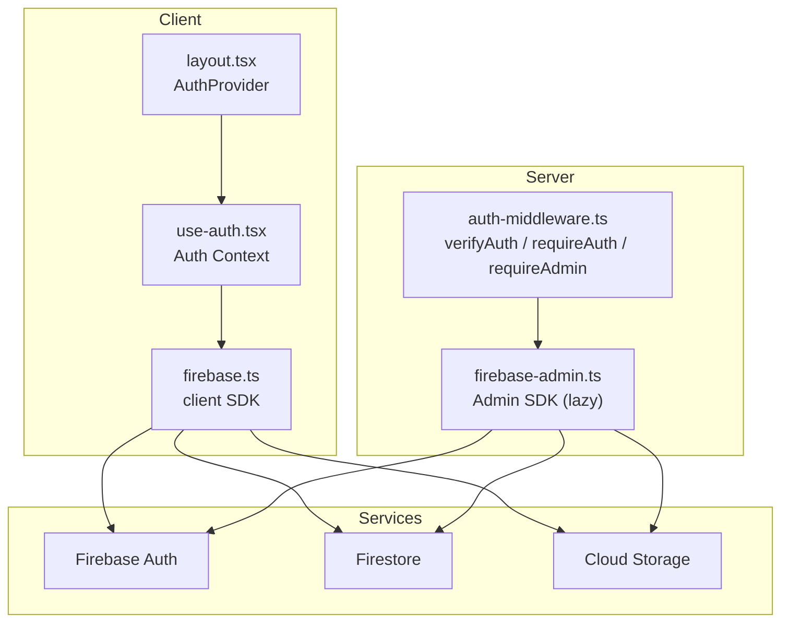
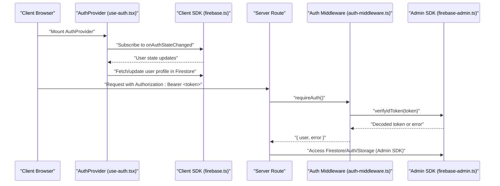
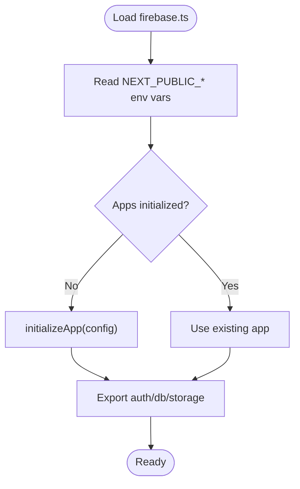
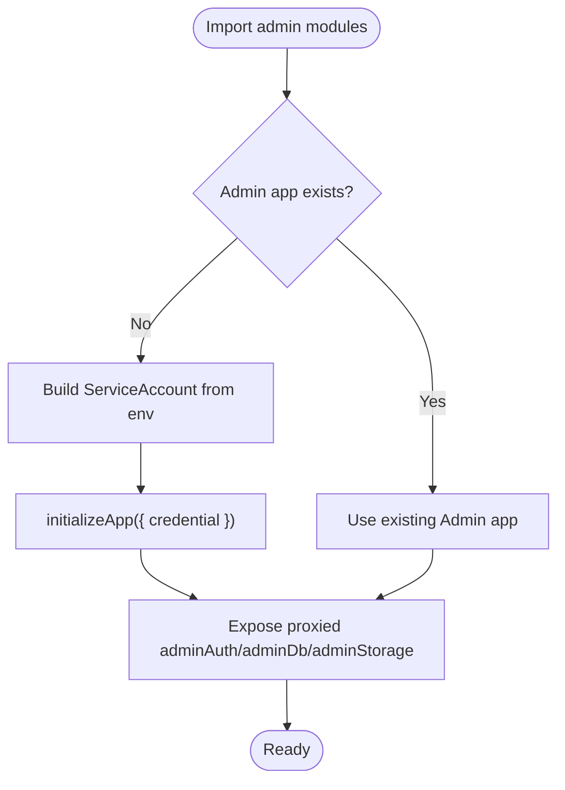
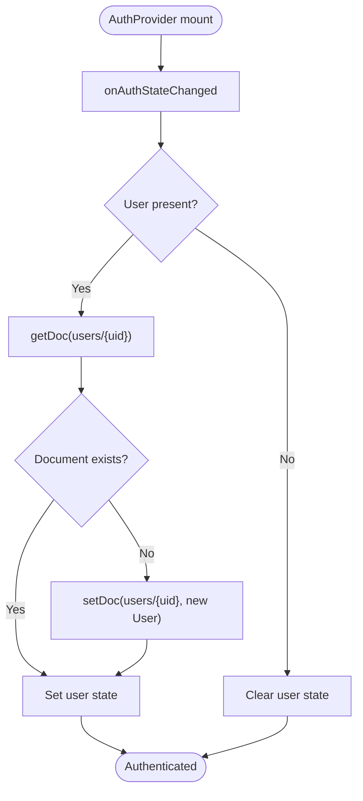
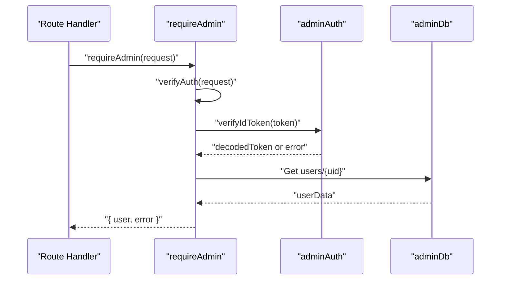
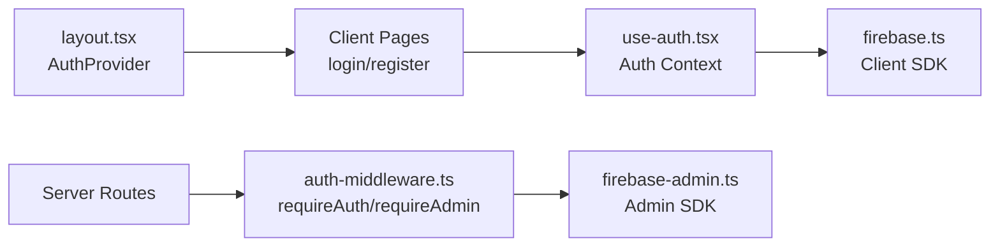
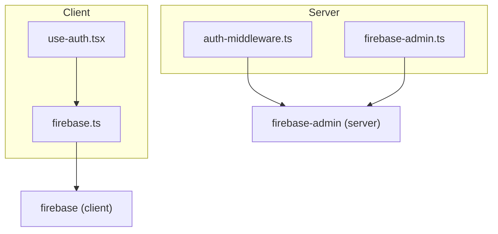

# Firebase Integration

<cite>
**Referenced Files in This Document**
- [firebase.ts](file://src/lib/firebase.ts)
- [firebase-admin.ts](file://src/lib/firebase-admin.ts)
- [use-auth.tsx](file://src/hooks/use-auth.tsx)
- [auth-middleware.ts](file://src/lib/auth-middleware.ts)
- [layout.tsx](file://src/app/layout.tsx)
- [login/page.tsx](file://src/app/(auth)/login/page.tsx)
- [register/page.tsx](file://src/app/(auth)/register/page.tsx)
- [package.json](file://package.json)
- [index.ts](file://src/types/index.ts)
</cite>

## Table of Contents
1. [Introduction](#introduction)
2. [Project Structure](#project-structure)
3. [Core Components](#core-components)
4. [Architecture Overview](#architecture-overview)
5. [Detailed Component Analysis](#detailed-component-analysis)
6. [Dependency Analysis](#dependency-analysis)
7. [Performance Considerations](#performance-considerations)
8. [Troubleshooting Guide](#troubleshooting-guide)
9. [Conclusion](#conclusion)
10. [Appendices](#appendices)

## Introduction
This document explains how Datafrica integrates Firebase into its Next.js application. It covers client SDK initialization for Authentication, Firestore, and Cloud Storage; server-side Admin SDK setup using service account credentials; the connection between Firebase services and Next.js server-side rendering; security rule implications for accessing authentication data; troubleshooting guidance for common configuration and authentication issues; and best practices for resource management and performance optimization.

## Project Structure
The Firebase integration spans three primary areas:
- Client SDK initialization and exports for Authentication, Firestore, and Storage
- Server-side Admin SDK initialization and lazy accessors for Admin Auth, Firestore, and Storage
- Application-wide authentication state management via a React context provider
- Middleware for verifying ID tokens and enforcing authorization on protected API routes

**Diagram sources**
- [layout.tsx:38-45](file://src/app/layout.tsx#L38-L45)
- [use-auth.tsx:34-108](file://src/hooks/use-auth.tsx#L34-L108)
- [firebase.ts:16-21](file://src/lib/firebase.ts#L16-L21)
- [auth-middleware.ts:4-47](file://src/lib/auth-middleware.ts#L4-L47)
- [firebase-admin.ts:12-49](file://src/lib/firebase-admin.ts#L12-L49)

**Section sources**
- [layout.tsx:38-45](file://src/app/layout.tsx#L38-L45)
- [use-auth.tsx:34-108](file://src/hooks/use-auth.tsx#L34-L108)
- [firebase.ts:16-21](file://src/lib/firebase.ts#L16-L21)
- [auth-middleware.ts:4-47](file://src/lib/auth-middleware.ts#L4-L47)
- [firebase-admin.ts:12-49](file://src/lib/firebase-admin.ts#L12-L49)

## Core Components
- Client SDK initializer: Creates a single Firebase app instance and exposes auth, firestore, and storage clients for client-side components and hooks.
- Admin SDK initializer: Lazily initializes Admin SDK with service account credentials and exposes proxied accessors for Admin Auth, Firestore, and Storage.
- Authentication context: Manages user state, syncs with Firebase Auth, and persists user profiles in Firestore.
- Auth middleware: Verifies Bearer tokens on API routes and enforces admin-only access where required.

**Section sources**
- [firebase.ts:16-21](file://src/lib/firebase.ts#L16-L21)
- [firebase-admin.ts:12-49](file://src/lib/firebase-admin.ts#L12-L49)
- [use-auth.tsx:34-108](file://src/hooks/use-auth.tsx#L34-L108)
- [auth-middleware.ts:4-47](file://src/lib/auth-middleware.ts#L4-L47)

## Architecture Overview
The application initializes Firebase on the client and uses Admin SDK on the server. Client components rely on the Auth Provider to keep the user session synchronized. Server routes use middleware to validate ID tokens and enforce roles.

**Diagram sources**
- [use-auth.tsx:39-67](file://src/hooks/use-auth.tsx#L39-L67)
- [firebase.ts:16-21](file://src/lib/firebase.ts#L16-L21)
- [auth-middleware.ts:4-28](file://src/lib/auth-middleware.ts#L4-L28)
- [firebase-admin.ts:12-28](file://src/lib/firebase-admin.ts#L12-L28)

## Detailed Component Analysis

### Client SDK Initialization
- Reads environment variables prefixed with NEXT_PUBLIC_ for client-side exposure.
- Ensures a single Firebase app instance is initialized and reused.
- Exports auth, firestore, and storage clients for use across the client app.

**Diagram sources**
- [firebase.ts:7-16](file://src/lib/firebase.ts#L7-L16)
- [firebase.ts:16-21](file://src/lib/firebase.ts#L16-L21)

**Section sources**
- [firebase.ts:7-16](file://src/lib/firebase.ts#L7-L16)
- [firebase.ts:16-21](file://src/lib/firebase.ts#L16-L21)

### Admin SDK Initialization and Lazy Accessors
- Lazily initializes Admin SDK with service account credentials loaded from environment variables.
- Uses Proxy-based accessors to defer initialization of Admin Auth, Firestore, and Storage until first use.
- Reuses an existing Admin app if already initialized.

**Diagram sources**
- [firebase-admin.ts:12-28](file://src/lib/firebase-admin.ts#L12-L28)
- [firebase-admin.ts:30-49](file://src/lib/firebase-admin.ts#L30-L49)

**Section sources**
- [firebase-admin.ts:12-28](file://src/lib/firebase-admin.ts#L12-L28)
- [firebase-admin.ts:30-49](file://src/lib/firebase-admin.ts#L30-L49)

### Authentication Context and User Lifecycle
- Subscribes to onAuthStateChanged to track authentication state.
- On login/signup, persists or updates the user profile in Firestore under the users collection keyed by uid.
- Provides helpers to sign out and fetch an ID token for subsequent server requests.

**Diagram sources**
- [use-auth.tsx:39-67](file://src/hooks/use-auth.tsx#L39-L67)
- [use-auth.tsx:69-82](file://src/hooks/use-auth.tsx#L69-L82)
- [use-auth.tsx:88-92](file://src/hooks/use-auth.tsx#L88-L92)
- [use-auth.tsx:94-99](file://src/hooks/use-auth.tsx#L94-L99)

**Section sources**
- [use-auth.tsx:34-108](file://src/hooks/use-auth.tsx#L34-L108)
- [index.ts:3-9](file://src/types/index.ts#L3-L9)

### Auth Middleware and Protected Routes
- Extracts Bearer token from Authorization header.
- Verifies the token using Admin Auth and decodes it.
- Enforces admin-only access by checking the user’s role stored in Firestore.

**Diagram sources**
- [auth-middleware.ts:19-47](file://src/lib/auth-middleware.ts#L19-L47)
- [firebase-admin.ts:30-49](file://src/lib/firebase-admin.ts#L30-L49)

**Section sources**
- [auth-middleware.ts:4-28](file://src/lib/auth-middleware.ts#L4-L28)
- [auth-middleware.ts:30-47](file://src/lib/auth-middleware.ts#L30-L47)

### Next.js Integration and SSR Considerations
- The Auth Provider is mounted at the root layout level, ensuring authentication state is available across the app.
- Client SDK is safe for client components; Admin SDK runs only on the server via middleware and server routes.
- The application uses client components for login/register pages and relies on the Auth Provider for session synchronization.

**Diagram sources**
- [layout.tsx:38-45](file://src/app/layout.tsx#L38-L45)
- [login/page.tsx:14-36](file://src/app/(auth)/login/page.tsx#L14-L36)
- [register/page.tsx:14-43](file://src/app/(auth)/register/page.tsx#L14-L43)
- [use-auth.tsx:34-108](file://src/hooks/use-auth.tsx#L34-L108)
- [firebase.ts:16-21](file://src/lib/firebase.ts#L16-L21)
- [auth-middleware.ts:4-47](file://src/lib/auth-middleware.ts#L4-L47)
- [firebase-admin.ts:12-49](file://src/lib/firebase-admin.ts#L12-L49)

**Section sources**
- [layout.tsx:38-45](file://src/app/layout.tsx#L38-L45)
- [login/page.tsx:14-36](file://src/app/(auth)/login/page.tsx#L14-L36)
- [register/page.tsx:14-43](file://src/app/(auth)/register/page.tsx#L14-L43)
- [use-auth.tsx:34-108](file://src/hooks/use-auth.tsx#L34-L108)

## Dependency Analysis
- Client SDK depends on firebase and firebase/auth, firebase/firestore, firebase/storage.
- Admin SDK depends on firebase-admin and firebase-admin/auth, firebase-admin/firestore, firebase-admin/storage.
- The application uses bcryptjs for hashing and jsonwebtoken/jose for token-related utilities, but authentication is handled by Firebase Auth.

**Diagram sources**
- [package.json:24-25](file://package.json#L24-L25)
- [package.json:25](file://package.json#L25)
- [firebase.ts:2-5](file://src/lib/firebase.ts#L2-L5)
- [firebase-admin.ts:2-5](file://src/lib/firebase-admin.ts#L2-L5)
- [use-auth.tsx:10-19](file://src/hooks/use-auth.tsx#L10-L19)
- [auth-middleware.ts:2](file://src/lib/auth-middleware.ts#L2)

**Section sources**
- [package.json:24-25](file://package.json#L24-L25)
- [package.json:25](file://package.json#L25)
- [firebase.ts:2-5](file://src/lib/firebase.ts#L2-L5)
- [firebase-admin.ts:2-5](file://src/lib/firebase-admin.ts#L2-L5)
- [use-auth.tsx:10-19](file://src/hooks/use-auth.tsx#L10-L19)
- [auth-middleware.ts:2](file://src/lib/auth-middleware.ts#L2)

## Performance Considerations
- Client SDK initialization occurs once and is reused, minimizing overhead.
- Admin SDK uses lazy initialization and proxies to avoid unnecessary server-side allocations until services are accessed.
- Keep environment variables scoped appropriately (NEXT_PUBLIC_ for client, server-only variables for Admin SDK).
- Prefer batch operations and caching where feasible on the server side.
- Minimize real-time listeners on the client; unsubscribe when components unmount to reduce memory leaks.

[No sources needed since this section provides general guidance]

## Troubleshooting Guide
Common issues and resolutions:
- Missing or incorrect NEXT_PUBLIC Firebase environment variables on the client:
  - Symptom: Client SDK fails to initialize or authentication appears disabled.
  - Resolution: Verify NEXT_PUBLIC_FIREBASE_* variables are present and correct in the runtime environment.
  - Section sources
    - [firebase.ts:7-14](file://src/lib/firebase.ts#L7-L14)
- Missing or invalid Admin SDK service account credentials:
  - Symptom: Server-side Admin SDK calls fail or throw errors.
  - Resolution: Confirm FIREBASE_ADMIN_* variables are set and the private key uses proper newline characters.
  - Section sources
    - [firebase-admin.ts:20-24](file://src/lib/firebase-admin.ts#L20-L24)
- Authentication failures during login/signup:
  - Symptom: Login/register forms show errors or fail silently.
  - Resolution: Ensure onAuthStateChanged is subscribed, and confirm Firestore user document creation/update logic executes.
  - Section sources
    - [use-auth.tsx:39-67](file://src/hooks/use-auth.tsx#L39-L67)
    - [use-auth.tsx:69-82](file://src/hooks/use-auth.tsx#L69-L82)
- Unauthorized or forbidden responses on protected routes:
  - Symptom: Requests to admin routes return 401 or 403.
  - Resolution: Verify Authorization header contains a valid Bearer token and the user role is set to admin in Firestore.
  - Section sources
    - [auth-middleware.ts:4-28](file://src/lib/auth-middleware.ts#L4-L28)
    - [auth-middleware.ts:30-47](file://src/lib/auth-middleware.ts#L30-L47)
- Hydration mismatch warnings:
  - Symptom: Console warnings about hydration after mounting AuthProvider.
  - Resolution: Ensure AuthProvider wraps the root layout and that client components relying on auth state are rendered after hydration completes.
  - Section sources
    - [layout.tsx:38-45](file://src/app/layout.tsx#L38-L45)

## Conclusion
Datafrica’s Firebase integration cleanly separates client and server concerns: the client uses the Firebase Client SDK for user sessions and local data access, while the server uses the Admin SDK for secure, privileged operations. The Auth Provider centralizes authentication state, and the auth middleware enforces token verification and role-based access control. Following the best practices and troubleshooting steps outlined here will help maintain a robust, scalable authentication system.

## Appendices

### Environment Variables Reference
- Client-side (NEXT_PUBLIC_):
  - NEXT_PUBLIC_FIREBASE_API_KEY
  - NEXT_PUBLIC_FIREBASE_AUTH_DOMAIN
  - NEXT_PUBLIC_FIREBASE_PROJECT_ID
  - NEXT_PUBLIC_FIREBASE_STORAGE_BUCKET
  - NEXT_PUBLIC_FIREBASE_MESSAGING_SENDER_ID
  - NEXT_PUBLIC_FIREBASE_APP_ID
- Server-side (Admin SDK):
  - FIREBASE_ADMIN_PROJECT_ID
  - FIREBASE_ADMIN_CLIENT_EMAIL
  - FIREBASE_ADMIN_PRIVATE_KEY

**Section sources**
- [firebase.ts:7-14](file://src/lib/firebase.ts#L7-L14)
- [firebase-admin.ts:20-24](file://src/lib/firebase-admin.ts#L20-L24)