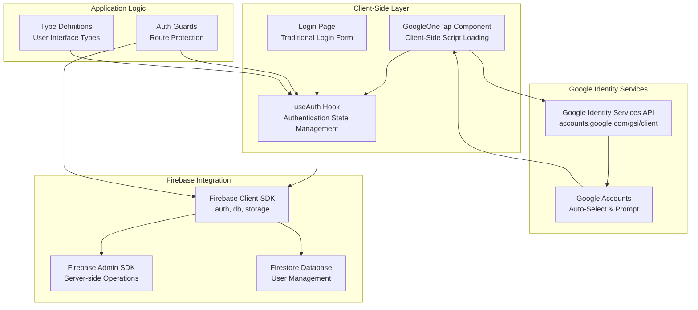
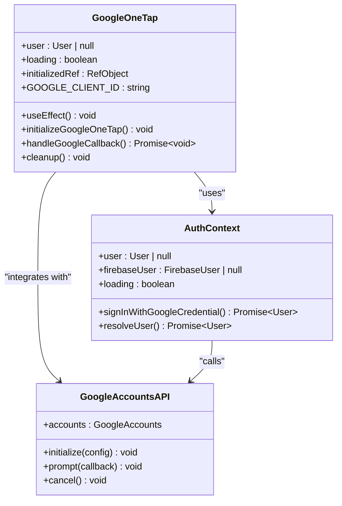
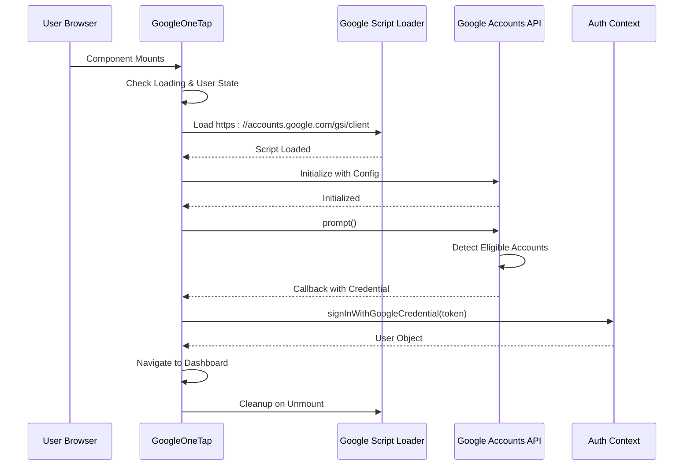
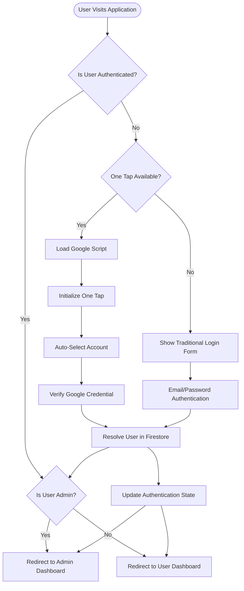
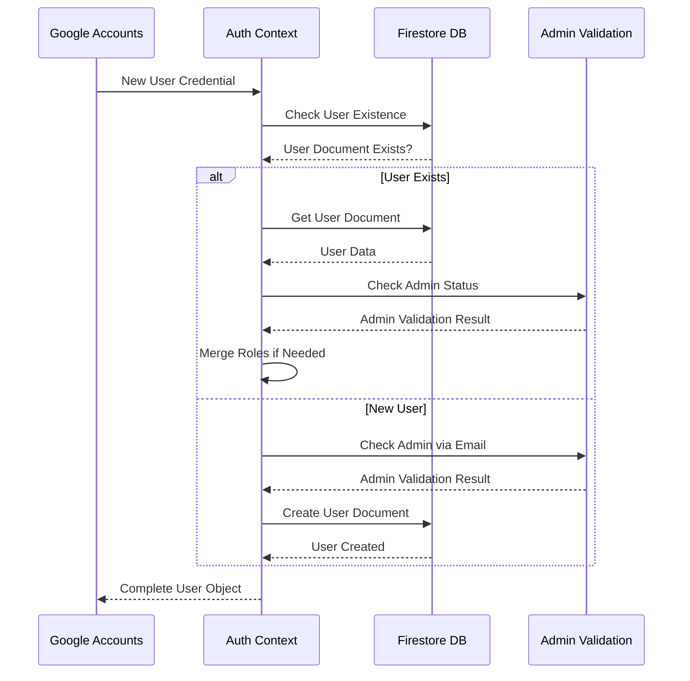
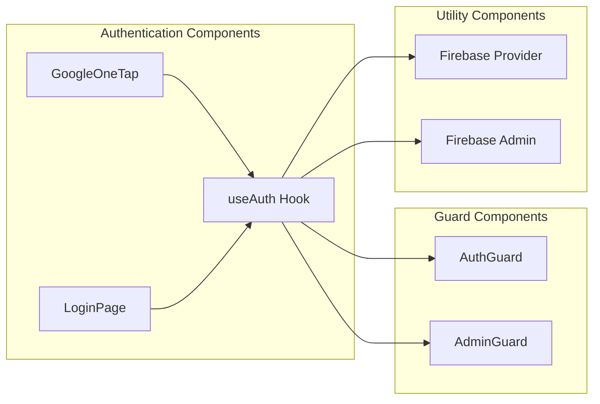

# Google One Tap Authentication

<cite>
**Referenced Files in This Document**
- [google-one-tap.tsx](file://src/components/google-one-tap.tsx)
- [page.tsx](file://src/app/(auth)/login/page.tsx)
- [use-auth.tsx](file://src/hooks/use-auth.tsx)
- [guards.tsx](file://src/components/auth/guards.tsx)
- [firebase.ts](file://src/lib/firebase.ts)
- [firebase-admin.ts](file://src/lib/firebase-admin.ts)
- [index.ts](file://src/types/index.ts)
</cite>

## Table of Contents
1. [Introduction](#introduction)
2. [System Architecture](#system-architecture)
3. [Google One Tap Implementation](#google-one-tap-implementation)
4. [Authentication Flow Analysis](#authentication-flow-analysis)
5. [Security Considerations](#security-considerations)
6. [Integration Points](#integration-points)
7. [Error Handling](#error-handling)
8. [Performance Optimizations](#performance-optimizations)
9. [Troubleshooting Guide](#troubleshooting-guide)
10. [Conclusion](#conclusion)

## Introduction

Google One Tap Authentication is a seamless single-sign-on (SSO) solution integrated into the Datafrica Next.js application. This implementation leverages Google's Identity Services to provide users with a frictionless authentication experience, automatically detecting eligible Google accounts and offering one-click sign-in without requiring users to navigate to separate login pages.

The system integrates tightly with Firebase Authentication and implements comprehensive user management, role-based access control, and responsive design patterns. The implementation follows modern React best practices with proper TypeScript typing and error handling mechanisms.

## System Architecture

The Google One Tap authentication system is built on a multi-layered architecture that combines client-side React components with server-side Firebase services:

**Diagram sources**
- [google-one-tap.tsx:30-85](file://src/components/google-one-tap.tsx#L30-L85)
- [use-auth.tsx:46-194](file://src/hooks/use-auth.tsx#L46-L194)
- [firebase.ts:1-57](file://src/lib/firebase.ts#L1-L57)

The architecture demonstrates a clean separation of concerns with dedicated components for each layer, ensuring maintainability and scalability.

**Section sources**
- [google-one-tap.tsx:1-85](file://src/components/google-one-tap.tsx#L1-L85)
- [use-auth.tsx:1-203](file://src/hooks/use-auth.tsx#L1-L203)
- [firebase.ts:1-57](file://src/lib/firebase.ts#L1-L57)

## Google One Tap Implementation

### Core Component Architecture

The Google One Tap implementation centers around a sophisticated React component that dynamically loads Google's Identity Services API and manages the authentication lifecycle:

**Diagram sources**
- [google-one-tap.tsx:30-85](file://src/components/google-one-tap.tsx#L30-L85)
- [use-auth.tsx:32-42](file://src/hooks/use-auth.tsx#L32-L42)

### Initialization Process

The component implements a sophisticated initialization sequence that ensures optimal performance and reliability:

**Diagram sources**
- [google-one-tap.tsx:35-81](file://src/components/google-one-tap.tsx#L35-L81)
- [use-auth.tsx:163-169](file://src/hooks/use-auth.tsx#L163-L169)

### Configuration Parameters

The Google One Tap integration utilizes several critical configuration parameters optimized for user experience and security:

| Parameter | Value | Purpose |
|-----------|-------|---------|
| `auto_select` | `true` | Automatically selects eligible accounts |
| `cancel_on_tap_outside` | `true` | Closes prompt when clicking outside |
| `itp_support` | `true` | Enables Intelligent Tracking Prevention |
| `use_fedcm_for_prompt` | `true` | Uses Federal Cookie Management |

**Section sources**
- [google-one-tap.tsx:7-28](file://src/components/google-one-tap.tsx#L7-L28)
- [google-one-tap.tsx:46-60](file://src/components/google-one-tap.tsx#L46-L60)

## Authentication Flow Analysis

### Complete Authentication Lifecycle

The authentication system implements a comprehensive flow that handles multiple authentication scenarios:

**Diagram sources**
- [google-one-tap.tsx:35-81](file://src/components/google-one-tap.tsx#L35-L81)
- [use-auth.tsx:111-130](file://src/hooks/use-auth.tsx#L111-L130)

### User Resolution Process

The system implements a robust user resolution mechanism that handles both new and returning users:

**Diagram sources**
- [use-auth.tsx:63-109](file://src/hooks/use-auth.tsx#L63-L109)

**Section sources**
- [use-auth.tsx:63-109](file://src/hooks/use-auth.tsx#L63-L109)
- [guards.tsx:42-67](file://src/components/auth/guards.tsx#L42-L67)

## Security Considerations

### Multi-Layered Security Approach

The authentication system implements comprehensive security measures at multiple levels:

#### Client-Side Security
- **Environment Variable Protection**: Google Client ID is loaded from environment variables
- **Script Loading Control**: Dynamic script injection with cleanup mechanisms
- **State Management**: Proper cleanup of Google API instances on component unmount

#### Server-Side Security
- **Firebase Admin Integration**: Server-side operations use Admin SDK
- **Database Security**: Firestore security rules enforced
- **Token Validation**: Secure JWT token handling

#### Authentication Security
- **Credential Verification**: Google ID tokens validated server-side
- **Role-Based Access**: Comprehensive RBAC implementation
- **Session Management**: Automatic session state synchronization

**Section sources**
- [google-one-tap.tsx:7-9](file://src/components/google-one-tap.tsx#L7-L9)
- [firebase-admin.ts:12-42](file://src/lib/firebase-admin.ts#L12-L42)
- [guards.tsx:12-36](file://src/components/auth/guards.tsx#L12-L36)

## Integration Points

### Component Integration

The Google One Tap system integrates seamlessly with the broader application architecture:

**Diagram sources**
- [google-one-tap.tsx:30-33](file://src/components/google-one-tap.tsx#L30-L33)
- [guards.tsx:42-67](file://src/components/auth/guards.tsx#L42-L67)

### API Integration Points

The system maintains clean separation between client and server operations:

| Integration Point | Purpose | Security Level |
|-------------------|---------|----------------|
| `/api/auth/me` | User session endpoint | Protected |
| `/api/auth/register` | User registration | Public |
| `/api/auth/login` | User login | Public |
| Admin APIs | Administrative functions | Admin-Protected |

**Section sources**
- [guards.tsx:12-36](file://src/components/auth/guards.tsx#L12-L36)
- [firebase.ts:30-50](file://src/lib/firebase.ts#L30-L50)

## Error Handling

### Comprehensive Error Management

The authentication system implements robust error handling across all layers:

#### Client-Side Error Handling
- **Network Errors**: Graceful degradation when Google services are unavailable
- **Authentication Errors**: Specific error messages for different failure types
- **Cleanup Mechanisms**: Proper resource cleanup on errors

#### Server-Side Error Handling
- **Firebase Errors**: Structured error responses with codes
- **Database Errors**: Fallback mechanisms when Firestore is unavailable
- **Validation Errors**: Input validation with user-friendly messages

#### User Experience Considerations
- **Loading States**: Skeleton screens during authentication
- **Error Toasts**: Non-blocking error notifications
- **Graceful Degradation**: Traditional login form as fallback

**Section sources**
- [google-one-tap.tsx:52-54](file://src/components/google-one-tap.tsx#L52-L54)
- [page.tsx:34-58](file://src/app/(auth)/login/page.tsx#L34-L58)

## Performance Optimizations

### Client-Side Optimizations

The implementation includes several performance optimizations:

#### Lazy Loading
- **Dynamic Script Loading**: Google Identity Services loaded only when needed
- **Conditional Initialization**: Component checks prevent unnecessary initialization
- **Memory Management**: Proper cleanup of event listeners and API instances

#### Caching Strategies
- **User State Caching**: Authentication state maintained in React context
- **Role Caching**: User roles cached to minimize database queries
- **Session Persistence**: Automatic session restoration

#### Network Optimization
- **Async Loading**: Non-blocking script loading
- **Defer Execution**: Post-render initialization
- **Resource Cleanup**: Efficient cleanup on component unmount

### Server-Side Optimizations

#### Database Optimization
- **Efficient Queries**: Optimized Firestore queries with proper indexing
- **Batch Operations**: Minimized database round trips
- **Connection Pooling**: Reused Firebase connections

#### Security Optimization
- **Token Caching**: Reduced token verification overhead
- **Role Validation**: Efficient role-based access control
- **Rate Limiting**: Protection against abuse

**Section sources**
- [google-one-tap.tsx:35-36](file://src/components/google-one-tap.tsx#L35-L36)
- [use-auth.tsx:111-130](file://src/hooks/use-auth.tsx#L111-L130)

## Troubleshooting Guide

### Common Issues and Solutions

#### Google One Tap Not Working
1. **Script Loading Failures**: Verify Google Identity Services availability
2. **Client ID Configuration**: Ensure proper environment variable setup
3. **Browser Compatibility**: Check for supported browser versions

#### Authentication State Issues
1. **Stale User State**: Clear browser cache and cookies
2. **Session Conflicts**: Check for multiple browser tabs
3. **Firebase Connection**: Verify Firebase project configuration

#### Role Assignment Problems
1. **Admin Email List**: Check environment variable configuration
2. **Database Connectivity**: Verify Firestore permissions
3. **User Document Structure**: Ensure proper user data format

### Debugging Tools

#### Client-Side Debugging
- **Console Logging**: Enable detailed logging for authentication events
- **Network Inspection**: Monitor Google API requests
- **State Inspection**: Use React DevTools for state debugging

#### Server-Side Debugging
- **Firebase Logs**: Monitor authentication events
- **Database Queries**: Track Firestore operations
- **Error Tracking**: Implement comprehensive error reporting

**Section sources**
- [google-one-tap.tsx:52-54](file://src/components/google-one-tap.tsx#L52-L54)
- [use-auth.tsx:88-108](file://src/hooks/use-auth.tsx#L88-L108)

## Conclusion

The Google One Tap Authentication implementation represents a sophisticated integration of modern web technologies with enterprise-grade security and user experience considerations. The system successfully balances ease of use with comprehensive security measures, providing users with a seamless authentication experience while maintaining strict access controls and data protection.

Key strengths of the implementation include:

- **Seamless User Experience**: Zero-friction authentication through automatic account detection
- **Robust Security**: Multi-layered security approach with proper credential validation
- **Scalable Architecture**: Clean separation of concerns enabling easy maintenance and extension
- **Comprehensive Error Handling**: Graceful degradation and user-friendly error messaging
- **Performance Optimization**: Efficient resource management and caching strategies

The implementation serves as a model for modern authentication systems, demonstrating best practices in React development, Firebase integration, and user experience design. Future enhancements could include support for additional authentication providers, enhanced analytics tracking, and advanced security features such as two-factor authentication.