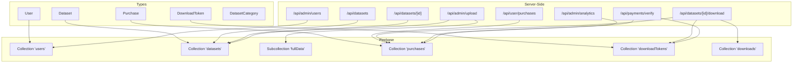
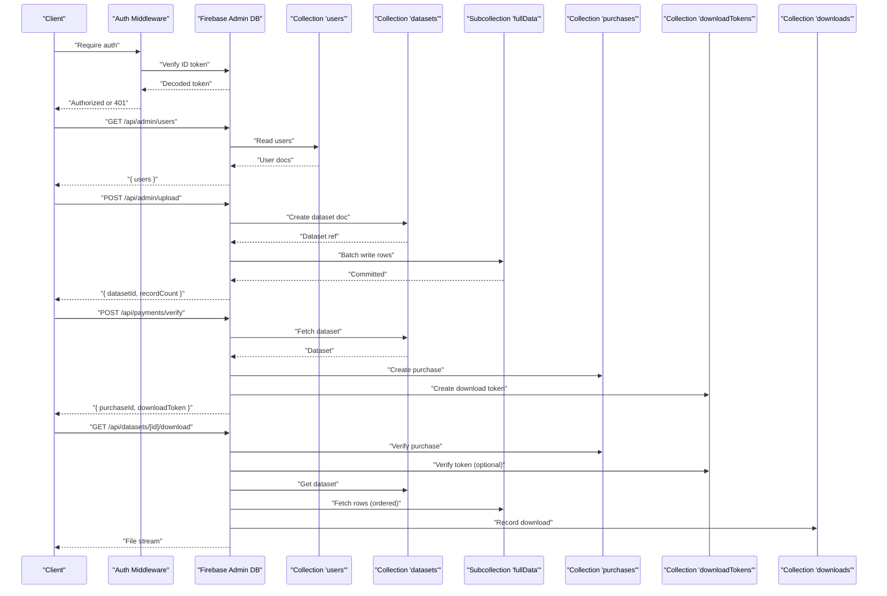
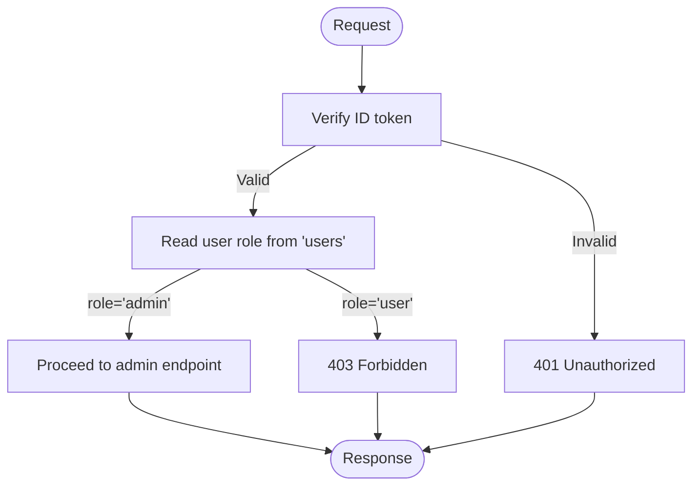
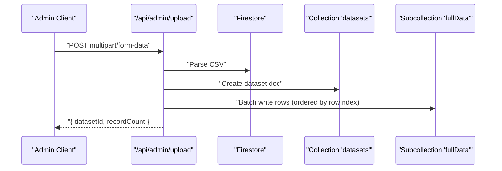
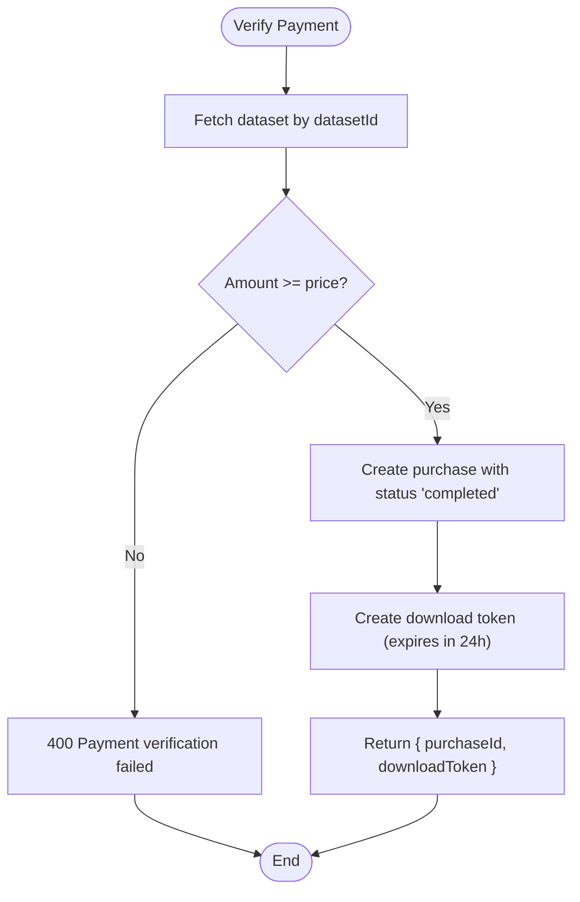
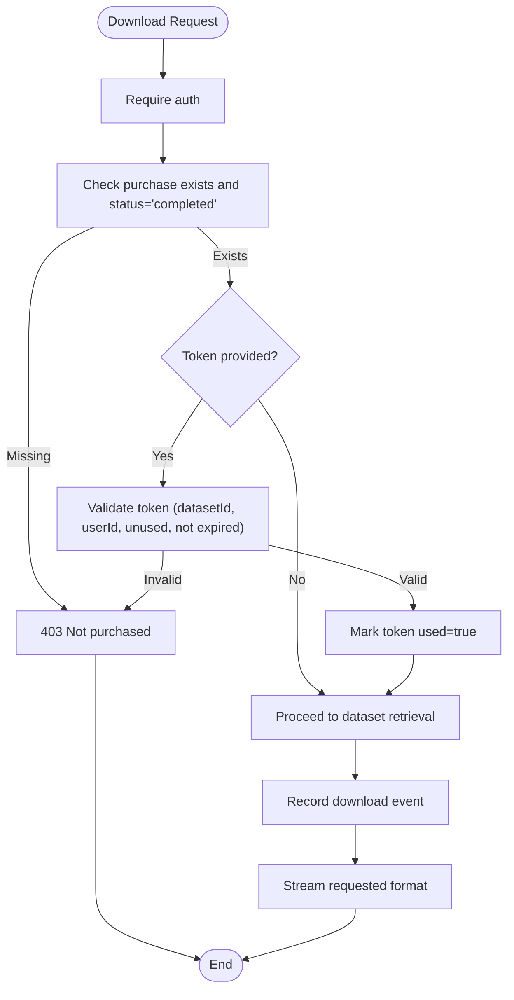
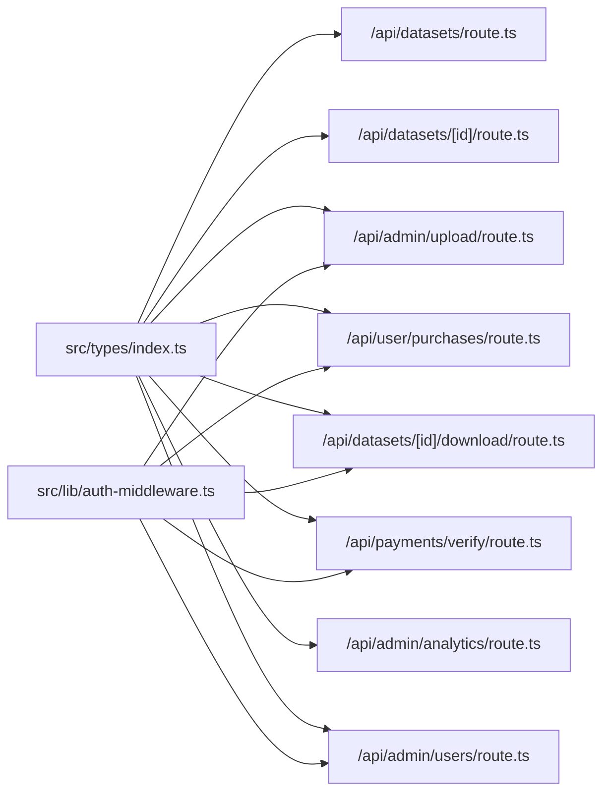

# Data Models and Types

<cite>
**Referenced Files in This Document**
- [src/types/index.ts](file://src/types/index.ts)
- [src/lib/firebase-admin.ts](file://src/lib/firebase-admin.ts)
- [src/lib/firebase.ts](file://src/lib/firebase.ts)
- [src/lib/auth-middleware.ts](file://src/lib/auth-middleware.ts)
- [src/app/api/datasets/route.ts](file://src/app/api/datasets/route.ts)
- [src/app/api/datasets/[id]/route.ts](file://src/app/api/datasets/[id]/route.ts)
- [src/app/api/admin/upload/route.ts](file://src/app/api/admin/upload/route.ts)
- [src/app/api/user/purchases/route.ts](file://src/app/api/user/purchases/route.ts)
- [src/app/api/datasets/[id]/download/route.ts](file://src/app/api/datasets/[id]/download/route.ts)
- [src/app/api/payments/verify/route.ts](file://src/app/api/payments/verify/route.ts)
- [src/app/api/admin/analytics/route.ts](file://src/app/api/admin/analytics/route.ts)
- [src/app/api/admin/users/route.ts](file://src/app/api/admin/users/route.ts)
</cite>

## Table of Contents
1. [Introduction](#introduction)
2. [Project Structure](#project-structure)
3. [Core Components](#core-components)
4. [Architecture Overview](#architecture-overview)
5. [Detailed Component Analysis](#detailed-component-analysis)
6. [Dependency Analysis](#dependency-analysis)
7. [Performance Considerations](#performance-considerations)
8. [Troubleshooting Guide](#troubleshooting-guide)
9. [Conclusion](#conclusion)
10. [Appendices](#appendices)

## Introduction
This document provides comprehensive data model documentation for Datafrica’s TypeScript interfaces and Firestore schema. It covers the User, Dataset, Purchase, and DownloadToken models, along with related enums and constants. It also documents validation rules, data relationships, business logic constraints, Firestore collection structure, indexing strategies, and schema evolution considerations.

## Project Structure
The data models are defined in a centralized TypeScript module and consumed by server-side API routes and middleware. Collections are accessed via the Firebase Admin SDK initialized lazily.

**Diagram sources**
- [src/types/index.ts:3-50](file://src/types/index.ts#L3-L50)
- [src/app/api/datasets/route.ts:17-35](file://src/app/api/datasets/route.ts#L17-L35)
- [src/app/api/datasets/[id]/route.ts:12-19](file://src/app/api/datasets/[id]/route.ts#L12-L19)
- [src/app/api/admin/upload/route.ts:46-77](file://src/app/api/admin/upload/route.ts#L46-L77)
- [src/app/api/user/purchases/route.ts:11-20](file://src/app/api/user/purchases/route.ts#L11-L20)
- [src/app/api/datasets/[id]/download/route.ts:23-105](file://src/app/api/datasets/[id]/download/route.ts#L23-L105)
- [src/app/api/payments/verify/route.ts:99-120](file://src/app/api/payments/verify/route.ts#L99-L120)
- [src/app/api/admin/analytics/route.ts:12-40](file://src/app/api/admin/analytics/route.ts#L12-L40)
- [src/app/api/admin/users/route.ts:11-19](file://src/app/api/admin/users/route.ts#L11-L19)

**Section sources**
- [src/types/index.ts:1-90](file://src/types/index.ts#L1-L90)
- [src/lib/firebase-admin.ts:1-50](file://src/lib/firebase-admin.ts#L1-L50)
- [src/lib/firebase.ts:1-22](file://src/lib/firebase.ts#L1-L22)

## Core Components
This section defines the primary data models and their fields, including validation rules and constraints inferred from usage.

- User
  - Purpose: Represents authenticated users with role-based access.
  - Fields:
    - uid: string (required)
    - email: string (required)
    - displayName?: string
    - role: "user" | "admin" (required)
    - createdAt: string (ISO date)
  - Validation and constraints:
    - role must be one of the allowed literal values.
    - uid and email must be present; uid is the primary identity.
    - createdAt is managed server-side.

- Dataset
  - Purpose: Describes downloadable datasets with metadata, pricing, and categorization.
  - Fields:
    - id: string (required)
    - title: string (required)
    - description: string (required)
    - category: DatasetCategory (required)
    - country: string (required)
    - price: number (required; non-negative)
    - currency: string (required; e.g., "XOF")
    - recordCount: number (required; non-negative)
    - columns: string[] (required; non-empty)
    - previewData: Record<string, string | number>[] (required; non-empty preview rows)
    - fileUrl: string (present for future storage; currently empty during upload)
    - featured: boolean (optional; default false)
    - rating: number (optional; default 0)
    - ratingCount: number (optional; default 0)
    - updatedAt: string (required; ISO date)
    - createdAt: string (required; ISO date)
  - Validation and constraints:
    - price and recordCount must be non-negative.
    - columns and previewData must be non-empty arrays.
    - category must match the DatasetCategory union.
    - country must be one of the predefined African countries.

- Purchase
  - Purpose: Records transaction details and payment status for a dataset.
  - Fields:
    - id: string (required)
    - userId: string (required)
    - datasetId: string (required)
    - datasetTitle: string (required)
    - amount: number (required; non-negative)
    - currency: string (required)
    - paymentMethod: "kkiapay" | "stripe" (required)
    - transactionId: string (required; unique per provider)
    - status: "pending" | "completed" | "failed" (required)
    - createdAt: string (required; ISO date)
  - Validation and constraints:
    - amount must be non-negative.
    - status must be one of the allowed literal values.
    - paymentMethod must be one of the allowed literal values.
    - userId and datasetId form a logical pairing for access control.

- DownloadToken
  - Purpose: Grants temporary access to download a dataset after purchase verification.
  - Fields:
    - id: string (required)
    - userId: string (required)
    - datasetId: string (required)
    - token: string (required; UUID)
    - expiresAt: string (required; ISO date)
    - used: boolean (required; toggled after first use)
  - Validation and constraints:
    - Token must be unique per dataset-user pair.
    - Expiration is enforced at read-time.
    - used flag prevents reuse.

- Enums and Constants
  - DatasetCategory: Union of allowed categories.
  - AFRICAN_COUNTRIES: Array of supported countries.
  - DATASET_CATEGORIES: Predefined list of categories.

**Section sources**
- [src/types/index.ts:3-50](file://src/types/index.ts#L3-L50)
- [src/types/index.ts:52-89](file://src/types/index.ts#L52-L89)

## Architecture Overview
The system uses Firestore collections to store entities and enforces access control via Firebase Authentication and server-side middleware. Admin-only operations use a dedicated middleware that checks the user’s role in the users collection.

**Diagram sources**
- [src/lib/auth-middleware.ts:19-47](file://src/lib/auth-middleware.ts#L19-L47)
- [src/app/api/admin/users/route.ts:11-19](file://src/app/api/admin/users/route.ts#L11-L19)
- [src/app/api/admin/upload/route.ts:46-77](file://src/app/api/admin/upload/route.ts#L46-L77)
- [src/app/api/payments/verify/route.ts:99-120](file://src/app/api/payments/verify/route.ts#L99-L120)
- [src/app/api/datasets/[id]/download/route.ts:23-105](file://src/app/api/datasets/[id]/download/route.ts#L23-L105)

## Detailed Component Analysis

### User Model
- Role-based access control:
  - Admin-only endpoints check the user’s role in the users collection.
  - Unauthorized requests receive 401; forbidden requests receive 403.
- Authentication:
  - ID tokens are verified server-side using the Admin Auth SDK.
- Data integrity:
  - createdAt is managed server-side; clients do not set it.

**Diagram sources**
- [src/lib/auth-middleware.ts:19-47](file://src/lib/auth-middleware.ts#L19-L47)
- [src/app/api/admin/users/route.ts:37-43](file://src/app/api/admin/users/route.ts#L37-L43)

**Section sources**
- [src/lib/auth-middleware.ts:19-47](file://src/lib/auth-middleware.ts#L19-L47)
- [src/app/api/admin/users/route.ts:37-43](file://src/app/api/admin/users/route.ts#L37-L43)

### Dataset Model
- Creation and ingestion:
  - Admin uploads CSV; backend parses and stores preview and batches full rows into a subcollection.
  - Columns and previewData are required; recordCount reflects total rows.
- Retrieval:
  - Listing supports category, country, featured, and pagination.
  - Filtering by price range and free-text search is applied client-side after fetching base results.
- Access control:
  - Public listing is open; individual dataset retrieval is protected by authentication.

**Diagram sources**
- [src/app/api/admin/upload/route.ts:30-77](file://src/app/api/admin/upload/route.ts#L30-L77)
- [src/app/api/datasets/route.ts:17-53](file://src/app/api/datasets/route.ts#L17-L53)

**Section sources**
- [src/app/api/admin/upload/route.ts:30-77](file://src/app/api/admin/upload/route.ts#L30-L77)
- [src/app/api/datasets/route.ts:17-53](file://src/app/api/datasets/route.ts#L17-L53)
- [src/app/api/datasets/[id]/route.ts:12-19](file://src/app/api/datasets/[id]/route.ts#L12-L19)

### Purchase Model
- Payment verification:
  - Validates transaction against external providers (KKiaPay) and ensures amount meets or exceeds dataset price.
  - In development mode, verification may succeed for testing.
- Purchase creation:
  - On successful verification, a purchase document is created with status "completed".
- Idempotency:
  - Prevents duplicate purchases for the same user-dataset combination.

**Diagram sources**
- [src/app/api/payments/verify/route.ts:47-120](file://src/app/api/payments/verify/route.ts#L47-L120)

**Section sources**
- [src/app/api/payments/verify/route.ts:47-120](file://src/app/api/payments/verify/route.ts#L47-L120)

### DownloadToken Model
- Purpose:
  - Temporary access token generated upon successful payment verification.
- Validation:
  - Optional token parameter is validated against datasetId, userId, unused status, and expiration.
- Usage:
  - After successful validation, the token is marked as used to prevent reuse.

**Diagram sources**
- [src/app/api/datasets/[id]/download/route.ts:18-105](file://src/app/api/datasets/[id]/download/route.ts#L18-L105)

**Section sources**
- [src/app/api/datasets/[id]/download/route.ts:18-105](file://src/app/api/datasets/[id]/download/route.ts#L18-L105)

### Enums and Constants
- DatasetCategory: Union of allowed categories.
- AFRICAN_COUNTRIES: Array of supported countries.
- DATASET_CATEGORIES: Predefined list of categories.

**Section sources**
- [src/types/index.ts:52-89](file://src/types/index.ts#L52-L89)

## Dependency Analysis
The following diagram shows how the types are used across API routes and middleware.

**Diagram sources**
- [src/types/index.ts:3-50](file://src/types/index.ts#L3-L50)
- [src/app/api/datasets/route.ts:1-62](file://src/app/api/datasets/route.ts#L1-L62)
- [src/app/api/datasets/[id]/route.ts:1-29](file://src/app/api/datasets/[id]/route.ts#L1-L29)
- [src/app/api/admin/upload/route.ts:1-93](file://src/app/api/admin/upload/route.ts#L1-L93)
- [src/app/api/user/purchases/route.ts:1-31](file://src/app/api/user/purchases/route.ts#L1-L31)
- [src/app/api/datasets/[id]/download/route.ts:1-148](file://src/app/api/datasets/[id]/download/route.ts#L1-L148)
- [src/app/api/payments/verify/route.ts:1-135](file://src/app/api/payments/verify/route.ts#L1-L135)
- [src/app/api/admin/analytics/route.ts:1-78](file://src/app/api/admin/analytics/route.ts#L1-L78)
- [src/app/api/admin/users/route.ts:1-54](file://src/app/api/admin/users/route.ts#L1-L54)
- [src/lib/auth-middleware.ts:1-48](file://src/lib/auth-middleware.ts#L1-L48)

**Section sources**
- [src/types/index.ts:3-50](file://src/types/index.ts#L3-L50)
- [src/lib/auth-middleware.ts:19-47](file://src/lib/auth-middleware.ts#L19-L47)

## Performance Considerations
- Dataset listing:
  - Basic filters (category, country, featured) are applied server-side; price range and free-text search are applied client-side after fetching base results. Consider adding composite indexes for frequently filtered combinations to reduce client-side filtering overhead.
- Batch writes:
  - Full dataset rows are written in batches to avoid large transactions and improve reliability.
- Subcollection ordering:
  - Rows are ordered by rowIndex to support efficient streaming of full datasets.
- Analytics queries:
  - Aggregations rely on reading purchase documents; consider denormalizing revenue metrics if analytics volume grows.

[No sources needed since this section provides general guidance]

## Troubleshooting Guide
- Authentication failures:
  - Missing or invalid Authorization header yields 401.
  - Invalid or expired ID tokens yield 401.
- Authorization failures:
  - Non-admin users attempting admin endpoints receive 403.
- Payment verification:
  - Amount mismatch or provider verification failure yields 400.
  - Duplicate purchase attempts are blocked.
- Download access:
  - Missing or invalid purchase status yields 403.
  - Invalid or expired download token yields 403.
  - Expired token yields 403.
- Dataset retrieval:
  - Missing dataset ID yields 404.
- Upload issues:
  - Missing required fields or CSV parsing errors yield 400.
  - Batch write failures indicate Firestore quota or network issues.

**Section sources**
- [src/lib/auth-middleware.ts:19-47](file://src/lib/auth-middleware.ts#L19-L47)
- [src/app/api/payments/verify/route.ts:15-96](file://src/app/api/payments/verify/route.ts#L15-L96)
- [src/app/api/datasets/[id]/download/route.ts:31-68](file://src/app/api/datasets/[id]/download/route.ts#L31-L68)
- [src/app/api/datasets/[id]/route.ts:15-17](file://src/app/api/datasets/[id]/route.ts#L15-L17)
- [src/app/api/admin/upload/route.ts:23-39](file://src/app/api/admin/upload/route.ts#L23-L39)

## Conclusion
Datafrica’s data model centers around four core entities with clear separation of concerns: users, datasets, purchases, and download tokens. The schema leverages Firestore collections and subcollections to efficiently store and retrieve large datasets while enforcing access control and payment verification. The TypeScript interfaces provide strong typing and serve as the contract between frontend and backend. Future enhancements should focus on indexing strategies for dataset listing, potential denormalization for analytics, and robust error handling for edge cases.

[No sources needed since this section summarizes without analyzing specific files]

## Appendices

### Firestore Collections and Indexing Strategies
- users
  - Purpose: Stores user profiles and roles.
  - Suggested indexes:
    - Composite index on (role, createdAt) for admin user listing.
- datasets
  - Purpose: Stores dataset metadata and previews.
  - Suggested indexes:
    - Composite index on (category, country, createdAt) for efficient filtering and sorting.
    - Composite index on (featured, createdAt) for featured dataset listings.
    - Composite index on (country, category, createdAt) for regional browsing.
- datasets.[id].fullData
  - Purpose: Stores dataset rows in order.
  - Notes: Indexed by rowIndex; ensure consistent writes with batch sizes.
- purchases
  - Purpose: Stores transaction records.
  - Suggested indexes:
    - Composite index on (userId, createdAt) for user purchase history.
    - Composite index on (datasetId, status) for analytics and reporting.
- downloadTokens
  - Purpose: Stores temporary download tokens.
  - Suggested indexes:
    - Composite index on (userId, datasetId, used) for quick validation.
    - Composite index on (token) for direct lookup.
- downloads
  - Purpose: Tracks download events.
  - Suggested indexes:
    - Composite index on (userId, createdAt) for audit trails.
    - Composite index on (datasetId, createdAt) for dataset popularity.

**Section sources**
- [src/app/api/datasets/route.ts:19-29](file://src/app/api/datasets/route.ts#L19-L29)
- [src/app/api/user/purchases/route.ts:11-15](file://src/app/api/user/purchases/route.ts#L11-L15)
- [src/app/api/admin/analytics/route.ts:12-35](file://src/app/api/admin/analytics/route.ts#L12-L35)
- [src/app/api/datasets/[id]/download/route.ts:40-47](file://src/app/api/datasets/[id]/download/route.ts#L40-L47)

### Schema Evolution Considerations
- Versioning:
  - Introduce a version field in Dataset to manage breaking changes in column schemas.
- Backfilling:
  - Use admin scripts to populate defaults (e.g., currency) for existing documents.
- Deprecation:
  - Add deprecation notices and migration timelines for removed fields.
- Validation:
  - Enforce stricter validation in API routes and consider schema migrations for historical data.

[No sources needed since this section provides general guidance]