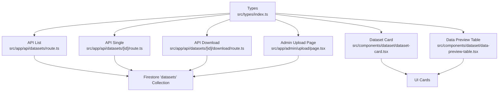
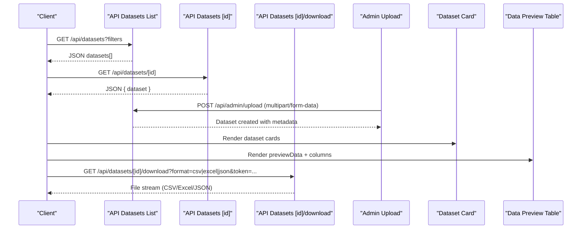
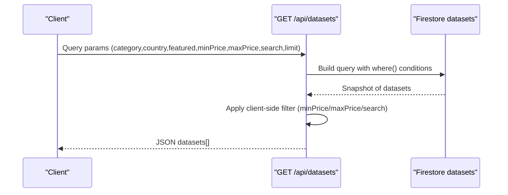
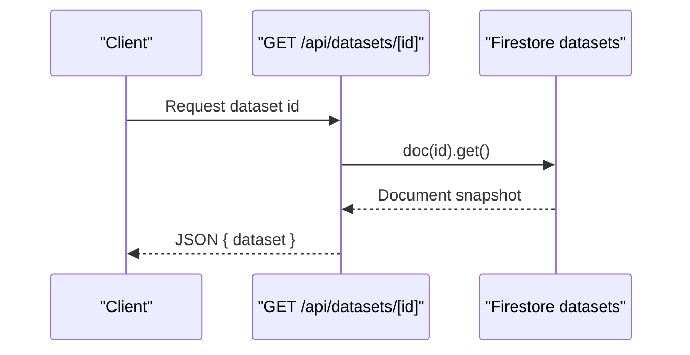
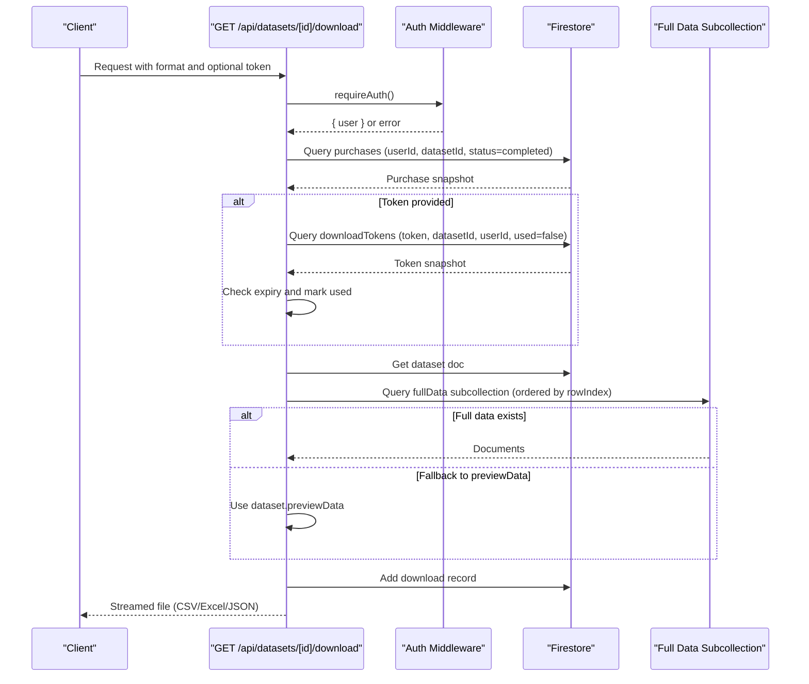
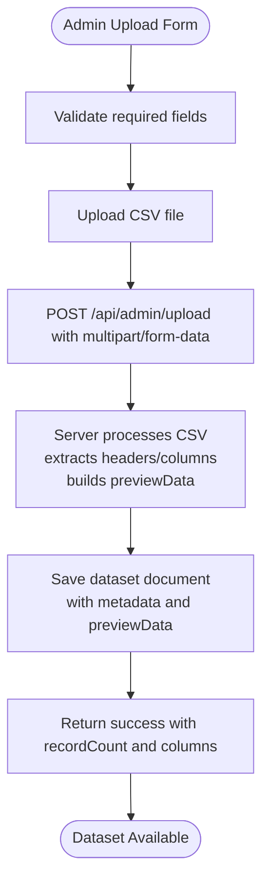
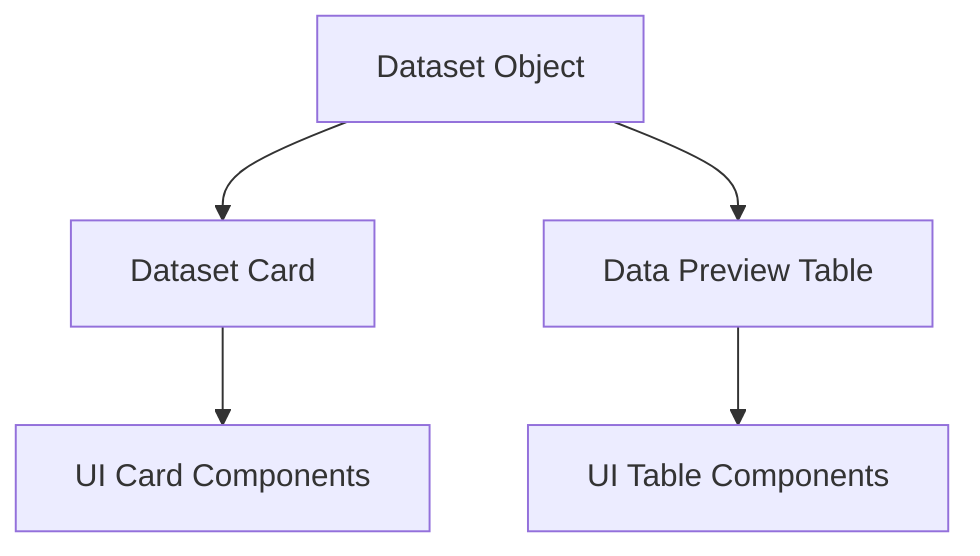
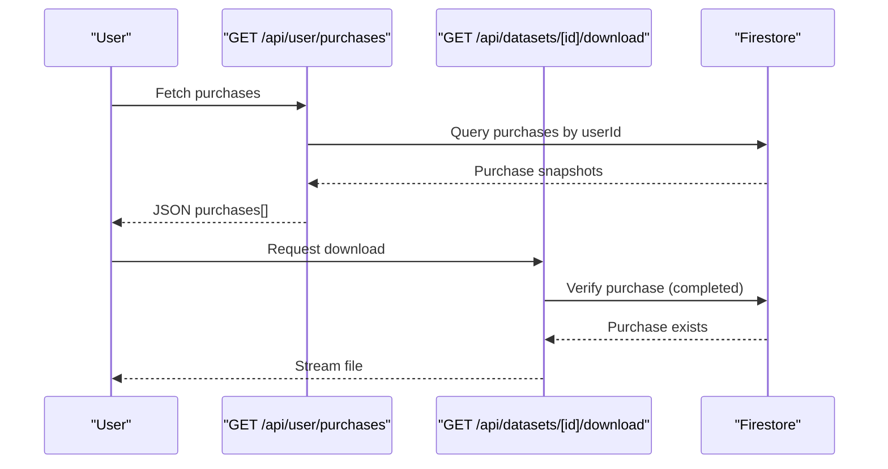
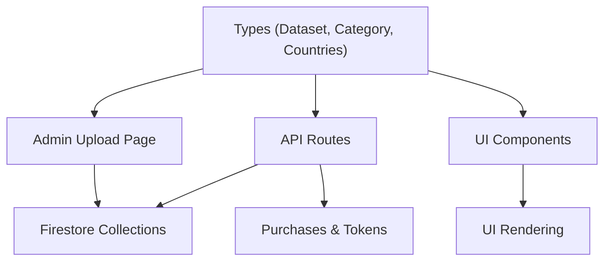

# Dataset Model

<cite>
**Referenced Files in This Document**
- [index.ts](file://src/types/index.ts)
- [route.ts](file://src/app/api/datasets/route.ts)
- [route.ts](file://src/app/api/datasets/[id]/route.ts)
- [route.ts](file://src/app/api/datasets/[id]/download/route.ts)
- [data-preview-table.tsx](file://src/components/dataset/data-preview-table.tsx)
- [dataset-card.tsx](file://src/components/dataset/dataset-card.tsx)
- [page.tsx](file://src/app/admin/upload/page.tsx)
- [page.tsx](file://src/app/datasets/[id]/page.tsx)
- [route.ts](file://src/app/api/user/purchases/route.ts)
</cite>

## Table of Contents
1. [Introduction](#introduction)
2. [Project Structure](#project-structure)
3. [Core Components](#core-components)
4. [Architecture Overview](#architecture-overview)
5. [Detailed Component Analysis](#detailed-component-analysis)
6. [Dependency Analysis](#dependency-analysis)
7. [Performance Considerations](#performance-considerations)
8. [Troubleshooting Guide](#troubleshooting-guide)
9. [Conclusion](#conclusion)
10. [Appendices](#appendices)

## Introduction
This document provides comprehensive documentation for the Dataset data model interface used in the Datafrica platform. It explains all Dataset properties, the DatasetCategory enumeration, the AFRICAN_COUNTRIES validation, pricing and currency semantics, metadata arrays (columns), previewData structure for CSV visualization, fileUrl, featured flag, rating system, and timestamps. It also documents the relationships between datasets and purchases, download tokens, and user interactions, along with validation rules and practical examples for dataset creation, categorization, and metadata management.

## Project Structure
The Dataset model is defined in the shared TypeScript types and is consumed across API routes, admin upload pages, and frontend components for display and interaction.



**Diagram sources**
- [index.ts:11-28](file://src/types/index.ts#L11-L28)
- [route.ts:5-61](file://src/app/api/datasets/route.ts#L5-L61)
- [route.ts:6-28](file://src/app/api/datasets/[id]/route.ts#L6-L28)
- [route.ts:7-147](file://src/app/api/datasets/[id]/download/route.ts#L7-L147)
- [page.tsx:180-244](file://src/app/admin/upload/page.tsx#L180-L244)
- [data-preview-table.tsx:12-75](file://src/components/dataset/data-preview-table.tsx#L12-L75)
- [dataset-card.tsx:10-80](file://src/components/dataset/dataset-card.tsx#L10-L80)

**Section sources**
- [index.ts:11-28](file://src/types/index.ts#L11-L28)
- [route.ts:5-61](file://src/app/api/datasets/route.ts#L5-L61)
- [route.ts:6-28](file://src/app/api/datasets/[id]/route.ts#L6-L28)
- [route.ts:7-147](file://src/app/api/datasets/[id]/download/route.ts#L7-L147)
- [page.tsx:180-244](file://src/app/admin/upload/page.tsx#L180-L244)
- [data-preview-table.tsx:12-75](file://src/components/dataset/data-preview-table.tsx#L12-L75)
- [dataset-card.tsx:10-80](file://src/components/dataset/dataset-card.tsx#L10-L80)

## Core Components
This section documents the Dataset interface and supporting enumerations and constants.

- Dataset interface properties
  - id: string
  - title: string
  - description: string
  - category: DatasetCategory
  - country: string (validated against AFRICAN_COUNTRIES)
  - price: number
  - currency: string
  - recordCount: number
  - columns: string[]
  - previewData: Record<string, string | number>[]
  - fileUrl: string
  - featured: boolean
  - rating: number
  - ratingCount: number
  - updatedAt: string
  - createdAt: string

- DatasetCategory enum values and business meanings
  - Business: Commercial directories, company listings, industry insights
  - Leads: Contact lists, prospect databases, sales leads
  - Real Estate: Property listings, transactions, market trends
  - Jobs: Job postings, employment statistics, labor market data
  - E-commerce: Online commerce metrics, buyer behavior, sales channels
  - Finance: Financial indicators, credit data, economic statistics
  - Health: Public health statistics, disease surveillance, healthcare access
  - Education: Enrollment data, school performance, literacy metrics

- AFRICAN_COUNTRIES validation
  - Dataset.country must match one of the predefined countries in AFRICAN_COUNTRIES

- Pricing and currency
  - price is a numeric amount; currency supports multiple African and international currencies
  - UI formatting distinguishes between XOF/CFA and other currencies

- Metadata arrays
  - columns: array of column header names derived from CSV headers
  - previewData: array of row objects with keys matching columns; limited to preview rows

- Timestamps
  - createdAt and updatedAt are ISO date strings managed by the backend

**Section sources**
- [index.ts:11-28](file://src/types/index.ts#L11-L28)
- [index.ts:52-60](file://src/types/index.ts#L52-L60)
- [index.ts:62-78](file://src/types/index.ts#L62-L78)
- [index.ts:80-89](file://src/types/index.ts#L80-L89)

## Architecture Overview
The Dataset model integrates with API routes for listing, retrieval, and downloads, with admin upload handling dataset ingestion and metadata extraction. Frontend components render dataset previews and cards, while purchases and download tokens govern access control.



**Diagram sources**
- [route.ts:5-61](file://src/app/api/datasets/route.ts#L5-L61)
- [route.ts:6-28](file://src/app/api/datasets/[id]/route.ts#L6-L28)
- [route.ts:7-147](file://src/app/api/datasets/[id]/download/route.ts#L7-L147)
- [page.tsx:44-98](file://src/app/admin/upload/page.tsx#L44-L98)
- [dataset-card.tsx:14-80](file://src/components/dataset/dataset-card.tsx#L14-L80)
- [data-preview-table.tsx:18-75](file://src/components/dataset/data-preview-table.tsx#L18-L75)

## Detailed Component Analysis

### Dataset Interface and Enumerations
The Dataset interface defines the canonical shape of dataset records, while DatasetCategory and AFRICAN_COUNTRIES constrain categorical and geographic fields.

```mermaid
classDiagram
class Dataset {
+string id
+string title
+string description
+DatasetCategory category
+string country
+number price
+string currency
+number recordCount
+string[] columns
+Record~string, string|number~[] previewData
+string fileUrl
+boolean featured
+number rating
+number ratingCount
+string updatedAt
+string createdAt
}
class DatasetCategory {
<<enumeration>>
"Business"
"Leads"
"Real Estate"
"Jobs"
"E-commerce"
"Finance"
"Health"
"Education"
}
class AFRICAN_COUNTRIES {
<<constant array>>
"Togo","Nigeria","Ghana","Kenya","South Africa","Senegal","Ivory Coast","Cameroon","Tanzania","Ethiopia","Rwanda","Uganda","Morocco","Egypt","DRC"
}
Dataset --> DatasetCategory : "uses"
Dataset --> AFRICAN_COUNTRIES : "validated against"
```

**Diagram sources**
- [index.ts:11-28](file://src/types/index.ts#L11-L28)
- [index.ts:52-60](file://src/types/index.ts#L52-L60)
- [index.ts:62-78](file://src/types/index.ts#L62-L78)

**Section sources**
- [index.ts:11-28](file://src/types/index.ts#L11-L28)
- [index.ts:52-60](file://src/types/index.ts#L52-L60)
- [index.ts:62-78](file://src/types/index.ts#L62-L78)

### Dataset Listing and Filtering
The datasets listing endpoint supports category, country, featured flag, price range, and search across title and description. It orders by creation time and applies client-side filtering for price and search.



**Diagram sources**
- [route.ts:5-61](file://src/app/api/datasets/route.ts#L5-L61)

**Section sources**
- [route.ts:5-61](file://src/app/api/datasets/route.ts#L5-L61)

### Single Dataset Retrieval
Retrieves a specific dataset by ID, returning the dataset object with an attached id field.



**Diagram sources**
- [route.ts:6-28](file://src/app/api/datasets/[id]/route.ts#L6-L28)

**Section sources**
- [route.ts:6-28](file://src/app/api/datasets/[id]/route.ts#L6-L28)

### Dataset Download Workflow
The download endpoint enforces authentication, verifies purchase completion, optionally validates a download token, retrieves full data from a subcollection or falls back to previewData, records the download, and streams the requested format (CSV, Excel, JSON).



**Diagram sources**
- [route.ts:7-147](file://src/app/api/datasets/[id]/download/route.ts#L7-L147)

**Section sources**
- [route.ts:7-147](file://src/app/api/datasets/[id]/download/route.ts#L7-L147)

### Admin Upload and Metadata Management
The admin upload page collects dataset metadata (title, description, category, country, price, currency, preview rows, featured), uploads a CSV, and posts to the admin upload endpoint. The form enforces required fields and restricts country and category to predefined lists.



**Diagram sources**
- [page.tsx:44-98](file://src/app/admin/upload/page.tsx#L44-L98)

**Section sources**
- [page.tsx:44-98](file://src/app/admin/upload/page.tsx#L44-L98)

### Frontend Rendering: Dataset Cards and Preview Tables
- Dataset cards display category badges, featured tag, country, record count, rating, and formatted price.
- Data preview tables render a subset of rows and columns for free preview, with truncation and limits.



**Diagram sources**
- [dataset-card.tsx:14-80](file://src/components/dataset/dataset-card.tsx#L14-L80)
- [data-preview-table.tsx:18-75](file://src/components/dataset/data-preview-table.tsx#L18-L75)

**Section sources**
- [dataset-card.tsx:14-80](file://src/components/dataset/dataset-card.tsx#L14-L80)
- [data-preview-table.tsx:18-75](file://src/components/dataset/data-preview-table.tsx#L18-L75)

### Purchases and Access Control
Purchases are linked to datasets via datasetId and userId. The download endpoint requires a completed purchase for access. Users can list their own purchases.



**Diagram sources**
- [route.ts:6-30](file://src/app/api/user/purchases/route.ts#L6-L30)
- [route.ts:22-36](file://src/app/api/datasets/[id]/download/route.ts#L22-L36)

**Section sources**
- [route.ts:6-30](file://src/app/api/user/purchases/route.ts#L6-L30)
- [route.ts:22-36](file://src/app/api/datasets/[id]/download/route.ts#L22-L36)

## Dependency Analysis
The Dataset model underpins multiple layers:
- Types define the canonical shape and constraints
- API routes depend on types and Firestore collections
- Admin upload depends on types and file parsing
- Frontend components depend on types for rendering
- Purchases and download tokens enforce access control



**Diagram sources**
- [index.ts:11-28](file://src/types/index.ts#L11-L28)
- [route.ts:5-61](file://src/app/api/datasets/route.ts#L5-L61)
- [page.tsx:44-98](file://src/app/admin/upload/page.tsx#L44-L98)
- [dataset-card.tsx:14-80](file://src/components/dataset/dataset-card.tsx#L14-L80)
- [data-preview-table.tsx:18-75](file://src/components/dataset/data-preview-table.tsx#L18-L75)
- [route.ts:7-147](file://src/app/api/datasets/[id]/download/route.ts#L7-L147)

**Section sources**
- [index.ts:11-28](file://src/types/index.ts#L11-L28)
- [route.ts:5-61](file://src/app/api/datasets/route.ts#L5-L61)
- [page.tsx:44-98](file://src/app/admin/upload/page.tsx#L44-L98)
- [dataset-card.tsx:14-80](file://src/components/dataset/dataset-card.tsx#L14-L80)
- [data-preview-table.tsx:18-75](file://src/components/dataset/data-preview-table.tsx#L18-L75)
- [route.ts:7-147](file://src/app/api/datasets/[id]/download/route.ts#L7-L147)

## Performance Considerations
- Listing datasets uses Firestore queries with server-side ordering and limits, but client-side filtering for price range and search reduces cache hits and may increase latency for large result sets.
- Downloading full data reads from a dedicated subcollection ordered by rowIndex; if absent, previewData is used as a fallback.
- Preview tables limit visible rows and columns to improve rendering performance on the client.

[No sources needed since this section provides general guidance]

## Troubleshooting Guide
- Dataset not found
  - Occurs when retrieving a single dataset by ID or during download if the dataset does not exist.
  - Action: Verify dataset ID and existence in Firestore.

- Authentication errors during download
  - The download endpoint requires authentication; missing or invalid auth returns an error.
  - Action: Ensure the user is logged in and the request includes a valid auth token.

- Purchase verification failure
  - Download requires a completed purchase; absence of a matching purchase triggers a 403 error.
  - Action: Confirm the user has a completed purchase for the dataset.

- Invalid or expired download token
  - If a token is provided, it must be unexpired and unused; otherwise a 403 error is returned.
  - Action: Regenerate a token or use a valid, unexpired token.

- Missing preview data
  - If the full data subcollection is empty, the system falls back to previewData; if both are unavailable, the preview table displays a message indicating no preview data.
  - Action: Ensure dataset ingestion populated previewData or full data.

**Section sources**
- [route.ts:15-17](file://src/app/api/datasets/[id]/route.ts#L15-L17)
- [route.ts:31-36](file://src/app/api/datasets/[id]/download/route.ts#L31-L36)
- [route.ts:49-54](file://src/app/api/datasets/[id]/download/route.ts#L49-L54)
- [route.ts:59-64](file://src/app/api/datasets/[id]/download/route.ts#L59-L64)
- [data-preview-table.tsx:26-32](file://src/components/dataset/data-preview-table.tsx#L26-L32)

## Conclusion
The Dataset model provides a robust foundation for dataset metadata, categorization, and geographic constraints. Its integration with API routes, admin upload, and frontend components enables efficient discovery, preview, and controlled access to datasets. The rating system and featured flag enhance discoverability, while purchases and download tokens enforce monetization and access control.

[No sources needed since this section summarizes without analyzing specific files]

## Appendices

### Validation Rules Summary
- Country validation: Must be one of AFRICAN_COUNTRIES
- Category validation: Must be one of DatasetCategory values
- Price validation: Non-negative numeric value
- Currency validation: Supported currency codes
- Columns validation: Array of strings representing CSV headers
- previewData validation: Array of objects with keys matching columns

**Section sources**
- [index.ts:62-78](file://src/types/index.ts#L62-L78)
- [index.ts:52-60](file://src/types/index.ts#L52-L60)
- [page.tsx:217-244](file://src/app/admin/upload/page.tsx#L217-L244)

### Examples

- Dataset creation (admin upload)
  - Fields: title, description, category, country, price, currency, previewRows, featured, CSV file
  - Outcome: Dataset saved with columns and previewData; recordCount reflects total rows

- Dataset categorization
  - Use category from DatasetCategory to classify datasets by domain (e.g., Business, Health, Education)

- Metadata management
  - columns: populated from CSV headers
  - previewData: limited rows for free preview
  - recordCount: total number of rows in the dataset

- Relationship with purchases and downloads
  - Users must have a completed purchase to download
  - Optional download tokens can be used for secure sharing

**Section sources**
- [page.tsx:44-98](file://src/app/admin/upload/page.tsx#L44-L98)
- [route.ts:7-147](file://src/app/api/datasets/[id]/download/route.ts#L7-L147)
- [route.ts:6-30](file://src/app/api/user/purchases/route.ts#L6-L30)