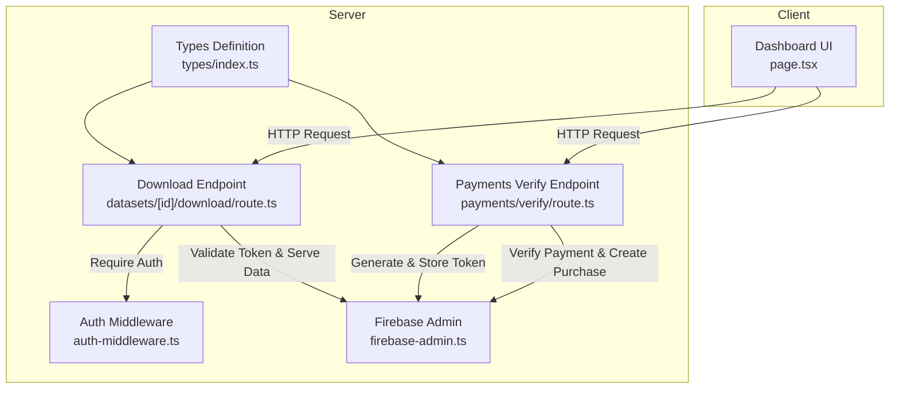
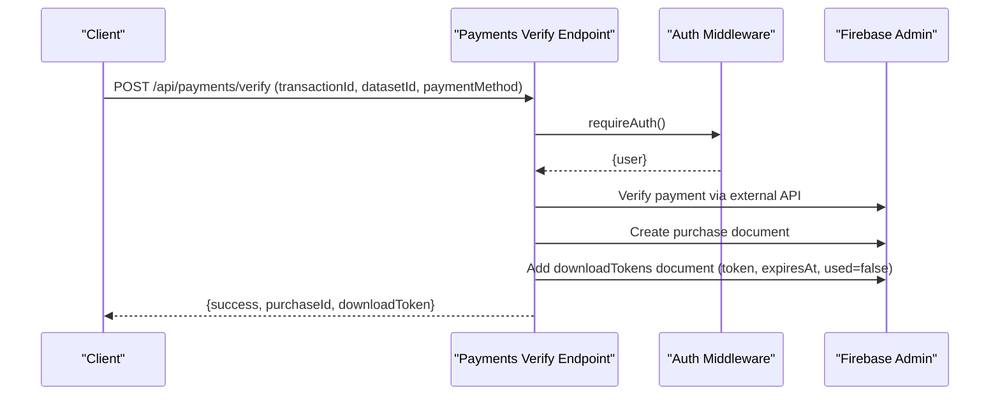
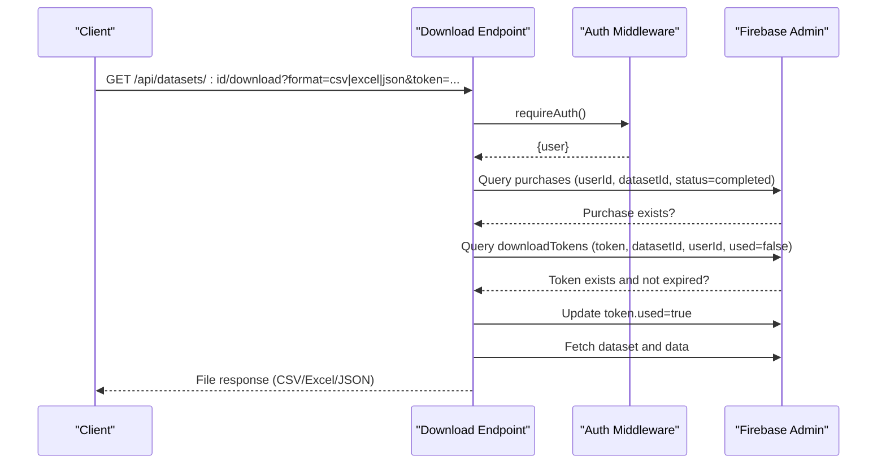
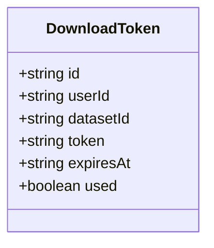
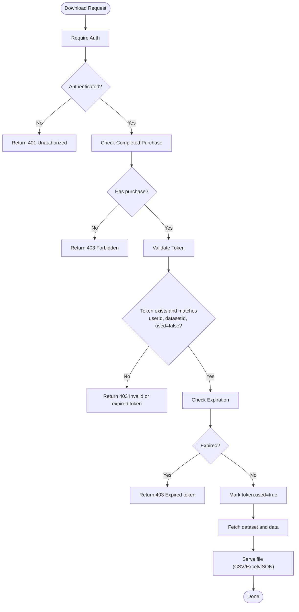
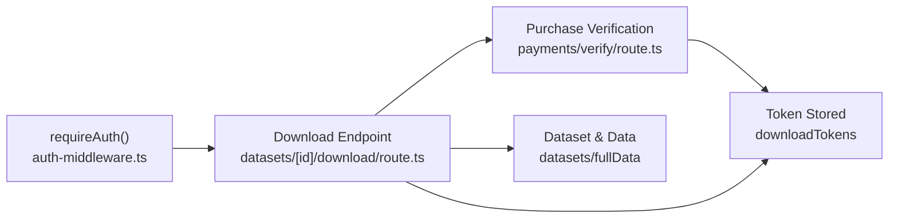
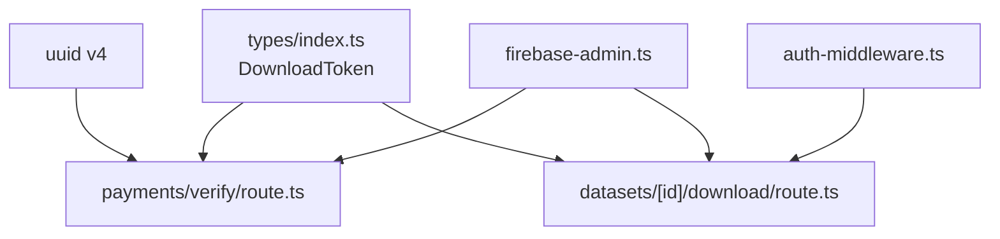

# Download Token Model

<cite>
**Referenced Files in This Document**
- [route.ts](file://src/app/api/datasets/[id]/download/route.ts)
- [route.ts](file://src/app/api/payments/verify/route.ts)
- [index.ts](file://src/types/index.ts)
- [auth-middleware.ts](file://src/lib/auth-middleware.ts)
- [firebase-admin.ts](file://src/lib/firebase-admin.ts)
- [page.tsx](file://src/app/dashboard/page.tsx)
</cite>

## Table of Contents
1. [Introduction](#introduction)
2. [Project Structure](#project-structure)
3. [Core Components](#core-components)
4. [Architecture Overview](#architecture-overview)
5. [Detailed Component Analysis](#detailed-component-analysis)
6. [Dependency Analysis](#dependency-analysis)
7. [Performance Considerations](#performance-considerations)
8. [Troubleshooting Guide](#troubleshooting-guide)
9. [Conclusion](#conclusion)

## Introduction
This document provides comprehensive documentation for the DownloadToken data model used to secure dataset downloads. It explains the token-based protection mechanism, covering property definitions, generation, validation, expiration handling, and usage tracking. It also outlines the relationships with purchase verification, user authentication, and dataset access control, along with security considerations and operational examples.

## Project Structure
The DownloadToken model is defined in the shared types module and is consumed by the payment verification endpoint (which generates tokens) and the dataset download endpoint (which validates tokens). Authentication is enforced via middleware, and database access is performed through Firebase Admin.

**Diagram sources**
- [route.ts:1-135](file://src/app/api/payments/verify/route.ts#L1-L135)
- [route.ts:1-148](file://src/app/api/datasets/[id]/download/route.ts#L1-L148)
- [index.ts:43-50](file://src/types/index.ts#L43-L50)
- [auth-middleware.ts:1-48](file://src/lib/auth-middleware.ts#L1-L48)
- [firebase-admin.ts:1-50](file://src/lib/firebase-admin.ts#L1-L50)
- [page.tsx:68-103](file://src/app/dashboard/page.tsx#L68-L103)

**Section sources**
- [route.ts:1-135](file://src/app/api/payments/verify/route.ts#L1-L135)
- [route.ts:1-148](file://src/app/api/datasets/[id]/download/route.ts#L1-L148)
- [index.ts:43-50](file://src/types/index.ts#L43-L50)
- [auth-middleware.ts:1-48](file://src/lib/auth-middleware.ts#L1-L48)
- [firebase-admin.ts:1-50](file://src/lib/firebase-admin.ts#L1-L50)
- [page.tsx:68-103](file://src/app/dashboard/page.tsx#L68-L103)

## Core Components
The DownloadToken model defines the structure and constraints for secure dataset access tokens. It includes:
- id: Unique identifier for the token document
- userId: Foreign key to the purchasing user
- datasetId: Foreign key to the purchased dataset
- token: Cryptographic token string (UUID)
- expiresAt: ISO 8601 timestamp indicating expiration
- used: Boolean flag indicating single-use consumption

Validation rules and constraints observed in the codebase:
- Token uniqueness per dataset-user pair is enforced implicitly by the query conditions during validation
- Expiration is checked against the current time
- Single-use semantics are enforced by marking the token as used after successful validation
- Access requires prior purchase verification and active purchase status

Security considerations:
- Token entropy: UUID v4 is used for token generation, providing strong randomness suitable for cryptographic use
- Expiration policy: Tokens expire after 24 hours from creation
- Access logging: Download events are recorded in a dedicated collection
- Validation scope: Token queries include datasetId, userId, and used=false to prevent reuse and cross-dataset misuse

**Section sources**
- [index.ts:43-50](file://src/types/index.ts#L43-L50)
- [route.ts:112-120](file://src/app/api/payments/verify/route.ts#L112-L120)
- [route.ts:38-68](file://src/app/api/datasets/[id]/download/route.ts#L38-L68)

## Architecture Overview
The token-based security system integrates three primary flows:
1. Payment verification creates a purchase and a download token
2. Dataset download validates authentication, purchase, and token before serving data
3. Access logging records each download event

**Diagram sources**
- [route.ts:1-135](file://src/app/api/payments/verify/route.ts#L1-L135)
- [auth-middleware.ts:19-28](file://src/lib/auth-middleware.ts#L19-L28)
- [firebase-admin.ts:37-42](file://src/lib/firebase-admin.ts#L37-L42)

**Diagram sources**
- [route.ts:1-148](file://src/app/api/datasets/[id]/download/route.ts#L1-L148)
- [auth-middleware.ts:19-28](file://src/lib/auth-middleware.ts#L19-L28)
- [firebase-admin.ts:37-42](file://src/lib/firebase-admin.ts#L37-L42)

## Detailed Component Analysis

### DownloadToken Data Model
The DownloadToken interface defines the schema and constraints for token storage and validation.

**Diagram sources**
- [index.ts:43-50](file://src/types/index.ts#L43-L50)

**Section sources**
- [index.ts:43-50](file://src/types/index.ts#L43-L50)

### Token Generation and Storage
The payment verification endpoint generates a UUID-based token and stores it with an expiration timestamp and a false used flag. It also creates a purchase record upon successful payment verification.

Key behaviors:
- Token generation uses a cryptographically secure UUID v4 generator
- Expiration is set to 24 hours from creation time
- Token is stored in the downloadTokens collection with userId, datasetId, token, expiresAt, and used=false

Operational example:
- On successful payment verification, the endpoint returns both the purchaseId and the generated downloadToken for client-side use.

**Section sources**
- [route.ts:112-126](file://src/app/api/payments/verify/route.ts#L112-L126)

### Token Validation and Usage Tracking
The download endpoint enforces a multi-layered validation:
- Authentication: Requires a valid Firebase ID token via Bearer authorization
- Purchase verification: Confirms the user has a completed purchase for the requested dataset
- Token validation: Ensures the token exists, belongs to the user and dataset, is unused, and not expired
- Usage tracking: Marks the token as used after successful validation

**Diagram sources**
- [route.ts:18-105](file://src/app/api/datasets/[id]/download/route.ts#L18-L105)

**Section sources**
- [route.ts:18-105](file://src/app/api/datasets/[id]/download/route.ts#L18-L105)

### Relationship to Purchase Verification, Authentication, and Access Control
- Purchase verification: Ensures only users who completed payment for the dataset can obtain a token and subsequently download data
- User authentication: Enforces Bearer token authentication for all endpoints, validating the caller's identity
- Access control: Combines purchase status, token validity, and user identity to authorize downloads

**Diagram sources**
- [route.ts:98-126](file://src/app/api/payments/verify/route.ts#L98-L126)
- [auth-middleware.ts:19-28](file://src/lib/auth-middleware.ts#L19-L28)
- [route.ts:22-105](file://src/app/api/datasets/[id]/download/route.ts#L22-L105)

**Section sources**
- [route.ts:98-126](file://src/app/api/payments/verify/route.ts#L98-L126)
- [auth-middleware.ts:19-28](file://src/lib/auth-middleware.ts#L19-L28)
- [route.ts:22-105](file://src/app/api/datasets/[id]/download/route.ts#L22-L105)

## Dependency Analysis
The download token system depends on:
- Types definition for consistent schema representation
- Authentication middleware for Bearer token validation
- Firebase Admin for Firestore operations
- UUID library for secure token generation

**Diagram sources**
- [index.ts:43-50](file://src/types/index.ts#L43-L50)
- [route.ts](file://src/app/api/payments/verify/route.ts#L4)
- [route.ts](file://src/app/api/datasets/[id]/download/route.ts#L2)
- [auth-middleware.ts:1-48](file://src/lib/auth-middleware.ts#L1-L48)
- [firebase-admin.ts:1-50](file://src/lib/firebase-admin.ts#L1-L50)

**Section sources**
- [index.ts:43-50](file://src/types/index.ts#L43-L50)
- [route.ts](file://src/app/api/payments/verify/route.ts#L4)
- [route.ts](file://src/app/api/datasets/[id]/download/route.ts#L2)
- [auth-middleware.ts:1-48](file://src/lib/auth-middleware.ts#L1-L48)
- [firebase-admin.ts:1-50](file://src/lib/firebase-admin.ts#L1-L50)

## Performance Considerations
- Token lookup uses composite queries on token, datasetId, userId, and used=false; ensure appropriate Firestore indexing for these fields to minimize latency
- Expiration checks are performed client-side using date comparison; keep expiresAt in ISO 8601 format for reliable comparisons
- Consider implementing periodic cleanup jobs to remove expired tokens and reduce collection size over time
- Batch operations for bulk downloads should avoid redundant token validations by leveraging cached purchase and token states where feasible

## Troubleshooting Guide
Common issues and resolutions:
- Invalid or expired token: Occurs when the token does not match the user/dataset combination, is marked as used, or has exceeded the 24-hour window
  - Resolution: Regenerate a new token via payment verification or ensure the token is used within the expiration period
- Unauthorized access: Returned when the Bearer token is missing or invalid
  - Resolution: Ensure the client includes a valid Firebase ID token in the Authorization header
- No purchase found: Occurs when the user has not completed a purchase for the dataset
  - Resolution: Complete the payment flow and verify the purchase status before attempting to download
- Download fails with internal error: Indicates server-side exceptions during file generation
  - Resolution: Check server logs and ensure dataset data is accessible and properly formatted

**Section sources**
- [route.ts:31-68](file://src/app/api/datasets/[id]/download/route.ts#L31-L68)
- [auth-middleware.ts:19-28](file://src/lib/auth-middleware.ts#L19-L28)
- [route.ts:98-126](file://src/app/api/payments/verify/route.ts#L98-L126)

## Conclusion
The DownloadToken model provides a robust, token-based mechanism for securing dataset downloads. By combining purchase verification, user authentication, and time-bound, single-use tokens, the system ensures that only authorized users can access purchased datasets. Proper indexing, consistent schema enforcement, and periodic maintenance will help sustain performance and security over time.