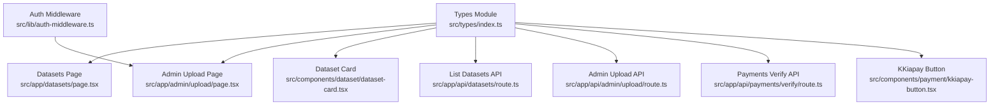
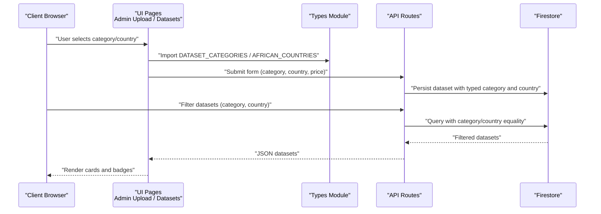
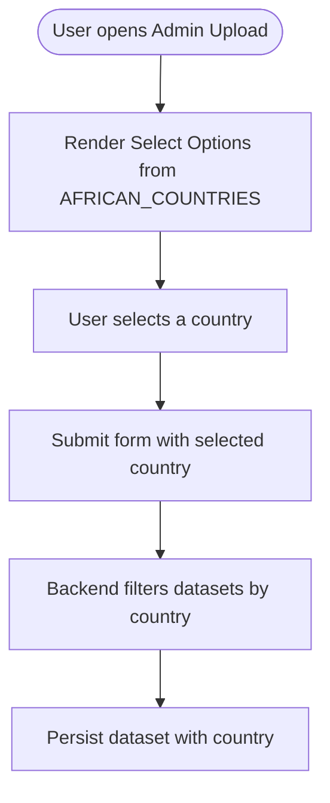
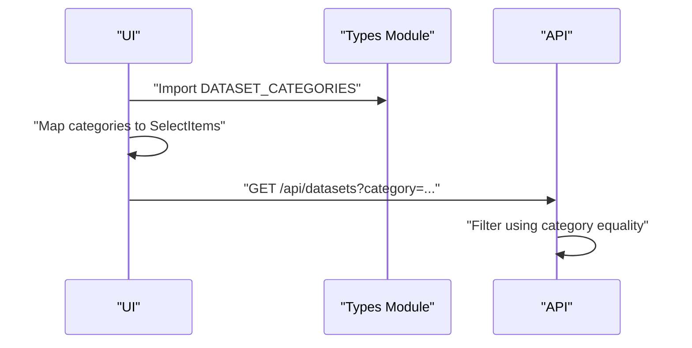
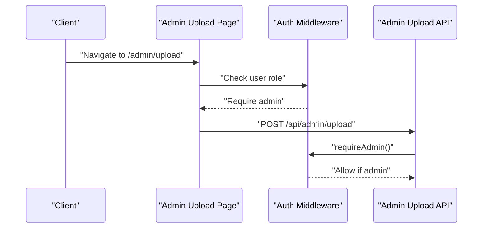
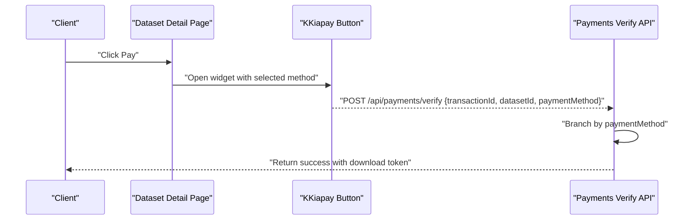
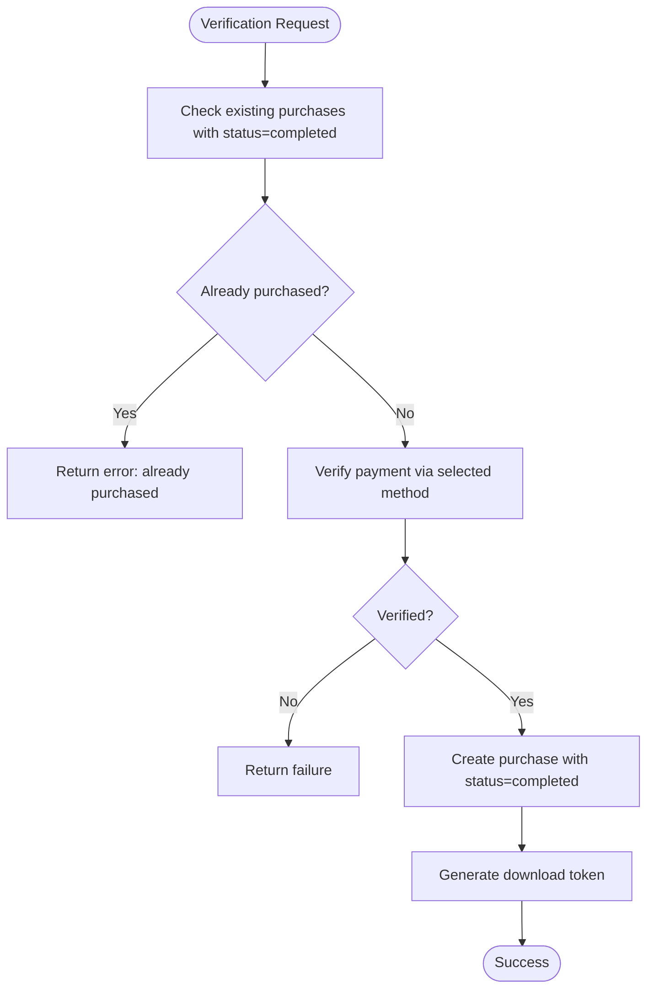
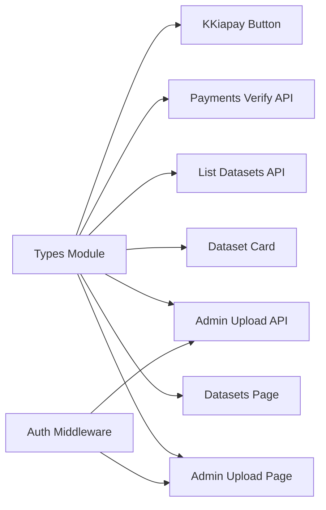

# Enums and Constants

<cite>
**Referenced Files in This Document**
- [src/types/index.ts](file://src/types/index.ts)
- [src/app/datasets/page.tsx](file://src/app/datasets/page.tsx)
- [src/app/admin/upload/page.tsx](file://src/app/admin/upload/page.tsx)
- [src/app/api/datasets/route.ts](file://src/app/api/datasets/route.ts)
- [src/app/api/admin/upload/route.ts](file://src/app/api/admin/upload/route.ts)
- [src/app/api/payments/verify/route.ts](file://src/app/api/payments/verify/route.ts)
- [src/components/dataset/dataset-card.tsx](file://src/components/dataset/dataset-card.tsx)
- [src/components/payment/kkiapay-button.tsx](file://src/components/payment/kkiapay-button.tsx)
- [src/lib/auth-middleware.ts](file://src/lib/auth-middleware.ts)
</cite>

## Table of Contents
1. [Introduction](#introduction)
2. [Project Structure](#project-structure)
3. [Core Components](#core-components)
4. [Architecture Overview](#architecture-overview)
5. [Detailed Component Analysis](#detailed-component-analysis)
6. [Dependency Analysis](#dependency-analysis)
7. [Performance Considerations](#performance-considerations)
8. [Troubleshooting Guide](#troubleshooting-guide)
9. [Conclusion](#conclusion)

## Introduction
This document explains the TypeScript enums and constants used across the Datafrica application. It focuses on:
- DatasetCategory type and its usage in forms, filtering, and persistence
- AFRICAN_COUNTRIES constant array and its role in selection and validation
- DATASET_CATEGORIES array for dynamic UI generation and filtering
- Role values ("user" and "admin") and their permission implications
- Payment method values ("kkiapay" and "stripe") and status values ("pending", "completed", "failed")
- Practical examples of usage in forms, validation, and business logic
- Benefits of TypeScript enums/constants over raw string literals
- How constants support internationalization and regional expansion

## Project Structure
The enums and constants are centralized in the shared types module and consumed across UI pages, API routes, and components.



**Diagram sources**
- [src/types/index.ts:1-90](file://src/types/index.ts#L1-L90)
- [src/app/datasets/page.tsx:17](file://src/app/datasets/page.tsx#L17)
- [src/app/admin/upload/page.tsx:19](file://src/app/admin/upload/page.tsx#L19)
- [src/app/api/datasets/route.ts:1-35](file://src/app/api/datasets/route.ts#L1-L35)
- [src/app/api/admin/upload/route.ts:1-93](file://src/app/api/admin/upload/route.ts#L1-L93)
- [src/app/api/payments/verify/route.ts:1-134](file://src/app/api/payments/verify/route.ts#L1-L134)
- [src/components/dataset/dataset-card.tsx:28-30](file://src/components/dataset/dataset-card.tsx#L28-L30)
- [src/components/payment/kkiapay-button.tsx:1-109](file://src/components/payment/kkiapay-button.tsx#L1-L109)
- [src/lib/auth-middleware.ts:30-47](file://src/lib/auth-middleware.ts#L30-L47)

**Section sources**
- [src/types/index.ts:1-90](file://src/types/index.ts#L1-L90)

## Core Components
- DatasetCategory type: A discriminated union of category strings used across the application for typing and autocomplete.
- AFRICAN_COUNTRIES constant: An immutable array of supported African countries used in selection UIs and server-side filtering.
- DATASET_CATEGORIES array: A typed array of categories used to populate form selects and filter datasets.
- Role values: "user" and "admin" used in user typing and admin-only routes.
- Payment method values: "kkiapay" and "stripe" used in purchase records and verification logic.
- Status values: "pending", "completed", "failed" used in purchase records and verification outcomes.

These definitions live in the shared types module and are imported wherever needed.

**Section sources**
- [src/types/index.ts:52-90](file://src/types/index.ts#L52-L90)

## Architecture Overview
The enums and constants flow through UI components, API routes, and middleware to enforce type safety and consistent behavior.



**Diagram sources**
- [src/app/admin/upload/page.tsx:184-212](file://src/app/admin/upload/page.tsx#L184-L212)
- [src/app/datasets/page.tsx:91-103](file://src/app/datasets/page.tsx#L91-L103)
- [src/app/api/datasets/route.ts:19-27](file://src/app/api/datasets/route.ts#L19-L27)
- [src/types/index.ts:52-90](file://src/types/index.ts#L52-L90)

## Detailed Component Analysis

### DatasetCategory Type
- Definition: A union of category strings representing dataset domains.
- Usage:
  - Typing dataset objects and API payloads
  - Populating category selects in admin upload and marketplace filters
  - Filtering datasets by category in the backend

```mermaid
classDiagram
class DatasetCategory {
<<union>>
"Business"
"Leads"
"Real Estate"
"Jobs"
"E-commerce"
"Finance"
"Health"
"Education"
}
class Dataset {
+string id
+string title
+DatasetCategory category
}
Dataset --> DatasetCategory : "typed field"
```

**Diagram sources**
- [src/types/index.ts:52-60](file://src/types/index.ts#L52-L60)
- [src/types/index.ts:11-28](file://src/types/index.ts#L11-L28)

**Section sources**
- [src/types/index.ts:52-60](file://src/types/index.ts#L52-L60)
- [src/app/admin/upload/page.tsx:188-195](file://src/app/admin/upload/page.tsx#L188-L195)
- [src/app/datasets/page.tsx:96-102](file://src/app/datasets/page.tsx#L96-L102)
- [src/app/api/datasets/route.ts:19-21](file://src/app/api/datasets/route.ts#L19-L21)

### AFRICAN_COUNTRIES Constant Array
- Definition: An immutable array of country names.
- Usage:
  - Rendered in admin upload country select
  - Used to filter datasets by country in the backend
  - Ensures consistent selection across the UI



**Diagram sources**
- [src/types/index.ts:62-78](file://src/types/index.ts#L62-L78)
- [src/app/admin/upload/page.tsx:199-211](file://src/app/admin/upload/page.tsx#L199-L211)
- [src/app/api/datasets/route.ts:22-24](file://src/app/api/datasets/route.ts#L22-L24)

**Section sources**
- [src/types/index.ts:62-78](file://src/types/index.ts#L62-L78)
- [src/app/admin/upload/page.tsx:199-211](file://src/app/admin/upload/page.tsx#L199-L211)
- [src/app/api/datasets/route.ts:22-24](file://src/app/api/datasets/route.ts#L22-L24)

### DATASET_CATEGORIES Array
- Definition: Typed array of categories used for dynamic UI generation.
- Usage:
  - Populate category dropdowns in marketplace and admin upload
  - Centralized maintenance of available categories



**Diagram sources**
- [src/types/index.ts:80-89](file://src/types/index.ts#L80-L89)
- [src/app/datasets/page.tsx:96-102](file://src/app/datasets/page.tsx#L96-L102)
- [src/app/admin/upload/page.tsx:188-195](file://src/app/admin/upload/page.tsx#L188-L195)
- [src/app/api/datasets/route.ts:19-21](file://src/app/api/datasets/route.ts#L19-L21)

**Section sources**
- [src/types/index.ts:80-89](file://src/types/index.ts#L80-L89)
- [src/app/datasets/page.tsx:96-102](file://src/app/datasets/page.tsx#L96-L102)
- [src/app/admin/upload/page.tsx:188-195](file://src/app/admin/upload/page.tsx#L188-L195)

### Role Values ("user" and "admin")
- Definition: Literal role values used in user typing and middleware checks.
- Permission implications:
  - Admin-only routes enforce admin role before allowing uploads or administrative actions
  - UI guards redirect non-admin users away from admin pages



**Diagram sources**
- [src/types/index.ts:3-9](file://src/types/index.ts#L3-L9)
- [src/app/admin/upload/page.tsx:38-42](file://src/app/admin/upload/page.tsx#L38-L42)
- [src/lib/auth-middleware.ts:30-47](file://src/lib/auth-middleware.ts#L30-L47)
- [src/app/api/admin/upload/route.ts:9-10](file://src/app/api/admin/upload/route.ts#L9-L10)

**Section sources**
- [src/types/index.ts:3-9](file://src/types/index.ts#L3-L9)
- [src/app/admin/upload/page.tsx:38-42](file://src/app/admin/upload/page.tsx#L38-L42)
- [src/lib/auth-middleware.ts:30-47](file://src/lib/auth-middleware.ts#L30-L47)

### Payment Method Enum ("kkiapay" and "stripe")
- Definition: Literal values for payment method stored in purchase records.
- Usage:
  - UI triggers payment via selected method
  - Verification logic branches based on method
  - Purchase records persist chosen method



**Diagram sources**
- [src/types/index.ts:37-41](file://src/types/index.ts#L37-L41)
- [src/components/payment/kkiapay-button.tsx:50-63](file://src/components/payment/kkiapay-button.tsx#L50-L63)
- [src/app/api/payments/verify/route.ts:13-20](file://src/app/api/payments/verify/route.ts#L13-L20)
- [src/app/api/payments/verify/route.ts:47-84](file://src/app/api/payments/verify/route.ts#L47-L84)

**Section sources**
- [src/types/index.ts:37-41](file://src/types/index.ts#L37-L41)
- [src/components/payment/kkiapay-button.tsx:50-63](file://src/components/payment/kkiapay-button.tsx#L50-L63)
- [src/app/api/payments/verify/route.ts:13-20](file://src/app/api/payments/verify/route.ts#L13-L20)
- [src/app/api/payments/verify/route.ts:47-84](file://src/app/api/payments/verify/route.ts#L47-L84)

### Status Enum ("pending", "completed", "failed")
- Definition: Literal values for purchase status.
- Usage:
  - Verification sets status to completed upon successful payment
  - UI displays status badges for user purchases
  - Backend prevents duplicate purchases with completed status



**Diagram sources**
- [src/types/index.ts:39-41](file://src/types/index.ts#L39-L41)
- [src/app/api/payments/verify/route.ts:23-36](file://src/app/api/payments/verify/route.ts#L23-L36)
- [src/app/api/payments/verify/route.ts:98-110](file://src/app/api/payments/verify/route.ts#L98-L110)

**Section sources**
- [src/types/index.ts:39-41](file://src/types/index.ts#L39-L41)
- [src/app/api/payments/verify/route.ts:23-36](file://src/app/api/payments/verify/route.ts#L23-L36)
- [src/app/api/payments/verify/route.ts:98-110](file://src/app/api/payments/verify/route.ts#L98-L110)

### Examples of Enum Usage in Forms, Validation, and Business Logic
- Marketplace filters:
  - UI builds URL parameters with category and country
  - Backend applies equality filters for category and country
- Admin upload:
  - Form collects category and country from typed arrays
  - Backend validates presence and parses numeric price
- Payments:
  - UI passes paymentMethod to verification endpoint
  - Backend verifies payment and creates purchase with status completed

**Section sources**
- [src/app/datasets/page.tsx:28-34](file://src/app/datasets/page.tsx#L28-L34)
- [src/app/api/datasets/route.ts:19-27](file://src/app/api/datasets/route.ts#L19-L27)
- [src/app/admin/upload/page.tsx:44-55](file://src/app/admin/upload/page.tsx#L44-L55)
- [src/app/api/admin/upload/route.ts:23-28](file://src/app/api/admin/upload/route.ts#L23-L28)
- [src/app/api/payments/verify/route.ts:13-20](file://src/app/api/payments/verify/route.ts#L13-L20)

## Dependency Analysis
- Centralized definitions in the types module decouple UI and API logic from concrete string values.
- UI pages depend on typed arrays for rendering options and filtering.
- API routes depend on equality filters for category and country.
- Middleware depends on role values to enforce permissions.



**Diagram sources**
- [src/types/index.ts:1-90](file://src/types/index.ts#L1-L90)
- [src/app/datasets/page.tsx:17](file://src/app/datasets/page.tsx#L17)
- [src/app/admin/upload/page.tsx:19](file://src/app/admin/upload/page.tsx#L19)
- [src/components/dataset/dataset-card.tsx:28-30](file://src/components/dataset/dataset-card.tsx#L28-L30)
- [src/app/api/datasets/route.ts:1-35](file://src/app/api/datasets/route.ts#L1-L35)
- [src/app/api/admin/upload/route.ts:1-93](file://src/app/api/admin/upload/route.ts#L1-L93)
- [src/app/api/payments/verify/route.ts:1-134](file://src/app/api/payments/verify/route.ts#L1-L134)
- [src/components/payment/kkiapay-button.tsx:1-109](file://src/components/payment/kkiapay-button.tsx#L1-L109)
- [src/lib/auth-middleware.ts:30-47](file://src/lib/auth-middleware.ts#L30-L47)

**Section sources**
- [src/types/index.ts:1-90](file://src/types/index.ts#L1-L90)
- [src/lib/auth-middleware.ts:30-47](file://src/lib/auth-middleware.ts#L30-L47)

## Performance Considerations
- Using typed unions and arrays avoids repeated string comparisons and reduces runtime branching complexity.
- Centralizing constants minimizes duplication and improves maintainability.
- Equality filters on category and country are efficient for small to medium datasets; consider indexing in Firestore for larger workloads.

## Troubleshooting Guide
- Category mismatch:
  - Ensure category values match the DatasetCategory union exactly.
  - Verify UI selects are populated from DATASET_CATEGORIES.
- Country mismatch:
  - Confirm country values match entries in AFRICAN_COUNTRIES.
  - Check backend filters apply equality on the country field.
- Payment verification failures:
  - Validate paymentMethod is one of the allowed values.
  - Confirm verification logic handles both kkiapay and stripe branches.
- Duplicate purchases:
  - The backend prevents re-purchasing the same dataset with status completed.

**Section sources**
- [src/app/api/datasets/route.ts:19-27](file://src/app/api/datasets/route.ts#L19-L27)
- [src/app/api/payments/verify/route.ts:23-36](file://src/app/api/payments/verify/route.ts#L23-L36)
- [src/app/api/payments/verify/route.ts:47-84](file://src/app/api/payments/verify/route.ts#L47-L84)

## Conclusion
TypeScript enums and constants in Datafrica centralize domain-specific values, ensuring type safety, consistency, and maintainability across UI and API layers. They enable robust form controls, reliable filtering, secure admin-only operations, and clear payment and status semantics. By leveraging these typed values, the application scales predictably and supports future regional and feature expansions.