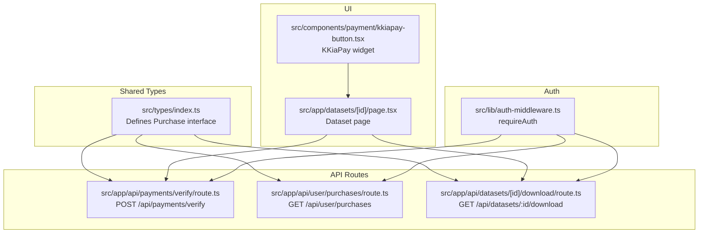
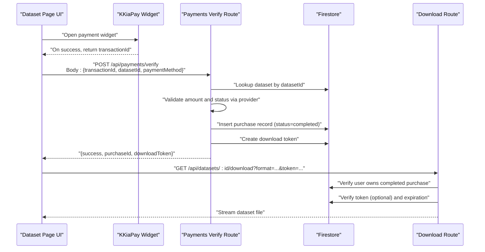
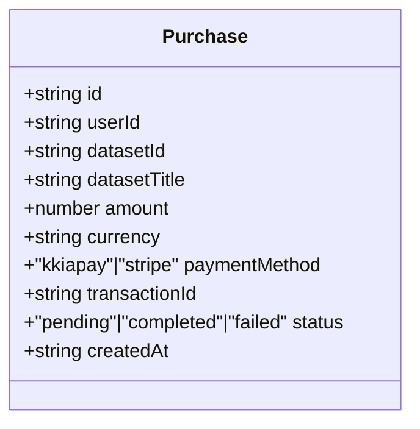
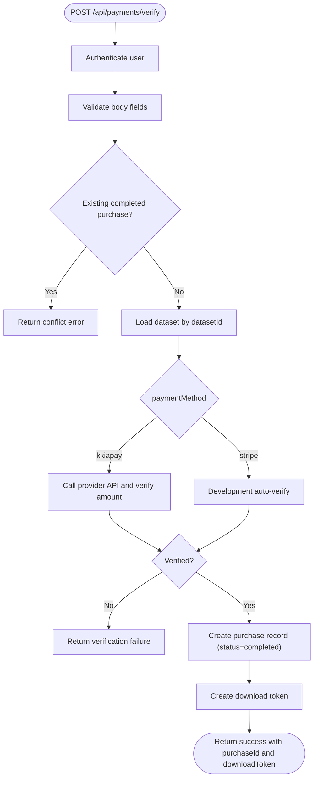
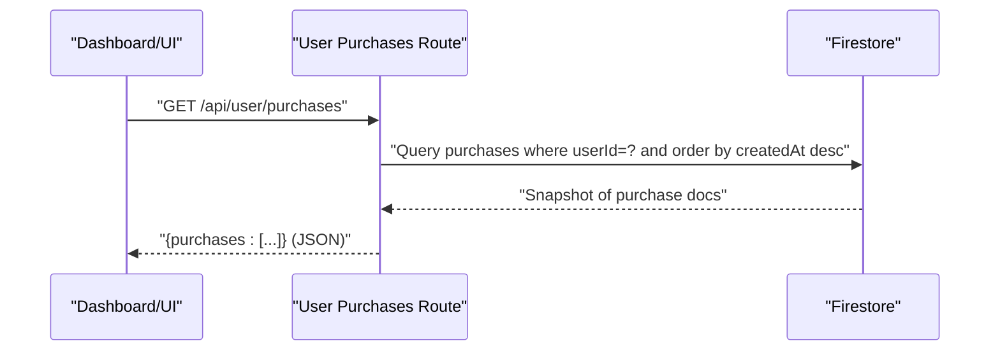
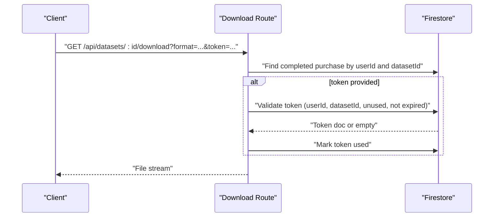
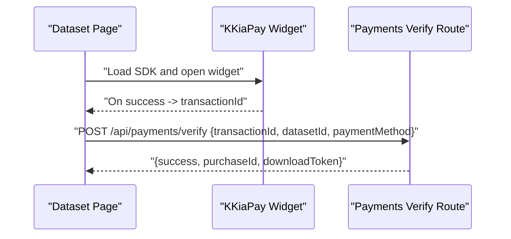
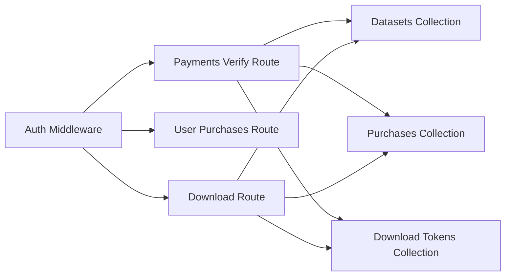

# Purchase Model

<cite>
**Referenced Files in This Document**
- [index.ts](file://src/types/index.ts)
- [route.ts](file://src/app/api/payments/verify/route.ts)
- [route.ts](file://src/app/api/user/purchases/route.ts)
- [route.ts](file://src/app/api/datasets/[id]/download/route.ts)
- [page.tsx](file://src/app/datasets/[id]/page.tsx)
- [kkiapay-button.tsx](file://src/components/payment/kkiapay-button.tsx)
- [auth-middleware.ts](file://src/lib/auth-middleware.ts)
</cite>

## Table of Contents
1. [Introduction](#introduction)
2. [Project Structure](#project-structure)
3. [Core Components](#core-components)
4. [Architecture Overview](#architecture-overview)
5. [Detailed Component Analysis](#detailed-component-analysis)
6. [Dependency Analysis](#dependency-analysis)
7. [Performance Considerations](#performance-considerations)
8. [Troubleshooting Guide](#troubleshooting-guide)
9. [Conclusion](#conclusion)

## Introduction
This document describes the Purchase data model interface used for transaction tracking in the system. It explains all Purchase properties, the payment processing workflow, how purchase records track transaction lifecycle, payment method integrations, transaction ID mapping, status transition logic, and the relationship between purchases and user accounts, datasets, and download access management. It also documents validation rules for monetary amounts, currency codes, and status enumerations, and provides examples of purchase creation, status updates, and payment verification workflows.

## Project Structure
The Purchase model is defined in the shared TypeScript types and is consumed by several API routes and UI components:
- Purchase type definition resides in the shared types module.
- Payment verification and purchase creation occur in a dedicated API route.
- Users can list their purchases via another API route.
- Download access is gated by purchase records and optional short-lived tokens.
- The UI integrates with a payment provider and triggers verification.

**Diagram sources**
- [index.ts:30-41](file://src/types/index.ts#L30-L41)
- [route.ts:1-135](file://src/app/api/payments/verify/route.ts#L1-L135)
- [route.ts:1-31](file://src/app/api/user/purchases/route.ts#L1-L31)
- [route.ts:1-148](file://src/app/api/datasets/[id]/download/route.ts#L1-L148)
- [page.tsx:90-162](file://src/app/datasets/[id]/page.tsx#L90-L162)
- [kkiapay-button.tsx:1-109](file://src/components/payment/kkiapay-button.tsx#L1-L109)
- [auth-middleware.ts:19-28](file://src/lib/auth-middleware.ts#L19-L28)

**Section sources**
- [index.ts:30-41](file://src/types/index.ts#L30-L41)
- [route.ts:1-135](file://src/app/api/payments/verify/route.ts#L1-L135)
- [route.ts:1-31](file://src/app/api/user/purchases/route.ts#L1-L31)
- [route.ts:1-148](file://src/app/api/datasets/[id]/download/route.ts#L1-L148)
- [page.tsx:90-162](file://src/app/datasets/[id]/page.tsx#L90-L162)
- [kkiapay-button.tsx:1-109](file://src/components/payment/kkiapay-button.tsx#L1-L109)
- [auth-middleware.ts:19-28](file://src/lib/auth-middleware.ts#L19-L28)

## Core Components
- Purchase interface: Defines the shape of a purchase record, including identifiers, foreign keys, pricing, payment metadata, and lifecycle fields.
- Payment verification route: Validates payment via external providers, ensures dataset price correctness, prevents duplicate purchases, creates purchase records, and issues download tokens.
- Purchases listing route: Returns the current user’s purchase history ordered by creation time.
- Download route: Enforces purchase ownership and optional token validity before serving dataset files.
- UI integration: Initiates payment via a provider widget and triggers verification after a successful transaction.

Key properties of the Purchase interface:
- id: Unique identifier for the purchase record.
- userId: Foreign key to the user who made the purchase.
- datasetId: Foreign key to the purchased dataset.
- datasetTitle: Denormalized dataset title for display.
- amount: Numeric purchase amount.
- currency: Currency code for the purchase.
- paymentMethod: Enumerated value indicating the payment provider.
- transactionId: Provider-specific transaction identifier.
- status: Enumerated lifecycle state.
- createdAt: ISO timestamp of record creation.

Validation rules observed in code:
- Amount must be a positive numeric value.
- Currency must match dataset currency or default to a supported code.
- Status must be one of the enumerated values.
- Payment method must be one of the supported providers.

**Section sources**
- [index.ts:30-41](file://src/types/index.ts#L30-L41)
- [route.ts:15-20](file://src/app/api/payments/verify/route.ts#L15-L20)
- [route.ts:47-84](file://src/app/api/payments/verify/route.ts#L47-L84)
- [route.ts:98-110](file://src/app/api/payments/verify/route.ts#L98-L110)
- [route.ts:22-36](file://src/app/api/datasets/[id]/download/route.ts#L22-L36)

## Architecture Overview
The purchase lifecycle spans UI, API routes, and persistence. The following sequence diagram maps the end-to-end flow from payment initiation to download access.

**Diagram sources**
- [page.tsx:93-114](file://src/app/datasets/[id]/page.tsx#L93-L114)
- [kkiapay-button.tsx:38-80](file://src/components/payment/kkiapay-button.tsx#L38-L80)
- [route.ts:12-110](file://src/app/api/payments/verify/route.ts#L12-L110)
- [route.ts:8-68](file://src/app/api/datasets/[id]/download/route.ts#L8-L68)

## Detailed Component Analysis

### Purchase Data Model
The Purchase interface defines the canonical schema persisted in the purchases collection. It includes foreign keys to users and datasets, pricing metadata, provider-specific identifiers, and lifecycle fields.

**Diagram sources**
- [index.ts:30-41](file://src/types/index.ts#L30-L41)

**Section sources**
- [index.ts:30-41](file://src/types/index.ts#L30-L41)

### Payment Verification Workflow
The verification route enforces:
- Authentication via bearer token.
- Presence of required fields: transactionId, datasetId, paymentMethod.
- Idempotency: Prevents duplicate purchases for the same user and dataset with completed status.
- Price verification: Compares provider-reported amount against dataset price.
- Provider-specific checks: Calls the external provider API for kkiapay; in development, auto-verifies for convenience.
- Persistence: Creates a purchase record with status set to completed and attaches dataset metadata.
- Access token issuance: Generates a short-lived download token for immediate access.

**Diagram sources**
- [route.ts:8-134](file://src/app/api/payments/verify/route.ts#L8-L134)

**Section sources**
- [route.ts:8-134](file://src/app/api/payments/verify/route.ts#L8-L134)

### Purchase Listing
The purchases listing route retrieves all purchases for the authenticated user, filtered by userId and sorted by creation time descending.

**Diagram sources**
- [route.ts:6-30](file://src/app/api/user/purchases/route.ts#L6-L30)

**Section sources**
- [route.ts:6-30](file://src/app/api/user/purchases/route.ts#L6-L30)

### Download Access Control
The download route enforces:
- Authentication via bearer token.
- Ownership: Confirms the user has a completed purchase for the requested dataset.
- Optional token validation: If a token is provided, verifies it belongs to the user, dataset, is unused, and not expired.
- Token usage: Marks the token as used upon successful validation.
- Data retrieval: Streams the dataset file in the requested format.

**Diagram sources**
- [route.ts:8-68](file://src/app/api/datasets/[id]/download/route.ts#L8-L68)

**Section sources**
- [route.ts:8-68](file://src/app/api/datasets/[id]/download/route.ts#L8-L68)

### UI Integration and Payment Initiation
The dataset page integrates with the payment provider widget:
- Loads the provider SDK dynamically.
- Opens the widget with dataset price, user info, and metadata.
- Receives a transactionId on success.
- Calls the verification endpoint with the returned transactionId.

**Diagram sources**
- [page.tsx:93-114](file://src/app/datasets/[id]/page.tsx#L93-L114)
- [kkiapay-button.tsx:20-80](file://src/components/payment/kkiapay-button.tsx#L20-L80)

**Section sources**
- [page.tsx:93-114](file://src/app/datasets/[id]/page.tsx#L93-L114)
- [kkiapay-button.tsx:20-80](file://src/components/payment/kkiapay-button.tsx#L20-L80)

## Dependency Analysis
- Authentication middleware: Used across routes to enforce bearer token authentication.
- Firestore collections:
  - purchases: Stores Purchase records.
  - datasets: Stores dataset metadata used for price and currency verification.
  - downloadTokens: Stores short-lived tokens for download access.
- External provider: KKiaPay API is queried for transaction status and amount verification.

**Diagram sources**
- [auth-middleware.ts:19-28](file://src/lib/auth-middleware.ts#L19-L28)
- [route.ts:3-4](file://src/app/api/payments/verify/route.ts#L3-L4)
- [route.ts:3-4](file://src/app/api/user/purchases/route.ts#L3-L4)
- [route.ts:3-6](file://src/app/api/datasets/[id]/download/route.ts#L3-L6)

**Section sources**
- [auth-middleware.ts:19-28](file://src/lib/auth-middleware.ts#L19-L28)
- [route.ts:3-4](file://src/app/api/payments/verify/route.ts#L3-L4)
- [route.ts:3-4](file://src/app/api/user/purchases/route.ts#L3-L4)
- [route.ts:3-6](file://src/app/api/datasets/[id]/download/route.ts#L3-L6)

## Performance Considerations
- Indexing recommendations:
  - purchases(userId, createdAt): Used by the purchases listing route.
  - purchases(userId, datasetId, status): Used by the verification route to prevent duplicates.
  - downloadTokens(token, userId, datasetId, used): Used by the download route to validate tokens.
- Caching:
  - Consider caching dataset metadata for frequent price checks.
- Network calls:
  - Provider API calls should be retried with backoff in production.
- Token lifecycle:
  - Short expiration reduces token storage overhead and improves security.

## Troubleshooting Guide
Common issues and resolutions:
- Unauthorized requests:
  - Ensure a valid bearer token is included in the Authorization header.
  - Reference: [auth-middleware.ts:19-28](file://src/lib/auth-middleware.ts#L19-L28)
- Missing required fields:
  - Verify transactionId, datasetId, and paymentMethod are present in the request body.
  - Reference: [route.ts:15-20](file://src/app/api/payments/verify/route.ts#L15-L20)
- Duplicate purchase:
  - A completed purchase for the same user and dataset already exists.
  - Reference: [route.ts:31-36](file://src/app/api/payments/verify/route.ts#L31-L36)
- Dataset not found:
  - The datasetId does not correspond to an existing dataset.
  - Reference: [route.ts:40-42](file://src/app/api/payments/verify/route.ts#L40-L42)
- Payment verification failed:
  - Amount mismatch or provider API error; in development, auto-verification may be enabled.
  - Reference: [route.ts:91-96](file://src/app/api/payments/verify/route.ts#L91-L96)
- Purchase not found for download:
  - The user has not purchased the dataset or status is not completed.
  - Reference: [route.ts:31-36](file://src/app/api/datasets/[id]/download/route.ts#L31-L36)
- Invalid or expired download token:
  - Token does not belong to the user, dataset, is used, or expired.
  - Reference: [route.ts:49-64](file://src/app/api/datasets/[id]/download/route.ts#L49-L64)

**Section sources**
- [auth-middleware.ts:19-28](file://src/lib/auth-middleware.ts#L19-L28)
- [route.ts:15-20](file://src/app/api/payments/verify/route.ts#L15-L20)
- [route.ts:31-36](file://src/app/api/payments/verify/route.ts#L31-L36)
- [route.ts:40-42](file://src/app/api/payments/verify/route.ts#L40-L42)
- [route.ts:91-96](file://src/app/api/payments/verify/route.ts#L91-L96)
- [route.ts:31-36](file://src/app/api/datasets/[id]/download/route.ts#L31-L36)
- [route.ts:49-64](file://src/app/api/datasets/[id]/download/route.ts#L49-L64)

## Conclusion
The Purchase model provides a compact, strongly typed representation of transactions and integrates tightly with payment verification, purchase listing, and download access control. The system enforces authentication, prevents duplicate purchases, validates amounts against dataset prices, and manages short-lived download tokens to secure access. Extending support for additional payment methods involves adding provider checks in the verification route while preserving the existing Purchase schema and access control logic.