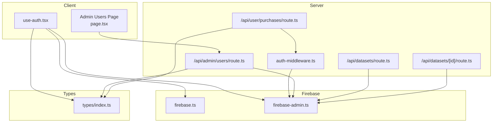
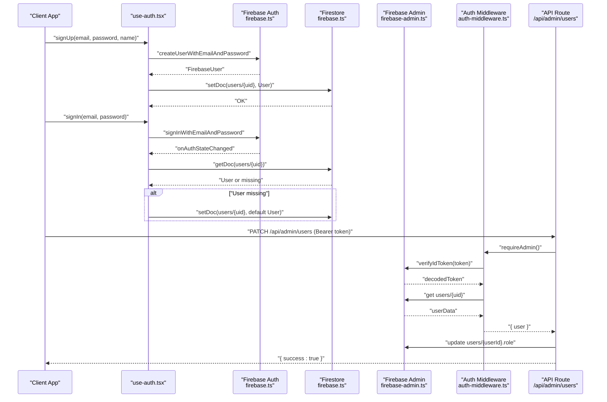
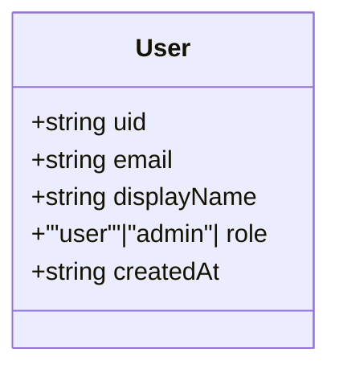
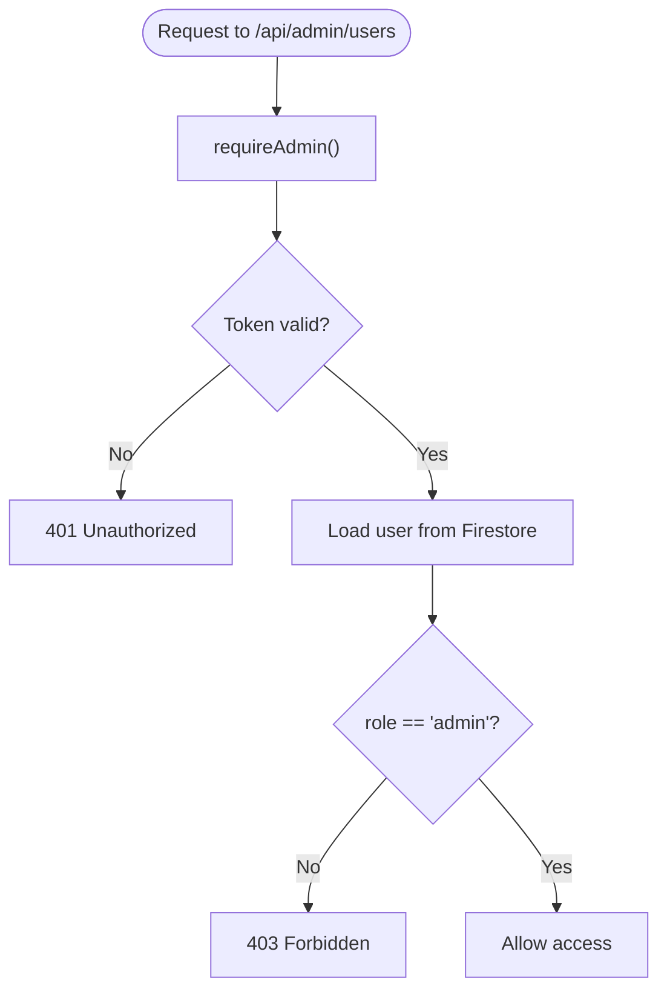
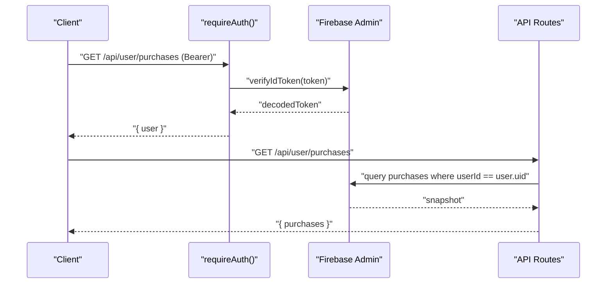
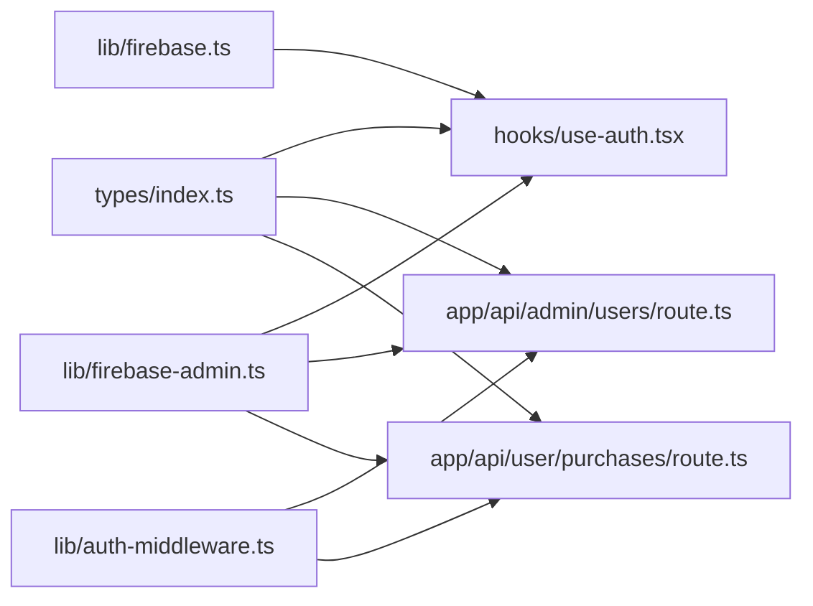

# User Model

<cite>
**Referenced Files in This Document**
- [index.ts](file://src/types/index.ts)
- [firebase.ts](file://src/lib/firebase.ts)
- [firebase-admin.ts](file://src/lib/firebase-admin.ts)
- [use-auth.tsx](file://src/hooks/use-auth.tsx)
- [auth-middleware.ts](file://src/lib/auth-middleware.ts)
- [route.ts](file://src/app/api/admin/users/route.ts)
- [page.tsx](file://src/app/admin/users/page.tsx)
- [route.ts](file://src/app/api/user/purchases/route.ts)
- [route.ts](file://src/app/api/datasets/route.ts)
- [route.ts](file://src/app/api/datasets/[id]/route.ts)
</cite>

## Table of Contents
1. [Introduction](#introduction)
2. [Project Structure](#project-structure)
3. [Core Components](#core-components)
4. [Architecture Overview](#architecture-overview)
5. [Detailed Component Analysis](#detailed-component-analysis)
6. [Dependency Analysis](#dependency-analysis)
7. [Performance Considerations](#performance-considerations)
8. [Troubleshooting Guide](#troubleshooting-guide)
9. [Conclusion](#conclusion)

## Introduction
This document describes the User data model interface and its integration with Firebase Authentication and Firestore. It explains the User entity’s properties, role-based access control (RBAC), authentication flow, synchronization between Firebase Authentication and Firestore, validation rules, and practical examples for creating users, assigning roles, and updating profiles. It also documents the relationship between User entities and related system components such as purchases and datasets.

## Project Structure
The User model and its ecosystem span TypeScript types, client-side authentication hooks, server-side Firebase Admin utilities, and API routes that enforce RBAC.

**Diagram sources**
- [use-auth.tsx:1-117](file://src/hooks/use-auth.tsx#L1-L117)
- [page.tsx:1-178](file://src/app/admin/users/page.tsx#L1-L178)
- [auth-middleware.ts:1-48](file://src/lib/auth-middleware.ts#L1-L48)
- [route.ts:1-54](file://src/app/api/admin/users/route.ts#L1-L54)
- [route.ts:1-31](file://src/app/api/user/purchases/route.ts#L1-L31)
- [route.ts:1-62](file://src/app/api/datasets/route.ts#L1-L62)
- [route.ts:1-29](file://src/app/api/datasets/[id]/route.ts#L1-L29)
- [firebase.ts:1-22](file://src/lib/firebase.ts#L1-L22)
- [firebase-admin.ts:1-50](file://src/lib/firebase-admin.ts#L1-L50)
- [index.ts:1-90](file://src/types/index.ts#L1-L90)

**Section sources**
- [index.ts:1-90](file://src/types/index.ts#L1-L90)
- [firebase.ts:1-22](file://src/lib/firebase.ts#L1-L22)
- [firebase-admin.ts:1-50](file://src/lib/firebase-admin.ts#L1-L50)
- [use-auth.tsx:1-117](file://src/hooks/use-auth.tsx#L1-L117)
- [auth-middleware.ts:1-48](file://src/lib/auth-middleware.ts#L1-L48)
- [route.ts:1-54](file://src/app/api/admin/users/route.ts#L1-L54)
- [page.tsx:1-178](file://src/app/admin/users/page.tsx#L1-L178)
- [route.ts:1-31](file://src/app/api/user/purchases/route.ts#L1-L31)
- [route.ts:1-62](file://src/app/api/datasets/route.ts#L1-L62)
- [route.ts:1-29](file://src/app/api/datasets/[id]/route.ts#L1-L29)

## Core Components
- User interface definition: uid, email, displayName, role, createdAt.
- Client authentication lifecycle: sign up, sign in, profile synchronization, and token retrieval.
- Role-based access control: admin-only endpoints and UI guards.
- Synchronization between Firebase Authentication and Firestore user profiles.
- Validation rules: email format via Firebase Auth, role enumeration, timestamp formatting.

**Section sources**
- [index.ts:3-9](file://src/types/index.ts#L3-L9)
- [use-auth.tsx:39-67](file://src/hooks/use-auth.tsx#L39-L67)
- [use-auth.tsx:69-82](file://src/hooks/use-auth.tsx#L69-L82)
- [auth-middleware.ts:30-47](file://src/lib/auth-middleware.ts#L30-L47)
- [route.ts:39-43](file://src/app/api/admin/users/route.ts#L39-L43)

## Architecture Overview
The User model integrates three layers:
- Client: React hooks manage authentication state and synchronize with Firestore.
- Server: Firebase Admin SDK verifies tokens and enforces RBAC against Firestore.
- Data: Firestore stores user profiles with role and timestamps; API routes expose read/write operations.

**Diagram sources**
- [use-auth.tsx:69-82](file://src/hooks/use-auth.tsx#L69-L82)
- [use-auth.tsx:39-67](file://src/hooks/use-auth.tsx#L39-L67)
- [firebase.ts:18-21](file://src/lib/firebase.ts#L18-L21)
- [firebase-admin.ts:30-49](file://src/lib/firebase-admin.ts#L30-L49)
- [auth-middleware.ts:19-28](file://src/lib/auth-middleware.ts#L19-L28)
- [auth-middleware.ts:30-47](file://src/lib/auth-middleware.ts#L30-L47)
- [route.ts:31-53](file://src/app/api/admin/users/route.ts#L31-L53)

## Detailed Component Analysis

### User Data Model
- Properties:
  - uid: string (unique identifier)
  - email: string (authentication credential)
  - displayName: string? (optional user-friendly name)
  - role: "user" | "admin" (enumeration)
  - createdAt: string (ISO 8601 timestamp)
- Validation rules:
  - Email format: enforced by Firebase Authentication during sign-up/sign-in.
  - Role enumeration: restricted to "user" or "admin".
  - Timestamp formatting: ISO 8601 string generated by client-side new Date().toISOString().

**Diagram sources**
- [index.ts:3-9](file://src/types/index.ts#L3-L9)

**Section sources**
- [index.ts:3-9](file://src/types/index.ts#L3-L9)

### Authentication Flow and Profile Synchronization
- Sign-up:
  - Client creates a Firebase user and sets displayName.
  - Client writes a Firestore document under users/{uid} with default role "user" and createdAt timestamp.
- Sign-in:
  - Client subscribes to onAuthStateChanged.
  - On login, client fetches users/{uid}; if missing, creates a default profile.
- Token retrieval:
  - Client requests an ID token from Firebase Auth for protected API calls.

```mermaid
sequenceDiagram
participant C as "Client"
participant H as "use-auth.tsx"
participant FA as "Firebase Auth"
participant FD as "Firestore"
C->>H : "signUp(email, password, name)"
H->>FA : "createUserWithEmailAndPassword"
FA-->>H : "FirebaseUser"
H->>FD : "setDoc(users/{uid}, User)"
FD-->>H : "OK"
C->>H : "signIn(email, password)"
H->>FA : "signInWithEmailAndPassword"
FA-->>H : "onAuthStateChanged"
H->>FD : "getDoc(users/{uid})"
FD-->>H : "User or missing"
alt "Missing"
H->>FD : "setDoc(users/{uid}, default User)"
end
```

**Diagram sources**
- [use-auth.tsx:69-82](file://src/hooks/use-auth.tsx#L69-L82)
- [use-auth.tsx:39-67](file://src/hooks/use-auth.tsx#L39-L67)

**Section sources**
- [use-auth.tsx:39-67](file://src/hooks/use-auth.tsx#L39-L67)
- [use-auth.tsx:69-82](file://src/hooks/use-auth.tsx#L69-L82)

### Role-Based Access Control (RBAC)
- Admin-only endpoints:
  - GET /api/admin/users lists users ordered by createdAt.
  - PATCH /api/admin/users updates a user’s role ("user" or "admin").
- Middleware enforcement:
  - requireAdmin verifies the bearer token and checks Firestore for role == "admin".
- Client-side guard:
  - Admin users page redirects non-admins to home and fetches user list using a Bearer token.

**Diagram sources**
- [auth-middleware.ts:19-28](file://src/lib/auth-middleware.ts#L19-L28)
- [auth-middleware.ts:30-47](file://src/lib/auth-middleware.ts#L30-L47)
- [route.ts:5-29](file://src/app/api/admin/users/route.ts#L5-L29)
- [page.tsx:36-40](file://src/app/admin/users/page.tsx#L36-L40)

**Section sources**
- [auth-middleware.ts:19-28](file://src/lib/auth-middleware.ts#L19-L28)
- [auth-middleware.ts:30-47](file://src/lib/auth-middleware.ts#L30-L47)
- [route.ts:5-29](file://src/app/api/admin/users/route.ts#L5-L29)
- [page.tsx:36-40](file://src/app/admin/users/page.tsx#L36-L40)

### User-Related Purchases and Datasets
- Purchases:
  - GET /api/user/purchases returns purchases linked to the authenticated user via userId.
- Datasets:
  - GET /api/datasets lists datasets with optional filters and ordering by createdAt.
  - GET /api/datasets/[id] retrieves a single dataset by ID.

**Diagram sources**
- [auth-middleware.ts:4-17](file://src/lib/auth-middleware.ts#L4-L17)
- [route.ts:1-31](file://src/app/api/user/purchases/route.ts#L1-L31)
- [route.ts:1-62](file://src/app/api/datasets/route.ts#L1-L62)
- [route.ts:1-29](file://src/app/api/datasets/[id]/route.ts#L1-L29)

**Section sources**
- [route.ts:1-31](file://src/app/api/user/purchases/route.ts#L1-L31)
- [route.ts:1-62](file://src/app/api/datasets/route.ts#L1-L62)
- [route.ts:1-29](file://src/app/api/datasets/[id]/route.ts#L1-L29)

### Examples

- Example: User creation
  - Steps: sign up with email/password, set displayName, write Firestore profile with role "user" and createdAt timestamp.
  - References:
    - [use-auth.tsx:69-82](file://src/hooks/use-auth.tsx#L69-L82)

- Example: Role assignment
  - Steps: admin endpoint PATCH /api/admin/users updates role to "admin" or "user".
  - References:
    - [route.ts:31-53](file://src/app/api/admin/users/route.ts#L31-L53)
    - [auth-middleware.ts:30-47](file://src/lib/auth-middleware.ts#L30-L47)

- Example: Profile updates
  - Steps: displayName updated via Firebase Auth; Firestore profile synchronized on auth state change.
  - References:
    - [use-auth.tsx:39-67](file://src/hooks/use-auth.tsx#L39-L67)

- Example: Listing purchases
  - Steps: authenticated GET /api/user/purchases returns purchases for the current user.
  - References:
    - [route.ts:1-31](file://src/app/api/user/purchases/route.ts#L1-L31)

- Example: Dataset queries
  - Steps: GET /api/datasets filters by category/country/featured and orders by createdAt; GET /api/datasets/[id] fetches details.
  - References:
    - [route.ts:1-62](file://src/app/api/datasets/route.ts#L1-L62)
    - [route.ts:1-29](file://src/app/api/datasets/[id]/route.ts#L1-L29)

## Dependency Analysis
- Client depends on:
  - Firebase client SDK for auth/db/storage.
  - Firebase Admin SDK proxy for server-side operations.
  - Local User type for typing.
- Server depends on:
  - Firebase Admin SDK for ID token verification and Firestore reads/writes.
  - Auth middleware to enforce RBAC.
- No circular dependencies observed among the analyzed files.

**Diagram sources**
- [index.ts:1-90](file://src/types/index.ts#L1-L90)
- [firebase.ts:1-22](file://src/lib/firebase.ts#L1-L22)
- [firebase-admin.ts:1-50](file://src/lib/firebase-admin.ts#L1-L50)
- [use-auth.tsx:1-117](file://src/hooks/use-auth.tsx#L1-L117)
- [auth-middleware.ts:1-48](file://src/lib/auth-middleware.ts#L1-L48)
- [route.ts:1-54](file://src/app/api/admin/users/route.ts#L1-L54)
- [route.ts:1-31](file://src/app/api/user/purchases/route.ts#L1-L31)

**Section sources**
- [index.ts:1-90](file://src/types/index.ts#L1-L90)
- [firebase.ts:1-22](file://src/lib/firebase.ts#L1-L22)
- [firebase-admin.ts:1-50](file://src/lib/firebase-admin.ts#L1-L50)
- [use-auth.tsx:1-117](file://src/hooks/use-auth.tsx#L1-L117)
- [auth-middleware.ts:1-48](file://src/lib/auth-middleware.ts#L1-L48)
- [route.ts:1-54](file://src/app/api/admin/users/route.ts#L1-L54)
- [route.ts:1-31](file://src/app/api/user/purchases/route.ts#L1-L31)

## Performance Considerations
- Minimize redundant Firestore writes by checking existence before creating user profiles.
- Use server-side ordering and limits for dataset listings to reduce payload sizes.
- Cache frequently accessed user metadata on the client only for short-lived sessions.

## Troubleshooting Guide
- Unauthorized (401):
  - Ensure the request includes a valid Bearer token obtained from getIdToken().
  - Reference: [auth-middleware.ts:4-17](file://src/lib/auth-middleware.ts#L4-L17)
- Forbidden (403):
  - Confirm the user’s role is "admin" in Firestore; admin endpoints require elevated privileges.
  - Reference: [auth-middleware.ts:30-47](file://src/lib/auth-middleware.ts#L30-L47)
- User not found in Firestore:
  - onAuthStateChanged creates a default profile if missing; verify uid correctness.
  - Reference: [use-auth.tsx:39-67](file://src/hooks/use-auth.tsx#L39-L67)
- Role update fails:
  - Validate request payload includes userId and role with allowed values ("user" or "admin").
  - Reference: [route.ts:39-43](file://src/app/api/admin/users/route.ts#L39-L43)

**Section sources**
- [auth-middleware.ts:4-17](file://src/lib/auth-middleware.ts#L4-L17)
- [auth-middleware.ts:30-47](file://src/lib/auth-middleware.ts#L30-L47)
- [use-auth.tsx:39-67](file://src/hooks/use-auth.tsx#L39-L67)
- [route.ts:39-43](file://src/app/api/admin/users/route.ts#L39-L43)

## Conclusion
The User model is a minimal, strongly-typed interface that integrates tightly with Firebase Authentication and Firestore. The RBAC system ensures admin-only access to sensitive operations, while the client hook synchronizes user profiles automatically. Validation is enforced at the boundaries: email format via Firebase Auth, role enumeration via API routes, and timestamp formatting via ISO 8601 strings. The documented flows and examples provide a clear blueprint for creating users, managing roles, and linking user data to purchases and datasets.