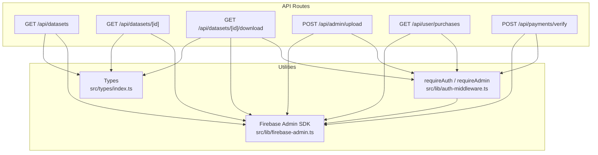
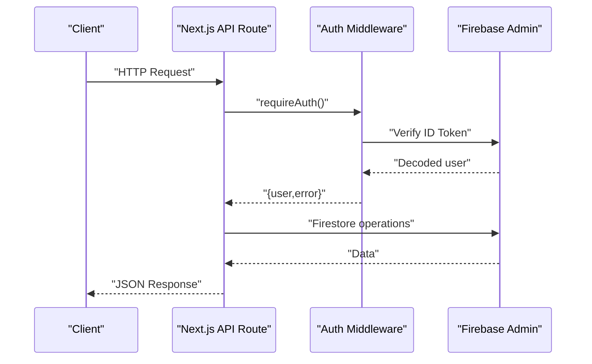
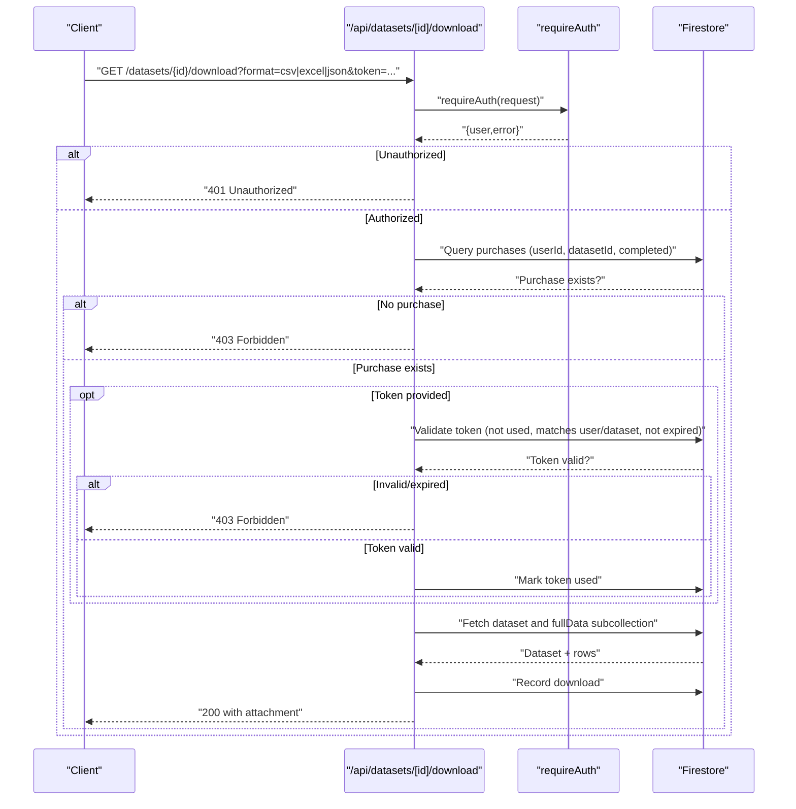
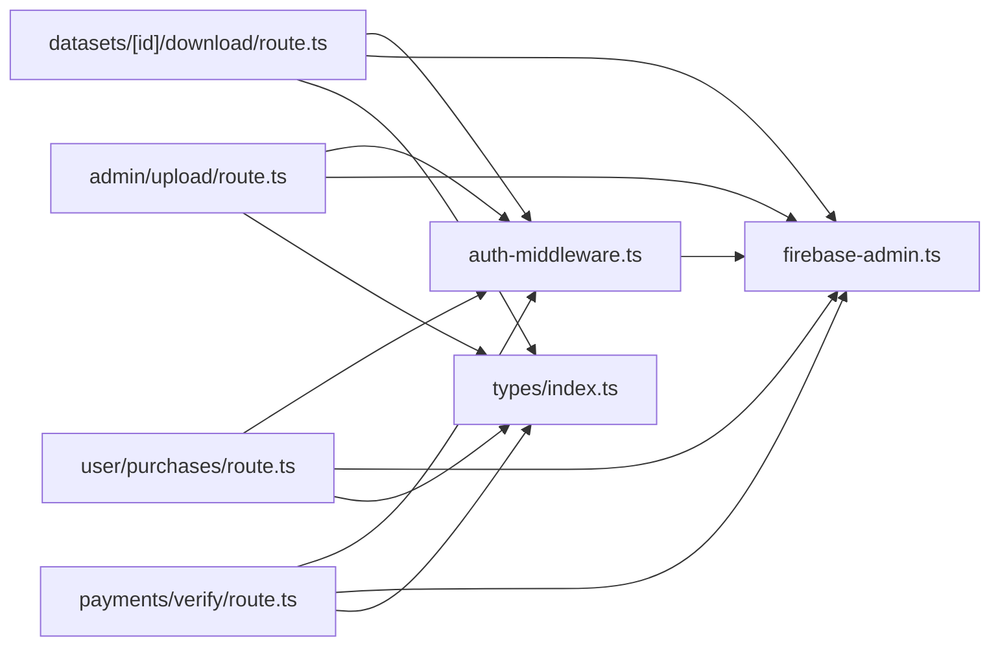

# Dataset API Operations

<cite>
**Referenced Files in This Document**
- [src/app/api/datasets/route.ts](file://src/app/api/datasets/route.ts)
- [src/app/api/datasets/[id]/route.ts](file://src/app/api/datasets/[id]/route.ts)
- [src/app/api/datasets/[id]/download/route.ts](file://src/app/api/datasets/[id]/download/route.ts)
- [src/lib/auth-middleware.ts](file://src/lib/auth-middleware.ts)
- [src/lib/firebase-admin.ts](file://src/lib/firebase-admin.ts)
- [src/types/index.ts](file://src/types/index.ts)
- [src/app/api/admin/upload/route.ts](file://src/app/api/admin/upload/route.ts)
- [src/app/api/user/purchases/route.ts](file://src/app/api/user/purchases/route.ts)
- [src/app/api/payments/verify/route.ts](file://src/app/api/payments/verify/route.ts)
- [package.json](file://package.json)
</cite>

## Table of Contents
1. [Introduction](#introduction)
2. [Project Structure](#project-structure)
3. [Core Components](#core-components)
4. [Architecture Overview](#architecture-overview)
5. [Detailed Component Analysis](#detailed-component-analysis)
6. [Dependency Analysis](#dependency-analysis)
7. [Performance Considerations](#performance-considerations)
8. [Troubleshooting Guide](#troubleshooting-guide)
9. [Conclusion](#conclusion)

## Introduction
This document provides comprehensive API documentation for dataset management endpoints. It covers listing/filtering datasets, retrieving individual datasets, downloading dataset data with authentication and token validation, and outlines missing administrative creation endpoints. It also documents request/response schemas, query parameters, pagination, sorting, authentication and authorization, role-based access control, error handling, status codes, and practical performance considerations.

## Project Structure
The dataset APIs are implemented as Next.js App Router API routes under src/app/api/datasets/. Supporting utilities include authentication middleware, Firebase Admin integration, and TypeScript type definitions.

**Diagram sources**
- [src/app/api/datasets/route.ts:1-62](file://src/app/api/datasets/route.ts#L1-L62)
- [src/app/api/datasets/[id]/route.ts](file://src/app/api/datasets/[id]/route.ts#L1-L29)
- [src/app/api/datasets/[id]/download/route.ts](file://src/app/api/datasets/[id]/download/route.ts#L1-L148)
- [src/app/api/admin/upload/route.ts:1-93](file://src/app/api/admin/upload/route.ts#L1-L93)
- [src/app/api/user/purchases/route.ts:1-31](file://src/app/api/user/purchases/route.ts#L1-L31)
- [src/app/api/payments/verify/route.ts:86-134](file://src/app/api/payments/verify/route.ts#L86-L134)
- [src/lib/auth-middleware.ts:1-48](file://src/lib/auth-middleware.ts#L1-L48)
- [src/lib/firebase-admin.ts:1-50](file://src/lib/firebase-admin.ts#L1-L50)
- [src/types/index.ts:1-90](file://src/types/index.ts#L1-L90)

**Section sources**
- [src/app/api/datasets/route.ts:1-62](file://src/app/api/datasets/route.ts#L1-L62)
- [src/app/api/datasets/[id]/route.ts](file://src/app/api/datasets/[id]/route.ts#L1-L29)
- [src/app/api/datasets/[id]/download/route.ts](file://src/app/api/datasets/[id]/download/route.ts#L1-L148)
- [src/lib/auth-middleware.ts:1-48](file://src/lib/auth-middleware.ts#L1-L48)
- [src/lib/firebase-admin.ts:1-50](file://src/lib/firebase-admin.ts#L1-L50)
- [src/types/index.ts:1-90](file://src/types/index.ts#L1-L90)

## Core Components
- Datasets listing and filtering: GET /api/datasets
- Single dataset retrieval: GET /api/datasets/[id]
- Dataset download with authentication and optional token validation: GET /api/datasets/[id]/download
- Administrative dataset upload (POST): POST /api/admin/upload
- User purchases listing: GET /api/user/purchases
- Payment verification and download token generation: POST /api/payments/verify

Key data model: Dataset interface defines fields such as title, description, category, country, price, currency, recordCount, columns, previewData, fileUrl, featured, rating, ratingCount, and timestamps.

**Section sources**
- [src/app/api/datasets/route.ts:1-62](file://src/app/api/datasets/route.ts#L1-L62)
- [src/app/api/datasets/[id]/route.ts](file://src/app/api/datasets/[id]/route.ts#L1-L29)
- [src/app/api/datasets/[id]/download/route.ts](file://src/app/api/datasets/[id]/download/route.ts#L1-L148)
- [src/app/api/admin/upload/route.ts:1-93](file://src/app/api/admin/upload/route.ts#L1-L93)
- [src/app/api/user/purchases/route.ts:1-31](file://src/app/api/user/purchases/route.ts#L1-L31)
- [src/app/api/payments/verify/route.ts:86-134](file://src/app/api/payments/verify/route.ts#L86-L134)
- [src/types/index.ts:11-28](file://src/types/index.ts#L11-L28)

## Architecture Overview
The dataset APIs rely on Firebase Firestore for persistence and Firebase Admin for server-side operations. Authentication is enforced via Bearer tokens verified against Firebase Auth. Administrative actions require admin role checks against Firestore user records.

**Diagram sources**
- [src/app/api/datasets/[id]/download/route.ts](file://src/app/api/datasets/[id]/download/route.ts#L18-L20)
- [src/lib/auth-middleware.ts:19-28](file://src/lib/auth-middleware.ts#L19-L28)
- [src/lib/firebase-admin.ts:30-42](file://src/lib/firebase-admin.ts#L30-L42)

## Detailed Component Analysis

### Datasets Listing Endpoint
- Method and Path: GET /api/datasets
- Purpose: List datasets with optional filtering, client-side search, and price range filtering.
- Query Parameters:
  - category: string (filter by category)
  - country: string (filter by country)
  - search: string (client-side substring match on title or description)
  - minPrice: number (client-side filter)
  - maxPrice: number (client-side filter)
  - featured: boolean string ("true" to filter featured)
  - limit: number (default 50)
- Sorting: Descending by createdAt (server-side)
- Pagination: Not supported; limit controls server-side fetch size.
- Response Schema:
  - datasets: array of Dataset objects
- Example Request:
  - GET /api/datasets?category=Business&country=Nigeria&featured=true&limit=20
- Example Response:
  - {
      "datasets": [
        {
          "id": "string",
          "title": "string",
          "description": "string",
          "category": "Business|Leads|Real Estate|Jobs|E-commerce|Finance|Health|Education",
          "country": "string",
          "price": number,
          "currency": "string",
          "recordCount": number,
          "columns": ["string"],
          "previewData": [{"string": string|number}],
          "fileUrl": "string",
          "featured": boolean,
          "rating": number,
          "ratingCount": number,
          "updatedAt": "string (ISO)",
          "createdAt": "string (ISO)"
        }
      ]
    }

**Section sources**
- [src/app/api/datasets/route.ts:5-61](file://src/app/api/datasets/route.ts#L5-L61)
- [src/types/index.ts:11-28](file://src/types/index.ts#L11-L28)

### Individual Dataset Endpoint
- Method and Path: GET /api/datasets/[id]
- Purpose: Retrieve a single dataset by ID.
- Path Parameter:
  - id: string (dataset identifier)
- Response Schema:
  - dataset: Dataset object
- Status Codes:
  - 200 OK: Success
  - 404 Not Found: Dataset does not exist
  - 500 Internal Server Error: Server failure
- Example Request:
  - GET /api/datasets/abc123
- Example Response:
  - {
      "dataset": {
        "id": "abc123",
        "title": "string",
        "description": "string",
        "category": "Business",
        "country": "Nigeria",
        "price": 1000,
        "currency": "XOF",
        "recordCount": 1000,
        "columns": ["col1", "col2"],
        "previewData": [...],
        "fileUrl": "",
        "featured": true,
        "rating": 0,
        "ratingCount": 0,
        "updatedAt": "2025-01-01T00:00:00Z",
        "createdAt": "2025-01-01T00:00:00Z"
      }
    }

**Section sources**
- [src/app/api/datasets/[id]/route.ts](file://src/app/api/datasets/[id]/route.ts#L5-L28)
- [src/types/index.ts:11-28](file://src/types/index.ts#L11-L28)

### Dataset Download Endpoint
- Method and Path: GET /api/datasets/[id]/download
- Purpose: Stream dataset data in requested format after authentication and authorization checks.
- Path Parameter:
  - id: string (dataset identifier)
- Query Parameters:
  - format: csv|excel|json (default: csv)
  - token: string (optional download token)
- Authentication:
  - Bearer token required; verified via Firebase Admin.
- Authorization:
  - Must have a completed purchase record for the dataset (purchases collection).
  - Optional token validation: if token provided, must exist, not used, belong to the user, match dataset, and not be expired.
- Response:
  - 200 OK with attachment headers for the selected format.
  - Supported formats:
    - json: application/json
    - excel: application/vnd.openxmlformats-officedocument.spreadsheetml.sheet
    - csv: text/csv (default)
- Behavior:
  - Reads dataset full data from datasetId/fullData subcollection ordered by rowIndex.
  - Falls back to dataset.previewData if fullData subcollection is empty.
  - Records a download event in the downloads collection.
- Status Codes:
  - 200 OK: Success
  - 400 Bad Request: CSV parsing errors (when applicable)
  - 401 Unauthorized: Missing or invalid Bearer token
  - 403 Forbidden: Not purchased or invalid/expired token
  - 404 Not Found: Dataset not found
  - 500 Internal Server Error: Server failure

**Diagram sources**
- [src/app/api/datasets/[id]/download/route.ts](file://src/app/api/datasets/[id]/download/route.ts#L7-L147)
- [src/lib/auth-middleware.ts:19-28](file://src/lib/auth-middleware.ts#L19-L28)
- [src/lib/firebase-admin.ts:30-42](file://src/lib/firebase-admin.ts#L30-L42)

**Section sources**
- [src/app/api/datasets/[id]/download/route.ts](file://src/app/api/datasets/[id]/download/route.ts#L7-L147)
- [src/lib/auth-middleware.ts:1-48](file://src/lib/auth-middleware.ts#L1-L48)
- [src/lib/firebase-admin.ts:1-50](file://src/lib/firebase-admin.ts#L1-L50)
- [src/types/index.ts:11-28](file://src/types/index.ts#L11-L28)

### Administrative Dataset Upload Endpoint
- Method and Path: POST /api/admin/upload
- Purpose: Create a new dataset and persist full data in batches to a subcollection.
- Authentication:
  - Requires admin role via requireAdmin middleware.
- Form Fields:
  - file: File (CSV)
  - title: string
  - description: string
  - category: string
  - country: string
  - price: number
  - currency: string (default: XOF)
  - previewRows: number (default: 10)
  - featured: boolean string ("true" to mark featured)
- Processing:
  - Parses CSV with Papa Parse.
  - Creates dataset document with metadata.
  - Stores full data rows in datasetId/fullData subcollection in batches.
- Response Schema:
  - success: boolean
  - datasetId: string
  - recordCount: number
  - columns: string[]
- Status Codes:
  - 200 OK: Success
  - 400 Bad Request: Missing fields or CSV parsing errors
  - 401 Unauthorized: Missing/invalid Bearer token
  - 403 Forbidden: Not admin
  - 500 Internal Server Error: Server failure

**Section sources**
- [src/app/api/admin/upload/route.ts:6-92](file://src/app/api/admin/upload/route.ts#L6-L92)
- [src/lib/auth-middleware.ts:30-47](file://src/lib/auth-middleware.ts#L30-L47)

### User Purchases Endpoint
- Method and Path: GET /api/user/purchases
- Purpose: List current user’s purchases, ordered by creation date descending.
- Authentication:
  - Bearer token required.
- Response Schema:
  - purchases: array of Purchase objects
- Status Codes:
  - 200 OK: Success
  - 401 Unauthorized: Missing/invalid Bearer token
  - 500 Internal Server Error: Server failure

**Section sources**
- [src/app/api/user/purchases/route.ts:5-30](file://src/app/api/user/purchases/route.ts#L5-L30)
- [src/types/index.ts:30-41](file://src/types/index.ts#L30-L41)

### Payment Verification and Download Token Generation
- Method and Path: POST /api/payments/verify
- Purpose: Verify payment and create a purchase record; generate a 24-hour download token.
- Authentication:
  - Bearer token required.
- Request Body Fields:
  - transactionId: string
  - datasetId: string
  - paymentMethod: "kkiapay"|"stripe"
- Response Schema:
  - success: boolean
  - purchaseId: string
  - downloadToken: string
- Status Codes:
  - 200 OK: Success
  - 400 Bad Request: Verification failed or missing fields
  - 401 Unauthorized: Missing/invalid Bearer token
  - 500 Internal Server Error: Server failure

**Section sources**
- [src/app/api/payments/verify/route.ts:86-134](file://src/app/api/payments/verify/route.ts#L86-L134)

## Dependency Analysis
- Authentication and Authorization:
  - requireAuth verifies Bearer tokens via Firebase Admin Auth.
  - requireAdmin additionally checks Firestore users collection for role=admin.
- Data Access:
  - adminDb provides Firestore access for datasets, purchases, downloadTokens, downloads, and users collections.
- External Libraries:
  - Papa Parse for CSV parsing.
  - SheetJS (xlsx) for Excel export.
  - UUID for generating download tokens.

**Diagram sources**
- [src/lib/auth-middleware.ts:1-48](file://src/lib/auth-middleware.ts#L1-L48)
- [src/lib/firebase-admin.ts:1-50](file://src/lib/firebase-admin.ts#L1-L50)
- [src/app/api/datasets/[id]/download/route.ts](file://src/app/api/datasets/[id]/download/route.ts#L1-L148)
- [src/app/api/admin/upload/route.ts:1-93](file://src/app/api/admin/upload/route.ts#L1-L93)
- [src/app/api/user/purchases/route.ts:1-31](file://src/app/api/user/purchases/route.ts#L1-L31)
- [src/app/api/payments/verify/route.ts:86-134](file://src/app/api/payments/verify/route.ts#L86-L134)
- [src/types/index.ts:1-90](file://src/types/index.ts#L1-L90)

**Section sources**
- [src/lib/auth-middleware.ts:1-48](file://src/lib/auth-middleware.ts#L1-L48)
- [src/lib/firebase-admin.ts:1-50](file://src/lib/firebase-admin.ts#L1-L50)
- [package.json:31-37](file://package.json#L31-L37)

## Performance Considerations
- Filtering and Search:
  - Server-side filtering supports category, country, and featured flags; additional client-side filtering is applied for search and price range. Consider adding composite indexes in Firestore for frequent queries to reduce cost and latency.
- Pagination:
  - The listing endpoint uses a limit parameter but does not implement cursor-based pagination. For large datasets, consider implementing pagination tokens to avoid deep paging.
- Sorting:
  - Datasets are sorted by createdAt descending. Ensure appropriate indexes exist for optimal performance.
- Batch Writes:
  - Full dataset rows are written in batches to the fullData subcollection. This reduces write pressure and improves reliability for large uploads.
- Download Streaming:
  - Downloads stream data directly from Firestore. For very large datasets, consider pre-generating compressed archives and storing URLs to minimize on-the-fly transformations.
- Caching:
  - Consider caching frequently accessed dataset metadata (e.g., previewData) in memory or CDN for read-heavy workloads.
- Rate Limiting:
  - There is no explicit rate limiting in the provided code. Introduce per-user or IP-based limits at the edge (e.g., Next.js middleware) or via platform controls to prevent abuse.

[No sources needed since this section provides general guidance]

## Troubleshooting Guide
- Authentication Failures:
  - 401 Unauthorized indicates missing or invalid Bearer token. Ensure clients send Authorization: Bearer <token>.
- Authorization Failures:
  - 403 Forbidden occurs when attempting to download without a completed purchase or with an invalid/expired token. Verify purchase records and token validity.
- Not Found:
  - 404 Not Found means the dataset ID does not exist or the fullData subcollection is empty and previewData is unavailable.
- CSV Parsing Errors:
  - 400 Bad Request with CSV parsing errors suggests malformed input. Validate CSV structure and headers.
- Internal Errors:
  - 500 Internal Server Error indicates server-side failures. Check logs and network connectivity to Firestore.

**Section sources**
- [src/app/api/datasets/[id]/download/route.ts](file://src/app/api/datasets/[id]/download/route.ts#L31-L67)
- [src/app/api/datasets/[id]/route.ts](file://src/app/api/datasets/[id]/route.ts#L15-L17)
- [src/app/api/admin/upload/route.ts:34-38](file://src/app/api/admin/upload/route.ts#L34-L38)

## Conclusion
The dataset API suite provides robust endpoints for listing, retrieving, and downloading datasets, along with administrative upload capabilities and user purchase management. Authentication and authorization are enforced consistently, and Firestore is used effectively for structured data storage. To enhance scalability and user experience, consider adding pagination, composite indexes, rate limiting, and pre-generated archives for large downloads.