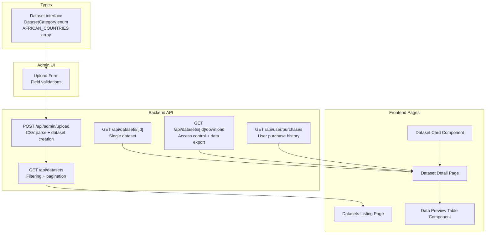
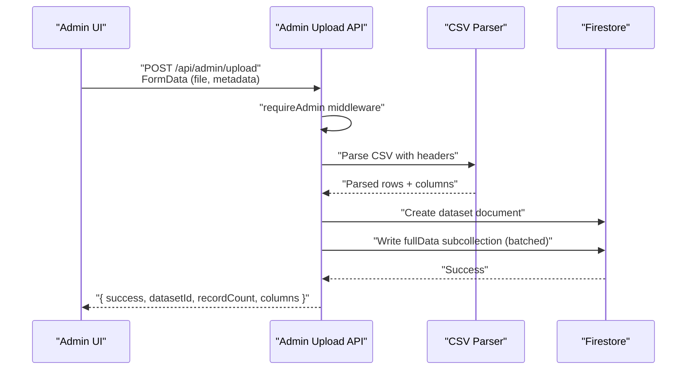
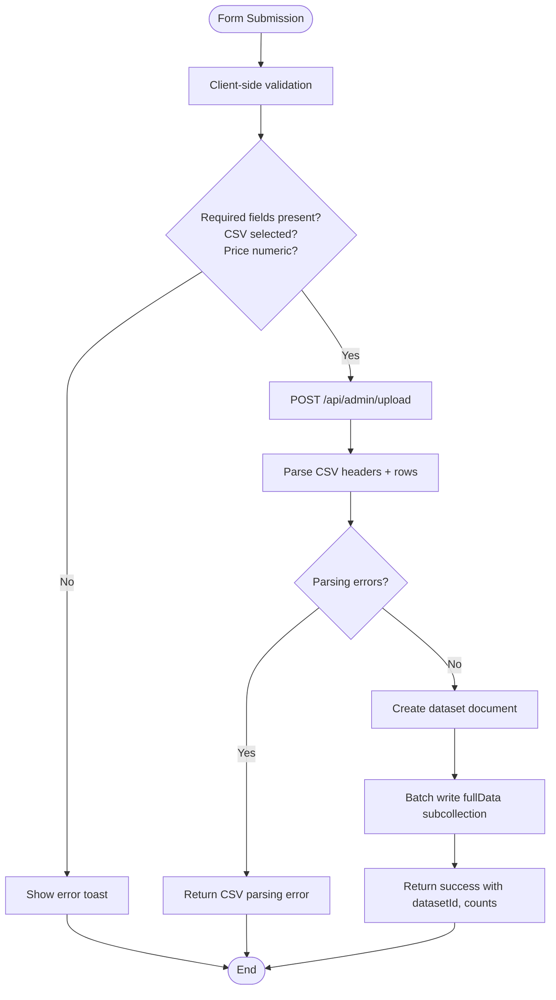
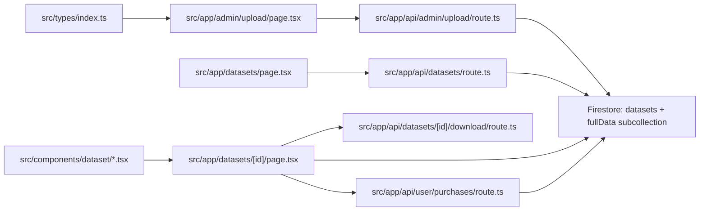

# Dataset Data Model

<cite>
**Referenced Files in This Document**
- [src/types/index.ts](file://src/types/index.ts)
- [src/app/admin/upload/page.tsx](file://src/app/admin/upload/page.tsx)
- [src/app/api/admin/upload/route.ts](file://src/app/api/admin/upload/route.ts)
- [src/app/api/datasets/route.ts](file://src/app/api/datasets/route.ts)
- [src/app/datasets/[id]/page.tsx](file://src/app/datasets/[id]/page.tsx)
- [src/app/datasets/page.tsx](file://src/app/datasets/page.tsx)
- [src/components/dataset/dataset-card.tsx](file://src/components/dataset/dataset-card.tsx)
- [src/components/dataset/data-preview-table.tsx](file://src/components/dataset/data-preview-table.tsx)
- [src/app/api/datasets/[id]/download/route.ts](file://src/app/api/datasets/[id]/download/route.ts)
- [src/app/api/user/purchases/route.ts](file://src/app/api/user/purchases/route.ts)
</cite>

## Table of Contents
1. [Introduction](#introduction)
2. [Project Structure](#project-structure)
3. [Core Components](#core-components)
4. [Architecture Overview](#architecture-overview)
5. [Detailed Component Analysis](#detailed-component-analysis)
6. [Dependency Analysis](#dependency-analysis)
7. [Performance Considerations](#performance-considerations)
8. [Troubleshooting Guide](#troubleshooting-guide)
9. [Conclusion](#conclusion)

## Introduction
This document provides comprehensive data model documentation for the Dataset entity in Datafrica. It covers all fields, data types, constraints, validation rules, enumerations, geographic filtering arrays, and relationships with Users and Purchases. It also explains business rules for dataset creation and updates, and outlines data integrity requirements enforced by the frontend and backend.

## Project Structure
The Dataset model is defined in shared TypeScript types and consumed across the frontend and backend APIs. Key locations:
- Types and enumerations: [src/types/index.ts](file://src/types/index.ts)
- Admin upload form and validation: [src/app/admin/upload/page.tsx](file://src/app/admin/upload/page.tsx)
- Backend upload pipeline: [src/app/api/admin/upload/route.ts](file://src/app/api/admin/upload/route.ts)
- Dataset listing and filtering: [src/app/api/datasets/route.ts](file://src/app/api/datasets/route.ts), [src/app/datasets/page.tsx](file://src/app/datasets/page.tsx)
- Dataset detail page and preview rendering: [src/app/datasets/[id]/page.tsx](file://src/app/datasets/[id]/page.tsx), [src/components/dataset/data-preview-table.tsx](file://src/components/dataset/data-preview-table.tsx)
- Download authorization and access control: [src/app/api/datasets/[id]/download/route.ts](file://src/app/api/datasets/[id]/download/route.ts)
- Purchase history retrieval: [src/app/api/user/purchases/route.ts](file://src/app/api/user/purchases/route.ts)



**Diagram sources**
- [src/types/index.ts:11-89](file://src/types/index.ts#L11-L89)
- [src/app/admin/upload/page.tsx:44-98](file://src/app/admin/upload/page.tsx#L44-L98)
- [src/app/api/admin/upload/route.ts:6-92](file://src/app/api/admin/upload/route.ts#L6-L92)
- [src/app/api/datasets/route.ts:5-35](file://src/app/api/datasets/route.ts#L5-L35)
- [src/app/datasets/page.tsx:36-149](file://src/app/datasets/page.tsx#L36-L149)
- [src/app/datasets/[id]/page.tsx:217-291](file://src/app/datasets/[id]/page.tsx#L217-L291)
- [src/components/dataset/dataset-card.tsx:14-80](file://src/components/dataset/dataset-card.tsx#L14-L80)
- [src/components/dataset/data-preview-table.tsx:18-75](file://src/components/dataset/data-preview-table.tsx#L18-L75)
- [src/app/api/datasets/[id]/download/route.ts:7-97](file://src/app/api/datasets/[id]/download/route.ts#L7-L97)
- [src/app/api/user/purchases/route.ts:5-31](file://src/app/api/user/purchases/route.ts#L5-L31)

**Section sources**
- [src/types/index.ts:11-89](file://src/types/index.ts#L11-L89)
- [src/app/admin/upload/page.tsx:44-98](file://src/app/admin/upload/page.tsx#L44-L98)
- [src/app/api/admin/upload/route.ts:6-92](file://src/app/api/admin/upload/route.ts#L6-L92)
- [src/app/api/datasets/route.ts:5-35](file://src/app/api/datasets/route.ts#L5-L35)
- [src/app/datasets/page.tsx:36-149](file://src/app/datasets/page.tsx#L36-L149)
- [src/app/datasets/[id]/page.tsx:217-291](file://src/app/datasets/[id]/page.tsx#L217-L291)
- [src/components/dataset/dataset-card.tsx:14-80](file://src/components/dataset/dataset-card.tsx#L14-L80)
- [src/components/dataset/data-preview-table.tsx:18-75](file://src/components/dataset/data-preview-table.tsx#L18-L75)
- [src/app/api/datasets/[id]/download/route.ts:7-97](file://src/app/api/datasets/[id]/download/route.ts#L7-L97)
- [src/app/api/user/purchases/route.ts:5-31](file://src/app/api/user/purchases/route.ts#L5-L31)

## Core Components
This section documents the Dataset data model, its fields, types, constraints, and business rules.

- Dataset interface definition
  - Fields and types:
    - id: string
    - title: string
    - description: string
    - category: DatasetCategory
    - country: string
    - price: number
    - currency: string
    - recordCount: number
    - columns: string[]
    - previewData: Record<string, string | number>[]
    - fileUrl: string
    - featured: boolean
    - rating: number
    - ratingCount: number
    - updatedAt: string (ISO date)
    - createdAt: string (ISO date)
  - Notes:
    - All timestamps are stored as ISO date strings.
    - previewData is an array of objects keyed by column names with string or number values.
    - rating and ratingCount initialize to 0 for new datasets.

- DatasetCategory enumeration
  - Supported values: Business, Leads, Real Estate, Jobs, E-commerce, Finance, Health, Education

- Geographic filtering constants
  - AFRICAN_COUNTRIES: Array of country names used for filtering and selection in the UI.
  - DATASET_CATEGORIES: Array of categories mirrored from DatasetCategory for UI selection.

- Validation rules and constraints
  - Required fields during upload:
    - CSV file presence
    - title present
    - category present and valid per DatasetCategory
    - country present and valid per AFRICAN_COUNTRIES
    - price numeric and non-negative
  - CSV parsing:
    - Requires header row
    - Skips empty lines
    - Returns parsing errors if encountered
  - Preview generation:
    - previewRows defaults to 10 if unspecified
    - Maximum previewRows configurable up to 50
  - Data integrity:
    - recordCount equals total rows parsed
    - columns derived from CSV header fields
    - previewData is the first previewRows rows
    - fullData stored in a subcollection "fullData" with rowIndex for ordering

- Business rules
  - Pricing:
    - price is a non-negative number
    - currency defaults to XOF if not provided
  - Visibility:
    - featured flag determines prominence
  - Ratings:
    - rating initialized to 0; ratingCount initialized to 0
  - Timestamps:
    - createdAt and updatedAt set to current ISO date on creation
    - updatedAt updated on subsequent operations (not shown in provided code)

- Relationships
  - Dataset ↔ User: Implicit via purchase records (Purchase.userId links to User.uid).
  - Dataset ↔ Purchase: Direct relationship via Purchase.datasetId → Dataset.id.
  - Dataset ↔ DownloadToken: Tokens scoped by datasetId and userId; tokens expire and are marked used.

**Section sources**
- [src/types/index.ts:11-89](file://src/types/index.ts#L11-L89)
- [src/app/admin/upload/page.tsx:44-98](file://src/app/admin/upload/page.tsx#L44-L98)
- [src/app/api/admin/upload/route.ts:23-63](file://src/app/api/admin/upload/route.ts#L23-L63)

## Architecture Overview
The Dataset lifecycle spans UI forms, backend uploads, Firestore persistence, and downstream consumption in listings and detail pages.



**Diagram sources**
- [src/app/admin/upload/page.tsx:77-98](file://src/app/admin/upload/page.tsx#L77-L98)
- [src/app/api/admin/upload/route.ts:6-92](file://src/app/api/admin/upload/route.ts#L6-L92)

**Section sources**
- [src/app/admin/upload/page.tsx:44-98](file://src/app/admin/upload/page.tsx#L44-L98)
- [src/app/api/admin/upload/route.ts:6-92](file://src/app/api/admin/upload/route.ts#L6-L92)

## Detailed Component Analysis

### Dataset Entity Model
```mermaid
classDiagram
class Dataset {
+string id
+string title
+string description
+DatasetCategory category
+string country
+number price
+string currency
+number recordCount
+string[] columns
+Record~string, string|number~[] previewData
+string fileUrl
+boolean featured
+number rating
+number ratingCount
+string updatedAt
+string createdAt
}
class DatasetCategory {
<<enumeration>>
"Business"
"Leads"
"Real Estate"
"Jobs"
"E-commerce"
"Finance"
"Health"
"Education"
}
class AFRICAN_COUNTRIES {
<<constant array>>
"Togo","Nigeria","Ghana","Kenya","South Africa","Senegal","Ivory Coast","Cameroon","Tanzania","Ethiopia","Rwanda","Uganda","Morocco","Egypt","DRC"
}
Dataset --> DatasetCategory : "uses"
```

**Diagram sources**
- [src/types/index.ts:11-89](file://src/types/index.ts#L11-L89)

**Section sources**
- [src/types/index.ts:11-89](file://src/types/index.ts#L11-L89)

### Upload Workflow and Validation


**Diagram sources**
- [src/app/admin/upload/page.tsx:44-98](file://src/app/admin/upload/page.tsx#L44-L98)
- [src/app/api/admin/upload/route.ts:23-84](file://src/app/api/admin/upload/route.ts#L23-L84)

**Section sources**
- [src/app/admin/upload/page.tsx:44-98](file://src/app/admin/upload/page.tsx#L44-L98)
- [src/app/api/admin/upload/route.ts:23-84](file://src/app/api/admin/upload/route.ts#L23-L84)

### Dataset Listing and Filtering
- Filtering parameters:
  - category: string (must match DatasetCategory)
  - country: string (must match AFRICAN_COUNTRIES)
  - search: string (not implemented in provided code; see note below)
  - minPrice, maxPrice: numbers (not implemented in provided code; see note below)
  - featured: "true" to filter featured datasets
  - limit: number (default 50)
- Sorting: ordered by createdAt descending, limited by limit
- Pagination: controlled by limit parameter

Notes:
- The provided backend lists search and price range filters but does not implement them in code. These should be added to enforce business rules consistently.

**Section sources**
- [src/app/api/datasets/route.ts:5-35](file://src/app/api/datasets/route.ts#L5-L35)
- [src/app/datasets/page.tsx:105-116](file://src/app/datasets/page.tsx#L105-L116)

### Dataset Detail Page and Preview Rendering
- Displays:
  - Basic info: title, description, category, country, recordCount, columns
  - Ratings: rating and ratingCount if available
  - Preview table: limited rows from previewData
- Preview rendering:
  - Limits columns to first 8 for readability
  - Shows maxRows (default 10) from previewData
  - Indicates remaining rows if dataset has more than maxRows

**Section sources**
- [src/app/datasets/[id]/page.tsx:217-291](file://src/app/datasets/[id]/page.tsx#L217-L291)
- [src/components/dataset/data-preview-table.tsx:18-75](file://src/components/dataset/data-preview-table.tsx#L18-L75)

### Download Authorization and Access Control
- Endpoint: GET /api/datasets/[id]/download?format=csv|excel|json&token=xxx
- Access control:
  - Requires authenticated user
  - Validates purchase: userId + datasetId + status == "completed"
  - Optional token validation: downloadTokens collection with matching token, datasetId, userId, unused, not expired
- Data export:
  - Reads fullData subcollection ordered by rowIndex
  - Falls back to previewData if fullData not found
  - Supports CSV, Excel, JSON formats

**Section sources**
- [src/app/api/datasets/[id]/download/route.ts:7-97](file://src/app/api/datasets/[id]/download/route.ts#L7-L97)

### Purchase History and User Relationship
- Endpoint: GET /api/user/purchases
- Retrieves all purchases for the authenticated user
- Used to:
  - Enable downloads after purchase
  - Power analytics and user dashboards

**Section sources**
- [src/app/api/user/purchases/route.ts:5-31](file://src/app/api/user/purchases/route.ts#L5-L31)

## Dependency Analysis


**Diagram sources**
- [src/types/index.ts:11-89](file://src/types/index.ts#L11-L89)
- [src/app/admin/upload/page.tsx:44-98](file://src/app/admin/upload/page.tsx#L44-L98)
- [src/app/api/admin/upload/route.ts:6-92](file://src/app/api/admin/upload/route.ts#L6-L92)
- [src/app/api/datasets/route.ts:5-35](file://src/app/api/datasets/route.ts#L5-L35)
- [src/app/datasets/page.tsx:36-149](file://src/app/datasets/page.tsx#L36-L149)
- [src/app/datasets/[id]/page.tsx:217-291](file://src/app/datasets/[id]/page.tsx#L217-L291)
- [src/app/api/datasets/[id]/download/route.ts:7-97](file://src/app/api/datasets/[id]/download/route.ts#L7-L97)
- [src/app/api/user/purchases/route.ts:5-31](file://src/app/api/user/purchases/route.ts#L5-L31)
- [src/components/dataset/dataset-card.tsx:14-80](file://src/components/dataset/dataset-card.tsx#L14-L80)
- [src/components/dataset/data-preview-table.tsx:18-75](file://src/components/dataset/data-preview-table.tsx#L18-L75)

**Section sources**
- [src/types/index.ts:11-89](file://src/types/index.ts#L11-L89)
- [src/app/admin/upload/page.tsx:44-98](file://src/app/admin/upload/page.tsx#L44-L98)
- [src/app/api/admin/upload/route.ts:6-92](file://src/app/api/admin/upload/route.ts#L6-L92)
- [src/app/api/datasets/route.ts:5-35](file://src/app/api/datasets/route.ts#L5-L35)
- [src/app/datasets/page.tsx:36-149](file://src/app/datasets/page.tsx#L36-L149)
- [src/app/datasets/[id]/page.tsx:217-291](file://src/app/datasets/[id]/page.tsx#L217-L291)
- [src/app/api/datasets/[id]/download/route.ts:7-97](file://src/app/api/datasets/[id]/download/route.ts#L7-L97)
- [src/app/api/user/purchases/route.ts:5-31](file://src/app/api/user/purchases/route.ts#L5-L31)
- [src/components/dataset/dataset-card.tsx:14-80](file://src/components/dataset/dataset-card.tsx#L14-L80)
- [src/components/dataset/data-preview-table.tsx:18-75](file://src/components/dataset/data-preview-table.tsx#L18-L75)

## Performance Considerations
- Batched writes for fullData:
  - The upload process writes dataset rows in batches of 500 to avoid Firestore write limits and improve throughput.
- Preview optimization:
  - previewData limits rows and columns for quick rendering on dataset listing/detail pages.
- Pagination:
  - Listing API supports a limit parameter to cap response size.
- CSV parsing:
  - Parsing occurs server-side; ensure CSV files are reasonably sized to prevent memory pressure.

[No sources needed since this section provides general guidance]

## Troubleshooting Guide
- Upload fails with missing fields:
  - Ensure CSV file, title, category, country, and price are provided.
  - Confirm category matches DatasetCategory and country matches AFRICAN_COUNTRIES.
- CSV parsing errors:
  - Verify CSV has a proper header row and uses commas as delimiters.
  - Check for malformed rows or encoding issues.
- Download denied:
  - Ensure you have a completed purchase for the dataset.
  - If using a token, confirm it is valid, not expired, and not already used.
- Listing filters not applied:
  - The provided backend lists search and price filters but does not implement them. Add query conditions for search and price ranges to enforce filtering consistently.

**Section sources**
- [src/app/admin/upload/page.tsx:44-98](file://src/app/admin/upload/page.tsx#L44-L98)
- [src/app/api/admin/upload/route.ts:23-39](file://src/app/api/admin/upload/route.ts#L23-L39)
- [src/app/api/datasets/[id]/download/route.ts:31-68](file://src/app/api/datasets/[id]/download/route.ts#L31-L68)
- [src/app/api/datasets/route.ts:5-35](file://src/app/api/datasets/route.ts#L5-L35)

## Conclusion
The Dataset data model in Datafrica is a well-defined interface with strong constraints around geographic filtering, category enumeration, and pricing. The upload pipeline enforces validation at both the UI and backend levels, persists structured preview data, and stores full datasets in a batched manner. Listings and detail pages leverage these fields to deliver a rich user experience, while download endpoints enforce strict access control tied to purchases and optional tokens. To maintain data integrity and enforce business rules consistently, implement the unimplemented search and price-range filters in the dataset listing API.