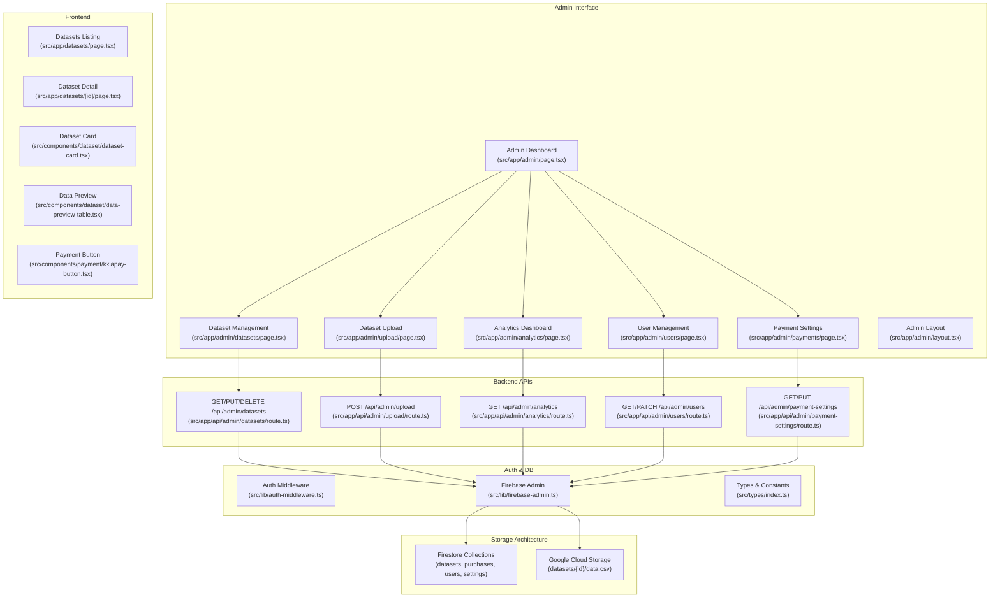
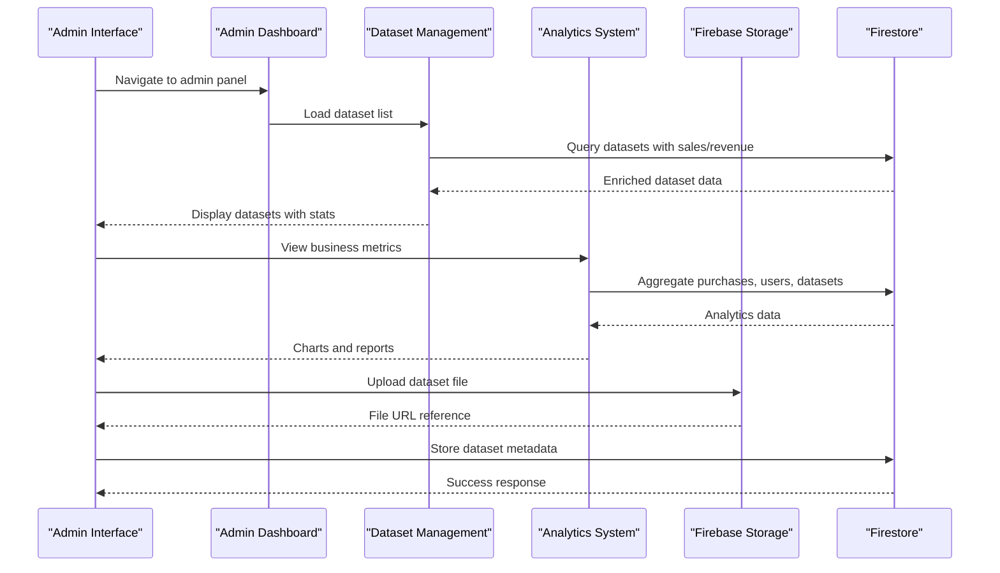
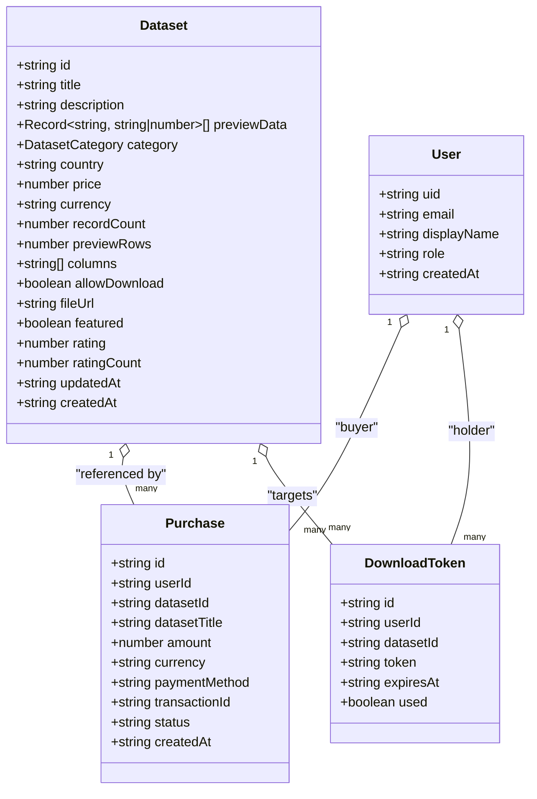
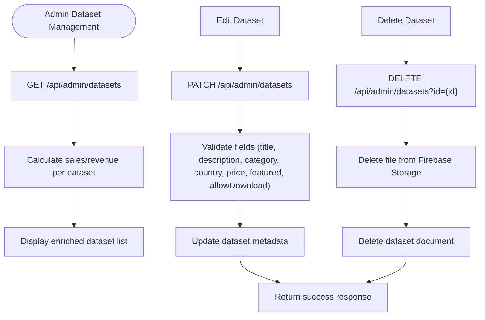
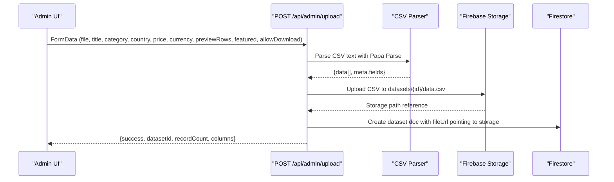
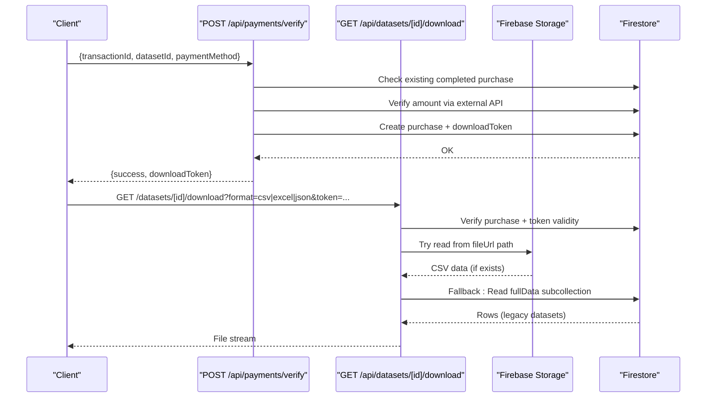
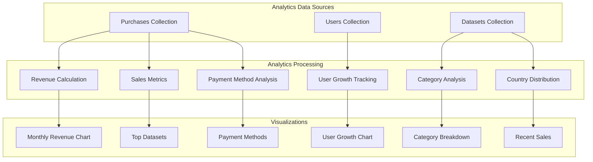
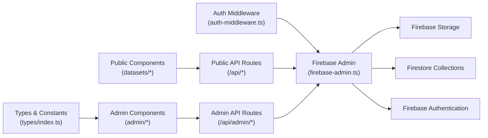

# Dataset Management

<cite>
**Referenced Files in This Document**
- [src/types/index.ts](file://src/types/index.ts)
- [src/lib/firebase-admin.ts](file://src/lib/firebase-admin.ts)
- [src/lib/auth-middleware.ts](file://src/lib/auth-middleware.ts)
- [src/hooks/use-auth.tsx](file://src/hooks/use-auth.tsx)
- [src/app/api/datasets/route.ts](file://src/app/api/datasets/route.ts)
- [src/app/api/datasets/[id]/route.ts](file://src/app/api/datasets/[id]/route.ts)
- [src/app/api/datasets/[id]/download/route.ts](file://src/app/api/datasets/[id]/download/route.ts)
- [src/app/api/admin/upload/route.ts](file://src/app/api/admin/upload/route.ts)
- [src/app/admin/upload/page.tsx](file://src/app/admin/upload/page.tsx)
- [src/app/admin/datasets/page.tsx](file://src/app/admin/datasets/page.tsx)
- [src/app/admin/analytics/page.tsx](file://src/app/admin/analytics/page.tsx)
- [src/app/admin/users/page.tsx](file://src/app/admin/users/page.tsx)
- [src/app/admin/payments/page.tsx](file://src/app/admin/payments/page.tsx)
- [src/app/admin/page.tsx](file://src/app/admin/page.tsx)
- [src/app/admin/layout.tsx](file://src/app/admin/layout.tsx)
- [src/app/datasets/page.tsx](file://src/app/datasets/page.tsx)
- [src/app/datasets/[id]/page.tsx](file://src/app/datasets/[id]/page.tsx)
- [src/components/dataset/dataset-card.tsx](file://src/components/dataset/dataset-card.tsx)
- [src/components/dataset/data-preview-table.tsx](file://src/components/dataset/data-preview-table.tsx)
- [src/components/payment/kkiapay-button.tsx](file://src/components/payment/kkiapay-button.tsx)
- [src/app/api/payments/verify/route.ts](file://src/app/api/payments/verify/route.ts)
- [src/app/api/user/purchases/route.ts](file://src/app/api/user/purchases/route.ts)
- [src/app/api/admin/datasets/route.ts](file://src/app/api/admin/datasets/route.ts)
- [src/app/api/admin/analytics/route.ts](file://src/app/api/admin/analytics/route.ts)
- [src/app/api/admin/users/route.ts](file://src/app/api/admin/users/route.ts)
- [src/app/api/admin/payment-settings/route.ts](file://src/app/api/admin/payment-settings/route.ts)
</cite>

## Update Summary
**Changes Made**
- Added comprehensive dataset management system with dedicated admin interface
- Implemented full CRUD operations for datasets including listing, editing, and deletion
- Added advanced analytics dashboard with revenue tracking, sales metrics, and performance charts
- Enhanced admin capabilities with user management, payment settings configuration, and dataset analytics
- Integrated Firebase Storage for cost-effective dataset file management
- Added featured dataset controls and access control management
- Implemented comprehensive admin routing and authentication system

## Table of Contents
1. [Introduction](#introduction)
2. [Project Structure](#project-structure)
3. [Core Components](#core-components)
4. [Architecture Overview](#architecture-overview)
5. [Detailed Component Analysis](#detailed-component-analysis)
6. [Admin Management System](#admin-management-system)
7. [Advanced Analytics](#advanced-analytics)
8. [Dependency Analysis](#dependency-analysis)
9. [Performance Considerations](#performance-considerations)
10. [Troubleshooting Guide](#troubleshooting-guide)
11. [Conclusion](#conclusion)

## Introduction
This document explains Datafrica's comprehensive dataset management system for the marketplace. The system has evolved into a full-featured administrative platform that consolidates dataset operations, user management, payment processing, and advanced analytics into a single cohesive system. It covers the dataset data model, CRUD operations, search and filtering, dataset preview and CSV/Excel/JSON export, listing and detail pages, payment and download workflow, and the powerful admin interface with analytics capabilities.

The system now features a dedicated admin panel with specialized interfaces for dataset management, user administration, payment configuration, and comprehensive business analytics. The architecture leverages Firebase for authentication, Firestore for structured data, and Firebase Storage for cost-effective file management.

## Project Structure
The dataset management functionality spans frontend pages, UI components, backend API routes, and a comprehensive admin interface. The admin system includes dedicated pages for datasets, analytics, users, payments, and upload functionality. Authentication and database access are handled via Firebase Admin and custom middleware. Advanced analytics provide revenue tracking, sales metrics, and performance insights.

**Diagram sources**
- [src/app/admin/page.tsx:39-194](file://src/app/admin/page.tsx#L39-L194)
- [src/app/admin/datasets/page.tsx:68-527](file://src/app/admin/datasets/page.tsx#L68-L527)
- [src/app/admin/upload/page.tsx:22-338](file://src/app/admin/upload/page.tsx#L22-L338)
- [src/app/admin/analytics/page.tsx:138-487](file://src/app/admin/analytics/page.tsx#L138-L487)
- [src/app/admin/users/page.tsx:44-376](file://src/app/admin/users/page.tsx#L44-L376)
- [src/app/admin/payments/page.tsx:37-434](file://src/app/admin/payments/page.tsx#L37-L434)
- [src/app/admin/layout.tsx:1-8](file://src/app/admin/layout.tsx#L1-L8)
- [src/app/api/admin/datasets/route.ts:1-150](file://src/app/api/admin/datasets/route.ts#L1-L150)
- [src/app/api/admin/upload/route.ts:1-112](file://src/app/api/admin/upload/route.ts#L1-L112)
- [src/app/api/admin/analytics/route.ts:1-228](file://src/app/api/admin/analytics/route.ts#L1-L228)
- [src/app/api/admin/users/route.ts:1-153](file://src/app/api/admin/users/route.ts#L1-L153)
- [src/app/api/admin/payment-settings/route.ts:1-120](file://src/app/api/admin/payment-settings/route.ts#L1-L120)

**Section sources**
- [src/app/admin/page.tsx:39-194](file://src/app/admin/page.tsx#L39-L194)
- [src/app/admin/datasets/page.tsx:68-527](file://src/app/admin/datasets/page.tsx#L68-L527)
- [src/app/admin/upload/page.tsx:22-338](file://src/app/admin/upload/page.tsx#L22-L338)
- [src/app/admin/analytics/page.tsx:138-487](file://src/app/admin/analytics/page.tsx#L138-L487)
- [src/app/admin/users/page.tsx:44-376](file://src/app/admin/users/page.tsx#L44-L376)
- [src/app/admin/payments/page.tsx:37-434](file://src/app/admin/payments/page.tsx#L37-L434)
- [src/app/admin/layout.tsx:1-8](file://src/app/admin/layout.tsx#L1-L8)
- [src/app/api/admin/datasets/route.ts:1-150](file://src/app/api/admin/datasets/route.ts#L1-L150)
- [src/app/api/admin/upload/route.ts:1-112](file://src/app/api/admin/upload/route.ts#L1-L112)
- [src/app/api/admin/analytics/route.ts:1-228](file://src/app/api/admin/analytics/route.ts#L1-L228)
- [src/app/api/admin/users/route.ts:1-153](file://src/app/api/admin/users/route.ts#L1-L153)
- [src/app/api/admin/payment-settings/route.ts:1-120](file://src/app/api/admin/payment-settings/route.ts#L1-L120)

## Core Components
- **Dataset Management System**: Complete CRUD operations for datasets with admin interface, featuring listing, editing, deletion, and advanced filtering capabilities.
- **Admin Analytics Dashboard**: Comprehensive business intelligence with revenue tracking, sales metrics, user growth charts, and category breakdowns.
- **User Management**: Complete user administration with role assignment, account status management, and purchase history tracking.
- **Payment Configuration**: Multi-provider payment settings management with secure credential handling and webhook configuration.
- **Dataset Data Model**: Enhanced schema with allowDownload flag, featured datasets, preview controls, and file storage management.
- **Advanced Search & Filtering**: Category, country, price range filtering with real-time search and pagination support.
- **Preview & Export System**: Configurable preview limits with CSV/Excel/JSON export capabilities and automatic fallback mechanisms.
- **Storage Architecture**: Firebase Storage integration for cost-effective dataset file management with automatic fallback to Firestore.
- **Access Control**: Granular permissions with admin-only operations and dataset access management.

**Section sources**
- [src/types/index.ts:11-31](file://src/types/index.ts#L11-L31)
- [src/app/admin/datasets/page.tsx:38-66](file://src/app/admin/datasets/page.tsx#L38-L66)
- [src/app/admin/analytics/page.tsx:23-61](file://src/app/admin/analytics/page.tsx#L23-L61)
- [src/app/admin/users/page.tsx:32-42](file://src/app/admin/users/page.tsx#L32-L42)
- [src/app/admin/payments/page.tsx:20-35](file://src/app/admin/payments/page.tsx#L20-L35)

## Architecture Overview
The system uses Next.js App Router with server actions and client components. The admin interface provides comprehensive management capabilities with dedicated endpoints for each administrative function. Backend routes are protected by authentication middleware and operate against Firestore collections. Advanced analytics provide real-time business insights with monthly trends and performance metrics. Users browse datasets, view details, pay via multiple providers, and download files after purchase verification.

**Diagram sources**
- [src/app/admin/page.tsx:39-194](file://src/app/admin/page.tsx#L39-L194)
- [src/app/admin/datasets/page.tsx:68-527](file://src/app/admin/datasets/page.tsx#L68-L527)
- [src/app/admin/analytics/page.tsx:138-487](file://src/app/admin/analytics/page.tsx#L138-L487)
- [src/app/api/admin/datasets/route.ts:1-150](file://src/app/api/admin/datasets/route.ts#L1-L150)
- [src/app/api/admin/analytics/route.ts:1-228](file://src/app/api/admin/analytics/route.ts#L1-L228)

## Detailed Component Analysis

### Dataset Data Model
The Dataset interface defines the enhanced schema stored in Firestore under the datasets collection. The model now includes comprehensive metadata for administrative control and user experience optimization.

**Diagram sources**
- [src/types/index.ts:11-31](file://src/types/index.ts#L11-L31)
- [src/types/index.ts:33-44](file://src/types/index.ts#L33-L44)
- [src/types/index.ts:65-72](file://src/types/index.ts#L65-L72)
- [src/types/index.ts:3-9](file://src/types/index.ts#L3-L9)

**Section sources**
- [src/types/index.ts:11-31](file://src/types/index.ts#L11-L31)
- [src/types/index.ts:33-44](file://src/types/index.ts#L33-L44)
- [src/types/index.ts:65-72](file://src/types/index.ts#L65-L72)

### CRUD Operations

#### Admin Dataset Management
The admin interface provides comprehensive CRUD operations for dataset management with real-time editing capabilities and bulk operations.

**Diagram sources**
- [src/app/admin/datasets/page.tsx:83-220](file://src/app/admin/datasets/page.tsx#L83-L220)
- [src/app/api/admin/datasets/route.ts:57-98](file://src/app/api/admin/datasets/route.ts#L57-L98)
- [src/app/api/admin/datasets/route.ts:100-149](file://src/app/api/admin/datasets/route.ts#L100-L149)

**Section sources**
- [src/app/admin/datasets/page.tsx:83-220](file://src/app/admin/datasets/page.tsx#L83-L220)
- [src/app/api/admin/datasets/route.ts:57-98](file://src/app/api/admin/datasets/route.ts#L57-L98)
- [src/app/api/admin/datasets/route.ts:100-149](file://src/app/api/admin/datasets/route.ts#L100-L149)

#### Admin Upload (Create)
Enhanced upload system with comprehensive validation, preview generation, and Firebase Storage integration.

**Diagram sources**
- [src/app/api/admin/upload/route.ts:6-112](file://src/app/api/admin/upload/route.ts#L6-L112)

**Section sources**
- [src/app/api/admin/upload/route.ts:6-112](file://src/app/api/admin/upload/route.ts#L6-L112)
- [src/app/admin/upload/page.tsx:267-313](file://src/app/admin/upload/page.tsx#L267-L313)

#### Purchase Verification and Download Token
Streamlined purchase verification with enhanced download token management and storage fallback.

**Diagram sources**
- [src/app/api/payments/verify/route.ts:6-135](file://src/app/api/payments/verify/route.ts#L6-L135)
- [src/app/api/datasets/[id]/download/route.ts](file://src/app/api/datasets/[id]/download/route.ts#L7-L148)

**Section sources**
- [src/app/api/payments/verify/route.ts:6-135](file://src/app/api/payments/verify/route.ts#L6-L135)
- [src/app/api/datasets/[id]/download/route.ts](file://src/app/api/datasets/[id]/download/route.ts#L7-L148)

### Dataset Preview and Pagination Handling
Enhanced preview system with configurable limits and improved user experience for both downloadable and view-only datasets.

**Diagram sources**
- [src/components/dataset/data-preview-table.tsx:18-115](file://src/components/dataset/data-preview-table.tsx#L18-L115)

**Section sources**
- [src/components/dataset/data-preview-table.tsx:18-115](file://src/components/dataset/data-preview-table.tsx#L18-L115)

### Dataset Listing Page Implementation
Responsive grid layout with enhanced filtering and sorting capabilities for both admin and public views.

**Section sources**
- [src/app/datasets/page.tsx:20-195](file://src/app/datasets/page.tsx#L20-L195)
- [src/components/dataset/dataset-card.tsx:14-83](file://src/components/dataset/dataset-card.tsx#L14-L83)

### Individual Dataset Page
Comprehensive dataset detail page with enhanced purchase flow and access control based on allowDownload flag.

**Section sources**
- [src/app/datasets/[id]/page.tsx](file://src/app/datasets/[id]/page.tsx#L29-L426)
- [src/components/payment/kkiapay-button.tsx:15-110](file://src/components/payment/kkiapay-button.tsx#L15-L110)

## Admin Management System

### Admin Dashboard
Centralized admin interface providing quick access to all management functions with real-time analytics and recent activity monitoring.

**Section sources**
- [src/app/admin/page.tsx:39-194](file://src/app/admin/page.tsx#L39-L194)

### Dataset Management Interface
Comprehensive dataset management with advanced filtering, real-time editing, featured dataset controls, and bulk operations.

**Section sources**
- [src/app/admin/datasets/page.tsx:68-527](file://src/app/admin/datasets/page.tsx#L68-L527)

### User Management System
Complete user administration with role assignment, account status management, provider identification, and purchase history tracking.

**Section sources**
- [src/app/admin/users/page.tsx:44-376](file://src/app/admin/users/page.tsx#L44-L376)

### Payment Configuration
Multi-provider payment settings management with secure credential handling, environment configuration, and webhook URL generation.

**Section sources**
- [src/app/admin/payments/page.tsx:37-434](file://src/app/admin/payments/page.tsx#L37-L434)

## Advanced Analytics

### Business Intelligence Dashboard
Comprehensive analytics system providing revenue tracking, sales metrics, user growth charts, and category breakdowns with interactive visualizations.

**Diagram sources**
- [src/app/admin/analytics/page.tsx:138-487](file://src/app/admin/analytics/page.tsx#L138-L487)
- [src/app/api/admin/analytics/route.ts:5-228](file://src/app/api/admin/analytics/route.ts#L5-L228)

**Section sources**
- [src/app/admin/analytics/page.tsx:138-487](file://src/app/admin/analytics/page.tsx#L138-L487)
- [src/app/api/admin/analytics/route.ts:5-228](file://src/app/api/admin/analytics/route.ts#L5-L228)

## Dependency Analysis
The system maintains centralized authentication through admin middleware, with Firebase Admin SDK providing unified access to Firestore, Firebase Storage, and Firebase Authentication. The admin interface depends on specialized API routes for each management function, while the public interface maintains backward compatibility with existing dataset operations.

**Diagram sources**
- [src/lib/auth-middleware.ts:1-48](file://src/lib/auth-middleware.ts#L1-L48)
- [src/lib/firebase-admin.ts:1-50](file://src/lib/firebase-admin.ts#L1-L50)
- [src/types/index.ts:1-113](file://src/types/index.ts#L1-L113)
- [src/app/admin/page.tsx:39-194](file://src/app/admin/page.tsx#L39-L194)
- [src/app/admin/datasets/page.tsx:68-527](file://src/app/admin/datasets/page.tsx#L68-L527)
- [src/app/api/admin/datasets/route.ts:1-150](file://src/app/api/admin/datasets/route.ts#L1-L150)

**Section sources**
- [src/lib/auth-middleware.ts:1-48](file://src/lib/auth-middleware.ts#L1-L48)
- [src/lib/firebase-admin.ts:1-50](file://src/lib/firebase-admin.ts#L1-L50)
- [src/types/index.ts:1-113](file://src/types/index.ts#L1-L113)

## Performance Considerations
The system implements several performance optimizations including server-side pagination, batched writes for large datasets, preview constraints for initial rendering, streaming downloads for large files, and Firebase Storage integration for cost-effective file management. The admin interface uses efficient filtering and caching strategies to minimize database load.

**Section sources**
- [src/app/admin/datasets/page.tsx:222-229](file://src/app/admin/datasets/page.tsx#L222-L229)
- [src/app/api/admin/upload/route.ts:62-75](file://src/app/api/admin/upload/route.ts#L62-L75)
- [src/app/api/datasets/[id]/download/route.ts](file://src/app/api/datasets/[id]/download/route.ts#L7-L148)

## Troubleshooting Guide
Common issues include authentication failures for admin operations, payment configuration problems, analytics data inconsistencies, dataset upload errors, and storage access issues. The system provides comprehensive error handling with user-friendly messages and fallback mechanisms for critical operations.

**Section sources**
- [src/lib/auth-middleware.ts:19-47](file://src/lib/auth-middleware.ts#L19-L47)
- [src/app/api/admin/upload/route.ts:37-42](file://src/app/api/admin/upload/route.ts#L37-L42)
- [src/app/api/admin/analytics/route.ts:200-227](file://src/app/api/admin/analytics/route.ts#L200-L227)

## Conclusion
Datafrica's comprehensive dataset management system represents a major advancement in marketplace functionality, consolidating dataset operations, user management, payment processing, and advanced analytics into a unified administrative platform. The system leverages modern web technologies including Next.js App Router, Firebase services, and responsive design principles to deliver a professional-grade solution for dataset marketplace management. The enhanced admin interface provides powerful tools for dataset curation, user administration, and business intelligence, while maintaining backward compatibility with existing public dataset browsing and purchasing workflows. The Firebase Storage integration significantly reduces operational costs while improving scalability, and the comprehensive analytics dashboard provides valuable insights for business decision-making. This consolidated system positions Datafrica as a complete solution for dataset marketplace operations with robust administrative capabilities and advanced business intelligence features.