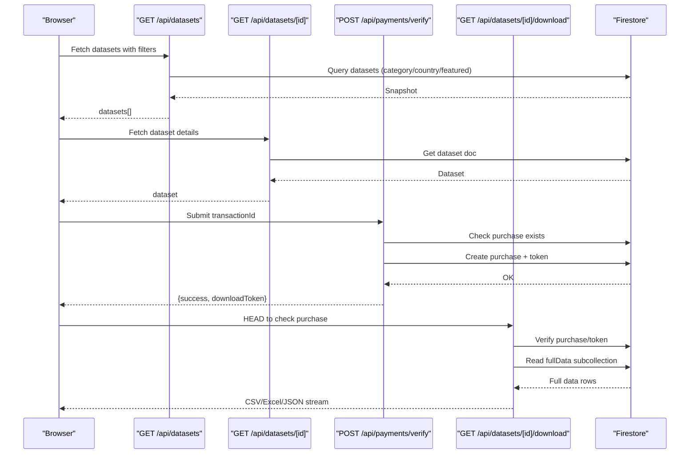
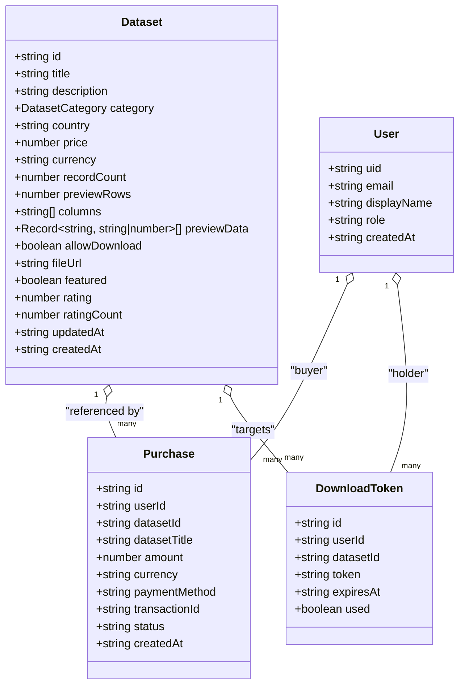
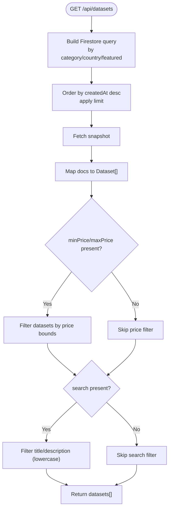
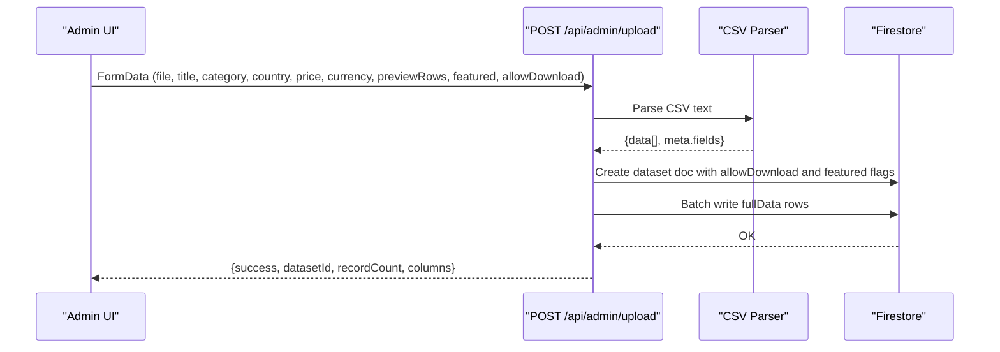
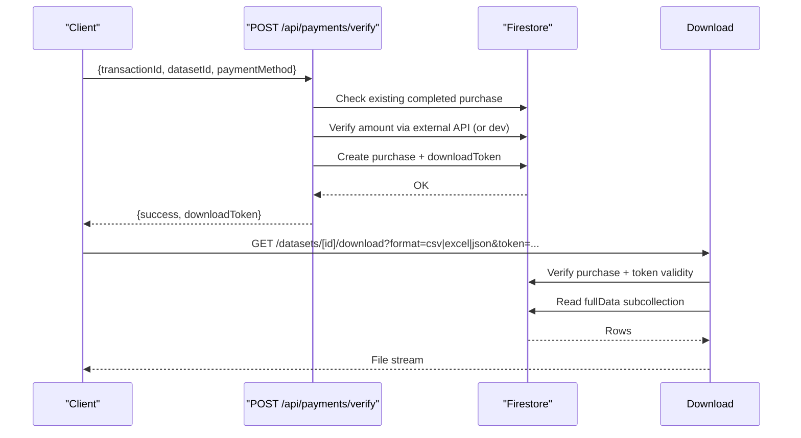
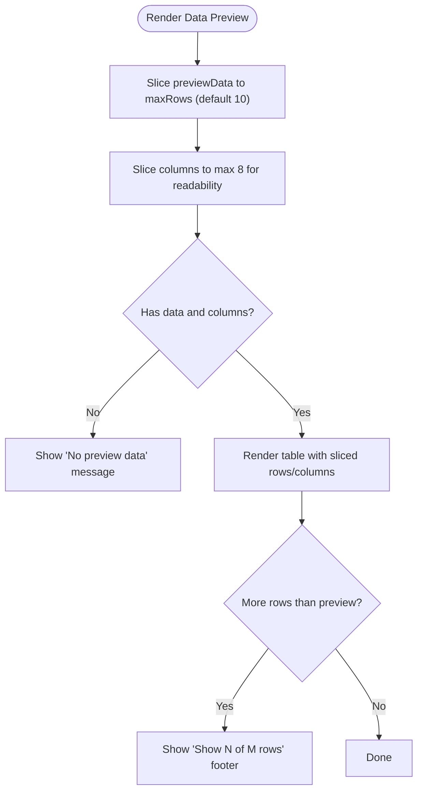
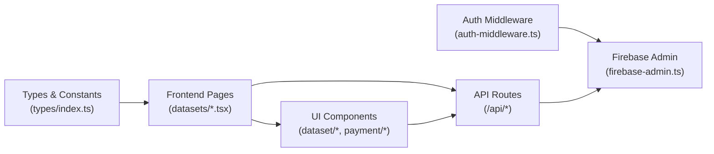

# Dataset Management

<cite>
**Referenced Files in This Document**
- [src/types/index.ts](file://src/types/index.ts)
- [src/lib/firebase-admin.ts](file://src/lib/firebase-admin.ts)
- [src/lib/auth-middleware.ts](file://src/lib/auth-middleware.ts)
- [src/hooks/use-auth.tsx](file://src/hooks/use-auth.tsx)
- [src/app/api/datasets/route.ts](file://src/app/api/datasets/route.ts)
- [src/app/api/datasets/[id]/route.ts](file://src/app/api/datasets/[id]/route.ts)
- [src/app/api/datasets/[id]/download/route.ts](file://src/app/api/datasets/[id]/download/route.ts)
- [src/app/api/admin/upload/route.ts](file://src/app/api/admin/upload/route.ts)
- [src/app/admin/upload/page.tsx](file://src/app/admin/upload/page.tsx)
- [src/app/datasets/page.tsx](file://src/app/datasets/page.tsx)
- [src/app/datasets/[id]/page.tsx](file://src/app/datasets/[id]/page.tsx)
- [src/components/dataset/dataset-card.tsx](file://src/components/dataset/dataset-card.tsx)
- [src/components/dataset/data-preview-table.tsx](file://src/components/dataset/data-preview-table.tsx)
- [src/components/payment/kkiapay-button.tsx](file://src/components/payment/kkiapay-button.tsx)
- [src/app/api/payments/verify/route.ts](file://src/app/api/payments/verify/route.ts)
- [src/app/api/user/purchases/route.ts](file://src/app/api/user/purchases/route.ts)
</cite>

## Update Summary
**Changes Made**
- Updated Dataset data model to include new allowDownload property
- Added featured dataset controls in admin upload interface
- Enhanced dataset listing and detail pages with allowDownload badge display
- Updated dataset preview functionality to handle view-only datasets
- Modified download capabilities based on allowDownload flag

## Table of Contents
1. [Introduction](#introduction)
2. [Project Structure](#project-structure)
3. [Core Components](#core-components)
4. [Architecture Overview](#architecture-overview)
5. [Detailed Component Analysis](#detailed-component-analysis)
6. [Dependency Analysis](#dependency-analysis)
7. [Performance Considerations](#performance-considerations)
8. [Troubleshooting Guide](#troubleshooting-guide)
9. [Conclusion](#conclusion)

## Introduction
This document explains Datafrica's dataset management system for the marketplace. It covers the dataset data model, CRUD operations, search and filtering, dataset preview and CSV/Excel/JSON export, listing and detail pages, and the payment and download workflow. It also documents data processing for CSV ingestion and preview generation, and provides performance guidance for large datasets.

**Updated** Enhanced with new allowDownload functionality that allows administrators to control whether datasets can be downloaded or only viewed online, and featured dataset controls for prominent display.

## Project Structure
The dataset management functionality spans frontend pages, UI components, and backend API routes. Authentication and database access are handled via Firebase Admin and custom middleware. Admin uploads use CSV parsing and batched writes to a subcollection for scalability.

```mermaid
graph TB
subgraph "Frontend"
LP["Datasets Listing Page<br/>(src/app/datasets/page.tsx)"]
DP["Dataset Detail Page<br/>(src/app/datasets/[id]/page.tsx)"]
UC["Upload Component<br/>(src/app/admin/upload/page.tsx)"]
DC["Dataset Card<br/>(src/components/dataset/dataset-card.tsx)"]
DPT["Data Preview Table<br/>(src/components/dataset/data-preview-table.tsx)"]
KP["KKiaPay Button<br/>(src/components/payment/kkiapay-button.tsx)"]
end
subgraph "Backend APIs"
LAPI["GET /api/datasets<br/>(src/app/api/datasets/route.ts)"]
SAPI["GET /api/datasets/[id]<br/>(src/app/api/datasets/[id]/route.ts)"]
DAPI["GET /api/datasets/[id]/download<br/>(src/app/api/datasets/[id]/download/route.ts)"]
UAPI["POST /api/admin/upload<br/>(src/app/api/admin/upload/route.ts)"]
VAPI["POST /api/payments/verify<br/>(src/app/api/payments/verify/route.ts)"]
PAPI["GET /api/user/purchases<br/>(src/app/api/user/purchases/route.ts)"]
end
subgraph "Auth & DB"
AUTH["Auth Middleware<br/>(src/lib/auth-middleware.ts)"]
FIRE["Firebase Admin<br/>(src/lib/firebase-admin.ts)"]
TYPES["Types & Constants<br/>(src/types/index.ts)"]
end
LP --> LAPI
DP --> SAPI
DP --> DAPI
DP --> VAPI
UC --> UAPI
LAPI --> TYPES
SAPI --> TYPES
DAPI --> TYPES
UAPI --> TYPES
LAPI --> FIRE
SAPI --> FIRE
DAPI --> FIRE
UAPI --> FIRE
AUTH --> FIRE
DP --> KP
LP --> DC
DP --> DPT
```

**Diagram sources**
- [src/app/datasets/page.tsx:20-195](file://src/app/datasets/page.tsx#L20-L195)
- [src/app/datasets/[id]/page.tsx](file://src/app/datasets/[id]/page.tsx#L29-L426)
- [src/app/admin/upload/page.tsx:22-338](file://src/app/admin/upload/page.tsx#L22-L338)
- [src/components/dataset/dataset-card.tsx:14-83](file://src/components/dataset/dataset-card.tsx#L14-L83)
- [src/components/dataset/data-preview-table.tsx:18-115](file://src/components/dataset/data-preview-table.tsx#L18-L115)
- [src/components/payment/kkiapay-button.tsx:15-110](file://src/components/payment/kkiapay-button.tsx#L15-L110)
- [src/app/api/datasets/route.ts:5-62](file://src/app/api/datasets/route.ts#L5-L62)
- [src/app/api/datasets/[id]/route.ts](file://src/app/api/datasets/[id]/route.ts#L5-L29)
- [src/app/api/datasets/[id]/download/route.ts](file://src/app/api/datasets/[id]/download/route.ts#L7-L148)
- [src/app/api/admin/upload/route.ts:6-96](file://src/app/api/admin/upload/route.ts#L6-L96)
- [src/app/api/payments/verify/route.ts:6-135](file://src/app/api/payments/verify/route.ts#L6-L135)
- [src/app/api/user/purchases/route.ts:5-31](file://src/app/api/user/purchases/route.ts#L5-L31)
- [src/lib/auth-middleware.ts:1-48](file://src/lib/auth-middleware.ts#L1-L48)
- [src/lib/firebase-admin.ts:1-50](file://src/lib/firebase-admin.ts#L1-L50)
- [src/types/index.ts:1-93](file://src/types/index.ts#L1-L93)

**Section sources**
- [src/app/datasets/page.tsx:20-195](file://src/app/datasets/page.tsx#L20-L195)
- [src/app/datasets/[id]/page.tsx](file://src/app/datasets/[id]/page.tsx#L29-L426)
- [src/app/admin/upload/page.tsx:22-338](file://src/app/admin/upload/page.tsx#L22-L338)
- [src/app/api/datasets/route.ts:5-62](file://src/app/api/datasets/route.ts#L5-L62)
- [src/app/api/datasets/[id]/route.ts](file://src/app/api/datasets/[id]/route.ts#L5-L29)
- [src/app/api/datasets/[id]/download/route.ts](file://src/app/api/datasets/[id]/download/route.ts#L7-L148)
- [src/app/api/admin/upload/route.ts:6-96](file://src/app/api/admin/upload/route.ts#L6-L96)
- [src/app/api/payments/verify/route.ts:6-135](file://src/app/api/payments/verify/route.ts#L6-L135)
- [src/app/api/user/purchases/route.ts:5-31](file://src/app/api/user/purchases/route.ts#L5-L31)
- [src/lib/auth-middleware.ts:1-48](file://src/lib/auth-middleware.ts#L1-L48)
- [src/lib/firebase-admin.ts:1-50](file://src/lib/firebase-admin.ts#L1-L50)
- [src/types/index.ts:1-93](file://src/types/index.ts#L1-L93)

## Core Components
- Dataset data model: Fields, validation rules, and relationships to users and purchases.
- Listing and search: Filtering by category, country, and price range; search term matching title and description.
- Preview and export: CSV/Excel/JSON generation with preview limits and pagination handling.
- Admin upload: CSV ingestion, preview slicing, and batched storage of full data.
- Payment and download: Purchase verification, download token issuance, and secure downloads.
- Access control: allowDownload flag for controlling download permissions and view-only datasets.

**Updated** Added allowDownload property to control dataset download capabilities and enhanced admin interface for dataset access control.

**Section sources**
- [src/types/index.ts:11-30](file://src/types/index.ts#L11-L30)
- [src/app/api/datasets/route.ts:5-62](file://src/app/api/datasets/route.ts#L5-L62)
- [src/app/api/admin/upload/route.ts:6-96](file://src/app/api/admin/upload/route.ts#L6-L96)
- [src/components/dataset/data-preview-table.tsx:18-115](file://src/components/dataset/data-preview-table.tsx#L18-L115)
- [src/app/api/datasets/[id]/download/route.ts](file://src/app/api/datasets/[id]/download/route.ts#L7-L148)
- [src/app/api/payments/verify/route.ts:6-135](file://src/app/api/payments/verify/route.ts#L6-L135)

## Architecture Overview
The system uses Next.js App Router with server actions and client components. Backend routes are protected by authentication middleware and operate against Firestore collections. Admin uploads parse CSVs and store preview plus batched full data. Users browse datasets, view details, pay via KKiaPay, and download files after purchase verification.

**Diagram sources**
- [src/app/api/datasets/route.ts:5-62](file://src/app/api/datasets/route.ts#L5-L62)
- [src/app/api/datasets/[id]/route.ts](file://src/app/api/datasets/[id]/route.ts#L5-L29)
- [src/app/api/payments/verify/route.ts:6-135](file://src/app/api/payments/verify/route.ts#L6-L135)
- [src/app/api/datasets/[id]/download/route.ts](file://src/app/api/datasets/[id]/download/route.ts#L7-L148)

## Detailed Component Analysis

### Dataset Data Model
The Dataset interface defines the schema stored in Firestore under the datasets collection. Related entities include Purchase and DownloadToken.

**Updated** Added allowDownload property to control dataset download permissions and previewRows property for configurable preview limits.

**Diagram sources**
- [src/types/index.ts:11-30](file://src/types/index.ts#L11-L30)
- [src/types/index.ts:32-43](file://src/types/index.ts#L32-L43)
- [src/types/index.ts:45-52](file://src/types/index.ts#L45-L52)
- [src/types/index.ts:3-9](file://src/types/index.ts#L3-L9)

**Section sources**
- [src/types/index.ts:11-30](file://src/types/index.ts#L11-L30)
- [src/types/index.ts:32-43](file://src/types/index.ts#L32-L43)
- [src/types/index.ts:45-52](file://src/types/index.ts#L45-L52)

### CRUD Operations

#### Listing and Search
- Endpoint: GET /api/datasets
- Filters supported: category, country, featured, search (title/description), minPrice, maxPrice, limit
- Sorting: createdAt descending
- Client-side filtering: price range and search term applied after server fetch

**Diagram sources**
- [src/app/api/datasets/route.ts:5-62](file://src/app/api/datasets/route.ts#L5-L62)

**Section sources**
- [src/app/api/datasets/route.ts:5-62](file://src/app/api/datasets/route.ts#L5-L62)

#### Single Dataset Details
- Endpoint: GET /api/datasets/[id]
- Returns dataset by ID or 404 if not found

**Section sources**
- [src/app/api/datasets/[id]/route.ts](file://src/app/api/datasets/[id]/route.ts#L5-L29)

#### Admin Upload (Create)
- Endpoint: POST /api/admin/upload
- Requires admin role and Bearer token
- Parses CSV, validates presence of required fields, stores dataset metadata, and batches full data into a subcollection
- New: allowDownload flag controls download permissions, featured flag for prominent display

**Diagram sources**
- [src/app/api/admin/upload/route.ts:6-96](file://src/app/api/admin/upload/route.ts#L6-L96)

**Section sources**
- [src/app/api/admin/upload/route.ts:6-96](file://src/app/api/admin/upload/route.ts#L6-L96)
- [src/app/admin/upload/page.tsx:267-313](file://src/app/admin/upload/page.tsx#L267-L313)

#### Purchase Verification and Download Token
- Endpoint: POST /api/payments/verify
- Verifies payment via KKiaPay API (or dev auto-verification), creates purchase record, and issues a 24-hour download token
- Endpoint: GET /api/datasets/[id]/download
- Requires purchase and optional token; streams CSV/Excel/JSON; records download

**Diagram sources**
- [src/app/api/payments/verify/route.ts:6-135](file://src/app/api/payments/verify/route.ts#L6-L135)
- [src/app/api/datasets/[id]/download/route.ts](file://src/app/api/datasets/[id]/download/route.ts#L7-L148)

**Section sources**
- [src/app/api/payments/verify/route.ts:6-135](file://src/app/api/payments/verify/route.ts#L6-L135)
- [src/app/api/datasets/[id]/download/route.ts](file://src/app/api/datasets/[id]/download/route.ts#L7-L148)

### Dataset Preview and Pagination Handling
- Preview table displays a subset of rows and columns to respect preview limits.
- When rows exceed the preview threshold, a message indicates additional rows are available after purchase.
- The detail page shows stats and column names, and the preview table is rendered with a fixed column count and row count.
- View-only datasets show blurred rows to indicate locked content until purchase.

**Updated** Enhanced preview functionality to handle view-only datasets with blurred content and purchase indicators.

**Diagram sources**
- [src/components/dataset/data-preview-table.tsx:18-115](file://src/components/dataset/data-preview-table.tsx#L18-L115)

**Section sources**
- [src/components/dataset/data-preview-table.tsx:18-115](file://src/components/dataset/data-preview-table.tsx#L18-L115)

### Dataset Listing Page Implementation
- Responsive grid layout with 1–3 columns depending on screen size.
- Filter controls: category, country, and search bar; active filters shown as badges.
- Skeleton loaders while fetching; empty state with clear filters option.
- Featured datasets highlighted with amber badges; view-only datasets with purple badges.

**Updated** Added featured dataset highlighting and view-only dataset badges in the listing interface.

**Section sources**
- [src/app/datasets/page.tsx:20-195](file://src/app/datasets/page.tsx#L20-L195)
- [src/components/dataset/dataset-card.tsx:14-83](file://src/components/dataset/dataset-card.tsx#L14-L83)

### Individual Dataset Page
- Displays metadata, statistics, columns, and preview table.
- Purchase flow: user must be authenticated; payment via KKiaPay; upon success, a download token is issued and the user can download in CSV/Excel/JSON.
- Download endpoint supports HEAD check to detect prior purchase and GET to stream files.
- Access control: allowDownload flag determines whether download buttons are shown or view-only message is displayed.

**Updated** Enhanced dataset detail page with conditional download controls based on allowDownload flag and view-only messaging.

**Section sources**
- [src/app/datasets/[id]/page.tsx](file://src/app/datasets/[id]/page.tsx#L29-L426)
- [src/components/payment/kkiapay-button.tsx:15-110](file://src/components/payment/kkiapay-button.tsx#L15-L110)
- [src/app/api/datasets/[id]/download/route.ts](file://src/app/api/datasets/[id]/download/route.ts#L7-L148)

### Data Processing Workflows for CSV/Excel/JSON
- CSV ingestion: Admin upload parses CSV with Papa Parse, validates headers and rows, computes columns and preview data.
- Full data storage: Batched writes to a subcollection named fullData to scale beyond single document limits.
- Export generation: On download, reads fullData rows (or fallback to previewData), then generates CSV, Excel (via SheetJS), or JSON response.

**Section sources**
- [src/app/api/admin/upload/route.ts:6-96](file://src/app/api/admin/upload/route.ts#L6-L96)
- [src/app/api/datasets/[id]/download/route.ts](file://src/app/api/datasets/[id]/download/route.ts#L7-L148)

## Dependency Analysis
- Authentication: Bearer token verification and admin role checks are centralized in middleware.
- Database access: Firebase Admin SDK is lazily initialized and proxied for Auth, Firestore, and Storage.
- Types: Strongly typed Dataset, Purchase, DownloadToken, and constants for categories and countries.
- UI components: Listing and detail pages depend on reusable components for cards and preview tables.

**Diagram sources**
- [src/lib/auth-middleware.ts:1-48](file://src/lib/auth-middleware.ts#L1-L48)
- [src/lib/firebase-admin.ts:1-50](file://src/lib/firebase-admin.ts#L1-L50)
- [src/types/index.ts:1-93](file://src/types/index.ts#L1-L93)
- [src/app/datasets/page.tsx:20-195](file://src/app/datasets/page.tsx#L20-L195)
- [src/app/datasets/[id]/page.tsx](file://src/app/datasets/[id]/page.tsx#L29-L426)
- [src/app/api/datasets/route.ts:5-62](file://src/app/api/datasets/route.ts#L5-L62)

**Section sources**
- [src/lib/auth-middleware.ts:1-48](file://src/lib/auth-middleware.ts#L1-L48)
- [src/lib/firebase-admin.ts:1-50](file://src/lib/firebase-admin.ts#L1-L50)
- [src/types/index.ts:1-93](file://src/types/index.ts#L1-L93)

## Performance Considerations
- Pagination and limits: The listing endpoint applies a server-side limit and defers price/search filtering to the client to reduce DB load.
- Batched writes: Full dataset rows are written in batches to avoid single-document size limits and improve throughput.
- Preview constraints: Preview table caps rows and columns to keep initial render fast.
- Streaming downloads: Full dataset exports are streamed to avoid loading entire datasets into memory.
- Image previews: Not implemented in the current codebase; if needed, store pre-generated thumbnails and lazy-load them.
- Access control: allowDownload flag enables efficient filtering of downloadable datasets for better user experience.

**Updated** Added access control considerations for allowDownload flag filtering.

## Troubleshooting Guide
- Authentication failures: Ensure Bearer token is present and valid; admin uploads require admin role.
- Purchase verification failures: Confirm payment method and amount match; in development, auto-verification may be enabled.
- Download errors: Verify purchase exists, token validity (if used), and dataset availability; check server logs for parsing or storage issues.
- CSV parsing errors: Validate CSV headers and encoding; ensure Papa Parse does not report errors.
- Access control issues: Verify allowDownload flag is properly set during upload; check dataset permissions in Firestore.
- Featured dataset display: Ensure featured flag is correctly applied and filtered in listing queries.

**Updated** Added troubleshooting guidance for new allowDownload and featured dataset functionality.

**Section sources**
- [src/lib/auth-middleware.ts:19-47](file://src/lib/auth-middleware.ts#L19-L47)
- [src/app/api/admin/upload/route.ts:34-38](file://src/app/api/admin/upload/route.ts#L34-L38)
- [src/app/api/payments/verify/route.ts:67-89](file://src/app/api/payments/verify/route.ts#L67-L89)
- [src/app/api/datasets/[id]/download/route.ts](file://src/app/api/datasets/[id]/download/route.ts#L31-L68)

## Conclusion
Datafrica's dataset management system integrates secure authentication, scalable CSV ingestion, flexible listing and search, robust preview and export capabilities, and a streamlined purchase flow. The architecture leverages Firestore for structured data and batched writes for large datasets, while UI components deliver a responsive and user-friendly experience. The new allowDownload functionality provides granular control over dataset access, enabling administrators to offer both downloadable and view-only datasets, while the featured dataset controls enhance discoverability and marketing capabilities.