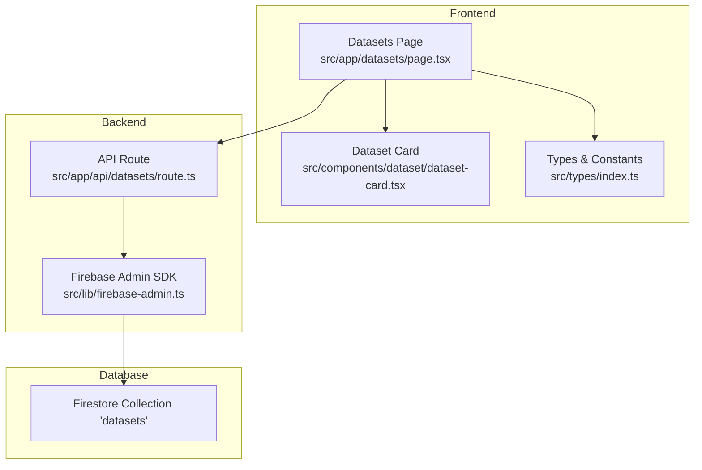
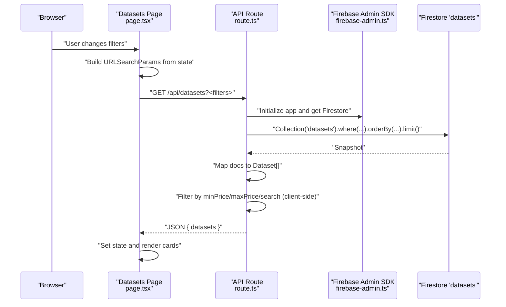
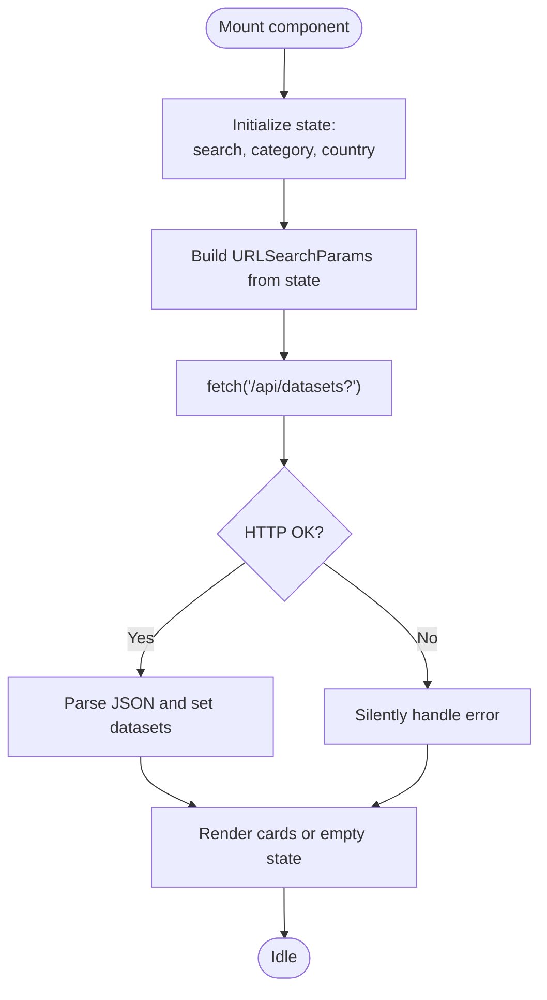
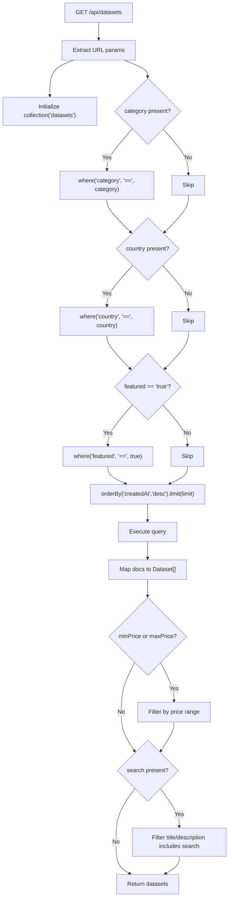
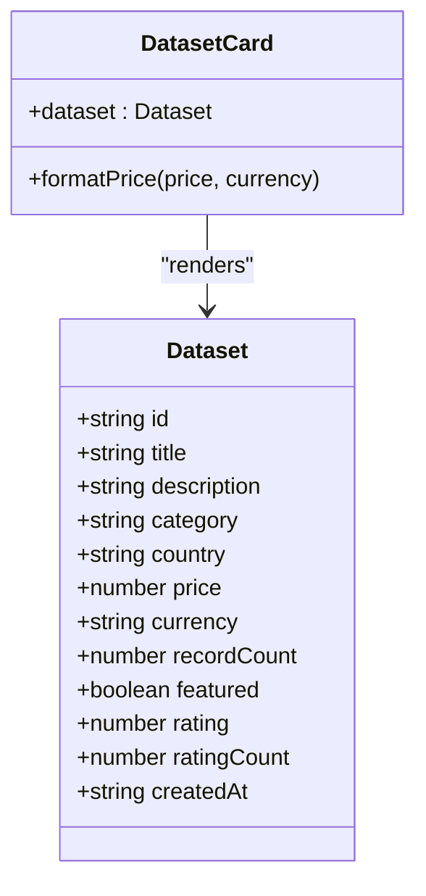
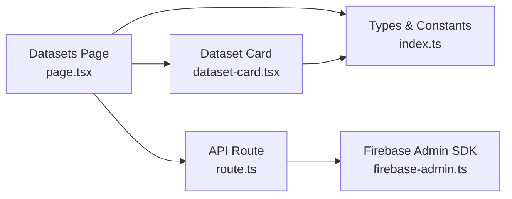

# Dataset Search and Filtering

<cite>
**Referenced Files in This Document**
- [src/app/datasets/page.tsx](file://src/app/datasets/page.tsx)
- [src/app/api/datasets/route.ts](file://src/app/api/datasets/route.ts)
- [src/components/dataset/dataset-card.tsx](file://src/components/dataset/dataset-card.tsx)
- [src/lib/firebase.ts](file://src/lib/firebase.ts)
- [src/lib/firebase-admin.ts](file://src/lib/firebase-admin.ts)
- [src/types/index.ts](file://src/types/index.ts)
- [src/app/page.tsx](file://src/app/page.tsx)
</cite>

## Table of Contents
1. [Introduction](#introduction)
2. [Project Structure](#project-structure)
3. [Core Components](#core-components)
4. [Architecture Overview](#architecture-overview)
5. [Detailed Component Analysis](#detailed-component-analysis)
6. [Dependency Analysis](#dependency-analysis)
7. [Performance Considerations](#performance-considerations)
8. [Troubleshooting Guide](#troubleshooting-guide)
9. [Conclusion](#conclusion)

## Introduction
This document explains the dataset search and filtering functionality implemented in the application. It covers how text matching, category filtering, geographic filtering by country, and price range filtering are handled, how query parameters are processed and reflected in the URL, and how the frontend UI integrates with the backend search API. It also documents performance characteristics, optimization opportunities for large datasets, and the integration with Firestore.

## Project Structure
The search and filtering feature spans several layers:
- Frontend pages and UI components that collect filters and render results
- Next.js API routes that translate URL parameters into Firestore queries and apply additional client-side filtering
- Types and constants that define categories and countries
- Firebase client and admin SDKs for database access

**Diagram sources**
- [src/app/datasets/page.tsx:1-195](file://src/app/datasets/page.tsx#L1-L195)
- [src/app/api/datasets/route.ts:1-62](file://src/app/api/datasets/route.ts#L1-L62)
- [src/lib/firebase-admin.ts:1-50](file://src/lib/firebase-admin.ts#L1-L50)
- [src/components/dataset/dataset-card.tsx:1-81](file://src/components/dataset/dataset-card.tsx#L1-L81)
- [src/types/index.ts:1-90](file://src/types/index.ts#L1-L90)

**Section sources**
- [src/app/datasets/page.tsx:1-195](file://src/app/datasets/page.tsx#L1-L195)
- [src/app/api/datasets/route.ts:1-62](file://src/app/api/datasets/route.ts#L1-L62)
- [src/lib/firebase-admin.ts:1-50](file://src/lib/firebase-admin.ts#L1-L50)
- [src/components/dataset/dataset-card.tsx:1-81](file://src/components/dataset/dataset-card.tsx#L1-L81)
- [src/types/index.ts:1-90](file://src/types/index.ts#L1-L90)

## Core Components
- Datasets page: Manages search and filter state, builds URL query parameters, fetches results, and renders cards.
- API route: Reads URL parameters, constructs Firestore queries, applies server-side filters, and performs client-side filtering for price and text search.
- Dataset card: Renders dataset metadata including category, country, price, ratings, and featured badges.
- Types and constants: Define dataset shape, categories, and African countries used in UI selects.
- Firebase Admin SDK: Provides Firestore access for server-side reads.

Key responsibilities:
- URL parameter handling: category, country, search, minPrice, maxPrice, featured, limit.
- Query construction: Firestore where clauses for category, country, and featured; ordering and limit.
- Client-side filtering: price range and text search across title and description.
- UI integration: controlled Select components and live URL updates.

**Section sources**
- [src/app/datasets/page.tsx:20-50](file://src/app/datasets/page.tsx#L20-L50)
- [src/app/api/datasets/route.ts:6-61](file://src/app/api/datasets/route.ts#L6-L61)
- [src/components/dataset/dataset-card.tsx:14-80](file://src/components/dataset/dataset-card.tsx#L14-L80)
- [src/types/index.ts:11-89](file://src/types/index.ts#L11-L89)

## Architecture Overview
The search pipeline is a client-server interaction:
- The client composes URL parameters from local state and requests the API endpoint.
- The API route translates parameters into Firestore queries, applies server-side filters, orders results, and limits them.
- Additional client-side filtering is applied for price range and text search.
- The response is sent back to the client, which updates the UI.

**Diagram sources**
- [src/app/datasets/page.tsx:28-46](file://src/app/datasets/page.tsx#L28-L46)
- [src/app/api/datasets/route.ts:6-61](file://src/app/api/datasets/route.ts#L6-L61)
- [src/lib/firebase-admin.ts:12-49](file://src/lib/firebase-admin.ts#L12-L49)

## Detailed Component Analysis

### Datasets Page (UI)
Responsibilities:
- Maintains state for search term, category, and country.
- Builds URL parameters and triggers fetch.
- Displays loading skeletons, empty state, and results.
- Integrates with Select components for category and country.
- Shows active filters and allows clearing.

Behavior highlights:
- URL parameter composition includes category, country, and search.
- Fetch is triggered when any filter changes.
- Results are rendered using DatasetCard components.

**Diagram sources**
- [src/app/datasets/page.tsx:28-50](file://src/app/datasets/page.tsx#L28-L50)

**Section sources**
- [src/app/datasets/page.tsx:20-195](file://src/app/datasets/page.tsx#L20-L195)

### API Route (Server)
Responsibilities:
- Extracts URL parameters: category, country, search, minPrice, maxPrice, featured, limit.
- Constructs Firestore query with where clauses for category, country, and featured.
- Orders by creation date descending and applies limit.
- Maps Firestore documents to Dataset objects.
- Applies client-side filtering for price range and text search.
- Returns JSON response.

Important implementation notes:
- Category, country, and featured are applied as Firestore where clauses.
- Price range and text search are performed client-side on the resulting array.
- Ordering is by createdAt desc; limit defaults to 50.

**Diagram sources**
- [src/app/api/datasets/route.ts:6-61](file://src/app/api/datasets/route.ts#L6-L61)

**Section sources**
- [src/app/api/datasets/route.ts:6-61](file://src/app/api/datasets/route.ts#L6-L61)

### Dataset Card (UI)
Responsibilities:
- Renders dataset metadata: category badge, country, record count, rating, price.
- Displays featured badge when applicable.
- Provides navigation to dataset detail page.

**Diagram sources**
- [src/components/dataset/dataset-card.tsx:10-80](file://src/components/dataset/dataset-card.tsx#L10-L80)
- [src/types/index.ts:11-28](file://src/types/index.ts#L11-L28)

**Section sources**
- [src/components/dataset/dataset-card.tsx:14-80](file://src/components/dataset/dataset-card.tsx#L14-L80)
- [src/types/index.ts:11-28](file://src/types/index.ts#L11-L28)

### Types and Constants
Responsibilities:
- Define Dataset interface and enums for categories and countries.
- Provide lists for Select UI components.

Highlights:
- Categories include Business, Leads, Real Estate, Jobs, E-commerce, Finance, Health, Education.
- Countries include Togo, Nigeria, Ghana, Kenya, South Africa, Senegal, Ivory Coast, Cameroon, Tanzania, Ethiopia, Rwanda, Uganda, Morocco, Egypt, DRC.

**Section sources**
- [src/types/index.ts:52-89](file://src/types/index.ts#L52-L89)

### Firebase Admin SDK
Responsibilities:
- Lazy initialization of Firebase Admin app and Firestore client.
- Exports adminDb for server-side Firestore operations.

Integration note:
- The API route imports adminDb and uses it to execute queries.

**Section sources**
- [src/lib/firebase-admin.ts:12-49](file://src/lib/firebase-admin.ts#L12-L49)

### Firebase Client SDK
Responsibilities:
- Client-side Firebase configuration for browser usage.
- Not directly used in dataset search; included for completeness.

**Section sources**
- [src/lib/firebase.ts:1-22](file://src/lib/firebase.ts#L1-L22)

### Homepage Integration
Highlights:
- The homepage demonstrates URL-based filtering by calling the API with featured and limit parameters.
- This pattern mirrors the datasets page behavior and shows how URL parameters propagate state.

**Section sources**
- [src/app/page.tsx:23-47](file://src/app/page.tsx#L23-L47)

## Dependency Analysis
- The datasets page depends on:
  - UI components (Input, Select, Button, Badge, Skeleton)
  - Types for Dataset and constants for categories/countries
  - API route for data fetching
- The API route depends on:
  - Firebase Admin SDK for Firestore access
  - Dataset type definition for response shaping
- The dataset card depends on:
  - Dataset type for rendering
  - UI primitives for layout and badges

**Diagram sources**
- [src/app/datasets/page.tsx:17-18](file://src/app/datasets/page.tsx#L17-L18)
- [src/app/api/datasets/route.ts:2](file://src/app/api/datasets/route.ts#L2)
- [src/lib/firebase-admin.ts:4](file://src/lib/firebase-admin.ts#L4)
- [src/components/dataset/dataset-card.tsx:7-8](file://src/components/dataset/dataset-card.tsx#L7-L8)
- [src/types/index.ts:11-28](file://src/types/index.ts#L11-L28)

**Section sources**
- [src/app/datasets/page.tsx:17-18](file://src/app/datasets/page.tsx#L17-L18)
- [src/app/api/datasets/route.ts:2](file://src/app/api/datasets/route.ts#L2)
- [src/lib/firebase-admin.ts:4](file://src/lib/firebase-admin.ts#L4)
- [src/components/dataset/dataset-card.tsx:7-8](file://src/components/dataset/dataset-card.tsx#L7-L8)
- [src/types/index.ts:11-28](file://src/types/index.ts#L11-L28)

## Performance Considerations
Current implementation characteristics:
- Server-side filtering:
  - category, country, and featured are applied as Firestore where clauses.
  - createdAt ordering with limit reduces initial payload size.
- Client-side filtering:
  - minPrice and maxPrice filters are applied after fetching.
  - Text search across title and description is applied after fetching.
- Pagination:
  - limit parameter controls batch size; no cursor-based pagination is implemented.
- Ranking:
  - No explicit ranking or relevance scoring is implemented; results are ordered by creation date.

Optimization opportunities:
- Indexing strategies:
  - Create composite indexes for frequent filter combinations:
    - (category, createdAt)
    - (country, createdAt)
    - (category, country, createdAt)
    - (featured, createdAt)
    - (category, featured, createdAt)
    - (country, featured, createdAt)
    - (category, country, featured, createdAt)
  - Consider adding price as a numeric field and creating indexes for (price, createdAt) if price filtering becomes frequent.
- Client-side filtering:
  - Move price range filtering to server-side by adding where clauses for minPrice and maxPrice when present.
  - Implement server-side text search using array of tokens or full-text capabilities if available.
- Pagination:
  - Introduce cursor-based pagination using startAfter/endBefore to reduce repeated scans of large datasets.
- Caching:
  - Add server-side caching for popular queries (e.g., recent datasets, featured datasets) to reduce Firestore reads.
  - Consider CDN caching for static or semi-static pages.
- Sorting and ranking:
  - Implement a relevance score or weighted ranking combining popularity metrics (rating, ratingCount, recordCount) with recency.
  - Featured datasets could be prioritized by boosting their position in the result set.

Impact of complex filter combinations:
- Category + Country + Featured + Limit: Efficient with proper composite indexes.
- Category + Price Range: Currently client-side; moving to server-side would improve performance.
- Text Search + Price Range: Both client-side; significant CPU cost on large arrays.
- Featured + Limit: Efficient; ordering by createdAt with limit minimizes scan.

[No sources needed since this section provides general guidance]

## Troubleshooting Guide
Common issues and resolutions:
- Empty results:
  - Verify URL parameters are correctly passed and not empty.
  - Confirm Firestore documents match the filters (e.g., category/country values).
- Slow performance:
  - Ensure composite indexes exist for used filter combinations.
  - Move price range filtering to server-side.
  - Reduce limit or implement pagination.
- Incorrect text search:
  - Confirm search is applied to both title and description.
  - Normalize case consistently (already lowercase conversion is applied).
- Featured datasets not appearing:
  - Verify featured flag is set to true in Firestore.
  - Confirm URL parameter featured=true is present.

**Section sources**
- [src/app/datasets/page.tsx:28-46](file://src/app/datasets/page.tsx#L28-L46)
- [src/app/api/datasets/route.ts:37-51](file://src/app/api/datasets/route.ts#L37-L51)

## Conclusion
The dataset search and filtering feature provides a straightforward, URL-driven interface with server-side filtering for category, country, and featured datasets, and client-side filtering for price range and text search. While functional, performance can be improved by adding appropriate Firestore indexes, moving price filtering to the server, implementing cursor-based pagination, and introducing caching and ranking mechanisms. These enhancements will scale better with larger datasets and provide a smoother user experience.