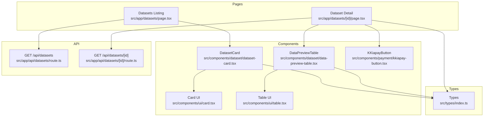
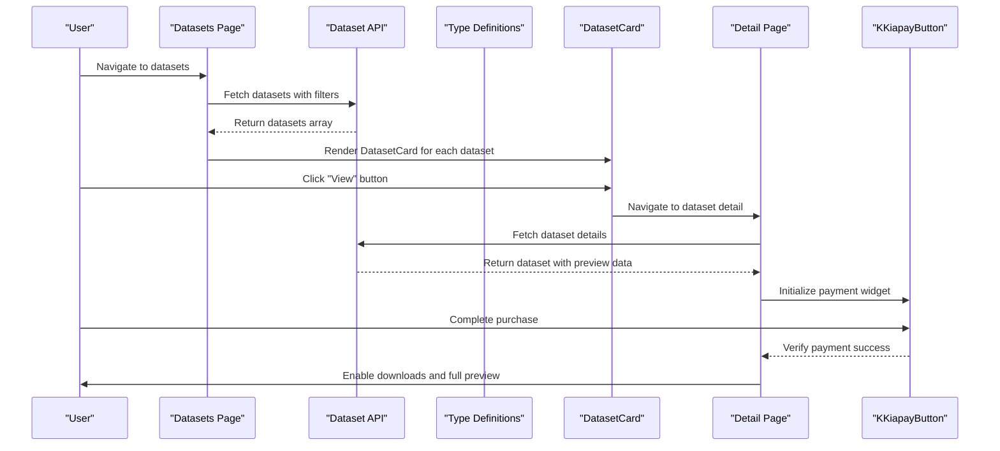
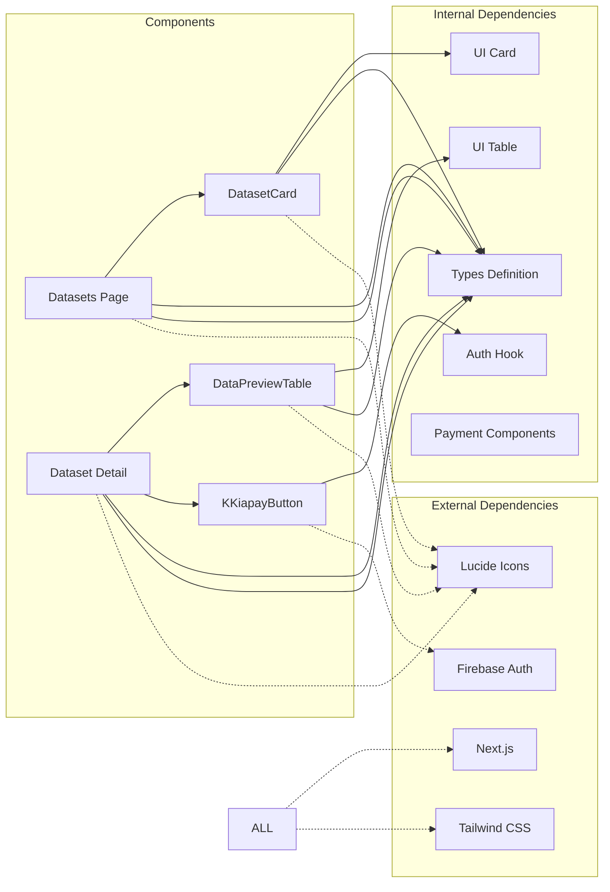

# Dataset UI Components

<cite>
**Referenced Files in This Document**
- [dataset-card.tsx](file://src/components/dataset/dataset-card.tsx)
- [data-preview-table.tsx](file://src/components/dataset/data-preview-table.tsx)
- [page.tsx](file://src/app/datasets/page.tsx)
- [page.tsx](file://src/app/datasets/[id]/page.tsx)
- [index.ts](file://src/types/index.ts)
- [kkiapay-button.tsx](file://src/components/payment/kkiapay-button.tsx)
- [table.tsx](file://src/components/ui/table.tsx)
- [card.tsx](file://src/components/ui/card.tsx)
- [use-auth.tsx](file://src/hooks/use-auth.tsx)
- [route.ts](file://src/app/api/datasets/route.ts)
- [route.ts](file://src/app/api/datasets/[id]/route.ts)
- [layout.tsx](file://src/app/layout.tsx)
- [globals.css](file://src/app/globals.css)
</cite>

## Table of Contents
1. [Introduction](#introduction)
2. [Project Structure](#project-structure)
3. [Core Components](#core-components)
4. [Architecture Overview](#architecture-overview)
5. [Detailed Component Analysis](#detailed-component-analysis)
6. [Dependency Analysis](#dependency-analysis)
7. [Performance Considerations](#performance-considerations)
8. [Troubleshooting Guide](#troubleshooting-guide)
9. [Conclusion](#conclusion)

## Introduction
This document provides comprehensive documentation for dataset-related UI components and pages in the Datafrica platform. It covers the DatasetCard component for browsing datasets, the DataPreviewTable component for CSV data visualization, the dataset listing page with filtering and search, and the individual dataset detail page with purchase integration. The documentation includes component composition patterns, prop interfaces, state management, responsive design considerations, accessibility compliance, and user experience optimizations.

## Project Structure
The dataset UI components are organized under the components/dataset directory and integrate with shared UI primitives and payment components. The pages are located under src/app/datasets for listing and individual dataset detail views.

**Diagram sources**
- [dataset-card.tsx:1-81](file://src/components/dataset/dataset-card.tsx#L1-L81)
- [data-preview-table.tsx:1-76](file://src/components/dataset/data-preview-table.tsx#L1-L76)
- [page.tsx:1-195](file://src/app/datasets/page.tsx#L1-L195)
- [page.tsx:1-382](file://src/app/datasets/[id]/page.tsx#L1-L382)
- [index.ts:1-90](file://src/types/index.ts#L1-L90)
- [route.ts:1-62](file://src/app/api/datasets/route.ts#L1-L62)
- [route.ts:1-29](file://src/app/api/datasets/[id]/route.ts#L1-L29)

**Section sources**
- [dataset-card.tsx:1-81](file://src/components/dataset/dataset-card.tsx#L1-L81)
- [data-preview-table.tsx:1-76](file://src/components/dataset/data-preview-table.tsx#L1-L76)
- [page.tsx:1-195](file://src/app/datasets/page.tsx#L1-L195)
- [page.tsx:1-382](file://src/app/datasets/[id]/page.tsx#L1-L382)
- [index.ts:1-90](file://src/types/index.ts#L1-L90)

## Core Components
This section documents the primary dataset UI components and their interfaces.

### DatasetCard Component
The DatasetCard component presents a single dataset in a card layout with essential metadata and purchase information.

**Props Interface:**
- dataset: Dataset (from types/index.ts)
  - id: string
  - title: string
  - description: string
  - category: DatasetCategory
  - country: string
  - price: number
  - currency: string
  - recordCount: number
  - columns: string[]
  - previewData: Record<string, string | number>[]
  - fileUrl: string
  - featured: boolean
  - rating: number
  - ratingCount: number
  - updatedAt: string
  - createdAt: string

**Styling and Layout:**
- Uses Card component from ui library for consistent styling
- Responsive grid layout with hover effects and transitions
- Badge components for category and featured indicators
- Iconography using Lucide React icons (MapPin, Database, Star, ArrowRight)

**Interactive Elements:**
- View button with arrow icon navigates to dataset detail page
- Hover effects enhance user feedback
- Conditional rendering for featured badges

**Purchase Integration:**
- Displays formatted price based on currency (CFA or USD)
- Links to detail page for purchase flow

**Section sources**
- [dataset-card.tsx:10-81](file://src/components/dataset/dataset-card.tsx#L10-L81)
- [index.ts:11-28](file://src/types/index.ts#L11-L28)

### DataPreviewTable Component
The DataPreviewTable component renders a preview of CSV data with pagination-like limitations and responsive design.

**Props Interface:**
- data: Record<string, string | number>[]
- columns: string[]
- maxRows?: number (default: 10)

**Key Features:**
- Limits preview to first 10 rows by default
- Restricts columns to first 8 for readability
- Shows "more columns" indicator when columns exceed 8
- Displays row numbers and column headers
- Handles empty data gracefully with centered message

**Responsive Design:**
- Horizontal scrolling container for overflow columns
- Column width constraints with truncation
- Mobile-first responsive layout

**Pagination and Limitations:**
- Shows preview count with total row count
- Indicates purchase requirement for full access
- Truncates data display to prevent performance issues

**Section sources**
- [data-preview-table.tsx:12-76](file://src/components/dataset/data-preview-table.tsx#L12-L76)
- [table.tsx:1-117](file://src/components/ui/table.tsx#L1-L117)

## Architecture Overview
The dataset UI architecture follows a component composition pattern with clear separation of concerns between presentation, data handling, and integration points.

**Diagram sources**
- [page.tsx:28-50](file://src/app/datasets/page.tsx#L28-L50)
- [route.ts:5-61](file://src/app/api/datasets/route.ts#L5-L61)
- [dataset-card.tsx:71-77](file://src/components/dataset/dataset-card.tsx#L71-L77)
- [page.tsx:43-59](file://src/app/datasets/[id]/page.tsx#L43-L59)
- [kkiapay-button.tsx:15-109](file://src/components/payment/kkiapay-button.tsx#L15-L109)

## Detailed Component Analysis

### Dataset Listing Page Implementation
The dataset listing page provides comprehensive filtering, search, and responsive grid layout for dataset discovery.

**State Management:**
- Datasets array for displaying results
- Loading state for API requests
- Search term, category, and country filters
- Filter visibility toggle for mobile devices

**Filtering Controls:**
- Text search input with search icon
- Category dropdown using DATASET_CATEGORIES
- Country dropdown using AFRICAN_COUNTRIES
- Clear filters functionality
- Active filter badges with remove actions

**Search Functionality:**
- Real-time search updates via URL parameters
- Debounced API calls to prevent excessive requests
- Search term persistence across navigation

**Grid Layout:**
- Responsive grid with 1 column on mobile, 2 on tablet, 3 on desktop
- Skeleton loading states for improved perceived performance
- Empty state handling with clear action

**API Integration:**
- Fetches datasets from /api/datasets endpoint
- Applies category, country, and search filters server-side
- Handles loading states and error conditions

**Section sources**
- [page.tsx:20-195](file://src/app/datasets/page.tsx#L20-L195)
- [index.ts:62-89](file://src/types/index.ts#L62-L89)
- [route.ts:5-61](file://src/app/api/datasets/route.ts#L5-L61)

### Individual Dataset Page
The dataset detail page combines comprehensive information display with integrated purchase and download functionality.

**State Management:**
- Dataset loading and error states
- Purchase verification and download token management
- Download progress tracking
- Authentication state integration

**Component Composition:**
- Sticky sidebar for pricing and purchase controls
- Grid layout with main content and sidebar
- Responsive breakpoint at lg:grid-cols-3

**Pricing Display:**
- Formatted price display based on currency
- One-time purchase indication
- Currency-specific formatting (CFA vs USD)

**Purchase Integration:**
- KKiapayButton component for secure payments
- Payment verification via /api/payments/verify
- Download token generation upon successful purchase
- Authentication-required download flow

**Data Preview Integration:**
- DataPreviewTable component for dataset preview
- Locked preview with purchase prompt
- Full preview access after purchase

**Download Functionality:**
- Multiple format support (CSV, Excel, JSON)
- Authentication-required downloads
- Blob-based file generation
- User-friendly download notifications

**Section sources**
- [page.tsx:29-382](file://src/app/datasets/[id]/page.tsx#L29-L382)
- [kkiapay-button.tsx:15-109](file://src/components/payment/kkiapay-button.tsx#L15-L109)
- [data-preview-table.tsx:18-76](file://src/components/dataset/data-preview-table.tsx#L18-L76)

### Payment Integration Component
The KKiapayButton component handles secure payment processing through the KKiaPay SDK.

**SDK Integration:**
- Dynamic script loading for KKiaPay SDK
- Sandbox mode for development environments
- Theme customization and positioning

**Authentication Handling:**
- User email and display name integration
- Transaction data embedding with dataset and user IDs
- Error handling for SDK loading failures

**Event Handling:**
- Success callback with transaction ID
- Error propagation to parent components
- Loading state management during payment processing

**Section sources**
- [kkiapay-button.tsx:15-109](file://src/components/payment/kkiapay-button.tsx#L15-L109)
- [use-auth.tsx:94-99](file://src/hooks/use-auth.tsx#L94-L99)

### Component Composition Patterns
The dataset UI follows several composition patterns:

**Container-Presentational Pattern:**
- Pages act as containers managing state and API calls
- Components focus on presentation and user interaction
- Clear separation of concerns between data and UI

**Prop Drilling Pattern:**
- Dataset objects passed down through component hierarchy
- Event handlers passed up for state management
- Consistent typing through TypeScript interfaces

**Higher-Order Component Pattern:**
- AuthProvider wraps application for authentication state
- ThemeProvider manages theme context
- Toast provider for user notifications

**Section sources**
- [page.tsx:20-50](file://src/app/datasets/page.tsx#L20-L50)
- [page.tsx:34-82](file://src/app/datasets/[id]/page.tsx#L34-L82)
- [layout.tsx:37-45](file://src/app/layout.tsx#L37-L45)

## Dependency Analysis
The dataset UI components have well-defined dependencies that support maintainability and scalability.

**Diagram sources**
- [dataset-card.tsx:3-7](file://src/components/dataset/dataset-card.tsx#L3-L7)
- [data-preview-table.tsx:3-10](file://src/components/dataset/data-preview-table.tsx#L3-L10)
- [page.tsx:4-16](file://src/app/datasets/page.tsx#L4-L16)
- [page.tsx:5-26](file://src/app/datasets/[id]/page.tsx#L5-L26)
- [kkiapay-button.tsx:3-6](file://src/components/payment/kkiapay-button.tsx#L3-L6)

**Section sources**
- [index.ts:1-90](file://src/types/index.ts#L1-L90)
- [use-auth.tsx:1-117](file://src/hooks/use-auth.tsx#L1-L117)

## Performance Considerations
Several performance optimizations are implemented throughout the dataset UI components:

**Data Preview Optimization:**
- Default limit of 10 rows prevents memory issues with large datasets
- Column limiting to 8 improves readability and reduces DOM complexity
- Truncated cell content prevents layout thrashing

**API Request Optimization:**
- Server-side filtering reduces payload sizes
- URL parameter-based filtering enables caching
- Debounced search prevents excessive API calls

**Rendering Optimization:**
- Skeleton loading states improve perceived performance
- Conditional rendering prevents unnecessary component mounts
- Responsive grid layout adapts to screen sizes efficiently

**Memory Management:**
- Blob URL revocation prevents memory leaks during downloads
- Cleanup functions for event listeners and scripts
- Proper state cleanup in useEffect dependencies

**Accessibility Optimization:**
- Semantic HTML structure with proper heading hierarchy
- Focus management for interactive elements
- Screen reader friendly labels and descriptions
- Keyboard navigation support

## Troubleshooting Guide
Common issues and their solutions for dataset UI components:

**Dataset Loading Issues:**
- Verify API endpoint availability at /api/datasets
- Check network connectivity and CORS configuration
- Ensure dataset objects have required fields (title, description, etc.)

**Payment Integration Problems:**
- Confirm KKiaPay public key environment variable is set
- Verify user authentication before payment initiation
- Check sandbox mode configuration for development

**Download Failures:**
- Ensure user is authenticated before download attempts
- Verify download token validity and expiration
- Check file format support (CSV, Excel, JSON)

**Responsive Design Issues:**
- Test grid layout breakpoints (mobile, tablet, desktop)
- Verify horizontal scrolling works on small screens
- Check icon sizing across different viewport widths

**State Management Issues:**
- Verify proper context provider setup in layout
- Check authentication state initialization
- Ensure proper cleanup of event listeners and timers

**Section sources**
- [page.tsx:28-46](file://src/app/datasets/page.tsx#L28-L46)
- [page.tsx:62-82](file://src/app/datasets/[id]/page.tsx#L62-L82)
- [kkiapay-button.tsx:20-36](file://src/components/payment/kkiapay-button.tsx#L20-L36)

## Conclusion
The dataset UI components in Datafrica demonstrate a well-architected solution for dataset discovery, preview, and purchase. The components follow modern React patterns with TypeScript for type safety, implement responsive design principles, and integrate seamlessly with the payment system. The modular architecture allows for easy maintenance and extension while maintaining good performance characteristics through data preview limitations and efficient state management.

The implementation successfully balances user experience with technical constraints, providing clear pathways for dataset discovery, meaningful previews, and secure purchasing workflows. The responsive design ensures accessibility across device types, while the component composition patterns support maintainability and scalability.