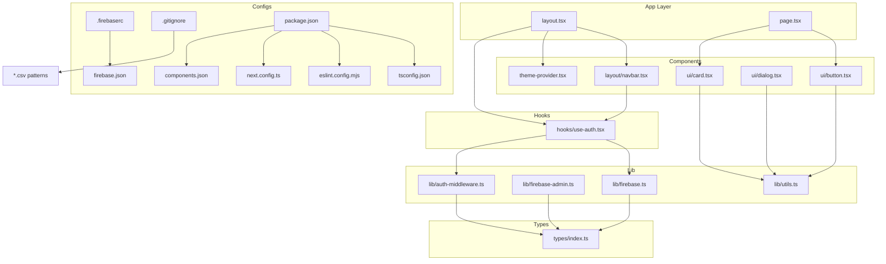
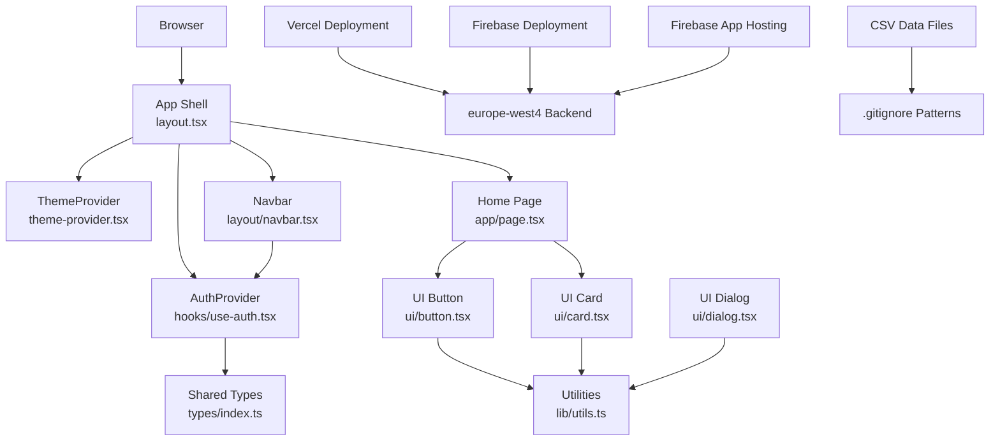
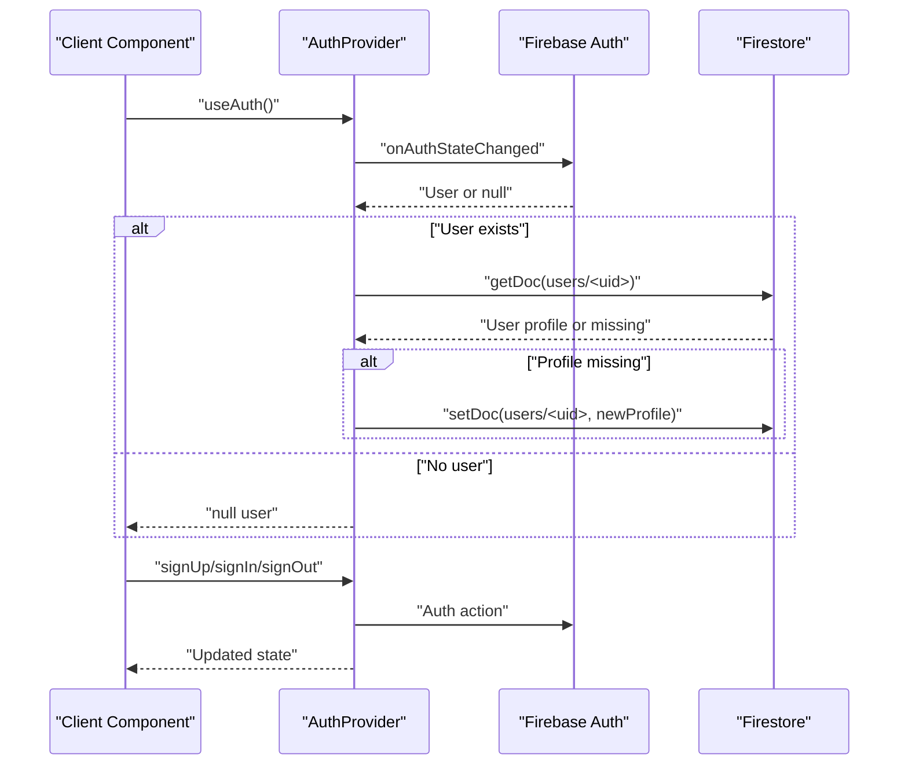
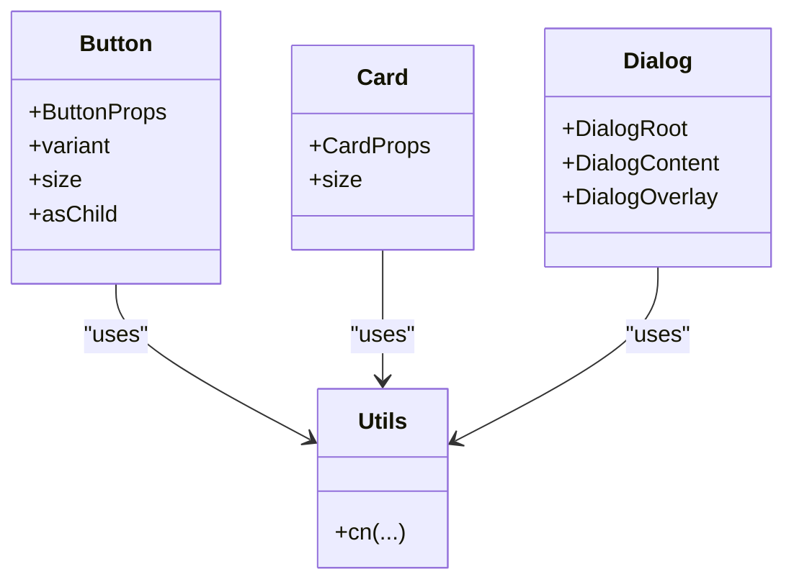
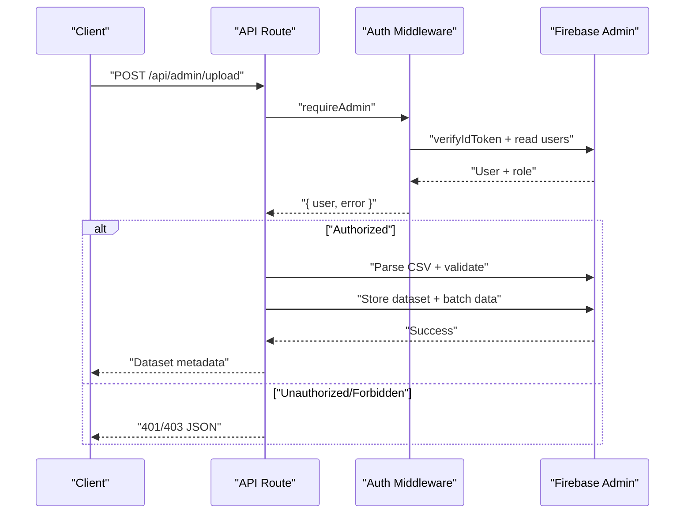
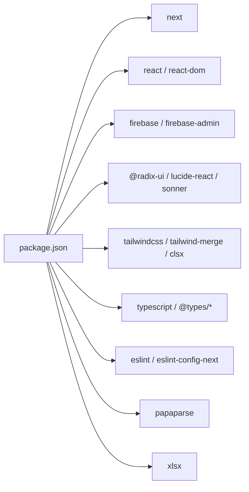

# Development Guidelines

<cite>
**Referenced Files in This Document**
- [.firebaserc](file://.firebaserc)
- [firebase.json](file://firebase.json)
- [tsconfig.json](file://tsconfig.json)
- [eslint.config.mjs](file://eslint.config.mjs)
- [next.config.ts](file://next.config.ts)
- [package.json](file://package.json)
- [components.json](file://components.json)
- [.gitignore](file://.gitignore)
- [AGENTS.md](file://AGENTS.md)
- [src/types/index.ts](file://src/types/index.ts)
- [src/lib/firebase.ts](file://src/lib/firebase.ts)
- [src/lib/firebase-admin.ts](file://src/lib/firebase-admin.ts)
- [src/lib/auth-middleware.ts](file://src/lib/auth-middleware.ts)
- [src/hooks/use-auth.tsx](file://src/hooks/use-auth.tsx)
- [src/components/theme-provider.tsx](file://src/components/theme-provider.tsx)
- [src/components/layout/navbar.tsx](file://src/components/layout/navbar.tsx)
- [src/components/ui/button.tsx](file://src/components/ui/button.tsx)
- [src/components/ui/card.tsx](file://src/components/ui/card.tsx)
- [src/components/ui/dialog.tsx](file://src/components/ui/dialog.tsx)
- [src/components/ui/skeleton.tsx](file://src/components/ui/skeleton.tsx)
- [src/lib/utils.ts](file://src/lib/utils.ts)
- [src/app/layout.tsx](file://src/app/layout.tsx)
- [src/app/page.tsx](file://src/app/page.tsx)
- [src/app/api/admin/analytics/route.ts](file://src/app/api/admin/analytics/route.ts)
- [src/app/api/admin/upload/route.ts](file://src/app/api/admin/upload/route.ts)
- [src/app/admin/upload/page.tsx](file://src/app/admin/upload/page.tsx)
- [src/app/api/datasets/route.ts](file://src/app/api/datasets/route.ts)
- [src/app/api/datasets/[id]/download/route.ts](file://src/app/api/datasets/[id]/download/route.ts)
</cite>

## Update Summary
**Changes Made**
- Added comprehensive build and lint command documentation from AGENTS.md
- Integrated session efficiency practices for memory optimization during development
- Documented code conventions including client-server separation and Firebase architecture
- Added testing procedures and verification steps
- Updated deployment strategies to include Firebase App Hosting and dual hosting setup
- Enhanced Firebase configuration documentation with App Hosting integration

## Table of Contents
1. [Introduction](#introduction)
2. [Project Structure](#project-structure)
3. [Core Components](#core-components)
4. [Architecture Overview](#architecture-overview)
5. [Development Commands](#development-commands)
6. [Session Efficiency Practices](#session-efficiency-practices)
7. [Code Conventions](#code-conventions)
8. [Detailed Component Analysis](#detailed-component-analysis)
9. [Dependency Analysis](#dependency-analysis)
10. [Performance Considerations](#performance-considerations)
11. [Testing Approaches](#testing-approaches)
12. [Code Organization Principles](#code-organization-principants)
13. [Deployment Strategies](#deployment-strategies)
14. [Data File Management](#data-file-management)
15. [Debugging Strategies](#debugging-strategies)
16. [Conclusion](#conclusion)

## Introduction
This document defines Datafrica's development guidelines and best practices. It consolidates TypeScript configuration, ESLint enforcement, component development patterns, state management strategies, testing approaches, performance optimizations for Next.js and Firebase, code organization principles, and debugging recommendations. The goal is to ensure consistent, maintainable, and scalable development across the platform.

## Project Structure
The project follows a Next.js App Router structure with a clear separation of concerns:
- src/app: App Router pages, layouts, API routes, and static assets
- src/components: Reusable UI components and layout pieces
- src/hooks: Custom React hooks
- src/lib: Utility libraries, Firebase integrations, and middleware
- src/types: Shared TypeScript type definitions
- Root configs: TypeScript, ESLint, Next.js, Tailwind, and component aliases
- Firebase configuration: .firebaserc and firebase.json for deployment setup
- Data file management: .gitignore patterns for CSV and other data files

**Diagram sources**
- [src/app/layout.tsx:1-50](file://src/app/layout.tsx#L1-L50)
- [src/app/page.tsx:1-199](file://src/app/page.tsx#L1-L199)
- [src/components/layout/navbar.tsx:1-167](file://src/components/layout/navbar.tsx#L1-L167)
- [src/components/ui/button.tsx:1-58](file://src/components/ui/button.tsx#L1-L58)
- [src/components/ui/card.tsx:1-104](file://src/components/ui/card.tsx#L1-L104)
- [src/components/ui/dialog.tsx:1-120](file://src/components/ui/dialog.tsx#L1-L120)
- [src/components/theme-provider.tsx:1-13](file://src/components/theme-provider.tsx#L1-L13)
- [src/hooks/use-auth.tsx:1-117](file://src/hooks/use-auth.tsx#L1-L117)
- [src/lib/firebase.ts:1-22](file://src/lib/firebase.ts#L1-L22)
- [src/lib/firebase-admin.ts:1-64](file://src/lib/firebase-admin.ts#L1-L64)
- [src/lib/auth-middleware.ts:1-62](file://src/lib/auth-middleware.ts#L1-L62)
- [src/lib/utils.ts:1-7](file://src/lib/utils.ts#L1-L7)
- [src/types/index.ts:1-90](file://src/types/index.ts#L1-L90)
- [tsconfig.json:1-35](file://tsconfig.json#L1-L35)
- [eslint.config.mjs:1-19](file://eslint.config.mjs#L1-L19)
- [next.config.ts:1-8](file://next.config.ts#L1-L8)
- [components.json:1-26](file://components.json#L1-L26)
- [.firebaserc:1-6](file://.firebaserc#L1-L6)
- [firebase.json:1-22](file://firebase.json#L1-L22)
- [.gitignore:36-37](file://.gitignore#L36-L37)
- [package.json:1-52](file://package.json#L1-L52)

**Section sources**
- [src/app/layout.tsx:1-50](file://src/app/layout.tsx#L1-L50)
- [src/app/page.tsx:1-199](file://src/app/page.tsx#L1-L199)
- [src/components/layout/navbar.tsx:1-167](file://src/components/layout/navbar.tsx#L1-L167)
- [src/hooks/use-auth.tsx:1-117](file://src/hooks/use-auth.tsx#L1-L117)
- [src/lib/firebase.ts:1-22](file://src/lib/firebase.ts#L1-L22)
- [src/lib/firebase-admin.ts:1-64](file://src/lib/firebase-admin.ts#L1-L64)
- [src/lib/auth-middleware.ts:1-62](file://src/lib/auth-middleware.ts#L1-L62)
- [src/lib/utils.ts:1-7](file://src/lib/utils.ts#L1-L7)
- [src/types/index.ts:1-90](file://src/types/index.ts#L1-L90)
- [tsconfig.json:1-35](file://tsconfig.json#L1-L35)
- [eslint.config.mjs:1-19](file://eslint.config.mjs#L1-L19)
- [next.config.ts:1-8](file://next.config.ts#L1-L8)
- [components.json:1-26](file://components.json#L1-L26)
- [.firebaserc:1-6](file://.firebaserc#L1-L6)
- [firebase.json:1-22](file://firebase.json#L1-L22)
- [.gitignore:36-37](file://.gitignore#L36-L37)
- [package.json:1-52](file://package.json#L1-L52)

## Core Components
- TypeScript configuration enforces strictness, modern module resolution, and JSX transform for Next.js.
- ESLint integrates Next.js core web vitals and TypeScript rules with explicit overrides.
- Firebase client SDK is initialized and exported for auth, Firestore, and storage.
- Firebase Admin SDK provides server-side operations with lazy initialization and proxy pattern.
- Authentication provider manages user state, persistence, and token retrieval.
- UI primitives (Button, Card, Dialog) demonstrate consistent prop interfaces, variants, and composition patterns.
- Layout composes providers and shared UI to establish theme, auth, navigation, and notifications.
- Firebase deployment configuration establishes hosting and regional backend setup.
- CSV data file management prevents accidental commits of large datasets.

Key configuration highlights:
- Strict TypeScript compiler options, bundler module resolution, and path aliases
- ESLint Next.js recommended rules plus custom ignores
- Next.js config placeholder for future optimization toggles
- Tailwind + shadcn/slots configuration with TSX and RSC enabled
- Firebase project configuration with default project "mydatafrica"
- Firebase Hosting with ignore patterns and europe-west4 backend region
- Dual hosting setup with App Hosting and traditional Firebase Hosting
- CSV file patterns in .gitignore for data file management

**Section sources**
- [tsconfig.json:1-35](file://tsconfig.json#L1-L35)
- [eslint.config.mjs:1-19](file://eslint.config.mjs#L1-L19)
- [next.config.ts:1-8](file://next.config.ts#L1-L8)
- [components.json:1-26](file://components.json#L1-L26)
- [src/lib/firebase.ts:1-22](file://src/lib/firebase.ts#L1-L22)
- [src/lib/firebase-admin.ts:1-64](file://src/lib/firebase-admin.ts#L1-L64)
- [src/hooks/use-auth.tsx:1-117](file://src/hooks/use-auth.tsx#L1-L117)
- [src/components/ui/button.tsx:1-58](file://src/components/ui/button.tsx#L1-L58)
- [src/components/ui/card.tsx:1-104](file://src/components/ui/card.tsx#L1-L104)
- [src/components/ui/dialog.tsx:1-120](file://src/components/ui/dialog.tsx#L1-L120)
- [src/app/layout.tsx:1-50](file://src/app/layout.tsx#L1-L50)
- [.firebaserc:1-6](file://.firebaserc#L1-L6)
- [firebase.json:1-22](file://firebase.json#L1-L22)
- [.gitignore:36-37](file://.gitignore#L36-L37)

## Architecture Overview
The runtime architecture centers around:
- App shell with ThemeProvider and AuthProvider
- Client components consuming custom hooks and UI primitives
- API routes backed by Firebase Admin for secure server-side operations
- Shared types and utilities for consistency
- Multiple deployment targets (Vercel and Firebase) with regional backend support
- CSV data processing pipeline for dataset uploads and downloads

**Diagram sources**
- [src/app/layout.tsx:1-50](file://src/app/layout.tsx#L1-L50)
- [src/components/theme-provider.tsx:1-13](file://src/components/theme-provider.tsx#L1-L13)
- [src/hooks/use-auth.tsx:1-117](file://src/hooks/use-auth.tsx#L1-L117)
- [src/components/layout/navbar.tsx:1-167](file://src/components/layout/navbar.tsx#L1-L167)
- [src/app/page.tsx:1-199](file://src/app/page.tsx#L1-L199)
- [src/components/ui/button.tsx:1-58](file://src/components/ui/button.tsx#L1-L58)
- [src/components/ui/card.tsx:1-104](file://src/components/ui/card.tsx#L1-L104)
- [src/components/ui/dialog.tsx:1-120](file://src/components/ui/dialog.tsx#L1-L120)
- [src/lib/utils.ts:1-7](file://src/lib/utils.ts#L1-L7)
- [src/types/index.ts:1-90](file://src/types/index.ts#L1-L90)
- [firebase.json:1-22](file://firebase.json#L1-L22)
- [.gitignore:36-37](file://.gitignore#L36-L37)

## Development Commands

### Build and Lint Commands
The project provides standardized development commands for building, linting, and running the development server:

**Available Commands:**
- **Build**: `npm run build` - Compiles the Next.js application for production
- **Lint**: `npm run lint` - Runs ESLint across the codebase
- **Dev server**: `npm run dev` - Starts the development server with hot reloading
- **Deploy hosting**: `firebase deploy --only hosting` - Deploys only the hosting portion to Firebase

**Build Process:**
- Next.js compilation with TypeScript checking
- Asset optimization and static generation
- Bundle analysis and optimization
- Environment-specific configuration application

**Lint Process:**
- ESLint analysis with Next.js and TypeScript rules
- Auto-fixable issues resolution
- Import order and code style validation
- Generated files exclusion handling

**Section sources**
- [package.json:5-10](file://package.json#L5-L10)
- [AGENTS.md:9-14](file://AGENTS.md#L9-L14)

## Session Efficiency Practices

### Memory Optimization During Development
To avoid excessive memory consumption during development sessions, follow these session efficiency practices:

**1. Keep Sessions Focused**
- Handle one feature or bug fix per session when possible
- Avoid combining unrelated large tasks in a single session
- Maintain clear boundaries between different development activities

**2. Minimize Sub-agent Usage**
- Only use Task/sub-agents when truly needed (complex multi-file searches, code reviews)
- Prefer direct tool calls (Read, Grep, Glob) for simple lookups
- Use targeted file operations instead of broad searches

**3. Avoid Unnecessary File Reading**
- Use `offset` and `limit` parameters when only a specific section is needed
- Use Grep to find relevant lines first before reading files
- Work from memory when files are already in context

**4. Batch Related Edits**
- When making multiple edits to the same file, plan all changes first
- Execute them together rather than reading the file between each edit
- Reduce I/O operations and improve development speed

**5. Clean Up Background Processes**
- After running builds, dev servers, or deploys, ensure background processes are terminated
- Free up system resources and prevent memory leaks
- Monitor resource usage during development

**Section sources**
- [AGENTS.md:15-24](file://AGENTS.md#L15-L24)

## Code Conventions

### Development Standards and Patterns
The project follows specific code conventions to ensure consistency and maintainability:

**Client-Server Separation:**
- Use `"use client"` directive only when the component needs client-side features (hooks, event handlers, browser APIs)
- All API routes under `src/app/api/` use Firebase Admin SDK (initialized in `src/lib/firebase-admin.ts`)
- Client-side Firebase is in `src/lib/firebase.ts`
- Auth logic is in `src/hooks/use-auth.tsx`

**Internationalization:**
- All user-facing strings must be translated in all 5 locale files (en, fr, pt, es, ar)
- Placeholders and dynamic content should be properly localized
- Use consistent translation keys across the application

**Component Architecture:**
- Use shadcn/ui components from `src/components/ui/`
- Theme support: dark/light mode via `next-themes`
- Maintain consistent prop interfaces and variant patterns
- Follow accessibility guidelines and semantic HTML

**Firebase Integration:**
- Admin guard protects routes under `src/app/admin/`
- Firestore collections: `users`, `datasets`, `purchases`
- Storage bucket path: `datasets/`
- Authentication: Google Sign-In + Email/Password

**Section sources**
- [AGENTS.md:25-33](file://AGENTS.md#L25-L33)
- [src/lib/firebase-admin.ts:1-64](file://src/lib/firebase-admin.ts#L1-L64)
- [src/lib/firebase.ts:1-22](file://src/lib/firebase.ts#L1-L22)
- [src/hooks/use-auth.tsx:1-117](file://src/hooks/use-auth.tsx#L1-L117)

## Detailed Component Analysis

### TypeScript Configuration
- Strict mode enabled for robust type safety
- Modern module resolution via bundler for optimal Next.js DX
- Path aliases mapped to src for concise imports
- JSX transform configured for React Server Components compatibility
- Incremental builds and isolated modules for faster development

Recommendations:
- Keep strict mode enabled; introduce incremental types cautiously
- Prefer path aliases for all internal imports
- Align plugins with Next.js updates

**Section sources**
- [tsconfig.json:1-35](file://tsconfig.json#L1-L35)

### ESLint Configuration
- Integrates Next.js core-web-vitals and TypeScript rules
- Overrides default ignores to include generated Next types and dev types
- Ensures linting across generated artifacts while excluding build artifacts

Recommendations:
- Run lint in CI and pre-commit hooks
- Keep overrides minimal and documented
- Add plugin-specific rules only when necessary

**Section sources**
- [eslint.config.mjs:1-19](file://eslint.config.mjs#L1-L19)

### Authentication Provider and Hooks
The AuthProvider encapsulates:
- Real-time auth state subscription
- Firestore user profile hydration and creation
- Sign-up, sign-in, sign-out actions
- ID token retrieval for protected requests

**Diagram sources**
- [src/hooks/use-auth.tsx:1-117](file://src/hooks/use-auth.tsx#L1-L117)
- [src/lib/firebase.ts:1-22](file://src/lib/firebase.ts#L1-L22)

**Section sources**
- [src/hooks/use-auth.tsx:1-117](file://src/hooks/use-auth.tsx#L1-L117)
- [src/lib/firebase.ts:1-22](file://src/lib/firebase.ts#L1-L22)

### UI Component Patterns
- Prop interfaces extend native HTML attributes and variant props for composability
- Forward refs and slot composition for semantic markup
- Utility-driven class merging for theme-aware styling

Examples:
- Button: variant and size variants with forwardRef
- Card: composite slots for header, title, content, footer
- Dialog: portal overlay with controlled open/close

**Diagram sources**
- [src/components/ui/button.tsx:1-58](file://src/components/ui/button.tsx#L1-L58)
- [src/components/ui/card.tsx:1-104](file://src/components/ui/card.tsx#L1-L104)
- [src/components/ui/dialog.tsx:1-120](file://src/components/ui/dialog.tsx#L1-L120)
- [src/lib/utils.ts:1-7](file://src/lib/utils.ts#L1-L7)

**Section sources**
- [src/components/ui/button.tsx:1-58](file://src/components/ui/button.tsx#L1-L58)
- [src/components/ui/card.tsx:1-104](file://src/components/ui/card.tsx#L1-L104)
- [src/components/ui/dialog.tsx:1-120](file://src/components/ui/dialog.tsx#L1-L120)
- [src/lib/utils.ts:1-7](file://src/lib/utils.ts#L1-L7)

### API Routes and Middleware
- Admin analytics endpoint aggregates counts and recent sales
- Datasets endpoint supports filtering and client-side refinement
- Auth middleware verifies tokens and checks admin roles
- CSV upload endpoint processes large datasets with batched writes
- Download endpoint supports multiple formats (CSV, Excel, JSON)

**Diagram sources**
- [src/app/api/admin/analytics/route.ts:1-78](file://src/app/api/admin/analytics/route.ts#L1-L78)
- [src/app/api/admin/upload/route.ts:1-92](file://src/app/api/admin/upload/route.ts#L1-L92)
- [src/lib/auth-middleware.ts:1-62](file://src/lib/auth-middleware.ts#L1-L62)

**Section sources**
- [src/app/api/admin/analytics/route.ts:1-78](file://src/app/api/admin/analytics/route.ts#L1-L78)
- [src/app/api/admin/upload/route.ts:1-92](file://src/app/api/admin/upload/route.ts#L1-L92)
- [src/app/api/datasets/route.ts:1-62](file://src/app/api/datasets/route.ts#L1-L62)
- [src/lib/auth-middleware.ts:1-62](file://src/lib/auth-middleware.ts#L1-L62)

### Component Lifecycle and State Management
- Navbar demonstrates conditional rendering based on auth loading and user presence
- Home page uses concurrent data fetching with Promise.all and guarded updates
- ThemeProvider sets up system-aware theming with next-themes

**Diagram sources**
- [src/components/layout/navbar.tsx:1-167](file://src/components/layout/navbar.tsx#L1-L167)
- [src/app/page.tsx:1-199](file://src/app/page.tsx#L1-L199)
- [src/components/theme-provider.tsx:1-13](file://src/components/theme-provider.tsx#L1-L13)

**Section sources**
- [src/components/layout/navbar.tsx:1-167](file://src/components/layout/navbar.tsx#L1-L167)
- [src/app/page.tsx:1-199](file://src/app/page.tsx#L1-L199)
- [src/components/theme-provider.tsx:1-13](file://src/components/theme-provider.tsx#L1-L13)

## Dependency Analysis
- Next.js 16.x with App Router and React 19
- Firebase client and admin SDKs for auth, Firestore, and storage
- Radix UI primitives and shadcn/ui for accessible UI
- Tailwind v4 with class merging utilities
- TypeScript 5.x and ESLint 9.x
- Papa Parse for CSV parsing and validation
- SheetJS (XLSX) for Excel file processing

**Diagram sources**
- [package.json:1-52](file://package.json#L1-L52)

**Section sources**
- [package.json:1-52](file://package.json#L1-L52)

## Performance Considerations
- Use concurrent data fetching patterns (Promise.all) to reduce load time
- Lazy-load heavy components and avoid unnecessary re-renders
- Prefer server components for initial HTML generation and minimize client components
- Optimize images and leverage Next.js image optimization
- Cache API responses where safe; invalidate on mutations
- Monitor bundle size and split vendor chunks if needed
- Use Firebase indexing strategies for frequently queried fields
- Enable production profiling and measure Core Web Vitals
- Implement batched writes for large CSV datasets (500 records per batch)
- Use streaming for large file downloads to prevent memory issues

## Testing Approaches
Recommended testing layers:
- Unit tests for pure functions and utilities
- Component tests for UI primitives focusing on variant rendering and accessibility
- Integration tests for hooks to verify state transitions and side effects
- API route tests validating auth middleware, request parsing, and response shape
- CSV parsing tests with various formats and edge cases
- E2E tests for critical flows (authentication, dataset browsing, purchases, CSV uploads)

Focus areas:
- Mock Firebase client and admin SDKs for isolated tests
- Snapshot test UI components to prevent regressions
- Test error paths and loading states
- Verify TypeScript types remain consistent with runtime behavior
- Test CSV parsing with malformed data and large datasets
- Validate batch processing and pagination for large datasets

## Code Organization Principles
- Feature-based grouping under src/components, src/hooks, and src/lib
- Centralized types in src/types for shared contracts
- API routes organized by domain under src/app/api
- CSV data processing separated into dedicated upload/download handlers
- Consistent naming: PascalCase for components, kebab-case for files, camelCase for hooks
- Prefer composition over inheritance; use props and variants for customization
- Keep client components behind "use client" directive and isolate server logic
- Separate data file management from application logic

## Deployment Strategies

### Multi-Platform Deployment Architecture
Datafrica supports deployment across multiple platforms with regional backend optimization:

#### Vercel Deployment (Primary)
- Zero-config deployment with automatic scaling
- Edge network distribution for global CDN
- Automatic HTTPS and SSL certificate management
- Preview deployments for pull requests

#### Firebase Hosting (Secondary/Alternative)
- Static site hosting with Firebase infrastructure
- Regional backend configuration for europe-west4
- Custom ignore patterns for optimized builds
- Integration with Firebase authentication and services

#### Firebase App Hosting (Primary/Production)
**Updated** The project now uses Firebase App Hosting as the primary deployment target:

- **Service ID**: `datafrica`
- **Region**: `europe-west4` (optimized for European market)
- **Auto-deployment**: From GitHub repository
- **Domain**: `datafrica--mydatafrica.europe-west4.hosted.app`
- **Transparent proxy**: Configured as Cloud Run rewrite to App Hosting service
- **Dual hosting setup**: Traditional Firebase Hosting acts as transparent proxy

### Build Optimization for Deployment
- Next.js build artifacts optimized for static hosting
- Asset optimization and compression
- Environment variable handling for different deployment targets
- API route compatibility with both Vercel and Firebase backends
- CSV parsing optimization with streaming for large files

### Regional Backend Strategy
- europe-west4 region selected for European market focus
- Reduced latency for EU users compared to US-based regions
- Compliance with GDPR and European data protection regulations
- Localized API processing for better user experience

**Section sources**
- [.firebaserc:1-6](file://.firebaserc#L1-L6)
- [firebase.json:1-22](file://firebase.json#L1-L22)
- [AGENTS.md:34-39](file://AGENTS.md#L34-L39)

## Data File Management

### CSV Upload Pipeline
The CSV upload system handles large datasets efficiently:

**Upload Process**
1. Admin authentication verification
2. CSV file parsing with Papa Parse
3. Data validation and error handling
4. Batched Firestore writes (500 records per batch)
5. Metadata storage and preview generation

**Processing Features**
- Header-first CSV parsing
- Skip empty lines and malformed entries
- Column detection and validation
- Preview data generation for free access
- Error reporting with detailed parsing information

**Security Measures**
- Admin-only access to upload functionality
- File size limits and validation
- Malformed CSV detection
- Rate limiting for upload attempts

### CSV Download System
**Updated** Enhanced download capabilities:

**Supported Formats**
- CSV: Direct CSV export with headers
- Excel: XLSX format with multiple sheets
- JSON: Structured JSON representation

**Access Control**
- Purchase verification before download
- Token-based temporary access
- Expiration date enforcement
- Usage tracking and audit logs

**Performance Optimization**
- Streaming downloads for large files
- Pagination for dataset browsing
- Efficient data retrieval from Firestore
- Memory management for large exports

**Section sources**
- [src/app/api/admin/upload/route.ts:1-92](file://src/app/api/admin/upload/route.ts#L1-L92)
- [src/app/admin/upload/page.tsx:1-294](file://src/app/admin/upload/page.tsx#L1-L294)
- [src/app/api/datasets/[id]/download/route.ts:1-97](file://src/app/api/datasets/[id]/download/route.ts#L1-L97)

## Debugging Strategies
- Use React DevTools Profiler to identify expensive renders
- Leverage browser network panel to inspect API latency and caching
- Log structured errors in API routes with contextual metadata
- Validate environment variables at startup and fail fast on missing keys
- Use selective console logging during development; remove or gate in prod
- Employ Sentry or equivalent for runtime error monitoring
- Monitor CSV parsing errors and large dataset processing
- Track download token usage and expiration

## Conclusion
These guidelines standardize TypeScript and ESLint configurations, component development patterns, state management, and API design. By adhering to these practices—strict typing, modular UI composition, secure auth flows, CSV data management, and performance-conscious engineering—you can build a reliable, scalable, and maintainable Next.js application integrated with Firebase. The addition of CSV file management patterns, deployment best practices, session efficiency practices, and comprehensive development commands ensures proper handling of large datasets while maintaining clean version control and efficient deployment workflows across both Vercel and Firebase hosting platforms.

The integration of Firebase App Hosting as the primary deployment target, combined with the dual hosting setup, provides redundancy and optimal performance for European users. The session efficiency practices help maintain development productivity while preventing memory issues during intensive development sessions. The comprehensive testing approach ensures code quality and reliability across all components and API endpoints.