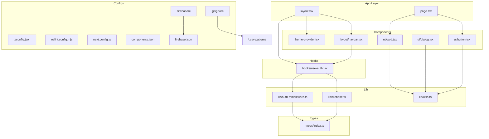
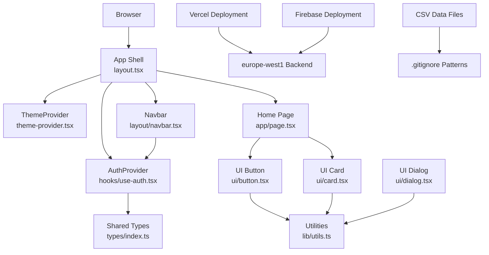
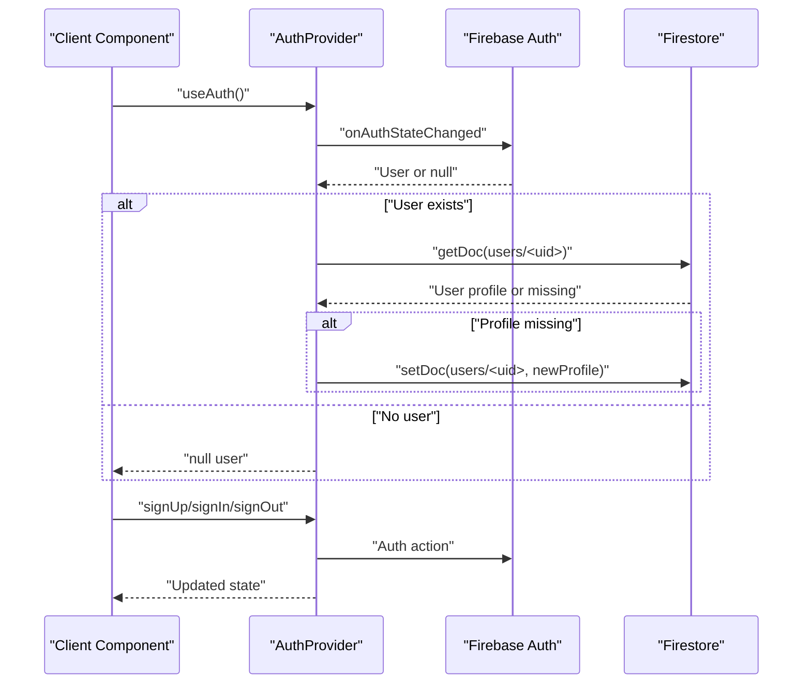
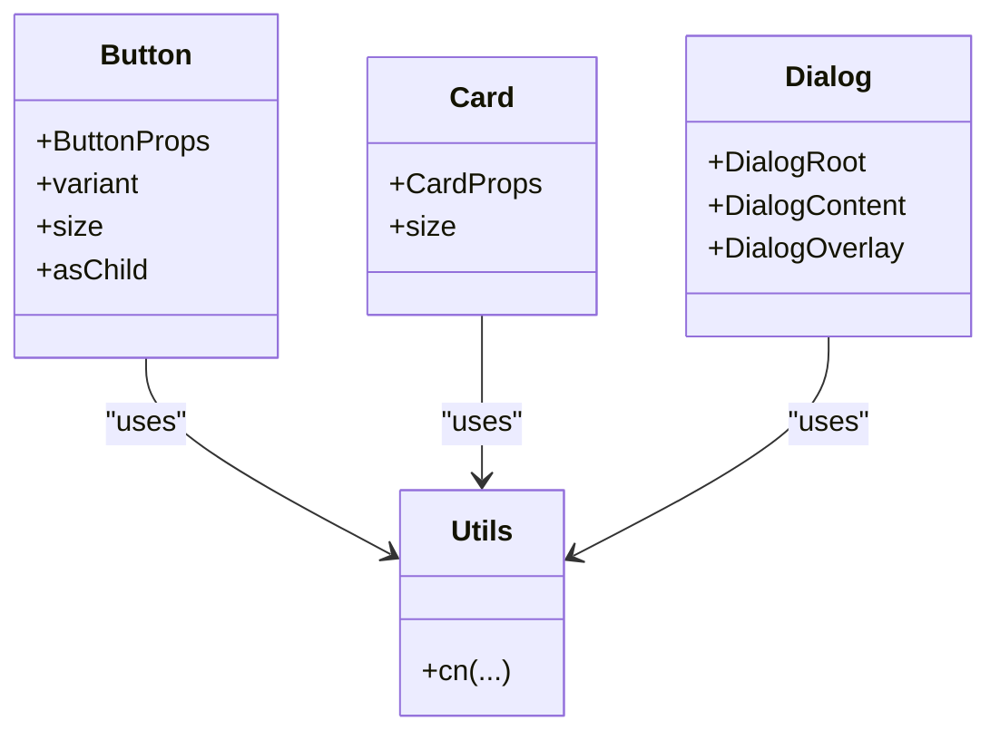
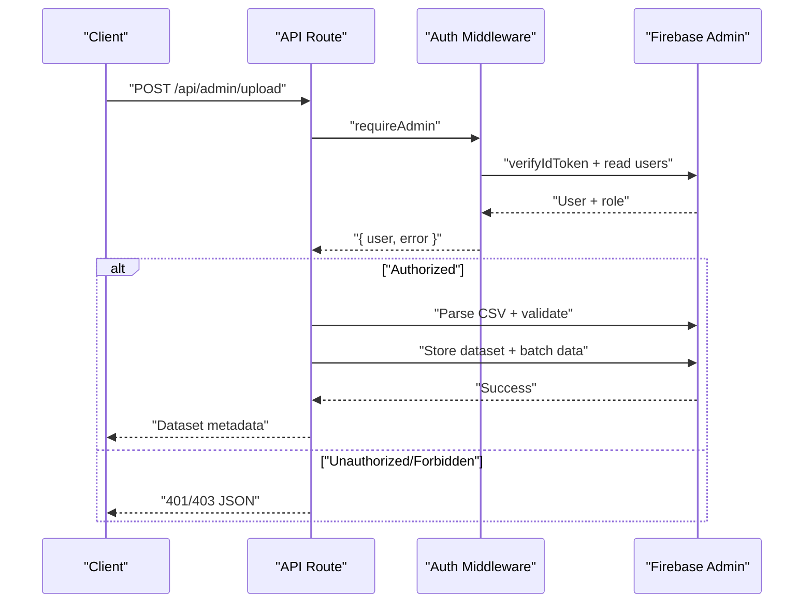
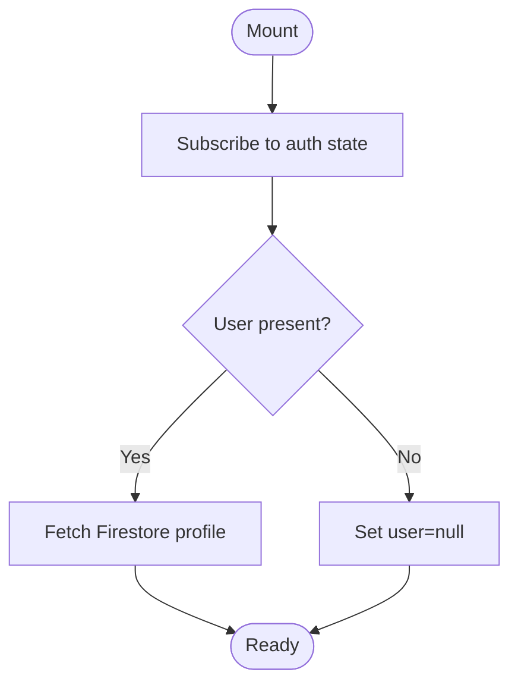
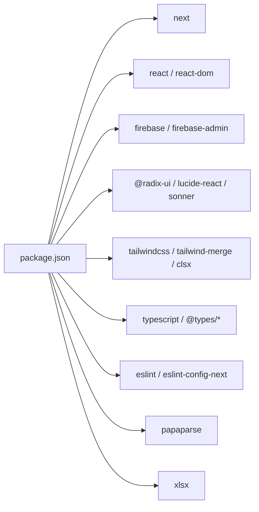

# Development Guidelines

<cite>
**Referenced Files in This Document**
- [.firebaserc](file://.firebaserc)
- [firebase.json](file://firebase.json)
- [tsconfig.json](file://tsconfig.json)
- [eslint.config.mjs](file://eslint.config.mjs)
- [next.config.ts](file://next.config.ts)
- [package.json](file://package.json)
- [components.json](file://components.json)
- [.gitignore](file://.gitignore)
- [src/types/index.ts](file://src/types/index.ts)
- [src/lib/firebase.ts](file://src/lib/firebase.ts)
- [src/lib/auth-middleware.ts](file://src/lib/auth-middleware.ts)
- [src/hooks/use-auth.tsx](file://src/hooks/use-auth.tsx)
- [src/components/theme-provider.tsx](file://src/components/theme-provider.tsx)
- [src/components/layout/navbar.tsx](file://src/components/layout/navbar.tsx)
- [src/components/ui/button.tsx](file://src/components/ui/button.tsx)
- [src/components/ui/card.tsx](file://src/components/ui/card.tsx)
- [src/components/ui/dialog.tsx](file://src/components/ui/dialog.tsx)
- [src/components/ui/skeleton.tsx](file://src/components/ui/skeleton.tsx)
- [src/lib/utils.ts](file://src/lib/utils.ts)
- [src/app/layout.tsx](file://src/app/layout.tsx)
- [src/app/page.tsx](file://src/app/page.tsx)
- [src/app/api/admin/analytics/route.ts](file://src/app/api/admin/analytics/route.ts)
- [src/app/api/admin/upload/route.ts](file://src/app/api/admin/upload/route.ts)
- [src/app/admin/upload/page.tsx](file://src/app/admin/upload/page.tsx)
- [src/app/api/datasets/route.ts](file://src/app/api/datasets/route.ts)
- [src/app/api/datasets/[id]/download/route.ts](file://src/app/api/datasets/[id]/download/route.ts)
</cite>

## Update Summary
**Changes Made**
- Added CSV file patterns to .gitignore for data file management and deployment best practices
- Updated deployment strategies to include CSV data file exclusion patterns
- Enhanced data file management documentation with CSV upload and processing workflows
- Added CSV parsing and validation documentation for dataset uploads

## Table of Contents
1. [Introduction](#introduction)
2. [Project Structure](#project-structure)
3. [Core Components](#core-components)
4. [Architecture Overview](#architecture-overview)
5. [Detailed Component Analysis](#detailed-component-analysis)
6. [Dependency Analysis](#dependency-analysis)
7. [Performance Considerations](#performance-considerations)
8. [Testing Approaches](#testing-approaches)
9. [Code Organization Principles](#code-organization-principants)
10. [Deployment Strategies](#deployment-strategies)
11. [Data File Management](#data-file-management)
12. [Debugging Strategies](#debugging-strategies)
13. [Conclusion](#conclusion)

## Introduction
This document defines Datafrica's development guidelines and best practices. It consolidates TypeScript configuration, ESLint enforcement, component development patterns, state management strategies, testing approaches, performance optimizations for Next.js and Firebase, code organization principles, and debugging recommendations. The goal is to ensure consistent, maintainable, and scalable development across the platform.

## Project Structure
The project follows a Next.js App Router structure with a clear separation of concerns:
- src/app: App Router pages, layouts, API routes, and static assets
- src/components: Reusable UI components and layout pieces
- src/hooks: Custom React hooks
- src/lib: Utility libraries, Firebase integrations, and middleware
- src/types: Shared TypeScript type definitions
- Root configs: TypeScript, ESLint, Next.js, Tailwind, and component aliases
- Firebase configuration: .firebaserc and firebase.json for deployment setup
- Data file management: .gitignore patterns for CSV and other data files

**Diagram sources**
- [src/app/layout.tsx:1-50](file://src/app/layout.tsx#L1-L50)
- [src/app/page.tsx:1-199](file://src/app/page.tsx#L1-L199)
- [src/components/layout/navbar.tsx:1-167](file://src/components/layout/navbar.tsx#L1-L167)
- [src/components/ui/button.tsx:1-58](file://src/components/ui/button.tsx#L1-L58)
- [src/components/ui/card.tsx:1-104](file://src/components/ui/card.tsx#L1-L104)
- [src/components/ui/dialog.tsx:1-120](file://src/components/ui/dialog.tsx#L1-L120)
- [src/components/theme-provider.tsx:1-13](file://src/components/theme-provider.tsx#L1-L13)
- [src/hooks/use-auth.tsx:1-117](file://src/hooks/use-auth.tsx#L1-L117)
- [src/lib/firebase.ts:1-22](file://src/lib/firebase.ts#L1-L22)
- [src/lib/auth-middleware.ts:1-48](file://src/lib/auth-middleware.ts#L1-L48)
- [src/lib/utils.ts:1-7](file://src/lib/utils.ts#L1-L7)
- [src/types/index.ts:1-90](file://src/types/index.ts#L1-L90)
- [tsconfig.json:1-35](file://tsconfig.json#L1-L35)
- [eslint.config.mjs:1-19](file://eslint.config.mjs#L1-L19)
- [next.config.ts:1-8](file://next.config.ts#L1-L8)
- [components.json:1-26](file://components.json#L1-L26)
- [.firebaserc:1-6](file://.firebaserc#L1-L6)
- [firebase.json:1-14](file://firebase.json#L1-L14)
- [.gitignore:36-37](file://.gitignore#L36-L37)

**Section sources**
- [src/app/layout.tsx:1-50](file://src/app/layout.tsx#L1-L50)
- [src/app/page.tsx:1-199](file://src/app/page.tsx#L1-L199)
- [src/components/layout/navbar.tsx:1-167](file://src/components/layout/navbar.tsx#L1-L167)
- [src/hooks/use-auth.tsx:1-117](file://src/hooks/use-auth.tsx#L1-L117)
- [src/lib/firebase.ts:1-22](file://src/lib/firebase.ts#L1-L22)
- [src/lib/auth-middleware.ts:1-48](file://src/lib/auth-middleware.ts#L1-L48)
- [src/lib/utils.ts:1-7](file://src/lib/utils.ts#L1-L7)
- [src/types/index.ts:1-90](file://src/types/index.ts#L1-L90)
- [tsconfig.json:1-35](file://tsconfig.json#L1-L35)
- [eslint.config.mjs:1-19](file://eslint.config.mjs#L1-L19)
- [next.config.ts:1-8](file://next.config.ts#L1-L8)
- [components.json:1-26](file://components.json#L1-L26)
- [.firebaserc:1-6](file://.firebaserc#L1-L6)
- [firebase.json:1-14](file://firebase.json#L1-L14)
- [.gitignore:36-37](file://.gitignore#L36-L37)

## Core Components
- TypeScript configuration enforces strictness, modern module resolution, and JSX transform for Next.js.
- ESLint integrates Next.js core web vitals and TypeScript rules with explicit overrides.
- Firebase client SDK is initialized and exported for auth, Firestore, and storage.
- Authentication provider manages user state, persistence, and token retrieval.
- UI primitives (Button, Card, Dialog) demonstrate consistent prop interfaces, variants, and composition patterns.
- Layout composes providers and shared UI to establish theme, auth, navigation, and notifications.
- Firebase deployment configuration establishes hosting and regional backend setup.
- CSV data file management prevents accidental commits of large datasets.

Key configuration highlights:
- Strict TypeScript compiler options, bundler module resolution, and path aliases
- ESLint Next.js recommended rules plus custom ignores
- Next.js config placeholder for future optimization toggles
- Tailwind + shadcn/slots configuration with TSX and RSC enabled
- Firebase project configuration with default project "mydatafrica"
- Firebase Hosting with ignore patterns and europe-west1 backend region
- CSV file patterns in .gitignore for data file management

**Section sources**
- [tsconfig.json:1-35](file://tsconfig.json#L1-L35)
- [eslint.config.mjs:1-19](file://eslint.config.mjs#L1-L19)
- [next.config.ts:1-8](file://next.config.ts#L1-L8)
- [components.json:1-26](file://components.json#L1-L26)
- [src/lib/firebase.ts:1-22](file://src/lib/firebase.ts#L1-L22)
- [src/hooks/use-auth.tsx:1-117](file://src/hooks/use-auth.tsx#L1-L117)
- [src/components/ui/button.tsx:1-58](file://src/components/ui/button.tsx#L1-L58)
- [src/components/ui/card.tsx:1-104](file://src/components/ui/card.tsx#L1-L104)
- [src/components/ui/dialog.tsx:1-120](file://src/components/ui/dialog.tsx#L1-L120)
- [src/app/layout.tsx:1-50](file://src/app/layout.tsx#L1-L50)
- [.firebaserc:1-6](file://.firebaserc#L1-L6)
- [firebase.json:1-14](file://firebase.json#L1-L14)
- [.gitignore:36-37](file://.gitignore#L36-L37)

## Architecture Overview
The runtime architecture centers around:
- App shell with ThemeProvider and AuthProvider
- Client components consuming custom hooks and UI primitives
- API routes backed by Firebase Admin for secure server-side operations
- Shared types and utilities for consistency
- Multiple deployment targets (Vercel and Firebase) with regional backend support
- CSV data processing pipeline for dataset uploads and downloads

**Diagram sources**
- [src/app/layout.tsx:1-50](file://src/app/layout.tsx#L1-L50)
- [src/components/theme-provider.tsx:1-13](file://src/components/theme-provider.tsx#L1-L13)
- [src/hooks/use-auth.tsx:1-117](file://src/hooks/use-auth.tsx#L1-L117)
- [src/components/layout/navbar.tsx:1-167](file://src/components/layout/navbar.tsx#L1-L167)
- [src/app/page.tsx:1-199](file://src/app/page.tsx#L1-L199)
- [src/components/ui/button.tsx:1-58](file://src/components/ui/button.tsx#L1-L58)
- [src/components/ui/card.tsx:1-104](file://src/components/ui/card.tsx#L1-L104)
- [src/components/ui/dialog.tsx:1-120](file://src/components/ui/dialog.tsx#L1-L120)
- [src/lib/utils.ts:1-7](file://src/lib/utils.ts#L1-L7)
- [src/types/index.ts:1-90](file://src/types/index.ts#L1-L90)
- [firebase.json:1-14](file://firebase.json#L1-L14)
- [.gitignore:36-37](file://.gitignore#L36-L37)

## Detailed Component Analysis

### TypeScript Configuration
- Strict mode enabled for robust type safety
- Modern module resolution via bundler for optimal Next.js DX
- Path aliases mapped to src for concise imports
- JSX transform configured for React Server Components compatibility
- Incremental builds and isolated modules for faster development

Recommendations:
- Keep strict mode enabled; introduce incremental types cautiously
- Prefer path aliases for all internal imports
- Align plugins with Next.js updates

**Section sources**
- [tsconfig.json:1-35](file://tsconfig.json#L1-L35)

### ESLint Configuration
- Integrates Next.js core-web-vitals and TypeScript rules
- Overrides default ignores to include generated Next types and dev types
- Ensures linting across generated artifacts while excluding build artifacts

Recommendations:
- Run lint in CI and pre-commit hooks
- Keep overrides minimal and documented
- Add plugin-specific rules only when necessary

**Section sources**
- [eslint.config.mjs:1-19](file://eslint.config.mjs#L1-L19)

### Authentication Provider and Hooks
The AuthProvider encapsulates:
- Real-time auth state subscription
- Firestore user profile hydration and creation
- Sign-up, sign-in, sign-out actions
- ID token retrieval for protected requests

**Diagram sources**
- [src/hooks/use-auth.tsx:1-117](file://src/hooks/use-auth.tsx#L1-L117)
- [src/lib/firebase.ts:1-22](file://src/lib/firebase.ts#L1-L22)

**Section sources**
- [src/hooks/use-auth.tsx:1-117](file://src/hooks/use-auth.tsx#L1-L117)
- [src/lib/firebase.ts:1-22](file://src/lib/firebase.ts#L1-L22)

### UI Component Patterns
- Prop interfaces extend native HTML attributes and variant props for composability
- Forward refs and slot composition for semantic markup
- Utility-driven class merging for theme-aware styling

Examples:
- Button: variant and size variants with forwardRef
- Card: composite slots for header, title, content, footer
- Dialog: portal overlay with controlled open/close

**Diagram sources**
- [src/components/ui/button.tsx:1-58](file://src/components/ui/button.tsx#L1-L58)
- [src/components/ui/card.tsx:1-104](file://src/components/ui/card.tsx#L1-L104)
- [src/components/ui/dialog.tsx:1-120](file://src/components/ui/dialog.tsx#L1-L120)
- [src/lib/utils.ts:1-7](file://src/lib/utils.ts#L1-L7)

**Section sources**
- [src/components/ui/button.tsx:1-58](file://src/components/ui/button.tsx#L1-L58)
- [src/components/ui/card.tsx:1-104](file://src/components/ui/card.tsx#L1-L104)
- [src/components/ui/dialog.tsx:1-120](file://src/components/ui/dialog.tsx#L1-L120)
- [src/lib/utils.ts:1-7](file://src/lib/utils.ts#L1-L7)

### API Routes and Middleware
- Admin analytics endpoint aggregates counts and recent sales
- Datasets endpoint supports filtering and client-side refinement
- Auth middleware verifies tokens and checks admin roles
- CSV upload endpoint processes large datasets with batched writes
- Download endpoint supports multiple formats (CSV, Excel, JSON)

**Diagram sources**
- [src/app/api/admin/analytics/route.ts:1-78](file://src/app/api/admin/analytics/route.ts#L1-L78)
- [src/app/api/admin/upload/route.ts:1-92](file://src/app/api/admin/upload/route.ts#L1-L92)
- [src/lib/auth-middleware.ts:1-48](file://src/lib/auth-middleware.ts#L1-L48)

**Section sources**
- [src/app/api/admin/analytics/route.ts:1-78](file://src/app/api/admin/analytics/route.ts#L1-L78)
- [src/app/api/admin/upload/route.ts:1-92](file://src/app/api/admin/upload/route.ts#L1-L92)
- [src/app/api/datasets/route.ts:1-62](file://src/app/api/datasets/route.ts#L1-L62)
- [src/lib/auth-middleware.ts:1-48](file://src/lib/auth-middleware.ts#L1-L48)

### Component Lifecycle and State Management
- Navbar demonstrates conditional rendering based on auth loading and user presence
- Home page uses concurrent data fetching with Promise.all and guarded updates
- ThemeProvider sets up system-aware theming with next-themes

**Diagram sources**
- [src/components/layout/navbar.tsx:1-167](file://src/components/layout/navbar.tsx#L1-L167)
- [src/app/page.tsx:1-199](file://src/app/page.tsx#L1-L199)
- [src/components/theme-provider.tsx:1-13](file://src/components/theme-provider.tsx#L1-L13)

**Section sources**
- [src/components/layout/navbar.tsx:1-167](file://src/components/layout/navbar.tsx#L1-L167)
- [src/app/page.tsx:1-199](file://src/app/page.tsx#L1-L199)
- [src/components/theme-provider.tsx:1-13](file://src/components/theme-provider.tsx#L1-L13)

## Dependency Analysis
- Next.js 16.x with App Router and React 19
- Firebase client and admin SDKs for auth, Firestore, and storage
- Radix UI primitives and shadcn/ui for accessible UI
- Tailwind v4 with class merging utilities
- TypeScript 5.x and ESLint 9.x
- Papa Parse for CSV parsing and validation
- SheetJS (XLSX) for Excel file processing

**Diagram sources**
- [package.json:1-51](file://package.json#L1-L51)

**Section sources**
- [package.json:1-51](file://package.json#L1-L51)

## Performance Considerations
- Use concurrent data fetching patterns (Promise.all) to reduce load time
- Lazy-load heavy components and avoid unnecessary re-renders
- Prefer server components for initial HTML generation and minimize client components
- Optimize images and leverage Next.js image optimization
- Cache API responses where safe; invalidate on mutations
- Monitor bundle size and split vendor chunks if needed
- Use Firebase indexing strategies for frequently queried fields
- Enable production profiling and measure Core Web Vitals
- Implement batched writes for large CSV datasets (500 records per batch)
- Use streaming for large file downloads to prevent memory issues

## Testing Approaches
Recommended testing layers:
- Unit tests for pure functions and utilities
- Component tests for UI primitives focusing on variant rendering and accessibility
- Integration tests for hooks to verify state transitions and side effects
- API route tests validating auth middleware, request parsing, and response shape
- CSV parsing tests with various formats and edge cases
- E2E tests for critical flows (authentication, dataset browsing, purchases, CSV uploads)

Focus areas:
- Mock Firebase client and admin SDKs for isolated tests
- Snapshot test UI components to prevent regressions
- Test error paths and loading states
- Verify TypeScript types remain consistent with runtime behavior
- Test CSV parsing with malformed data and large datasets
- Validate batch processing and pagination for large datasets

## Code Organization Principles
- Feature-based grouping under src/components, src/hooks, and src/lib
- Centralized types in src/types for shared contracts
- API routes organized by domain under src/app/api
- CSV data processing separated into dedicated upload/download handlers
- Consistent naming: PascalCase for components, kebab-case for files, camelCase for hooks
- Prefer composition over inheritance; use props and variants for customization
- Keep client components behind "use client" directive and isolate server logic
- Separate data file management from application logic

## Deployment Strategies

### Multi-Platform Deployment Architecture
Datafrica supports deployment across multiple platforms with regional backend optimization:

#### Vercel Deployment (Primary)
- Zero-config deployment with automatic scaling
- Edge network distribution for global CDN
- Automatic HTTPS and SSL certificate management
- Preview deployments for pull requests

#### Firebase Hosting (Secondary/Alternative)
- Static site hosting with Firebase infrastructure
- Regional backend configuration for europe-west1
- Custom ignore patterns for optimized builds
- Integration with Firebase authentication and services

### CSV Data File Management
**Updated** The project now includes comprehensive CSV data file management:

**Git Ignore Patterns (.gitignore)**
- CSV files excluded globally: `*.csv`
- Prevents accidental commits of large dataset files
- Protects sensitive business data from version control
- Reduces repository size and improves clone performance

**Data File Management Best Practices**
- Store CSV datasets in local development environments only
- Use Firebase Storage for production dataset hosting
- Implement proper access controls and authentication
- Compress large datasets before upload
- Validate CSV structure before processing
- Handle encoding issues (UTF-8, UTF-8-BOM)

### Build Optimization for Deployment
- Next.js build artifacts optimized for static hosting
- Asset optimization and compression
- Environment variable handling for different deployment targets
- API route compatibility with both Vercel and Firebase backends
- CSV parsing optimization with streaming for large files

### Regional Backend Strategy
- europe-west1 region selected for European market focus
- Reduced latency for EU users compared to US-based regions
- Compliance with GDPR and European data protection regulations
- Localized API processing for better user experience

**Section sources**
- [.firebaserc:1-6](file://.firebaserc#L1-L6)
- [firebase.json:1-14](file://firebase.json#L1-L14)
- [.gitignore:36-37](file://.gitignore#L36-L37)

## Data File Management

### CSV Upload Pipeline
The CSV upload system handles large datasets efficiently:

**Upload Process**
1. Admin authentication verification
2. CSV file parsing with Papa Parse
3. Data validation and error handling
4. Batched Firestore writes (500 records per batch)
5. Metadata storage and preview generation

**Processing Features**
- Header-first CSV parsing
- Skip empty lines and malformed entries
- Column detection and validation
- Preview data generation for free access
- Error reporting with detailed parsing information

**Security Measures**
- Admin-only access to upload functionality
- File size limits and validation
- Malformed CSV detection
- Rate limiting for upload attempts

### CSV Download System
**Updated** Enhanced download capabilities:

**Supported Formats**
- CSV: Direct CSV export with headers
- Excel: XLSX format with multiple sheets
- JSON: Structured JSON representation

**Access Control**
- Purchase verification before download
- Token-based temporary access
- Expiration date enforcement
- Usage tracking and audit logs

**Performance Optimization**
- Streaming downloads for large files
- Pagination for dataset browsing
- Efficient data retrieval from Firestore
- Memory management for large exports

**Section sources**
- [src/app/api/admin/upload/route.ts:1-92](file://src/app/api/admin/upload/route.ts#L1-L92)
- [src/app/admin/upload/page.tsx:1-294](file://src/app/admin/upload/page.tsx#L1-L294)
- [src/app/api/datasets/[id]/download/route.ts:1-97](file://src/app/api/datasets/[id]/download/route.ts#L1-L97)

## Debugging Strategies
- Use React DevTools Profiler to identify expensive renders
- Leverage browser network panel to inspect API latency and caching
- Log structured errors in API routes with contextual metadata
- Validate environment variables at startup and fail fast on missing keys
- Use selective console logging during development; remove or gate in prod
- Employ Sentry or equivalent for runtime error monitoring
- Monitor CSV parsing errors and large dataset processing
- Track download token usage and expiration

## Conclusion
These guidelines standardize TypeScript and ESLint configurations, component development patterns, state management, and API design. By adhering to these practices—strict typing, modular UI composition, secure auth flows, CSV data management, and performance-conscious engineering—you can build a reliable, scalable, and maintainable Next.js application integrated with Firebase. The addition of CSV file management patterns and deployment best practices ensures proper handling of large datasets while maintaining clean version control and efficient deployment workflows across both Vercel and Firebase hosting platforms.