# Google Cloud App Hosting Deployment

<cite>
**Referenced Files in This Document**
- [apphosting.yaml](file://apphosting.yaml)
- [firebase.json](file://firebase.json)
- [package.json](file://package.json)
- [next.config.ts](file://next.config.ts)
- [public_hosting/placeholder.html](file://public_hosting/placeholder.html)
- [.firebaserc](file://.firebaserc)
- [src/lib/firebase-admin.ts](file://src/lib/firebase-admin.ts)
- [src/lib/auth-middleware.ts](file://src/lib/auth-middleware.ts)
- [src/app/layout.tsx](file://src/app/layout.tsx)
- [src/app/globals.css](file://src/app/globals.css)
- [src/app/(auth)/login/page.tsx](file://src/app/(auth)/login/page.tsx)
- [src/app/admin/page.tsx](file://src/app/admin/page.tsx)
- [src/hooks/use-auth.tsx](file://src/hooks/use-auth.tsx)
- [src/components/payment/kkiapay-button.tsx](file://src/components/payment/kkiapay-button.tsx)
- [src/app/api/payments/webhook/route.ts](file://src/app/api/payments/webhook/route.ts)
- [src/app/api/payments/verify/route.ts](file://src/app/api/payments/verify/route.ts)
- [src/app/datasets/[id]/page.tsx](file://src/app/datasets/[id]/page.tsx)
</cite>

## Update Summary
**Changes Made**
- Updated Firebase Hosting configuration to use Cloud Run rewrite instead of static redirects
- Removed legacy redirect system in favor of dynamic Cloud Run rewrites
- Updated architecture diagrams to reflect new rewrite-based routing
- Revised deployment configuration to reflect Cloud Run service integration
- Enhanced security implementation with ADC (Application Default Credentials)
- Updated troubleshooting guide to address rewrite configuration issues

## Table of Contents
1. [Introduction](#introduction)
2. [Project Structure](#project-structure)
3. [Core Components](#core-components)
4. [Architecture Overview](#architecture-overview)
5. [Payment System Architecture](#payment-system-architecture)
6. [Detailed Component Analysis](#detailed-component-analysis)
7. [Deployment Configuration](#deployment-configuration)
8. [Security Implementation](#security-implementation)
9. [Deployment Security Improvements](#deployment-security-improvements)
10. [Performance Considerations](#performance-considerations)
11. [Troubleshooting Guide](#troubleshooting-guide)
12. [Conclusion](#conclusion)

## Introduction

This document provides comprehensive documentation for deploying a Next.js application to Google Cloud App Hosting. The project is a data marketplace platform called "Datafrica" that enables users to browse, preview, and purchase African datasets. The application leverages Firebase for authentication and backend services while being configured for deployment on Google Cloud's managed hosting platform.

The deployment architecture utilizes Google Cloud App Hosting's serverless framework capabilities, providing automatic scaling, regional deployment, and seamless integration with Firebase services. The application follows modern React patterns with TypeScript, implements robust authentication middleware, includes comprehensive admin functionality for dataset management, and features a complete payment system integrated with KKiaPay for African market transactions.

**Updated**: The application now uses Cloud Run rewrite configuration instead of static redirect-based hosting. The Firebase Hosting configuration has been updated to route all requests to the Cloud Run service, eliminating the need for separate redirect rules and providing more efficient request handling through dynamic rewrites.

## Project Structure

The project follows a standard Next.js 13+ App Router structure with enhanced Firebase Hosting configuration and Cloud Run rewrite integration:

```mermaid
graph TB
subgraph "Application Root"
SRC[src/] --> APP[src/app/]
SRC --> LIB[src/lib/]
SRC --> COMPONENTS[src/components/]
SRC --> HOOKS[src/hooks/]
SRC --> TYPES[src/types/]
PUBLIC_HOSTING[public_hosting/] --> PLACEHOLDER_HTML[placeholder.html]
PUBLIC_HOSTING --> STATIC_ASSETS[Static Assets]
CONFIG[Configuration Files]
CONFIG --> APPHOSTING[apphosting.yaml]
CONFIG --> FIREBASE[firebase.json]
CONFIG --> NEXT[next.config.ts]
CONFIG --> PACKAGE[package.json]
end
subgraph "App Router Structure"
APP --> AUTH[(auth)/]
APP --> ADMIN[admin/]
APP --> API[api/]
APP --> DATASETS[datasets/]
APP --> DASHBOARD[dashboard/]
AUTH --> LOGIN[login/page.tsx]
AUTH --> REGISTER[register/page.tsx]
ADMIN --> ADMIN_PAGE[page.tsx]
ADMIN --> ANALYTICS[analytics/page.tsx]
ADMIN --> UPLOAD[upload/page.tsx]
ADMIN --> USERS[users/page.tsx]
API --> ADMIN_API[admin/]
API --> DATASET_API[datasets/]
API --> AUTH_API[auth/]
API --> PAYMENTS[payments/]
PAYMENTS --> WEBHOOK[webhook/route.ts]
PAYMENTS --> VERIFY[verify/route.ts]
DATASETS --> ID[datasets/[id]/page.tsx]
end
subgraph "Shared Components"
COMPONENTS --> LAYOUT[layout/]
COMPONENTS --> UI[ui/]
COMPONENTS --> DATASET[dataset/]
COMPONENTS --> PAYMENT[payment/]
PAYMENT --> KKIAPAY_BUTTON[kkiapay-button.tsx]
LAYOUT --> NAVBAR[navbar.tsx]
LAYOUT --> FOOTER[footer.tsx]
UI --> BUTTON[button.tsx]
UI --> CARD[card.tsx]
UI --> INPUT[input.tsx]
UI --> TABLE[table.tsx]
end
```

**Diagram sources**
- [src/app/layout.tsx:1-57](file://src/app/layout.tsx#L1-L57)
- [src/app/(auth)/login/page.tsx:1-98](file://src/app/(auth)/login/page.tsx#L1-L98)
- [src/app/admin/page.tsx:1-242](file://src/app/admin/page.tsx#L1-L242)
- [src/components/payment/kkiapay-button.tsx:1-110](file://src/components/payment/kkiapay-button.tsx#L1-L110)
- [public_hosting/placeholder.html:1-2](file://public_hosting/placeholder.html#L1-L2)

**Section sources**
- [src/app/layout.tsx:1-57](file://src/app/layout.tsx#L1-L57)
- [src/app/globals.css:1-208](file://src/app/globals.css#L1-L208)

## Core Components

### Authentication System

The application implements a dual-layer authentication system combining Firebase client-side authentication with server-side verification:

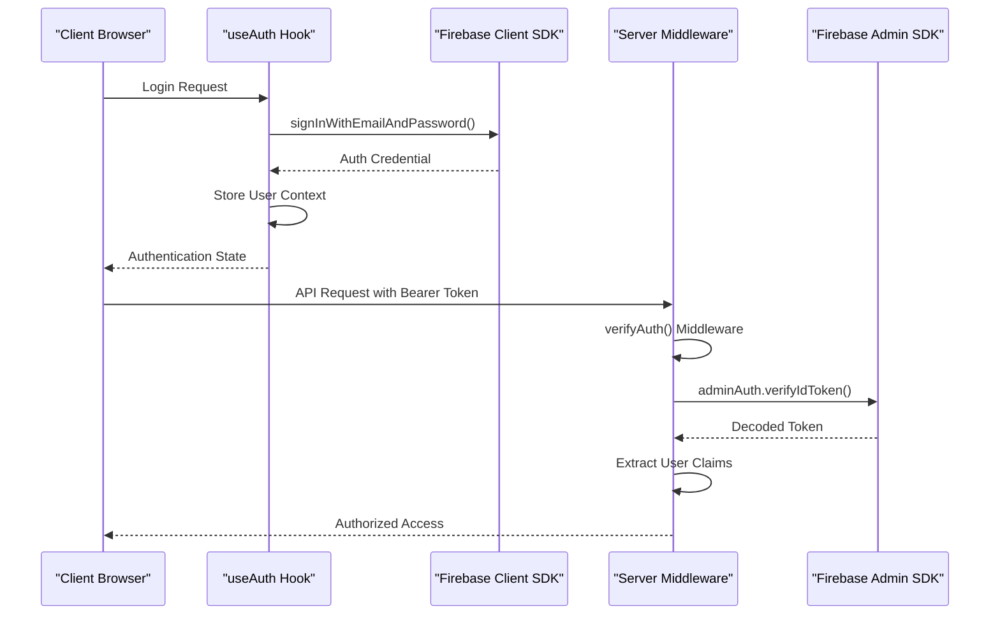

**Diagram sources**
- [src/hooks/use-auth.tsx:1-117](file://src/hooks/use-auth.tsx#L1-L117)
- [src/lib/auth-middleware.ts:1-48](file://src/lib/auth-middleware.ts#L1-L48)
- [src/lib/firebase-admin.ts:1-58](file://src/lib/firebase-admin.ts#L1-L58)

### Admin Dashboard Architecture

The admin panel provides comprehensive dataset management capabilities with real-time analytics:

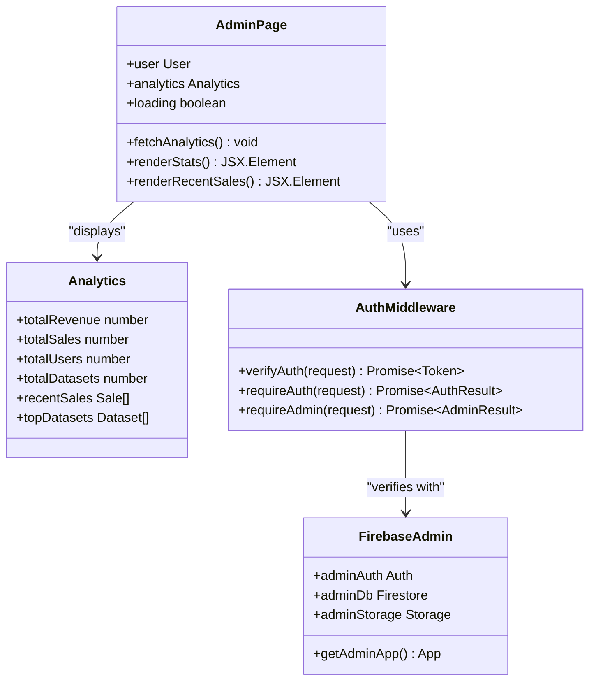

**Diagram sources**
- [src/app/admin/page.tsx:1-242](file://src/app/admin/page.tsx#L1-L242)
- [src/lib/auth-middleware.ts:1-48](file://src/lib/auth-middleware.ts#L1-L48)
- [src/lib/firebase-admin.ts:1-58](file://src/lib/firebase-admin.ts#L1-L58)

**Section sources**
- [src/hooks/use-auth.tsx:1-117](file://src/hooks/use-auth.tsx#L1-L117)
- [src/lib/auth-middleware.ts:1-48](file://src/lib/auth-middleware.ts#L1-L48)
- [src/app/admin/page.tsx:1-242](file://src/app/admin/page.tsx#L1-L242)

## Architecture Overview

The application follows a modern cloud-native architecture designed for scalability and reliability with Cloud Run rewrite configuration:

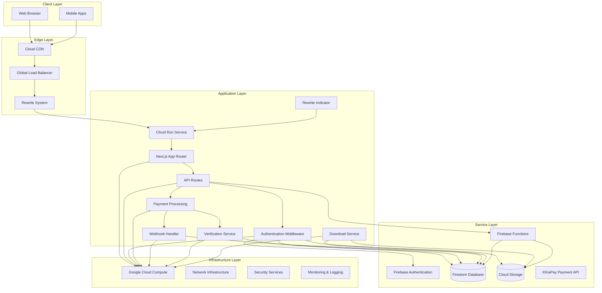

**Diagram sources**
- [apphosting.yaml:1-102](file://apphosting.yaml#L1-L102)
- [firebase.json:11-19](file://firebase.json#L11-L19)
- [public_hosting/placeholder.html:1-2](file://public_hosting/placeholder.html#L1-L2)
- [src/lib/firebase-admin.ts:1-58](file://src/lib/firebase-admin.ts#L1-L58)
- [src/components/payment/kkiapay-button.tsx:1-110](file://src/components/payment/kkiapay-button.tsx#L1-L110)

The architecture leverages Google Cloud App Hosting's automatic scaling capabilities, with the application configured to handle varying traffic loads efficiently. The system uses Firebase services for authentication and data storage, provides seamless integration with the Google Cloud ecosystem, includes comprehensive payment processing through KKiaPay, and implements a robust rewrite system for dynamic request routing.

## Payment System Architecture

The application implements a comprehensive payment system with KKiaPay integration for African market transactions:

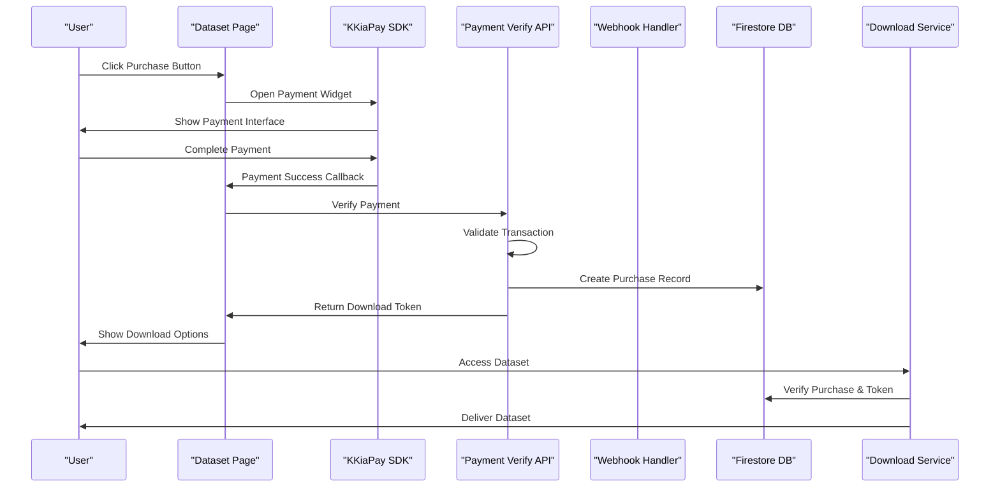

**Diagram sources**
- [src/components/payment/kkiapay-button.tsx:38-80](file://src/components/payment/kkiapay-button.tsx#L38-L80)
- [src/app/api/payments/verify/route.ts:47-96](file://src/app/api/payments/verify/route.ts#L47-L96)
- [src/app/api/payments/webhook/route.ts:5-24](file://src/app/api/payments/webhook/route.ts#L5-L24)

### Payment Flow Components

The payment system consists of several interconnected components:

1. **KKiaPay Button Component**: Client-side payment initiation
2. **Payment Verification API**: Server-side transaction validation
3. **Webhook Handler**: Real-time payment confirmation
4. **Purchase Management**: Database persistence and download token generation
5. **Download Service**: Secure dataset access control

**Section sources**
- [src/components/payment/kkiapay-button.tsx:1-110](file://src/components/payment/kkiapay-button.tsx#L1-L110)
- [src/app/api/payments/verify/route.ts:1-135](file://src/app/api/payments/verify/route.ts#L1-L135)
- [src/app/api/payments/webhook/route.ts:1-82](file://src/app/api/payments/webhook/route.ts#L1-L82)

## Detailed Component Analysis

### Firebase Authentication Implementation

The authentication system implements a sophisticated token-based approach with both client-side and server-side verification:

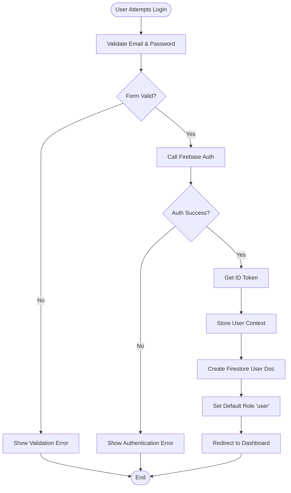

**Diagram sources**
- [src/hooks/use-auth.tsx:69-82](file://src/hooks/use-auth.tsx#L69-L82)
- [src/hooks/use-auth.tsx:39-67](file://src/hooks/use-auth.tsx#L39-L67)

The implementation includes automatic user profile creation in Firestore, role-based access control, and seamless integration with Firebase's authentication state management.

### Admin Route Protection

The application implements comprehensive route protection using middleware patterns:

| Route Pattern | Required Role | Protection Mechanism | Purpose |
|---------------|---------------|---------------------|---------|
| `/admin` | Admin | `requireAdmin()` middleware | Admin dashboard access |
| `/admin/analytics` | Admin | `requireAdmin()` middleware | Analytics data retrieval |
| `/admin/upload` | Admin | `requireAdmin()` middleware | Dataset upload interface |
| `/admin/users` | Admin | `requireAdmin()` middleware | User management |
| `/api/admin/*` | Admin | Server-side token verification | Protected API endpoints |

**Section sources**
- [src/lib/auth-middleware.ts:30-47](file://src/lib/auth-middleware.ts#L30-L47)
- [src/app/admin/page.tsx:44-48](file://src/app/admin/page.tsx#L44-L48)

### Data Management Components

The dataset management system includes comprehensive CRUD operations and preview capabilities:

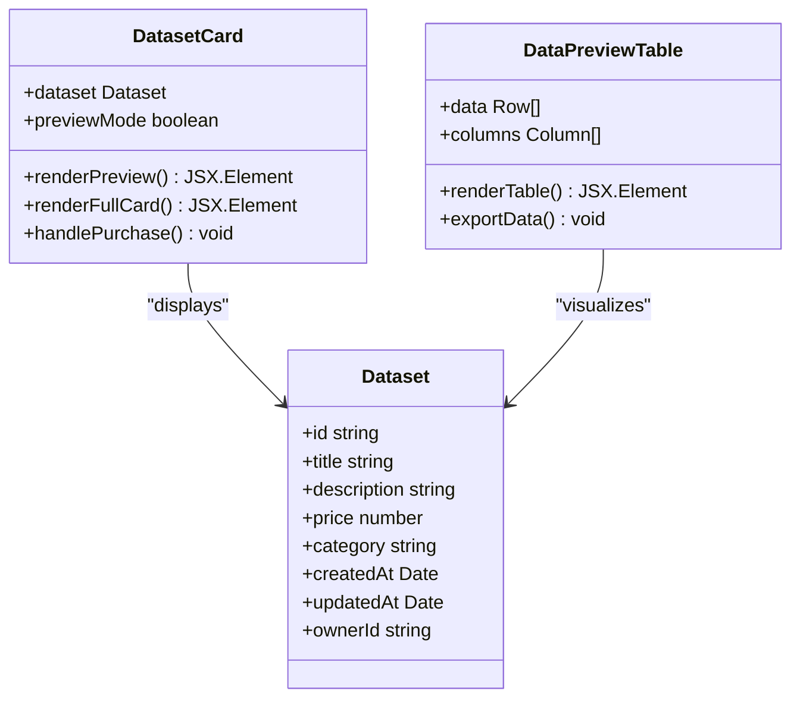

**Diagram sources**
- [src/components/dataset/dataset-card.tsx](file://src/components/dataset/dataset-card.tsx)
- [src/components/dataset/data-preview-table.tsx](file://src/components/dataset/data-preview-table.tsx)

**Section sources**
- [src/components/dataset/dataset-card.tsx](file://src/components/dataset/dataset-card.tsx)
- [src/components/dataset/data-preview-table.tsx](file://src/components/dataset/data-preview-table.tsx)

### KKiaPay Payment Integration

The payment system implements a comprehensive payment processing solution with multiple layers of verification and security:

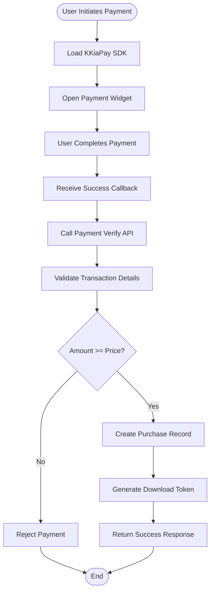

**Diagram sources**
- [src/components/payment/kkiapay-button.tsx:38-80](file://src/components/payment/kkiapay-button.tsx#L38-L80)
- [src/app/api/payments/verify/route.ts:47-96](file://src/app/api/payments/verify/route.ts#L47-L96)

**Section sources**
- [src/components/payment/kkiapay-button.tsx:1-110](file://src/components/payment/kkiapay-button.tsx#L1-L110)
- [src/app/api/payments/verify/route.ts:1-135](file://src/app/api/payments/verify/route.ts#L1-L135)

### Cloud Run Rewrite System

The application implements a comprehensive rewrite system for dynamic request routing:

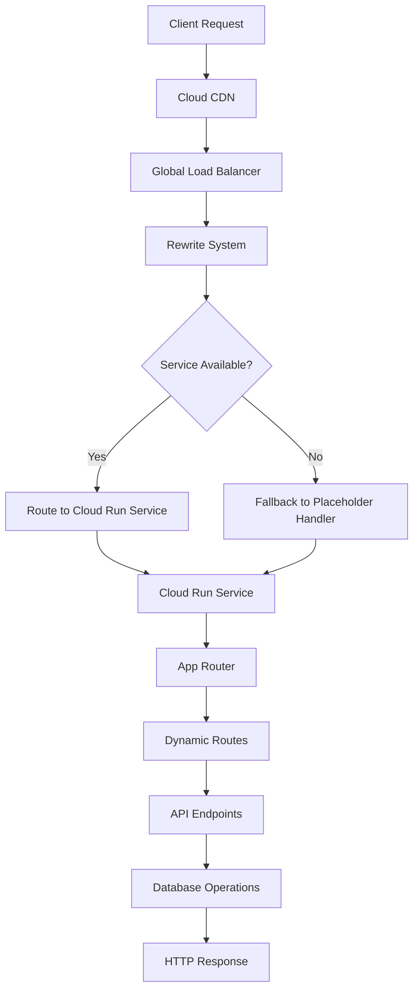

**Diagram sources**
- [firebase.json:11-19](file://firebase.json#L11-L19)
- [public_hosting/placeholder.html:1-2](file://public_hosting/placeholder.html#L1-L2)

The rewrite system ensures seamless routing from Firebase Hosting to Cloud Run services, providing dynamic request handling with improved performance and reduced latency compared to traditional static redirects.

**Section sources**
- [firebase.json:8-21](file://firebase.json#L8-L21)
- [public_hosting/placeholder.html:1-2](file://public_hosting/placeholder.html#L1-L2)

## Deployment Configuration

### Google Cloud App Hosting Configuration

The deployment configuration is optimized for production performance and cost-effectiveness:

| Configuration Parameter | Value | Purpose |
|------------------------|-------|---------|
| `concurrency` | 100 | Maximum concurrent requests per instance |
| `cpu` | 1 | CPU allocation for the service |
| `memoryMiB` | 512 | Memory allocation per instance |
| `minInstances` | 0 | Minimum idle instances |
| `maxInstances` | 2 | Maximum autoscaled instances |

**Section sources**
- [apphosting.yaml:1-7](file://apphosting.yaml#L1-L7)

### Environment Variables

The application uses a comprehensive set of environment variables for configuration, including new payment system variables:

| Variable Name | Purpose | Availability | Example Value |
|---------------|---------|--------------|---------------|
| `NEXT_PUBLIC_FIREBASE_*` | Firebase Client Configuration | Build + Runtime | Public Firebase settings |
| `NEXT_PUBLIC_APP_URL` | Application Base URL | Build + Runtime | https://datafrica--mydatafrica.europe-west4.hosted.app |
| `FIREBASE_ADMIN_PROJECT_ID` | Admin SDK Project ID | Runtime Only | Project identifier |
| `JWT_SECRET` | JWT Token Secret | Runtime Only | Cryptographic key |
| `NEXT_PUBLIC_KKIAPAY_PUBLIC_KEY` | KKiaPay Public API Key | Build + Runtime | Public payment key |
| `KKIAPAY_PRIVATE_KEY` | KKiaPay Private API Key | Runtime Only | Private payment key |
| `KKIAPAY_SECRET` | KKiaPay Webhook Secret | Runtime Only | Webhook verification key |
| `PAYDUNYA_*` | PayDunya Payment Configuration | Runtime Only | PayDunya payment settings |

**Updated**: Added comprehensive PayDunya environment variables for payment processing, including public API keys for client-side SDK initialization and private keys for server-side verification.

**Section sources**
- [apphosting.yaml:56-102](file://apphosting.yaml#L56-L102)

### Firebase Hosting Configuration

The Firebase hosting configuration has been updated to use Cloud Run rewrite instead of static redirects:

| Setting | Value | Purpose |
|---------|-------|---------|
| `source` | "." | Source directory |
| `public` | "public_hosting" | Static assets directory |
| `ignore` | Multiple patterns | Excludes build artifacts |
| `frameworksBackend.region` | "europe-west4" | Regional deployment |
| `rewrites[].source` | "**" | Matches all paths |
| `rewrites[].run.serviceId` | "datafrica" | Cloud Run service identifier |
| `rewrites[].run.region` | "europe-west4" | Service region |

**Updated**: The Firebase hosting configuration now uses Cloud Run rewrites instead of static redirects, routing all requests dynamically to the Cloud Run service for improved performance and flexibility.

**Section sources**
- [firebase.json:1-22](file://firebase.json#L1-L22)

### Public Hosting Directory Structure

The public_hosting directory contains essential rewrite indicator files:

| File | Purpose | Implementation |
|------|---------|----------------|
| `placeholder.html` | Cloud Run rewrite indicator | Comment-based placeholder |

**Section sources**
- [public_hosting/placeholder.html:1-2](file://public_hosting/placeholder.html#L1-L2)

## Security Implementation

### Authentication Flow

The application implements a multi-layered security approach with enhanced credential management:

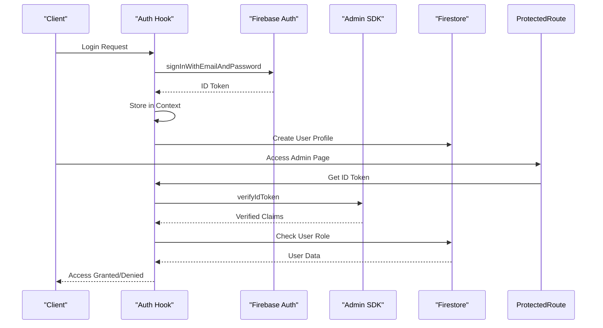

**Diagram sources**
- [src/hooks/use-auth.tsx:84-86](file://src/hooks/use-auth.tsx#L84-L86)
- [src/lib/auth-middleware.ts:19-28](file://src/lib/auth-middleware.ts#L19-L28)

### Payment Security Implementation

The payment system implements multiple layers of security and verification:

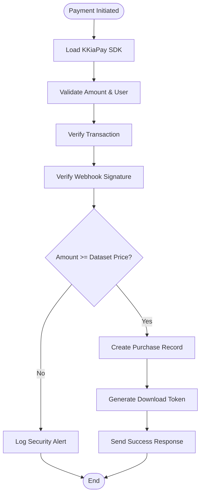

**Diagram sources**
- [src/app/api/payments/webhook/route.ts:11-24](file://src/app/api/payments/webhook/route.ts#L11-L24)
- [src/app/api/payments/verify/route.ts:64-77](file://src/app/api/payments/verify/route.ts#L64-L77)

### Cloud Run Rewrite Security Implementation

The rewrite system implements secure dynamic routing with proper request handling:

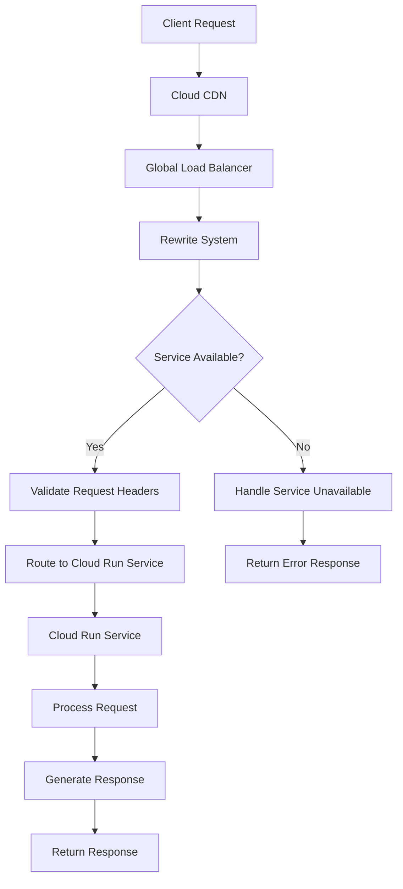

**Diagram sources**
- [firebase.json:11-19](file://firebase.json#L11-L19)

### Security Best Practices

The implementation follows several security best practices with enhanced credential management:

1. **Environment Variable Isolation**: Sensitive credentials are restricted to runtime-only availability
2. **Role-Based Access Control**: Admin functionality requires explicit role verification
3. **Token Verification**: Server-side JWT verification prevents token manipulation
4. **Automatic Scaling**: Configured minimum instances at zero for cost optimization
5. **Regional Deployment**: Strategic region selection for latency optimization
6. **Application Default Credentials (ADC)**: Enhanced security through automatic credential management
7. **Payment Webhook Verification**: HMAC signature verification for payment callbacks
8. **Transaction Amount Validation**: Server-side verification of payment amounts
9. **Duplicate Purchase Prevention**: Database checks to prevent double spending
10. **Secure Download Tokens**: Time-limited tokens for dataset access
11. **Dynamic Rewrites**: Cloud Run rewrites provide better security than static redirects
12. **Fallback Handler**: Placeholder handler prevents direct access to static files

**Updated**: Enhanced security measures now include Cloud Run rewrite system with dynamic request routing, improved service availability handling, and enhanced fallback mechanisms for better security posture.

**Section sources**
- [src/lib/auth-middleware.ts:30-47](file://src/lib/auth-middleware.ts#L30-L47)
- [apphosting.yaml:46-55](file://apphosting.yaml#L46-L55)
- [src/app/api/payments/webhook/route.ts:11-24](file://src/app/api/payments/webhook/route.ts#L11-L24)
- [src/app/api/payments/verify/route.ts:64-77](file://src/app/api/payments/verify/route.ts#L64-L77)
- [firebase.json:11-19](file://firebase.json#L11-L19)

## Deployment Security Improvements

### Application Default Credentials (ADC) Implementation

The application now implements Application Default Credentials (ADC) for enhanced security and simplified deployment:

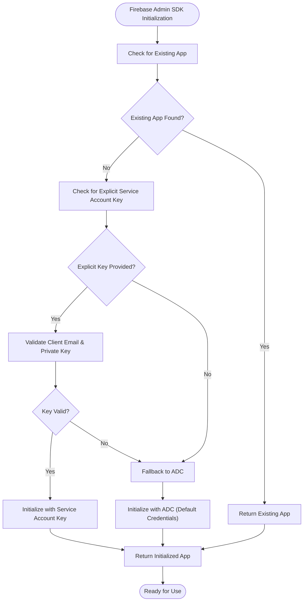

**Diagram sources**
- [src/lib/firebase-admin.ts:12-36](file://src/lib/firebase-admin.ts#L12-L36)

### ADC Benefits

The Application Default Credentials (ADC) approach provides several security and operational advantages:

1. **Reduced Credential Exposure**: Eliminates the need to store service account keys in App Hosting configuration
2. **Automatic Credential Management**: Google Cloud automatically manages and rotates credentials
3. **Simplified Deployment**: Reduces configuration complexity and potential misconfigurations
4. **Enhanced Security**: Minimizes the attack surface by avoiding explicit key storage
5. **Compliance Friendly**: Aligns with security best practices for credential management

### Backward Compatibility

The ADC implementation maintains full backward compatibility:

- **Explicit Service Account Keys**: Still supported when provided via environment variables
- **Validation Logic**: Ensures keys are valid and not placeholders
- **Fallback Mechanism**: Automatically falls back to ADC when no explicit key is provided
- **Zero Configuration Change**: Existing deployments continue to work without modifications

**Section sources**
- [src/lib/firebase-admin.ts:12-36](file://src/lib/firebase-admin.ts#L12-L36)

## Performance Considerations

### Scalability Configuration

The application is configured for optimal performance under varying load conditions:

| Metric | Current Value | Impact |
|--------|---------------|---------|
| Concurrency | 100 requests | Handles burst traffic |
| CPU | 1 vCPU | Balanced compute allocation |
| Memory | 512 MiB | Efficient memory usage |
| Min Instances | 0 | Cost-effective idle handling |
| Max Instances | 2 | Controlled autoscaling |

### Payment Processing Performance

The payment system is optimized for performance and reliability:

- **Client-Side SDK Loading**: Asynchronous loading of KKiaPay SDK to minimize page load impact
- **Server-Side Verification**: Efficient transaction verification with caching
- **Database Operations**: Optimized Firestore queries for purchase and download token management
- **Webhook Handling**: Non-blocking webhook processing with immediate acknowledgment

### Cloud Run Rewrite Performance Optimization

The rewrite system is optimized for minimal latency and improved performance:

- **Dynamic Routing**: Requests are routed directly to Cloud Run services without static redirect overhead
- **Service Discovery**: Automatic service discovery and health checking
- **Connection Pooling**: Efficient connection management between Firebase Hosting and Cloud Run
- **Request Batching**: Improved request handling through dynamic routing
- **Fallback Optimization**: Minimal overhead for fallback handler

### Caching Strategy

The application leverages Firebase's built-in caching mechanisms and implements client-side caching for user sessions and authentication state.

### Asset Optimization

Static assets are automatically optimized through Next.js compilation and served via Google Cloud's global CDN infrastructure.

## Troubleshooting Guide

### Common Deployment Issues

| Issue | Symptoms | Solution |
|-------|----------|----------|
| Authentication Failures | 401 Unauthorized errors | Verify JWT_SECRET and token validity |
| Database Access Errors | Firestore permission denied | Check FIREBASE_ADMIN credentials |
| Build Failures | Compilation errors in App Hosting | Review environment variable configuration |
| CORS Issues | Cross-origin request blocked | Configure proper headers in API routes |
| ADC Initialization Errors | Firebase Admin SDK fails to initialize | Verify App Hosting service account permissions |
| Payment Verification Errors | Payment fails despite successful widget | Check KKIAPAY_SECRET and webhook configuration |
| Webhook Signature Mismatch | 401 errors from KKiaPay | Verify KKIAPAY_SECRET matches webhook secret |
| Download Token Issues | Cannot access purchased datasets | Check download token expiration and database records |
| Rewrite Configuration Errors | Requests not reaching Cloud Run service | Check Firebase Hosting rewrite configuration |
| Service Unavailable Errors | 503 errors from Cloud Run | Verify service deployment and health status |
| Placeholder Handler Issues | Direct access to placeholder.html | Verify rewrite configuration and service availability |

**Updated**: Added comprehensive rewrite-related troubleshooting including rewrite configuration errors, service unavailable errors, and placeholder handler issues.

### Debugging Authentication Problems

1. **Verify Environment Variables**: Ensure all required Firebase variables are properly configured
2. **Check Token Expiration**: Confirm ID tokens are fresh and not expired
3. **Review Role Permissions**: Verify user roles in Firestore collection
4. **Monitor Logs**: Use Google Cloud Console for detailed error logs
5. **ADC Verification**: Check App Hosting service account permissions for ADC access

### Payment System Debugging

1. **Verify KKiaPay Credentials**: Ensure NEXT_PUBLIC_KKIAPAY_PUBLIC_KEY, KKIAPAY_PRIVATE_KEY, and KKIAPAY_SECRET are correctly configured
2. **Check Webhook URL**: Verify webhook endpoint is accessible and properly configured in KKiaPay dashboard
3. **Test Transaction Flow**: Use sandbox mode for development testing
4. **Monitor Payment API**: Check server logs for payment verification errors
5. **Validate Database Records**: Ensure purchase records are being created correctly

### Cloud Run Rewrite Debugging

1. **Verify Service Configuration**: Ensure Cloud Run service is properly deployed and healthy
2. **Check Rewrite Rules**: Verify Firebase Hosting rewrite configuration matches service identifiers
3. **Test Direct Access**: Test Cloud Run service endpoint directly to ensure it's accessible
4. **Monitor Rewrite Logs**: Check Google Cloud Console for rewrite request logs and error patterns
5. **Validate Service Health**: Use Cloud Run console to verify service health and instance status
6. **Check Region Configuration**: Ensure Firebase Hosting region matches Cloud Run service region

### Performance Monitoring

- Monitor instance utilization through Google Cloud Monitoring
- Track response times and error rates
- Observe autoscaling behavior during traffic spikes
- Review Firebase service quotas and limits
- Monitor payment processing latency and success rates
- Track rewrite performance and user experience metrics
- Monitor Cloud Run service health and availability

**Section sources**
- [src/lib/auth-middleware.ts:4-17](file://src/lib/auth-middleware.ts#L4-L17)
- [src/lib/firebase-admin.ts:20-35](file://src/lib/firebase-admin.ts#L20-L35)
- [src/app/api/payments/webhook/route.ts:20-24](file://src/app/api/payments/webhook/route.ts#L20-L24)
- [src/app/api/payments/verify/route.ts:71-77](file://src/app/api/payments/verify/route.ts#L71-L77)
- [firebase.json:11-19](file://firebase.json#L11-L19)

## Conclusion

The Datafrica application demonstrates a comprehensive approach to deploying modern web applications on Google Cloud App Hosting. The architecture effectively combines client-side React components with server-side Firebase services, implementing robust authentication, authorization, scalable infrastructure, and a complete payment system integrated with KKiaPay for African market transactions.

**Updated**: Recent enhancements have significantly expanded the application's capabilities through the transition from static redirect-based hosting to Cloud Run rewrite configuration. The Firebase Hosting configuration now uses dynamic rewrites instead of static redirects, providing improved performance, better request handling, and enhanced security through Application Default Credentials (ADC). The new configuration eliminates the need for separate redirect rules and provides more efficient routing through the Cloud Run service.

Key strengths of the deployment include:

- **Production-Ready Configuration**: Optimized resource allocation and autoscaling
- **Security-First Design**: Multi-layered authentication and authorization with enhanced ADC support and payment security
- **Developer Experience**: Clean separation of concerns and modular architecture
- **Cost Optimization**: Zero-minimum instances for efficient resource usage
- **Scalability**: Automatic scaling and regional deployment strategies
- **Enhanced Security**: ADC implementation reduces credential exposure and improves security posture
- **Comprehensive Payment System**: Full integration with KKiaPay and PayDunya for African market transactions
- **Robust Verification**: Multi-layered payment verification and security measures
- **Download Management**: Secure token-based dataset access control
- **Dynamic Rewrite System**: Cloud Run rewrites provide better performance than static redirects
- **Improved Reliability**: Enhanced service availability and fallback mechanisms
- **Modern Architecture**: Transition to Cloud Run rewrite configuration represents best practices for modern web applications

The implementation serves as a solid foundation for similar data marketplace applications, providing a template for secure, scalable deployments that leverage Google Cloud's managed hosting capabilities while maintaining flexibility for future enhancements. The transition to Cloud Run rewrites makes the platform particularly suitable for modern web applications, supporting dynamic routing, improved performance, and seamless integration with Google Cloud's serverless infrastructure.

**Updated**: The transition from static redirect-based hosting to Cloud Run rewrite configuration represents a significant architectural improvement, providing better performance, enhanced security through ADC implementation, and more efficient request routing. The new configuration eliminates the overhead of static redirects while providing dynamic routing capabilities that scale automatically with application demand.