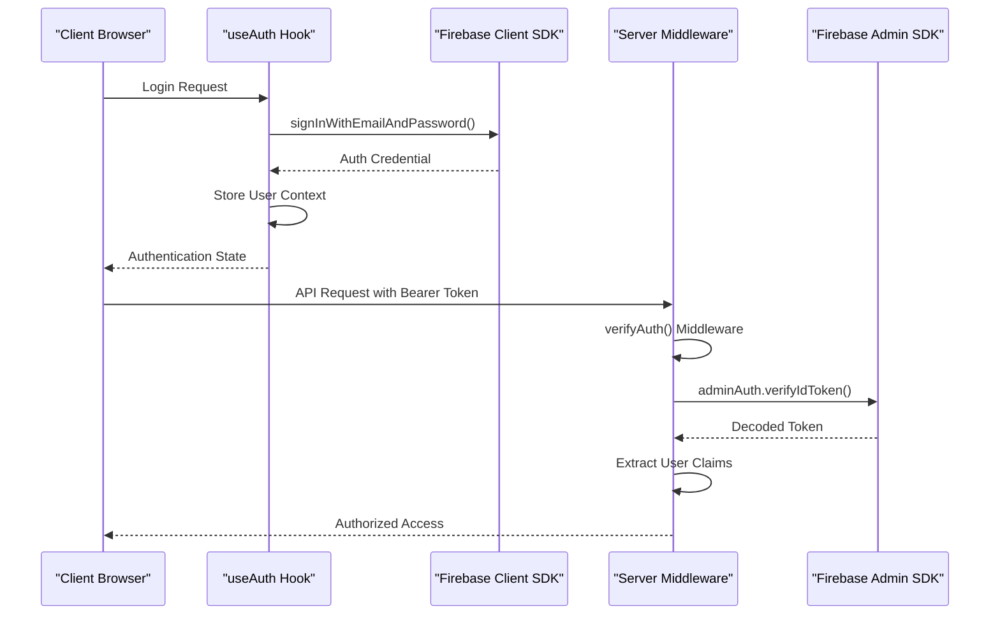
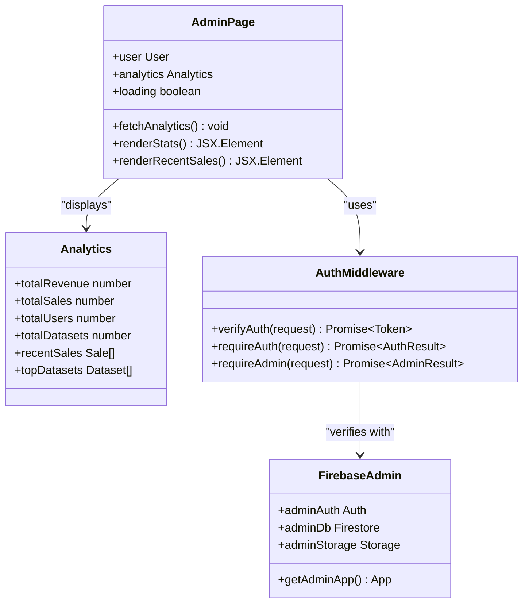
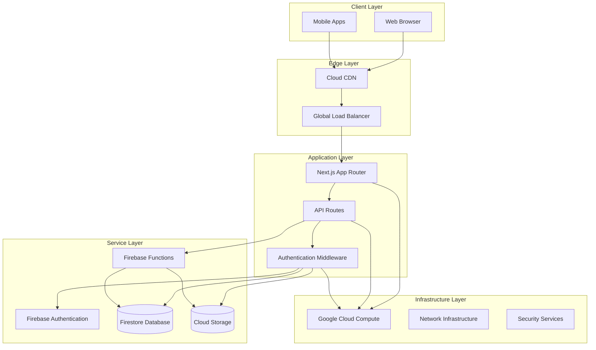
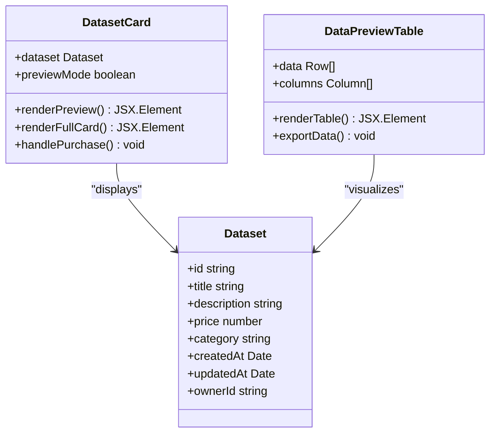
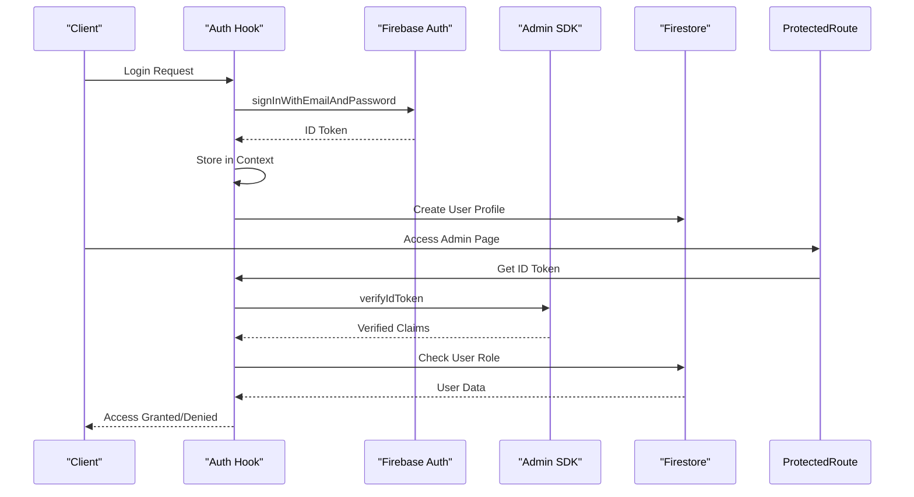

# Google Cloud App Hosting Deployment

<cite>
**Referenced Files in This Document**
- [apphosting.yaml](file://apphosting.yaml)
- [firebase.json](file://firebase.json)
- [package.json](file://package.json)
- [next.config.ts](file://next.config.ts)
- [src/lib/firebase-admin.ts](file://src/lib/firebase-admin.ts)
- [src/lib/auth-middleware.ts](file://src/lib/auth-middleware.ts)
- [src/app/layout.tsx](file://src/app/layout.tsx)
- [src/app/globals.css](file://src/app/globals.css)
- [src/app/(auth)/login/page.tsx](file://src/app/(auth)/login/page.tsx)
- [src/app/admin/page.tsx](file://src/app/admin/page.tsx)
- [src/hooks/use-auth.tsx](file://src/hooks/use-auth.tsx)
</cite>

## Update Summary
**Changes Made**
- Updated Security Implementation section to reflect Application Default Credentials (ADC) approach
- Enhanced Authentication Flow diagram to show ADC fallback mechanism
- Added new section on Deployment Security Improvements
- Updated Security Best Practices to include ADC benefits
- Modified Environment Variables section to clarify ADC usage

## Table of Contents
1. [Introduction](#introduction)
2. [Project Structure](#project-structure)
3. [Core Components](#core-components)
4. [Architecture Overview](#architecture-overview)
5. [Detailed Component Analysis](#detailed-component-analysis)
6. [Deployment Configuration](#deployment-configuration)
7. [Security Implementation](#security-implementation)
8. [Deployment Security Improvements](#deployment-security-improvements)
9. [Performance Considerations](#performance-considerations)
10. [Troubleshooting Guide](#troubleshooting-guide)
11. [Conclusion](#conclusion)

## Introduction

This document provides comprehensive documentation for deploying a Next.js application to Google Cloud App Hosting. The project is a data marketplace platform called "Datafrica" that enables users to browse, preview, and purchase African datasets. The application leverages Firebase for authentication and backend services while being configured for deployment on Google Cloud's managed hosting platform.

The deployment architecture utilizes Google Cloud App Hosting's serverless framework capabilities, providing automatic scaling, regional deployment, and seamless integration with Firebase services. The application follows modern React patterns with TypeScript, implements robust authentication middleware, and includes comprehensive admin functionality for dataset management.

**Updated**: The application now implements Application Default Credentials (ADC) for enhanced deployment security, eliminating the need for explicit service account key management in App Hosting configuration.

## Project Structure

The project follows a standard Next.js 13+ App Router structure with a focus on server-side rendering and API route handling:

```mermaid
graph TB
subgraph "Application Root"
SRC[src/] --> APP[src/app/]
SRC --> LIB[src/lib/]
SRC --> COMPONENTS[src/components/]
SRC --> HOOKS[src/hooks/]
SRC --> TYPES[src/types/]
PUBLIC[public/] --> ASSETS[Static Assets]
CONFIG[Configuration Files]
CONFIG --> APPHOSTING[apphosting.yaml]
CONFIG --> FIREBASE[firebase.json]
CONFIG --> NEXT[next.config.ts]
CONFIG --> PACKAGE[package.json]
end
subgraph "App Router Structure"
APP --> AUTH[(auth)/]
APP --> ADMIN[admin/]
APP --> API[api/]
APP --> DATASETS[datasets/]
APP --> DASHBOARD[dashboard/]
AUTH --> LOGIN[login/page.tsx]
AUTH --> REGISTER[register/page.tsx]
ADMIN --> ADMIN_PAGE[page.tsx]
ADMIN --> ANALYTICS[analytics/page.tsx]
ADMIN --> UPLOAD[upload/page.tsx]
ADMIN --> USERS[users/page.tsx]
API --> ADMIN_API[admin/]
API --> DATASET_API[datasets/]
API --> AUTH_API[auth/]
API --> PAYMENTS[payments/]
end
subgraph "Shared Components"
COMPONENTS --> LAYOUT[layout/]
COMPONENTS --> UI[ui/]
COMPONENTS --> DATASET[dataset/]
COMPONENTS --> PAYMENT[payment/]
LAYOUT --> NAVBAR[navbar.tsx]
LAYOUT --> FOOTER[footer.tsx]
UI --> BUTTON[button.tsx]
UI --> CARD[card.tsx]
UI --> INPUT[input.tsx]
UI --> TABLE[table.tsx]
end
```

**Diagram sources**
- [src/app/layout.tsx:1-50](file://src/app/layout.tsx#L1-L50)
- [src/app/(auth)/login/page.tsx:1-98](file://src/app/(auth)/login/page.tsx#L1-L98)
- [src/app/admin/page.tsx:1-242](file://src/app/admin/page.tsx#L1-L242)

**Section sources**
- [src/app/layout.tsx:1-50](file://src/app/layout.tsx#L1-L50)
- [src/app/globals.css:1-120](file://src/app/globals.css#L1-L120)

## Core Components

### Authentication System

The application implements a dual-layer authentication system combining Firebase client-side authentication with server-side verification:



**Diagram sources**
- [src/hooks/use-auth.tsx:1-117](file://src/hooks/use-auth.tsx#L1-L117)
- [src/lib/auth-middleware.ts:1-48](file://src/lib/auth-middleware.ts#L1-L48)
- [src/lib/firebase-admin.ts:1-58](file://src/lib/firebase-admin.ts#L1-L58)

### Admin Dashboard Architecture

The admin panel provides comprehensive dataset management capabilities with real-time analytics:



**Diagram sources**
- [src/app/admin/page.tsx:1-242](file://src/app/admin/page.tsx#L1-L242)
- [src/lib/auth-middleware.ts:1-48](file://src/lib/auth-middleware.ts#L1-L48)
- [src/lib/firebase-admin.ts:1-58](file://src/lib/firebase-admin.ts#L1-L58)

**Section sources**
- [src/hooks/use-auth.tsx:1-117](file://src/hooks/use-auth.tsx#L1-L117)
- [src/lib/auth-middleware.ts:1-48](file://src/lib/auth-middleware.ts#L1-L48)
- [src/app/admin/page.tsx:1-242](file://src/app/admin/page.tsx#L1-L242)

## Architecture Overview

The application follows a modern cloud-native architecture designed for scalability and reliability:



**Diagram sources**
- [apphosting.yaml:1-55](file://apphosting.yaml#L1-L55)
- [firebase.json:1-14](file://firebase.json#L1-L14)
- [src/lib/firebase-admin.ts:1-58](file://src/lib/firebase-admin.ts#L1-L58)

The architecture leverages Google Cloud App Hosting's automatic scaling capabilities, with the application configured to handle varying traffic loads efficiently. The system uses Firebase services for authentication and data storage, providing seamless integration with the Google Cloud ecosystem.

## Detailed Component Analysis

### Firebase Authentication Implementation

The authentication system implements a sophisticated token-based approach with both client-side and server-side verification:


**Diagram sources**
- [src/hooks/use-auth.tsx:69-82](file://src/hooks/use-auth.tsx#L69-L82)
- [src/hooks/use-auth.tsx:39-67](file://src/hooks/use-auth.tsx#L39-L67)

The implementation includes automatic user profile creation in Firestore, role-based access control, and seamless integration with Firebase's authentication state management.

### Admin Route Protection

The application implements comprehensive route protection using middleware patterns:

| Route Pattern | Required Role | Protection Mechanism | Purpose |
|---------------|---------------|---------------------|---------|
| `/admin` | Admin | `requireAdmin()` middleware | Admin dashboard access |
| `/admin/analytics` | Admin | `requireAdmin()` middleware | Analytics data retrieval |
| `/admin/upload` | Admin | `requireAdmin()` middleware | Dataset upload interface |
| `/admin/users` | Admin | `requireAdmin()` middleware | User management |
| `/api/admin/*` | Admin | Server-side token verification | Protected API endpoints |

**Section sources**
- [src/lib/auth-middleware.ts:30-47](file://src/lib/auth-middleware.ts#L30-L47)
- [src/app/admin/page.tsx:44-48](file://src/app/admin/page.tsx#L44-L48)

### Data Management Components

The dataset management system includes comprehensive CRUD operations and preview capabilities:



**Diagram sources**
- [src/components/dataset/dataset-card.tsx](file://src/components/dataset/dataset-card.tsx)
- [src/components/dataset/data-preview-table.tsx](file://src/components/dataset/data-preview-table.tsx)

**Section sources**
- [src/components/dataset/dataset-card.tsx](file://src/components/dataset/dataset-card.tsx)
- [src/components/dataset/data-preview-table.tsx](file://src/components/dataset/data-preview-table.tsx)

## Deployment Configuration

### Google Cloud App Hosting Configuration

The deployment configuration is optimized for production performance and cost-effectiveness:

| Configuration Parameter | Value | Purpose |
|------------------------|-------|---------|
| `concurrency` | 100 | Maximum concurrent requests per instance |
| `cpu` | 1 | CPU allocation for the service |
| `memoryMiB` | 512 | Memory allocation per instance |
| `minInstances` | 0 | Minimum idle instances |
| `maxInstances` | 2 | Maximum autoscaled instances |

**Section sources**
- [apphosting.yaml:1-6](file://apphosting.yaml#L1-L6)

### Environment Variables

The application uses a comprehensive set of environment variables for configuration:

| Variable Name | Purpose | Availability | Example Value |
|---------------|---------|--------------|---------------|
| `NEXT_PUBLIC_FIREBASE_*` | Firebase Client Configuration | Build + Runtime | Public Firebase settings |
| `NEXT_PUBLIC_APP_URL` | Application Base URL | Build + Runtime | Production domain |
| `FIREBASE_ADMIN_PROJECT_ID` | Admin SDK Project ID | Runtime Only | Project identifier |
| `JWT_SECRET` | JWT Token Secret | Runtime Only | Cryptographic key |

**Updated**: The ADC approach eliminates the need for explicit service account key variables (`FIREBASE_ADMIN_CLIENT_EMAIL`, `FIREBASE_ADMIN_PRIVATE_KEY`) in App Hosting configuration, as the system automatically uses Application Default Credentials when no explicit key is provided.

**Section sources**
- [apphosting.yaml:8-55](file://apphosting.yaml#L8-L55)

### Firebase Hosting Configuration

The Firebase hosting configuration optimizes static asset delivery and server-side rendering:

| Setting | Value | Purpose |
|---------|-------|---------|
| `source` | "." | Source directory |
| `ignore` | Multiple patterns | Excludes build artifacts |
| `frameworksBackend.region` | "europe-west1" | Regional deployment |

**Section sources**
- [firebase.json:1-14](file://firebase.json#L1-L14)

## Security Implementation

### Authentication Flow

The application implements a multi-layered security approach with enhanced credential management:



**Diagram sources**
- [src/hooks/use-auth.tsx:84-86](file://src/hooks/use-auth.tsx#L84-L86)
- [src/lib/auth-middleware.ts:19-28](file://src/lib/auth-middleware.ts#L19-L28)

### Security Best Practices

The implementation follows several security best practices with enhanced credential management:

1. **Environment Variable Isolation**: Sensitive credentials are restricted to runtime-only availability
2. **Role-Based Access Control**: Admin functionality requires explicit role verification
3. **Token Verification**: Server-side JWT verification prevents token manipulation
4. **Automatic Scaling**: Configured minimum instances at zero for cost optimization
5. **Regional Deployment**: Strategic region selection for latency optimization
6. **Application Default Credentials (ADC)**: Enhanced security through automatic credential management

**Updated**: The ADC approach provides improved security by eliminating the need to manage explicit service account keys in App Hosting configuration, reducing the attack surface and simplifying credential lifecycle management.

**Section sources**
- [src/lib/auth-middleware.ts:30-47](file://src/lib/auth-middleware.ts#L30-L47)
- [apphosting.yaml:46-55](file://apphosting.yaml#L46-L55)

## Deployment Security Improvements

### Application Default Credentials (ADC) Implementation

The application now implements Application Default Credentials (ADC) for enhanced security and simplified deployment:


**Diagram sources**
- [src/lib/firebase-admin.ts:12-36](file://src/lib/firebase-admin.ts#L12-L36)

### ADC Benefits

The Application Default Credentials (ADC) approach provides several security and operational advantages:

1. **Reduced Credential Exposure**: Eliminates the need to store service account keys in App Hosting configuration
2. **Automatic Credential Management**: Google Cloud automatically manages and rotates credentials
3. **Simplified Deployment**: Reduces configuration complexity and potential misconfigurations
4. **Enhanced Security**: Minimizes the attack surface by avoiding explicit key storage
5. **Compliance Friendly**: Aligns with security best practices for credential management

### Backward Compatibility

The ADC implementation maintains full backward compatibility:

- **Explicit Service Account Keys**: Still supported when provided via environment variables
- **Validation Logic**: Ensures keys are valid and not placeholders
- **Fallback Mechanism**: Automatically falls back to ADC when no explicit key is provided
- **Zero Configuration Change**: Existing deployments continue to work without modifications

**Section sources**
- [src/lib/firebase-admin.ts:12-36](file://src/lib/firebase-admin.ts#L12-L36)

## Performance Considerations

### Scalability Configuration

The application is configured for optimal performance under varying load conditions:

| Metric | Current Value | Impact |
|--------|---------------|---------|
| Concurrency | 100 requests | Handles burst traffic |
| CPU | 1 vCPU | Balanced compute allocation |
| Memory | 512 MiB | Efficient memory usage |
| Min Instances | 0 | Cost-effective idle handling |
| Max Instances | 2 | Controlled autoscaling |

### Caching Strategy

The application leverages Firebase's built-in caching mechanisms and implements client-side caching for user sessions and authentication state.

### Asset Optimization

Static assets are automatically optimized through Next.js compilation and served via Google Cloud's global CDN infrastructure.

## Troubleshooting Guide

### Common Deployment Issues

| Issue | Symptoms | Solution |
|-------|----------|----------|
| Authentication Failures | 401 Unauthorized errors | Verify JWT_SECRET and token validity |
| Database Access Errors | Firestore permission denied | Check FIREBASE_ADMIN credentials |
| Build Failures | Compilation errors in App Hosting | Review environment variable configuration |
| CORS Issues | Cross-origin request blocked | Configure proper headers in API routes |
| ADC Initialization Errors | Firebase Admin SDK fails to initialize | Verify App Hosting service account permissions |

**Updated**: Added ADC initialization errors as a new troubleshooting category, indicating issues with Application Default Credentials setup.

### Debugging Authentication Problems

1. **Verify Environment Variables**: Ensure all required Firebase variables are properly configured
2. **Check Token Expiration**: Confirm ID tokens are fresh and not expired
3. **Review Role Permissions**: Verify user roles in Firestore collection
4. **Monitor Logs**: Use Google Cloud Console for detailed error logs
5. **ADC Verification**: Check App Hosting service account permissions for ADC access

### Performance Monitoring

- Monitor instance utilization through Google Cloud Monitoring
- Track response times and error rates
- Observe autoscaling behavior during traffic spikes
- Review Firebase service quotas and limits

**Section sources**
- [src/lib/auth-middleware.ts:4-17](file://src/lib/auth-middleware.ts#L4-L17)
- [src/lib/firebase-admin.ts:20-35](file://src/lib/firebase-admin.ts#L20-L35)

## Conclusion

The Datafrica application demonstrates a comprehensive approach to deploying modern web applications on Google Cloud App Hosting. The architecture effectively combines client-side React components with server-side Firebase services, implementing robust authentication, authorization, and scalable infrastructure.

**Updated**: Recent security improvements have significantly enhanced the deployment configuration through the implementation of Application Default Credentials (ADC), eliminating the need for explicit service account key management while maintaining full backward compatibility.

Key strengths of the deployment include:

- **Production-Ready Configuration**: Optimized resource allocation and autoscaling
- **Security-First Design**: Multi-layered authentication and authorization with enhanced ADC support
- **Developer Experience**: Clean separation of concerns and modular architecture
- **Cost Optimization**: Zero-minimum instances for efficient resource usage
- **Scalability**: Automatic scaling and regional deployment strategies
- **Enhanced Security**: ADC implementation reduces credential exposure and improves security posture

The implementation serves as a solid foundation for similar data marketplace applications, providing a template for secure, scalable deployments that leverage Google Cloud's managed hosting capabilities while maintaining flexibility for future enhancements.

**Updated**: The ADC implementation represents a significant security improvement, aligning with modern cloud security best practices by eliminating explicit credential management while maintaining operational simplicity and backward compatibility.