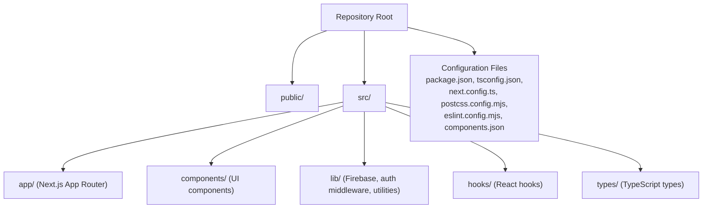

# Getting Started

<cite>
**Referenced Files in This Document**
- [README.md](file://README.md)
- [package.json](file://package.json)
- [next.config.ts](file://next.config.ts)
- [tsconfig.json](file://tsconfig.json)
- [postcss.config.mjs](file://postcss.config.mjs)
- [eslint.config.mjs](file://eslint.config.mjs)
- [components.json](file://components.json)
- [src/app/layout.tsx](file://src/app/layout.tsx)
- [src/lib/firebase.ts](file://src/lib/firebase.ts)
- [src/lib/firebase-admin.ts](file://src/lib/firebase-admin.ts)
- [src/hooks/use-auth.tsx](file://src/hooks/use-auth.tsx)
- [src/components/payment/kkiapay-button.tsx](file://src/components/payment/kkiapay-button.tsx)
- [src/types/index.ts](file://src/types/index.ts)
</cite>

## Table of Contents
1. [Introduction](#introduction)
2. [Project Structure](#project-structure)
3. [Prerequisites](#prerequisites)
4. [Installation](#installation)
5. [Environment Variables](#environment-variables)
6. [Development Server](#development-server)
7. [Initial Project Walkthrough](#initial-project-walkthrough)
8. [Common Workflows](#common-workflows)
9. [Build and Deployment Preparation](#build-and-deployment-preparation)
10. [Troubleshooting](#troubleshooting)
11. [Verification Checklist](#verification-checklist)
12. [Conclusion](#conclusion)

## Introduction
This guide helps you set up the Datafrica development environment from cloning the repository to running the local development server with hot reload. It covers prerequisites, installation, environment configuration for Firebase and KKIAPAY, development workflows, and verification steps to ensure everything works as expected.

## Project Structure
Datafrica is a Next.js 16 application written in TypeScript with Tailwind CSS v4 and shadcn/ui components. The frontend is organized under src/app and shared components, utilities, and types live under src/components, src/lib, and src/types respectively. Authentication integrates Firebase client and admin SDKs, while payment integration uses KKIAPAY’s JavaScript widget.

**Section sources**
- [src/app/layout.tsx:1-50](file://src/app/layout.tsx#L1-L50)
- [components.json:1-26](file://components.json#L1-L26)

## Prerequisites
- Operating system: macOS, Linux, or Windows
- Node.js: The project specifies Next.js 16.2.3 and TypeScript 5. Ensure your Node.js version is compatible with these dependencies. Use a Node.js version manager (e.g., nvm) to switch versions if needed.
- Package manager: Choose one of the following supported package managers:
  - npm (Node Package Manager)
  - yarn
  - pnpm
  - bun
- Git: Required to clone the repository
- Text editor or IDE with TypeScript and ESLint support

**Section sources**
- [package.json:11-49](file://package.json#L11-L49)
- [tsconfig.json:1-35](file://tsconfig.json#L1-L35)

## Installation
Follow these steps to install and prepare the project locally:

1. Clone the repository
   - Use your preferred Git client or command line to clone the repository to your machine.

2. Navigate to the project directory
   - Change into the repository root directory.

3. Install dependencies
   - Run your chosen package manager’s install command:
     - npm: npm ci
     - yarn: yarn install
     - pnpm: pnpm install
     - bun: bun install

4. Verify TypeScript configuration
   - Confirm tsconfig.json is present and configured for Next.js and TypeScript.

5. Configure Tailwind CSS
   - PostCSS is configured to use Tailwind CSS v4. Ensure your editor supports Tailwind IntelliSense for better DX.

6. Optional: Set up ESLint
   - The project includes an ESLint configuration tailored for Next.js and TypeScript. Run lint checks as needed during development.

**Section sources**
- [README.md:3-37](file://README.md#L3-L37)
- [package.json:5-10](file://package.json#L5-L10)
- [tsconfig.json:16-24](file://tsconfig.json#L16-L24)
- [postcss.config.mjs:1-8](file://postcss.config.mjs#L1-L8)
- [eslint.config.mjs:1-19](file://eslint.config.mjs#L1-L19)

## Environment Variables
Datafrica requires environment variables for Firebase client SDK and KKIAPAY integration. These variables must be provided in a .env.local file at the project root.

- Firebase Client SDK (NEXT_PUBLIC_ variables)
  - NEXT_PUBLIC_FIREBASE_API_KEY
  - NEXT_PUBLIC_FIREBASE_AUTH_DOMAIN
  - NEXT_PUBLIC_FIREBASE_PROJECT_ID
  - NEXT_PUBLIC_FIREBASE_STORAGE_BUCKET
  - NEXT_PUBLIC_FIREBASE_MESSAGING_SENDER_ID
  - NEXT_PUBLIC_FIREBASE_APP_ID

- Firebase Admin SDK (server-side)
  - FIREBASE_ADMIN_PROJECT_ID
  - FIREBASE_ADMIN_CLIENT_EMAIL
  - FIREBASE_ADMIN_PRIVATE_KEY

- KKIAPAY Integration
  - NEXT_PUBLIC_KKIAPAY_PUBLIC_KEY
  - NODE_ENV (development or production) controls sandbox mode in the KKIAPAY widget

Notes:
- NEXT_PUBLIC_ variables are exposed to the browser and used by the client SDK.
- Server-side variables (FIREBASE_ADMIN_*) are used by the backend/admin SDK and must remain secret.

Where they are used:
- Firebase client SDK configuration: [src/lib/firebase.ts:7-14](file://src/lib/firebase.ts#L7-L14)
- Firebase admin SDK configuration: [src/lib/firebase-admin.ts:20-24](file://src/lib/firebase-admin.ts#L20-L24)
- KKIAPAY widget configuration: [src/components/payment/kkiapay-button.tsx:50-62](file://src/components/payment/kkiapay-button.tsx#L50-L62)

**Section sources**
- [src/lib/firebase.ts:7-14](file://src/lib/firebase.ts#L7-L14)
- [src/lib/firebase-admin.ts:20-24](file://src/lib/firebase-admin.ts#L20-L24)
- [src/components/payment/kkiapay-button.tsx:50-62](file://src/components/payment/kkiapay-button.tsx#L50-L62)

## Development Server
Start the Next.js development server with hot reload:

- Run the development script using your chosen package manager:
  - npm: npm run dev
  - yarn: yarn dev
  - pnpm: pnpm dev
  - bun: bun dev

- Open http://localhost:3000 in your browser to view the application.

- The default home page is located at src/app/page.tsx. Editing this file triggers hot reload.

- The layout wraps all pages with theme provider, authentication provider, navigation bar, footer, and toast notifications.

**Section sources**
- [README.md:5-17](file://README.md#L5-L17)
- [package.json:6](file://package.json#L6)
- [src/app/layout.tsx:26-49](file://src/app/layout.tsx#L26-L49)

## Initial Project Walkthrough
Explore the initial structure and key files to understand how the app boots:

- Application shell and providers
  - Root layout initializes fonts, theme provider, auth provider, navbar, footer, and toast notifications.
  - See: [src/app/layout.tsx:10-49](file://src/app/layout.tsx#L10-L49)

- Authentication flow
  - The AuthProvider subscribes to Firebase Auth state, loads or creates user profiles in Firestore, and exposes auth methods.
  - See: [src/hooks/use-auth.tsx:34-108](file://src/hooks/use-auth.tsx#L34-L108)

- Firebase client SDK
  - Initializes client app with NEXT_PUBLIC Firebase variables and exports auth/db/storage instances.
  - See: [src/lib/firebase.ts:7-21](file://src/lib/firebase.ts#L7-L21)

- Firebase admin SDK
  - Lazily initializes admin app using server-side Firebase variables and exposes Firestore/Auth/Storage proxies.
  - See: [src/lib/firebase-admin.ts:12-49](file://src/lib/firebase-admin.ts#L12-L49)

- Payment integration
  - KKIAPAY button dynamically loads the widget, passes configuration (amount, key, sandbox, user info), and listens for success callbacks.
  - See: [src/components/payment/kkiapay-button.tsx:15-109](file://src/components/payment/kkiapay-button.tsx#L15-L109)

- Types
  - Defines User, Dataset, Purchase, DownloadToken, categories, and constants for countries and categories.
  - See: [src/types/index.ts:3-90](file://src/types/index.ts#L3-L90)

**Section sources**
- [src/app/layout.tsx:10-49](file://src/app/layout.tsx#L10-L49)
- [src/hooks/use-auth.tsx:34-108](file://src/hooks/use-auth.tsx#L34-L108)
- [src/lib/firebase.ts:7-21](file://src/lib/firebase.ts#L7-L21)
- [src/lib/firebase-admin.ts:12-49](file://src/lib/firebase-admin.ts#L12-L49)
- [src/components/payment/kkiapay-button.tsx:15-109](file://src/components/payment/kkiapay-button.tsx#L15-L109)
- [src/types/index.ts:3-90](file://src/types/index.ts#L3-L90)

## Common Workflows
- Local development
  - Start the dev server, edit files, and rely on hot reload.
  - Reference: [README.md:5-17](file://README.md#L5-L17)

- Linting
  - Run ESLint as configured for Next.js and TypeScript.
  - Reference: [eslint.config.mjs:1-19](file://eslint.config.mjs#L1-L19)

- Building for production
  - Build the Next.js app using the configured scripts.
  - Reference: [package.json:7](file://package.json#L7)

- Starting the production server
  - Start the compiled Next.js server.
  - Reference: [package.json:8](file://package.json#L8)

- Running tests (if applicable)
  - Tests are not included in the current repository structure. If you add them later, configure your test runner accordingly.

**Section sources**
- [README.md:5-17](file://README.md#L5-L17)
- [eslint.config.mjs:1-19](file://eslint.config.mjs#L1-L19)
- [package.json:7-8](file://package.json#L7-L8)

## Build and Deployment Preparation
- Build artifacts
  - Next.js builds static and server-side optimized assets. The build script is defined in package.json.
  - Reference: [package.json:7](file://package.json#L7)

- Production startup
  - After building, start the production server using the start script.
  - Reference: [package.json:8](file://package.json#L8)

- Deployment platforms
  - The project README mentions deploying to Vercel. Follow the official Next.js deployment documentation referenced in the README.
  - Reference: [README.md:32-37](file://README.md#L32-L37)

- Environment variables for production
  - Ensure all NEXT_PUBLIC_* and server-side variables are set in your hosting environment before deploying.
  - References:
    - [src/lib/firebase.ts:7-14](file://src/lib/firebase.ts#L7-L14)
    - [src/lib/firebase-admin.ts:20-24](file://src/lib/firebase-admin.ts#L20-L24)
    - [src/components/payment/kkiapay-button.tsx:54-55](file://src/components/payment/kkiapay-button.tsx#L54-L55)

**Section sources**
- [package.json:7-8](file://package.json#L7-L8)
- [README.md:32-37](file://README.md#L32-L37)
- [src/lib/firebase.ts:7-14](file://src/lib/firebase.ts#L7-L14)
- [src/lib/firebase-admin.ts:20-24](file://src/lib/firebase-admin.ts#L20-L24)
- [src/components/payment/kkiapay-button.tsx:54-55](file://src/components/payment/kkiapay-button.tsx#L54-L55)

## Troubleshooting
- Development server does not start
  - Ensure Node.js version compatibility with Next.js 16.2.3 and TypeScript 5.
  - Clear package manager cache and reinstall dependencies if needed.
  - Verify the dev script exists in package.json.
  - Reference: [package.json:6](file://package.json#L6)

- Hot reload not working
  - Confirm you are editing files under src/app or other watched directories.
  - Restart the development server if necessary.

- Firebase client SDK errors
  - Missing NEXT_PUBLIC Firebase variables cause initialization failures.
  - Verify .env.local contains all required NEXT_PUBLIC_* keys.
  - Reference: [src/lib/firebase.ts:7-14](file://src/lib/firebase.ts#L7-L14)

- Firebase admin SDK errors
  - Missing server-side variables prevent admin SDK initialization.
  - Ensure FIREBASE_ADMIN_PROJECT_ID, FIREBASE_ADMIN_CLIENT_EMAIL, and FIREBASE_ADMIN_PRIVATE_KEY are set.
  - Reference: [src/lib/firebase-admin.ts:20-24](file://src/lib/firebase-admin.ts#L20-L24)

- KKIAPAY widget not loading
  - Ensure NEXT_PUBLIC_KKIAPAY_PUBLIC_KEY is set.
  - Sandbox mode depends on NODE_ENV; confirm it is set appropriately for development vs production.
  - Reference: [src/components/payment/kkiapay-button.tsx:54-55](file://src/components/payment/kkiapay-button.tsx#L54-L55)

- ESLint errors
  - Run lint checks and fix reported issues.
  - Reference: [eslint.config.mjs:1-19](file://eslint.config.mjs#L1-L19)

- Tailwind CSS not applied
  - Confirm Tailwind is enabled via PostCSS and the Tailwind plugin is installed.
  - Reference: [postcss.config.mjs:1-8](file://postcss.config.mjs#L1-L8)

**Section sources**
- [package.json:6](file://package.json#L6)
- [src/lib/firebase.ts:7-14](file://src/lib/firebase.ts#L7-L14)
- [src/lib/firebase-admin.ts:20-24](file://src/lib/firebase-admin.ts#L20-L24)
- [src/components/payment/kkiapay-button.tsx:54-55](file://src/components/payment/kkiapay-button.tsx#L54-L55)
- [eslint.config.mjs:1-19](file://eslint.config.mjs#L1-L19)
- [postcss.config.mjs:1-8](file://postcss.config.mjs#L1-L8)

## Verification Checklist
- Local development
  - Start the dev server and navigate to http://localhost:3000.
  - Edit a page file and confirm hot reload updates the browser.
  - References:
    - [README.md:5-17](file://README.md#L5-L17)
    - [package.json:6](file://package.json#L6)

- Authentication
  - Log in via the auth routes and verify the AuthProvider sets user state and fetches profile data from Firestore.
  - References:
    - [src/app/layout.tsx:38-44](file://src/app/layout.tsx#L38-L44)
    - [src/hooks/use-auth.tsx:39-67](file://src/hooks/use-auth.tsx#L39-L67)

- Firebase configuration
  - Confirm Firebase client SDK initializes with NEXT_PUBLIC_* variables.
  - References:
    - [src/lib/firebase.ts:7-14](file://src/lib/firebase.ts#L7-L14)

- Admin SDK
  - Confirm server-side admin SDK initializes with FIREBASE_ADMIN_* variables.
  - References:
    - [src/lib/firebase-admin.ts:20-24](file://src/lib/firebase-admin.ts#L20-L24)

- Payment integration
  - Use the KKIAPAY button component and verify the widget loads and opens with correct configuration.
  - References:
    - [src/components/payment/kkiapay-button.tsx:15-109](file://src/components/payment/kkiapay-button.tsx#L15-L109)

- Build and lint
  - Run the build script and lint checks to ensure no errors.
  - References:
    - [package.json:7](file://package.json#L7)
    - [eslint.config.mjs:1-19](file://eslint.config.mjs#L1-L19)

**Section sources**
- [README.md:5-17](file://README.md#L5-L17)
- [package.json:6-7](file://package.json#L6-L7)
- [src/app/layout.tsx:38-44](file://src/app/layout.tsx#L38-L44)
- [src/hooks/use-auth.tsx:39-67](file://src/hooks/use-auth.tsx#L39-L67)
- [src/lib/firebase.ts:7-14](file://src/lib/firebase.ts#L7-L14)
- [src/lib/firebase-admin.ts:20-24](file://src/lib/firebase-admin.ts#L20-L24)
- [src/components/payment/kkiapay-button.tsx:15-109](file://src/components/payment/kkiapay-button.tsx#L15-L109)
- [eslint.config.mjs:1-19](file://eslint.config.mjs#L1-L19)

## Conclusion
You now have the essentials to set up and develop Datafrica locally. Ensure all environment variables are configured, start the development server, and use the provided components and hooks as building blocks. For production, prepare environment variables and follow the deployment guidance referenced in the README.