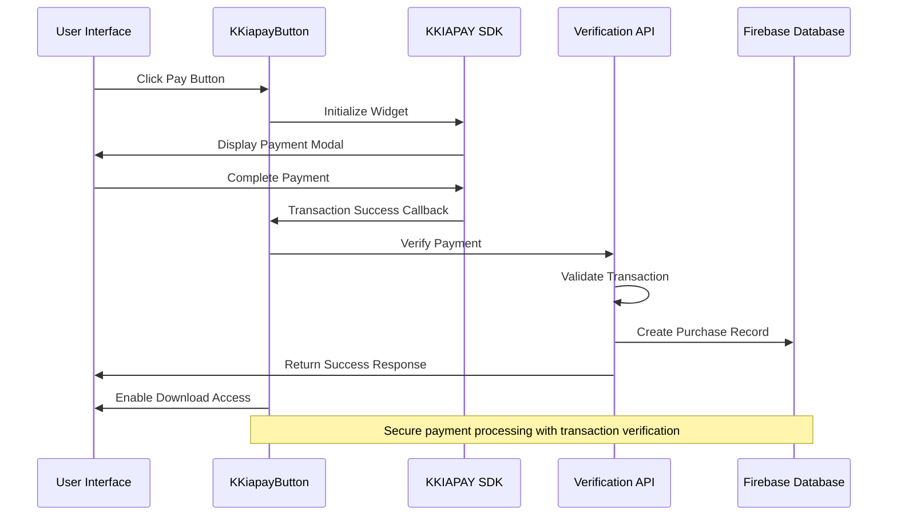
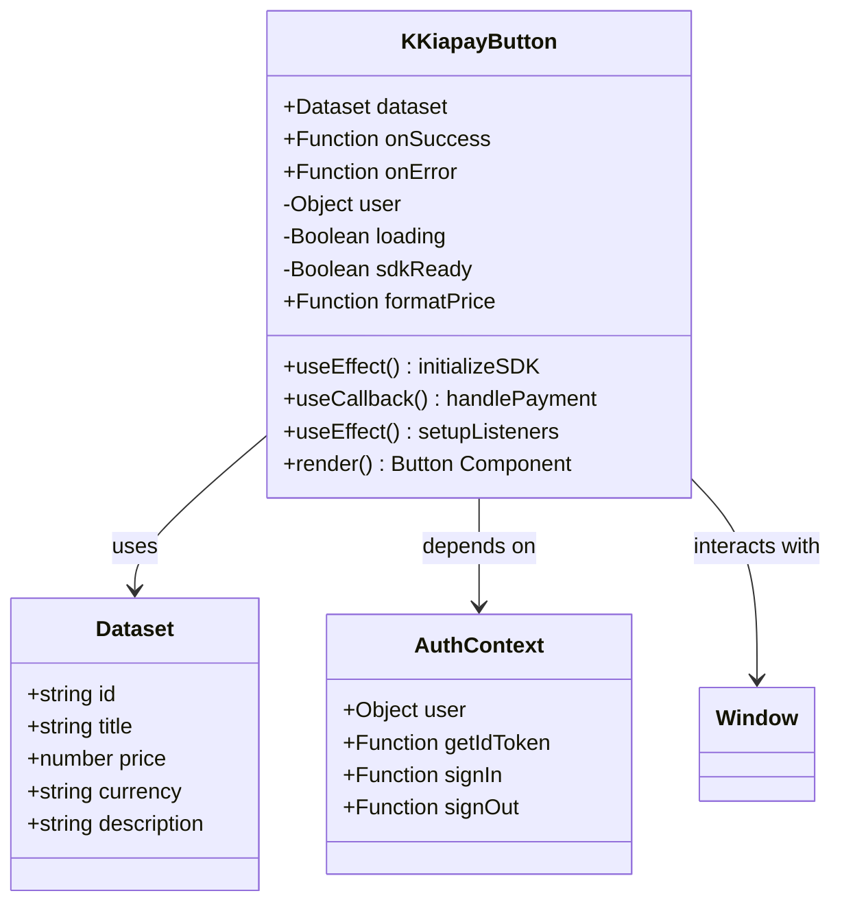
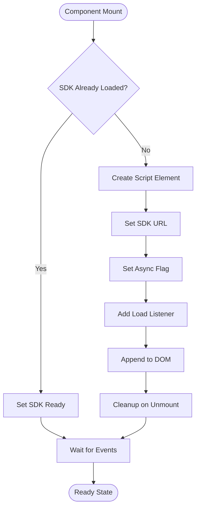
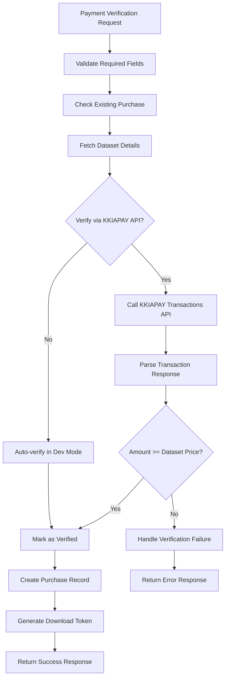
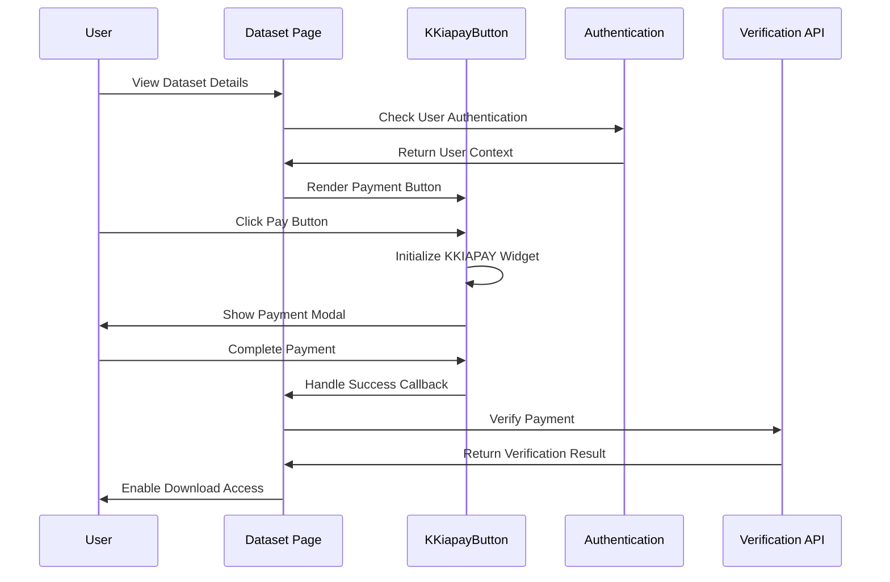
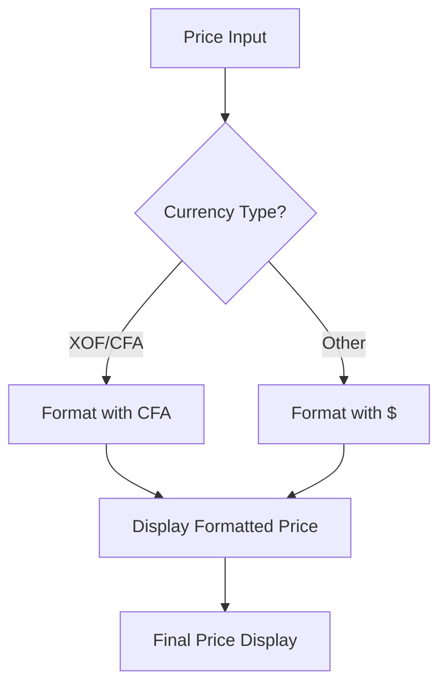
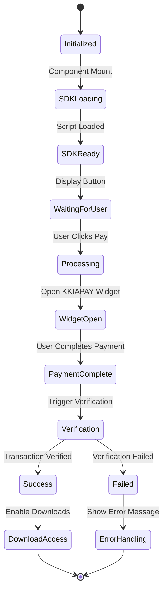
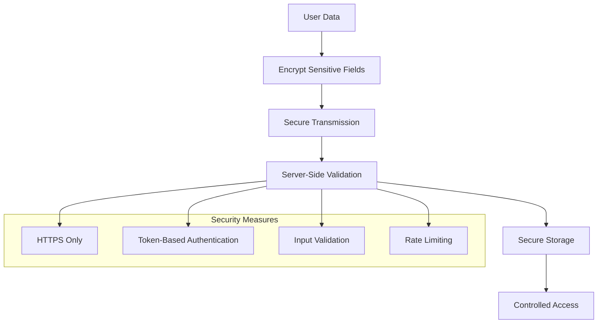
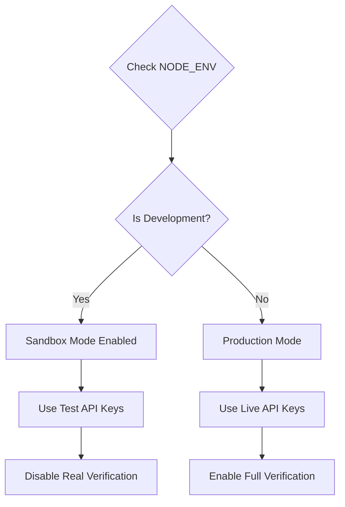

# KKIAPAY Integration

<cite>
**Referenced Files in This Document**
- [kkiapay-button.tsx](file://src/components/payment/kkiapay-button.tsx)
- [route.ts](file://src/app/api/payments/verify/route.ts)
- [page.tsx](file://src/app/datasets/[id]/page.tsx)
- [use-auth.tsx](file://src/hooks/use-auth.tsx)
- [index.ts](file://src/types/index.ts)
- [package.json](file://package.json)
</cite>

## Table of Contents
1. [Introduction](#introduction)
2. [Project Structure](#project-structure)
3. [Core Components](#core-components)
4. [Architecture Overview](#architecture-overview)
5. [Detailed Component Analysis](#detailed-component-analysis)
6. [Configuration Management](#configuration-management)
7. [Payment Flow Implementation](#payment-flow-implementation)
8. [Security Considerations](#security-considerations)
9. [Development and Production Setup](#development-and-production-setup)
10. [Troubleshooting Guide](#troubleshooting-guide)
11. [Conclusion](#conclusion)

## Introduction

The KKIAPAY Integration component provides seamless payment processing capabilities for the Datafrica platform, enabling users to purchase datasets using mobile money and card payments through the KKIAPAY payment gateway. This documentation covers the complete implementation of the KKiapayButton component, including SDK initialization, configuration parameters, widget customization, and the complete payment flow from component mounting to transaction completion.

The integration follows modern React patterns with TypeScript support, utilizing Next.js server-side rendering capabilities and secure authentication mechanisms to ensure reliable and secure payment processing.

## Project Structure

The KKIAPAY integration is organized within the Datafrica Next.js application structure, with dedicated components and API routes for payment processing:

```mermaid
graph TB
subgraph "Payment Integration Structure"
A[src/components/payment/] --> B[kkiapay-button.tsx]
C[src/app/api/payments/verify/] --> D[routes.ts]
E[src/app/datasets/[id]/] --> F[page.tsx]
G[src/hooks/] --> H[use-auth.tsx]
I[src/types/] --> J[index.ts]
end
subgraph "External Dependencies"
K[KKIAPAY SDK]
L[Firebase Auth]
M[Next.js API Routes]
end
B --> K
F --> B
B --> L
D --> M
```

**Diagram sources**
- [kkiapay-button.tsx:1-110](file://src/components/payment/kkiapay-button.tsx#L1-L110)
- [route.ts:1-135](file://src/app/api/payments/verify/route.ts#L1-L135)
- [page.tsx:1-382](file://src/app/datasets/[id]/page.tsx#L1-L382)

**Section sources**
- [kkiapay-button.tsx:1-110](file://src/components/payment/kkiapay-button.tsx#L1-L110)
- [route.ts:1-135](file://src/app/api/payments/verify/route.ts#L1-L135)
- [page.tsx:1-382](file://src/app/datasets/[id]/page.tsx#L1-L382)

## Core Components

The KKIAPAY integration consists of several key components working together to provide a seamless payment experience:

### KKiapayButton Component
The primary payment component responsible for initializing the KKIAPAY SDK, handling user interactions, and managing the payment flow.

### Payment Verification API
A server-side API endpoint that validates transactions against the KKIAPAY payment gateway and creates purchase records in the database.

### Authentication Integration
Seamless integration with the existing Firebase authentication system to ensure secure user context during payment processing.

**Section sources**
- [kkiapay-button.tsx:9-13](file://src/components/payment/kkiapay-button.tsx#L9-L13)
- [route.ts:6-135](file://src/app/api/payments/verify/route.ts#L6-L135)
- [use-auth.tsx:22-30](file://src/hooks/use-auth.tsx#L22-L30)

## Architecture Overview

The KKIAPAY integration follows a client-server architecture pattern with secure authentication and transaction verification:



**Diagram sources**
- [kkiapay-button.tsx:20-80](file://src/components/payment/kkiapay-button.tsx#L20-L80)
- [route.ts:47-96](file://src/app/api/payments/verify/route.ts#L47-L96)
- [page.tsx:84-120](file://src/app/datasets/[id]/page.tsx#L84-L120)

## Detailed Component Analysis

### KKiapayButton Component Implementation

The KKiapayButton component serves as the main interface for initiating KKIAPAY payments:



**Diagram sources**
- [kkiapay-button.tsx:9-13](file://src/components/payment/kkiapay-button.tsx#L9-L13)
- [index.ts:11-28](file://src/types/index.ts#L11-L28)
- [use-auth.tsx:22-30](file://src/hooks/use-auth.tsx#L22-L30)

#### Component Properties and Configuration

The component accepts the following configuration properties:

| Property | Type | Required | Description |
|----------|------|----------|-------------|
| dataset | Dataset | Yes | Dataset object containing pricing and metadata |
| onSuccess | Function | Yes | Callback function receiving transaction ID |
| onError | Function | No | Error handling callback |

#### SDK Initialization and Loading

The component implements intelligent SDK loading with fallback mechanisms:



**Diagram sources**
- [kkiapay-button.tsx:20-36](file://src/components/payment/kkiapay-button.tsx#L20-L36)

#### Widget Configuration Options

The payment widget accepts the following configuration parameters:

| Parameter | Type | Description | Example Value |
|-----------|------|-------------|---------------|
| amount | number | Transaction amount in smallest currency unit | dataset.price |
| position | string | Widget positioning ("center") | "center" |
| theme | string | Brand color in hex format | "#2563eb" |
| key | string | Public API key from environment | NEXT_PUBLIC_KKIAPAY_PUBLIC_KEY |
| sandbox | boolean | Development mode flag | NODE_ENV === "development" |
| email | string | Customer email address | user?.email |
| name | string | Customer full name | user?.displayName |
| data | string | JSON-encoded metadata | datasetId, userId |

**Section sources**
- [kkiapay-button.tsx:15-110](file://src/components/payment/kkiapay-button.tsx#L15-L110)

### Payment Verification API Implementation

The server-side verification API ensures transaction integrity and prevents fraud:



**Diagram sources**
- [route.ts:8-135](file://src/app/api/payments/verify/route.ts#L8-L135)

#### Verification Process Details

The verification process includes multiple security checks:

1. **Authentication Validation**: Ensures user is properly authenticated
2. **Duplicate Purchase Prevention**: Checks for existing completed purchases
3. **Dataset Integrity**: Verifies dataset exists and matches expected details
4. **Transaction Validation**: Confirms transaction status and amount via KKIAPAY API
5. **Amount Verification**: Ensures transaction amount meets or exceeds dataset price

**Section sources**
- [route.ts:8-135](file://src/app/api/payments/verify/route.ts#L8-L135)

### Integration with Dataset Page

The payment component integrates seamlessly with the dataset viewing experience:



**Diagram sources**
- [page.tsx:333-343](file://src/app/datasets/[id]/page.tsx#L333-L343)
- [page.tsx:84-120](file://src/app/datasets/[id]/page.tsx#L84-L120)

**Section sources**
- [page.tsx:333-343](file://src/app/datasets/[id]/page.tsx#L333-L343)
- [page.tsx:84-120](file://src/app/datasets/[id]/page.tsx#L84-L120)

## Configuration Management

### Environment Variables

The integration relies on several environment variables for secure configuration:

| Variable | Purpose | Required | Example |
|----------|---------|----------|---------|
| NEXT_PUBLIC_KKIAPAY_PUBLIC_KEY | Public API key for SDK initialization | Yes | "pk_live_xxxxxxxxxxxxx" |
| KKIAPAY_PRIVATE_KEY | Private key for server-side verification | Yes | "sk_live_xxxxxxxxxxxxx" |
| KKIAPAY_SECRET | Secret key for API authentication | Yes | "secret_xxxxxxxxxxxxx" |

### Currency and Formatting Configuration

The system supports multiple currencies with automatic formatting:



**Diagram sources**
- [kkiapay-button.tsx:82-87](file://src/components/payment/kkiapay-button.tsx#L82-L87)

**Section sources**
- [kkiapay-button.tsx:50-62](file://src/components/payment/kkiapay-button.tsx#L50-L62)
- [kkiapay-button.tsx:82-87](file://src/components/payment/kkiapay-button.tsx#L82-L87)

## Payment Flow Implementation

### Complete Payment Lifecycle

The payment flow encompasses multiple stages from initiation to completion:



### Success Callback Mechanism

The success callback system provides robust error handling and user feedback:

| Event | Callback | Parameters | Purpose |
|-------|----------|------------|---------|
| Payment Success | onSuccess | transactionId: string | Complete purchase flow |
| SDK Error | onError | error: string | Handle initialization failures |
| Widget Error | onError | error: string | Handle payment widget errors |
| Verification Error | onError | error: string | Handle server-side verification |

**Section sources**
- [kkiapay-button.tsx:65-80](file://src/components/payment/kkiapay-button.tsx#L65-L80)
- [page.tsx:84-120](file://src/app/datasets/[id]/page.tsx#L84-L120)

## Security Considerations

### API Key Management

The integration implements secure API key management practices:

1. **Public Key Exposure**: Only the public key is exposed to the client-side
2. **Private Key Protection**: Private keys remain server-side only
3. **Environment Variable Usage**: All sensitive keys stored in environment variables
4. **Development vs Production**: Automatic environment detection for sandbox mode

### Transaction Data Protection

Multiple layers of security protect transaction data:



### Authentication Integration

The payment system integrates with Firebase authentication:

- **User Context**: Maintains authenticated user session
- **Token Management**: Uses Firebase ID tokens for API requests
- **Authorization**: Ensures only authenticated users can make purchases
- **Session Management**: Handles user authentication state throughout payment flow

**Section sources**
- [use-auth.tsx:39-67](file://src/hooks/use-auth.tsx#L39-L67)
- [page.tsx:84-120](file://src/app/datasets/[id]/page.tsx#L84-L120)

## Development and Production Setup

### Sandbox Environment Configuration

The integration automatically detects development environments:



**Diagram sources**
- [kkiapay-button.tsx:55](file://src/components/payment/kkiapay-button.tsx#L55)
- [route.ts:74-77](file://src/app/api/payments/verify/route.ts#L74-L77)

### Production Deployment Considerations

For production deployments, ensure the following configurations:

1. **Environment Variables**: Set all required KKIAPAY environment variables
2. **SSL Certificate**: Ensure HTTPS is enabled for all payment pages
3. **Domain Whitelisting**: Configure domain restrictions in KKIAPAY dashboard
4. **Webhook Configuration**: Set up transaction webhook notifications
5. **Monitoring**: Implement transaction monitoring and logging

**Section sources**
- [kkiapay-button.tsx:54-55](file://src/components/payment/kkiapay-button.tsx#L54-L55)
- [route.ts:54-59](file://src/app/api/payments/verify/route.ts#L54-L59)

## Troubleshooting Guide

### Common Integration Issues

| Issue | Symptoms | Solution |
|-------|----------|----------|
| SDK Not Loading | Button disabled, no response | Check network connectivity, verify CDN accessibility |
| Payment Widget Not Opening | Console errors, blank screen | Verify API key configuration, check browser console |
| Verification Failures | Payment appears successful but download blocked | Check server logs, verify private key configuration |
| Authentication Errors | Cannot access purchase history | Verify Firebase authentication setup |
| Currency Formatting Issues | Incorrect price display | Check currency code configuration |

### Browser Compatibility

The integration maintains compatibility across modern browsers:

- **Chrome**: Fully supported with latest features
- **Firefox**: Compatible with standard JavaScript APIs
- **Safari**: Supports all required Web APIs
- **Mobile Browsers**: Responsive design works on iOS Safari and Android Chrome

### Debugging Tools

Enable development mode for enhanced debugging:

1. **Console Logging**: Monitor SDK initialization and payment events
2. **Network Inspection**: Track API requests and responses
3. **Authentication State**: Verify user session persistence
4. **Transaction Status**: Monitor payment verification progress

**Section sources**
- [kkiapay-button.tsx:41-44](file://src/components/payment/kkiapay-button.tsx#L41-L44)
- [route.ts:71-77](file://src/app/api/payments/verify/route.ts#L71-L77)

## Conclusion

The KKIAPAY Integration component provides a robust, secure, and user-friendly payment solution for the Datafrica platform. The implementation demonstrates best practices in React component design, secure API integration, and comprehensive error handling.

Key strengths of the implementation include:

- **Modular Design**: Clean separation of concerns with dedicated components
- **Security Focus**: Proper API key management and transaction verification
- **User Experience**: Seamless payment flow with real-time feedback
- **Developer Experience**: Comprehensive error handling and debugging support
- **Scalability**: Server-side verification prevents fraud and ensures reliability

The integration successfully balances functionality with security, providing a foundation for secure payment processing while maintaining flexibility for future enhancements and additional payment methods.