# KKIAPAY Integration

<cite>
**Referenced Files in This Document**
- [payment-button.tsx](file://src/components/payment/payment-button.tsx)
- [kkiapay-button.tsx](file://src/components/payment/kkiapay-button.tsx)
- [route.ts](file://src/app/api/payments/provider/route.ts)
- [route.ts](file://src/app/api/payments/verify/route.ts)
- [route.ts](file://src/app/api/payments/webhook/route.ts)
- [route.ts](file://src/app/api/payments/paydunya/create/route.ts)
- [route.ts](file://src/app/api/payments/paydunya/webhook/route.ts)
- [page.tsx](file://src/app/datasets/[id]/page.tsx)
- [use-auth.tsx](file://src/hooks/use-auth.tsx)
- [index.ts](file://src/types/index.ts)
- [package.json](file://package.json)
</cite>

## Update Summary
**Changes Made**
- Enhanced existing KKIAPAY integration with new dual-provider architecture supporting both PayDunya and KKIAPAY providers
- Implemented dynamic provider detection endpoint for runtime provider switching
- Replaced static KKIAPAY button with flexible PaymentButton component that adapts to active provider
- Added PayDunya integration with REST API checkout and webhook processing
- Updated payment flow to support both immediate verification and webhook-based processing
- Added comprehensive provider configuration management with environment-based fallbacks

## Table of Contents
1. [Introduction](#introduction)
2. [Project Structure](#project-structure)
3. [Core Components](#core-components)
4. [Architecture Overview](#architecture-overview)
5. [Detailed Component Analysis](#detailed-component-analysis)
6. [Dual Provider Architecture](#dual-provider-architecture)
7. [Configuration Management](#configuration-management)
8. [Payment Flow Implementation](#payment-flow-implementation)
9. [Webhook Processing System](#webhook-processing-system)
10. [Security Considerations](#security-considerations)
11. [Development and Production Setup](#development-and-production-setup)
12. [Troubleshooting Guide](#troubleshooting-guide)
13. [Conclusion](#conclusion)

## Introduction

The KKIAPAY Integration component provides seamless payment processing capabilities for the Datafrica platform, now enhanced with a dual-provider architecture supporting both PayDunya and KKIAPAY payment gateways. The system operates with PayDunya as the default provider while maintaining full compatibility with KKIAPAY for regions where it's preferred.

**Updated** Enhanced with dynamic provider detection, PayDunya integration, and comprehensive webhook processing for improved transaction reliability and asynchronous payment handling.

The integration follows modern React patterns with TypeScript support, utilizing Next.js server-side rendering capabilities and secure authentication mechanisms. The system now supports both immediate client-side verification and webhook-based asynchronous processing for maximum transaction reliability across multiple payment providers.

## Project Structure

The dual-provider payment integration is organized within the Datafrica Next.js application structure, with dedicated components and API routes for both payment providers:

```mermaid
graph TB
subgraph "Dual Provider Payment Structure"
A[src/components/payment/] --> B[payment-button.tsx]
A --> C[kkiapay-button.tsx]
D[src/app/api/payments/] --> E[provider/route.ts]
D --> F[verify/route.ts]
D --> G[paydunya/create/route.ts]
D --> H[paydunya/webhook/route.ts]
D --> I[webhook/route.ts]
J[src/app/datasets/[id]/] --> K[page.tsx]
L[src/hooks/] --> M[use-auth.tsx]
N[src/types/] --> O[index.ts]
end
subgraph "External Dependencies"
P[PayDunya API]
Q[KKIAPAY SDK]
R[Firebase Auth]
S[Next.js API Routes]
T[Webhook Processing]
end
B --> P
B --> Q
K --> B
B --> R
E --> N
F --> S
H --> T
```

**Diagram sources**
- [payment-button.tsx:1-171](file://src/components/payment/payment-button.tsx#L1-L171)
- [kkiapay-button.tsx:1-110](file://src/components/payment/kkiapay-button.tsx#L1-L110)
- [route.ts:1-26](file://src/app/api/payments/provider/route.ts#L1-L26)
- [route.ts:1-171](file://src/app/api/payments/verify/route.ts#L1-L171)
- [route.ts:1-96](file://src/app/api/payments/paydunya/webhook/route.ts#L1-L96)

**Section sources**
- [payment-button.tsx:1-171](file://src/components/payment/payment-button.tsx#L1-L171)
- [route.ts:1-26](file://src/app/api/payments/provider/route.ts#L1-L26)
- [route.ts:1-171](file://src/app/api/payments/verify/route.ts#L1-L171)
- [route.ts:1-96](file://src/app/api/payments/paydunya/webhook/route.ts#L1-L96)

## Core Components

The dual-provider payment integration consists of several key components working together to provide a seamless payment experience across multiple providers:

### Dynamic PaymentButton Component
The primary payment component that dynamically detects and adapts to the active payment provider, supporting both PayDunya and KKIAPAY integrations.

### Provider Detection System
Intelligent provider detection that fetches active payment provider settings from Firestore and configures the payment interface accordingly.

### PayDunya Integration
REST API-based payment processing with checkout invoice creation and webhook-based transaction confirmation.

### KKIAPAY Integration
Client-side widget-based payment processing with immediate transaction callbacks and verification.

### Authentication Integration
Seamless integration with the existing Firebase authentication system to ensure secure user context during payment processing.

**Section sources**
- [payment-button.tsx:15-39](file://src/components/payment/payment-button.tsx#L15-L39)
- [route.ts:4-25](file://src/app/api/payments/provider/route.ts#L4-L25)
- [route.ts:5-129](file://src/app/api/payments/paydunya/create/route.ts#L5-L129)
- [use-auth.tsx:22-30](file://src/hooks/use-auth.tsx#L22-L30)

## Architecture Overview

The dual-provider payment architecture follows a dynamic provider selection pattern with secure authentication and transaction verification:

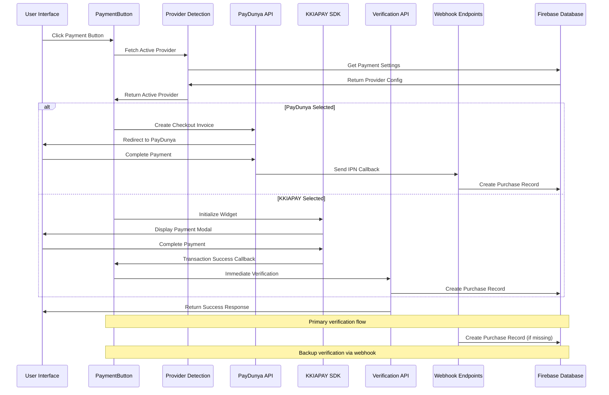

**Diagram sources**
- [payment-button.tsx:22-39](file://src/components/payment/payment-button.tsx#L22-L39)
- [route.ts:24-37](file://src/app/api/payments/provider/route.ts#L24-L37)
- [route.ts:99-131](file://src/app/api/payments/paydunya/create/route.ts#L99-L131)
- [route.ts:67-114](file://src/app/api/payments/verify/route.ts#L67-L114)

## Detailed Component Analysis

### Dynamic PaymentButton Component Implementation

The PaymentButton component serves as the main interface for initiating payments through either PayDunya or KKIAPAY based on active provider configuration:

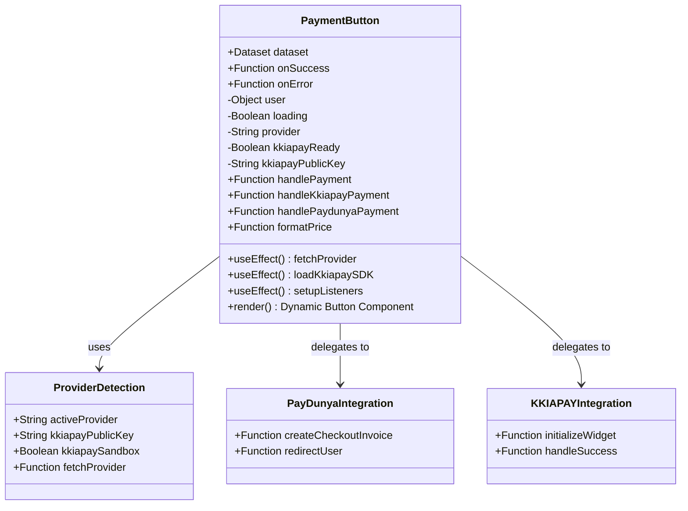

**Diagram sources**
- [payment-button.tsx:15-171](file://src/components/payment/payment-button.tsx#L15-L171)
- [route.ts:4-25](file://src/app/api/payments/provider/route.ts#L4-L25)
- [route.ts:99-131](file://src/app/api/payments/paydunya/create/route.ts#L99-L131)

#### Component Properties and Configuration

The component accepts the following configuration properties:

| Property | Type | Required | Description |
|----------|------|----------|-------------|
| dataset | Dataset | Yes | Dataset object containing pricing and metadata |
| onSuccess | Function | Yes | Callback function receiving transaction ID |
| onError | Function | No | Error handling callback |

#### Provider Detection and Loading

The component implements intelligent provider detection with fallback mechanisms:

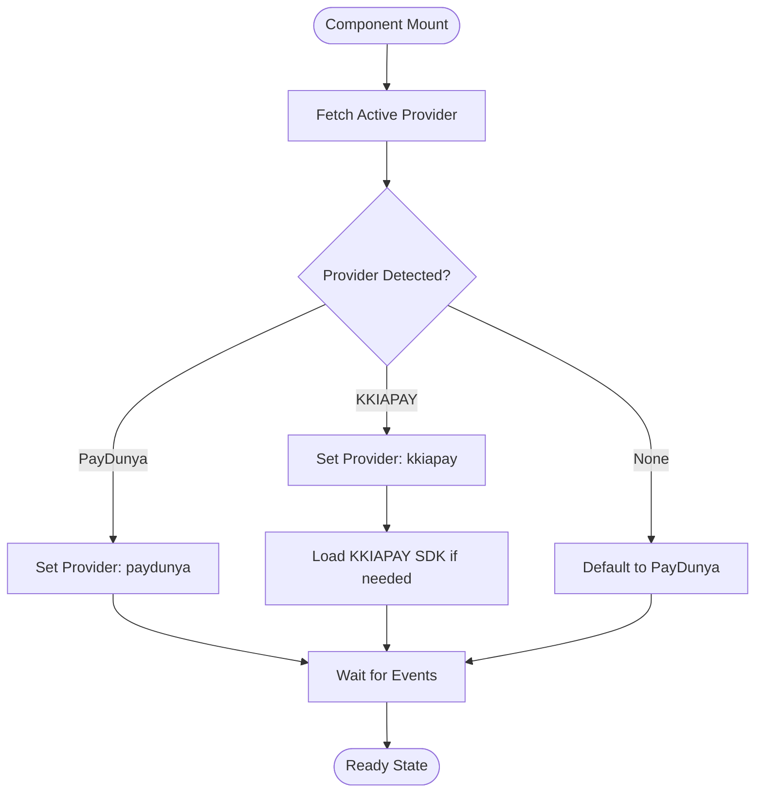

**Diagram sources**
- [payment-button.tsx:22-39](file://src/components/payment/payment-button.tsx#L22-L39)
- [route.ts:24-37](file://src/app/api/payments/provider/route.ts#L24-L37)

#### Dynamic Widget Configuration Options

The payment system dynamically configures widgets based on the active provider:

**PayDunya Configuration:**
| Parameter | Type | Description | Example Value |
|-----------|------|-------------|---------------|
| datasetId | string | Dataset identifier for checkout | dataset.id |
| amount | number | Transaction amount | dataset.price |
| currency | string | Transaction currency | dataset.currency |
| return_url | string | Success redirect URL | appUrl + `/datasets/${datasetId}?payment=success` |
| cancel_url | string | Cancel redirect URL | appUrl + `/datasets/${datasetId}?payment=cancelled` |
| callback_url | string | Webhook notification URL | appUrl + `/api/payments/paydunya/webhook` |

**KKIAPAY Configuration:**
| Parameter | Type | Description | Example Value |
|-----------|------|-------------|---------------|
| amount | number | Transaction amount in smallest currency unit | dataset.price |
| position | string | Widget positioning ("center") | "center" |
| theme | string | Brand color in hex format | "#2563eb" |
| key | string | Public API key from environment | kkiapayPublicKey or NEXT_PUBLIC_KKIAPAY_PUBLIC_KEY |
| sandbox | boolean | Development mode flag | NODE_ENV === "development" |
| email | string | Customer email address | user?.email |
| name | string | Customer full name | user?.displayName |
| data | string | JSON-encoded metadata | datasetId, userId |

**Section sources**
- [payment-button.tsx:75-97](file://src/components/payment/payment-button.tsx#L75-L97)
- [route.ts:99-131](file://src/app/api/payments/paydunya/create/route.ts#L99-L131)
- [route.ts:84-96](file://src/app/api/payments/paydunya/create/route.ts#L84-L96)

### Provider Detection API Implementation

The provider detection system fetches active payment provider settings from Firestore with comprehensive fallback mechanisms:

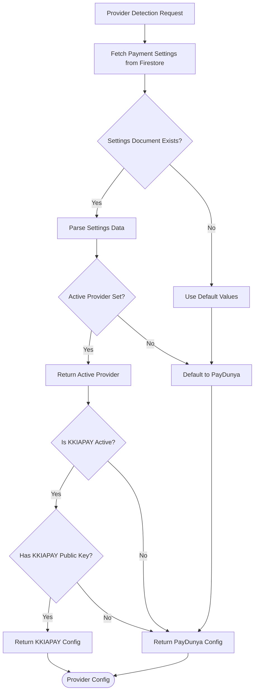

**Diagram sources**
- [route.ts:4-25](file://src/app/api/payments/provider/route.ts#L4-L25)

#### Provider Configuration Details

The provider detection endpoint returns comprehensive configuration data:

1. **Active Provider Selection**: Defaults to "paydunya" if not configured
2. **KKIAPAY Public Key**: Dynamically loaded when KKIAPAY is active
3. **Sandbox Mode**: Configurable KKIAPAY sandbox setting
4. **Environment Fallbacks**: Automatic fallback to environment variables

**Section sources**
- [route.ts:4-25](file://src/app/api/payments/provider/route.ts#L4-L25)

### Integration with Dataset Page

The dynamic payment component integrates seamlessly with the dataset viewing experience:

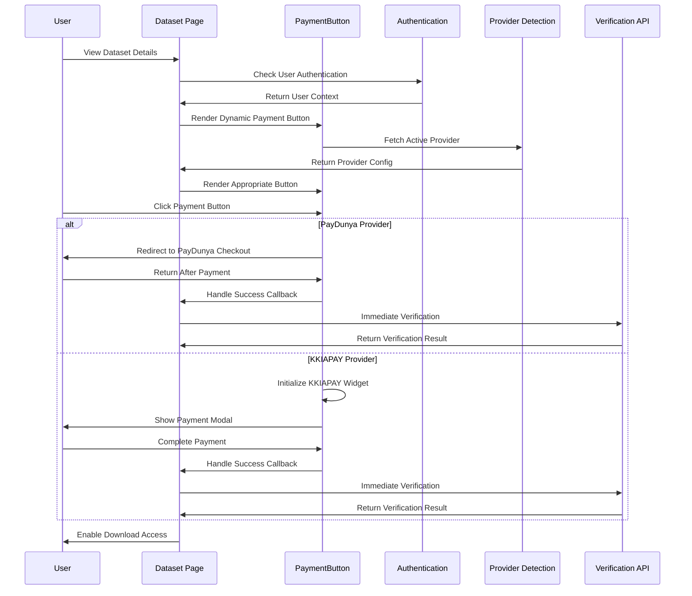

**Diagram sources**
- [page.tsx:401-424](file://src/app/datasets/[id]/page.tsx#L401-L424)
- [payment-button.tsx:133-139](file://src/components/payment/payment-button.tsx#L133-L139)

**Section sources**
- [page.tsx:401-424](file://src/app/datasets/[id]/page.tsx#L401-L424)
- [payment-button.tsx:133-139](file://src/components/payment/payment-button.tsx#L133-L139)

## Dual Provider Architecture

### Provider Selection Logic

The dual-provider architecture implements intelligent provider selection with comprehensive fallback mechanisms:

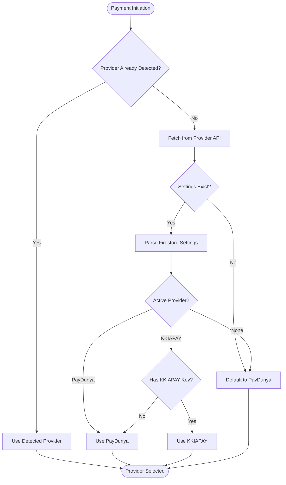

**Diagram sources**
- [payment-button.tsx:22-39](file://src/components/payment/payment-button.tsx#L22-L39)
- [route.ts:24-37](file://src/app/api/payments/provider/route.ts#L24-L37)

### Provider Configuration Management

Each provider requires specific configuration management:

**PayDunya Configuration:**
- Master Key: Used for API authentication
- Private Key: Used for API operations
- Token: Session token for PayDunya API calls
- Mode: Test or live mode selection
- Webhook URL: IPN callback endpoint

**KKIAPAY Configuration:**
- Public Key: Client-side SDK initialization
- Private Key: Server-side API authentication
- Secret Key: Webhook signature verification
- Sandbox Mode: Development environment flag

**Section sources**
- [index.ts:47-62](file://src/types/index.ts#L47-L62)
- [route.ts:39-53](file://src/app/api/payments/paydunya/create/route.ts#L39-L53)
- [route.ts:50-59](file://src/app/api/payments/verify/route.ts#L50-L59)

## Configuration Management

### Environment Variables

The dual-provider system relies on several environment variables for secure configuration:

| Variable | Purpose | Required | Example |
|----------|---------|----------|---------|
| NEXT_PUBLIC_KKIAPAY_PUBLIC_KEY | Public API key for KKIAPAY SDK | Yes (fallback) | "pk_live_xxxxxxxxxxxxx" |
| KKIAPAY_PRIVATE_KEY | Private key for KKIAPAY server-side | Yes (fallback) | "sk_live_xxxxxxxxxxxxx" |
| KKIAPAY_SECRET | Secret key for KKIAPAY webhook verification | Yes (fallback) | "secret_xxxxxxxxxxxxx" |
| PAYDUNYA_MASTER_KEY | Master key for PayDunya API | Yes (fallback) | "master_xxxxxxxxxxxxx" |
| PAYDUNYA_PRIVATE_KEY | Private key for PayDunya API | Yes (fallback) | "private_xxxxxxxxxxxxx" |
| PAYDUNYA_TOKEN | Session token for PayDunya API | Yes (fallback) | "token_xxxxxxxxxxxxx" |
| PAYDUNYA_MODE | PayDunya mode (test/live) | Yes (fallback) | "test" |

### Firestore Settings Management

Provider settings are managed through Firestore with comprehensive configuration options:

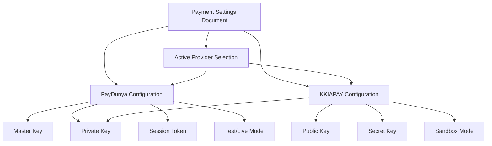

**Diagram sources**
- [index.ts:47-62](file://src/types/index.ts#L47-L62)

**Section sources**
- [route.ts:40-53](file://src/app/api/payments/paydunya/create/route.ts#L40-L53)
- [route.ts:10-17](file://src/app/api/payments/provider/route.ts#L10-L17)

## Payment Flow Implementation

### Complete Payment Lifecycle

The dual-provider payment flow encompasses multiple stages from initiation to completion:

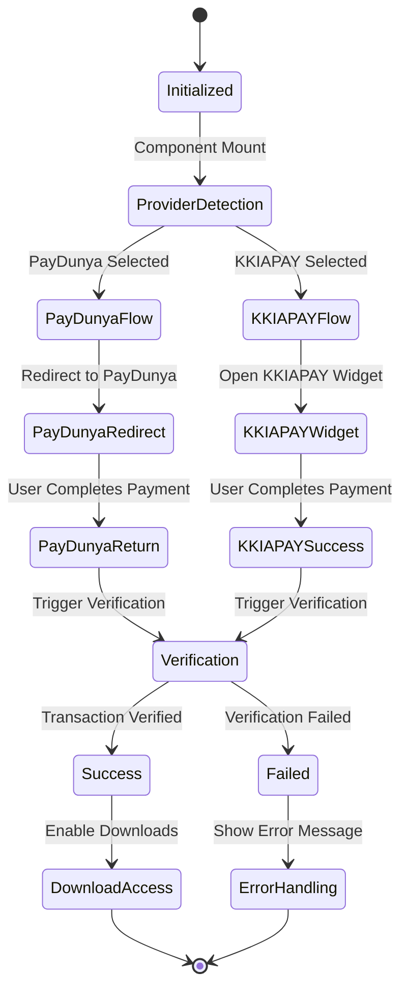

### Success Callback Mechanism

The success callback system provides robust error handling and user feedback across both providers:

| Event | Provider | Callback | Parameters | Purpose |
|-------|----------|----------|------------|---------|
| Payment Success | PayDunya | Success Callback | transactionId: string | Handle PayDunya IPN return |
| Payment Success | KKIAPAY | Success Callback | transactionId: string | Handle KKIAPAY widget callback |
| SDK Error | KKIAPAY | Error Callback | error: string | Handle KKIAPAY SDK initialization |
| Widget Error | KKIAPAY | Error Callback | error: string | Handle KKIAPAY widget errors |
| Verification Error | Both | Error Callback | error: string | Handle server-side verification |
| Authentication Error | PayDunya | Error Callback | error: string | Handle user authentication |

**Section sources**
- [payment-button.tsx:64-73](file://src/components/payment/payment-button.tsx#L64-L73)
- [page.tsx:126-162](file://src/app/datasets/[id]/page.tsx#L126-L162)

## Webhook Processing System

**Updated** The webhook processing system now supports both PayDunya and KKIAPAY providers with comprehensive security verification.

### Webhook Endpoint Architecture

The webhook endpoints process payment callbacks from both providers with comprehensive security verification:

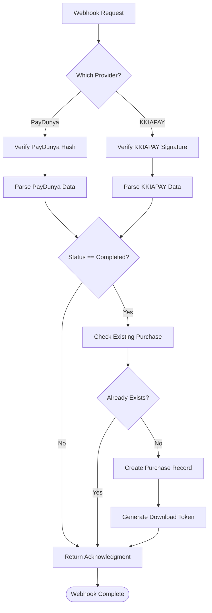

**Diagram sources**
- [route.ts:6-96](file://src/app/api/payments/paydunya/webhook/route.ts#L6-L96)
- [route.ts:6-82](file://src/app/api/payments/webhook/route.ts#L6-L82)

### PayDunya Webhook Security Features

The PayDunya webhook implements comprehensive security measures:

1. **SHA-512 Hash Verification**: HMAC-based signature validation using master key
2. **Data Parsing**: Safe JSON parsing with error handling for malformed data
3. **Transaction Validation**: Duplicate purchase prevention through Firestore queries
4. **Asynchronous Processing**: Non-blocking webhook handling for improved performance
5. **Error Resilience**: Always returns acknowledgment to prevent PayDunya retry attempts

### KKIAPAY Webhook Security Features

**Updated** Enhanced security for KKIAPAY webhook processing:

1. **Signature Verification**: HMAC SHA256 signature validation using KKIAPAY_SECRET
2. **Request Validation**: Comprehensive input validation and sanitization
3. **Transaction Validation**: Duplicate purchase prevention through transaction ID checking
4. **Asynchronous Processing**: Non-blocking webhook handling for improved performance
5. **Error Handling**: Graceful error handling without exposing internal details

### Webhook Configuration Requirements

To enable webhook processing for both providers:

1. **PayDunya Configuration**: Set master key and configure webhook URL in PayDunya dashboard
2. **KKIAPAY Configuration**: Set KKIAPAY_SECRET environment variable for signature verification
3. **SSL Certificate**: Ensure webhook endpoints are accessible via HTTPS
4. **Retry Handling**: Configure appropriate retry policies in both provider dashboards

**Section sources**
- [route.ts:6-96](file://src/app/api/payments/paydunya/webhook/route.ts#L6-L96)
- [route.ts:6-82](file://src/app/api/payments/webhook/route.ts#L6-L82)

## Security Considerations

### API Key Management

The dual-provider system implements secure API key management practices:

1. **Provider-Specific Keys**: Separate keys for each payment provider
2. **Environment Variable Usage**: All sensitive keys stored in environment variables
3. **Dynamic Loading**: KKIAPAY public key loaded dynamically based on active provider
4. **Development vs Production**: Automatic environment detection for sandbox mode
5. **Fallback Mechanisms**: Comprehensive fallback to environment variables

### Transaction Data Protection

Multiple layers of security protect transaction data across both providers:

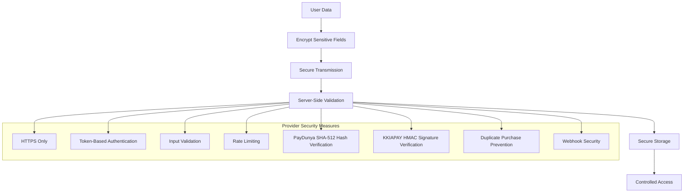

### Authentication Integration

The payment system integrates with Firebase authentication:

- **User Context**: Maintains authenticated user session for both providers
- **Token Management**: Uses Firebase ID tokens for API requests
- **Authorization**: Ensures only authenticated users can make purchases
- **Session Management**: Handles user authentication state throughout payment flow

### Provider-Specific Security Implementation

**Updated** Enhanced security for dual-provider architecture:

- **PayDunya Security**: SHA-512 hash verification using master key
- **KKIAPAY Security**: HMAC SHA256 signature verification using secret key
- **Request Validation**: Comprehensive input validation and sanitization
- **Error Handling**: Graceful error handling without exposing internal details
- **Idempotency**: Duplicate purchase prevention through transaction ID checking

**Section sources**
- [use-auth.tsx:39-67](file://src/hooks/use-auth.tsx#L39-L67)
- [page.tsx:84-120](file://src/app/datasets/[id]/page.tsx#L84-L120)
- [route.ts:18-29](file://src/app/api/payments/paydunya/webhook/route.ts#L18-L29)
- [route.ts:50-59](file://src/app/api/payments/verify/route.ts#L50-L59)

## Development and Production Setup

### Provider Configuration

The dual-provider system automatically detects and configures providers:

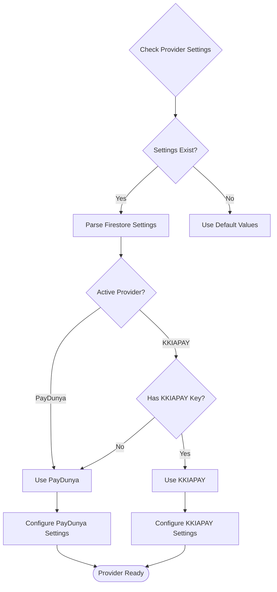

**Diagram sources**
- [route.ts:4-25](file://src/app/api/payments/provider/route.ts#L4-L25)

### Production Deployment Considerations

For production deployments, ensure the following configurations:

1. **Environment Variables**: Set all required provider environment variables
2. **Firestore Configuration**: Configure payment settings document with provider credentials
3. **SSL Certificate**: Ensure HTTPS is enabled for all payment pages
4. **Webhook Configuration**: Set up webhook endpoints for both providers
5. **Domain Whitelisting**: Configure domain restrictions in provider dashboards
6. **Monitoring**: Implement transaction monitoring and logging
7. **Provider Switching**: Test provider switching functionality

**Section sources**
- [route.ts:10-17](file://src/app/api/payments/provider/route.ts#L10-L17)
- [route.ts:54-59](file://src/app/api/payments/verify/route.ts#L54-L59)

## Troubleshooting Guide

### Common Integration Issues

| Issue | Provider | Symptoms | Solution |
|-------|----------|----------|----------|
| Provider Not Loading | Both | Button disabled, no response | Check provider settings in Firestore, verify environment variables |
| PayDunya Redirect Loop | PayDunya | Infinite redirect to checkout | Verify return URLs, check webhook configuration |
| KKIAPAY Widget Not Opening | KKIAPAY | Console errors, blank screen | Verify API key configuration, check browser console |
| Verification Failures | Both | Payment appears successful but download blocked | Check server logs, verify provider API credentials |
| Authentication Errors | PayDunya | Cannot access purchase history | Verify Firebase authentication setup |
| Currency Formatting Issues | Both | Incorrect price display | Check currency code configuration |
| PayDunya Webhook Not Received | PayDunya | Missing purchase records | Verify webhook endpoint accessibility, check hash verification |
| KKIAPAY Webhook Signature Error | KKIAPAY | 401 Unauthorized responses | Verify KKIAPAY_SECRET environment variable, check webhook configuration |
| Provider Switching Issues | Both | Wrong provider selected | Clear browser cache, check Firestore settings |

### Browser Compatibility

The dual-provider system maintains compatibility across modern browsers:

- **Chrome**: Fully supported with latest features
- **Firefox**: Compatible with standard JavaScript APIs
- **Safari**: Supports all required Web APIs
- **Mobile Browsers**: Responsive design works on iOS Safari and Android Chrome

### Debugging Tools

Enable development mode for enhanced debugging:

1. **Console Logging**: Monitor provider detection and payment events
2. **Network Inspection**: Track API requests and responses for both providers
3. **Authentication State**: Verify user session persistence
4. **Transaction Status**: Monitor payment verification progress
5. **Webhook Testing**: Use webhook testing tools for local development
6. **Provider Switching**: Test switching between providers during development

**Section sources**
- [payment-button.tsx:41-44](file://src/components/payment/payment-button.tsx#L41-L44)
- [route.ts:71-77](file://src/app/api/payments/verify/route.ts#L71-L77)

## Conclusion

The dual-provider KKIAPAY Integration component provides a robust, secure, and user-friendly payment solution for the Datafrica platform. The implementation demonstrates best practices in React component design, secure API integration, and comprehensive error handling across multiple payment providers.

**Updated** The enhanced dual-provider integration now includes comprehensive PayDunya integration alongside the existing KKIAPAY support, providing improved transaction reliability and asynchronous payment handling. The dynamic provider detection system allows for seamless switching between providers based on configuration and availability.

Key strengths of the dual-provider implementation include:

- **Modular Design**: Clean separation of concerns with dedicated components for each provider
- **Security Focus**: Proper API key management and transaction verification for both providers
- **Webhook Reliability**: Asynchronous processing for improved transaction handling
- **Provider Flexibility**: Dynamic provider switching based on configuration
- **User Experience**: Seamless payment flow with real-time feedback
- **Developer Experience**: Comprehensive error handling and debugging support
- **Scalability**: Server-side verification prevents fraud and ensures reliability
- **Resilience**: Multiple validation points prevent transaction failures
- **Future-Proofing**: Extensible architecture supports additional payment providers

The integration successfully balances functionality with security, providing a foundation for secure payment processing while maintaining flexibility for future enhancements and additional payment methods. The addition of PayDunya integration and dynamic provider detection makes the system more resilient to provider outages and improves overall transaction reliability across different regional preferences.