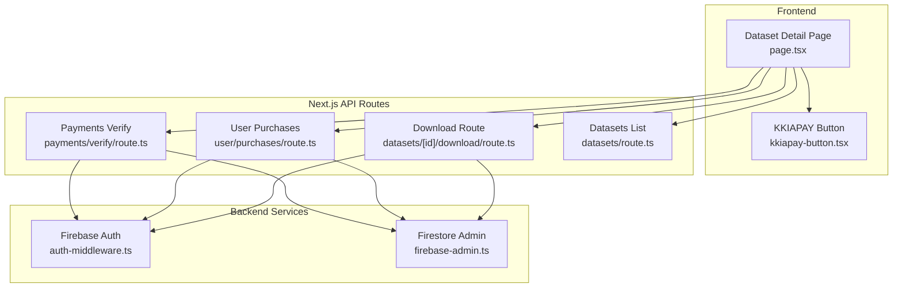
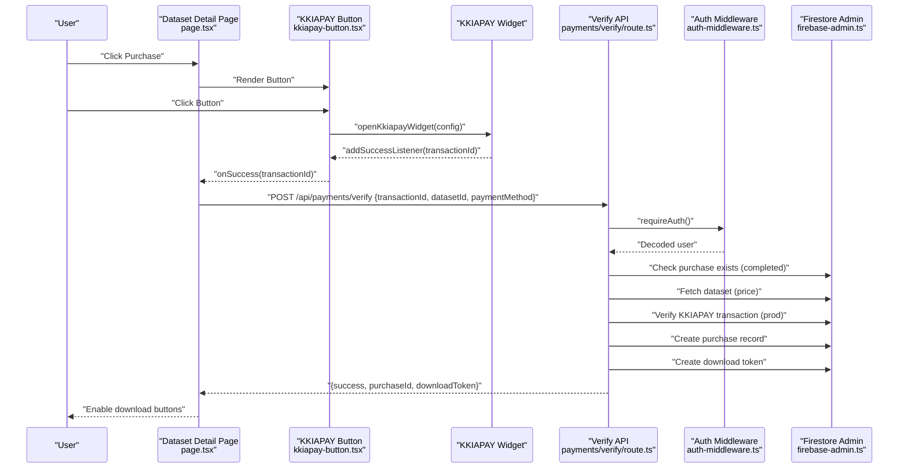
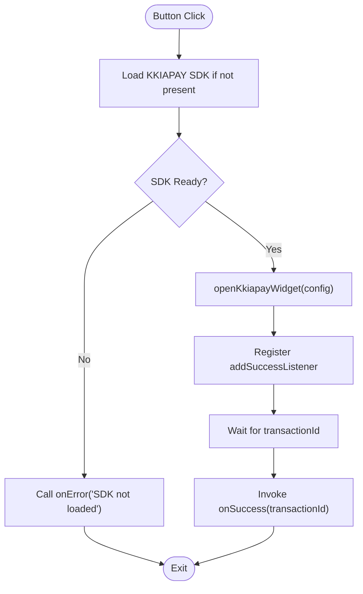
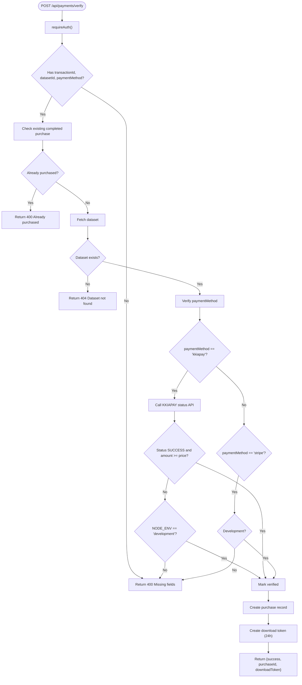
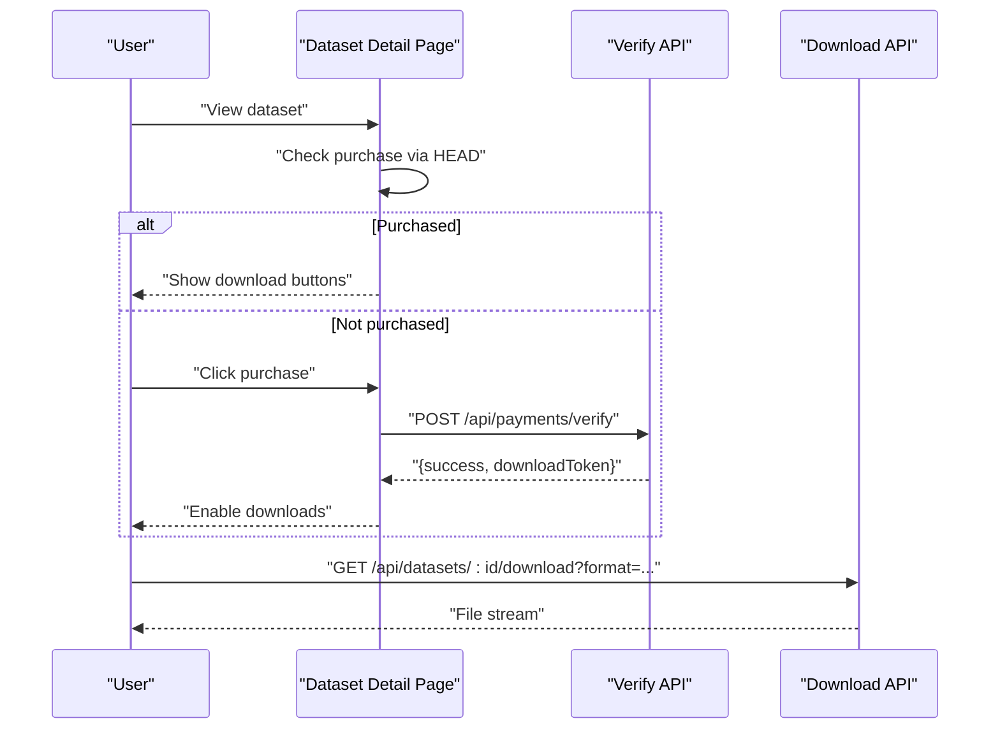
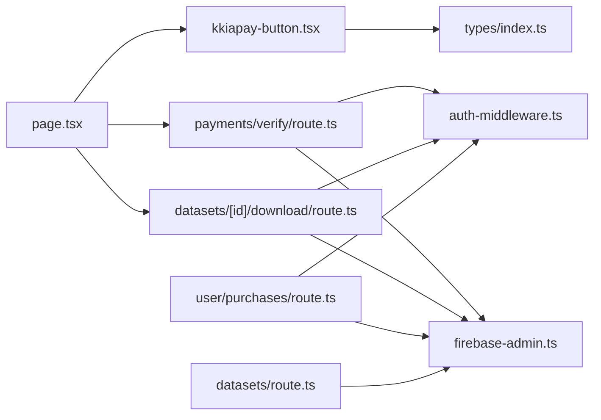

# Payment System

<cite>
**Referenced Files in This Document**
- [kkiapay-button.tsx](file://src/components/payment/kkiapay-button.tsx)
- [page.tsx](file://src/app/datasets/[id]/page.tsx)
- [route.ts](file://src/app/api/payments/verify/route.ts)
- [route.ts](file://src/app/api/user/purchases/route.ts)
- [route.ts](file://src/app/api/datasets/[id]/download/route.ts)
- [route.ts](file://src/app/api/datasets/route.ts)
- [use-auth.tsx](file://src/hooks/use-auth.tsx)
- [auth-middleware.ts](file://src/lib/auth-middleware.ts)
- [firebase-admin.ts](file://src/lib/firebase-admin.ts)
- [index.ts](file://src/types/index.ts)
- [package.json](file://package.json)
</cite>

## Table of Contents
1. [Introduction](#introduction)
2. [Project Structure](#project-structure)
3. [Core Components](#core-components)
4. [Architecture Overview](#architecture-overview)
5. [Detailed Component Analysis](#detailed-component-analysis)
6. [Dependency Analysis](#dependency-analysis)
7. [Performance Considerations](#performance-considerations)
8. [Troubleshooting Guide](#troubleshooting-guide)
9. [Conclusion](#conclusion)
10. [Appendices](#appendices)

## Introduction
This document describes Datafrica’s payment system integrated with KKIAPAY for dataset purchases. It covers the end-to-end workflow from initiating a purchase, processing payment via the KKIAPAY widget, verifying transactions, creating purchase records, issuing download tokens, and enabling dataset downloads. It also documents the KKIAPAY button component, configuration parameters, success/error callbacks, verification API behavior, purchase history, and security considerations.

## Project Structure
The payment system spans frontend components, Next.js API routes, and backend Firebase services:
- Frontend: A reusable KKIAPAY button component and a dataset detail page orchestrating purchase flow.
- Backend APIs: Payment verification, user purchases listing, dataset download, and dataset listing.
- Authentication and database: Firebase Auth and Firestore via admin SDK.

**Diagram sources**
- [page.tsx:1-382](file://src/app/datasets/[id]/page.tsx#L1-L382)
- [kkiapay-button.tsx:1-110](file://src/components/payment/kkiapay-button.tsx#L1-L110)
- [route.ts:1-135](file://src/app/api/payments/verify/route.ts#L1-L135)
- [route.ts:1-31](file://src/app/api/user/purchases/route.ts#L1-L31)
- [route.ts:1-148](file://src/app/api/datasets/[id]/download/route.ts#L1-L148)
- [route.ts:1-62](file://src/app/api/datasets/route.ts#L1-L62)
- [auth-middleware.ts:1-48](file://src/lib/auth-middleware.ts#L1-L48)
- [firebase-admin.ts:1-50](file://src/lib/firebase-admin.ts#L1-L50)

**Section sources**
- [page.tsx:1-382](file://src/app/datasets/[id]/page.tsx#L1-L382)
- [kkiapay-button.tsx:1-110](file://src/components/payment/kkiapay-button.tsx#L1-L110)
- [route.ts:1-135](file://src/app/api/payments/verify/route.ts#L1-L135)
- [route.ts:1-31](file://src/app/api/user/purchases/route.ts#L1-L31)
- [route.ts:1-148](file://src/app/api/datasets/[id]/download/route.ts#L1-L148)
- [route.ts:1-62](file://src/app/api/datasets/route.ts#L1-L62)
- [auth-middleware.ts:1-48](file://src/lib/auth-middleware.ts#L1-L48)
- [firebase-admin.ts:1-50](file://src/lib/firebase-admin.ts#L1-L50)

## Core Components
- KKIAPAY Button Component: Dynamically loads the KKIAPAY SDK, configures payment parameters, listens for success events, and invokes caller-provided callbacks.
- Dataset Detail Page: Renders dataset metadata, handles purchase state, triggers payment verification, and manages download access.
- Payment Verification API: Validates transaction via KKIAPAY API (or auto-verifies in development), creates purchase records, and issues download tokens.
- Download Route: Enforces purchase verification and optional token checks, generates downloadable files, and logs downloads.
- Purchase History API: Lists a user’s completed purchases.

**Section sources**
- [kkiapay-button.tsx:1-110](file://src/components/payment/kkiapay-button.tsx#L1-L110)
- [page.tsx:84-120](file://src/app/datasets/[id]/page.tsx#L84-L120)
- [route.ts:1-135](file://src/app/api/payments/verify/route.ts#L1-L135)
- [route.ts:1-148](file://src/app/api/datasets/[id]/download/route.ts#L1-L148)
- [route.ts:1-31](file://src/app/api/user/purchases/route.ts#L1-L31)

## Architecture Overview
The payment flow integrates the frontend KKIAPAY widget with backend verification and persistence.

**Diagram sources**
- [page.tsx:84-120](file://src/app/datasets/[id]/page.tsx#L84-L120)
- [kkiapay-button.tsx:38-80](file://src/components/payment/kkiapay-button.tsx#L38-L80)
- [route.ts:7-135](file://src/app/api/payments/verify/route.ts#L7-L135)
- [auth-middleware.ts:19-28](file://src/lib/auth-middleware.ts#L19-L28)
- [firebase-admin.ts:37-42](file://src/lib/firebase-admin.ts#L37-L42)

## Detailed Component Analysis

### KKIAPAY Button Component
Responsibilities:
- Dynamically injects the KKIAPAY SDK script and tracks readiness.
- Configures the payment widget with dataset price, currency, user identity, and custom data payload.
- Registers success listener to receive transaction identifiers.
- Provides formatted pricing display and loading states.

Key configuration parameters:
- Amount: dataset.price
- Theme color: configured via props
- Sandbox mode: toggled by NODE_ENV
- Public key: NEXT_PUBLIC_KKIAPAY_PUBLIC_KEY
- Customer identity: user email and display name
- Custom data: datasetId and userId embedded as JSON

Callbacks:
- onSuccess(transactionId): invoked on successful payment
- onError(error): optional callback for SDK load or configuration errors

Error handling:
- Guard against missing SDK
- Disable button while loading or SDK not ready
- Propagate errors to parent via onError

**Diagram sources**
- [kkiapay-button.tsx:20-80](file://src/components/payment/kkiapay-button.tsx#L20-L80)

**Section sources**
- [kkiapay-button.tsx:9-13](file://src/components/payment/kkiapay-button.tsx#L9-L13)
- [kkiapay-button.tsx:20-80](file://src/components/payment/kkiapay-button.tsx#L20-L80)
- [kkiapay-button.tsx:82-87](file://src/components/payment/kkiapay-button.tsx#L82-L87)

### Payment Verification API
Responsibilities:
- Authenticate request using Bearer token.
- Validate presence of transactionId, datasetId, and paymentMethod.
- Prevent duplicate purchases for the same dataset and user.
- Fetch dataset to verify price and currency.
- For KKIAPAY:
  - Call KKIAPAY transaction status endpoint with private/secret/public keys.
  - Require SUCCESS status and sufficient amount.
- For Stripe:
  - Placeholder for future integration; in development, marks verified.
- In development, auto-verification simplifies testing.
- On success:
  - Persist purchase record with status “completed”.
  - Issue a single-use download token with 24-hour expiry.

Security considerations:
- Uses environment variables for KKIAPAY credentials.
- Requires authenticated requests.
- Verifies dataset existence and price before recording purchase.

**Diagram sources**
- [route.ts:7-135](file://src/app/api/payments/verify/route.ts#L7-L135)

**Section sources**
- [route.ts:12-20](file://src/app/api/payments/verify/route.ts#L12-L20)
- [route.ts:22-36](file://src/app/api/payments/verify/route.ts#L22-L36)
- [route.ts:38-44](file://src/app/api/payments/verify/route.ts#L38-L44)
- [route.ts:47-84](file://src/app/api/payments/verify/route.ts#L47-L84)
- [route.ts:86-89](file://src/app/api/payments/verify/route.ts#L86-L89)
- [route.ts:98-126](file://src/app/api/payments/verify/route.ts#L98-L126)

### Dataset Detail Page and Purchase Flow
Responsibilities:
- Render dataset metadata and preview.
- Detect prior purchases via HEAD check against download route.
- On payment success:
  - Obtain ID token.
  - Call verification API with transactionId, datasetId, and paymentMethod.
  - On success, enable download buttons and store download token.
- Download flow:
  - Requires authenticated user.
  - Optionally validates download token and marks it used.
  - Generates CSV/Excel/JSON based on requested format.

**Diagram sources**
- [page.tsx:62-82](file://src/app/datasets/[id]/page.tsx#L62-L82)
- [page.tsx:84-120](file://src/app/datasets/[id]/page.tsx#L84-L120)
- [page.tsx:122-162](file://src/app/datasets/[id]/page.tsx#L122-L162)
- [route.ts:8-68](file://src/app/api/datasets/[id]/download/route.ts#L8-L68)

**Section sources**
- [page.tsx:62-82](file://src/app/datasets/[id]/page.tsx#L62-L82)
- [page.tsx:84-120](file://src/app/datasets/[id]/page.tsx#L84-L120)
- [page.tsx:122-162](file://src/app/datasets/[id]/page.tsx#L122-L162)

### Download Route and Access Control
Responsibilities:
- Authenticate user via Bearer token.
- Verify purchase exists for the user and dataset with status “completed”.
- Optionally validate and consume a download token (single-use, 24h expiry).
- Stream CSV/Excel/JSON file based on requested format.
- Log download event.

Access control:
- Unauthorized users receive 401.
- Non-purchasers receive 403.
- Invalid/expired tokens receive 403.

**Section sources**
- [route.ts:18-36](file://src/app/api/datasets/[id]/download/route.ts#L18-L36)
- [route.ts:38-68](file://src/app/api/datasets/[id]/download/route.ts#L38-L68)
- [route.ts:99-105](file://src/app/api/datasets/[id]/download/route.ts#L99-L105)
- [route.ts:108-139](file://src/app/api/datasets/[id]/download/route.ts#L108-L139)

### Purchase History System
Responsibilities:
- Retrieve all purchases for the authenticated user.
- Order by creation date descending.

**Section sources**
- [route.ts:11-22](file://src/app/api/user/purchases/route.ts#L11-L22)

## Dependency Analysis
- Frontend components depend on:
  - use-auth hook for user state and ID token retrieval.
  - Types for Dataset and Purchase.
- Backend routes depend on:
  - Authentication middleware for Bearer token verification.
  - Firebase Admin SDK for Firestore operations.
- External integrations:
  - KKIAPAY SDK and API for payment processing.
  - Papa Parse and SheetJS for CSV/Excel generation.

**Diagram sources**
- [kkiapay-button.tsx:1-110](file://src/components/payment/kkiapay-button.tsx#L1-L110)
- [page.tsx:1-382](file://src/app/datasets/[id]/page.tsx#L1-L382)
- [route.ts:1-135](file://src/app/api/payments/verify/route.ts#L1-L135)
- [route.ts:1-148](file://src/app/api/datasets/[id]/download/route.ts#L1-L148)
- [route.ts:1-31](file://src/app/api/user/purchases/route.ts#L1-L31)
- [route.ts:1-62](file://src/app/api/datasets/route.ts#L1-L62)
- [auth-middleware.ts:1-48](file://src/lib/auth-middleware.ts#L1-L48)
- [firebase-admin.ts:1-50](file://src/lib/firebase-admin.ts#L1-L50)
- [index.ts:1-90](file://src/types/index.ts#L1-L90)

**Section sources**
- [use-auth.tsx:1-117](file://src/hooks/use-auth.tsx#L1-L117)
- [auth-middleware.ts:1-48](file://src/lib/auth-middleware.ts#L1-L48)
- [firebase-admin.ts:1-50](file://src/lib/firebase-admin.ts#L1-L50)
- [index.ts:1-90](file://src/types/index.ts#L1-L90)
- [package.json:11-37](file://package.json#L11-L37)

## Performance Considerations
- SDK Loading:
  - The KKIAPAY SDK is injected once and cached; subsequent payments reuse the loaded widget.
- Verification:
  - KKIAPAY API calls are made server-side to avoid exposing secrets to clients.
  - In development, verification short-circuits to speed up testing.
- File Generation:
  - CSV generation uses streaming/unparse; Excel generation uses in-memory buffers.
  - Consider pagination or chunked exports for very large datasets to reduce memory usage.
- Network Calls:
  - Minimize redundant Firestore reads by checking purchase existence before verification.
- UI Responsiveness:
  - Loading states and disabled buttons prevent duplicate submissions and improve UX.

[No sources needed since this section provides general guidance]

## Troubleshooting Guide
Common issues and resolutions:
- SDK Not Loaded:
  - Symptom: onError callback triggered with “SDK not loaded”.
  - Cause: Script injection failure or ad-blockers.
  - Resolution: Ensure NEXT_PUBLIC_KKIAPAY_PUBLIC_KEY is set; retry or whitelist CDN.
- Missing Credentials:
  - Symptom: Verification fails in production.
  - Cause: Missing KKIAPAY private/secret/public keys.
  - Resolution: Set KKIAPAY_PRIVATE_KEY, KKIAPAY_SECRET, NEXT_PUBLIC_KKIAPAY_PUBLIC_KEY.
- Duplicate Purchase:
  - Symptom: 400 error indicating already purchased.
  - Cause: Existing completed purchase record.
  - Resolution: Inform user or redirect to purchases list.
- Transaction Verification Failure:
  - Symptom: 400 error on verification.
  - Cause: Transaction not successful or amount insufficient.
  - Resolution: Retry payment; confirm amount and currency match dataset.
- Download Access Denied:
  - Symptom: 403 errors on download.
  - Cause: Missing or invalid token; user not authenticated; no purchase record.
  - Resolution: Re-run verification; ensure token is fresh and unexpired.
- Development Auto-Verification:
  - Behavior: In development, verification always passes for convenience.
  - Impact: May mask real-world issues; test production credentials.

**Section sources**
- [kkiapay-button.tsx:41-44](file://src/components/payment/kkiapay-button.tsx#L41-L44)
- [route.ts:15-20](file://src/app/api/payments/verify/route.ts#L15-L20)
- [route.ts:31-36](file://src/app/api/payments/verify/route.ts#L31-L36)
- [route.ts:71-77](file://src/app/api/payments/verify/route.ts#L71-L77)
- [route.ts:31-36](file://src/app/api/datasets/[id]/download/route.ts#L31-L36)
- [route.ts:49-54](file://src/app/api/datasets/[id]/download/route.ts#L49-L54)
- [route.ts:86-89](file://src/app/api/payments/verify/route.ts#L86-L89)

## Conclusion
Datafrica’s payment system integrates KKIAPAY seamlessly with a robust backend verification and persistence layer. The frontend provides a smooth purchase experience, while the backend enforces access control, validates transactions, and grants download access. The modular design allows for easy extension to additional payment providers and improved performance optimizations for large datasets.

[No sources needed since this section summarizes without analyzing specific files]

## Appendices

### Security Considerations
- Secret Management:
  - Store KKIAPAY private/secret/public keys in environment variables; never expose to client.
- Authentication:
  - All sensitive routes require Bearer token verification.
- Data Validation:
  - Verify dataset existence and price before recording purchases.
- Token Usage:
  - Download tokens are single-use and expire after 24 hours.
- CORS and Headers:
  - Ensure proper headers and origin policies for API routes.

**Section sources**
- [route.ts:50-62](file://src/app/api/payments/verify/route.ts#L50-L62)
- [route.ts:113-120](file://src/app/api/payments/verify/route.ts#L113-L120)
- [route.ts:39-68](file://src/app/api/datasets/[id]/download/route.ts#L39-L68)
- [auth-middleware.ts:4-17](file://src/lib/auth-middleware.ts#L4-L17)

### Integration Patterns for Failures, Retries, and Refunds
- Failure Handling:
  - On KKIAPAY verification failure, surface user-friendly messages and allow retry.
  - On network errors, retry with exponential backoff and inform user.
- Retries:
  - Offer a retry button after payment success; call verification API again with same transactionId.
- Refunds:
  - Implement refund workflow by calling KKIAPAY refund API and updating purchase status to “refunded.”
  - Maintain audit trail in Firestore for refunds.

[No sources needed since this section provides general guidance]

### Environment Variables
Required for payment and authentication:
- NEXT_PUBLIC_KKIAPAY_PUBLIC_KEY
- KKIAPAY_PRIVATE_KEY
- KKIAPAY_SECRET
- FIREBASE_ADMIN_PROJECT_ID
- FIREBASE_ADMIN_CLIENT_EMAIL
- FIREBASE_ADMIN_PRIVATE_KEY

**Section sources**
- [kkiapay-button.tsx:54-54](file://src/components/payment/kkiapay-button.tsx#L54-L54)
- [route.ts:56-58](file://src/app/api/payments/verify/route.ts#L56-L58)
- [firebase-admin.ts:20-24](file://src/lib/firebase-admin.ts#L20-L24)