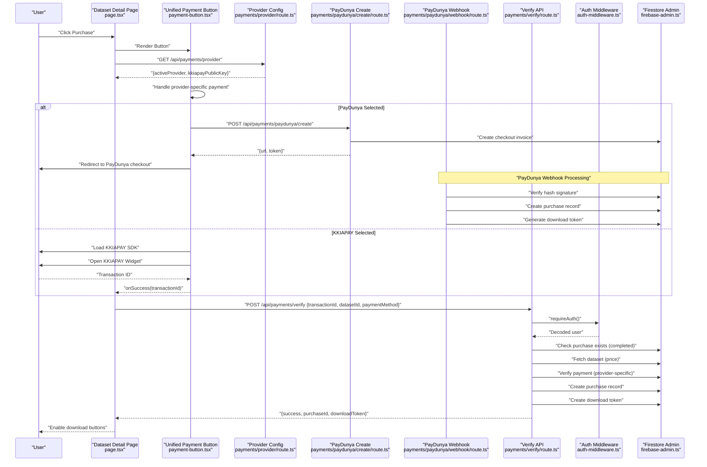
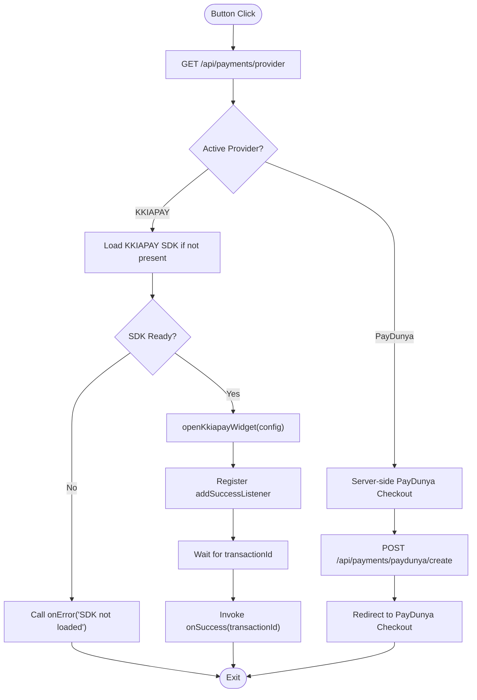
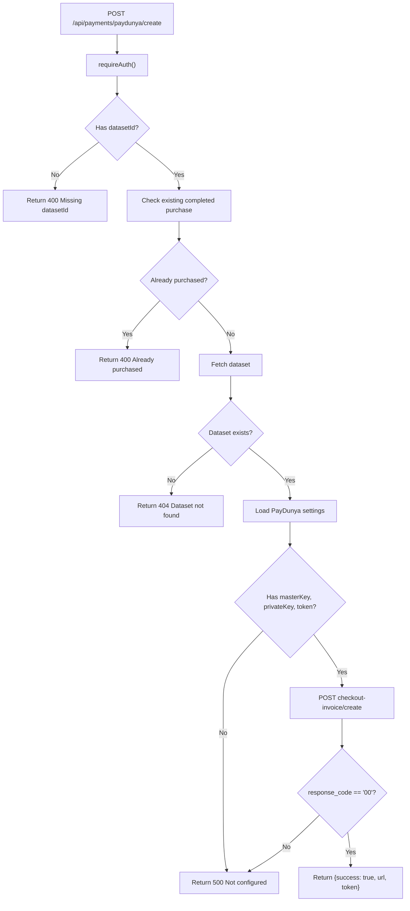
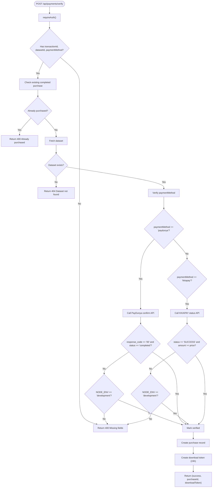
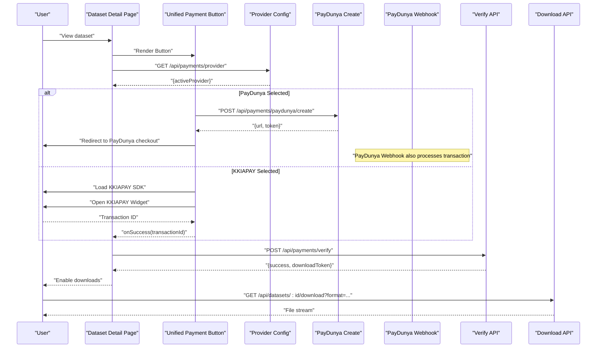
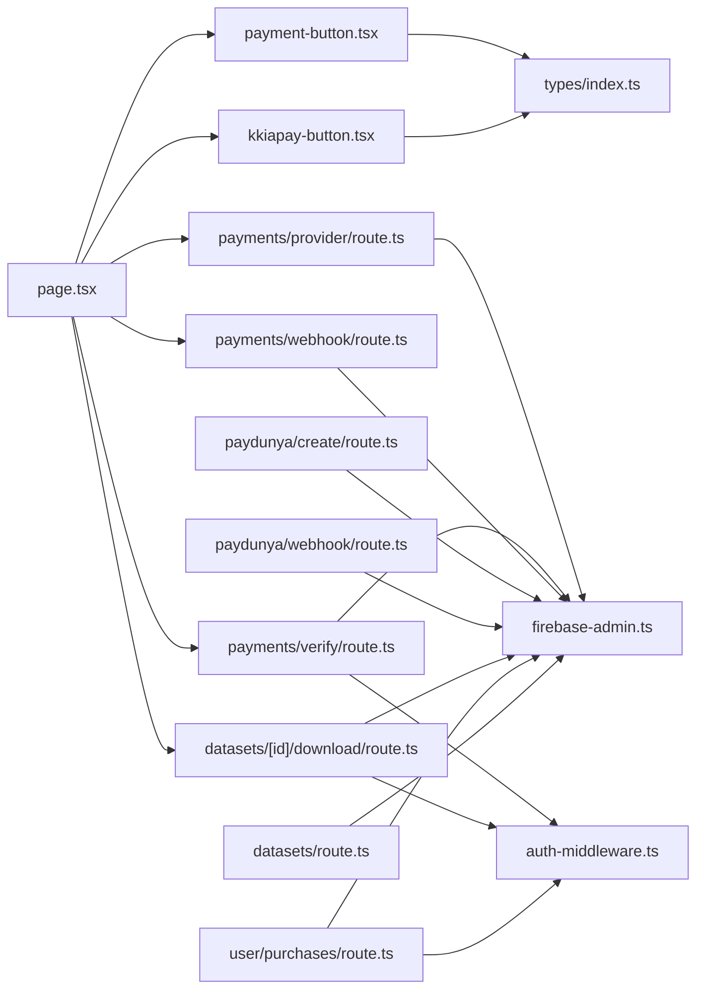

# Payment System

<cite>
**Referenced Files in This Document**
- [payment-button.tsx](file://src/components/payment/payment-button.tsx)
- [kkiapay-button.tsx](file://src/components/payment/kkiapay-button.tsx)
- [page.tsx](file://src/app/datasets/[id]/page.tsx)
- [route.ts](file://src/app/api/payments/verify/route.ts)
- [route.ts](file://src/app/api/payments/webhook/route.ts)
- [route.ts](file://src/app/api/payments/provider/route.ts)
- [route.ts](file://src/app/api/payments/paydunya/create/route.ts)
- [route.ts](file://src/app/api/payments/paydunya/webhook/route.ts)
- [route.ts](file://src/app/api/admin/payment-settings/route.ts)
- [page.tsx](file://src/app/admin/payments/page.tsx)
- [route.ts](file://src/app/api/user/purchases/route.ts)
- [route.ts](file://src/app/api/datasets/[id]/download/route.ts)
- [route.ts](file://src/app/api/datasets/route.ts)
- [auth-middleware.ts](file://src/lib/auth-middleware.ts)
- [firebase-admin.ts](file://src/lib/firebase-admin.ts)
- [index.ts](file://src/types/index.ts)
- [package.json](file://package.json)
</cite>

## Update Summary
**Changes Made**
- Complete replacement of single-payment-provider system with dual-provider architecture supporting both PayDunya and KKIAPAY
- Added comprehensive PayDunya integration including new API endpoints, admin configuration interface, and dynamic payment selection system
- Implemented dynamic payment provider switching with real-time configuration management
- Enhanced payment verification system to support both providers with unified interface
- Added PayDunya webhook endpoint for automatic transaction processing
- Updated architecture diagrams to reflect dual-provider workflow
- Integrated PayDunya checkout invoice creation and webhook processing
- Added PayDunya settings management in admin panel with live/test mode support

## Table of Contents
1. [Introduction](#introduction)
2. [Project Structure](#project-structure)
3. [Core Components](#core-components)
4. [Architecture Overview](#architecture-overview)
5. [Detailed Component Analysis](#detailed-component-analysis)
6. [Dependency Analysis](#dependency-analysis)
7. [Performance Considerations](#performance-considerations)
8. [Troubleshooting Guide](#troubleshooting-guide)
9. [Conclusion](#conclusion)
10. [Appendices](#appendices)

## Introduction
This document describes Datafrica's dual-provider payment system integrated with both PayDunya and KKIAPAY for dataset purchases. The system now supports dynamic provider switching, allowing administrators to choose between PayDunya (mobile money & cards - West Africa) and KKIAPAY (mobile money & cards - Africa) based on regional preferences and business requirements. The architecture includes comprehensive webhook processing, admin configuration management, and unified payment verification across both providers.

## Project Structure
The payment system now spans frontend components, Next.js API routes for both providers, and backend Firebase services with dynamic provider configuration:
- Frontend: Unified payment button component with dynamic provider detection and separate legacy KKIAPAY button
- Backend APIs: Dual-provider payment creation, verification, webhook processing, provider configuration, and admin settings management
- Authentication and database: Firebase Auth and Firestore via admin SDK with provider-specific configurations

```mermaid
graph TB
subgraph "Frontend"
UI["Dataset Detail Page<br/>page.tsx"]
BTN["Unified Payment Button<br/>payment-button.tsx"]
LEGACY["Legacy KKIAPAY Button<br/>kkiapay-button.tsx"]
END
subgraph "Next.js API Routes"
PROVIDER["Provider Config<br/>payments/provider/route.ts"]
VERIFY["Payments Verify<br/>payments/verify/route.ts"]
WEBHOOK["Payments Webhook<br/>payments/webhook/route.ts"]
PD_CREATE["PayDunya Create<br/>payments/paydunya/create/route.ts"]
PD_WEBHOOK["PayDunya Webhook<br/>payments/paydunya/webhook/route.ts"]
ADMIN_SETTINGS["Admin Settings<br/>admin/payment-settings/route.ts"]
PURCHASES["User Purchases<br/>user/purchases/route.ts"]
DOWNLOAD["Download Route<br/>datasets/[id]/download/route.ts"]
LIST["Datasets List<br/>datasets/route.ts"]
END
subgraph "Backend Services"
AUTH["Firebase Auth<br/>auth-middleware.ts"]
DB["Firestore Admin<br/>firebase-admin.ts"]
END
UI --> BTN
UI --> LEGACY
UI --> PROVIDER
UI --> VERIFY
UI --> WEBHOOK
UI --> DOWNLOAD
UI --> PURCHASES
UI --> LIST
BTN --> PD_CREATE
BTN --> PD_WEBHOOK
PROVIDER --> DB
VERIFY --> AUTH
VERIFY --> DB
WEBHOOK --> DB
PD_CREATE --> DB
PD_WEBHOOK --> DB
ADMIN_SETTINGS --> DB
PURCHASES --> AUTH
PURCHASES --> DB
DOWNLOAD --> AUTH
DOWNLOAD --> DB
```

**Diagram sources**
- [page.tsx:1-470](file://src/app/datasets/[id]/page.tsx#L1-L470)
- [payment-button.tsx:1-171](file://src/components/payment/payment-button.tsx#L1-L171)
- [kkiapay-button.tsx:1-110](file://src/components/payment/kkiapay-button.tsx#L1-L110)
- [route.ts:1-26](file://src/app/api/payments/provider/route.ts#L1-L26)
- [route.ts:1-171](file://src/app/api/payments/verify/route.ts#L1-L171)
- [route.ts:1-82](file://src/app/api/payments/webhook/route.ts#L1-L82)
- [route.ts:1-129](file://src/app/api/payments/paydunya/create/route.ts#L1-L129)
- [route.ts:1-96](file://src/app/api/payments/paydunya/webhook/route.ts#L1-L96)
- [route.ts:1-120](file://src/app/api/admin/payment-settings/route.ts#L1-L120)
- [route.ts:1-31](file://src/app/api/user/purchases/route.ts#L1-L31)
- [route.ts:1-198](file://src/app/api/datasets/[id]/download/route.ts#L1-L198)
- [route.ts:1-62](file://src/app/api/datasets/route.ts#L1-L62)
- [auth-middleware.ts:1-48](file://src/lib/auth-middleware.ts#L1-L48)
- [firebase-admin.ts:1-58](file://src/lib/firebase-admin.ts#L1-L58)

**Section sources**
- [page.tsx:1-470](file://src/app/datasets/[id]/page.tsx#L1-L470)
- [payment-button.tsx:1-171](file://src/components/payment/payment-button.tsx#L1-L171)
- [kkiapay-button.tsx:1-110](file://src/components/payment/kkiapay-button.tsx#L1-L110)
- [route.ts:1-26](file://src/app/api/payments/provider/route.ts#L1-L26)
- [route.ts:1-171](file://src/app/api/payments/verify/route.ts#L1-L171)
- [route.ts:1-129](file://src/app/api/payments/paydunya/create/route.ts#L1-L129)
- [route.ts:1-96](file://src/app/api/payments/paydunya/webhook/route.ts#L1-L96)
- [route.ts:1-120](file://src/app/api/admin/payment-settings/route.ts#L1-L120)
- [route.ts:1-31](file://src/app/api/user/purchases/route.ts#L1-L31)
- [route.ts:1-198](file://src/app/api/datasets/[id]/download/route.ts#L1-L198)
- [route.ts:1-62](file://src/app/api/datasets/route.ts#L1-L62)
- [auth-middleware.ts:1-48](file://src/lib/auth-middleware.ts#L1-L48)
- [firebase-admin.ts:1-58](file://src/lib/firebase-admin.ts#L1-L58)

## Core Components
- **Unified Payment Button**: Dynamically detects active provider, loads appropriate SDK, configures payment parameters, and handles both PayDunya and KKIAPAY transactions
- **Legacy KKIAPAY Button**: Separate component for backward compatibility with existing implementations
- **Dynamic Provider Configuration**: Real-time provider switching with settings stored in Firestore and environment variables as fallback
- **PayDunya Integration**: Full checkout invoice creation via PayDunya REST API with webhook processing and automatic purchase validation
- **Payment Verification API**: Unified interface supporting both providers with provider-specific verification logic
- **Admin Configuration Interface**: Comprehensive settings management for both providers with live/test mode support
- **Webhook Endpoints**: Separate webhook handlers for each provider with signature/hash verification and automatic purchase creation
- **Download Route**: Enhanced access control supporting both provider purchase records
- **Purchase History API**: Unified purchase listing across both payment providers

**Section sources**
- [payment-button.tsx:15-171](file://src/components/payment/payment-button.tsx#L15-L171)
- [kkiapay-button.tsx:15-110](file://src/components/payment/kkiapay-button.tsx#L15-L110)
- [route.ts:1-26](file://src/app/api/payments/provider/route.ts#L1-L26)
- [route.ts:1-129](file://src/app/api/payments/paydunya/create/route.ts#L1-L129)
- [route.ts:1-171](file://src/app/api/payments/verify/route.ts#L1-L171)
- [page.tsx:160-444](file://src/app/admin/payments/page.tsx#L160-L444)
- [route.ts:1-96](file://src/app/api/payments/paydunya/webhook/route.ts#L1-L96)
- [route.ts:1-198](file://src/app/api/datasets/[id]/download/route.ts#L1-L198)
- [route.ts:1-31](file://src/app/api/user/purchases/route.ts#L1-L31)

## Architecture Overview
The payment flow now supports dual providers with dynamic selection, integrating frontend payment buttons with backend verification and persistence across both PayDunya and KKIAPAY systems.



**Diagram sources**
- [page.tsx:62-104](file://src/app/datasets/[id]/page.tsx#L62-L104)
- [payment-button.tsx:22-139](file://src/components/payment/payment-button.tsx#L22-L139)
- [route.ts:6-26](file://src/app/api/payments/provider/route.ts#L6-L26)
- [route.ts:5-129](file://src/app/api/payments/paydunya/create/route.ts#L5-L129)
- [route.ts:6-96](file://src/app/api/payments/paydunya/webhook/route.ts#L6-L96)
- [route.ts:7-171](file://src/app/api/payments/verify/route.ts#L7-L171)
- [auth-middleware.ts:19-28](file://src/lib/auth-middleware.ts#L19-L28)
- [firebase-admin.ts:37-42](file://src/lib/firebase-admin.ts#L37-L42)

## Detailed Component Analysis

### Unified Payment Button Component
**Updated** Complete replacement with dual-provider architecture supporting dynamic provider switching.

Responsibilities:
- Dynamically detect active payment provider from Firestore settings
- Load appropriate SDK (PayDunya REST API or KKIAPAY SDK) based on provider
- Handle provider-specific payment initiation and success callbacks
- Manage loading states and error handling for both providers
- Format pricing display with currency awareness

Key configuration parameters:
- Dynamic provider detection via `/api/payments/provider` endpoint
- PayDunya: REST API integration with checkout invoice creation
- KKIAPAY: SDK-based widget with public key configuration
- Automatic sandbox/live mode detection based on provider settings

Provider-specific handling:
- **PayDunya**: Server-side checkout invoice creation, redirects to PayDunya checkout page
- **KKIAPAY**: Client-side SDK loading and widget initialization
- **Fallback**: Graceful degradation if provider configuration is unavailable



**Diagram sources**
- [payment-button.tsx:22-139](file://src/components/payment/payment-button.tsx#L22-L139)
- [route.ts:6-26](file://src/app/api/payments/provider/route.ts#L6-L26)
- [route.ts:5-129](file://src/app/api/payments/paydunya/create/route.ts#L5-L129)

**Section sources**
- [payment-button.tsx:15-171](file://src/components/payment/payment-button.tsx#L15-L171)
- [route.ts:6-26](file://src/app/api/payments/provider/route.ts#L6-L26)
- [route.ts:5-129](file://src/app/api/payments/paydunya/create/route.ts#L5-L129)

### Legacy KKIAPAY Button Component
**Updated** Maintained for backward compatibility while transitioning to unified system.

Responsibilities:
- Legacy KKIAPAY SDK integration with manual success listener registration
- Direct widget configuration with dataset and user information
- Standalone component for existing implementations

Key configuration parameters:
- Amount: dataset.price
- Theme color: configured via props
- Sandbox mode: toggled by NODE_ENV
- Public key: NEXT_PUBLIC_KKIAPAY_PUBLIC_KEY
- Customer identity: user email and display name
- Custom data: datasetId and userId embedded as JSON

Callbacks:
- onSuccess(transactionId): invoked on successful payment
- onError(error): optional callback for SDK load or configuration errors

Error handling:
- Guard against missing SDK
- Disable button while loading or SDK not ready
- Propagate errors to parent via onError

**Section sources**
- [kkiapay-button.tsx:15-110](file://src/components/payment/kkiapay-button.tsx#L15-L110)

### Dynamic Provider Configuration
**New** Centralized provider management system with real-time switching capability.

Responsibilities:
- Store active payment provider in Firestore settings collection
- Provide public endpoint for frontend to detect active provider
- Support fallback to environment variables for configuration
- Enable live/test mode switching for both providers

Configuration structure:
- `activeProvider`: "paydunya" or "kkiapay"
- Provider-specific settings with masking for security
- Timestamp tracking of last update

API endpoints:
- `GET /api/payments/provider`: Public provider configuration
- `GET /api/admin/payment-settings`: Admin-only settings retrieval
- `PUT /api/admin/payment-settings`: Admin-only settings update

**Section sources**
- [route.ts:1-26](file://src/app/api/payments/provider/route.ts#L1-L26)
- [route.ts:1-120](file://src/app/api/admin/payment-settings/route.ts#L1-L120)
- [page.tsx:160-444](file://src/app/admin/payments/page.tsx#L160-L444)

### PayDunya Integration
**New** Complete PayDunya payment processing system with checkout invoices and webhook handling.

#### PayDunya Checkout Invoice Creation
Responsibilities:
- Create PayDunya checkout invoices via REST API
- Validate dataset and user information before invoice creation
- Generate secure checkout URLs for customer redirection
- Handle PayDunya API responses and error conditions
- Support both test and live modes with different base URLs

Key features:
- Invoice payload with item details, total amount, and custom data
- Store configuration with master key, private key, and token
- Callback URL configuration for webhook integration
- Return/cancel URL handling for checkout flow completion

#### PayDunya Webhook Processing
Responsibilities:
- Receive PayDunya IPN callbacks via POST requests
- Verify webhook authenticity using SHA-512 hash verification
- Extract transaction details from webhook payload
- Parse custom data containing datasetId and userId
- Validate transaction status and create purchase records automatically
- Prevent duplicate purchase creation for the same transaction
- Always return HTTP 200 to acknowledge receipt and prevent PayDunya retries

Signature Verification Process:
- Extract hash from webhook payload
- Generate expected hash using PayDunya master key with SHA-512
- Compare hashes for authenticity validation
- Reject requests with invalid hashes

Transaction Validation:
- Ensure transactionId is present in webhook payload
- Parse custom data field for datasetId and userId
- Verify status equals "completed" for payment completion
- Create purchase record only for successful transactions

Automatic Purchase Creation:
- Check Firestore for existing purchase with same transactionId
- Fetch dataset metadata for title and pricing information
- Create purchase record with source "webhook" for audit trails
- Include payment method, amount, currency, and timestamp



**Diagram sources**
- [route.ts:5-129](file://src/app/api/payments/paydunya/create/route.ts#L5-L129)

**Section sources**
- [route.ts:5-129](file://src/app/api/payments/paydunya/create/route.ts#L5-L129)
- [route.ts:6-96](file://src/app/api/payments/paydunya/webhook/route.ts#L6-L96)

### Payment Verification API
**Updated** Enhanced to support dual providers with unified interface.

Responsibilities:
- Authenticate request using Bearer token
- Validate presence of transactionId, datasetId, and paymentMethod
- Prevent duplicate purchases for the same dataset and user
- Fetch dataset to verify price and currency
- **PayDunya verification**: Call PayDunya checkout-invoice/confirm endpoint with provider-specific keys
- **KKIAPAY verification**: Call KKIAPAY transaction status endpoint with private/secret/public keys
- **Stripe verification**: Placeholder for future integration; in development, marks verified
- In development, auto-verification simplifies testing
- On success:
  - Persist purchase record with provider-specific status
  - Issue a single-use download token with 24-hour expiry

Provider-specific verification logic:
- **PayDunya**: Confirm checkout invoice status via REST API with proper headers
- **KKIAPAY**: Verify transaction status and amount via KKIAPAY API
- **Stripe**: Future implementation placeholder

Security considerations:
- Uses environment variables for provider credentials
- Requires authenticated requests
- Verifies dataset existence and price before recording purchase
- Supports both test and live modes for each provider



**Diagram sources**
- [route.ts:7-171](file://src/app/api/payments/verify/route.ts#L7-L171)

**Section sources**
- [route.ts:7-171](file://src/app/api/payments/verify/route.ts#L7-L171)

### Admin Configuration Interface
**Updated** Comprehensive admin panel for managing dual-provider configuration.

Responsibilities:
- Provide tabbed interface for PayDunya and KKIAPAY settings
- Support live/test mode switching for both providers
- Mask sensitive configuration values for security
- Validate provider selection and settings
- Store configuration in Firestore with audit trails

Key features:
- **Provider Selection**: Toggle between PayDunya and KKIAPAY as active provider
- **PayDunya Configuration**: Master key, private key, public key, token, and mode selection
- **KKIAPAY Configuration**: Public key, private key, secret, and sandbox toggle
- **Webhook URLs**: Display appropriate webhook endpoints for each provider
- **Real-time Preview**: Show active provider selection and configuration status

Configuration management:
- Mask sensitive keys when displaying to prevent exposure
- Preserve existing values when updating partial settings
- Validate provider selection against supported values
- Support environment variable fallbacks for configuration

**Section sources**
- [page.tsx:160-444](file://src/app/admin/payments/page.tsx#L160-L444)
- [route.ts:1-120](file://src/app/api/admin/payment-settings/route.ts#L1-L120)

### Dataset Detail Page and Purchase Flow
**Updated** Enhanced to support dual-provider payment processing with unified flow.

Responsibilities:
- Render dataset metadata and preview
- Detect prior purchases via HEAD check against download route
- On payment success:
  - Obtain ID token
  - Call verification API with transactionId, datasetId, and paymentMethod
  - On success, enable download buttons and store download token
- Download flow:
  - Requires authenticated user
  - Optionally validates download token and marks it used
  - Generates CSV/Excel/JSON based on requested format

**Updated** The payment flow now supports both direct verification and webhook-based processing for both providers, providing redundancy and improved reliability.



**Diagram sources**
- [page.tsx:62-82](file://src/app/datasets/[id]/page.tsx#L62-L82)
- [page.tsx:84-120](file://src/app/datasets/[id]/page.tsx#L84-L120)
- [page.tsx:122-162](file://src/app/datasets/[id]/page.tsx#L122-L162)
- [payment-button.tsx:22-139](file://src/components/payment/payment-button.tsx#L22-L139)
- [route.ts:6-26](file://src/app/api/payments/provider/route.ts#L6-L26)
- [route.ts:5-129](file://src/app/api/payments/paydunya/create/route.ts#L5-L129)
- [route.ts:6-96](file://src/app/api/payments/paydunya/webhook/route.ts#L6-L96)
- [route.ts:8-68](file://src/app/api/datasets/[id]/download/route.ts#L8-L68)

**Section sources**
- [page.tsx:62-82](file://src/app/datasets/[id]/page.tsx#L62-L82)
- [page.tsx:84-120](file://src/app/datasets/[id]/page.tsx#L84-L120)
- [page.tsx:122-162](file://src/app/datasets/[id]/page.tsx#L122-L162)

### Download Route and Access Control
**Updated** Enhanced to support both provider purchase records with unified access control.

Responsibilities:
- Authenticate user via Bearer token
- Verify purchase exists for the user and dataset with status "completed"
- Support both PayDunya and KKIAPAY purchase records
- Optionally validate and consume a download token (single-use, 24h expiry)
- Stream CSV/Excel/JSON file based on requested format
- Log download event

Access control:
- Unauthorized users receive 401
- Non-purchasers receive 403
- Invalid/expired tokens receive 403
- Unified purchase verification across both payment providers

**Section sources**
- [route.ts:18-36](file://src/app/api/datasets/[id]/download/route.ts#L18-L36)
- [route.ts:38-68](file://src/app/api/datasets/[id]/download/route.ts#L38-L68)
- [route.ts:99-105](file://src/app/api/datasets/[id]/download/route.ts#L99-L105)
- [route.ts:108-139](file://src/app/api/datasets/[id]/download/route.ts#L108-L139)

### Purchase History System
**Updated** Enhanced to support dual-provider purchase listings.

Responsibilities:
- Retrieve all purchases for the authenticated user
- Support both PayDunya and KKIAPAY purchase records
- Order by creation date descending
- Display provider-specific payment method information

**Section sources**
- [route.ts:11-22](file://src/app/api/user/purchases/route.ts#L11-L22)

## Dependency Analysis
**Updated** Enhanced dependency graph reflecting dual-provider architecture.

- Frontend components depend on:
  - use-auth hook for user state and ID token retrieval
  - Types for Dataset and Purchase with dual-provider support
  - Dynamic provider configuration for payment button selection
- Backend routes depend on:
  - Authentication middleware for Bearer token verification
  - Firebase Admin SDK for Firestore operations
  - Provider-specific configuration management
- External integrations:
  - PayDunya REST API for checkout invoice creation
  - PayDunya webhook signature verification
  - KKIAPAY SDK and API for payment processing
  - Papa Parse and SheetJS for CSV/Excel generation



**Diagram sources**
- [payment-button.tsx:1-171](file://src/components/payment/payment-button.tsx#L1-L171)
- [kkiapay-button.tsx:1-110](file://src/components/payment/kkiapay-button.tsx#L1-L110)
- [page.tsx:1-470](file://src/app/datasets/[id]/page.tsx#L1-L470)
- [route.ts:1-26](file://src/app/api/payments/provider/route.ts#L1-L26)
- [route.ts:1-171](file://src/app/api/payments/verify/route.ts#L1-L171)
- [route.ts:1-129](file://src/app/api/payments/paydunya/create/route.ts#L1-L129)
- [route.ts:1-96](file://src/app/api/payments/paydunya/webhook/route.ts#L1-L96)
- [route.ts:1-198](file://src/app/api/datasets/[id]/download/route.ts#L1-L198)
- [route.ts:1-31](file://src/app/api/user/purchases/route.ts#L1-L31)
- [route.ts:1-62](file://src/app/api/datasets/route.ts#L1-L62)
- [auth-middleware.ts:1-48](file://src/lib/auth-middleware.ts#L1-L48)
- [firebase-admin.ts:1-58](file://src/lib/firebase-admin.ts#L1-L58)
- [index.ts:1-112](file://src/types/index.ts#L1-L112)

**Section sources**
- [auth-middleware.ts:1-48](file://src/lib/auth-middleware.ts#L1-L48)
- [firebase-admin.ts:1-58](file://src/lib/firebase-admin.ts#L1-L58)
- [index.ts:1-112](file://src/types/index.ts#L1-L112)
- [package.json:11-39](file://package.json#L11-L39)

## Performance Considerations
**Updated** Enhanced performance considerations for dual-provider architecture.

- **Provider Detection**:
  - The payment button fetches provider configuration once on mount
  - Results cached in component state to avoid repeated API calls
  - Falls back to environment variables if Firestore configuration fails
- **SDK Loading**:
  - PayDunya uses server-side SDK (REST API) eliminating client-side loading overhead
  - KKIAPAY SDK is injected once and cached; subsequent payments reuse the loaded widget
- **Verification**:
  - Both providers' APIs are called server-side to avoid exposing secrets to clients
  - In development, verification short-circuits to speed up testing
  - PayDunya verification uses REST API confirmation endpoint for reliability
- **Webhook Processing**:
  - PayDunya webhook endpoint performs SHA-512 hash verification and automatic purchase creation
  - Always returns HTTP 200 to prevent PayDunya from retrying failed callbacks
  - Reduces reliance on client-side verification for improved reliability
  - KKIAPAY webhook continues to provide redundant verification
- **File Generation**:
  - CSV generation uses streaming/unparse; Excel generation uses in-memory buffers
  - Consider pagination or chunked exports for very large datasets to reduce memory usage
- **Network Calls**:
  - Minimize redundant Firestore reads by checking purchase existence before verification
  - Cache provider configuration to reduce Firestore queries
- **UI Responsiveness**:
  - Loading states and disabled buttons prevent duplicate submissions and improve UX
  - Provider-specific loading indicators for better user feedback

## Troubleshooting Guide
**Updated** Enhanced troubleshooting guide for dual-provider architecture.

Common issues and resolutions:
- **Provider Configuration Issues**:
  - Symptom: Payment button shows generic error or fails to load
  - Cause: Missing or invalid provider configuration in Firestore
  - Resolution: Check admin settings for active provider and required keys
- **PayDunya Integration Problems**:
  - Symptom: PayDunya checkout fails or returns configuration errors
  - Cause: Missing masterKey, privateKey, or token in settings
  - Resolution: Verify PayDunya credentials in admin panel; ensure proper mode (test/live)
- **KKIAPAY SDK Loading Issues**:
  - Symptom: onError callback triggered with "SDK not loaded"
  - Cause: Script injection failure or ad-blockers blocking KKIAPAY CDN
  - Resolution: Ensure NEXT_PUBLIC_KKIAPAY_PUBLIC_KEY is set; retry or whitelist CDN
- **Missing Credentials**:
  - Symptom: Verification fails in production for either provider
  - Cause: Missing provider-specific private/secret keys
  - Resolution: Set appropriate environment variables for active provider
- **Duplicate Purchase**:
  - Symptom: 400 error indicating already purchased
  - Cause: Existing completed purchase record for either provider
  - Resolution: Inform user or redirect to purchases list
- **Transaction Verification Failure**:
  - Symptom: 400 error on verification
  - Cause: Transaction not successful or amount insufficient for selected provider
  - Resolution: Retry payment; confirm amount and currency match dataset
- **Download Access Denied**:
  - Symptom: 403 errors on download
  - Cause: Missing or invalid token; user not authenticated; no purchase record
  - Resolution: Re-run verification; ensure token is fresh and unexpired
- **PayDunya Webhook Signature Mismatch**:
  - Symptom: 401 error from PayDunya webhook endpoint
  - Cause: Invalid hash or incorrect PayDunya master key
  - Resolution: Verify webhook URL in PayDunya dashboard and ensure master key is correct
- **PayDunya Webhook Processing Issues**:
  - Symptom: Transactions processed but no purchase records created
  - Cause: Webhook not reaching endpoint or hash verification failing
  - Resolution: Check webhook URL configuration, verify hashes, and monitor logs
- **KKIAPAY Webhook Issues**:
  - Symptom: KKIAPAY webhook not triggering or failing
  - Cause: Invalid signature or webhook URL misconfiguration
  - Resolution: Verify webhook URL in KKIAPAY dashboard and signature verification
- **Development Auto-Verification**:
  - Behavior: In development, verification always passes for convenience
  - Impact: May mask real-world issues; test production credentials for both providers
- **Provider Switching Issues**:
  - Symptom: Button continues to use old provider after switching
  - Cause: Cached provider configuration or browser cache
  - Resolution: Clear browser cache or refresh page to reload provider settings

**Section sources**
- [payment-button.tsx:41-44](file://src/components/payment/payment-button.tsx#L41-L44)
- [route.ts:15-20](file://src/app/api/payments/verify/route.ts#L15-L20)
- [route.ts:31-36](file://src/app/api/payments/verify/route.ts#L31-L36)
- [route.ts:71-77](file://src/app/api/payments/verify/route.ts#L71-L77)
- [route.ts:31-36](file://src/app/api/datasets/[id]/download/route.ts#L31-L36)
- [route.ts:49-54](file://src/app/api/datasets/[id]/download/route.ts#L49-L54)
- [route.ts:86-89](file://src/app/api/payments/verify/route.ts#L86-L89)
- [route.ts:20-24](file://src/app/api/payments/paydunya/webhook/route.ts#L20-L24)
- [route.ts:26-28](file://src/app/api/payments/paydunya/webhook/route.ts#L26-L28)
- [route.ts:11-24](file://src/app/api/payments/webhook/route.ts#L11-L24)
- [route.ts:43-72](file://src/app/api/payments/webhook/route.ts#L43-L72)

## Conclusion
Datafrica's payment system now operates with a robust dual-provider architecture supporting both PayDunya and KKIAPAY seamlessly. The system provides dynamic provider switching, comprehensive admin configuration management, and unified payment processing across both platforms. The addition of PayDunya integration with checkout invoice creation and webhook processing significantly enhances the payment ecosystem, while the legacy KKIAPAY support ensures backward compatibility. The modular design allows for easy extension to additional payment providers and improved performance optimizations for large datasets. The centralized provider configuration system enables administrators to optimize payment processing based on regional preferences and business requirements.

## Appendices

### Security Considerations
**Updated** Enhanced security considerations for dual-provider architecture.

- **Secret Management**:
  - Store provider-specific private/secret keys in environment variables; never expose to client
  - PayDunya master key, private key, and token are masked when displayed in admin panel
  - KKIAPAY private key, secret, and public key are masked when displayed in admin panel
  - Provider configuration stored in Firestore with access controls
- **Authentication**:
  - All sensitive routes require Bearer token verification
  - Admin settings endpoints require admin role verification
- **Data Validation**:
  - Verify dataset existence and price before recording purchases for both providers
  - PayDunya webhook endpoint validates SHA-512 hash signatures for authenticity
  - KKIAPAY webhook endpoint validates HMAC signatures for authenticity
  - Prevent duplicate purchase creation through transactionId checks
- **Token Usage**:
  - Download tokens are single-use and expire after 24 hours for both providers
- **CORS and Headers**:
  - Ensure proper headers and origin policies for API routes
  - PayDunya requires specific headers for API requests
  - KKIAPAY requires specific headers for transaction verification
- **Webhook Security**:
  - All webhook endpoints return HTTP 200 to prevent retry attempts
  - PayDunya webhook uses SHA-512 hash verification for authenticity
  - KKIAPAY webhook uses HMAC signature verification for authenticity
  - Provider-specific webhook URLs prevent cross-provider confusion
- **Provider Isolation**:
  - Separate configuration storage for each provider prevents credential leakage
  - Different webhook endpoints for each provider ensure proper routing
  - Distinct verification logic prevents provider confusion

**Section sources**
- [route.ts:50-62](file://src/app/api/payments/verify/route.ts#L50-L62)
- [route.ts:113-120](file://src/app/api/payments/verify/route.ts#L113-L120)
- [route.ts:39-68](file://src/app/api/datasets/[id]/download/route.ts#L39-L68)
- [auth-middleware.ts:4-17](file://src/lib/auth-middleware.ts#L4-L17)
- [route.ts:11-24](file://src/app/api/payments/paydunya/webhook/route.ts#L11-L24)
- [route.ts:43-72](file://src/app/api/payments/paydunya/webhook/route.ts#L43-L72)
- [route.ts:11-24](file://src/app/api/payments/webhook/route.ts#L11-L24)
- [route.ts:43-72](file://src/app/api/payments/webhook/route.ts#L43-L72)

### Integration Patterns for Failures, Retries, and Refunds
**Updated** Enhanced integration patterns for dual-provider architecture.

- **Failure Handling**:
  - On provider verification failure, surface user-friendly messages and allow retry
  - On network errors, retry with exponential backoff and inform user
  - PayDunya webhook handles failures gracefully by returning HTTP 200 to prevent retries
  - KKIAPAY webhook handles failures gracefully by returning HTTP 200 to prevent retries
- **Retries**:
  - Offer a retry button after payment success; call verification API again with same transactionId
  - PayDunya webhook prevents duplicate purchase creation through transactionId checks
  - KKIAPAY webhook prevents duplicate purchase creation through transactionId checks
- **Refunds**:
  - Implement refund workflow by calling provider-specific refund APIs and updating purchase status to "refunded"
  - Maintain audit trail in Firestore for refunds with provider-specific details
  - Consider webhook-based refund processing for automatic status updates
  - Support both PayDunya and KKIAPAY refund procedures
- **Provider Migration**:
  - Gradual migration from one provider to another using provider configuration
  - Maintain purchase records during provider switching for continuity
  - Support hybrid approach allowing customers to use different providers

### Environment Variables
**Updated** Enhanced environment variables for dual-provider architecture.

Required for payment and authentication:
- **PayDunya**: PAYDUNYA_MASTER_KEY, PAYDUNYA_PRIVATE_KEY, PAYDUNYA_TOKEN, PAYDUNYA_MODE
- **KKIAPAY**: NEXT_PUBLIC_KKIAPAY_PUBLIC_KEY, KKIAPAY_PRIVATE_KEY, KKIAPAY_SECRET
- **General**: FIREBASE_ADMIN_PROJECT_ID, FIREBASE_ADMIN_CLIENT_EMAIL, FIREBASE_ADMIN_PRIVATE_KEY, NEXT_PUBLIC_APP_URL

**Section sources**
- [kkiapay-button.tsx:54-54](file://src/components/payment/kkiapay-button.tsx#L54-L54)
- [route.ts:56-58](file://src/app/api/payments/verify/route.ts#L56-L58)
- [route.ts:14-14](file://src/app/api/payments/paydunya/webhook/route.ts#L14-L14)
- [route.ts:14-14](file://src/app/api/payments/webhook/route.ts#L14-L14)
- [firebase-admin.ts:20-24](file://src/lib/firebase-admin.ts#L20-L24)